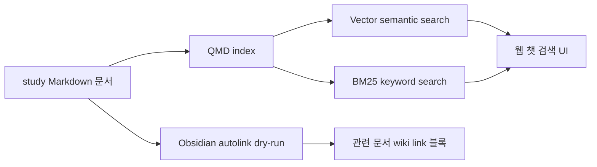
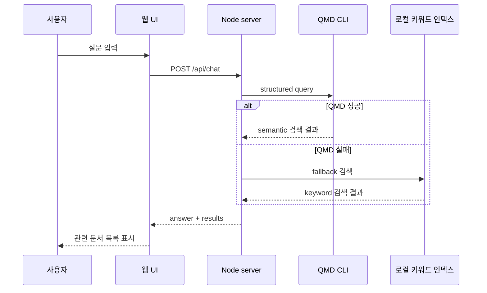
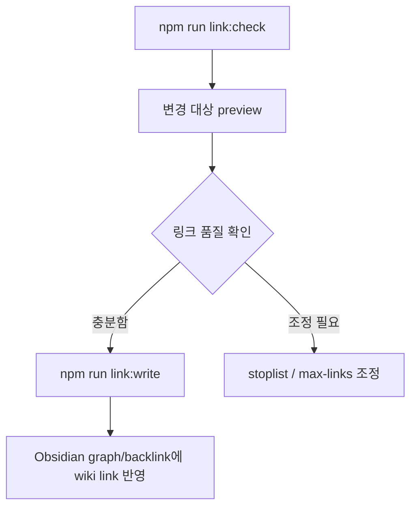

# Study 문서 검색 UI 및 Obsidian 링크 구조 작업 결과

## 1. 한 줄 요약

- `/Users/nes0903/Documents/study` Markdown 문서들을 대상으로 QMD 기반 semantic/vector 검색 인덱스를 만들고, 챗봇형 웹 UI와 Obsidian용 keyword link 생성 스크립트를 추가했다.
- 실제 Markdown 본문 대량 수정은 아직 실행하지 않았고, Obsidian 링크 생성은 dry-run으로 검증된 상태다.



## 2. 사용자 요구사항 대응 상태

| 요구사항 | 처리 상태 | 결과 |
| --- | --- | --- |
| 웹 UI에서 챗봇 형태로 의미검색 기반 문서 표시 | 완료 | `.study-wiki` 로컬 웹 UI 추가, QMD vector 검색 연동 |
| Obsidian에서 study 내부 문서에 키워드별 링크 생성 | 준비 완료 | `autolink.mjs` 추가, dry-run 검증 완료 |
| study 폴더 문서간 링크 구조 완성 가능성 확인 | 가능 | QMD 검색 구조와 Obsidian 링크 생성 루틴 모두 동작 확인 |

## 3. 생성 및 변경한 파일

### 웹 UI 및 검색 서버

- `/Users/nes0903/Documents/study/.study-wiki/package.json`
- `/Users/nes0903/Documents/study/.study-wiki/server.mjs`
- `/Users/nes0903/Documents/study/.study-wiki/public/index.html`
- `/Users/nes0903/Documents/study/.study-wiki/README.md`
- `/Users/nes0903/Documents/study/.study-wiki/.gitignore`

### 자동화 스크립트

- `/Users/nes0903/Documents/study/.study-wiki/scripts/autolink.mjs`
- `/Users/nes0903/Documents/study/.study-wiki/scripts/qmd-setup.mjs`

### QMD 인덱스

- `/Users/nes0903/Documents/study/.qmd/index.sqlite`
- `/Users/nes0903/Documents/study/.qmd/index.yml`

## 4. 웹 UI 동작 구조

- 실행 위치: `/Users/nes0903/Documents/study/.study-wiki`
- 실행 명령:

```bash
npm run dev
```

- 접속 URL:

```text
http://127.0.0.1:4317
```

- UI 동작:
  - `Hybrid`: QMD semantic/vector 검색을 먼저 사용하고, 실패하면 로컬 키워드 검색으로 fallback한다.
  - `Local`: Node 서버 내부의 로컬 Markdown 키워드 인덱스만 사용한다.
  - 검색 결과의 문서 제목을 클릭하면 Markdown 원문을 dialog로 확인할 수 있다.



## 5. QMD semantic index 상태

- `npm run qmd:setup` 실행 완료
  - QMD local index 생성
  - `study` collection 등록
  - Markdown 문서 indexing 완료
- `npm run qmd:embed` 실행 완료
  - embedding model 다운로드
  - vector embedding 생성 완료

확인된 QMD 상태:

```text
Index: /Users/nes0903/Documents/study/.qmd/index.sqlite
Size: 22.5 MB
Documents Total: 424 files indexed
Vectors: 2439 embedded
Collection: study
```

- embedding model cache:

```text
~/.cache/qmd/models/hf_ggml-org_embeddinggemma-300M-Q8_0.gguf
```

## 6. QMD 검색 검증 결과

테스트 query:

```text
BM25와 벡터 검색 차이
```

웹 API 응답 확인:

```text
POST /api/chat
HTTP 200
source: qmd
```

상위 결과:

- `bm25/bm25.md`
- `llm-wiki/04-llm-wiki-v2-rohitg00.md`
- `qmd/qmd.md`

QMD CLI 직접 검증에서도 `qmd/qmd.md`, `bm25/bm25.md` 등 관련 문서가 반환됐다.

## 7. Obsidian keyword link 자동화 상태

추가한 스크립트:

```text
/Users/nes0903/Documents/study/.study-wiki/scripts/autolink.mjs
```

dry-run 명령:

```bash
cd /Users/nes0903/Documents/study/.study-wiki
npm run link:check
```

dry-run 결과:

```text
Would update 383 of 423 markdown files.
Dry run only. Re-run with --write to modify markdown files.
```

생성될 링크 블록 형태:

```md
<!-- study-links:start -->
## 관련 문서

- `keyword`: [[target/path|Target Title]]
<!-- study-links:end -->
```

- 링크는 본문 임의 위치에 직접 삽입하지 않고, 문서 끝의 관리 블록으로 생성한다.
- 같은 블록은 다음 실행 때 다시 계산되어 교체된다.
- 일반적인 영문 잡음 키워드(`api`, `table`, `case`, `create`, `between` 등)는 stoplist로 제외했다.

## 8. 실제 Obsidian 링크 적용 명령

아직 실행하지 않은 명령:

```bash
cd /Users/nes0903/Documents/study/.study-wiki
npm run link:write
```

이 명령을 실행하면 383개 Markdown 파일에 `study-links` 관리 블록이 실제로 쓰인다.



## 9. 검증한 명령

- Node 문법 검사:

```bash
node --check .study-wiki/server.mjs
node --check .study-wiki/scripts/autolink.mjs
node --check .study-wiki/scripts/qmd-setup.mjs
```

- QMD setup:

```bash
npm run qmd:setup
npm run qmd:embed
```

- 링크 dry-run:

```bash
npm run link:check
```

- 웹 API:

```bash
curl http://127.0.0.1:4317/api/status
curl -X POST http://127.0.0.1:4317/api/chat \
  -H 'content-type: application/json' \
  --data '{"message":"BM25와 벡터 검색 차이","mode":"hybrid","limit":3}'
```

- HTML 응답:

```bash
curl -v http://127.0.0.1:4317/
```

## 10. 설계상 결정

- QMD를 primary semantic search engine으로 사용했다.
- 웹 서버는 QMD CLI를 직접 호출하되, `npx`가 매번 registry를 조회하지 않도록 npm npx cache의 QMD entrypoint를 찾아 직접 실행하도록 했다.
- QMD가 실패하면 로컬 키워드 검색으로 fallback한다.
- QMD 점수와 로컬 점수는 서로 비교하지 않고, QMD 결과가 있으면 QMD 순서를 우선한다.
- Obsidian 링크는 inline 치환이 아니라 `관련 문서` 관리 블록으로 생성한다.

## 11. 아직 하지 않은 일

- `npm run link:write`는 실행하지 않았다.
- 따라서 기존 study Markdown 문서 본문에는 아직 자동 링크 블록이 쓰이지 않았다.
- Git staging/commit은 하지 않았다.
- 기존 작업트리 변경으로 보이는 아래 항목은 건드리지 않았다.

```text
D  dubright/README.md
?? .doc/
?? .obsidian/
?? vite/
```

## 12. 다음 실행 순서

1. 웹 UI 사용:

```bash
cd /Users/nes0903/Documents/study/.study-wiki
npm run dev
```

2. 링크 생성 preview:

```bash
cd /Users/nes0903/Documents/study/.study-wiki
npm run link:check
```

3. Obsidian 링크 실제 적용:

```bash
cd /Users/nes0903/Documents/study/.study-wiki
npm run link:write
```

4. 새 문서가 많이 추가된 뒤 QMD 재색인:

```bash
cd /Users/nes0903/Documents/study/.study-wiki
npm run qmd:setup
npm run qmd:embed
```

## 참고 링크

- [QMD 정리 노트](/Users/nes0903/Documents/study/qmd/qmd.md)
- [BM25 정리 노트](/Users/nes0903/Documents/study/bm25/bm25.md)
- [Study Wiki README](/Users/nes0903/Documents/study/.study-wiki/README.md)
