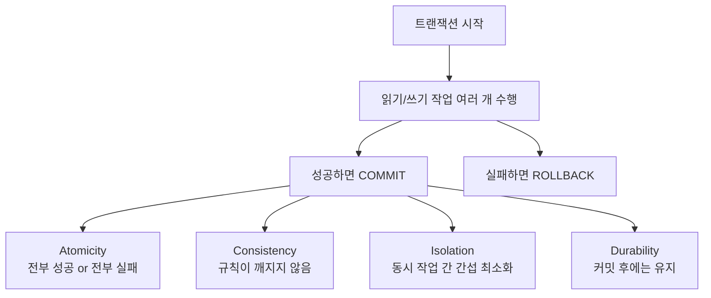
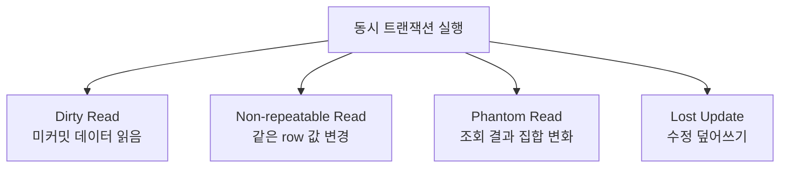
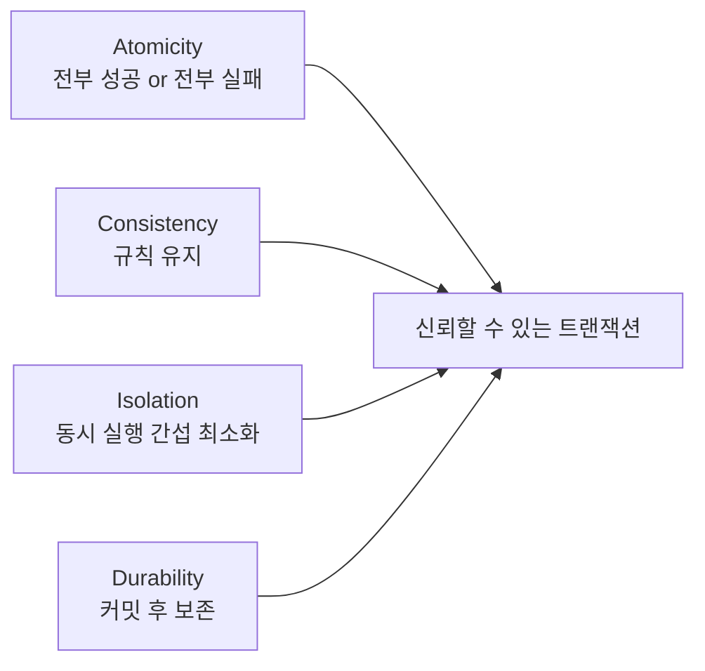

# ACID 트랜잭션 상세 정리

작성 기준일: 2026-04-13  
주요 참고: `SQLite`, `PostgreSQL`, `Datomic`, `MongoDB` 공식 문서

## 1. 한 줄 요약

`ACID 트랜잭션`은 데이터베이스에서 여러 작업을 `하나의 논리적 단위`로 안전하게 처리하기 위해 필요한 네 가지 성질, 즉 `Atomicity`, `Consistency`, `Isolation`, `Durability`를 뜻한다.

짧게 말하면:

- 작업이 반쯤만 반영되지 않아야 하고
- 데이터 규칙이 깨지면 안 되며
- 동시에 여러 사용자가 작업해도 서로 꼬이면 안 되고
- 완료된 변경은 장애가 나도 남아 있어야 한다

는 요구사항을 묶은 개념이다.

---

## 2. 먼저 큰 그림

이 그림에서 중요한 건:

- 트랜잭션은 단일 SQL 문이 아니라 `작업 묶음`일 수 있고
- ACID는 그 묶음이 신뢰 가능하게 동작하도록 하는 보장 집합이라는 점

이다.

---

## 3. 트랜잭션이 왜 필요한가

트랜잭션은 보통 `여러 단계가 하나로 성공해야 하는 작업`에서 필요하다.

예:

- 계좌 이체
- 재고 차감 + 주문 생성
- 게시글 저장 + 첨부파일 메타데이터 저장
- 장바구니 결제 + 포인트 적립 + 주문 로그 기록

이런 작업은 중간까지만 반영되면 안 된다.

### 3.1 대표적인 예: 계좌 이체

예를 들어 A 계좌에서 10만원을 빼고 B 계좌에 10만원을 더하는 상황을 보자.

이때 문제가 생길 수 있다.

- A 계좌 차감은 성공
- B 계좌 입금 직전에 서버 장애

이러면 돈이 사라진다.

즉 이런 작업은:

- 둘 다 성공하거나
- 둘 다 취소되어야 한다

이 요구가 생긴다.

이게 트랜잭션의 출발점이다.

---

## 4. ACID는 무엇의 약자인가

ACID는 다음 네 가지의 약자다.

- `A` = Atomicity
- `C` = Consistency
- `I` = Isolation
- `D` = Durability

### 4.1 외우는 가장 쉬운 방식

- 원자성
- 일관성
- 격리성
- 지속성

또는

- 전부 or 전무
- 규칙 유지
- 동시 실행 분리
- 커밋 후 보존

처럼 외워도 좋다.

---

## 5. Atomicity

`Atomicity`는 보통 `원자성`이라고 번역한다.

핵심 의미:

- 트랜잭션 안의 작업들은 쪼개져 부분 반영되면 안 된다
- 전부 성공하거나, 전부 실패해야 한다

### 5.1 왜 Atomicity가 중요한가

중간 단계에서 장애가 나면 다음 같은 일이 생길 수 있다.

- 재고만 줄고 주문이 없음
- 돈만 빠지고 입금은 안 됨
- 메타데이터만 저장되고 실제 연결된 데이터는 없음

Atomicity는 이런 `반쯤 성공한 상태`를 막는다.

### 5.2 Atomicity의 전형적 구현

데이터베이스는 보통 아래로 구현한다.

- undo log
- rollback journal
- WAL
- transaction log

즉 나중에 실패했을 때 이전 상태로 돌아갈 수 있게 기록을 남긴다.

### 5.3 실무적으로 기억할 말

Atomicity는:

- `all or nothing`

이라는 한 문장으로 기억하면 거의 맞다.

---

## 6. Consistency

`Consistency`는 보통 `일관성`이라고 번역한다.

핵심 의미:

- 트랜잭션 전후에 데이터가 정의된 규칙을 지켜야 한다

즉:

- foreign key
- unique
- check constraint
- business invariant

같은 규칙이 깨진 상태로 커밋되면 안 된다.

### 6.1 자주 생기는 오해

많은 사람이 Consistency를 `모든 복제본이 즉시 같아지는 것`으로 오해한다.

하지만 ACID 문맥의 Consistency는 보통:

- 데이터 무결성 규칙 유지

를 뜻한다.

즉 분산 시스템의 "eventual consistency"와는 다른 말이다.

### 6.2 예시

예:

- 잔액은 음수가 되면 안 된다
- 주문 상세가 있는데 주문 헤더가 없어서는 안 된다
- 회원 ID는 중복되면 안 된다

트랜잭션이 끝난 뒤 이런 규칙이 깨지지 않아야 한다.

### 6.3 Consistency는 누가 책임지나

이 부분이 중요하다.

- 일부는 DB 자체 제약조건이 책임진다
- 일부는 애플리케이션 로직이 책임진다

즉 Consistency는 DB만의 책임이 아니라, 시스템 설계 전체의 책임이기도 하다.

---

## 7. Isolation

`Isolation`은 `격리성`이라고 번역한다.

핵심 의미:

- 동시에 실행되는 여러 트랜잭션이 서로에게 부정확한 영향을 주지 않아야 한다

즉:

- 동시에 작업하더라도
- 마치 순차적으로 실행된 것처럼 보이게 하려는 성질

이다.

### 7.1 왜 중요한가

여러 사용자가 동시에 DB를 쓰면 다음 문제가 생길 수 있다.

- 아직 커밋되지 않은 값을 읽음
- 같은 행을 덮어씀
- 같은 조건 조회 결과가 중간에 바뀜

이걸 막기 위한 축이 Isolation이다.

---

## 8. Isolation에서 자주 나오는 이상 현상

트랜잭션 격리 수준을 이해할 때 자주 등장하는 이상 현상들이 있다.

### 8.1 Dirty Read

- 다른 트랜잭션이 아직 커밋하지 않은 값을 읽는 것

### 8.2 Non-repeatable Read

- 같은 트랜잭션 안에서 같은 row를 두 번 읽었는데 값이 달라지는 것

### 8.3 Phantom Read

- 같은 조건으로 두 번 조회했는데, 중간에 새 row가 들어와 결과 집합이 달라지는 것

### 8.4 Lost Update

- 동시에 수정하다가 한쪽 수정이 덮여 사라지는 것

### 8.5 시각화

---

## 9. 격리 수준(Isolation Level)

Isolation은 보통 단계적으로 제공된다.

대표적으로 많이 나오는 수준은:

- Read Uncommitted
- Read Committed
- Repeatable Read
- Serializable

### 9.1 Read Uncommitted

- 가장 약한 수준
- dirty read 가능성이 있다

### 9.2 Read Committed

- 커밋된 데이터만 읽음
- dirty read는 막지만, non-repeatable read는 생길 수 있다

### 9.3 Repeatable Read

- 같은 row를 반복 읽어도 안정성이 더 높다
- phantom에 대한 처리 방식은 DB마다 다르다

### 9.4 Serializable

- 가장 강한 수준
- 여러 트랜잭션을 순차 실행한 것처럼 보이게 하려는 수준

### 9.5 중요한 점

공식 PostgreSQL 문서도 강조하듯:

- DB마다 실제 구현은 다를 수 있다
- 이름이 같아도 동작이 완전히 동일하다고 보면 안 된다

즉 면접/실무에서는:

- "개념적 수준"
- "특정 DB의 실제 구현"

을 나눠서 이해해야 한다.

---

## 10. Durability

`Durability`는 `지속성`이라고 번역한다.

핵심 의미:

- 트랜잭션이 커밋된 후에는
- 전원 장애나 프로세스 장애가 나도
- 그 결과가 보존되어야 한다

### 10.1 왜 중요한가

예를 들어:

- 사용자는 결제가 성공했다고 봤는데
- 서버가 바로 죽고
- 재시작 후 결제 기록이 사라지면

안 된다.

즉 커밋은 "성공했다고 말할 수 있는 지점"이어야 한다.

### 10.2 어떻게 구현되나

보통:

- transaction log
- fsync
- journaling
- WAL

같은 방식으로 구현된다.

### 10.3 Durability의 비용

Durability는 무료가 아니다.

이유:

- 디스크 동기화
- 로그 기록
- 복구 가능성 유지

때문에 성능 비용이 있다.

즉 성능과 내구성은 종종 tradeoff를 가진다.

---

## 11. 네 가지를 같이 보면

ACID는 네 성질이 합쳐져야 의미가 있다.

예를 들어:

- 원자성만 있고 durability가 없으면
  - 커밋 후 날아갈 수 있다
- durability만 있고 isolation이 약하면
  - 동시성 버그가 생길 수 있다

즉 네 가지는 서로 다른 문제를 해결한다.

---

## 12. 은행 송금 예시로 다시 이해하기

계좌 이체 예시로 네 성질을 한 번에 보면 이해가 쉽다.

### 12.1 Atomicity

- 출금과 입금은 함께 성공해야 한다

### 12.2 Consistency

- 총합이 맞아야 하고
- 잔액 규칙이 깨지면 안 된다

### 12.3 Isolation

- 동시에 여러 이체가 일어나도 계산이 꼬이면 안 된다

### 12.4 Durability

- 완료된 이체는 장애 후에도 남아 있어야 한다

즉 ACID는 실제 비즈니스 작업을 안전하게 만드는 최소 조건이다.

---

## 13. ACID와 CAP, eventual consistency를 혼동하면 안 되는 이유

이 부분이 자주 헷갈린다.

### 13.1 ACID

- 주로 단일 DB 트랜잭션 문맥
- 로컬 트랜잭션의 신뢰성 속성

### 13.2 Eventual Consistency

- 분산 시스템 복제본 간 일관성 모델

### 13.3 CAP

- 분산 시스템의 가용성/일관성/분할 내성 tradeoff

즉:

- ACID의 `Consistency`
- 분산 시스템의 `Consistency`

는 같은 단어지만 같은 개념이 아니다.

이건 실무 면접에서 자주 나오는 함정이다.

---

## 14. ACID를 지원한다고 해서 모든 문제가 끝나지는 않는다

DB가 ACID를 지원해도 애플리케이션이 잘못 짜면 문제가 생긴다.

예:

- 트랜잭션 밖에서 중요한 연산 수행
- 외부 API 호출을 트랜잭션과 섞어 모호하게 처리
- 재시도 로직 없이 deadlock 에러 무시
- business invariant를 DB에 안 걸고 코드에만 두는데, 코드도 불완전

즉 ACID는 매우 중요하지만, `올바른 사용`이 전제되어야 한다.

---

## 15. ACID와 성능은 어떤 관계인가

ACID가 강해질수록 보통 비용이 든다.

### 15.1 Atomicity 비용

- rollback 준비
- log 기록

### 15.2 Consistency 비용

- constraint 검사
- 참조 무결성 관리

### 15.3 Isolation 비용

- lock
- MVCC 관리
- 충돌 검출

### 15.4 Durability 비용

- 디스크 flush
- WAL/journal 동기화

즉 ACID는 공짜가 아니고, DB 엔진은 성능과 안전성의 균형을 맞춘다.

---

## 16. NoSQL은 ACID가 없나

이것도 흔한 오해다.

정답은:

- `없다`가 아니라
- `제공 범위와 강도가 시스템마다 다르다`

이다.

예:

- 문서 단위 ACID
- 단일 row/partition 단위 ACID
- 분산 트랜잭션 제한적 지원

즉 관계형 DB만 ACID를 갖는다고 단순화하면 안 된다.

다만 전통적으로는 관계형 DB가 ACID 트랜잭션의 대표 사례로 많이 설명된다.

---

## 17. SQLite와 PostgreSQL 관점에서 보면

### 17.1 SQLite

공식 SQLite 문서는 `SQLite is transactional`을 매우 강하게 강조한다.

즉 SQLite도 ACID를 지향하는 대표 엔진이다.

다만:

- 동시성 모델은 서버형 DB보다 단순하다

### 17.2 PostgreSQL

PostgreSQL은:

- MVCC
- isolation level
- transaction block

설명이 매우 정교하다.

즉 ACID를 실무적으로 더 확장된 환경에서 보는 예시로 좋다.

---

## 18. 면접/시험에서 자주 묻는 질문

### 18.1 ACID는 무엇인가

좋은 답:

- 데이터베이스 트랜잭션의 신뢰성을 보장하기 위한 네 가지 성질
- Atomicity, Consistency, Isolation, Durability

### 18.2 가장 쉽게 설명하면?

좋은 답:

- 여러 작업을 하나의 단위로 안전하게 처리해서
- 반쯤 성공하거나, 규칙이 깨지거나, 동시성 충돌이 나거나, 커밋 후 사라지는 상황을 막는 개념

### 18.3 Consistency는 무슨 뜻인가

좋은 답:

- 데이터 무결성 규칙이 유지되는 것
- eventual consistency랑은 다른 개념

### 18.4 Isolation이 왜 필요한가

좋은 답:

- 동시에 여러 트랜잭션이 실행될 때 dirty read, lost update 같은 문제를 막기 위해 필요

### 18.5 Durability는 어떻게 보장되나

좋은 답:

- 로그/WAL/journal과 디스크 동기화를 통해 보장한다

---

## 19. 자주 하는 오해

### 19.1 Atomicity와 Durability를 같은 것으로 본다

틀리다.

- Atomicity는 `부분 반영 금지`
- Durability는 `커밋 후 보존`

이다.

### 19.2 Consistency를 복제본 동기화로만 본다

틀리다.

ACID의 Consistency는 보통 `무결성 규칙 유지`를 뜻한다.

### 19.3 Isolation이 무조건 직렬화와 같다

엄밀히는 아니다.

Isolation은 강도가 여러 단계가 있다.

### 19.4 ACID 지원이면 비즈니스 로직도 자동으로 안전하다

틀리다.

트랜잭션 경계와 애플리케이션 설계가 중요하다.

---

## 20. 빠른 복습

- ACID는 `Atomicity`, `Consistency`, `Isolation`, `Durability`
- Atomicity = 전부 성공 or 전부 실패
- Consistency = 규칙 유지
- Isolation = 동시 실행 간섭 최소화
- Durability = 커밋 후 보존
- ACID의 `Consistency`는 distributed system consistency와 다르다
- ACID는 DB만의 문제가 아니라 애플리케이션 트랜잭션 경계 설계와도 연결된다

---

## 21. 참고 링크

- SQLite, Transactional: [링크](https://www.sqlite.org/transactional.html)
- SQLite, Transaction Control: [링크](https://www.sqlite.org/lang_transaction.html)
- PostgreSQL Tutorial, Transactions: [링크](https://www.postgresql.org/docs/current/tutorial-transactions.html)
- PostgreSQL, Transaction Isolation: [링크](https://www.postgresql.org/docs/current/transaction-iso.html)
- Datomic, ACID: [링크](https://docs.datomic.com/transactions/acid.html)
- MongoDB, Transactions: [링크](https://www.mongodb.com/docs/manual/core/transactions/)

