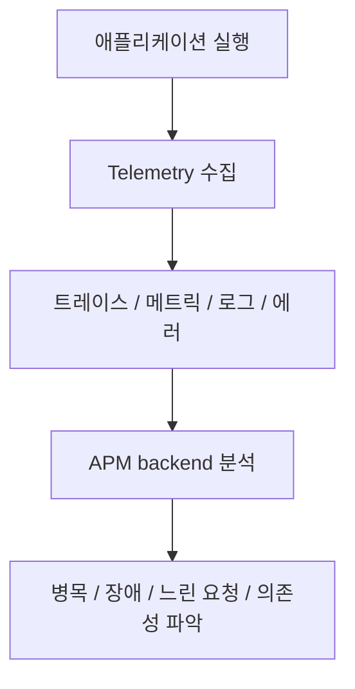
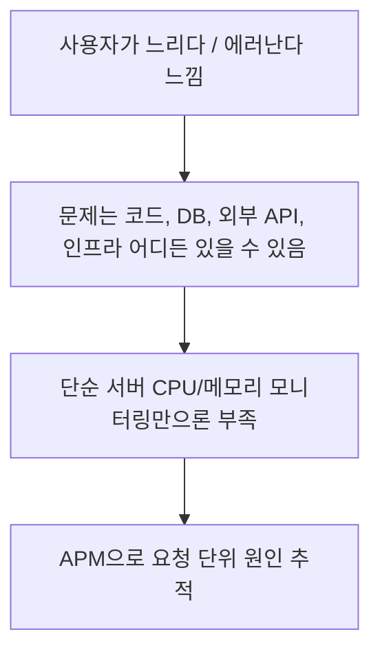
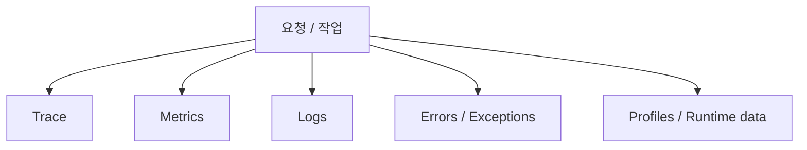
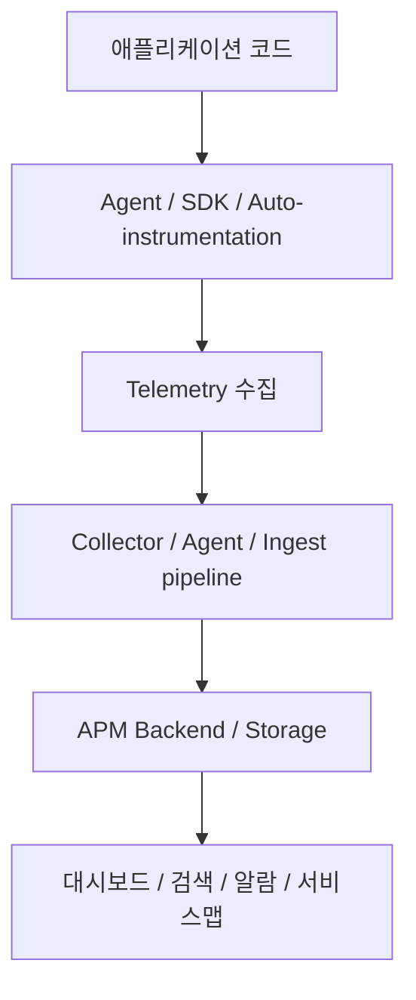
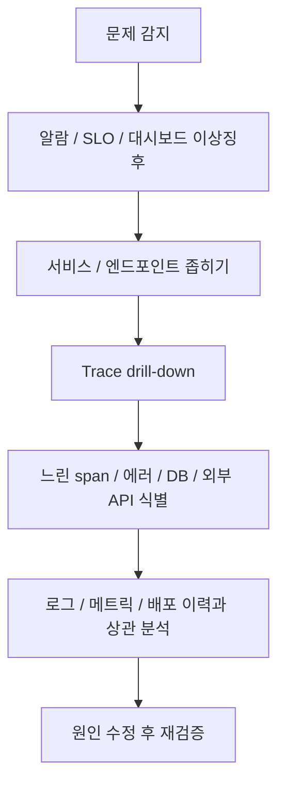
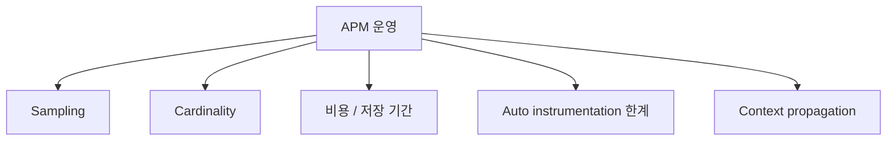
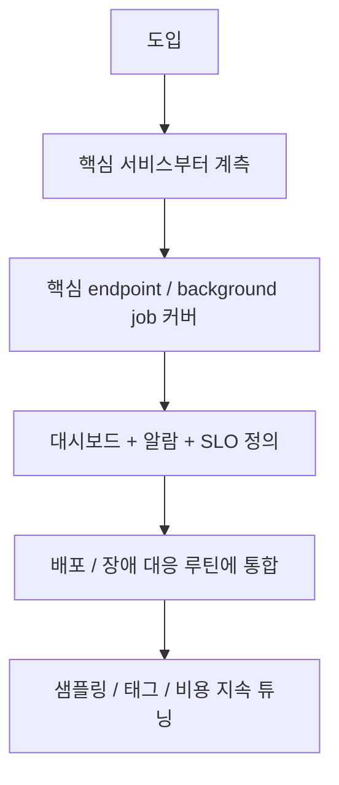

# APM(Application Performance Monitoring) 상세 정리

작성 기준일: 2026-04-20  
조사 방식: 웹검색 기반 최신 조사  
주요 참고: `opentelemetry.io`, `docs.datadoghq.com`, `elastic.co`, `learn.microsoft.com`

## 1. 한 줄 요약

`APM(Application Performance Monitoring)`은 애플리케이션의 응답 시간, 에러, 처리량, 의존성 호출, 분산 추적 정보 등을 수집·분석해서 성능 병목과 장애 원인을 빠르게 찾도록 도와주는 관측(Observability) 실무 체계다.

Elastic 공식 문서는 APM을:

- 애플리케이션과 서비스의 성능 정보를 실시간으로 수집하고
- 응답 시간, DB 쿼리, 외부 HTTP 호출, 캐시 호출, 에러 등을 분석해
- 성능 문제를 빠르게 찾아내게 해 주는 시스템

이라고 설명한다.

Datadog 문서도 비슷하게:

- distributed tracing
- out-of-the-box dashboards
- correlated telemetry

를 통해 bottleneck과 issue를 파악한다고 설명한다.

즉 아주 단순하게 말하면:

- "앱이 느린지, 어디서 느린지, 왜 느린지, 어떤 요청이 깨지는지"

를 production 환경에서 보게 해 주는 체계다.

---

## 2. 왜 APM이 필요한가

OpenTelemetry `Observability primer`는 observability를:

- 시스템 내부를 몰라도 외부에서 질문할 수 있게 하는 능력

이라고 설명한다.

APM은 그중에서도 특히:

- 애플리케이션 요청 흐름
- 서비스 간 호출 관계
- 코드 레벨 지연
- 에러 발생 위치

를 보는 데 초점을 둔다.

### 2.1 인프라 모니터링만으로는 부족한 이유

예를 들어 서버 CPU가 정상이어도:

- 특정 API만 느릴 수 있고
- 특정 SQL 쿼리만 오래 걸릴 수 있고
- 특정 외부 결제 API가 timeout을 낼 수 있다

즉:

- "서버는 멀쩡한데 사용자는 느리다"

는 상황이 흔하다.

### 2.2 분산 시스템에서는 더 중요해진다

현대 서비스는 보통:

- 브라우저 / 모바일
- API 게이트웨이
- 애플리케이션 서버
- DB
- 캐시
- 메시지 큐
- 외부 API

로 쪼개져 있다.

즉 요청 하나가 여러 시스템을 가로지르므로, 단순 로그 몇 줄만으로는 병목을 찾기 어렵다.

### 2.3 한 줄 감각

APM은 "서버가 살아 있나?"가 아니라:

- "사용자 요청이 실제로 어떤 경로를 지나고, 어디에서 느려지고, 왜 실패하는가?"

를 본다.

---

## 3. APM이 실제로 보는 것

APM은 보통 하나의 단일 데이터만 보는 시스템이 아니다.

### 3.1 Trace / Span / Transaction

OpenTelemetry primer와 여러 APM 벤더 문서는 `distributed tracing`을 핵심 기능으로 본다.

- `Trace` = 하나의 요청/작업 전체 흐름
- `Span` = 그 안의 개별 작업 구간
- 일부 제품은 `Transaction`이라는 용어를 쓰기도 함

예:

- 사용자가 `/checkout` 요청
- API 서버 span
- DB query span
- Redis span
- 외부 결제 API span

을 하나의 trace로 엮는다.

### 3.2 Metrics

주로:

- latency
- throughput
- error rate
- request count
- CPU / memory / runtime stats

를 본다.

Datadog trace metrics 문서도:

- request count
- error count
- latency

같은 메트릭을 핵심으로 설명한다.

### 3.3 Logs

OpenTelemetry는 observability의 세 기둥으로:

- traces
- metrics
- logs

를 함께 본다.

즉 APM도 단순 trace UI만이 아니라 로그 상관관계가 중요하다.

### 3.4 Errors / Exceptions

Elastic 문서는 APM이 unhandled errors와 exceptions를 자동 수집한다고 설명한다.

즉 느림뿐 아니라:

- 에러 빈도
- 새로운 에러 종류
- stack trace 기반 그룹화

도 핵심이다.

### 3.5 Runtime / Profile

도구에 따라:

- JVM metrics
- Go runtime metrics
- CPU profile
- memory profile

같은 내부 런타임 데이터도 같이 본다.

즉 APM은 "웹 응답 시간만 보는 도구"가 아니라, 애플리케이션 실행에 대한 다층 관측 체계다.

---

## 4. APM 아키텍처 / 데이터 흐름

현대 APM 아키텍처는 보통 아래 요소로 구성된다.

### 4.1 애플리케이션 계측(Instrumentation)

OpenTelemetry 문서는 앱이 telemetry를 내보내려면 instrumented 되어야 한다고 설명한다.

즉:

- 코드에 SDK를 심거나
- auto-instrumentation agent를 붙이거나
- 프레임워크가 자동 훅을 제공한다

### 4.2 Agent / SDK

Elastic 문서도 APM agent가 요청, DB 호출, 외부 HTTP 등을 수집한다고 설명한다.

이 agent는 보통:

- 언어 런타임 안에서 실행되며
- span/metric/error를 만들고
- backend로 보낸다

### 4.3 Collector / Ingest

OpenTelemetry 생태계에서는:

- application -> OTel SDK
- OTel Collector -> vendor backend

구조가 흔하다.

즉 collector가:

- 수집
- 변환
- 샘플링
- export

를 맡는다.

### 4.4 APM backend

여기서:

- 검색
- 집계
- 서비스맵
- trace drill-down
- alerting

을 제공한다.

즉 운영자가 실제로 보는 UI/DB 계층이다.

### 4.5 왜 아키텍처 이해가 중요하나

APM 문제는 종종:

- agent 설정 문제
- collector 샘플링 문제
- backend retention/cost 문제

로 나타난다.

즉 "도구 깔면 끝"이 아니라 telemetry pipeline 전체를 이해해야 한다.

---

## 5. APM의 기본 워크플로우

좋은 APM은 "대시보드 예쁘게 보는 용도"보다 운영 워크플로우의 일부로 봐야 한다.

### 5.1 1단계: 이상 징후 감지

예:

- p95 latency 급증
- error rate 급증
- 특정 endpoint throughput 급감

즉 보통 메트릭/알람에서 시작한다.

### 5.2 2단계: 영향 범위 좁히기

- 어떤 서비스인가
- 어떤 엔드포인트인가
- 어느 시간대부터인가
- 특정 버전 배포 이후인가

### 5.3 3단계: Trace drill-down

이 단계에서 진짜 APM 가치가 나온다.

- DB span이 느린지
- 외부 API가 timeout인지
- 특정 함수/미들웨어가 병목인지

를 본다.

### 5.4 4단계: Logs/Metrics와 상관 분석

trace 하나만 보면 부족하다.

예:

- trace는 DB가 느리다
- logs는 deadlock 오류를 보여 준다
- infra metrics는 storage IOPS 포화

이렇게 연결돼야 root cause가 잡힌다.

### 5.5 5단계: 수정 후 재검증

APM은 문제 찾기에서 끝나는 게 아니라:

- 수정 전/후 latency 비교
- 에러율 감소 확인
- 서비스 맵 정상화 확인

까지 이어져야 한다.

즉 운영 루프 안에서 돌아가야 의미가 있다.

---

## 6. 중요한 세부사항과 함정

APM은 강력하지만, 운영상 함정도 많다.

### 6.1 Sampling

trace를 100% 다 저장하면 비용이 커질 수 있다.

그래서:

- head-based sampling
- tail-based sampling

같은 전략을 쓴다.

하지만 샘플링이 과하면:

- 중요한 문제 trace를 놓칠 수 있다

즉 비용과 가시성 trade-off가 있다.

### 6.2 Cardinality

APM 태그/속성에 고유값이 너무 많으면:

- storage 비용 증가
- index 부담 증가
- query 성능 저하

가 생긴다.

예:

- userId를 그대로 태그로 넣기
- raw URL path 전체를 고유값으로 남기기

즉 label/tag 설계가 중요하다.

### 6.3 Auto-instrumentation 만능론

자동 계측은 편하지만:

- 비즈니스 핵심 span
- 큐 처리 경계
- custom batch job

같은 건 수동 계측이 더 필요할 수 있다.

즉 "자동 설치만으로 충분할 것"이라고 보면 안 된다.

### 6.4 Context propagation

분산 추적은 서비스 간 상관관계가 핵심이다.

즉:

- trace context header 전파
- async job / queue 전파
- 비동기 태스크 상관관계 유지

가 깨지면 trace가 잘린다.

### 6.5 비용

APM은 보통:

- ingest volume
- retention
- high-cardinality tags
- full-fidelity tracing

에서 비용이 커진다.

즉 관측성이 좋아질수록 비용과 저장 전략도 같이 설계해야 한다.

---

## 7. 실무에서 APM을 어떻게 도입하고 운영하나

APM은 "도구 구매"보다 운영 습관이 중요하다.

### 7.1 도입 순서

보통 아래 순서가 현실적이다.

1. 가장 중요한 서비스 한두 개부터 계측
2. 핵심 요청 흐름과 DB/외부 API를 먼저 커버
3. 에러와 p95 latency 대시보드 구성
4. 알람과 on-call 대응 흐름 연결
5. 비용/샘플링 튜닝

### 7.2 무엇부터 계측해야 하나

우선순위:

- 가장 매출/핵심 사용자 흐름과 가까운 API
- 느려지면 체감이 큰 endpoint
- 장애 시 파급이 큰 background worker

즉 전부 한 번에 하려 하지 말고 중요한 흐름부터 한다.

### 7.3 좋은 APM 운영의 특징

- trace만 보지 않고 logs/metrics를 같이 본다
- 배포 이벤트와 성능 변화를 연결한다
- 지표를 단순 평균보다 percentile 기준으로 본다
- SLO/SLI와 연결해 운영한다

### 7.4 APM만으로 충분한가

아니다.

APM은 observability의 중요한 한 축이지만:

- infra monitoring
- log pipeline
- profiling
- incident process

와 함께 돌아야 한다.

즉 APM은 독립 섬이 아니라 observability stack 일부다.

---

## 참고 링크

- OpenTelemetry Observability Primer: [Observability primer](https://opentelemetry.io/docs/concepts/observability-primer/)
- OpenTelemetry Documentation: [OpenTelemetry Docs](https://opentelemetry.io/docs/)
- Datadog APM Overview: [APM](https://docs.datadoghq.com/tracing/)
- Datadog Trace Metrics: [Trace Metrics](https://docs.datadoghq.com/tracing/metrics/metrics_namespace/)
- Elastic APM Overview: [Application performance monitoring (APM)](https://www.elastic.co/guide/en/apm/guide/current/apm-components.html)
- Elastic APM Product Overview: [What is Application Performance Monitoring?](https://www.elastic.co/what-is/application-performance-monitoring)
- Azure Monitor Application Insights + OpenTelemetry Overview: [Application Insights OpenTelemetry observability overview](https://learn.microsoft.com/en-us/azure/azure-monitor/app/opentelemetry-overview)
