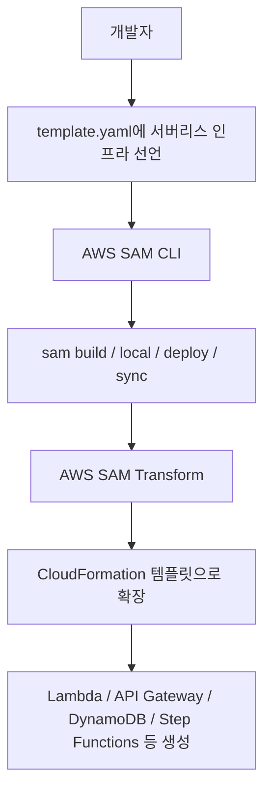
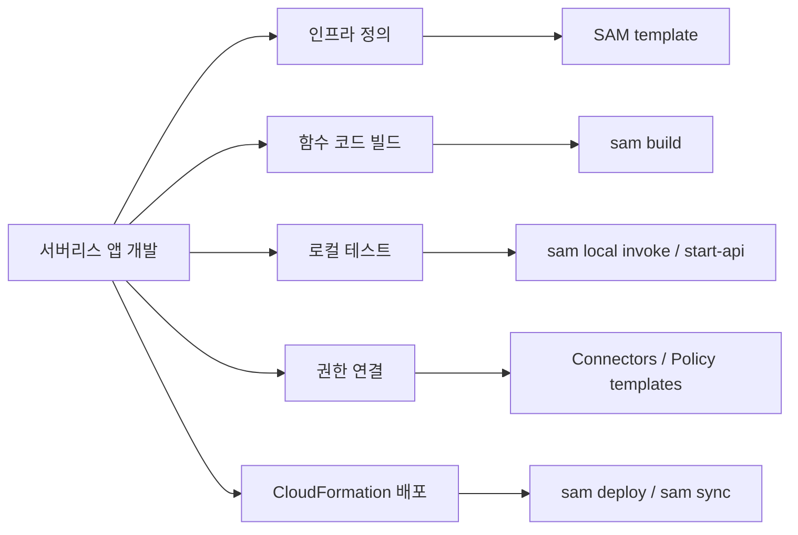
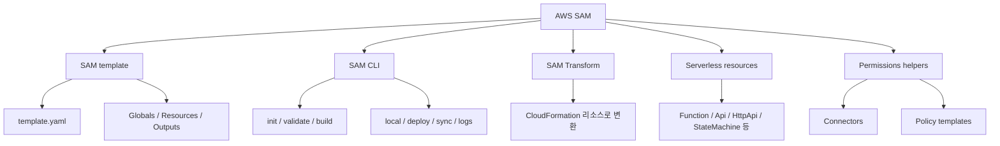
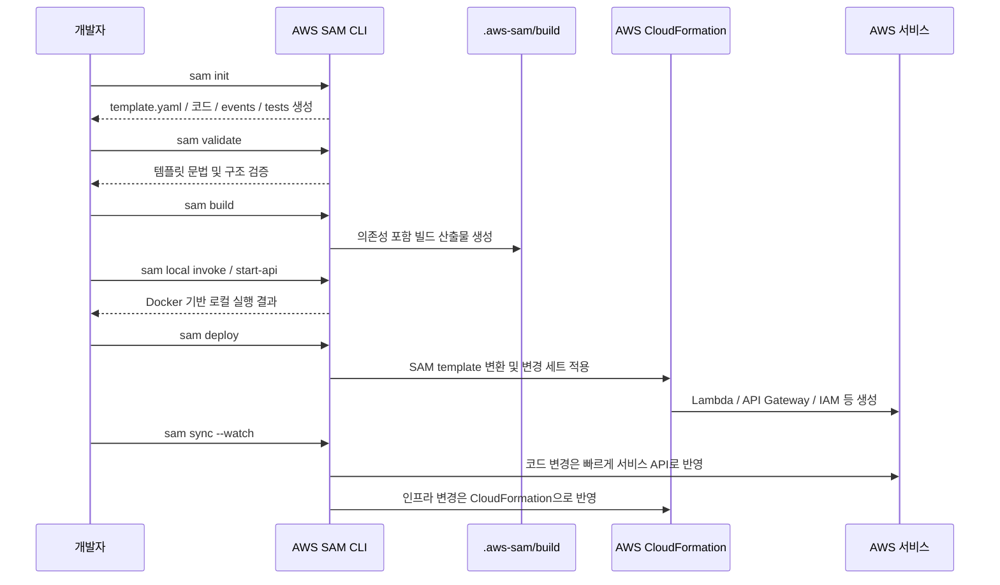
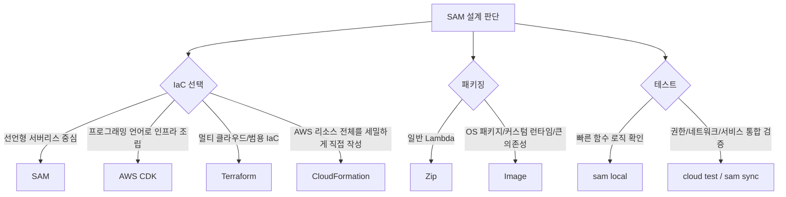
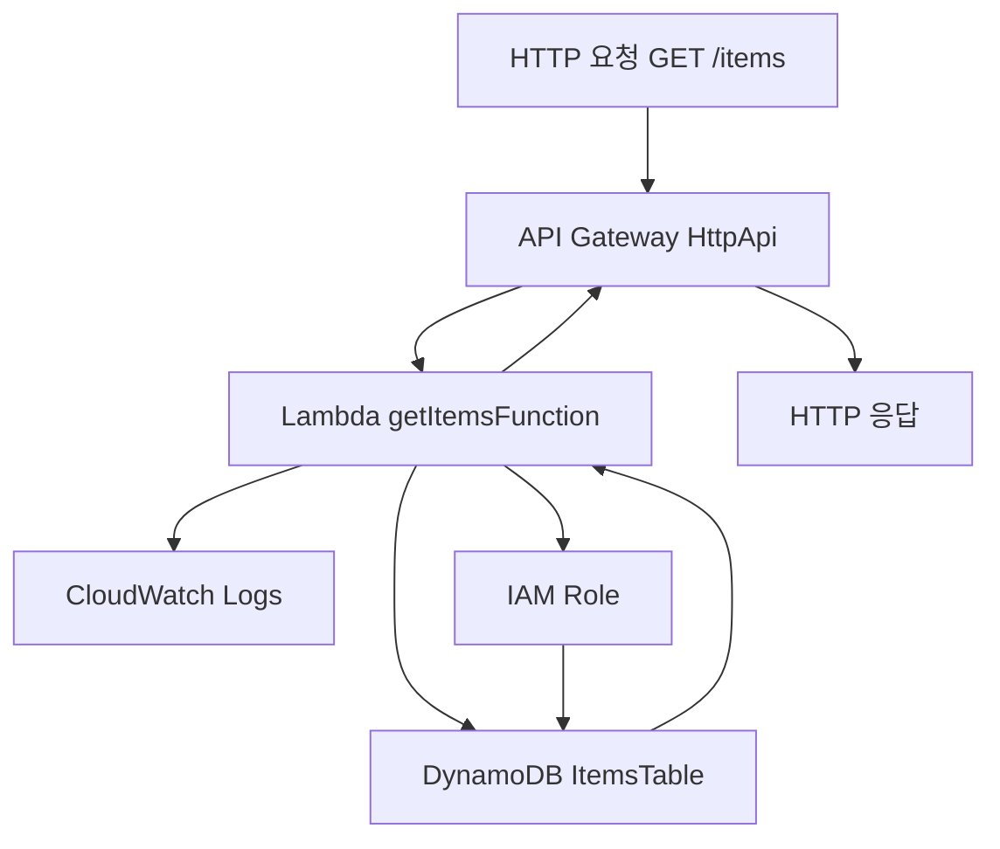
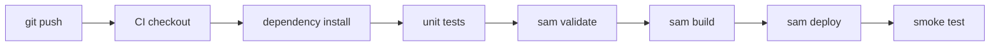
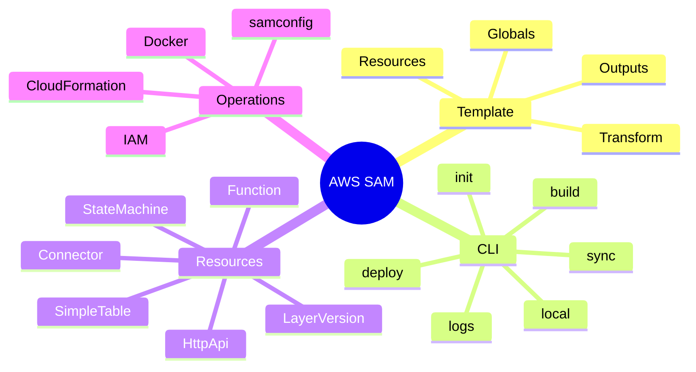

# AWS SAM(Serverless Application Model) 상세 정리

작성 기준일: 2026-05-21  
조사 방식: 웹검색 기반 최신 조사  
주요 참고: `docs.aws.amazon.com` 공식 AWS SAM Developer Guide, AWS SAM CLI 문서, AWS SAM template specification 문서

## 1. 먼저 한 줄 요약



- `AWS SAM(Serverless Application Model)`은 서버리스 애플리케이션을 `Infrastructure as Code(IaC)`로 정의하고, 빌드/로컬 테스트/배포까지 관리하기 위한 AWS의 오픈 소스 프레임워크다.
- 핵심은 두 가지다.
  - `AWS SAM template`: CloudFormation을 기반으로 서버리스 리소스를 짧은 문법으로 선언하는 템플릿
  - `AWS SAM CLI`: `sam init`, `sam build`, `sam local invoke`, `sam deploy`, `sam sync` 같은 명령으로 개발 생명주기를 다루는 CLI
- SAM은 CloudFormation을 대체하는 완전히 별도 시스템이 아니다.
  - SAM template은 CloudFormation template의 확장이다.
  - 배포 시 `Transform: AWS::Serverless-2016-10-31`을 통해 SAM 리소스가 CloudFormation 리소스로 변환된다.
- 아주 짧게 말하면:
  - "Lambda/API Gateway/DynamoDB/Step Functions 같은 서버리스 구성을 CloudFormation보다 간단히 쓰고, 로컬 개발 도구까지 붙인 AWS 서버리스 IaC 도구"

---

## 2. 왜 중요한가



- 서버리스 애플리케이션은 단순히 Lambda 함수 하나를 만드는 것으로 끝나지 않는다.
- 실제 운영 구성에는 보통 아래 요소가 함께 필요하다.
  - Lambda 함수 코드
  - API Gateway REST API / HTTP API / WebSocket API
  - DynamoDB 테이블
  - Step Functions state machine
  - Lambda layer
  - IAM role / policy / permission
  - CloudWatch Logs
  - EventBridge, SQS, SNS, S3 같은 이벤트 소스
  - 배포 환경별 파라미터와 설정
- 이 모든 것을 콘솔에서 수동으로 만들면 다음 문제가 생긴다.
  - 변경 이력이 코드로 남지 않는다.
  - 개발/스테이징/운영 환경을 동일하게 재현하기 어렵다.
  - 권한과 이벤트 연결이 어디서 만들어졌는지 추적하기 어렵다.
  - 배포 자동화와 롤백 전략을 만들기 어렵다.
- CloudFormation만으로도 IaC는 가능하지만, 서버리스 리소스는 선언량이 많아진다.
  - 예를 들어 Lambda + API Gateway + DynamoDB + IAM 권한을 순수 CloudFormation으로 쓰면 리소스가 길고 세밀하다.
  - SAM은 `AWS::Serverless::Function`, `Events`, `Policies`, `Connectors` 같은 추상화로 반복 구성을 줄인다.
- SAM이 중요한 이유는 아래를 하나의 개발 흐름으로 묶어 주기 때문이다.
  - 인프라 선언
  - 함수 의존성 빌드
  - Lambda 로컬 실행
  - API Gateway 로컬 에뮬레이션
  - CloudFormation 배포
  - 빠른 클라우드 동기화
  - 로그/리소스 조회

### SAM이 특히 잘 맞는 상황

- Lambda 중심의 API 서버를 만들 때
- API Gateway + Lambda + DynamoDB 조합을 빠르게 구성할 때
- CloudFormation 호환성을 유지하면서 서버리스 선언량을 줄이고 싶을 때
- 개발자가 선언형 YAML 템플릿을 선호할 때
- 로컬에서 Lambda 함수와 API 이벤트를 빠르게 테스트하고 싶을 때
- CI/CD에서 서버리스 스택을 반복 배포해야 할 때

### SAM이 덜 맞을 수 있는 상황

- 서버리스보다 컨테이너/EKS/ECS 중심 아키텍처가 핵심일 때
- 인프라를 TypeScript/Python 같은 프로그래밍 언어로 조합하고 싶을 때
  - 이 경우 AWS CDK가 더 자연스러울 수 있다.
- 멀티 클라우드 IaC 표준화가 더 중요할 때
  - 이 경우 Terraform이 더 적합할 수 있다.
- Lambda 로컬 에뮬레이션만 필요하고 IaC는 다른 도구로 이미 완성되어 있을 때
  - SAM CLI를 보조 도구로만 사용할 수는 있지만, SAM template을 쓸 때 기능 지원이 가장 넓다.

---

## 3. 핵심 개념



### 3.1 AWS SAM template

- SAM template은 보통 `template.yaml` 또는 `template.yml`로 작성한다.
- CloudFormation template 형식을 따르면서 SAM 전용 구문을 추가로 지원한다.
- SAM template에는 반드시 아래 두 요소가 필요하다.
  - `Transform: AWS::Serverless-2016-10-31`
  - `Resources`
- `Transform`은 CloudFormation에게 이 템플릿에 SAM 변환을 적용하라고 알려 주는 선언이다.
- `Resources`에는 SAM 리소스와 일반 CloudFormation 리소스를 함께 둘 수 있다.
- 즉 SAM template 안에서 아래 두 종류가 공존한다.
  - `AWS::Serverless::*` 리소스
  - `AWS::*::*` 일반 CloudFormation 리소스

### 3.2 AWS SAM CLI

- SAM CLI는 서버리스 애플리케이션의 개발 흐름을 다루는 명령줄 도구다.
- 공식 문서 기준 SAM CLI는 아래 작업을 지원한다.
  - 프로젝트 생성
  - 빌드
  - 템플릿 변환
  - 로컬 테스트
  - 디버깅
  - 패키징
  - 배포
  - 동기화
  - 로그/리소스 확인
  - CI/CD 파이프라인 초기화
- 대표 명령은 아래와 같다.
  - `sam init`: 새 SAM 프로젝트 생성
  - `sam validate`: 템플릿 검증
  - `sam build`: 함수 코드와 의존성 빌드
  - `sam local invoke`: Lambda 함수를 로컬에서 1회 실행
  - `sam local start-api`: API Gateway 이벤트를 로컬 HTTP 서버처럼 실행
  - `sam deploy --guided`: 대화형 배포 설정 후 CloudFormation 배포
  - `sam sync --watch`: 로컬 변경을 클라우드에 지속 동기화
  - `sam logs`: 배포된 함수 로그 조회
  - `sam list`: 배포된 리소스, 엔드포인트, 출력값 조회

### 3.3 AWS SAM Transform

- SAM은 배포 시 템플릿을 그대로 리소스로 만드는 것이 아니라, 먼저 CloudFormation 리소스로 확장한다.
- 예를 들어 `AWS::Serverless::Function`은 기본적으로 `AWS::Lambda::Function`으로 변환된다.
- 함수에 API 이벤트를 붙이면 추가로 아래 같은 리소스가 생성될 수 있다.
  - API Gateway 리소스
  - Lambda invoke permission
  - IAM role / policy
  - Lambda alias / version
  - CodeDeploy deployment preference 관련 리소스
- 따라서 SAM은 "짧게 쓰는 문법"이지만, 실제 배포와 상태 관리는 CloudFormation이 수행한다.

### 3.4 주요 SAM 리소스

| SAM 리소스 | 주 용도 | 변환되는 대표 AWS 리소스 |
|---|---|---|
| `AWS::Serverless::Function` | Lambda 함수 정의 | `AWS::Lambda::Function` |
| `AWS::Serverless::Api` | API Gateway REST API | `AWS::ApiGateway::RestApi` |
| `AWS::Serverless::HttpApi` | API Gateway HTTP API | `AWS::ApiGatewayV2::Api` |
| `AWS::Serverless::WebSocketApi` | API Gateway WebSocket API | `AWS::ApiGatewayV2::Api` 계열 |
| `AWS::Serverless::SimpleTable` | 단순 DynamoDB 테이블 | `AWS::DynamoDB::Table` |
| `AWS::Serverless::StateMachine` | Step Functions state machine | `AWS::StepFunctions::StateMachine` |
| `AWS::Serverless::LayerVersion` | Lambda layer | `AWS::Lambda::LayerVersion` |
| `AWS::Serverless::Application` | 중첩 서버리스 앱 | `AWS::CloudFormation::Stack` |
| `AWS::Serverless::Connector` | 리소스 간 권한 연결 | IAM policy 등 |
| `AWS::Serverless::GraphQLApi` | GraphQL API 구성 | AppSync 계열 리소스 |
| `AWS::Serverless::CapacityProvider` | Lambda capacity provider | `AWS::Lambda::CapacityProvider` |

### 3.5 `Globals`

- `Globals`는 SAM template에만 있는 섹션이다.
- 여러 함수나 API에 공통으로 적용할 속성을 한 번에 선언한다.
- 예를 들어 모든 함수에 공통으로 아래 값을 줄 수 있다.
  - `Runtime`
  - `Timeout`
  - `MemorySize`
  - `Environment`
  - `Tracing`
  - `VpcConfig`
  - `Layers`
- 장점:
  - 중복 설정을 줄인다.
  - 여러 함수의 기본 운영 정책을 한곳에서 맞춘다.
- 주의:
  - 리소스별 설정이 `Globals`보다 더 구체적인 경우, 리소스 단위 설정으로 덮어쓸 수 있다.

### 3.6 권한 도우미: Connectors와 Policy templates

- 서버리스 앱에서는 "함수가 어떤 리소스를 읽고 쓸 수 있는가"가 중요하다.
- SAM은 권한 작성을 단순화하기 위해 두 가지 방식을 제공한다.
- `Connectors`
  - 소스 리소스와 대상 리소스를 연결하고, `Read`/`Write` 의도를 선언한다.
  - SAM이 필요한 IAM 정책을 구성한다.
  - 지원되는 조합이면 가장 간단한 방식이다.
- `Policy templates`
  - `DynamoDBCrudPolicy`, `S3ReadPolicy` 같은 사전 정의된 권한 템플릿을 함수나 state machine에 붙인다.
  - connector보다 세밀한 CRUD 권한이 필요할 때 유용하다.
- 더 복잡하거나 connector/policy template으로 표현이 어려운 경우에는 일반 CloudFormation 방식으로 IAM role/policy를 직접 작성한다.

---

## 4. 아키텍처와 동작 흐름



### 4.1 일반적인 프로젝트 구조

- `sam init`으로 프로젝트를 만들면 보통 아래와 비슷한 구조가 생긴다.

```text
sam-app/
├── README.md
├── events/
├── hello_world/
│   ├── app.py
│   └── requirements.txt
├── tests/
├── template.yaml
└── samconfig.toml
```

- 핵심 파일은 아래와 같다.
  - `template.yaml`: 인프라와 이벤트 연결 정의
  - 함수 코드 디렉터리: Lambda handler와 의존성 파일
  - `events/`: 로컬 테스트용 이벤트 JSON
  - `tests/`: 단위 테스트 또는 통합 테스트
  - `samconfig.toml`: 배포/빌드/동기화 기본 파라미터 저장

### 4.2 템플릿 기본 구조

```yaml
AWSTemplateFormatVersion: '2010-09-09'
Transform: AWS::Serverless-2016-10-31
Description: Simple AWS SAM application

Globals:
  Function:
    Runtime: python3.12
    Timeout: 10
    MemorySize: 256

Resources:
  HelloWorldFunction:
    Type: AWS::Serverless::Function
    Properties:
      CodeUri: hello_world/
      Handler: app.lambda_handler
      Events:
        HelloApi:
          Type: HttpApi
          Properties:
            Path: /hello
            Method: GET

Outputs:
  HelloApiUrl:
    Description: API endpoint
    Value: !Sub "https://${ServerlessHttpApi}.execute-api.${AWS::Region}.amazonaws.com/hello"
```

- 위 예시는 SAM의 핵심을 잘 보여 준다.
  - `Transform`으로 SAM template임을 선언한다.
  - `Globals.Function`으로 함수 공통 설정을 둔다.
  - `AWS::Serverless::Function`으로 Lambda를 선언한다.
  - `Events.HttpApi`로 API Gateway HTTP API 이벤트를 함수에 연결한다.
  - 명시적으로 API 리소스를 선언하지 않아도 SAM이 기본 `ServerlessHttpApi`를 생성할 수 있다.

### 4.3 빌드 흐름

- `sam build`는 함수 코드와 의존성을 다음 단계에서 쓸 수 있는 형태로 정리한다.
- 빌드 결과는 기본적으로 `.aws-sam` 디렉터리에 생성된다.
- `PackageType`에 따라 산출물 방식이 다르다.
  - `Zip`: 코드와 의존성을 `.zip` 배포 패키지로 준비한다.
  - `Image`: Lambda용 컨테이너 이미지를 빌드한다.
- 네이티브 바이너리 의존성이 있으면 `sam build --use-container`를 고려한다.
  - 예: Python 패키지 중 OS/아키텍처별 native extension이 있는 경우
  - Docker 컨테이너 안에서 Lambda와 유사한 환경으로 빌드한다.
- 컨테이너 이미지 방식에서는 `Metadata`에 `Dockerfile`, `DockerContext`, `DockerTag` 등을 지정한다.

### 4.4 로컬 테스트 흐름

- `sam local invoke`는 Lambda 함수를 로컬에서 1회 실행한다.
- `sam local start-api`는 API Gateway 이벤트를 로컬 HTTP API처럼 띄운다.
- SAM CLI는 Docker를 사용해 Lambda 런타임과 유사한 컨테이너를 실행한다.
- 로컬 테스트의 장점:
  - 빠른 함수 로직 확인
  - API 이벤트 형태 확인
  - 환경 변수 파일을 넣어 로컬에서 재현
  - 디버거와 연동 가능
- 로컬 테스트의 한계:
  - 실제 IAM 권한, VPC 네트워크, 관리형 서비스 동작을 완전히 검증하지는 못한다.
  - 공식 문서도 가능한 한 클라우드 환경 테스트를 병행하라고 권장한다.

### 4.5 배포 흐름

- `sam deploy`는 CloudFormation을 사용해 애플리케이션을 AWS에 배포한다.
- 첫 배포에서는 보통 `sam deploy --guided`를 사용한다.
- `--guided`는 아래 설정을 대화형으로 받는다.
  - stack name
  - AWS Region
  - 변경 세트 확인 여부
  - IAM role 생성 허용 여부
  - rollback 정책
  - 설정을 `samconfig.toml`에 저장할지 여부
- 배포 시 IAM 리소스를 만들 수 있으면 `CAPABILITY_IAM` 또는 `CAPABILITY_NAMED_IAM` 승인이 필요하다.
- 중첩 애플리케이션을 포함하면 `CAPABILITY_AUTO_EXPAND`가 필요할 수 있다.

### 4.6 빠른 개발 동기화 흐름

- `sam sync`는 로컬 변경을 AWS Cloud로 동기화한다.
- `sam sync --watch`는 변경을 감시하다가 자동으로 반영한다.
- 동작 방식은 변경 종류에 따라 다르다.
  - 코드 변경: AWS 서비스 API를 직접 사용해 빠르게 반영할 수 있다.
  - 인프라 변경: CloudFormation을 통해 반영한다.
- `sam sync`는 개발/검증 속도를 높이는 데 유용하지만, 운영 배포의 최종 절차는 보통 CI/CD와 `sam deploy` 중심으로 정리하는 편이 안전하다.

---

## 5. 중요한 세부사항, edge case, tradeoff



### 5.1 SAM과 CloudFormation의 관계

- SAM은 CloudFormation 위에 올라간다.
- SAM template은 CloudFormation template과 호환되는 구조를 유지한다.
- SAM 전용 리소스는 배포 과정에서 CloudFormation 리소스로 확장된다.
- 그래서 SAM을 쓸 때도 CloudFormation의 기본 개념을 알아야 한다.
  - stack
  - change set
  - parameter
  - output
  - intrinsic function
  - rollback
  - IAM capability
  - drift와 stack 상태
- SAM을 제대로 운영하려면 "SAM이 다 해 준다"보다 "SAM이 CloudFormation 작성을 줄여 준다"로 이해하는 편이 정확하다.

### 5.2 SAM vs CloudFormation

| 구분 | SAM | 순수 CloudFormation |
|---|---|---|
| 목적 | 서버리스 앱 작성 간소화 | AWS 리소스 범용 IaC |
| 문법 | CloudFormation + `AWS::Serverless::*` shorthand | 모든 리소스를 직접 선언 |
| Lambda/API 연결 | `Events`로 간단히 연결 | API Gateway, permission 등을 직접 구성 |
| 로컬 테스트 | SAM CLI가 강점 | 별도 도구 필요 |
| 범용성 | 서버리스에 최적화 | AWS 전체 리소스에 가장 범용 |
| 실제 배포 엔진 | CloudFormation | CloudFormation |

- 서버리스 비중이 높으면 SAM이 간단하다.
- 서버리스 외 리소스가 많아도 SAM template 안에 일반 CloudFormation 리소스를 같이 넣을 수 있다.
- 하지만 서버리스 추상화 밖의 복잡한 구성은 결국 CloudFormation 문법으로 돌아간다.

### 5.3 SAM vs AWS CDK

| 구분 | SAM | AWS CDK |
|---|---|---|
| 작성 방식 | 선언형 YAML/JSON | TypeScript/Python/Java/C# 등 코드 |
| 사고방식 | 템플릿 중심 | construct와 프로그래밍 추상화 중심 |
| 로컬 Lambda 테스트 | SAM CLI 기본 기능 | `cdk synth` 후 SAM CLI로 일부 로컬 테스트 가능 |
| 학습 포인트 | CloudFormation + SAM spec | CDK construct + CloudFormation |
| 잘 맞는 팀 | YAML IaC와 서버리스 중심 팀 | 코드로 인프라를 조립하고 재사용하려는 팀 |

- SAM은 템플릿이 명시적이고 리뷰하기 쉽다.
- CDK는 복잡한 인프라 패턴을 코드로 추상화하기 좋다.
- 둘은 완전히 배타적이지 않다.
  - CDK 앱을 CloudFormation으로 synth한 뒤 SAM CLI의 로컬 테스트 기능을 일부 활용할 수 있다.

### 5.4 Zip vs Image 패키징

| 기준 | `Zip` | `Image` |
|---|---|---|
| 기본 성격 | Lambda 런타임 위에 코드와 의존성 업로드 | 런타임/OS 계층까지 이미지로 패키징 |
| 템플릿 설정 | `Runtime`, `Handler`, `CodeUri` 중심 | `PackageType: Image`, `Metadata` 중심 |
| 장점 | 단순하고 빠름 | 커스텀 런타임/시스템 패키지/복잡한 의존성에 유리 |
| 주의점 | native dependency 빌드 환경 주의 | 이미지 크기, ECR, Dockerfile 관리 필요 |
| 빌드 보조 | `sam build --use-container` | `sam build`가 Dockerfile 기반 빌드 |

- 대부분의 간단한 Lambda는 `Zip`이 먼저다.
- OS 패키지, 커스텀 바이너리, 이미지 기반 배포 표준이 필요한 경우 `Image`를 고려한다.

### 5.5 로컬 테스트의 신뢰 범위

- `sam local`은 매우 유용하지만 실제 AWS와 완전히 동일하지 않다.
- 로컬에서 잘 되는 것:
  - handler 입력/출력 검증
  - 이벤트 JSON 파싱
  - 환경 변수 주입
  - 함수 코드 로직 확인
  - API 라우팅 형태 확인
- 로컬만으로 부족한 것:
  - IAM 권한 실제 적용
  - VPC 서브넷/보안 그룹/NAT 구성
  - Lambda와 AWS 관리형 서비스의 실제 통합 동작
  - CloudWatch Logs, X-Ray, throttling, concurrency 같은 운영 특성
  - EventBridge/SQS/SNS/S3의 실제 이벤트 전달 특성
- 그래서 실무에서는 보통 아래 흐름을 쓴다.
  - 단위 테스트로 순수 로직 확인
  - `sam local`로 이벤트/handler 확인
  - `sam sync`나 dev stack으로 클라우드 통합 확인
  - CI/CD에서 `sam validate`, 테스트, `sam deploy` 실행

### 5.6 권한 관리 판단

- 지원되는 단순 리소스 간 `Read`/`Write` 관계라면 `Connectors`가 가장 간단하다.
- Lambda나 Step Functions가 특정 AWS 리소스에 CRUD 권한을 가져야 한다면 `Policy templates`가 편하다.
- 더 세밀한 조건, 리소스 ARN, condition, cross-account 권한이 필요하면 IAM policy를 직접 작성한다.
- 운영 기준에서는 어떤 방식을 쓰든 아래를 확인해야 한다.
  - 최소 권한 원칙
  - wildcard 사용 여부
  - stage/prod 리소스 분리
  - secret 접근 범위
  - 로그와 tracing 권한
  - 배포 role과 실행 role 분리

### 5.7 `samconfig.toml`

- `samconfig.toml`은 SAM CLI 명령 파라미터를 프로젝트 단위로 저장하는 파일이다.
- 기본 위치는 `template.yaml`과 같은 프로젝트 루트다.
- 예시:

```toml
version = 0.1

[default.global.parameters]
stack_name = "sam-app"
region = "ap-northeast-2"

[default.build.parameters]
cached = true
parallel = true

[default.deploy.parameters]
capabilities = "CAPABILITY_IAM"
confirm_changeset = true
resolve_s3 = true

[dev.sync.parameters]
watch = true

[prod.sync.parameters]
watch = false
```

- 환경을 나누면 `--config-env dev`, `--config-env prod`처럼 명령별 기본값을 다르게 둘 수 있다.
- 주의:
  - 민감한 비밀값을 `samconfig.toml`에 넣지 않는다.
  - profile/region/stack name을 명시해 실수로 다른 계정이나 리전에 배포하지 않게 한다.

---

## 6. 실전 예시



### 6.1 HTTP API + Lambda + DynamoDB 예시

- 요구사항:
  - `GET /items` 요청을 받는다.
  - Lambda 함수가 DynamoDB 테이블을 조회한다.
  - 필요한 읽기 권한은 SAM policy template으로 부여한다.

```yaml
AWSTemplateFormatVersion: '2010-09-09'
Transform: AWS::Serverless-2016-10-31
Description: Items API example with AWS SAM

Globals:
  Function:
    Runtime: nodejs22.x
    Architectures:
      - x86_64
    Timeout: 10
    MemorySize: 256
    Environment:
      Variables:
        TABLE_NAME: !Ref ItemsTable

Resources:
  GetItemsFunction:
    Type: AWS::Serverless::Function
    Properties:
      CodeUri: src/get-items/
      Handler: app.handler
      Policies:
        - DynamoDBReadPolicy:
            TableName: !Ref ItemsTable
      Events:
        GetItemsApi:
          Type: HttpApi
          Properties:
            Path: /items
            Method: GET

  ItemsTable:
    Type: AWS::Serverless::SimpleTable
    Properties:
      PrimaryKey:
        Name: id
        Type: String

Outputs:
  ItemsApiUrl:
    Description: Items API endpoint
    Value: !Sub "https://${ServerlessHttpApi}.execute-api.${AWS::Region}.amazonaws.com/items"
```

- 이 템플릿이 표현하는 것:
  - `GetItemsFunction`: Lambda 함수
  - `GetItemsApi`: API Gateway HTTP API 이벤트
  - `ItemsTable`: DynamoDB 테이블
  - `DynamoDBReadPolicy`: 함수가 테이블을 읽을 수 있는 IAM 권한
  - `ItemsApiUrl`: 배포 후 확인할 API URL

### 6.2 개발 명령 흐름

```bash
sam init
sam validate
sam build
sam local invoke GetItemsFunction --event events/http-api-get-items.json
sam local start-api
sam deploy --guided
sam list endpoints
sam logs --stack-name sam-app --tail
sam sync --watch
```

- 명령별 의미:
  - `sam init`
    - 새 프로젝트를 만든다.
  - `sam validate`
    - SAM template을 검증한다.
  - `sam build`
    - 함수 코드와 의존성을 `.aws-sam` 아래에 빌드한다.
  - `sam local invoke`
    - 이벤트 JSON으로 Lambda를 로컬 실행한다.
  - `sam local start-api`
    - 로컬 HTTP API 서버를 띄운다.
  - `sam deploy --guided`
    - CloudFormation 스택으로 처음 배포하고 설정을 저장한다.
  - `sam list endpoints`
    - 배포된 API 엔드포인트를 확인한다.
  - `sam logs`
    - CloudWatch Logs를 조회한다.
  - `sam sync --watch`
    - 개발 중 변경을 클라우드 dev stack에 빠르게 반영한다.

### 6.3 `sam local invoke` 이벤트 예시

```json
{
  "version": "2.0",
  "routeKey": "GET /items",
  "rawPath": "/items",
  "requestContext": {
    "http": {
      "method": "GET",
      "path": "/items"
    }
  },
  "queryStringParameters": {
    "limit": "10"
  }
}
```

- 이 이벤트는 API Gateway HTTP API v2 형태를 흉내 낸다.
- handler에서는 보통 아래를 확인한다.
  - `event.requestContext.http.method`
  - `event.rawPath`
  - `event.queryStringParameters`
  - `event.body`
  - `event.headers`

### 6.4 Connector 방식 예시

- 같은 읽기 권한을 connector로 표현하면 "어떤 리소스가 어떤 리소스를 읽고 쓰는지"를 더 아키텍처적으로 표현할 수 있다.

```yaml
Resources:
  GetItemsFunction:
    Type: AWS::Serverless::Function
    Properties:
      CodeUri: src/get-items/
      Handler: app.handler
      Runtime: nodejs22.x
      Events:
        GetItemsApi:
          Type: HttpApi
          Properties:
            Path: /items
            Method: GET
    Connectors:
      ItemsReadConnector:
        Properties:
          Destination:
            Id: ItemsTable
          Permissions:
            - Read

  ItemsTable:
    Type: AWS::Serverless::SimpleTable
```

- connector는 지원되는 리소스 조합에서 권한 작성을 줄여 준다.
- 복잡한 권한 조건이 필요하면 직접 IAM policy를 작성하는 편이 더 명확할 수 있다.

### 6.5 CI/CD에서의 기본 흐름



- 최소 파이프라인:
  - 의존성 설치
  - 단위 테스트
  - `sam validate`
  - `sam build`
  - `sam deploy --no-confirm-changeset`
  - 배포 후 smoke test
- 운영 환경에서는 아래를 더 고려한다.
  - 배포 role 분리
  - stage/prod stack 분리
  - `samconfig.toml` 환경 분리
  - CloudFormation change set 확인
  - Lambda alias와 traffic shifting
  - API 인증/인가 검증
  - rollback 정책

---

## 7. 용어집과 빠른 복습



### 7.1 주요 용어

| 용어 | 의미 |
|---|---|
| `AWS SAM` | AWS 서버리스 앱을 위한 오픈 소스 IaC 프레임워크 |
| `AWS SAM CLI` | SAM 프로젝트를 생성/빌드/테스트/배포/동기화하는 명령줄 도구 |
| `SAM template` | 서버리스 리소스를 선언하는 CloudFormation 확장 템플릿 |
| `Transform` | SAM 구문을 CloudFormation 리소스로 변환하도록 지정하는 선언 |
| `Globals` | 함수/API/테이블/state machine 등에 공통 속성을 적용하는 SAM 전용 섹션 |
| `AWS::Serverless::Function` | Lambda 함수를 간결하게 정의하는 SAM 리소스 |
| `Events` | Lambda 함수에 API, SQS, S3, EventBridge 같은 이벤트 소스를 연결하는 속성 |
| `Connectors` | 리소스 간 `Read`/`Write` 권한을 간단히 선언하는 SAM 권한 추상화 |
| `Policy templates` | 자주 쓰는 IAM 권한 묶음을 SAM이 제공하는 템플릿 |
| `.aws-sam` | `sam build`가 생성하는 빌드 산출물 디렉터리 |
| `samconfig.toml` | SAM CLI 명령의 기본 파라미터를 저장하는 설정 파일 |
| `CAPABILITY_IAM` | CloudFormation이 IAM 리소스를 만들 수 있음을 사용자가 승인하는 capability |
| `sam sync` | 로컬 변경을 AWS Cloud dev stack에 빠르게 동기화하는 명령 |

### 7.2 빠른 복습

- SAM은 CloudFormation 기반이다.
- SAM은 서버리스 리소스를 짧은 문법으로 선언하게 해 준다.
- `Transform: AWS::Serverless-2016-10-31`이 SAM template의 핵심 표시다.
- `sam build`는 `.aws-sam` 빌드 산출물을 만든다.
- `sam local invoke`와 `sam local start-api`는 Docker 기반 로컬 테스트에 사용한다.
- 로컬 테스트는 빠르지만 IAM/VPC/관리형 서비스 통합을 완전히 검증하지 못한다.
- `sam deploy`는 CloudFormation으로 실제 AWS 리소스를 배포한다.
- `sam sync --watch`는 개발 중 빠른 클라우드 검증에 유용하다.
- 권한은 가능한 경우 `Connectors` 또는 `Policy templates`로 시작하고, 복잡하면 IAM을 직접 작성한다.
- 운영에서는 `samconfig.toml`, 환경별 stack, 최소 권한, change set, CI/CD, 로그/모니터링을 함께 설계해야 한다.

### 7.3 기억할 판단 기준

| 질문 | 판단 |
|---|---|
| Lambda/API Gateway 중심인가? | SAM이 잘 맞는다. |
| CloudFormation 호환성이 중요한가? | SAM이 자연스럽다. |
| 인프라를 프로그래밍 언어로 추상화하고 싶은가? | CDK를 검토한다. |
| 멀티 클라우드 IaC가 중요한가? | Terraform을 검토한다. |
| 로컬에서 Lambda 이벤트를 빨리 확인하고 싶은가? | SAM CLI가 유용하다. |
| 실제 권한/VPC/서비스 통합까지 확인해야 하는가? | dev stack에 배포해 테스트한다. |
| 단순 권한 연결인가? | Connectors 또는 policy templates를 먼저 본다. |
| 세밀한 IAM 조건이 필요한가? | CloudFormation IAM policy를 직접 작성한다. |

---

## 8. 참고 링크

- [What is the AWS Serverless Application Model (AWS SAM)? - AWS 공식 문서](https://docs.aws.amazon.com/serverless-application-model/latest/developerguide/what-is-sam.html)
- [How AWS SAM works - AWS 공식 문서](https://docs.aws.amazon.com/serverless-application-model/latest/developerguide/what-is-sam-overview.html)
- [AWS SAM template anatomy - AWS 공식 문서](https://docs.aws.amazon.com/serverless-application-model/latest/developerguide/sam-specification-template-anatomy.html)
- [AWS SAM resources and properties - AWS 공식 문서](https://docs.aws.amazon.com/serverless-application-model/latest/developerguide/sam-specification-resources-and-properties.html)
- [Generated CloudFormation resources for AWS SAM - AWS 공식 문서](https://docs.aws.amazon.com/serverless-application-model/latest/developerguide/sam-specification-generated-resources.html)
- [AWS SAM CLI - AWS 공식 문서](https://docs.aws.amazon.com/serverless-application-model/latest/developerguide/using-sam-cli.html)
- [Default build with AWS SAM - AWS 공식 문서](https://docs.aws.amazon.com/serverless-application-model/latest/developerguide/serverless-sam-cli-using-build.html)
- [Introduction to testing with sam local invoke - AWS 공식 문서](https://docs.aws.amazon.com/serverless-application-model/latest/developerguide/using-sam-cli-local-invoke.html)
- [sam deploy - AWS SAM CLI command reference](https://docs.aws.amazon.com/serverless-application-model/latest/developerguide/sam-cli-command-reference-sam-deploy.html)
- [sam sync - AWS SAM CLI command reference](https://docs.aws.amazon.com/serverless-application-model/latest/developerguide/sam-cli-command-reference-sam-sync.html)
- [AWS SAM prerequisites - AWS 공식 문서](https://docs.aws.amazon.com/serverless-application-model/latest/developerguide/prerequisites.html)
- [AWS SAM CLI configuration file - AWS 공식 문서](https://docs.aws.amazon.com/serverless-application-model/latest/developerguide/serverless-sam-cli-config.html)
- [Set up and manage resource access in your AWS SAM template - AWS 공식 문서](https://docs.aws.amazon.com/serverless-application-model/latest/developerguide/sam-permissions.html)
- [Managing resource permissions with AWS SAM connectors - AWS 공식 문서](https://docs.aws.amazon.com/serverless-application-model/latest/developerguide/managing-permissions-connectors.html)
