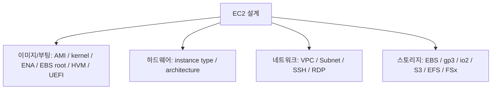
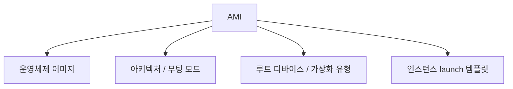
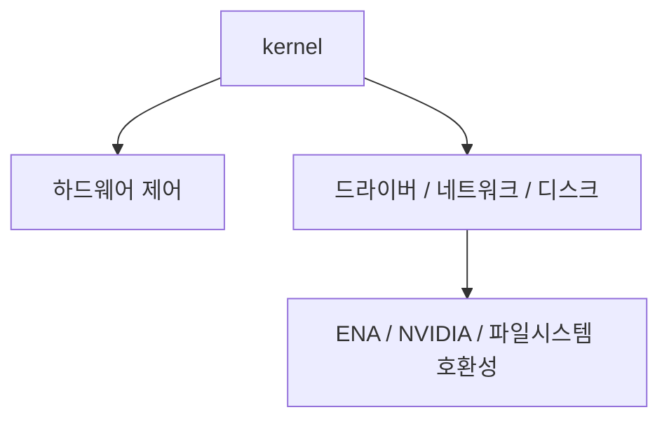
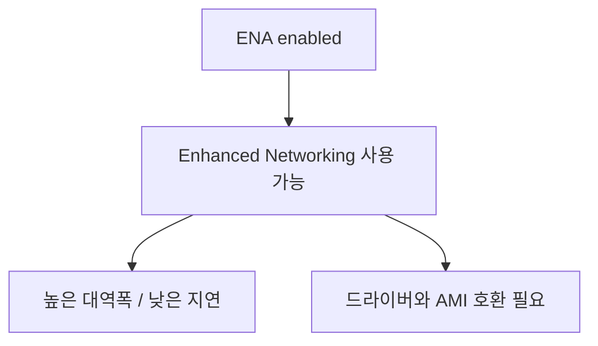
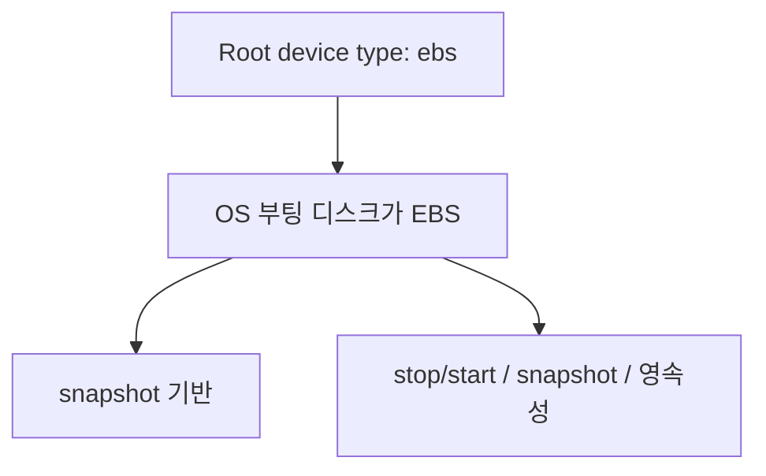
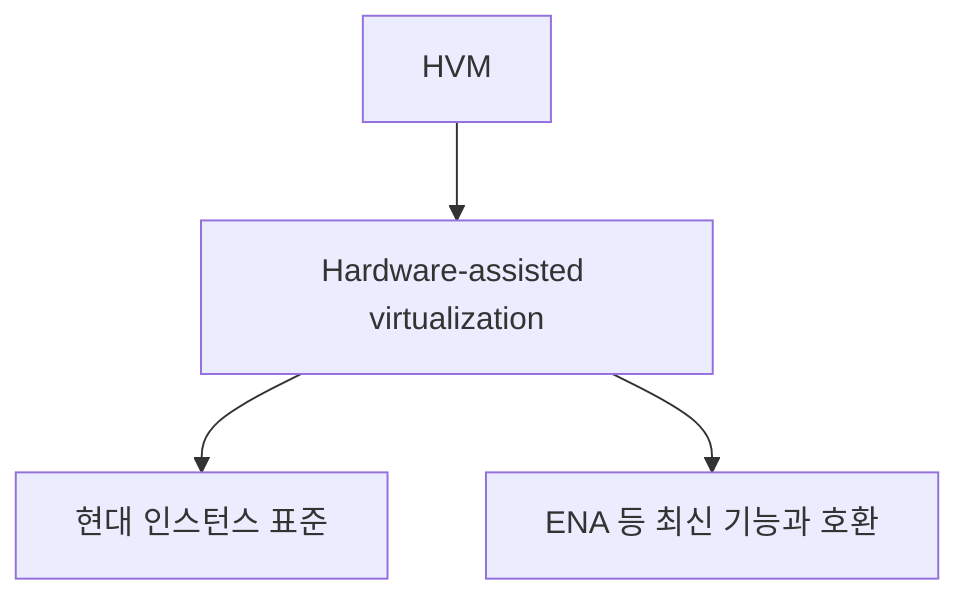

# AWS EC2 관련 용어 상세 정리

작성 기준일: 2026-04-15  
조사 방식: 웹검색 기반 최신 조사  
주요 참고: `docs.aws.amazon.com` 공식 EC2 / VPC / EBS / EFS / FSx / DLAMI 문서

## 1. 문서 목적


이 문서는 EC2를 쓰다가 콘솔이나 문서에서 자주 보지만 애매하게 느껴지는 용어를 한 파일에 정리한 학습 문서다.

특히 아래 항목을 EC2 관점에서 설명한다.

1. `AMI`
2. `kernel`
3. `ENA enabled: true`
4. `Root device type: ebs`
5. `Virtualization type: hvm`
6. `uefi-preferred`
7. `Deep Learning Base AMI with Single CUDA`
8. `64-bit (x86)` vs `64-bit (Arm)`
9. `VPC`
10. `Subnet`
11. `SSH`, `RDP`
12. `t2.micro` 같은 EC2 인스턴스 타입 체계
13. `EBS`
14. `gp3`, `gp2`, `io1`, `io2`, `IOPS`
15. EC2에서 같이 보는 파일/스토리지 옵션 `S3`, `EFS`, `FSx`

이 문서는 단순 정의만 적는 것이 아니라, "EC2 콘솔에서 이 필드를 보면 어떤 뜻으로 읽어야 하는가"를 중심으로 정리한다.

---

## 2. 먼저 큰 그림



EC2 관련 용어는 크게 네 묶음으로 나눠서 보면 이해가 쉽다.

### 2.1 인스턴스를 띄우기 전에 고르는 것

- `AMI`
- 아키텍처 (`x86_64`, `arm64`)
- boot mode (`uefi`, `uefi-preferred`, `legacy-bios`)
- virtualization type (`hvm`)
- root device type (`ebs`, 예전엔 `instance store`)

즉 "어떤 운영체제 이미지로 어떤 하드웨어/펌웨어 스타일에 맞춰 띄울 것인가"를 정하는 항목이다.

### 2.2 인스턴스 자체 크기와 하드웨어

- `t2.micro`
- `m6i.large`
- `c7g.xlarge`

즉 CPU, 메모리, 네트워크, EBS 성능이 얼마나 필요한지와 관련 있다.

### 2.3 네트워크 위치와 접속

- `VPC`
- `Subnet`
- `SSH`
- `RDP`

즉 "이 인스턴스가 어느 네트워크에 있고, 내가 어떻게 들어갈 것인가"를 다룬다.

### 2.4 스토리지

- `EBS`
- `gp3`, `gp2`, `io1`, `io2`
- `S3`
- `EFS`
- `FSx`

즉 부팅 디스크, 데이터 디스크, 공유 파일 시스템, 오브젝트 스토리지를 구분해야 한다.

---

## 3. AMI



### 3.1 AMI란

AWS 공식 EC2 문서는 `AMI(Amazon Machine Image)`를 "EC2 인스턴스를 설정하고 부팅하는 데 필요한 소프트웨어를 제공하는 이미지"라고 설명한다.

즉 아주 단순하게 말하면:

- EC2용 OS 이미지
- + 부팅 정보
- + 루트 디스크 매핑 정보

를 묶은 템플릿이다.

### 3.2 왜 중요한가

EC2 인스턴스를 띄울 때는 반드시 어떤 AMI를 쓸지 정해야 한다.

AMI가 사실상 결정하는 것:

- 운영체제 종류 (Amazon Linux, Ubuntu, Windows 등)
- CPU 아키텍처 호환성 (`x86_64`, `arm64`)
- 루트 디바이스 유형
- 가상화 유형
- 부팅 모드
- 기본 설치 소프트웨어

즉 EC2를 띄운다는 것은 사실상 "어떤 AMI에서 출발할 것인가"를 결정하는 일이다.

### 3.3 AWS 문서 기준 AMI 특징

AWS EC2 문서는 AMI가 아래 특성에 종속된다고 설명한다.

- Region
- Operating system
- Processor architecture
- Root volume type
- Virtualization type

즉 `AMI ID`는 Region마다 다르고, `x86_64` AMI를 `arm64` 인스턴스에 그냥 쓰면 안 된다.

### 3.4 AMI를 어디서 가져오나

보통 아래 출처가 있다.

- AWS 제공 공식 AMI
- Marketplace AMI
- 다른 계정이 공유한 AMI
- 내가 직접 만든 Custom AMI

실무에서는:

- 빠른 시작용: AWS 공식 AMI
- 운영 표준화: Custom AMI

흐름이 많다.

### 3.5 콘솔에서 AMI를 볼 때 읽어야 할 것

AMI를 고를 때는 최소한 아래를 같이 본다.

- OS
- Architecture
- Root device type
- Virtualization type
- Boot mode
- 추가 소프트웨어 포함 여부

즉 "Ubuntu냐 AL2023냐"만 보면 부족하다.

---

## 4. kernel



### 4.1 kernel이란

`kernel`은 운영체제의 핵심(core) 부분이다.

아주 간단히 말하면:

- CPU, 메모리, 프로세스 관리
- 디스크/네트워크 드라이버 관리
- 시스템 콜 처리

를 맡는 OS의 가장 낮은 층이다.

즉 사용자 프로그램과 하드웨어 사이의 핵심 제어층이다.

### 4.2 EC2에서 kernel을 왜 보게 되나

EC2 / AMI 문맥에서 kernel이 중요해지는 이유는 아래와 같다.

- ENA 같은 네트워크 드라이버 호환성
- NVIDIA 드라이버 / CUDA 호환성
- UEFI 부팅 지원 여부
- 파일시스템/스토리지 성능
- 보안 패치 수준

즉 "같은 Ubuntu 22.04"여도 kernel 버전에 따라 드라이버/성능/보안이 달라질 수 있다.

### 4.3 AWS 문서에서 kernel이 보이는 방식

일반 EC2 AMI 선택 화면에서는 보통 OS 중심으로 보지만, Deep Learning AMI release notes 같은 문서에서는 `kernel_version`이 명시적으로 나온다.

예를 들어 AWS DLAMI 문서는:

- x86_64 예시 릴리스 페이지에서 `kernel_version`
- arm64 예시 릴리스 페이지에서 `kernel_version`

을 명시한다.

즉 GPU/드라이버 민감 워크로드에서는 kernel 버전이 매우 중요하다.

### 4.4 실무 감각

EC2에서 kernel은 보통 이런 의미로 읽으면 된다.

- "이 인스턴스 OS가 실제로 어떤 드라이버/부팅/네트워크 기능을 쓸 수 있느냐"

즉 단순 정보가 아니라, ENA/NVMe/NVIDIA/EFA 같은 저수준 기능과 연결된 운영체제 핵심 버전이다.

### 4.5 콘솔/문서에서 kernel이 애매할 때

사용자가 콘솔에서 kernel이 애매하다고 느끼는 경우는 보통 두 가지다.

- AMI/OS 레벨 정보로 kernel 버전을 직접 못 봄
- kernel이 "AWS 전용 개념"처럼 보임

하지만 kernel은 AWS 전용 필드가 아니라 OS 자체의 핵심 구성요소다.

EC2에서는 특히:

- AMI가 어떤 kernel 계열을 포함하는지
- 그 kernel이 ENA/드라이버/부팅 모드를 지원하는지

가 중요하다.

---

## 5. ENA 활성화: true



### 5.1 ENA란

AWS EC2 문서는 ENA를 `Elastic Network Adapter`라고 설명한다.

이는 EC2의 `enhanced networking`을 위한 네트워크 어댑터다.

### 5.2 enhanced networking이란

AWS 문서 기준 enhanced networking은 SR-IOV 기반으로:

- 더 높은 대역폭
- 더 높은 PPS(packet per second)
- 더 낮은 지연(latency)
- 더 낮은 CPU 사용량

을 제공한다.

즉 "기본 가상 NIC보다 훨씬 성능 좋은 네트워크 경로"라고 이해하면 된다.

### 5.3 `ENA enabled: true`가 의미하는 것

AMI나 인스턴스 정보에서 `enaSupport` 또는 콘솔의 ENA 지원이 `true`면:

- 이 AMI/인스턴스가 ENA enhanced networking을 사용할 준비가 되어 있다는 뜻

이다.

실무적으로는:

- ENA 드라이버 포함
- 지원 OS/커널 사용
- 지원 인스턴스 타입 사용

조건이 맞아야 한다.

### 5.4 Nitro와 ENA 관계

AWS 문서는 모든 Nitro 기반 인스턴스가 ENA를 사용한다고 설명한다.

즉 현재 세대 인스턴스 대부분은 ENA가 사실상 기본 감각이다.

### 5.5 언제 신경 써야 하나

- 네트워크 성능이 중요한 서비스
- 고성능 NIC가 필요한 워크로드
- 오래된 AMI를 재사용할 때
- 커스텀 AMI를 만들 때

특히 오래된 커스텀 Linux AMI는 ENA 드라이버가 없거나 `enaSupport` 속성이 꺼져 있을 수 있다.

### 5.6 실무 요약

`ENA enabled: true`는 좋은 뜻이다.

보통:

- 현대적인 AMI
- 현대적인 네트워크 드라이버
- Nitro 기반 성능 활용 가능

정도로 읽으면 된다.

---

## 6. 루트 디바이스 유형: ebs



### 6.1 root device란

AWS EC2 문서는 root volume을 "인스턴스를 부팅하는 데 사용되는 이미지가 들어 있는 루트 볼륨"이라고 설명한다.

즉 root device/root volume은:

- OS가 설치된 메인 부팅 디스크

라고 생각하면 된다.

### 6.2 `Root device type: ebs` 의미

AWS 문서 기준 루트 디바이스 유형이 `ebs`면:

- 이 AMI로 띄운 인스턴스의 루트 디스크가 EBS 볼륨이라는 뜻

이다.

즉 OS 디스크가 EBS snapshot 기반으로 만들어진다.

### 6.3 왜 좋은가

AWS는 EBS-backed AMI를 권장한다.

이유:

- 부팅 빠름
- 스냅샷 기반 관리 쉬움
- 영속 스토리지
- stop/start 가능
- 볼륨 분리 관리 가능

즉 현재 일반적인 EC2 운영에서는 root device type이 `ebs`인 경우가 사실상 기본이다.

### 6.4 `instance store`와 차이

예전에는 root volume이 instance store인 AMI도 있었다.

하지만 AWS 문서는 Nitro 기반 인스턴스는 EBS root volumes만 지원한다고 설명한다.

즉 현재 세대에서는:

- `ebs`가 표준
- `instance store root`는 역사적/예외적

이라고 봐도 된다.

### 6.5 콘솔에서 어떻게 읽나

`Root device type: ebs`를 보면:

- "이건 휘발성 임시 디스크 부팅이 아니라 EBS 기반 부팅 이미지구나"

라고 이해하면 된다.

---

## 7. 가상화: hvm



### 7.1 HVM이란

AWS EC2 문서는 AMI virtualization type으로 `PV`와 `HVM` 두 종류를 설명한다.

`HVM`은 `Hardware Virtual Machine`이다.

### 7.2 무엇이 다른가

AWS 문서 기준 HVM은:

- 하드웨어 지원 가상화 기술을 활용하고
- 더 나은 CPU/네트워크/스토리지 성능을 활용할 수 있으며
- enhanced networking 같은 기능에도 필요

하다.

### 7.3 지금은 왜 거의 다 HVM인가

AWS 문서는 current generation instance types가 `HVM only`라고 설명한다.

즉 현재 세대 인스턴스에서는:

- HVM이 사실상 표준
- PV는 레거시

라고 보면 된다.

### 7.4 실무 의미

`Virtualization: hvm`이면 보통 좋은 신호다.

즉:

- 최신 인스턴스와 잘 맞고
- ENA 같은 기능을 쓸 수 있고
- 성능상 유리

하다.

### 7.5 콘솔에서 이 값이 중요한 이유

AMI가 HVM이 아니면:

- 최신 인스턴스 타입과 호환 안 되거나
- 기대한 네트워크/스토리지 성능이 안 나오거나
- 아예 launch 불가

할 수 있다.

즉 현재는 HVM이 기본값처럼 읽으면 된다.

---

## 8. `uefi-preferred`

### 8.1 boot mode란

AWS EC2 문서는 부팅 모드 소프트웨어의 두 변형으로:

- `UEFI`
- `Legacy BIOS`

를 설명한다.

AMI에는 `boot mode` 파라미터가 있을 수 있다.

### 8.2 가능한 값

AWS 문서 기준 AMI boot mode 값은:

- `uefi`
- `legacy-bios`
- `uefi-preferred`

이다.

### 8.3 `uefi-preferred`의 정확한 의미

AWS 문서는 `uefi-preferred`가:

- UEFI와 Legacy BIOS 둘 다 지원하는 AMI

를 뜻한다고 설명한다.

그리고 실제 부팅은:

- 인스턴스 타입이 둘 다 지원하면 UEFI로 부팅
- Legacy BIOS만 지원하면 Legacy BIOS로 부팅

한다.

### 8.4 언제 유용한가

이 값은 "호환성 폭을 넓히고 싶을 때" 유용하다.

즉 같은 AMI를:

- 비교적 최신 인스턴스 타입
- 일부 레거시 인스턴스 타입

모두에 대응시키고 싶을 때 좋다.

### 8.5 실무 감각

`uefi-preferred`를 보면:

- "UEFI를 우선 쓰되, 필요하면 legacy도 커버 가능한 이미지"

로 읽으면 된다.

단, OS가 양쪽 부팅을 모두 지원해야 의미가 있다.

---

## 9. Deep Learning Base AMI with Single CUDA

### 9.1 정체

AWS DLAMI 문서는 `AWS Deep Learning Base AMI with Single CUDA` 계열을 제공한다.

이 이름을 뜯어 보면:

- `Deep Learning`
- `Base AMI`
- `Single CUDA`

라는 세 가지 키워드가 있다.

### 9.2 `Base AMI`라는 뜻

이 AMI는 보통 "딥러닝용 완성형 프레임워크 번들"보다 더 베이스에 가까운 이미지다.

즉:

- OS
- NVIDIA driver
- CUDA stack
- 컨테이너 툴킷, EFA 관련 구성

같은 GPU 기본 토대를 제공하고, 프레임워크는 사용자가 더 얹는 방식으로 이해하면 된다.

이 설명은 AWS의 이름과 release notes 패키지 목록에서 자연스럽게 읽을 수 있는 해석이다.

### 9.3 `Single CUDA`라는 뜻

AWS release notes는 이 AMI에서:

- `default_cuda`
- `nvidia_cuda_stack`

를 하나의 기본 경로로 노출한다.

예를 들어 x86_64 예시 release notes(2026-01-02)에는 `/usr/local/cuda-13.0/`가 기본 CUDA stack으로 나온다.

즉 `Single CUDA`는 보통:

- 여러 CUDA 버전을 잔뜩 같이 넣어 둔 이미지가 아니라
- 한 기본 CUDA stack을 중심으로 구성된 베이스 이미지

로 이해하면 된다.

이 부분은 공식 명명과 패키지 테이블을 바탕으로 한 해석이다.

### 9.4 왜 쓰나

적합한 경우:

- GPU 인스턴스에서 직접 환경 세팅을 빨리 시작하고 싶을 때
- PyTorch / TensorFlow를 직접 버전 맞춰 설치하고 싶을 때
- Docker 기반 GPU 워크로드 베이스 이미지가 필요할 때

### 9.5 AWS 문서에서 확인되는 예시

AWS DLAMI release notes에는 보통 이런 정보가 나온다.

- supported EC2 instances
- compute_architecture
- kernel_version
- nvidia_driver
- default_cuda
- ebs_volume_type

즉 딥러닝 AMI는 단순 "OS 이미지"가 아니라 GPU 드라이버/커널 호환성이 중요한 워크로드용 curated image다.

### 9.6 현재 문서에서 보이는 아키텍처

AWS DLAMI 문서는 현재:

- x86_64 계열 Single CUDA Base AMI
- arm64 / aarch64 계열 Single CUDA Base AMI

둘 다 제공한다.

즉 GPU 워크로드에서도 아키텍처 선택을 해야 한다.

---

## 10. 아키텍처: 64비트(x86) vs 64비트(Arm)

### 10.1 AWS 콘솔에서 보이는 의미

AMI 찾기 문서에서 AWS는 architecture 예시로:

- `64-bit (x86)`
- `64-bit (Arm)`

같은 필터를 제공한다.

즉 이 값은 "이 AMI가 어떤 CPU 명령어 집합용으로 만들어졌는가"를 뜻한다.

### 10.2 `x86_64`

`x86_64`는:

- Intel
- AMD

기반 64비트 아키텍처다.

AWS EC2 문서에서도 인스턴스 family summary에 Intel/AMD `(x86_64)`라고 표기한다.

장점:

- 가장 넓은 소프트웨어 호환성
- 오래된 상용 소프트웨어 지원이 많음
- Windows/Linux 모두 폭넓게 사용

### 10.3 `arm64`

`arm64`는 AWS 문서에서 보통 Graviton 기반 인스턴스와 연결된다.

즉:

- AWS Graviton 프로세서
- arm64 / aarch64 아키텍처

라고 이해하면 된다.

### 10.4 EC2에서 중요한 이유

아키텍처가 다르면 아래가 전부 영향을 받는다.

- AMI 호환성
- OS 패키지
- Docker 이미지 태그
- 바이너리/라이브러리 호환성
- 드라이버 지원

즉 `x86_64` AMI를 `arm64` 인스턴스에 그냥 쓰는 식은 안 된다.

### 10.5 실무 선택 기준

대체로:

- 가장 넓은 호환성이 필요 -> `x86_64`
- arm64 지원이 확실하고 Graviton 계열을 쓰려 함 -> `arm64`

로 시작하면 된다.

### 10.6 DLAMI 관점

AWS DLAMI release notes도:

- x86_64 release
- aarch64/arm64 release

를 분리해 제공한다.

즉 GPU AMI도 아키텍처 구분이 매우 중요하다.

---

## 11. VPC

### 11.1 VPC란

AWS VPC 문서는 VPC를 "AWS 계정 안에서 정의하는 논리적으로 격리된 가상 네트워크"라고 설명한다.

즉 아주 간단히 말하면:

- AWS 안의 내 사설 네트워크

다.

### 11.2 왜 중요한가

EC2는 거의 항상 VPC 안에서 뜬다.

즉 인스턴스를 만들 때 사실상 함께 정하는 것:

- 어느 네트워크에 넣을지
- 어떤 IP 대역을 쓸지
- 인터넷에 열지 말지
- 다른 리소스와 어떻게 통신할지

이다.

### 11.3 VPC가 자동으로 가지는 것

AWS 문서는 각 VPC가 기본적으로 아래 리소스를 가진다고 설명한다.

- default DHCP option set
- default network ACL
- default security group
- main route table

즉 VPC는 그냥 "CIDR 박스 하나"가 아니라, 라우팅/보안의 기본 컨테이너다.

### 11.4 실무 감각

`VPC`를 보면:

- "이 EC2가 어느 논리 네트워크 경계 안에 있는가"

를 의미한다고 보면 된다.

---

## 12. 서브넷

### 12.1 Subnet이란

AWS 문서는 subnet을 "VPC 안의 IP 주소 범위"라고 설명한다.

즉 VPC를 더 잘게 나눈 네트워크 조각이다.

### 12.2 중요한 제약

AWS VPC 문서는 각 subnet이:

- 하나의 Availability Zone에 완전히 속해야 하며
- 여러 AZ를 가로지를 수 없다고

설명한다.

즉 subnet은 AZ 단위다.

### 12.3 왜 중요한가

EC2 인스턴스는 특정 subnet에 배치된다.

즉 subnet이 사실상 결정하는 것:

- 인스턴스가 어느 AZ에 뜨는지
- 어떤 IP 대역을 받는지
- 퍼블릭/프라이빗 설계
- 어떤 라우트 테이블을 타는지

### 12.4 퍼블릭/프라이빗 subnet 감각

AWS 문서는 subnet types와 routing을 설명한다.

실무 감각으로는:

- 인터넷 게이트웨이로 나가는 경로가 있고 퍼블릭 IP를 붙이는 용도면 public subnet
- 외부에서 직접 접근 못 하게 두면 private subnet

으로 이해하면 된다.

### 12.5 실무 요약

- VPC = 큰 네트워크
- Subnet = 그 안의 AZ 단위 작은 네트워크

라고 보면 된다.

---

## 13. SSH, RDP

### 13.1 SSH

AWS EC2 문서는 Linux 인스턴스 연결 기본 방식으로 SSH를 설명한다.

즉:

- 리눅스/유닉스 계열 인스턴스 접속
- 터미널 명령 실행
- 파일 전송(SCP 등)

에 쓴다.

### 13.2 EC2에서 Linux 접속 방식

AWS 문서 기준 Linux EC2 접속은 보통:

- 일반 SSH client
- EC2 Instance Connect
- EC2 Instance Connect Endpoint

등으로 할 수 있다.

### 13.3 EC2 Instance Connect

AWS 문서는 EC2 Instance Connect가:

- IAM 정책으로 SSH 접근을 제어하고
- 임시 공개키를 인스턴스 메타데이터에 푸시해
- SSH 접속하게 해 준다고 설명한다.

즉 전통적인 장기 SSH 키 공유보다 운영이 편한 경우가 많다.

### 13.4 RDP

AWS EC2 문서는 Windows 인스턴스 접속 기본 방식으로 RDP를 설명한다.

즉:

- Windows EC2 인스턴스 접속
- GUI 원격 데스크톱 사용

을 위해 쓴다.

### 13.5 실무 구분

- Linux -> SSH
- Windows -> RDP

라고 보면 거의 맞다.

### 13.6 보안적으로 중요한 점

접속 프로토콜보다 더 중요한 건:

- Security Group inbound
- 키/자격 증명 관리
- 퍼블릭 접근 제한
- 가능하면 bastion, EC2 Instance Connect, SSM 같은 관리형 경로 사용

이다.

즉 포트만 열어 두고 끝나는 문제가 아니다.

---

## 14. `t2.micro` 같은 EC2 용량 체계

### 14.1 인스턴스 타입이란

AWS EC2 문서는 instance type이 인스턴스가 사용할:

- compute
- memory
- storage
- networking

조합을 정의한다고 설명한다.

즉 인스턴스 타입은 "EC2의 하드웨어 크기 선택"이다.

### 14.2 이름 읽는 법

AWS 문서는 instance type naming conventions를 아래처럼 설명한다.

예:

```txt
t2.micro
```

는:

- `t` = family
- `2` = generation
- `micro` = size

다.

### 14.3 `t2.micro`를 해석하면

- `t` = Burstable performance family
- `2` = 2세대
- `micro` = 작은 사이즈

즉:

- 저사양
- CPU burst 기반
- 개발/테스트/작은 웹서버

같은 용도에 자주 쓴다.

### 14.4 `t` family의 핵심

AWS 문서는 `T` 인스턴스를 burstable performance라고 설명한다.

즉:

- 기본 CPU 성능(baseline)이 있고
- 순간적으로 더 쓸 수 있지만
- 크레딧 모델 영향을 받는다

고 이해하면 된다.

### 14.5 family 예시

AWS naming conventions 문서 기준 대표 family:

- `T` = Burstable performance
- `M` = General purpose
- `C` = Compute optimized
- `R` = Memory optimized
- `I`, `D` = Storage optimized
- `G`, `P` = GPU/accelerated

즉 이름 첫 글자가 큰 방향을 말해 준다.

### 14.6 generation 예시

예:

- `t2`
- `t3`
- `t4g`

세대가 올라갈수록 하이퍼바이저, CPU, 네트워크, 효율성이 달라질 수 있다.

### 14.7 suffix / option

AWS naming conventions 문서는 family 뒤 옵션 문자도 설명한다.

예:

- `a` = AMD
- `g` = AWS Graviton
- `i` = Intel
- `n` = network/EBS optimized
- `d` = instance store 포함

즉:

- `m6i` = Intel 기반 M family
- `m6g` = Graviton 기반 M family

처럼 읽으면 된다.

### 14.8 size

점(`.`) 뒤는 size다.

예:

- `micro`
- `small`
- `large`
- `xlarge`
- `2xlarge`
- `metal`

즉 family 안에서 자원 크기 단위를 나타낸다.

### 14.9 실무 요약

`t2.micro` 같은 이름은 그냥 코드가 아니라:

- 어떤 계열인지
- 몇 세대인지
- 어떤 CPU 옵션인지
- 어느 크기인지

를 압축한 식별자다.

---

## 15. EBS

### 15.1 EBS란

AWS EBS 문서는 EBS를 EC2 인스턴스에 attach할 수 있는 durable, block-level storage device라고 설명한다.

즉:

- 내장 물리 디스크처럼 보이지만
- AWS가 관리하는 네트워크 블록 스토리지

라고 이해하면 된다.

### 15.2 어디에 쓰나

대표 사용처:

- EC2 루트 디스크
- 데이터 디스크
- DB 저장소
- 로그/애플리케이션 데이터

### 15.3 중요한 특성

AWS 문서 기준:

- 인스턴스 생명주기와 독립적으로 지속 가능
- 같은 AZ의 인스턴스에 attach
- 크기/성능(type, IOPS) 수정 가능
- snapshot 생성 가능

즉 EC2의 기본 영속 블록 스토리지라고 보면 된다.

### 15.4 root volume과 EBS

EC2 콘솔에서 root device type이 `ebs`면:

- OS 디스크가 EBS 볼륨이라는 뜻

이다.

즉 부팅 디스크도 EBS일 수 있고, 추가 데이터 디스크도 EBS일 수 있다.

---

## 16. `gp3`, `gp2`, `io1`, `io2`, `IOPS`

### 16.1 IOPS란

`IOPS`는 `Input/Output Operations Per Second`다.

즉 초당 처리 가능한 I/O 작업 수를 뜻한다.

실무적으로는:

- 작은 랜덤 read/write가 많은 워크로드
- DB
- 트랜잭션성 스토리지

에서 특히 중요하다.

### 16.2 AWS 문서 기준 SSD 분류

AWS EBS 문서는 SSD 계열로 크게:

- General Purpose SSD (`gp2`, `gp3`)
- Provisioned IOPS SSD (`io1`, `io2`)

를 설명한다.

### 16.3 `gp3`

AWS 문서와 관련 AWS 자료 기준 `gp3`는 현재 일반 목적 SSD의 중심이다.

핵심 감각:

- 범용
- 가격/성능 균형
- 성능이 용량과 덜 강하게 묶임
- 기본 3,000 IOPS와 125 MiB/s부터 시작

즉 루트 볼륨, 일반 서버, 보통의 DB/애플리케이션 저장소에 많이 쓴다.

### 16.4 `gp2`

`gp2`는 예전 일반 목적 SSD다.

핵심 감각:

- 성능이 용량과 연결됨
- baseline이 `3 IOPS/GiB`
- 작은 볼륨은 burst credit 개념이 중요

즉 현재는 신규 설계에서 `gp3`가 더 자연스러운 경우가 많다.

### 16.5 `io1`

`io1`은 provisioned IOPS SSD다.

즉:

- IOPS를 명시적으로 많이 보장해야 하는 워크로드

에 맞는다.

### 16.6 `io2`

`io2`도 provisioned IOPS SSD지만, AWS 문서는 `io2`/`io2 Block Express`를 더 높은 내구성과 고성능 요구에 맞는 방향으로 설명한다.

즉 고성능 DB나 더 엄격한 I/O 요구에는 보통 `io2`를 먼저 검토하는 흐름이 자연스럽다.

### 16.7 언제 무엇을 보나

아주 단순하게 정리하면:

- 일반 서버/루트 디스크 -> `gp3`
- 예전 운영 자산 -> `gp2`도 여전히 존재
- 높은 IOPS / 낮은 지연 / DB -> `io1`, `io2`

### 16.8 실무 포인트

AWS 문서는 볼륨 성능이:

- 볼륨 타입
- 인스턴스 타입
- EBS-optimized 여부
- 실제 워크로드 특성

영향을 받는다고 설명한다.

즉 `gp3 16000 IOPS`만 보고 끝내면 안 되고, 인스턴스 EBS 대역폭도 같이 봐야 한다.

---

## 17. EC2 설정 중 파일시스템/스토리지: S3, EFS, FSx

AWS EC2 문서는 EC2 스토리지를 크게:

- block storage
- object storage
- file storage

로 나눠 설명한다.

이 구분이 아주 중요하다.

### 17.1 EBS = block storage

이미 본 것처럼 EBS는 block storage다.

즉:

- OS 디스크
- DB 디스크
- 단일 인스턴스에 붙는 영속 디스크

감각에 가장 가깝다.

### 17.2 S3 = object storage

AWS EC2 문서는 S3를 object storage로 설명한다.

즉 S3는:

- 파일 서버처럼 mount해서 POSIX 파일시스템으로 쓰는 기본 디스크가 아니라
- 객체(object) 단위 저장소

다.

대표 사용처:

- 백업
- 로그 아카이브
- 이미지/영상/정적 자산
- 스냅샷 저장

즉 EC2 루트 디스크 대체재가 아니라, 다른 성격의 저장소다.

### 17.3 EFS = managed shared file storage

AWS EFS 문서는 EFS를:

- serverless, fully elastic file storage
- NFSv4 기반
- 여러 EC2에서 동시에 mount 가능한 공유 파일 시스템

으로 설명한다.

즉:

- 여러 Linux 인스턴스가 같은 파일을 공유
- 자동 확장
- 파일시스템 semantics 필요

하면 EFS가 잘 맞는다.

### 17.4 FSx = managed file systems family

AWS EC2 / FSx 문서는 FSx를:

- Windows File Server
- Lustre
- NetApp ONTAP
- OpenZFS

같은 여러 파일 시스템을 관리형으로 제공하는 계열이라고 설명한다.

즉 FSx는 하나의 파일 시스템이 아니라 family다.

### 17.5 EFS vs FSx

아주 단순하게 구분하면:

- `EFS` = AWS가 제공하는 관리형 NFS 스타일 범용 공유 파일 시스템
- `FSx` = 특정 파일 시스템(Windows, Lustre, ONTAP, OpenZFS) 특화 관리형 서비스

즉 Linux 공용 공유 스토리지면 EFS가 먼저 떠오르고, 특정 파일 시스템 기능이 필요하면 FSx를 본다.

### 17.6 EC2 콘솔에서 왜 같이 보이나

EC2 launch wizard에서는 스토리지 관련 선택지가 함께 보일 수 있다.

하지만 개념은 완전히 다르다.

- `EBS` = 블록 디스크
- `S3` = 오브젝트 스토리지
- `EFS` = 공유 파일 시스템
- `FSx` = 전문 관리형 파일 시스템 계열

즉 모두 "저장"이긴 하지만 쓰임새가 다르다.

### 17.7 선택 기준

#### EBS

- OS 디스크
- DB 디스크
- 단일 인스턴스 중심 저장소

#### S3

- 백업/아카이브
- 정적 파일
- 대용량 객체 저장

#### EFS

- 여러 Linux 인스턴스가 같은 파일 공유
- 자동 확장되는 NFS 파일시스템

#### FSx

- Windows SMB
- Lustre HPC
- ONTAP/OpenZFS 고급 파일 기능

즉 "파일"이라는 단어만 보고 같은 걸로 생각하면 안 된다.

---

## 18. 요청한 15개 항목을 한 번에 다시 요약

### 18.1 AMI

EC2를 부팅하는 이미지 템플릿. OS, 아키텍처, 루트 볼륨 타입, 가상화 타입, 부팅 방식 같은 출발 조건을 정한다.

### 18.2 kernel

OS의 핵심. 드라이버, 메모리, 프로세스, 네트워크를 관리한다. EC2에서는 ENA/NVIDIA/부팅 호환성과 연결된다.

### 18.3 ENA 활성화: true

이 AMI/인스턴스가 enhanced networking(Elastic Network Adapter)을 쓸 준비가 되어 있다는 뜻이다.

### 18.4 루트 디바이스 유형: ebs

OS 부팅 디스크가 EBS라는 뜻이다. 현재 운영 환경에서는 사실상 표준이다.

### 18.5 가상화: hvm

현대 EC2의 표준 가상화 방식이다. 최신 인스턴스와 성능 기능에 필수적이다.

### 18.6 uefi-preferred

UEFI를 우선으로 쓰되, 필요하면 Legacy BIOS도 호환 가능한 AMI라는 뜻이다.

### 18.7 Deep Learning Base AMI with Single CUDA

GPU 드라이버와 한 CUDA stack 중심의 딥러닝용 베이스 이미지 계열이다. 직접 프레임워크를 얹기 좋다.

### 18.8 64비트(x86) vs 64비트(Arm)

CPU 아키텍처 구분이다. `x86_64`는 Intel/AMD 호환성이 넓고, `arm64`는 Graviton 계열과 연결된다.

### 18.9 VPC

내 AWS 계정 안의 논리적으로 격리된 가상 네트워크다.

### 18.10 Subnet

VPC 안의 AZ 단위 IP 범위다. EC2는 특정 subnet에 배치된다.

### 18.11 SSH, RDP

Linux는 주로 SSH, Windows는 주로 RDP로 접속한다.

### 18.12 `t2.micro`

인스턴스 타입 이름이다. family, generation, size를 조합한 하드웨어 크기 표기다.

### 18.13 EBS

EC2에 붙는 영속 블록 스토리지다.

### 18.14 `gp3`, `gp2`, `io1`, `io2`, `IOPS`

EBS 볼륨 타입과 성능 개념이다. `IOPS`는 초당 I/O 처리량 지표다.

### 18.15 S3 / EFS / FSx

각각 object storage, shared file storage, managed file system family다. EBS와는 층이 다르다.

---

## 19. 실무 체크리스트

EC2를 띄울 때 최소한 아래를 보면 실수가 줄어든다.

### 19.1 AMI 쪽

- 아키텍처가 인스턴스 타입과 맞는가
- Root device type이 `ebs`인가
- Virtualization이 `hvm`인가
- Boot mode가 인스턴스와 호환되는가
- ENA/드라이버 호환성이 있는가

### 19.2 인스턴스 타입 쪽

- family가 워크로드에 맞는가 (`T`, `M`, `C`, `R`, `G`, `P`)
- generation이 너무 오래되지 않았는가
- x86_64인지 arm64인지 맞는가

### 19.3 네트워크 쪽

- 어느 VPC에 넣는가
- 어느 subnet/AZ에 넣는가
- SSH/RDP를 어떤 경로로 붙을 것인가
- 퍼블릭으로 열지, private로 둘지

### 19.4 스토리지 쪽

- 루트 디스크는 EBS로 충분한가
- 볼륨 타입은 `gp3`면 충분한가, `io2`가 필요한가
- 공유 파일시스템이 필요한가 (`EFS`, `FSx`)
- 오브젝트 스토리지가 필요한가 (`S3`)

---

## 20. 한 문장 결론

EC2 관련 용어는 겉보기엔 설정값 몇 개처럼 보이지만, 실제로는 "`어떤 이미지(AMI)로`, `어떤 하드웨어/아키텍처에서`, `어떤 네트워크(VPC/Subnet)에`, `어떤 스토리지(EBS/S3/EFS/FSx)를 붙여`, `어떤 방식(SSH/RDP)으로 운영할 것인가`"를 나누어 설명하는 필드들이다.

즉 콘솔의 각 항목은 단순 라벨이 아니라:

- 호환성
- 성능
- 운영 방식
- 접속 방식
- 비용 구조

를 결정하는 중요한 단서라고 보면 된다.

---

## 21. 공식 출처

- Amazon Machine Images in Amazon EC2: <https://docs.aws.amazon.com/AWSEC2/latest/UserGuide/AMIs.html>
- AMI types and characteristics in Amazon EC2: <https://docs.aws.amazon.com/AWSEC2/latest/UserGuide/ComponentsAMIs.html>
- Determine / set AMI boot mode: <https://docs.aws.amazon.com/AWSEC2/latest/UserGuide/ami-boot-mode.html>
- Set the boot mode of an AMI: <https://docs.aws.amazon.com/AWSEC2/latest/UserGuide/set-ami-boot-mode.html>
- Instance launch behavior with EC2 boot modes: <https://docs.aws.amazon.com/AWSEC2/latest/UserGuide/ami-boot.html>
- Root volumes for your EC2 instances: <https://docs.aws.amazon.com/AWSEC2/latest/UserGuide/RootDeviceStorage.html>
- Identify the root volume type determined by an AMI: <https://docs.aws.amazon.com/AWSEC2/latest/UserGuide/display-ami-root-device-type.html>
- Enhanced networking on EC2 instances: <https://docs.aws.amazon.com/AWSEC2/latest/UserGuide/enhanced-networking.html>
- Enable enhanced networking with ENA: <https://docs.aws.amazon.com/AWSEC2/latest/UserGuide/enhanced-networking-ena.html>
- Test whether enhanced networking is enabled: <https://docs.aws.amazon.com/AWSEC2/latest/UserGuide/test-enhanced-networking-ena.html>
- EC2 instance type naming conventions: <https://docs.aws.amazon.com/ec2/latest/instancetypes/instance-type-names.html>
- EC2 instance types overview: <https://docs.aws.amazon.com/ec2/latest/instancetypes/instance-types.html>
- EC2 general purpose instance specs: <https://docs.aws.amazon.com/ec2/latest/instancetypes/gp.html>
- Find an AMI that meets your requirements: <https://docs.aws.amazon.com/AWSEC2/latest/UserGuide/finding-an-ami.html>
- Connect to your Linux instance using SSH: <https://docs.aws.amazon.com/AWSEC2/latest/UserGuide/connect-to-linux-instance.html>
- Connect using EC2 Instance Connect: <https://docs.aws.amazon.com/AWSEC2/latest/UserGuide/ec2-instance-connect-methods.html>
- Connect to your Windows instance using RDP: <https://docs.aws.amazon.com/AWSEC2/latest/UserGuide/connecting_to_windows_instance.html>
- Connect to your Windows instance using an RDP client: <https://docs.aws.amazon.com/AWSEC2/latest/UserGuide/connect-rdp.html>
- What is Amazon VPC?: <https://docs.aws.amazon.com/vpc/latest/userguide/what-is-amazon-vpc.html>
- VPC basics: <https://docs.aws.amazon.com/vpc/latest/userguide/vpc-subnet-basics.html>
- Subnets for your VPC: <https://docs.aws.amazon.com/vpc/latest/userguide/configure-subnets.html>
- Amazon EBS volumes: <https://docs.aws.amazon.com/ebs/latest/userguide/ebs-volumes.html>
- Amazon EBS volume types: <https://docs.aws.amazon.com/ebs/latest/userguide/ebs-volume-types.html>
- Storage options for your EC2 instances: <https://docs.aws.amazon.com/AWSEC2/latest/UserGuide/Storage.html>
- Object storage, file storage, and file caching on EC2: <https://docs.aws.amazon.com/AWSEC2/latest/UserGuide/file-storage.html>
- What is Amazon EFS?: <https://docs.aws.amazon.com/efs/latest/ug/whatisefs.html>
- How Amazon EFS works: <https://docs.aws.amazon.com/efs/latest/ug/how-it-works.html>
- Use Amazon FSx with EC2 instances: <https://docs.aws.amazon.com/AWSEC2/latest/UserGuide/storage_fsx.html>
- What is FSx for Windows File Server?: <https://docs.aws.amazon.com/fsx/latest/WindowsGuide/what-is.html>
- What is FSx for OpenZFS?: <https://docs.aws.amazon.com/fsx/latest/OpenZFSGuide/what-is-fsx.html>
- AWS Deep Learning Base AMI with Single CUDA (x86 landing page): <https://docs.aws.amazon.com/dlami/latest/devguide/aws-deep-learning-x86-base-with-single-cuda-ami-amazon-linux-2023.html>
- AWS Deep Learning ARM64 Base AMI with Single CUDA landing page: <https://docs.aws.amazon.com/dlami/latest/devguide/aws-deep-learning-arm64-base-with-single-cuda-ami-amazon-linux-2023.html>
- Example x86 Single CUDA release notes (2026-01-02): <https://docs.aws.amazon.com/dlami/latest/devguide/aws-deep-learning-ami-gpubasesinglecuda-al2023-2026-01-02.html>
- Example arm64 Single CUDA release notes (2026-02-20): <https://docs.aws.amazon.com/dlami/latest/devguide/aws-deep-learning-ami-gpubasesinglecudaarm64-al2023-2026-02-24.html>

<!-- study-links:start -->
## 관련 문서

- `트랜잭션`: [[ACID-트랜잭션/ACID-트랜잭션|ACID 트랜잭션 상세 정리]]
- `aws`: [[AWS/aws-sam|AWS SAM(Serverless Application Model) 상세 정리]]
- `ssh`: [[정보처리기사/5과목 정보시스템 구축 관리/324 SSH(Secure SHell, 시큐어 셸)/324 SSH(Secure SHell, 시큐어 셸)|324 SSH(Secure SHell, 시큐어 셸)]]
<!-- study-links:end -->
