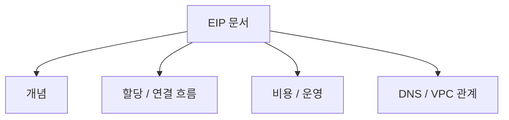
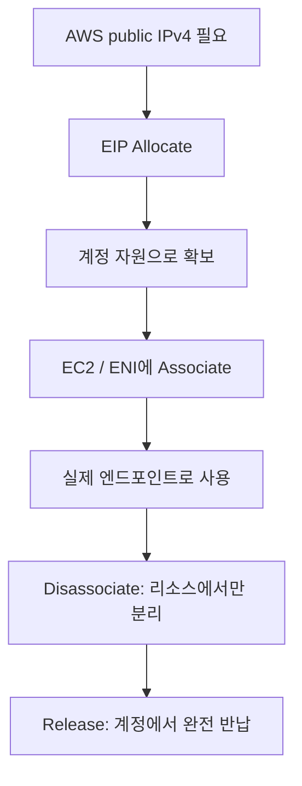
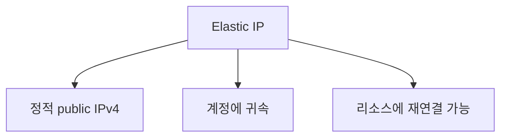
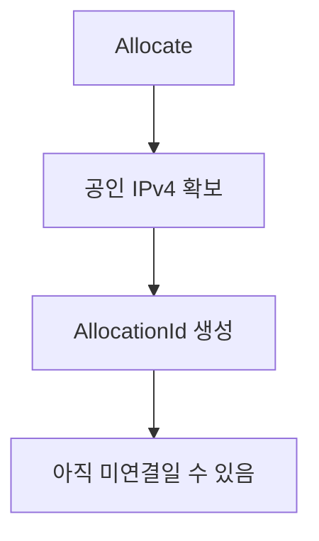
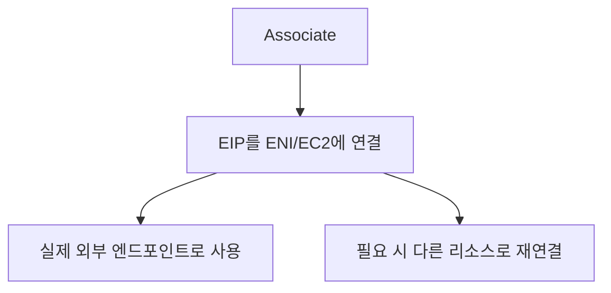
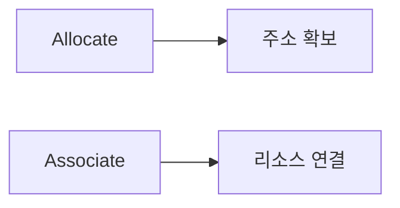
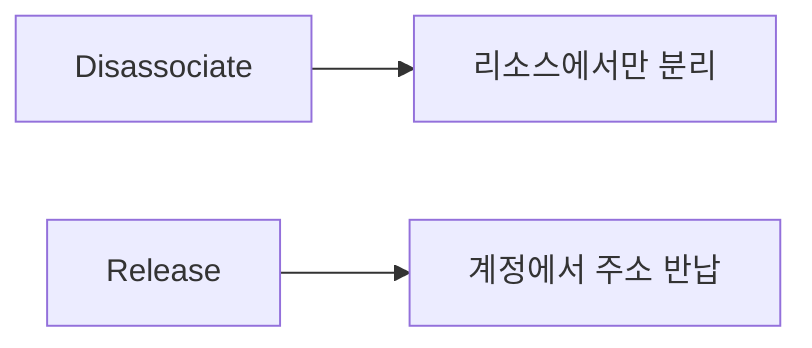

# AWS EIP(Elastic IP) 할당 상세 정리

작성 기준일: 2026-04-16  
조사 방식: 웹검색 기반 최신 조사  
가정: 사용자가 말한 `ELP 할당`은 AWS 문맥상 `EIP(Elastic IP) 할당`을 의미하는 것으로 해석함  
주요 참고: `docs.aws.amazon.com` 공식 EC2 / VPC 문서

## 1. 문서 목적

이 문서는 AWS에서 자주 말하는 `EIP 할당(Elastic IP allocation)`이 정확히 무엇인지, 그리고 EC2/VPC 운영에서 어떤 의미를 가지는지 자세히 정리한 학습 문서다.

특히 아래를 함께 설명한다.

- Elastic IP가 무엇인가
- `할당(Allocate)`과 `연결(Associate)`은 어떻게 다른가
- EIP는 언제 필요한가
- EIP는 어디에 붙일 수 있는가
- 비용은 왜 계속 나올 수 있는가
- `release`와 `disassociate`는 어떻게 다른가
- BYOIP, IPAM pool, CoIP pool은 무엇인가
- `network border group`은 왜 중요할 수 있는가

즉 이 문서는 단순히 "고정 공인 IP"라는 정의만 적는 것이 아니라, AWS에서 EIP를 실제로 어떻게 읽고 운영해야 하는지를 설명하는 문서다.

---

## 2. 먼저 한 줄 요약

`Elastic IP address(EIP)`는 AWS 계정에 먼저 `할당(allocate)`해 두고, 그 다음 EC2 인스턴스나 네트워크 인터페이스에 `연결(associate)`할 수 있는 정적 공인 IPv4 주소다.

AWS EC2 공식 문서는 Elastic IP를:

- account에 귀속되는 public IPv4 address
- static address
- internet에서 도달 가능한 주소

로 설명한다.

즉 아주 단순하게 말하면:

- AWS가 관리하는 고정 공인 IPv4를
- 내 계정에 먼저 예약해 두고
- 필요할 때 리소스에 붙였다 떼는 개념

이다.

---

## 3. EIP의 핵심 개념

### 3.1 EIP는 "인스턴스에 기본으로 붙는 공인 IP"와 다르다

EC2를 퍼블릭 subnet에 띄우면 자동으로 public IPv4가 붙을 수 있다.

하지만 그 공인 IP는:

- 인스턴스를 중지/시작하거나
- 재할당 상황이 생기면
- 바뀔 수 있다

반면 EIP는:

- 정적(static)
- 계정에 귀속
- 직접 release하지 않는 한 유지

된다는 차이가 있다.

### 3.2 EIP는 리소스보다 계정에 먼저 귀속된다

이게 중요하다.

EIP는 보통 다음 순서로 다룬다.

1. 계정에 EIP를 `allocate`
2. 그 EIP를 특정 리소스에 `associate`

즉 인스턴스를 만들면서 바로 생겨나는 "자동 공인 IP"와는 운영 모델이 다르다.

### 3.3 EIP는 Region 단위다

AWS EC2 문서는 EIP가:

- 특정 Region에서만 사용 가능하고
- 다른 Region으로 옮길 수 없다고

설명한다.

즉 Seoul Region에서 할당한 EIP를 Tokyo Region 인스턴스에 붙일 수는 없다.

---

## 4. `할당(Allocate)`이란 정확히 무엇인가

AWS EC2 API `AllocateAddress` 문서는 allocate를 "Elastic IP address를 계정에 할당한다"고 설명한다.

즉 allocate의 의미는:

- 아직 아무 리소스에도 안 붙어 있어도
- 그 공인 IP를 내 계정 소유로 예약한다

는 것이다.

### 4.1 할당 후 바로 되는 것

EIP를 allocate하면 AWS는 보통 아래 정보를 반환한다.

- `AllocationId`
- `PublicIp`
- `Domain` (`vpc`)
- 경우에 따라 pool 관련 정보

즉 이 시점부터 내 계정에 공인 IPv4 하나가 생긴다.

### 4.2 할당했다고 바로 인스턴스가 인터넷에 그 IP로 보이는 것은 아니다

이건 매우 중요하다.

`allocate`만 하면:

- 계정에 주소를 확보한 것일 뿐
- 아직 아무 인스턴스/ENI에 연결되지 않았을 수 있다

즉 외부 트래픽이 그 IP로 해당 인스턴스로 가는 상태는 아직 아니다.

### 4.3 실무 감각

`allocate`는:

- 주소 확보
- inventory 생성
- 아직 미사용일 수도 있는 자원 예약

으로 읽으면 된다.

---

## 5. `연결(Associate)`이란 무엇인가

AWS 문서에서 EIP는 할당 후 인스턴스 또는 네트워크 인터페이스에 associate할 수 있다.

즉 `associate`는:

- 이미 내 계정에 있는 EIP를
- 특정 리소스에 연결해
- 실제 통신 경로에 사용하게 만드는 것

이다.

### 5.1 어디에 associate할 수 있나

보통:

- EC2 instance
- Elastic network interface(ENI)

에 연결할 수 있다.

실무적으로는 ENI에 붙는다고 생각하는 편이 정확한 경우가 많다.

왜냐하면 네트워크 관점의 실제 부착 지점이 ENI이기 때문이다.

### 5.2 연결 후 벌어지는 일

EIP를 associate하면 그 리소스는:

- 외부에서 그 고정 공인 IP로 접근 가능해지고
- outbound에도 그 public IP가 사용될 수 있다

즉 "예약된 IP"가 "실제 서비스 엔드포인트"가 된다.

### 5.3 재연결도 가능하다

EIP는 한 번 붙였다고 영원히 그 인스턴스 전용이 아니다.

필요하면:

- A 인스턴스에서 떼고
- B 인스턴스 또는 다른 ENI에 붙일 수 있다

이 유연성이 EIP의 핵심 장점 중 하나다.

즉 장애 조치(failover)나 교체 작업에 유리하다.

---

## 6. `Allocate`와 `Associate`의 차이

이 둘은 반드시 구분해야 한다.

### 6.1 `Allocate`

- 내 계정에 EIP를 확보
- 아직 리소스 미연결 가능

### 6.2 `Associate`

- 확보한 EIP를 실제 인스턴스/ENI에 연결
- 트래픽에 사용되기 시작

### 6.3 한 줄 감각

- `allocate` = 주소를 내 것으로 만든다
- `associate` = 그 주소를 실제 리소스에 꽂는다

이 차이를 모르면 콘솔에서 "이미 EIP가 있는데 왜 또 연결이 필요하지?"가 계속 헷갈린다.

---

## 7. `Disassociate`와 `Release`의 차이

이 부분도 실수하기 쉽다.

### 7.1 `Disassociate`

의미:

- 리소스에서 EIP를 떼기만 한다
- 내 계정에는 여전히 남아 있다

즉:

- 주소는 아직 내 것
- 지금만 리소스에 안 붙어 있음

### 7.2 `Release`

의미:

- 내 계정에서 EIP 자체를 반납한다
- AWS 주소 풀로 돌아간다

즉 release 후에는:

- 더 이상 내 계정 자산이 아니다

### 7.3 실무 감각

- 다시 쓸 계획이 있다 -> `disassociate`
- 완전히 버릴 거다 -> `release`

### 7.4 중요한 경고

AWS 문서와 API 문서는 release한 EIP는:

- 다른 AWS 계정에 재할당될 수 있고
- 그 이후엔 복구 못 할 수 있다고

설명한다.

즉 "잠깐 떼었다가 다시 쓸 것"이면 release하면 안 된다.

---

## 8. EIP는 언제 필요한가

### 8.1 고정 공인 IP가 필요할 때

대표적인 경우:

- 방화벽 허용 목록에 넣어야 할 때
- 외부 파트너가 공인 IP를 고정으로 등록해야 할 때
- DNS A 레코드가 안정적으로 같은 주소를 가리켜야 할 때

### 8.2 인스턴스를 교체해도 같은 IP를 유지하고 싶을 때

예:

- 새 인스턴스로 blue/green 교체
- 장애 인스턴스를 교체
- bastion host 교체

이때 EIP를 새 리소스에 재associate하면 외부에서 보는 IP는 그대로 유지할 수 있다.

### 8.3 NAT/Bastion/Public entrypoint 운영

EIP는 자주 아래에 붙는다.

- bastion host
- NAT instance(예전 방식)
- 특정 관리 서버
- 외부에서 직접 접근해야 하는 단일 EC2

### 8.4 필요 없는 경우도 많다

모든 EC2가 EIP가 필요한 것은 아니다.

예:

- ALB/NLB 뒤에 있는 private EC2
- Auto Scaling으로 자주 교체되는 앱 서버
- Session Manager/SSM만으로 관리하는 내부 인스턴스

이런 경우는 굳이 EIP를 붙이지 않는 편이 더 자연스럽다.

즉 EIP는 "정적 공인 진입점이 꼭 필요할 때" 쓰는 도구다.

---

## 9. EIP와 VPC

### 9.1 현재는 사실상 VPC 기준으로 읽으면 된다

AWS CLI 문서의 `allocate-address`는 `Domain` 값으로 `vpc`를 보여 주고, 예전 `standard`는 EC2-Classic 시절 문맥이다.

현재 실무에서는 거의 항상:

- `VPC`에서 쓰는 EIP

로 이해하면 된다.

### 9.2 subnet과 관계

EIP는 공인 IPv4이지만, 아무 데나 붙는 것은 아니다.

보통:

- 인터넷 경로가 있는 VPC/subnet 구조
- public reachability가 설계된 ENI/instance

에서 의미가 있다.

즉 EIP만 있다고 인터넷 연결이 자동 완성되는 건 아니다.

함께 봐야 할 것:

- Internet Gateway
- Route Table
- Security Group
- NACL

### 9.3 public subnet에 자동 공인 IP와의 차이

public subnet에서 auto-assign public IPv4를 켜면 임시 public IPv4가 붙을 수 있다.

하지만 EIP는:

- 자동 public IP와 다른 별도 자원
- 더 안정적인 정적 주소

다.

---

## 10. EIP는 어떤 주소 풀에서 오나

AWS `AllocateAddress` 문서는 EIP를 여러 풀에서 할당할 수 있다고 설명한다.

대표적으로:

- AWS가 제공하는 public IPv4 pool
- BYOIP public IPv4 range
- IPv4 IPAM pool
- Outposts용 customer-owned IP(CoIP) pool

즉 "Elastic IP"라고 해서 항상 AWS 기본 공인 IPv4만 의미하는 것은 아니다.

### 10.1 AWS 기본 풀

가장 흔한 방식이다.

즉 AWS가 가진 공인 IPv4 pool에서 하나를 내 계정에 할당한다.

### 10.2 BYOIP

AWS 문서는 BYOIP(Bring Your Own IP)를:

- 내가 원래 소유한 public IPv4 range를 AWS 계정으로 들여오는 기능

으로 설명한다.

즉 이미 내 회사가 가진 공인 IP 대역을 AWS에서 광고하고 쓰고 싶을 때 활용한다.

### 10.3 IPAM pool

IPAM pool은:

- Amazon-provided 또는 BYOIP public IPv4 주소 범위를 더 체계적으로 관리하는 풀

로 이해하면 된다.

즉 대규모 조직에서 public IPv4 관리 일관성이 중요할 때 나온다.

### 10.4 CoIP pool

Outposts 문맥에서는 on-premises 네트워크의 customer-owned IP 범위를 AWS 리소스에 매핑할 수 있다.

즉 일반 퍼블릭 클라우드 EC2에서 제일 흔한 시나리오는 아니고, 하이브리드/Outposts 쪽 문맥이다.

---

## 11. Network Border Group

### 11.1 정체

AWS CLI 문서는 `network-border-group`을:

- AWS가 IP를 광고하는 AZ/Local Zone/Wavelength Zone 집합

으로 설명한다.

### 11.2 왜 중요하나

EIP는 network border group에 종속될 수 있다.

즉:

- 특정 로케이션 집합 기준으로 광고되는 IP
- 다른 border group으로 자유롭게 이동되지 않을 수 있음

이라는 의미다.

### 11.3 언제 신경 쓰나

일반 Region AZ만 쓰는 단순 EC2 운영에서는 크게 신경 안 쓸 수 있다.

하지만:

- Local Zone
- Wavelength Zone
- 네트워크 위치 제약

이 있으면 중요해진다.

즉 EIP도 "어느 물리적 네트워크 경계에서 광고되는가"가 있을 수 있다.

---

## 12. 비용: 왜 EIP는 돈이 나가나

### 12.1 최신 AWS 문서 기준

AWS EC2 문서는 현재:

- 사용 중이든 아니든
- 모든 Elastic IP address에 대해 과금이 발생한다고

명시한다.

또한 AWS는 public IPv4 addresses 전반에 대해 과금 정책을 적용한다고 설명한다.

### 12.2 왜 이게 중요한가

예전 지식으로는:

- running instance에 붙은 EIP는 무료
- 놀고 있는 EIP만 과금

처럼 기억하는 경우가 많다.

하지만 현재는 public IPv4 자체 비용 모델이 바뀌었기 때문에, 오래된 감각으로 보면 안 된다.

### 12.3 실무 감각

즉 EIP를 하나 allocate해 두면:

- "언젠가 쓸지도 모르니까 일단 확보"가 공짜가 아니다

필요 없는 EIP는:

- disassociate만 해 두고 방치하지 말고
- 정말 안 쓸 거면 release

까지 검토해야 한다.

### 12.4 비용 최적화 관점

질문해야 할 것:

- 정말 정적 공인 IPv4가 필요한가
- ALB/NLB, Route 53, CloudFront, Global Accelerator 등으로 대체 가능한가
- SSM/Session Manager로 public IP 없이 운영 가능한가

즉 EIP는 편하지만 현재는 비용 자원으로 봐야 한다.

---

## 13. 콘솔/CLI/API에서 자주 보이는 필드

### 13.1 `AllocationId`

EIP 자원 자체의 식별자다.

보통 VPC 문맥에서는 이 값으로 associate/disassociate/release를 다룬다.

### 13.2 `AssociationId`

EIP가 특정 리소스에 연결된 association 자체의 식별자다.

즉:

- allocation = 주소 자원
- association = 주소와 리소스의 연결 관계

다.

### 13.3 `PublicIp`

실제 외부에 보이는 공인 IPv4 주소다.

### 13.4 `NetworkInterfaceId`

EIP가 붙은 ENI 식별자다.

즉 인스턴스보다 더 정확한 부착 지점을 나타낸다.

### 13.5 `PrivateIpAddress`

EIP가 어떤 private IP에 매핑되는지 보여 준다.

즉 EIP는 결국 ENI의 private address 위에 매핑되는 공인 주소라고 이해할 수 있다.

---

## 14. EC2 운영에서 EIP 흐름 예시

### 14.1 가장 단순한 흐름

1. EIP 하나를 allocate
2. EC2 인스턴스 또는 ENI에 associate
3. DNS A 레코드를 그 EIP로 연결
4. 나중에 인스턴스 교체 시 새 인스턴스로 re-associate

이게 EIP의 대표 시나리오다.

### 14.2 bastion host 예시

- 관리용 bastion EC2에 EIP 할당
- 운영자는 그 고정 IP만 방화벽에 등록
- bastion 교체 시 EIP만 재연결

즉 운영 단순성이 올라간다.

### 14.3 단일 웹서버 예시

- 소규모 테스트/개발 환경에서 EC2 한 대에 직접 EIP
- 외부는 고정 IP로 접근

다만 운영 규모가 커지면 보통 ALB/ASG 구조가 더 자연스럽다.

---

## 15. EIP와 DNS의 관계

### 15.1 왜 같이 많이 보나

정적 공인 IP가 생기면 보통 DNS A 레코드를 그 주소에 연결하기 때문이다.

즉:

- EIP = 고정 public IPv4
- DNS A = 그 IP를 가리키는 이름

조합이다.

### 15.2 DNS 변경 없이 인프라 교체 가능

EIP의 장점 중 하나는:

- DNS는 그대로 두고
- 뒤에 붙는 인스턴스만 바꿀 수 있다는 점

이다.

즉 DNS propagation을 기다리지 않고도 failover 성격의 전환이 가능할 수 있다.

### 15.3 하지만 항상 EIP가 더 좋은 건 아니다

서비스 규모가 커지면:

- 단일 EC2 + EIP

보다

- ALB/NLB + 여러 인스턴스

가 더 자연스러운 경우가 많다.

즉 EIP는 단일 정적 엔드포인트 문제를 푸는 도구이지, 모든 공개 서비스의 정답은 아니다.

---

## 16. EIP가 안 맞는 경우

### 16.1 Auto Scaling 중심 앱 서버

인스턴스가 계속 교체되는 구조라면 개별 인스턴스에 EIP를 붙이는 건 보통 불편하다.

이럴 때는:

- Load Balancer
- Private subnet
- NAT Gateway

구조가 더 낫다.

### 16.2 외부 직접 접근이 필요 없는 내부 서버

예:

- 배치 서버
- 내부 API 서버
- DB 서버

이런 서버는 EIP 없이 private subnet에 두는 편이 더 안전하다.

### 16.3 운영 접근도 굳이 공인 IP가 필요 없을 수 있다

AWS Systems Manager Session Manager 같은 관리형 접근 경로를 쓰면:

- SSH 포트 공개 없이도
- 인스턴스 접속이 가능하다

즉 EIP는 "항상 필요한 기본 옵션"이 아니다.

---

## 17. 자주 헷갈리는 비교

### 17.1 EIP vs 자동 public IPv4

- 자동 public IPv4: 인스턴스에 임시로 붙는 공인 주소일 수 있음
- EIP: 계정에 귀속된 정적 공인 IPv4

### 17.2 Allocate vs Associate

- Allocate: 주소를 내 계정에 확보
- Associate: 그 주소를 리소스에 연결

### 17.3 Disassociate vs Release

- Disassociate: 리소스에서만 분리
- Release: AWS에 주소 자체를 반납

### 17.4 EIP vs Private IP

- Private IP: VPC 내부 주소
- EIP: 인터넷에서 라우팅 가능한 공인 IPv4

### 17.5 EIP vs Elastic Load Balancer 주소

- EIP: 고정 public IPv4 하나를 계정에 할당
- ELB: 관리형 분산 엔드포인트

즉 단일 VM 엔드포인트냐, 관리형 로드 밸런서냐의 차이다.

---

## 18. 실무 체크리스트

EIP를 쓸지 말지 판단할 때는 아래를 먼저 보면 된다.

### 18.1 정말 정적 공인 IPv4가 필요한가

- 외부 화이트리스트 등록이 필요한가
- 파트너 연동이 IP 고정을 요구하는가
- DNS A 레코드를 안정적으로 유지해야 하는가

### 18.2 단일 인스턴스 진입점이 맞는가

- 단일 EC2 직접 공개가 맞는지
- ALB/NLB가 더 적절한지

### 18.3 네트워크 조건이 갖춰졌는가

- VPC/route/internet gateway/security group이 맞는가
- EIP만 있다고 인터넷 서비스가 되는 건 아닌가

### 18.4 비용을 이해했는가

- 지금 public IPv4 과금 정책을 반영했는가
- 놀고 있는 EIP를 방치하고 있지 않은가

### 18.5 release를 정말 해도 되는가

- 나중에 같은 IP를 유지해야 하는 요구가 없는가
- release 후 복구 불가 가능성을 이해했는가

---

## 19. 한 문장 결론

AWS에서 EIP 할당은 단순히 "공인 IP를 하나 받는다"가 아니라, `정적 public IPv4를 계정 자원으로 먼저 확보(allocate)하고, 필요할 때 특정 EC2/ENI에 연결(associate)해서 안정적인 외부 엔드포인트로 운영하는 방식`이다.

즉 EIP를 제대로 이해하려면:

- `allocate`와 `associate`
- `disassociate`와 `release`
- VPC/ENI와의 관계
- public IPv4 비용 구조

를 함께 이해해야 한다.

---

## 20. 공식 출처

- Elastic IP addresses - Amazon EC2 User Guide: <https://docs.aws.amazon.com/AWSEC2/latest/UserGuide/elastic-ip-addresses-eip.html>
- Work with Elastic IP addresses - Amazon EC2 User Guide: <https://docs.aws.amazon.com/AWSEC2/latest/UserGuide/working-with-eips.html>
- AllocateAddress - Amazon EC2 API Reference: <https://docs.aws.amazon.com/AWSEC2/latest/APIReference/API_AllocateAddress.html>
- allocate-address - AWS CLI Command Reference: <https://docs.aws.amazon.com/cli/latest/reference/ec2/allocate-address.html>
- Bring your own IP addresses (BYOIP) to Amazon EC2: <https://docs.aws.amazon.com/AWSEC2/latest/UserGuide/ec2-byoip.html>
- Use an Elastic IP address with a network interface: <https://docs.aws.amazon.com/AWSEC2/latest/UserGuide/using-eni.html#eni-basics-eip>
- VPC pricing - Public IPv4 Address tab: <https://aws.amazon.com/vpc/pricing/>
