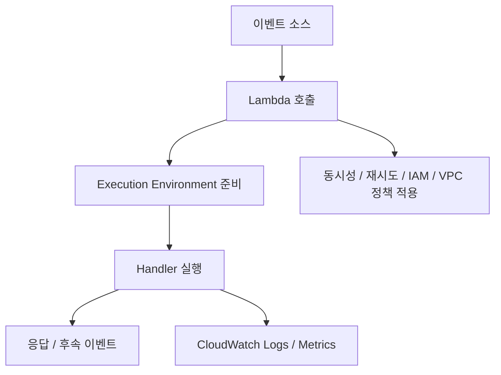

# AWS Lambda 상세 정리

작성 기준일: 2026-04-17  
조사 방식: 웹검색 기반 최신 조사  
가정: 사용자가 적은 `lamda`는 AWS 문맥상 `Lambda`를 의미하는 것으로 해석함  
주요 참고: `docs.aws.amazon.com` 공식 Lambda 문서, `aws.amazon.com/lambda/pricing`

## 1. 문서 목적

이 문서는 AWS Lambda를 처음 배우는 사람부터 이미 간단히 써 본 사람까지, "Lambda가 정확히 무엇이고 실제 운영에서는 어떤 설정과 개념이 중요한지"를 한 번에 연결해서 이해할 수 있도록 정리한 학습 문서다.

특히 아래를 함께 설명한다.

- Lambda가 정확히 무엇인가
- handler, runtime, event, context는 무슨 뜻인가
- Lambda가 코드를 실제로 어떻게 실행하는가
- synchronous / asynchronous / event source mapping 차이
- cold start와 execution environment lifecycle
- memory, CPU, timeout, ephemeral storage(`/tmp`)
- concurrency, reserved concurrency, provisioned concurrency
- VPC 연결 시 인터넷 접근이 왜 막힐 수 있는가
- IAM execution role과 resource-based policy 차이
- zip 배포와 container image 배포 차이
- layer, 로그, 모니터링, 재시도, DLQ / destination
- 언제 Lambda가 잘 맞고, 언제 안 맞는가

즉 이 문서는 단순 서비스 소개가 아니라, "`Lambda를 시스템으로 이해하는 문서`"다.

---

## 2. 먼저 한 줄 요약

AWS Lambda는 서버를 직접 프로비저닝하거나 관리하지 않고도, 특정 이벤트가 들어왔을 때 코드를 실행할 수 있게 해 주는 서버리스 컴퓨트 서비스다.

AWS 공식 소개와 문서의 핵심을 실무적으로 풀면:

- 내가 서버를 미리 띄워 두지 않아도 되고
- 이벤트가 들어오면 AWS가 실행 환경을 만들어 코드를 돌리고
- 사용한 요청 수와 실행 시간 기준으로 과금하며
- 동시 실행 수요에 맞춰 자동 확장된다

즉 아주 단순하게 말하면:

- "요청이 있을 때만 함수 단위로 실행되는 관리형 백엔드 실행 플랫폼"

이다.

---

## 3. Lambda는 정확히 무엇인가

AWS Lambda 문서는 Lambda를:

- code를 실행하고
- 서버 provisioning / management 없이
- event-driven 방식으로 동작하는 compute service

로 설명한다.

### 3.1 왜 `serverless`라고 부르나

`serverless`는 서버가 없다는 뜻이 아니라:

- 서버 OS 패치
- 프로세스 관리
- 기본 오토스케일링
- capacity planning

같은 인프라 운영 대부분을 AWS가 대신 맡는다는 뜻에 가깝다.

즉 서버가 물리적으로 사라진 게 아니라, 사용자가 직접 만질 필요가 크게 줄어든 것이다.

### 3.2 Lambda의 실행 단위

Lambda는 보통:

- 애플리케이션 전체가 아니라
- handler 하나를 중심으로 한 function 단위

로 생각한다.

예:

- 이미지 업로드 후 썸네일 생성
- API 요청 처리
- DynamoDB 변경 이벤트 처리
- 스케줄 작업

즉 "짧고 독립적인 실행 단위"에 특히 잘 맞는다.

### 3.3 Lambda를 한 문장으로 다시 정리하면

Lambda는:

- 이벤트를 입력으로 받아
- 격리된 실행 환경에서
- 코드를 실행하고
- 결과를 반환하거나 후속 처리하는

관리형 함수 실행 서비스다.

---

## 4. Lambda의 가장 기본 구성

AWS 문서는 Lambda programming model의 핵심 구성으로:

- runtime
- handler
- event
- context

를 설명한다.

### 4.1 runtime

runtime은:

- Node.js
- Python
- Java
- .NET
- Go
- custom runtime

같이 Lambda가 코드를 실행하는 언어/환경 계층이다.

즉 "이 함수 코드를 어떤 런타임에서 돌릴 것인가"를 정한다.

### 4.2 handler

AWS 문서는 handler를:

- Lambda가 내 코드 진입점을 알기 위해 지정하는 entry point

로 설명한다.

즉 Lambda가 이벤트를 받으면 최종적으로 handler를 호출한다.

### 4.3 event

event는 함수에 들어오는 입력 데이터다.

예:

- API Gateway 요청
- S3 이벤트
- EventBridge 스케줄 이벤트
- SQS 메시지 묶음

즉 Lambda는 "이벤트 기반"이기 때문에 input shape가 호출 원천에 따라 달라진다.

### 4.4 context

context는 실행 환경 메타데이터다.

예:

- request ID
- function name
- timeout 관련 정보
- 남은 실행 시간

즉 handler는 event와 context를 받아 현재 호출 문맥을 안다.

---

## 5. Handler

AWS `Understanding the Lambda programming model`은 Lambda가 함수 설정에서 handler entry point를 지정한다고 설명한다.

### 5.1 handler의 역할

handler는:

- 이벤트를 입력으로 받고
- 비즈니스 로직을 수행하고
- 결과를 반환하거나 예외를 던진다

즉 Lambda 코드의 시작점이다.

### 5.2 왜 handler가 중요한가

Lambda는 단순히 파일 하나를 실행하는 게 아니라:

- "이 런타임 안의 어떤 함수가 진입점인지"

를 알아야 한다.

즉 일반 앱의 `main()`에 해당하는 개념이라고 보면 된다.

### 5.3 실무 감각

handler는 보통 최대한 얇게 두는 편이 좋다.

예:

- event 파싱
- auth / validation
- 서비스 로직 함수 호출
- 결과/에러 정리

즉 비즈니스 로직 전체를 handler에 다 몰아넣기보다, 테스트 가능한 함수들로 분리하는 것이 관리에 유리하다.

---

## 6. Event와 Event Source

Lambda의 입력은 이벤트다.

이벤트는 "누가 호출했느냐"에 따라 모양이 달라진다.

### 6.1 대표 event source

실무에서 자주 보는 것:

- API Gateway / ALB
- S3
- EventBridge
- SQS
- SNS
- DynamoDB Streams
- Kinesis
- MSK / Kafka

### 6.2 왜 중요한가

같은 Lambda라도:

- API 요청용 함수인지
- 배치 이벤트 처리용 함수인지
- 스트림 소비자인지

에 따라:

- payload shape
- retry semantics
- 병렬 처리 방식

이 달라진다.

즉 Lambda를 배울 때 "코드"만 보면 부족하고, `event source`를 반드시 같이 봐야 한다.

---

## 7. Invocation 방식 3가지

Lambda는 호출 방식에 따라 운영 감각이 꽤 달라진다.

AWS 공식 문서와 API 문서는 크게 아래 세 가지로 이해하게 만든다.

- synchronous invocation
- asynchronous invocation
- event source mapping

### 7.1 synchronous invocation

AWS `Invoke` API 문서는 기본 호출 타입이 `RequestResponse`라고 설명한다.

즉:

- 호출자가 응답을 기다린다
- 함수가 끝나면 응답/에러를 바로 받는다

예:

- API Gateway 동기 요청
- Lambda invoke API 직접 호출

### 7.2 asynchronous invocation

`InvocationType=Event`로 설정하면 비동기다.

즉:

- 호출자는 "요청을 받았다"는 신호만 받고
- 실제 함수 실행/재시도는 Lambda 내부 비동기 큐가 담당한다

예:

- EventBridge
- SNS
- S3 일부 이벤트 흐름

### 7.3 event source mapping

AWS 문서는 stream/queue 기반 소스에서 Lambda가 직접 poller를 통해 읽어 와서 함수를 호출하는 구조를 설명한다.

예:

- SQS
- Kinesis
- DynamoDB Streams
- MSK / Kafka

즉 이 경우는 "소스가 Lambda를 푸시"하는 게 아니라, Lambda가 source mapping 리소스를 통해 끌어와 처리한다.

### 7.4 왜 이 구분이 중요한가

이 세 가지는:

- payload size 한도
- retry 방식
- 병렬성
- error handling

이 다 다르다.

즉 Lambda 운영 문제의 절반은 invocation mode 구분에서 시작한다.

---

## 8. Synchronous invocation

AWS `Invoke` API 문서는 synchronous invocation의 핵심 특성을 설명한다.

### 8.1 특징

- 호출자가 응답 대기
- 응답 payload와 에러가 직접 반환됨
- 기본 payload limit는 request/response 각각 6 MB

### 8.2 대표 사용처

- API 응답 생성
- 내부 동기 RPC
- 즉시 결과가 필요한 작업

### 8.3 실무 포인트

synchronous Lambda는 사실상 웹 요청 처리처럼 생각하면 된다.

즉:

- timeout이 사용자 응답 지연으로 바로 연결
- cold start가 UX에 직접 영향
- 에러는 즉시 호출자에 전달

된다.

### 8.4 주의점

응답이 필요한데 너무 오래 걸리거나 payload가 커지면:

- Lambda만으로 해결하려 하지 말고
- 비동기 처리로 전환하거나
- S3 pre-signed URL / polling / Step Functions 같은 구조를 같이 고려해야 한다

---

## 9. Asynchronous invocation

AWS async error handling 문서는 비동기 호출에서 Lambda가 자체 큐를 관리한다고 설명한다.

### 9.1 특징

- 호출자는 기다리지 않음
- Lambda 내부 큐가 이벤트를 보관
- 함수 오류 시 기본적으로 두 번 더 재시도
- event age는 기본적으로 최대 6시간까지 유지될 수 있음

### 9.2 대표 사용처

- 이벤트 알림 처리
- 비동기 후처리
- 백그라운드 작업

### 9.3 왜 유용한가

비동기 호출은:

- 사용자 요청 흐름과 분리
- 일시적 오류 흡수
- burst 처리 완화

에 유리하다.

### 9.4 운영 포인트

비동기 호출은 편하지만:

- 재시도 때문에 중복 실행 가능
- idempotency 고려 필요
- 실패 이벤트 보존 전략 필요

즉 동기 요청보다 에러 처리 설계를 더 신경 써야 한다.

---

## 10. Event Source Mapping

AWS `How Lambda processes records from stream and queue-based event sources`는 event source mapping(ESM)을:

- stream/queue source에서 레코드를 읽고
- 배치로 Lambda 함수를 호출하는 Lambda 리소스

로 설명한다.

### 10.1 핵심 감각

즉 ESM은:

- 소스와 함수 사이를 연결하는 별도 설정 자원
- poller를 두고 읽어 오는 구조

다.

### 10.2 대표 대상

공식 문서 기준:

- SQS
- Kinesis
- DynamoDB Streams
- Amazon MQ / RabbitMQ
- MSK / self-managed Kafka
- DocumentDB change streams

### 10.3 왜 중요한가

ESM은 함수 코드보다:

- batch size
- retry behavior
- bisect batch on error
- filtering
- source access config

같은 운용 옵션이 중요할 수 있다.

즉 Lambda를 잘 다루려면 함수 코드 외에 mapping 설정도 같이 읽어야 한다.

---

## 11. Runtime과 언어 선택

Lambda는 여러 언어 런타임을 지원한다.

대표적으로:

- Node.js
- Python
- Java
- .NET
- Go
- custom runtime

### 11.1 중요한 점

같은 Lambda라도 runtime 선택에 따라 아래가 달라진다.

- cold start 체감
- 배포 방식
- dependency packaging
- observability tooling
- layers 활용 방식

### 11.2 런타임 선택 감각

아주 단순하게 요약하면:

- 빠른 개발/짧은 함수 -> Node.js, Python
- 엔터프라이즈 SDK/강한 타입 -> Java, .NET
- 단일 바이너리 선호 -> Go

다만 이건 팀/조직 표준과 이미 가지고 있는 라이브러리 생태계가 더 중요할 때가 많다.

---

## 12. 실행 환경(execution environment)

AWS `Understanding the Lambda execution environment lifecycle`는 Lambda가 invocation마다 `execution environment`에서 코드를 실행한다고 설명한다.

### 12.1 실행 환경이란

즉 Lambda의 실행 환경은:

- 격리된 런타임 공간
- 함수 코드와 dependency가 올라간 환경
- `/tmp`, environment variables, extensions를 포함

하는 하나의 실행 단위다.

### 12.2 왜 중요한가

Lambda를 "요청마다 완전히 새 서버"로 이해하면 틀리고,

"영원히 살아 있는 컨테이너"로 이해해도 틀리다.

실제론:

- 필요하면 새 환경을 만들고
- 재사용 가능한 동안은 재사용하고
- 나중에 freeze / shutdown할 수 있는

중간 모델이다.

### 12.3 reuse 감각

실행 환경이 재사용되면:

- static initialization
- 메모리 캐시 일부
- `/tmp` 파일

등이 다음 invocation에 남아 있을 수 있다.

즉 이걸 잘 쓰면 성능이 좋아지지만, 여기에 의존하면 위험하다.

---

## 13. 실행 환경 라이프사이클

AWS 문서는 standard Lambda execution environment lifecycle을 대략:

- `Init`
- `Invoke`
- `Shutdown`

으로 설명한다.

### 13.1 Init

이 단계에서 Lambda는:

- extensions 시작
- runtime bootstrap
- function static code 실행

을 수행한다.

즉 handler 밖 top-level initialization이 여기서 돈다.

### 13.2 Invoke

실제 handler가 이벤트를 처리하는 단계다.

### 13.3 Shutdown

환경 정리 단계다.

### 13.4 왜 중요한가

이 lifecycle을 이해해야:

- cold start
- static init 최적화
- connection reuse
- `/tmp` 사용

같은 운영 포인트가 이해된다.

---

## 14. Cold Start

AWS 문서는 Lambda가 새 execution environment를 준비할 때:

- 코드 다운로드
- 환경 설정
- 초기화 코드 실행

과정이 들어가며, 이 부분을 흔히 cold start라고 부른다고 설명한다.

### 14.1 언제 발생하나

- 새 환경이 필요할 때
- scale out 할 때
- 오래 안 쓰다 다시 호출될 때

### 14.2 무엇이 영향 주나

- runtime 종류
- package 크기
- VPC 연결 여부
- 초기화 코드 무게
- layer 수와 dependency

### 14.3 어떻게 줄이나

AWS 문서가 제시하는 대표 방향:

- static initialization 최소화
- Provisioned Concurrency
- SnapStart(지원 런타임)

즉 cold start는 "Lambda가 느리다" 문제라기보다 초기화 전략 문제인 경우가 많다.

---

## 15. SnapStart

AWS `Improving startup performance with Lambda SnapStart`는 SnapStart가:

- publish된 function version의 initialized execution environment snapshot을 저장해
- startup latency를 줄이는 기능이라고 설명한다.

### 15.1 핵심 감각

즉:

- 매번 초기화를 처음부터 하지 않고
- 이미 초기화된 상태 스냅샷에서 시작

하게 해 주는 개념이다.

### 15.2 언제 중요하나

- Java처럼 초기화가 무거운 런타임
- cold start 민감한 API

에서 특히 중요하다.

### 15.3 주의점

모든 함수/런타임에 동일하게 적용되는 만능 기능은 아니다.

즉:

- 지원 런타임 확인
- snapshot 친화적 초기화 코드인지

를 함께 봐야 한다.

---

## 16. Memory, CPU, Timeout, Ephemeral Storage

이 네 개는 Lambda 튜닝의 핵심이다.

### 16.1 Memory

AWS `Configure Lambda function memory` 문서는:

- memory가 128 MB ~ 10,240 MB
- CPU power는 memory에 비례
- 1,769 MB에서 약 1 vCPU 수준

이라고 설명한다.

즉 Lambda에서 memory는 단순 RAM만이 아니라 "컴퓨팅 파워 레버"다.

### 16.2 Timeout

AWS `Configure Lambda function timeout` 문서는:

- 기본값 3초
- 최대 900초(15분)

이라고 설명한다.

즉 timeout은 너무 작아도 문제고, 너무 크게 잡으면 실패 감지가 늦어진다.

### 16.3 Ephemeral Storage (`/tmp`)

AWS 문서는 `/tmp`가:

- execution environment마다 독립적이고
- 기본 512 MB
- 최대 10,240 MB

라고 설명한다.

즉 큰 임시 파일, 압축 해제, 이미지 처리, ML 모델 다운로드 시 중요할 수 있다.

### 16.4 실무 감각

Lambda 튜닝은 보통:

- 메모리 올리기
- timeout 적절화
- `/tmp` 용량 조절

세 가지를 같이 본다.

즉 "메모리 부족"만 보는 게 아니라 CPU와 network 처리량까지 같이 달라진다는 점이 중요하다.

---

## 17. 아키텍처: `x86_64` vs `arm64`

AWS `Selecting and configuring an instruction set architecture` 문서는 Lambda 아키텍처로:

- `x86_64`
- `arm64`

를 제공한다고 설명한다.

### 17.1 `arm64`

- AWS Graviton2 기반

### 17.2 `x86_64`

- 전통적인 x86 기반 프로세서

### 17.3 왜 중요한가

아키텍처가 달라지면:

- native dependency 호환성
- 레이어 바이너리
- 성능/비용

이 달라질 수 있다.

즉 함수 코드만 아니라 dependency와 빌드 체인도 함께 arm 대응인지 확인해야 한다.

---

## 18. 동시성(concurrency)

AWS `Understanding Lambda function scaling` 문서는 concurrency를:

- 동시에 in-flight 상태인 요청 수

라고 설명한다.

### 18.1 핵심 감각

동시 요청 1개마다:

- 별도의 execution environment 하나가 필요할 수 있다

즉 concurrency는 Lambda의 실제 확장 단위다.

### 18.2 account 기본 quota

AWS 문서는 Region당 기본 account concurrency limit를 1,000으로 설명한다.

즉 특별히 증가 요청을 하지 않으면:

- Region 전체 함수가 합쳐서 1,000 동시 실행

기준에서 시작한다.

### 18.3 function-level scaling rate

AWS `Lambda scaling behavior` 문서는 각 함수가:

- 10초마다 최대 1,000 execution environment를 추가할 수 있다고

설명한다.

즉 "무한히 즉시" 늘어나는 건 아니다.

### 18.4 왜 중요한가

burst traffic가 큰 시스템이라면:

- cold start
- scaling rate
- reserved/provisioned concurrency

를 같이 설계해야 한다.

---

## 19. Reserved Concurrency와 Provisioned Concurrency

이 둘은 많이 헷갈린다.

### 19.1 Reserved Concurrency

AWS 문서가 설명하는 의미:

- 특정 함수에 concurrency를 예약
- 다른 함수가 그 몫을 못 쓰게 함
- 동시에 그 함수 최대치도 제한 가능

즉:

- 보호용 quota fence

로 이해하면 된다.

### 19.2 Provisioned Concurrency

AWS 문서와 execution lifecycle 문서는:

- invocation 전에 미리 initialized execution environment를 준비해 두는 기능

이라고 설명한다.

즉 cold start 완화용이다.

### 19.3 차이

- Reserved concurrency = capacity reservation / upper bound control
- Provisioned concurrency = warm environment 미리 준비

즉 둘은 목적이 다르다.

### 19.4 언제 쓰나

- critical API latency 보장 -> Provisioned Concurrency 고려
- 다른 함수에 밀리면 안 되는 핵심 함수 -> Reserved Concurrency 고려

---

## 20. VPC 연결

AWS `Giving Lambda functions access to resources in an Amazon VPC` 문서는:

- 기본적으로 Lambda는 Lambda-managed VPC에서 인터넷 접근이 가능
- 함수에 내 VPC를 붙이면 그 VPC 리소스에 접근할 수 있지만
- 인터넷은 별도 구성 없이는 안 된다고

설명한다.

### 20.1 왜 붙이나

- RDS private endpoint 접근
- ElastiCache
- 내부 서비스
- VPC 내부 보안 자원 접근

### 20.2 자주 하는 오해

"VPC에 붙이면 더 안전하겠지"는 반은 맞고 반은 틀리다.

왜냐하면:

- VPC에 붙이는 순간 public internet 기본 접근성이 사라질 수 있고
- NAT/IGW/route를 다시 설계해야 하기 때문이다

### 20.3 실무 감각

즉 Lambda는:

- VPC가 꼭 필요할 때만 붙인다

가 흔한 기본 원칙이다.

VPC 내부 리소스가 없으면 굳이 붙이지 않는 편이 단순하다.

---

## 21. IAM: Execution Role과 Resource-based Policy

AWS 문서는 Lambda의 권한을 크게 두 층으로 보게 만든다.

### 21.1 Execution Role

AWS `Defining Lambda function permissions with an execution role` 문서는 execution role을:

- 함수가 AWS 리소스에 접근하기 위해 Lambda가 assume하는 IAM role

이라고 설명한다.

즉 함수 코드가:

- DynamoDB 읽기
- S3 쓰기
- CloudWatch Logs 기록

을 하려면 execution role이 필요하다.

### 21.2 Resource-based Policy

Lambda 문서는 리소스 기반 정책도 지원한다고 설명한다.

이건:

- 누가 내 함수를 invoke할 수 있는지

를 함수 쪽에 붙이는 정책이다.

예:

- API Gateway가 invoke
- S3가 invoke
- 다른 AWS account가 invoke

### 21.3 왜 구분이 중요하나

실무에서 흔한 혼동:

- "Lambda가 S3를 읽어야 하는 권한"
- "S3가 Lambda를 호출할 수 있는 권한"

은 서로 다른 문제다.

즉:

- 함수가 밖으로 나갈 권한 = execution role
- 밖에서 함수로 들어올 권한 = resource-based policy

로 이해하면 된다.

### 21.4 최소 권한

AWS 문서도 least privilege를 강하게 권장한다.

즉 개발 편의로 `*:*`를 주고 끝내면 안 된다.

---

## 22. 배포 패키지: `.zip` vs Container Image

AWS 배포 문서는 Lambda가 두 가지 package type을 지원한다고 설명한다.

- `.zip file archive`
- `container image`

### 22.1 `.zip`

장점:

- 전통적이고 단순
- 함수 코드/의존성 묶어서 업로드
- 다수 런타임에서 표준적

### 22.2 Container Image

장점:

- Docker 기반 빌드 제어
- custom OS layer 구성
- 복잡한 dependency / native binary 패키징 유연

### 22.3 중요한 제한

AWS 문서가 명시하는 핵심:

- 기존 함수는 zip <-> image package type을 변경할 수 없다

즉 처음 설계 때 package type 선택이 중요하다.

### 22.4 실무 감각

대체로:

- 일반 Node/Python 함수 -> zip으로 충분한 경우 많음
- 복잡한 native dependency / custom runtime -> image가 편할 수 있음

---

## 23. Layers

AWS `Managing Lambda dependencies with layers`는 layer를:

- supplementary code or data가 들어 있는 zip archive

라고 설명한다.

즉:

- 공통 라이브러리
- custom runtime
- 설정 파일

을 함수 바깥 layer로 분리할 수 있다.

### 23.1 왜 쓰나

AWS 문서가 드는 이유:

- deployment package 크기 감소
- 함수 로직과 dependency 분리
- 여러 함수 간 공유

### 23.2 중요한 제한

공식 문서 기준:

- 함수당 최대 5개 layer
- zip package 함수에서만 사용
- container image 함수에는 layer 방식 자체를 쓰지 않음

### 23.3 Go / Rust 주의

AWS 문서는 Go/Rust는 layers를 권장하지 않는다고 설명한다.

이유:

- executable에 dependency를 함께 넣는 방식이 더 자연스럽고
- layer 로딩이 cold start를 악화시킬 수 있기 때문

즉 layer는 언어에 따라 득실이 다르다.

### 23.4 `/opt`

공식 문서는 layer 내용을 execution environment의 `/opt` 아래로 풀어 준다고 설명한다.

즉 런타임별로 `/opt` 경로를 활용하는 방식이 layer 사용의 핵심이다.

---

## 24. 로그와 모니터링

AWS `Working with Lambda function logs`는:

- 기본 로그 destination이 CloudWatch Logs

라고 설명한다.

### 24.1 기본 로그 흐름

함수가 실행되면:

- stdout/stderr
- runtime logs

등이 CloudWatch Logs로 간다.

### 24.2 왜 중요한가

Lambda는 서버에 직접 SSH 못 들어가므로:

- logs
- metrics
- traces

가 곧 운영 관찰 수단이다.

즉 EC2보다 관찰 도구 의존성이 더 크다.

### 24.3 추가 destination

AWS 문서는 S3나 Firehose로 로그를 보낼 수도 있다고 설명한다.

즉 CloudWatch Logs가 기본이지만 유일한 옵션은 아니다.

### 24.4 실무 감각

Lambda 운영은:

- CloudWatch Logs
- CloudWatch Metrics
- alarm
- tracing(X-Ray/OTel)

조합으로 보는 게 기본이다.

---

## 25. 재시도, DLQ, Destination

AWS retry behavior 문서와 async config 문서는 비동기 호출 재시도와 실패 처리 설정을 설명한다.

### 25.1 직접 동기 호출

AWS 문서 기준:

- Lambda가 자동 재시도하지 않는다

즉 호출자가 재시도 전략을 결정한다.

### 25.2 비동기 호출

AWS 문서 기준:

- 함수 오류 시 기본적으로 2번 더 재시도
- 이벤트는 기본적으로 최대 6시간까지 큐에 남을 수 있음

### 25.3 Event Source Mapping

소스 종류에 따라 retry semantics가 다르다.

예:

- stream은 shard/batch block 영향
- SQS는 visibility timeout/redrive policy 영향

즉 "Lambda는 자동으로 알아서 해 준다"가 아니라 event source semantics를 알아야 한다.

### 25.4 DLQ와 destination

비동기 흐름에서는:

- dead-letter queue
- on-failure destination
- on-success destination

을 고려할 수 있다.

즉 실패한 이벤트를 그냥 버릴지, 남길지, 어디로 보낼지를 설계해야 한다.

### 25.5 실무 포인트

Lambda는 중복 실행될 수 있다.

즉:

- idempotency
- 재처리 안전성

을 항상 고려해야 한다.

---

## 26. 비용 구조

AWS Lambda pricing은 핵심 과금 요소를 다음처럼 설명한다.

- requests
- duration

그리고 기능에 따라:

- Provisioned Concurrency
- response streaming
- SnapStart 관련 부분

이 추가될 수 있다.

### 26.1 Request

함수가 한 번 시작할 때 request로 카운트된다.

### 26.2 Duration

함수 코드가 실행을 시작해서 끝날 때까지의 시간에 대해 과금한다.

문서 기준:

- 1 ms 단위 반올림

이다.

### 26.3 Free tier

AWS pricing 페이지는 free tier로:

- 월 100만 request
- 월 400,000 GB-seconds

를 설명한다.

### 26.4 비용 감각

Lambda는 "아예 공짜"가 아니라:

- 사용량 기반
- burst에 유리
- idle 비용 없음

이라는 특성을 가진다.

즉 트래픽 패턴에 따라 매우 경제적일 수도 있고, 항상 싼 것은 아닐 수도 있다.

### 26.5 메모리와 비용

메모리를 올리면 GB-second 비용도 달라진다.

하지만:

- 메모리 ↑ -> CPU ↑ -> 실행 시간 ↓

가 되어 총비용이 오히려 내려갈 수도 있다.

즉 Lambda는 메모리/시간 trade-off를 실제 측정으로 봐야 한다.

---

## 27. 언제 Lambda가 잘 맞는가

### 27.1 잘 맞는 경우

- 이벤트 기반 처리
- burst traffic
- 백그라운드 작업
- 짧고 독립적인 API handler
- 스케줄 작업
- 데이터 처리 파이프라인

### 27.2 대표 use case

- S3 업로드 후 변환
- EventBridge cron
- API backend
- SQS worker
- DynamoDB stream consumer

즉 "작은 실행 단위"와 "이벤트 반응형" 문제에 잘 맞는다.

---

## 28. 언제 Lambda가 덜 맞는가

### 28.1 긴 연결 상태 유지

웹소켓 장기 상태 보관, 세션 sticky state, 메모리 상주 서버에는 자연스럽지 않다.

### 28.2 큰 파일시스템 / 큰 실행 환경 의존

무거운 native dependency, 큰 바이너리, 지속적으로 큰 로컬 상태가 필요하면 운영이 불편할 수 있다.

### 28.3 낮은 지연이 절대적인 초고성능 워크로드

cold start, concurrency scaling, event queue semantics가 절대 low-latency 요구와 안 맞을 수 있다.

### 28.4 항상 떠 있는 프로세스가 더 단순한 경우

예:

- 장기 폴링
- stateful connection server
- 복잡한 multi-threaded service

이런 경우는 ECS/EC2가 더 적합할 수 있다.

---

## 29. Lambda를 볼 때 꼭 분리해야 하는 것

많이들 한 덩어리로 보지만, 사실 아래는 분리해서 봐야 한다.

### 29.1 함수 코드

- handler
- 비즈니스 로직

### 29.2 실행 환경

- runtime
- memory
- timeout
- `/tmp`
- architecture

### 29.3 연결 방식

- sync / async / ESM

### 29.4 권한

- execution role
- resource-based policy

### 29.5 운영성

- logs
- retry
- concurrency
- VPC

즉 Lambda는 함수 하나로 보이지만, 실제 운영엔 이 다섯 층을 다 봐야 한다.

---

## 30. 자주 하는 오해

### 30.1 "Lambda는 무한 확장된다"

아니다.

- account concurrency
- function scaling rate
- downstream 제한

이 있다.

### 30.2 "Lambda는 항상 싼다"

아니다.

트래픽 패턴과 실행 시간에 따라 다르다.

### 30.3 "VPC에 붙이면 그냥 더 안전하다"

반만 맞다.

인터넷 접근, NAT 비용, cold start, 네트워크 설계가 같이 따라온다.

### 30.4 "retry는 Lambda가 알아서 잘 해 준다"

호출 방식에 따라 다르다.

동기/비동기/ESM의 retry semantics를 반드시 구분해야 한다.

### 30.5 "Layers는 항상 좋은 분리 방식이다"

언어/의존성/초기화 성능에 따라 오히려 해가 될 수도 있다.

---

## 31. 추천 학습 순서

Lambda를 처음부터 다시 잡으려면 아래 순서가 좋다.

### 1단계: 큰 그림

- Lambda가 무엇인가
- handler / event / context

### 2단계: 실행 모델

- sync
- async
- event source mapping

### 3단계: 실행 환경

- runtime
- lifecycle
- cold start
- memory / timeout / `/tmp`

### 4단계: 운영

- logs
- IAM
- retry
- concurrency
- VPC

### 5단계: 패키징

- zip
- image
- layer

이 순서로 가면 Lambda를 단순 "함수 서비스"가 아니라 운영 플랫폼으로 이해하게 된다.

---

## 32. 한 문장 결론

AWS Lambda는 서버를 직접 운영하지 않고도 이벤트에 반응해 코드를 실행하는 강력한 서버리스 컴퓨트 서비스지만, 실제로 잘 쓰려면 `handler와 이벤트 모델`, `실행 환경 lifecycle`, `동시성/재시도/비용`, `VPC/IAM/로그`, `zip/image/layer 패키징`을 함께 이해해야 한다.

즉 Lambda를 제대로 이해한다는 것은 단순히 "코드를 올리면 실행되는 함수"가 아니라:

- 어떤 방식으로 호출되는지
- 어떤 환경에서 실행되는지
- 어떻게 확장되고 실패를 처리하는지
- 무엇을 운영자가 직접 설계해야 하는지

를 함께 이해하는 것을 뜻한다.

---

## 33. 공식 출처

- What is AWS Lambda?: <https://docs.aws.amazon.com/lambda/latest/dg/concepts-basics.html>
- Running code with Lambda: <https://docs.aws.amazon.com/lambda/latest/dg/concepts-how-lambda-runs-code.html>
- Understanding the Lambda programming model: <https://docs.aws.amazon.com/lambda/latest/dg/foundation-progmodel.html>
- Understanding the Lambda execution environment lifecycle: <https://docs.aws.amazon.com/lambda/latest/dg/lambda-runtime-environment.html>
- Lambda function scaling: <https://docs.aws.amazon.com/lambda/latest/dg/lambda-concurrency.html>
- Lambda scaling behavior: <https://docs.aws.amazon.com/lambda/latest/dg/scaling-behavior.html>
- Lambda quotas: <https://docs.aws.amazon.com/lambda/latest/dg/gettingstarted-limits.html>
- Configure Lambda function memory: <https://docs.aws.amazon.com/lambda/latest/operatorguide/computing-power.html>
- Configure Lambda function timeout: <https://docs.aws.amazon.com/lambda/latest/dg/configuration-timeout.html>
- Configure ephemeral storage: <https://docs.aws.amazon.com/lambda/latest/dg/configuration-ephemeral-storage.html>
- Selecting function architecture: <https://docs.aws.amazon.com/lambda/latest/dg/foundation-arch.html>
- Giving Lambda functions access to resources in an Amazon VPC: <https://docs.aws.amazon.com/lambda/latest/dg/configuration-vpc.html>
- Enable internet access for VPC-connected Lambda functions: <https://docs.aws.amazon.com/lambda/latest/dg/configuration-vpc-internet.html>
- Defining Lambda function permissions with an execution role: <https://docs.aws.amazon.com/lambda/latest/dg/lambda-intro-execution-role.html>
- How Lambda works with IAM: <https://docs.aws.amazon.com/lambda/latest/dg/security_iam_service-with-iam.html>
- Deploying Lambda functions as .zip file archives: <https://docs.aws.amazon.com/lambda/latest/dg/gettingstarted-package.html>
- Create a Lambda function using a container image: <https://docs.aws.amazon.com/lambda/latest/dg/images-create.html>
- Managing Lambda dependencies with layers: <https://docs.aws.amazon.com/lambda/latest/dg/chapter-layers.html>
- Adding layers to functions: <https://docs.aws.amazon.com/lambda/latest/dg/adding-layers.html>
- Working with Lambda function logs: <https://docs.aws.amazon.com/lambda/latest/dg/monitoring-logs.html>
- Invoke API: <https://docs.aws.amazon.com/lambda/latest/api/API_Invoke.html>
- Invoke a Lambda function synchronously: <https://docs.aws.amazon.com/lambda/latest/dg/invocation-sync.html>
- How Lambda processes records from stream and queue-based event sources: <https://docs.aws.amazon.com/lambda/latest/dg/invocation-eventsourcemapping.html>
- Understanding retry behavior in Lambda: <https://docs.aws.amazon.com/lambda/latest/dg/invocation-retries.html>
- How Lambda handles errors and retries with asynchronous invocation: <https://docs.aws.amazon.com/lambda/latest/dg/invocation-async-error-handling.html>
- Configuring asynchronous invocation error handling: <https://docs.aws.amazon.com/lambda/latest/dg/invocation-async-configuring.html>
- AWS Lambda Pricing: <https://aws.amazon.com/lambda/pricing/>
