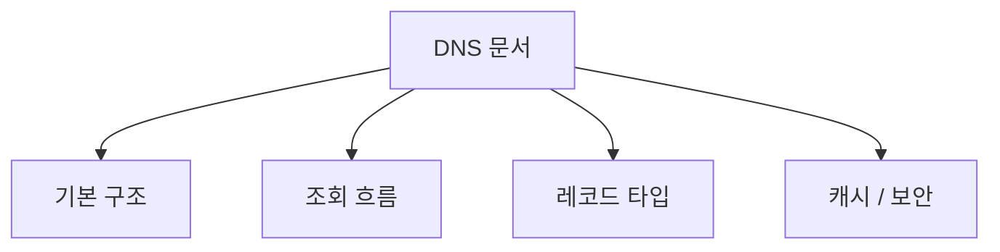
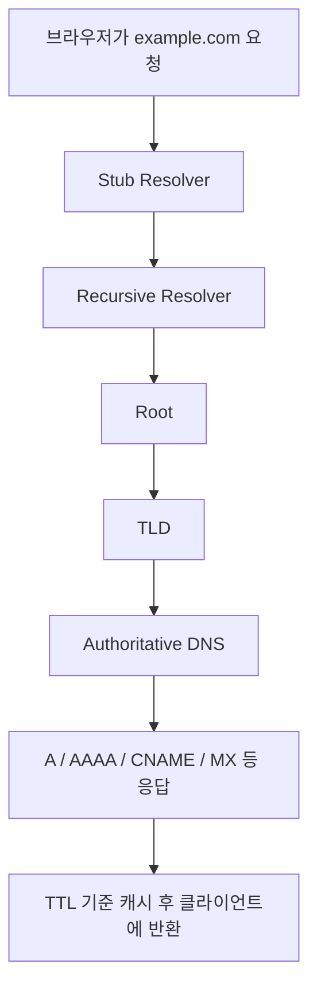
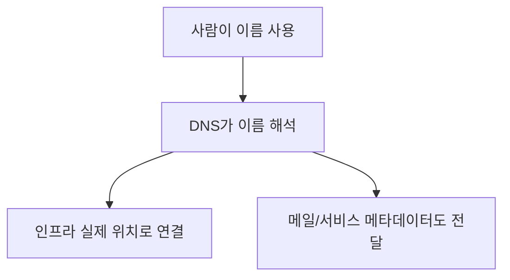
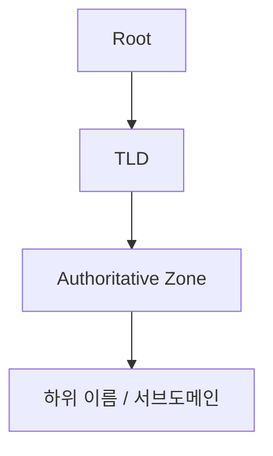
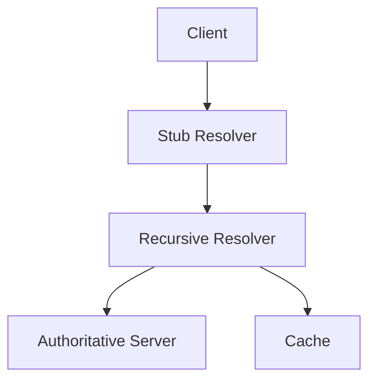
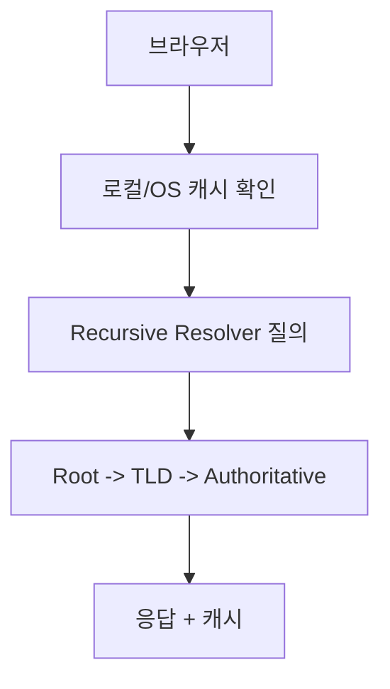
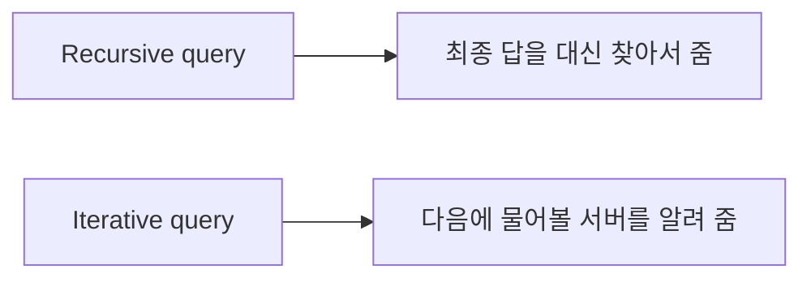

# DNS 상세 정리

작성 기준일: 2026-04-15  
조사 방식: 웹검색 기반 최신 조사  
주요 참고: `rfc-editor.org` RFC, `iana.org` DNS Parameters Registry

## 1. 문서 목적



이 문서는 `DNS(Domain Name System)`를 처음 배우는 사람부터 이미 어느 정도 써 본 사람까지, "DNS가 정확히 무엇이고 실제로는 어떻게 동작하는지"를 한 번에 연결해서 이해할 수 있도록 정리한 학습 문서다.

단순히 "도메인을 IP로 바꿔 주는 시스템" 정도에서 멈추지 않고 아래를 함께 설명한다.

- DNS가 왜 필요한가
- 브라우저가 도메인을 조회할 때 실제로 무슨 일이 일어나는가
- recursive resolver, authoritative server, zone, delegation이 무엇인가
- TTL과 캐시가 왜 중요한가
- A, AAAA, CNAME, MX, NS, SOA, TXT, PTR, SRV, HTTPS/SVCB 같은 레코드가 각각 무엇을 의미하는가
- UDP/TCP, DoT, DoH는 어떤 관계인가
- DNSSEC는 무엇을 보호하고 무엇은 보호하지 않는가

즉 이 문서는 단순 정의 모음이 아니라 "`DNS를 시스템으로 읽는 감각`"을 만드는 데 목적이 있다.

---

## 2. 먼저 한 줄 요약



DNS는 사람이 읽는 이름(`example.com`)과 네트워크가 실제로 통신하는 대상(IP 주소나 서비스 위치 정보) 사이를 연결해 주는 분산 계층형 이름 시스템이다.

RFC 1034는 DNS를 domain style names를 사용한 host address lookup과 electronic mail forwarding 등을 위한 시스템으로 설명한다.

즉 DNS는 단순한 "전화번호부"보다 더 넓다.

- 이름 -> IP 주소 매핑
- 메일 서버 위치
- 서비스 발견(service discovery)
- 인증/검증용 메타데이터
- 최신에는 HTTPS 연결 힌트

까지 전달할 수 있다.

즉 DNS는 인터넷의 이름 해석 인프라이자, 여러 프로토콜이 기대는 기초 메타데이터 계층이다.

---

## 3. DNS가 왜 필요한가



### 3.1 사람이 IP를 직접 기억하기는 어렵다

예를 들어:

- `142.250.196.14`
- `104.18.32.7`

같은 IP는 사람이 서비스 이름처럼 기억하기 어렵다.

반면:

- `google.com`
- `example.com`

은 기억하기 쉽다.

DNS는 이 문제를 해결한다.

### 3.2 이름과 실제 위치를 분리할 수 있다

DNS가 없으면 서버 IP가 바뀔 때마다 사용자가 직접 새 주소를 알아야 한다.

DNS가 있으면:

- 사용자는 계속 같은 도메인을 쓰고
- 운영자는 뒤에서 IP나 서비스 위치를 바꿀 수 있다

즉 DNS는 이름과 실제 인프라를 느슨하게 결합한다.

### 3.3 하나의 이름에 여러 정보도 붙일 수 있다

DNS는 단순 IP 매핑을 넘어서:

- 웹 서버 주소
- 메일 서버 주소
- 인증용 TXT 정보
- 서비스 포트 정보

까지 실을 수 있다.

즉 DNS는 "이름 해석 + 서비스 메타데이터 전달 계층"이라고 이해하는 편이 맞다.

---

## 4. DNS의 큰 구조



RFC 1034와 RFC 1035의 핵심 감각은 DNS가 `분산되고`, `계층적이며`, `위임(delegation)`되는 이름 시스템이라는 점이다.

### 4.1 계층 구조

아주 단순하게 그리면:

```text
.
└── com
    └── example.com
        ├── www.example.com
        └── api.example.com
```

이 구조에서:

- 최상단은 `root`
- 그 아래는 `TLD` (`com`, `net`, `org`, `kr` 등)
- 그 아래는 각 도메인 zone

이다.

### 4.2 분산 시스템

DNS는 중앙 서버 한 대가 모든 이름을 다 아는 시스템이 아니다.

대신:

- root는 root가 아는 범위만
- `.com`은 `.com` 아래 위임 정보만
- `example.com` authoritative server는 자기 zone만

안다.

즉 필요한 서버를 따라가며 답을 찾는 구조다.

### 4.3 위임(delegation)

DNS가 커질 수 있는 이유는 위임 때문이다.

예를 들어 root는:

- `.com`에 대한 책임을 `.com` 네임서버들에 위임

하고,

`.com`은:

- `example.com`에 대한 책임을 `example.com`의 authoritative nameserver에 위임

한다.

즉 DNS는 "전체를 하나가 관리"하는 게 아니라, 구간별 책임을 나누는 시스템이다.

---

## 5. DNS에서 자주 나오는 역할들



RFC 1034/1035, RFC 8499 용어 기준으로 보면 DNS에는 몇 가지 핵심 역할이 있다.

### 5.1 Stub Resolver

사용자 장비(브라우저/OS) 쪽의 가장 얇은 질의자다.

즉:

- 앱이 `example.com`을 질의하면
- 보통 OS stub resolver가
- 지정된 recursive resolver에 질의를 보낸다

실무적으로는 사용자가 직접 iterative query를 하지 않는다.

### 5.2 Recursive Resolver

보통 ISP, 회사 DNS, 퍼블릭 DNS(예: 8.8.8.8, 1.1.1.1)가 담당한다.

역할:

- 클라이언트를 대신해
- root -> TLD -> authoritative까지 따라가며
- 최종 답을 구해 오고
- 캐시에 저장한다

즉 recursive resolver는 "대리 조회자"다.

### 5.3 Authoritative Name Server

RFC 1035는 authoritative server가 특정 zone의 데이터를 읽고 그 zone에 대해 authoritative answer를 반환하는 서버라고 설명한다.

즉 authoritative server는:

- "남에게 물어보고 답하는 서버"가 아니라
- "이 zone에 대한 원본 권한을 가진 서버"

다.

예:

- `example.com`의 authoritative nameserver는
- `www.example.com`, `api.example.com`, `MX`, `TXT` 같은 원본 데이터를 가진다

### 5.4 Cache

recursive resolver는 받은 답을 일정 시간 저장한다.

이게 DNS 성능과 규모 확장의 핵심이다.

즉 매번 root부터 다 묻지 않고, TTL 동안은 캐시된 답을 재사용한다.

---

## 6. 브라우저에서 도메인을 입력하면 무슨 일이 일어나나



`https://www.example.com`을 입력했다고 가정하자.

### 6.1 로컬 캐시 확인

먼저 브라우저/OS는:

- 브라우저 DNS cache
- OS resolver cache

를 볼 수 있다.

### 6.2 Stub resolver가 recursive resolver에 질의

로컬에 없으면 보통 OS가 설정된 DNS 서버로 질의한다.

예:

- 집 공유기
- 회사 내부 DNS
- 퍼블릭 recursive resolver

### 6.3 Recursive resolver가 답을 알고 있으면 바로 응답

캐시에 있으면 즉시 준다.

이게 DNS 응답이 빠른 이유 중 하나다.

### 6.4 없으면 iterative lookup

없으면 recursive resolver가 대략 아래 순서로 찾는다.

1. Root 서버에 "`www.example.com` 어디로 가야 하나?" 비슷한 질의
2. Root는 `.com` 네임서버 정보를 알려 줌
3. `.com` 네임서버에 질의
4. `.com`은 `example.com` authoritative NS를 알려 줌
5. `example.com` authoritative NS에 질의
6. 최종 A/AAAA/CNAME 등 응답 획득

즉 recursive resolver가 사용자를 대신해 여러 단계 탐색을 수행한다.

### 6.5 결과 캐시

얻은 결과는 TTL 동안 캐시된다.

즉 다음 사용자는 더 빠르게 답을 받을 수 있다.

---

## 7. Recursive query와 iterative query



이 둘은 DNS를 배울 때 꼭 구분해야 한다.

### 7.1 Recursive query

질문하는 쪽의 의미:

- "최종 답을 네가 다 찾아서 줘"

즉 stub resolver가 recursive resolver에 보통 이런 방식으로 묻는다.

### 7.2 Iterative query

질문받은 쪽의 의미:

- "내가 최종 답은 없지만, 다음에 누구에게 물어봐야 하는지는 알려 줄게"

즉:

- root -> `.com`
- `.com` -> `example.com` authoritative

같은 referral 형태다.

### 7.3 실무 감각

사용자는 보통 recursive query만 의식하면 된다.

하지만 DNS 운영/디버깅에서는 iterative 흐름을 알아야:

- delegation 문제
- glue 문제
- authoritative 설정 문제

를 이해할 수 있다.

---

## 8. Zone

### 8.1 zone이란

RFC 2181은 zone을 DNS tree에서 특정 관리 단위로 취급되는 domain들의 집합이라고 설명한다.

즉 zone은:

- 하나의 관리 경계
- 권한(authority) 경계

라고 보면 된다.

### 8.2 domain과 zone은 항상 완전히 같은가

꼭 그렇지는 않다.

예를 들어 `example.com` 아래에 `sub.example.com`을 별도 zone으로 위임하면:

- `example.com` zone
- `sub.example.com` zone

이 나뉜다.

즉 DNS name tree와 관리 경계는 delegation에 따라 달라진다.

### 8.3 zone 파일

전통적으로 authoritative DNS는 zone file 형태로 레코드를 관리한다.

여기엔:

- SOA
- NS
- A/AAAA
- MX
- TXT

같은 레코드가 들어간다.

---

## 9. Delegation과 zone cut

RFC 2181은 zone cut을 parent zone과 child zone을 나누는 경계라고 설명한다.

### 9.1 delegation이란

예:

- `example.com`이 `sub.example.com`을 별도 팀에 맡기고 싶다면
- parent zone에 `sub.example.com`의 NS 레코드를 둔다

즉:

- "이 하위 이름 공간은 저 authoritative server가 책임진다"

고 선언하는 것이다.

### 9.2 zone cut

이 delegation이 생기는 지점이 zone cut이다.

즉 그 아래는 더 이상 parent zone의 직접 권한 범위가 아니라 child zone의 권한 범위가 된다.

### 9.3 왜 중요한가

DNS 문제를 디버깅할 때 delegation을 모르면:

- parent zone에 레코드를 넣었는데 왜 안 보이지?
- 왜 authoritative answer가 아닌가?

같은 상황을 이해하기 어렵다.

즉 delegation은 운영상 매우 중요하다.

---

## 10. Glue record

### 10.1 왜 필요한가

delegation만 하면 가끔 순환 문제가 생긴다.

예를 들어 `example.com`의 authoritative NS가:

- `ns1.example.com`

인데, 그 `ns1.example.com`의 IP를 알려면 또 `example.com` zone을 알아야 한다.

이런 "닭과 달걀" 문제를 풀기 위해 parent zone이 추가로 A/AAAA 정보를 실어 주는 것이 glue다.

### 10.2 glue는 authoritative data와 같은가

RFC 2181은 glue를 특별 취급한다.

즉 glue는 delegation을 가능하게 하는 보조 정보이지, child zone 원본 권한 데이터와 완전히 같은 층으로 보면 안 된다.

### 10.3 실무 감각

서브도메인을 nameserver 이름 자체로 운영할 때:

- glue 누락
- glue 불일치

는 흔한 장애 원인이다.

---

## 11. TTL과 캐시

### 11.1 TTL이란

RFC 2181은 TTL(Time To Live)을 DNS 데이터가 캐시에서 얼마나 오래 유효한지 나타내는 값으로 다룬다.

즉 TTL은:

- "이 응답을 몇 초 동안 믿고 재사용해도 되는가"

를 뜻한다.

### 11.2 왜 중요한가

TTL은 두 가지를 동시에 결정한다.

- 캐시 효율
- 변경 전파 속도

TTL이 길면:

- 캐시 효율 좋음
- 변경 반영 느림

TTL이 짧으면:

- 변경 빨리 반영
- authoritative/query 부하 증가

즉 운영 트레이드오프다.

### 11.3 실무 예시

예를 들어 A 레코드 TTL이 300초면:

- recursive resolver는 5분 동안 그 답을 재사용할 수 있다

즉 DNS 레코드를 바꿔도 전 세계가 즉시 바뀌는 것은 아니다.

### 11.4 negative caching

RFC 2308은 존재하지 않는 이름(NXDOMAIN 등)에 대한 negative response도 캐시할 수 있다고 설명한다.

즉:

- "없는 이름"도 잠깐 캐시된다

그래서 방금 새 레코드를 만들었는데 한동안 "없다"고 보일 수 있다.

### 11.5 실무 감각

DNS 변경 작업에서 자주 생기는 오해:

- "레코드를 수정했는데 왜 바로 안 바뀌지?"

답은 보통:

- TTL
- negative cache
- 중간 recursive resolver cache

에 있다.

---

## 12. SOA

### 12.1 정체

SOA(Start of Authority)는 zone의 시작과 관리 메타데이터를 나타내는 핵심 레코드다.

RFC 2181도 SOA를 zone의 필수 레코드 맥락에서 다룬다.

### 12.2 왜 중요한가

SOA에는 보통:

- primary master
- 책임자 메일 표시
- serial
- refresh/retry/expire
- negative caching 관련 최소 TTL 계열 값

같은 운영 정보가 담긴다.

### 12.3 실무 감각

권한 DNS 운영에서는 SOA가:

- zone 변경 버전
- secondary 동기화
- negative caching 정책

에 직접 연결된다.

즉 레코드 한 줄이 아니라 zone 운영의 기준점이다.

---

## 13. NS

### 13.1 정체

NS(Name Server) 레코드는 어떤 nameserver가 그 zone을 담당하는지 나타낸다.

### 13.2 왜 중요한가

delegation은 결국 NS를 통해 표현된다.

즉:

- 어떤 zone이 누구 authoritative인지

를 말해 주는 핵심 레코드다.

### 13.3 운영 포인트

NS는 보통 둘 이상 두어 redundancy를 확보한다.

즉 authoritative DNS는 단일 서버가 아니라 다중 NS 구조로 운영하는 것이 일반적이다.

---

## 14. 대표 레코드 타입

IANA `DNS Parameters`의 RR TYPE registry와 RFC 1035, RFC 3596, RFC 2782, RFC 9460을 기준으로 자주 쓰는 타입을 정리하면 아래와 같다.

### 14.1 A

IPv4 주소 레코드다.

예:

```text
www.example.com -> 192.0.2.10
```

### 14.2 AAAA

RFC 3596이 정의하는 IPv6 주소 레코드다.

즉:

```text
www.example.com -> 2001:db8::10
```

### 14.3 CNAME

한 이름을 다른 canonical name으로 alias하는 레코드다.

예:

```text
app.example.com -> service.example.net
```

### 14.4 CNAME 주의점

CNAME은 편하지만 중요한 제약이 있다.

- CNAME이 있는 이름에는 다른 일반 레코드를 같이 둘 수 없다

즉 apex(`example.com`)에서는 전통적으로 CNAME 운용이 까다롭다.

이 때문에 최근에는 HTTPS/SVCB나 provider별 ALIAS/ANAME 류 기능이 등장하기도 한다.

### 14.5 MX

메일 서버를 지정하는 레코드다.

RFC 1034도 mail forwarding을 DNS 목적 중 하나로 설명한다.

즉:

- 이 도메인 메일은 어느 서버로 보내야 하는가

를 나타낸다.

### 14.6 TXT

임의 텍스트를 담는 레코드다.

실무에서는 자주:

- SPF 정책
- 도메인 소유권 검증
- 각종 SaaS 검증

용도로 본다.

### 14.7 PTR

역방향 조회용 레코드다.

즉:

- IP -> 이름

매핑에 쓴다.

예:

- 메일 서버 평판
- 역방향 이름 확인

### 14.8 SRV

RFC 2782는 SRV를 "특정 서비스/프로토콜에 대해 어느 서버가 위치하는지" 지정하는 RR이라고 설명한다.

즉:

- 단순 호스트 주소가 아니라
- 서비스 발견
- 우선순위/가중치/포트

까지 실을 수 있다.

### 14.9 HTTPS / SVCB

RFC 9460은 SVCB와 HTTPS RR이:

- 서비스 대체 endpoint
- transport configuration hint
- HTTP origin 연결에 필요한 추가 정보

를 미리 전달한다고 설명한다.

즉 DNS가 단순 A/AAAA를 넘어서:

- HTTP/3 준비
- apex aliasing
- 더 나은 endpoint 선택

같은 현대 기능을 담을 수 있게 된 것이다.

### 14.10 SOA / NS는 zone 운영 레코드

실무에서는 A/AAAA/CNAME/MX/TXT만 보는 경우가 많지만, 사실 DNS 운영 관점에서는 SOA와 NS가 zone의 뼈대다.

---

## 15. CNAME과 alias 관련 주의점

이건 실무에서 많이 헷갈린다.

### 15.1 CNAME은 "별칭"이다

즉 그 이름 자체에 대한 다른 레코드를 두는 게 아니라:

- "이 이름은 사실 저 이름을 가리킨다"

는 의미다.

### 15.2 apex 문제

zone apex(`example.com`)에는:

- NS
- SOA

가 필수이기 때문에, 전통적인 CNAME을 그대로 두기 어렵다.

그래서 CDN/DNS 사업자들은:

- ALIAS
- ANAME
- flattening

같은 비표준 관리형 기능을 제공하기도 한다.

### 15.3 HTTPS/SVCB와의 관계

RFC 9460은 HTTPS RR이 apex aliasing 같은 use case도 도와준다고 설명한다.

즉 현대 DNS는 전통 CNAME 한계도 조금씩 보완해 가고 있다.

---

## 16. DNS 응답은 항상 UDP인가

많이들 "DNS는 UDP 53"로 외우지만, 반만 맞다.

### 16.1 기본 감각

전통적으로 DNS 질의는 UDP를 많이 쓴다.

이유:

- 짧고 빠름
- 연결 수립 없음

### 16.2 TCP도 중요하다

RFC 7766은 DNS over TCP support가 이제 required part of a full DNS protocol implementation이라고 설명한다.

즉 현대 DNS는 TCP도 필수다.

왜냐하면:

- 큰 응답
- zone transfer
- truncation(TC bit)
- DNSSEC 등으로 응답이 커질 수 있기 때문

### 16.3 실무 감각

즉:

- 일반 질의는 UDP가 많지만
- DNS는 TCP도 정상 지원해야 한다

라고 이해해야 한다.

`53/udp`만 열고 끝내는 식으로 보면 부족할 수 있다.

---

## 17. DoT와 DoH

DNS 본래 프로토콜은 평문이라 프라이버시 문제가 있다.

### 17.1 DoT

RFC 7858은 DNS over TLS가:

- TLS를 이용해
- stub-to-recursive 트래픽의 privacy를 제공한다고

설명한다.

즉:

- DNS 메시지는 그대로 DNS 형식
- 전송 채널만 TLS로 보호

하는 감각이다.

### 17.2 DoH

RFC 8484는 DoH를 "DNS queries over HTTPS"라고 설명한다.

즉:

- DNS 질의/응답을
- HTTPS exchange 위로 실어 보내는 방식

이다.

### 17.3 차이

- DoT: DNS over TLS
- DoH: DNS over HTTPS

둘 다 목표는 비슷하다.

- 기밀성
- 중간 감청/변조 완화

하지만 포장 방식이 다르다.

### 17.4 실무 감각

- 일반 네트워크 인프라/전통 resolver 친화 -> DoT
- 웹/브라우저/HTTPS 생태계 친화 -> DoH

정도로 이해하면 된다.

단, 둘 다 주로:

- stub resolver와 recursive resolver 사이 privacy

를 강화하는 맥락에서 많이 논의된다.

---

## 18. DNSSEC

### 18.1 정체

RFC 4033은 DNSSEC가 DNS에:

- data origin authentication
- data integrity

를 추가한다고 설명한다.

즉 DNSSEC는:

- 이 DNS 응답이 진짜 서명된 권한 데이터인지
- 중간에 바뀌지 않았는지

를 검증하게 해 준다.

### 18.2 무엇을 해 주는가

RFC 4033 기준 핵심:

- 서명 검증
- 위조 응답 탐지
- 존재하지 않는 이름/타입의 authenticated denial

즉 DNS cache poisoning류 문제를 크게 완화한다.

### 18.3 무엇을 해 주지 않는가

RFC 4033은 DNSSEC가 confidentiality를 제공하지 않는다고 명시한다.

즉:

- 질의 내용 숨김
- 사용자가 뭘 조회하는지 프라이버시 보장

은 해 주지 않는다.

그건 DoT/DoH 같은 문제다.

### 18.4 어떻게 돌아가나

RFC 4033/4034/4035 문맥의 핵심 감각은:

- zone이 자신의 RRset에 서명
- parent가 child에 대한 DS로 chain 형성
- resolver가 trust anchor부터 따라가며 검증

이다.

즉 DNSSEC는 "서명된 위임 체인"이다.

### 18.5 실무 감각

DNSSEC는 매우 중요하지만 운영 난도도 높다.

이유:

- 키 롤오버
- 서명 관리
- parent/child DS 관리
- 캐시와 검증 실패 디버깅

즉 "켜면 끝" 수준은 아니다.

---

## 19. DNS가 제공하지 않는 것

DNS를 과대평가하면 설계가 꼬인다.

### 19.1 DNS는 서비스 헬스체크 자체가 아니다

DNS가 A 레코드를 반환한다고:

- 그 서버가 건강하다는 뜻은 아니다

즉 load balancer health checking과 DNS는 다르다.

### 19.2 DNS는 애플리케이션 인증이 아니다

DNS 이름이 맞는다고:

- HTTPS 인증서 검증이 끝난 것은 아니다

즉 DNS와 TLS 인증은 별개 층이다.

### 19.3 DNSSEC는 privacy를 주지 않는다

이건 위에서 본 것처럼 매우 중요하다.

즉:

- 무결성/출처 인증
- 프라이버시

를 분리해서 생각해야 한다.

### 19.4 TTL은 즉시 반영 보장이 아니다

TTL이 끝나기 전에는 중간 캐시에 예전 값이 남을 수 있다.

즉 DNS 변경은 "즉시 global consistency" 시스템이 아니다.

---

## 20. 실무에서 자주 하는 오해

### 20.1 "DNS는 그냥 도메인을 IP로 바꾸는 것"

반은 맞고 반은 틀리다.

맞는 부분:

- A/AAAA 조회는 맞다.

부족한 부분:

- MX
- TXT
- SRV
- HTTPS/SVCB
- PTR
- DNSSEC

같은 역할도 매우 중요하다.

### 20.2 "authoritative server가 캐시도 해 준다"

일반적으로 recursive resolver와 authoritative server는 역할이 다르다.

즉:

- recursive = 대신 찾아주고 캐시
- authoritative = 원본 권한 데이터 제공

이다.

### 20.3 "TTL 0이면 무조건 즉시 전 세계 반영"

현실은 더 복잡하다.

중간 캐시, 클라이언트 구현, negative cache, resolver 정책이 섞인다.

즉 TTL은 중요한 힌트지만 절대적 실시간 보장 장치는 아니다.

### 20.4 "DNSSEC가 있으면 DoH/DoT가 필요 없다"

틀리다.

- DNSSEC = 무결성/출처 인증
- DoT/DoH = 전송 프라이버시/기밀성

즉 서로 대체 관계가 아니다.

### 20.5 "`CNAME`은 어디에나 넣을 수 있다"

zone apex 같은 곳에서는 제약이 크다.

즉 DNS 레코드는 타입별 운영 제약을 알고 써야 한다.

---

## 21. 운영/디버깅 관점에서 중요한 포인트

DNS를 공부할 때는 개념만 알면 부족하고, 운영 감각도 필요하다.

### 21.1 확인해야 할 것

- authoritative NS가 맞는가
- delegation이 올바른가
- glue가 필요한데 빠지지 않았는가
- TTL이 너무 길지 않은가
- negative cache가 남아 있지 않은가
- 레코드 타입이 의도와 맞는가 (`A` vs `CNAME` vs `MX` 등)

### 21.2 문제 증상 예시

- 어떤 환경에서는 새 IP로 가고 어떤 환경에서는 예전 IP로 간다
- 일부 resolver에서만 NXDOMAIN이 난다
- apex에 CNAME 넣으려다 충돌난다
- DNSSEC 서명/DS 불일치로 검증 실패한다

즉 DNS 장애는 단순 "레코드 오타"보다:

- 계층 구조
- 캐시
- 위임
- 전송 방식

문제를 같이 봐야 풀린다.

---

## 22. 추천 학습 순서

DNS를 처음부터 제대로 잡으려면 아래 순서가 좋다.

### 1단계: 기본 개념

- 이름 공간
- recursive resolver
- authoritative server
- zone
- delegation

### 2단계: 레코드 타입

- A
- AAAA
- CNAME
- MX
- NS
- SOA
- TXT
- PTR

### 3단계: 캐시와 운영

- TTL
- negative cache
- zone transfer 개념
- glue

### 4단계: 현대 확장

- SRV
- HTTPS/SVCB
- TCP support
- DoT / DoH

### 5단계: 보안

- DNSSEC
- 무엇을 보호하는지 / 보호하지 않는지

이 순서로 가면 "브라우저에서 도메인 치면 왜 이런 결과가 나오는지"가 실제로 보이기 시작한다.

---

## 23. 한 문장 결론

DNS는 단순히 도메인을 IP로 바꿔 주는 전화번호부가 아니라, 분산된 계층형 이름 공간 위에서 recursive resolver, authoritative server, cache, zone delegation, 다양한 RR 타입, 그리고 TLS/메일/서비스 발견까지 받쳐 주는 인터넷의 핵심 메타데이터 시스템이다.

즉 DNS를 제대로 이해한다는 것은:

- 이름 해석 흐름
- 권한(authority)과 위임
- 캐시와 TTL
- 레코드 타입의 의미
- 보안과 프라이버시의 한계

를 함께 이해하는 것을 뜻한다.

---

## 24. 공식 출처

- RFC 1034, Domain Names - Concepts and Facilities: <https://www.rfc-editor.org/info/rfc1034>
- RFC 1035, Domain Names - Implementation and Specification: <https://www.rfc-editor.org/info/rfc1035>
- RFC 2181, Clarifications to the DNS Specification: <https://www.rfc-editor.org/info/rfc2181>
- RFC 2308, Negative Caching of DNS Queries: <https://www.rfc-editor.org/info/rfc2308>
- RFC 2782, A DNS RR for specifying the location of services (SRV): <https://www.rfc-editor.org/info/rfc2782>
- RFC 3596, DNS Extensions to Support IPv6 (AAAA): <https://www.rfc-editor.org/info/rfc3596>
- RFC 4033, DNS Security Introduction and Requirements: <https://www.rfc-editor.org/info/rfc4033>
- RFC 7766, DNS Transport over TCP - Implementation Requirements: <https://www.rfc-editor.org/info/rfc7766>
- RFC 7858, DNS over TLS (DoT): <https://www.rfc-editor.org/info/rfc7858>
- RFC 8484, DNS Queries over HTTPS (DoH): <https://www.rfc-editor.org/info/rfc8484>
- RFC 8499, DNS Terminology: <https://www.rfc-editor.org/rfc/rfc8499.html>
- RFC 9460, SVCB and HTTPS Resource Records: <https://www.rfc-editor.org/info/rfc9460>
- IANA DNS Parameters Registry: <https://www.iana.org/assignments/dns-parameters/dns-parameters.xhtml>
