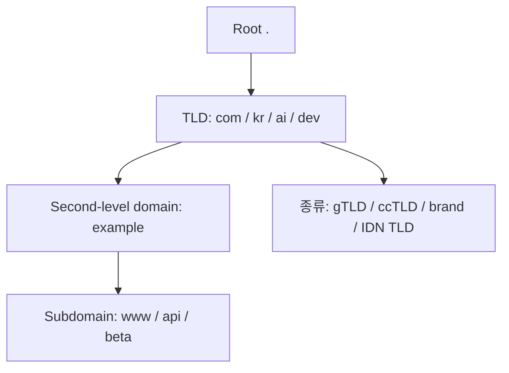

# TLD 상세 정리

작성 기준일: 2026-04-15  
조사 방식: 웹검색 기반 최신 조사  
주요 참고: `rfc-editor.org` RFC, `iana.org` Root Zone Database, `icann.org` 용어집

## 1. 문서 목적

이 문서는 `TLD(Top-Level Domain)`를 처음 배우는 사람부터 이미 DNS를 조금 본 사람까지, "TLD가 정확히 무엇이고 DNS 전체 구조 안에서 어디에 위치하는지"를 한 번에 이해할 수 있도록 정리한 학습 문서다.

특히 아래를 함께 설명한다.

- TLD의 정확한 정의
- root, TLD, second-level domain의 관계
- `gTLD`, `ccTLD`, `sTLD`, `brand TLD`, `IDN TLD`
- IANA Root Zone Database와 delegation
- registry와 registrar의 차이
- `.com`, `.kr`, `.ai`, `.dev`, `.aws` 같은 이름이 각각 어떤 성격인지
- 예약된 TLD(`.test`, `.example`, `.invalid`, `.localhost`)

즉 이 문서는 단순히 "도메인 맨 끝에 붙는 것"이라는 수준을 넘어서, TLD를 DNS 계층과 운영 구조 안에서 이해하도록 돕는 문서다.

---

## 2. 먼저 한 줄 요약



`TLD(Top-Level Domain)`는 DNS 이름 공간에서 root 바로 아래에 위치하는 최상위 도메인 레이블이다.

예:

- `example.com`에서 TLD는 `.com`
- `google.co.kr`에서 최상위 레벨만 보면 TLD는 `.kr`
- `service.ai`에서 TLD는 `.ai`

즉 TLD는 "도메인 이름의 가장 오른쪽 끝 레이블"이다.

RFC 1591은 DNS names 구조를 설명하면서 top-level domain names를 `.com`, `.us` 같은 root 바로 아래 이름으로 다룬다.

즉 TLD는 DNS tree에서 root 다음 레벨이다.

---

## 3. DNS 계층에서 TLD는 어디에 있나

DNS 이름은 계층형이다.

가장 단순한 그림:

```text
.
└── com
    └── example
        └── www
```

여기서:

- `.` = root
- `com` = TLD
- `example` = second-level domain
- `www` = 하위 호스트/서브도메인 레이블

즉 `www.example.com.`이라는 완전한 이름(FQDN)에서:

- root 바로 아래 `com`이 TLD

다.

### 3.1 왜 "top-level"인가

사람이 쓰는 순서는 왼쪽에서 오른쪽으로 읽지만, DNS tree 관점에서는 오른쪽으로 갈수록 root에 가깝다.

즉:

- `www`보다 `example`이 더 위
- `example`보다 `com`이 더 위
- `com`보다 `.`가 더 위

이기 때문에 `.com`을 top-level domain이라고 부른다.

### 3.2 FQDN과 끝의 점

엄밀한 DNS 표현에서는:

```text
www.example.com.
```

처럼 끝에 점을 붙여 root까지 포함한 fully qualified domain name으로 쓸 수 있다.

즉 TLD 뒤의 보이지 않는 최상단은 사실 root(`.`)다.

---

## 4. TLD의 기본 정의

IANA Root Zone Management 문서는 root zone의 역할을 "top-level domains such as .uk and .com의 operator를 관리하고 delegation details를 유지하는 일"이라고 설명한다.

즉 TLD는:

- root zone 안에 위임 정보가 존재하고
- 각 TLD마다 담당 operator / registry가 있으며
- 그 TLD 아래 이름 공간을 다시 관리하도록 위임받는다

는 특성을 가진다.

### 4.1 아주 단순한 정의

TLD는:

- DNS root 바로 아래의 domain

이다.

### 4.2 운영 관점 정의

TLD는:

- 루트에서 위임된 이름 공간
- 하나의 registry가 운영하는 최상위 namespace

라고도 볼 수 있다.

즉 TLD는 단순 문자열이 아니라:

- 기술적 위임 단위
- 정책 단위
- 등록(registration) 단위

다.

---

## 5. 예시로 보는 TLD 읽는 법

### 5.1 `example.com`

- TLD: `.com`
- second-level domain: `example`

### 5.2 `service.ai`

- TLD: `.ai`
- second-level domain: `service`

### 5.3 `google.co.kr`

많이 헷갈리는 예시다.

DNS 계층상 TLD는 `.kr`다.

즉:

- TLD: `.kr`
- 그 아래 second-level label: `co`
- 그 아래 third-level label: `google`

다.

다만 사용자 감각이나 등록 정책상 `co.kr`을 하나의 등록 단위처럼 보는 경우가 많아서 헷갈린다.

즉:

- DNS 계층에서의 TLD
- 실제 등록 가능한 도메인 경계

는 항상 같지 않다.

### 5.4 `my.shop`

- TLD: `.shop`
- second-level domain: `my`

즉 새로운 generic TLD도 구조는 똑같다.

---

## 6. gTLD

### 6.1 정의

ICANN 용어집은 `gTLD(generic top-level domain)`를 `.com`, `.net`, `.edu`, `.org` 같은 general-purpose domains와 New gTLD Program 아래의 `.futbol`, `.istanbul`, `.pizza` 같은 이름들을 포함하는 class라고 설명한다.

즉 gTLD는 국가 코드가 아닌 일반/범용 계열 TLD라고 보면 된다.

### 6.2 대표 예시

- `.com`
- `.net`
- `.org`
- `.info`
- `.app`
- `.dev`
- `.shop`
- `.cloud`

### 6.3 특징

gTLD는 보통:

- 특정 국가 코드에 묶이지 않고
- 다양한 등록 정책 아래
- 전 세계 누구나(또는 조건에 따라) 등록 가능

한 형태가 많다.

### 6.4 초기 gTLD와 새로운 gTLD

역사적으로는:

- `.com`
- `.net`
- `.org`
- `.edu`
- `.gov`
- `.mil`

같은 초기 gTLD 계열이 먼저 유명해졌다.

이후 ICANN New gTLD Program을 통해:

- `.app`
- `.dev`
- `.blog`
- `.xyz`
- `.shop`

같은 훨씬 다양한 문자열이 등장했다.

즉 오늘날 gTLD는 종류가 매우 많다.

---

## 7. ccTLD

### 7.1 정의

RFC 1591은 country code top-level domain이 ISO 3166 리스트를 기반으로 선택된다고 설명한다.

즉 ccTLD는 국가/지역 코드 기반 TLD다.

### 7.2 대표 예시

- `.kr` = 대한민국
- `.us` = 미국
- `.jp` = 일본
- `.de` = 독일
- `.uk` = 영국
- `.ai` = 앵귈라

### 7.3 중요한 실무 포인트

ccTLD는 "그 나라 사람만 쓴다"는 뜻이 아니다.

정책은 각 registry가 정한다.

즉:

- 어떤 ccTLD는 현지 요건이 엄격하고
- 어떤 ccTLD는 전 세계 등록을 넓게 허용한다

예:

- `.ai`
- `.io`
- `.tv`

같은 ccTLD는 원래 국가 코드지만, 스타트업/브랜딩 용도로 국제적으로도 널리 쓰인다.

### 7.4 `co.kr` 같은 구조

많은 ccTLD는 자기 아래에 다시 분류 레이블을 둘 수 있다.

예:

- `co.kr`
- `or.kr`
- `go.kr`

이건 등록 정책 구조다.

즉 `.kr`이 TLD이고, `co.kr`은 그 아래 registration namespace 운영 방식 중 하나다.

---

## 8. sTLD, brand TLD, community TLD

### 8.1 sponsored TLD(sTLD)

ICANN 용어집은 일부 gTLD가 sponsored gTLD이며 특정 커뮤니티를 대표한다고 설명한다.

예:

- `.aero`
- `.coop`
- `.museum`

즉 모두가 완전히 자유롭게 쓰는 범용 TLD라기보다, 특정 공동체를 위한 정책적 TLD다.

### 8.2 brand TLD

현대 gTLD 중에는 기업 브랜드 전용 TLD도 많다.

예:

- `.google`
- `.aws`
- `.apple`

이런 TLD는 보통 일반 대중이 자유 등록하는 공간이 아니라, 해당 브랜드가 통제하는 namespace다.

### 8.3 community / geographic TLD

예:

- `.london`
- `.paris`
- `.berlin`
- `.bank` 같은 제한적 성격의 도메인

즉 TLD는 단순 기술 식별자가 아니라 정책과 커뮤니티 정체성을 같이 담기도 한다.

---

## 9. IDN TLD

### 9.1 정체

IANA Root Zone Database를 보면 ASCII가 아닌 문자로 된 TLD도 존재한다.

예:

- `.বাংলা`
- `.公益`
- `.公司`
- `.онлайн`

즉 TLD는 반드시 영문 2~3글자여야 하는 시대가 아니다.

### 9.2 왜 중요한가

IDN TLD는:

- 비영어권 사용자 접근성
- 자국어 인터넷 정체성

측면에서 중요하다.

### 9.3 기술적 감각

실제 DNS 프로토콜 내부에서는 이런 이름도 punycode/IDNA 처리와 연결된다.

즉 표시 형태와 내부 wire format은 다를 수 있다.

---

## 10. Root Zone과 TLD의 관계

IANA Root Zone Database는 "The Root Zone Database represents the delegation details of top-level domains"라고 설명한다.

즉 root zone은:

- 어떤 TLD가 존재하는지
- 그 TLD를 누가 운영하는지
- 어떤 nameserver로 위임되는지

를 담고 있다.

### 10.1 root zone에 있는 것

대체로:

- TLD에 대한 NS 정보
- 필요 시 glue 정보

같은 delegation data가 들어간다.

### 10.2 root zone이 하는 일

root는 TLD 아래 개별 도메인을 직접 관리하지 않는다.

예:

- root는 `.com` 운영자 정보와 위임을 관리
- `.com` 아래 `example.com` 등록은 `.com` 생태계에서 처리

즉 root는 TLD 레벨까지만 직접 관여한다.

### 10.3 실무 감각

TLD를 이해한다는 것은 결국:

- root zone에서 한 번 위임되고
- 그 아래 registry가 namespace를 운영한다

는 구조를 이해하는 것이다.

---

## 11. Registry와 Registrar

TLD를 이해할 때 자주 같이 나오는 개념이다.

### 11.1 Registry

registry는 특정 TLD namespace를 운영하는 주체다.

예를 들어 `.com` registry, `.kr` registry 같은 식이다.

즉:

- TLD 전체 데이터베이스 운영
- 네임서버/등록 정책 관리

를 맡는다.

### 11.2 Registrar

registrar는 최종 사용자에게 도메인 등록 서비스를 제공하는 업체다.

예:

- 가비아
- 후이즈
- GoDaddy
- Namecheap

같은 곳이 registrar 역할을 할 수 있다.

### 11.3 관계

즉 보통 구조는:

- root -> TLD registry -> registrar -> registrant(최종 사용자)

다.

### 11.4 왜 헷갈리나

사용자는 도메인을 "구매"할 때 registrar만 보므로, registry와 registrar를 같은 것처럼 느끼기 쉽다.

하지만 기술/운영 구조상 둘은 다르다.

---

## 12. TLD와 second-level domain의 차이

이것도 자주 헷갈린다.

### 12.1 `example.com`

- TLD: `.com`
- second-level domain: `example`

### 12.2 `example.co.kr`

- TLD: `.kr`
- 그 아래 분류: `co`
- 실질 등록 이름: `example`

즉 사람들은 `co.kr`을 TLD처럼 느낄 수 있지만, DNS 계층상 TLD는 `.kr`다.

### 12.3 왜 중요한가

도메인 정책이나 쿠키 스코프, public suffix 개념을 이해할 때:

- DNS 계층 구조
- 실제 등록 경계

를 구분해야 한다.

즉 TLD와 "사용자가 등록 가능한 최소 단위"는 항상 같지 않다.

---

## 13. TLD와 Public Suffix는 같은가

아니다.

이건 실무에서 자주 헷갈린다.

### 13.1 TLD

DNS root 바로 아래 레이블이다.

예:

- `.com`
- `.kr`

### 13.2 Public Suffix

브라우저/쿠키/보안 처리에서 쓰는 개념으로, 실제 등록 경계에 가까운 단위다.

예:

- `.com`
- `co.kr`

모두 public suffix가 될 수 있다.

즉 `co.kr`은 TLD는 아니지만 public suffix일 수 있다.

### 13.3 왜 중요한가

사용자가 "TLD가 뭐냐"고 묻는 상황과,

- 쿠키를 어디까지 줄 수 있나
- 등록 가능한 최소 경계가 어디냐

를 묻는 상황은 다르다.

즉 TLD만 외우면 실제 웹 보안/브라우저 동작은 절반만 이해한 셈이다.

---

## 14. 예약된 TLD

RFC 2606은 충돌을 줄이기 위해 몇몇 top-level domain names를 예약한다고 설명한다.

대표 예:

- `.test`
- `.example`
- `.invalid`
- `.localhost`

### 14.1 왜 중요한가

문서 예시, 테스트 코드, 내부 실험에서 실재하는 TLD를 쓰면 나중에 충돌할 수 있다.

그래서 RFC 2606은 이런 목적에 안전한 예약 TLD를 제시한다.

### 14.2 실무 감각

문서/샘플/테스트에서는:

- `example.com`
- `example.org`
- `example.net`
- `.test`

같은 예약 예시를 쓰는 것이 맞다.

즉 가짜 예시를 적을 때 실제 운영 중인 남의 도메인을 들고 오면 안 된다.

---

## 15. TLD가 많아진 이유

초기 인터넷에서는 TLD 종류가 지금보다 훨씬 적었다.

이후 늘어난 이유는 대체로:

- 더 많은 이름 공간 필요
- 국가/지역/언어 반영
- 브랜드/커뮤니티 정체성
- 도메인 선택 폭 확대

때문이다.

즉 지금은 `.com`만이 세계가 아니라:

- ccTLD
- new gTLD
- IDN TLD
- brand TLD

가 매우 넓게 공존한다.

---

## 16. 실무에서 자주 하는 오해

### 16.1 "`co.kr`이 TLD다"

엄밀히는 아니다.

TLD는 `.kr`이고, `co.kr`은 그 아래 운영/등록 구조다.

### 16.2 "모든 TLD는 아무나 등록할 수 있다"

아니다.

TLD마다 정책이 다르다.

- 완전 개방형
- 국가 제한
- 커뮤니티 제한
- 브랜드 전용

등이 있다.

### 16.3 "TLD는 기술적 구분만이다"

아니다.

TLD는 기술적 위임 단위이면서 동시에:

- 정책 단위
- 사업 단위
- 브랜딩 단위

이기도 하다.

### 16.4 "TLD와 public suffix는 같다"

다르다.

이건 브라우저/쿠키/등록 정책 쪽에서 매우 중요하다.

---

## 17. 실무에서 TLD를 볼 때 체크할 것

### 17.1 이 이름이 어떤 성격의 TLD인가

- gTLD인가
- ccTLD인가
- brand/community 성격인가

### 17.2 등록 정책이 어떤가

- 누구나 등록 가능한가
- 국가/법인 제약이 있는가
- 사용 용도 제한이 있는가

### 17.3 운영 리스크가 있는가

- registry 안정성
- 분쟁/정책 변경 가능성
- 국가 코드 기반이면 정책 리스크

### 17.4 사용 목적과 맞는가

- 글로벌 서비스면 `.com`이 무난할 수 있음
- 특정 국가 타깃이면 ccTLD가 유리할 수 있음
- 브랜딩이면 new gTLD도 가능

즉 TLD 선택은 기술뿐 아니라 정책/브랜드/운영 판단이 함께 들어간다.

---

## 18. 한 문장 결론

TLD는 단순히 도메인 맨 끝에 붙는 문자열이 아니라, DNS root 바로 아래에서 위임되는 최상위 이름 공간이며, gTLD·ccTLD·brand TLD·IDN TLD처럼 서로 다른 정책과 운영 구조를 가진 namespace의 출발점이다.

즉 TLD를 제대로 이해한다는 것은:

- DNS 계층 구조
- root zone과 delegation
- registry와 registrar 구조
- 등록 정책과 실제 사용 경계

를 함께 이해하는 것을 뜻한다.

---

## 19. 공식 출처

- RFC 1034, Domain Names - Concepts and Facilities: <https://www.rfc-editor.org/info/rfc1034>
- RFC 1591, Domain Name System Structure and Delegation: <https://www.rfc-editor.org/info/rfc1591>
- RFC 2606, Reserved Top Level DNS Names: <https://www.rfc-editor.org/info/rfc2606>
- IANA Root Zone Database: <https://www.iana.org/domains/root/db>
- IANA Root Zone Management: <https://www.iana.org/domains/root>
- ICANN glossary - generic top-level domain (gTLD): <https://www.icann.org/en/icann-acronyms-and-terms/generic-top-level-domain-en>
