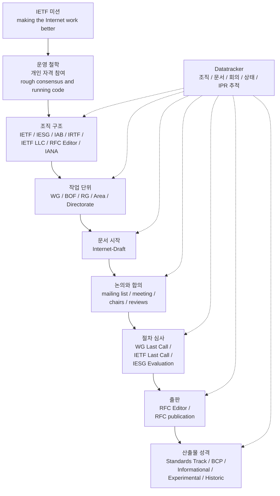

# IETF 상세 정리

작성 기준일: 2026-04-13  
주요 참고: `https://datatracker.ietf.org` 및 Datatracker에서 연결하는 공식 RFC 문서

## 1. 문서 목적

이 문서는 `IETF`가 무엇인지, 어떤 조직과 프로세스로 움직이는지, 그리고 `IETF Datatracker`를 통해 무엇을 확인할 수 있는지를 아주 상세하게 정리한 문서다.

단순히 "IETF는 인터넷 표준을 만드는 곳" 수준으로 끝내지 않고, 아래를 모두 연결해서 이해하는 것을 목표로 한다.

- IETF의 미션과 철학
- 참여 방식
- 조직 구조
- Working Group 중심 운영 방식
- Internet-Draft에서 RFC로 가는 절차
- RFC 종류와 스트림(stream)
- 회의, 자료, minutes, slides, recording이 어떻게 연결되는지
- Datatracker에서 실제로 무엇을 검색하고 추적할 수 있는지

## 1.1 한눈에 보는 전체 구조

아래 Mermaid 다이어그램은 이 문서 전체의 흐름을 먼저 압축해서 보여준다.

## 1.2 한눈에 보는 표준화 절차

아래 Mermaid 다이어그램은 실제 문서가 움직이는 전형적인 경로를 요약한 것이다.

```mermaid
flowchart LR
    A["문제 제기\n새 기술 필요 또는 운영 이슈 발견"]
    B["초기 논의\n개인 draft / BOF / dispatch / 관련 WG 검토"]
    C["Internet-Draft 작성\n버전 갱신 반복"]
    D["WG 논의 및 채택\ncharter 범위 확인\neditor / chair 조정"]
    E["합의 형성\nmailing list / meeting / review 반영"]
    F["WG Last Call"]
    G["Publication Request"]
    H["IESG Evaluation\n필요 시 IETF Last Call / Directorate review / IANA review"]
    I["RFC Editor 처리"]
    J["RFC 발행"]
    K["후속 관리\nerrata / updates / obsoletes / 구현 / 운영 반영"]

    A --> B --> C --> D --> E --> F --> G --> H --> I --> J --> K
```

---

## 2. IETF를 한 문장으로 요약하면

`IETF`는 인터넷이 실제로 동작하는 데 필요한 프로토콜, 운영 관행, 기술적 가이드라인을 공개적인 절차로 만들고 발전시키는 국제 기술 커뮤니티다.

하지만 이 한 문장은 충분하지 않다. IETF를 제대로 이해하려면 다음 세 가지를 분리해서 봐야 한다.

1. `IETF`는 하나의 회사가 아니다.
2. `IETF`는 회원제 기관처럼 "정회원" 중심으로 움직이지 않는다.
3. `IETF`의 실제 기술 작업은 대부분 `Working Group`에서 일어난다.

---

## 3. Datatracker는 무엇인가

`IETF Datatracker`는 IETF 데이터베이스를 일상적으로 쓰기 위한 주 인터페이스다. Datatracker 소개 페이지는 Datatracker를 "IETF standards 작업을 하는 사람들이 매일 쓰는 front-end"라고 설명한다.

Datatracker에서 볼 수 있는 대표 데이터는 아래와 같다.

- 문서: Internet-Draft, RFC, agenda, minutes, slides, reviews, statements
- 그룹: WG, RG, Area, Directorate, Team, IAB Program 등
- 회의: 정기 IETF meeting, interim meeting, agenda, materials, proceedings
- 절차 데이터: IESG agenda, NomCom, liaison statements, IPR disclosures
- 운영 데이터: statistics, API help, release notes, system status

중요한 점은 다음이다.

- `www.ietf.org`는 IETF의 일반 공개 웹사이트 성격이 강하다.
- `datatracker.ietf.org`는 실제 작업 추적과 문서 상태 확인에 최적화된 운영 시스템 성격이 강하다.

즉:

- IETF를 "소개"받으려면 `ietf.org`
- IETF를 "추적"하려면 `datatracker.ietf.org`

라고 이해하면 정확하다.

---

## 4. IETF의 미션과 운영 철학

IETF의 미션은 `RFC 3935`에 정리되어 있다. 가장 유명한 표현은 `making the Internet work better`다.

이 미션은 막연한 슬로건이 아니라, IETF가 기술 작업의 범위를 어떻게 제한하는지와 직접 연결된다.

### 4.1 IETF가 집중하는 것

IETF는 아래처럼 "인터넷이 상호운용 가능하게 동작하도록 만드는 기술"에 집중한다.

- 프로토콜
- 데이터 형식
- 운영 절차
- 보안 메커니즘
- 라우팅, 전송, 네트워크 관리
- 상호운용성을 위한 가이드라인

즉, 제품 UI나 특정 벤더 구현 자체가 아니라, 여러 구현이 서로 맞물려 동작하는 공통 기술층이 중심이다.

### 4.2 Rough consensus and running code

IETF를 설명할 때 거의 항상 등장하는 표현이 `rough consensus and running code`다.

이 표현이 뜻하는 바는 대략 이렇다.

- 표결 조직처럼 숫자만으로 밀어붙이지 않는다.
- 완벽한 만장일치를 요구하지도 않는다.
- 기술적으로 설득 가능한 폭넓은 합의를 중요하게 본다.
- 실제 구현과 배포 가능성이 없는 문서는 신뢰하지 않는다.

즉, IETF는 이론만 맞는 문서보다 `실제로 구현되고 상호운용 가능한지`를 매우 중요하게 본다.

### 4.3 개인 자격 참여

이것도 핵심이다.

IETF 참여는 회사 대표 자격이 아니라 `개인 기술 기여자` 자격으로 이뤄진다. 이 점은 `RFC 2418`과 `RFC 9281` 모두에서 반복해서 강조된다.

물론 실제로는 기업, 연구기관, 벤더, 통신사, 클라우드 사업자 소속 인물이 많이 참여한다. 하지만 절차적으로는 "회사 투표권" 구조가 아니라 "개인이 기술 토론에 참여하는 구조"다.

이 차이는 매우 중요하다.

- IETF는 ISO 같은 국가 대표단 구조가 아니다.
- 기업 컨소시엄처럼 지분이나 회원권으로 움직이는 구조도 아니다.
- 기술 토론과 문서 품질, 합의 형성이 중심이다.

---

## 5. IETF에 누가 참여하는가

`RFC 9281`은 IETF standards process에 관여하는 주요 개인과 조직을 정리한다.

참여자는 크게 아래처럼 볼 수 있다.

### 5.1 문서 작성자 / 편집자

- Internet-Draft를 쓰는 사람
- WG draft의 editor 역할을 맡는 사람
- 논의 결과를 문서 버전으로 반영하는 사람

실무적으로 보면 WG에서 가장 많은 실질 작업을 하는 축이다.

### 5.2 WG Chair

- Working Group 운영 책임자
- 회의 agenda 구성
- mailing list 논의 정리
- 합의 판단
- milestone 관리
- 문서가 언제 어느 단계로 가야 하는지 조정

WG Chair는 단순 사회자가 아니다. 기술 방향 자체를 독단적으로 결정하는 사람은 아니지만, 프로세스 품질과 합의 형성에 큰 영향력을 가진다.

### 5.3 Area Director

- 각 Area를 책임지는 IESG 구성원
- WG chartering, rechartering, publication request 검토
- Last Call / IESG evaluation 과정의 핵심 관리자

WG 차원에서 끝나지 않고 IETF 표준화 절차 전체로 넘어갈 때 매우 중요하다.

### 5.4 일반 참가자

여기에는 아래가 모두 포함된다.

- 구현자
- 운영자
- 연구자
- 벤더 엔지니어
- 보안 분석가
- 관련 커뮤니티 구성원

IETF는 "회원권"보다 "토론 참여와 기여"가 중요하기 때문에, mailing list와 문서 리뷰가 실제 영향력의 핵심이다.

---

## 6. IETF의 조직 구조

IETF는 단일 조직처럼 보이지만, 실제로는 여러 역할이 연결된 생태계에 가깝다.

아래를 분리해서 이해해야 한다.

### 6.1 IETF

가장 넓은 기술 표준화 커뮤니티 자체다.

Datatracker의 `group/ietf/about` 페이지 기준으로, 2026-04-13 시점에 확인되는 주요 인물은 다음과 같다.

- Chair: `Roman Danyliw`
- Executive Director: `Jay Daley`
- Communications Director: `Greg Wood`

IETF 자체 페이지는 하위 구성으로 아래를 보여준다.

- IAB
- IESG
- Community Coordination Group
- New Participant Program

즉, IETF는 단순히 WG의 집합만이 아니라, 상위 거버넌스와 지원 구조를 포함하는 umbrella에 가깝다.

### 6.2 Working Groups (WGs)

IETF 기술 작업의 주 무대다.

`RFC 2418`과 `RFC 9281` 모두 WG를 IETF의 기본 작업 단위로 본다.

WG의 특징:

- 주제가 비교적 좁다.
- charter와 milestones가 있다.
- 목표 deliverable이 명확하다.
- 보통 영구 조직이 아니라 과업 완료 후 종료된다.
- 필요 시 recharter할 수 있다.

WG는 IETF 기술 작업의 엔진이라고 보면 된다.

### 6.3 IESG

`Internet Engineering Steering Group`

Datatracker의 `group/iesg/about` 설명에 따르면 IESG는 IETF 활동의 기술 관리와 Internet standards process를 책임진다.

또한 IESG는:

- standards track 진입과 진행을 관리
- 문서 publication approval의 최종 관문 역할 수행
- Area Directors로 구성
- NomCom 선출, 2년 임기 체계로 운영

2026-04-13 기준 Datatracker 페이지에서 보이는 정보:

- Chair: `Roman Danyliw`
- ADs: `Andy Newton`, `Charles Eckel`, `Christopher Inacio`, `Deb Cooley`, `Gorry Fairhurst`, `Gunter Van de Velde`, `Jim Guichard`, `Ketan Talaulikar`, `Mahesh Jethanandani`, `Mike Bishop`, `Mohamed Boucadair`, `Roman Danyliw`, `Tommy Jensen`, `Éric Vyncke`

또한 Datatracker는 IESG 하위에 현재 7개 Area를 보여준다.

- ART: Applications and Real-Time
- GEN: General
- INT: Internet
- OPS: Operations and Management
- RTG: Routing
- SEC: Security
- WIT: Web and Internet Transport

### 6.4 IAB

`Internet Architecture Board`

IAB는 장기적인 인터넷 아키텍처 방향성과 구조적 이슈를 다룬다.

Datatracker의 `group/iab/about` 설명 요지:

- 장기 기술 방향 제시
- 인터넷이 글로벌 커뮤니케이션 플랫폼으로 지속 성장하도록 방향성 관리
- privacy/security/trust 측면 포함

2026-04-13 기준 Datatracker에서 확인되는 주요 인물:

- Chair: `Dhruv Dhody`
- Ex Officio Member: `Dirk Kutscher`
- Members: `Ali C. Begen`, `Alvaro Retana`, `Dhruv Dhody`, `Jana Iyengar`, `Jason Livingood`, `Mark Nottingham`, `Matthew Bocci`, `Nick Sullivan`, `Roman Danyliw`, `Suresh Krishnan`, `Warren Kumari`, `Yaroslav Rosomakho`, `Yingzhen Qu`

IAB는 IETF 전체 기술 방향과 RFC Series 거버넌스에서도 중요한 역할을 가진다.

### 6.5 IRTF

`Internet Research Task Force`

IRTF는 IETF와 인접하지만 성격이 다르다.

- IETF는 표준화 중심
- IRTF는 연구 중심

Datatracker의 `group/irtf/about` 기준:

- Chair: `Dirk Kutscher`
- Active RG 수가 다수 존재

2026-04-13 시점에 Datatracker page에서 확인되는 연구 그룹 예:

- CFRG
- ICCRG
- ICNRG
- NMRG
- PANRG
- PEARG
- QIRG
- T2TRG

즉, IRTF는 "당장 표준으로 바로 간다"보다, 연구 문제를 장기적으로 탐색하는 곳에 가깝다.

### 6.6 IETF Administration LLC

Datatracker의 `group/ietfadminllc/about` 설명에 따르면, IETF LLC는 IETF, IAB, IRTF의 `corporate legal home`이다.

쉽게 말하면:

- 법적/재무적/행정적 기반
- 운영 정책, 보고서, 조직 관리

기술 표준 자체를 만드는 조직은 아니지만, IETF가 실제로 운영되기 위한 법적 그릇이다.

### 6.7 RFC Editor / RFC Series

RFC Editor는 RFC 시리즈의 편집, 처리, 출판 체계와 연결된다.

`RFC 8729`는 RFC Series와 RFC Editor의 구조를 설명한다. 여기서 중요한 사실은 다음이다.

- 모든 RFC가 IETF 표준은 아니다.
- RFC Series는 여러 stream을 가진다.
- RFC Editor 체계는 승인, 편집, 출판, 보관을 담당한다.

이 부분은 아래 RFC stream 절에서 다시 설명한다.

### 6.8 IANA

`RFC 9281`은 IANA를 standards process 관련 핵심 조직 중 하나로 넣는다.

이유는 간단하다.

- 프로토콜 번호
- registry
- code point allocation

같은 인터넷 운영 핵심 자원을 관리하기 때문이다.

많은 문서에서 IANA Considerations 섹션이 있는 이유도 여기에 있다.

### 6.9 IETF Trust

Datatracker footer와 RFC boilerplate에 지속적으로 등장한다.

IETF 문서의 copyright, legal provisions, license-info와 관련된 역할을 담당한다.

실무적으로는 RFC 문서의 권리/라이선스 측면을 이해할 때 중요하다.

### 6.10 ISOC

`RFC 9281`은 Internet Society도 standards process에 관여하는 엔티티로 포함한다.

역사적으로 IETF, IAB, IRTF와의 제도적 관계를 이해할 때 중요하지만, Datatracker 일상 사용 관점에서는 WG/IESG/IAB/IETF LLC보다 직접 마주칠 빈도는 낮다.

---

## 7. 2026-04-13 시점 Datatracker 스냅샷

Datatracker의 `Active groups` 페이지를 2026-04-13에 확인했을 때, 활성 그룹 수는 대략 아래와 같았다.

- WG: `134`
- RG: `16`
- Area: `7`
- AG: `7`
- Team: `18`
- Directorate: `4`
- Directorate (with reviews): `13`
- IAB ASG: `5`
- Program: `1`
- RAG: `2`

이 숫자는 시간이 지나면서 달라질 수 있다. 따라서 이 문서의 숫자는 "정적인 진실"이 아니라 "해당 날짜 기준 Datatracker 관측값"으로 보는 것이 맞다.

이 숫자가 보여주는 것은 다음이다.

- IETF는 결코 소규모 위원회가 아니다.
- WG만 봐도 매우 많은 병렬 표준화 작업이 돌아간다.
- IRTF 연구 그룹과 각종 팀/디렉토रेट/프로그램이 함께 존재한다.

---

## 8. IETF는 어떻게 일을 진행하는가

IETF를 이해하려면 "문서 기반 프로세스"라는 점을 꼭 이해해야 한다.

대략 흐름은 아래와 같다.

1. 문제 제기
2. 논의 장소 선정
3. 문서 초안 작성
4. WG 또는 개인 draft로 반복 수정
5. 합의 형성
6. IESG 평가
7. RFC publication
8. 구현, 운영, errata, 후속 문서

---

## 9. Working Group 중심 프로세스

### 9.1 WG는 왜 중요한가

IETF의 기술 작업은 대부분 WG에서 일어난다.

WG에서 하는 일:

- 문제 범위 정의
- charter 안에서 작업 범위 제한
- draft 채택(adoption) 여부 판단
- 토론과 리뷰
- milestone 관리
- publication request 준비

즉, WG는 아이디어를 "문서 가능한 합의"로 바꾸는 공장이다.

### 9.2 WG는 어떻게 만들어지나

`RFC 2418` 기준 WG formation은 대략 다음 요소를 본다.

- 충분한 관심과 참여자 수가 있는가
- 기술 전문성이 있는가
- charter가 명확한가
- deliverable이 분명한가
- IETF 안에서 작업할 가치가 있는가

또한 BOF(`Birds of a Feather`)는 새 작업 주제를 탐색하는 전단계 역할을 한다.

중요한 점:

- 모든 아이디어가 바로 WG가 되는 것은 아니다.
- 어떤 경우는 dispatch WG로 먼저 보내진다.
- 어떤 경우는 individual draft 상태로 오래 머문다.
- 어떤 경우는 AD-sponsored 문서가 되기도 한다.

### 9.3 WG는 보통 영구적이지 않다

WG는 문제를 하나 정의하고 그 문제를 해결하기 위해 만들어지는 경우가 많다.

그래서:

- 목표 달성 후 종료
- 범위가 커지면 recharter
- 더 이상 동력이 없으면 conclude

같은 일이 흔하다.

이 점이 제품 조직의 "영구 부서"와 다르다.

---

## 10. Internet-Draft란 무엇인가

IETF 문서는 보통 `Internet-Draft`로 시작한다.

### 10.1 Internet-Draft의 의미

Internet-Draft는 아직 최종 표준이 아닌 작업 문서다.

특징:

- 버전이 계속 올라간다
- 만료(expire)될 수 있다
- 교체(replace)되거나 철회(withdraw)될 수 있다
- WG item일 수도 있고 개인 문서일 수도 있다

Datatracker home의 document search도 `Internet-Draft (active)`와 `Internet-Draft (expired, replaced or withdrawn)`를 구분해서 제공한다.

### 10.2 WG draft와 individual draft의 차이

문서 이름에서 자주 구분한다.

예:

- `draft-ietf-...`: WG 문서
- `draft-<author>-...`: 개인 문서

물론 이름만으로 모든 의미를 확정할 수는 없지만, 실무적으로는 매우 강한 힌트다.

### 10.3 문서 채택(adoption)

개인 draft가 WG에서 논의되다가 WG draft로 채택될 수 있다.

이 채택은 중요하다.

- 이제 WG 책임 하에 다뤄진다는 뜻
- 문서 editor와 chairs가 더 직접 관여
- WG milestone과 연결될 가능성이 커짐

---

## 11. Internet-Draft에서 RFC까지 가는 전형적 경로

항상 동일하지는 않지만, 전형적인 흐름은 다음과 같다.

1. 개인 또는 WG가 Internet-Draft 작성
2. WG mailing list / meeting에서 토론
3. WG consensus 형성
4. WG Last Call
5. publication request
6. IESG Evaluation
7. 필요 시 IETF Last Call
8. IANA / Directorate / Expert reviews 등 반영
9. RFC Editor 처리
10. RFC publication

이 흐름에서 Datatracker는 각 상태를 기록하고 연결한다.

### 11.1 왜 Datatracker가 중요한가

문서가 현재 어디에 있는지, 누구 action인지, 어떤 review가 걸렸는지, 어느 회의에서 논의됐는지, 어떤 버전이 어떤 버전을 대체했는지를 Datatracker가 모아 보여주기 때문이다.

메일 아카이브만으로는 이 전체 연결을 보기 어렵다.

---

## 12. IETF 표준화 절차에서 IESG의 위치

IESG는 단순히 "승인 도장 찍는 곳"이 아니다.

Datatracker와 RFC 2026 계열 문서 기준으로 보면 IESG는 다음의 중심이다.

- standards-track entry 관리
- IETF Last Call 및 evaluation 관리
- publication approval
- Area 기반 검토
- 추가 review 조정

실무적으로 문서가 WG 안에서 아무리 좋아 보여도, IESG evaluation을 통과해야 RFC publication으로 안정적으로 넘어간다.

### 12.1 Action Holder

Datatracker 문서 페이지나 IESG 관련 리스트를 보면 `Action Holder`가 종종 보인다.

이는 현재 해당 문서 처리의 책임 AD 또는 담당자를 뜻한다.

문서가 정체돼 보일 때 Datatracker에서 action holder를 보는 습관은 매우 유용하다.

---

## 13. RFC란 무엇인가

많은 사람이 RFC를 "인터넷 표준 문서"라고만 생각하지만, 정확히는 더 넓다.

RFC는 `Request for Comments`라는 문서 시리즈다.

중요한 점:

- 모든 RFC가 표준은 아니다.
- 모든 RFC가 IETF stream도 아니다.
- RFC는 기술 명세, 운영 문서, BCP, informational note, experimental proposal 등 여러 종류를 포함한다.

---

## 14. RFC의 stream 개념

`RFC 7841`과 `RFC 8729`는 RFC stream을 이해하는 데 핵심이다.

Datatracker UI도 RFC streams를 별도로 보여준다.

대표 stream:

- IETF
- IAB
- IRTF
- ISE (Independent Submission Editor)
- Editorial 관련 stream/처리 구조

핵심 포인트:

- `IETF stream RFC`는 IETF 절차와 직접 연결된다.
- `IAB stream RFC`는 IAB가 발행한 문서다.
- `IRTF stream RFC`는 연구 결과와 연결될 수 있다.
- `Independent Submission stream RFC`는 IETF WG 합의 기반이 아닌 별도 독립 제출 경로다.

따라서 "RFC 번호가 있다"와 "IETF 표준이다"는 같은 말이 아니다.

이것은 초보자가 가장 자주 하는 오해 중 하나다.

---

## 15. RFC의 문서 성격 구분

Datatracker와 RFC 문서 header에는 문서의 성격이 나타난다.

대표적으로 자주 보는 것:

- Standards Track
- Best Current Practice (BCP)
- Informational
- Experimental
- Historic

또 Datatracker는 `Subseries`로 아래도 보여준다.

- `STD`
- `BCP`
- `FYI`

### 15.1 왜 이 구분이 중요한가

예를 들어:

- 어떤 RFC는 "반드시 구현해야 할 표준 후보" 성격일 수 있다.
- 어떤 RFC는 "운영 관행"을 정리한 BCP일 수 있다.
- 어떤 RFC는 단지 정보 제공용일 수 있다.

문서 번호만 보지 말고 `Status of This Memo`, `Document Type`, `RFC stream`, `Category`를 함께 봐야 한다.

---

## 16. IETF 관련 주요 절차 문서

IETF를 제대로 읽으려면 몇 개 RFC를 기준 문서로 삼는 것이 좋다.

### 16.1 RFC 3935

`A Mission Statement for the IETF`

이 문서는 IETF가 무엇을 하려는 조직인지, 그리고 왜 `rough consensus and running code`가 중요한지를 이해하는 데 핵심이다.

### 16.2 RFC 2026

`The Internet Standards Process -- Revision 3`

고전적인 표준화 절차 문서다. 현재도 IESG 설명과 여러 절차 문서가 이를 참조한다.

### 16.3 RFC 9281

`Entities Involved in the IETF Standards Process`

현재 조직 구조를 이해하는 데 훨씬 현대적인 문서다. `RFC 2028`을 obsolete했다.

### 16.4 RFC 2418

`IETF Working Group Guidelines and Procedures`

WG 중심 운영을 이해하는 데 필수다.

### 16.5 RFC 8179

`Intellectual Property Rights in IETF Technology`

IPR disclosure 의무와 timing을 이해하는 데 핵심이다.

### 16.6 RFC 7841 / RFC 8729

RFC stream과 RFC Series 구조를 이해하는 데 중요하다.

---

## 17. IPR disclosure는 왜 중요한가

Datatracker에는 `IPR disclosures` 섹션이 있다. 이는 단순 부가 정보가 아니다.

`RFC 8179`는 IETF 기술과 관련된 지적재산권 공개 규칙을 정리한다.

Datatracker의 IPR about 페이지 핵심 요지:

- IPR disclosure를 제출하고 조회하는 메커니즘 제공
- IETF는 공개된 IPR의 유효성, 범위, 라이선스 가능성을 자체 보증하지 않음
- 게시된 정보는 해당 출처가 제공한 정보로 봐야 함

### 17.1 실무적으로 왜 봐야 하나

특정 draft나 RFC를 채택하거나 구현하려는 경우:

- 관련 특허가 주장됐는지
- 라이선스 정보가 있는지
- draft 버전과 disclosure가 어떻게 연결되는지

를 확인할 수 있다.

특히 표준 구현 또는 제품 반영을 고민하는 경우 매우 중요하다.

---

## 18. IETF 회의는 어떤 역할을 하나

IETF는 mailing list 중심 문화가 강하지만, 회의도 매우 중요하다.

Datatracker는 회의 관련 데이터를 매우 풍부하게 제공한다.

주요 항목:

- agenda
- materials
- slides
- minutes
- narrative minutes
- chat logs
- recordings
- floor plan
- proceedings
- important dates

### 18.1 정기 IETF meeting

정기 대형 meeting은 IETF의 핵심 event다.

2026-04-13 기준 Datatracker에서 확인되는 최근 정규 meeting은 `IETF 125`였다.

- 기간: `2026-03-14 ~ 2026-03-20`
- 장소: `Shenzhen`
- proceedings, materials, plenary artifacts가 Datatracker에 올라와 있음

### 18.2 Interim meeting

정규 meeting 사이에도 많은 interim meeting이 열린다.

2026-04-13 기준 `Upcoming Meetings` 페이지에는 아래 성격의 일정이 보였다.

- WG interim meeting
- IAB interim
- IESG formal telechat

즉, IETF 논의는 1년에 세 번 큰 meeting만 하는 구조가 아니라, 연중 계속 이어지는 분산형 작업 구조다.

### 18.3 회의 아티팩트가 중요한 이유

문서만 읽으면 놓치는 것을 회의 자료가 보여준다.

예:

- 현재 논쟁 포인트
- 의사결정 분위기
- WG chairs의 우선순위
- 어떤 draft가 실제 momentum을 받는지
- 어떤 이슈가 blocked 상태인지

실제로 연구/분석할 때는 RFC보다 회의자료가 더 최신의 맥락을 주는 경우가 많다.

---

## 19. Datatracker에서 문서를 읽는 방법

IETF를 Datatracker로 분석할 때 가장 중요한 실무 스킬은 `문서 페이지를 구조적으로 읽는 것`이다.

문서 페이지에서 주로 봐야 할 것:

- 문서 타입
- 현재 상태
- stream
- authors
- WG 연결 여부
- responsible AD
- IPR
- references / referenced by
- replaced by / obsoletes / updates / updated by
- meeting agenda/minutes/slides와의 연결
- mailing list discussion 검색 링크

### 19.1 상태 정보

문서 상태는 단순히 "진행 중 / 완료"가 아니다.

Datatracker는 문서가 어느 단계에 있는지 세밀하게 보여준다.

예:

- active draft
- expired
- publication requested
- RFC published

IESG 관련 상태까지 들어가면 더 세밀해진다.

### 19.2 references / referenced by

이건 매우 중요하다.

- 이 문서가 어떤 문서를 참조하는지
- 어떤 문서가 이 문서를 다시 참조하는지

를 보면 기술 계보를 추적할 수 있다.

### 19.3 updated by / obsoleted by

RFC는 고정된 듯 보여도 시간이 지나며 후속 RFC가 나와 문서를 일부 수정하거나 완전히 대체한다.

따라서 RFC 하나만 단독으로 보면 틀리기 쉽다.

항상:

- updated by
- obsoleted by
- errata

를 같이 봐야 한다.

---

## 20. Datatracker에서 WG를 읽는 방법

WG page는 IETF 분석에서 가장 중요하다.

WG page에서 먼저 볼 것:

- acronym
- area
- state
- chairs
- area director
- charter
- milestones
- active documents
- mailing list
- meeting materials
- chat room / collaboration link

### 20.1 Charter를 먼저 봐야 하는 이유

WG charter는 그 WG가 "무엇을 하는 곳인지"를 공식적으로 제한한다.

따라서 어떤 draft가 WG 안에서 논의되더라도:

- charter 범위 안인가?
- out-of-scope인가?

를 charter로 판단해야 한다.

WG를 분석할 때 charter를 안 읽고 문서만 보면 맥락을 오해하기 쉽다.

### 20.2 Milestones의 의미

milestones는 시간 축이다.

이걸 보면:

- 어떤 deliverable이 예정돼 있었는지
- 일정이 밀렸는지
- 어떤 문서가 핵심 문서인지

를 알 수 있다.

### 20.3 WG state

WG는 active일 수도 있고 concluded일 수도 있다.

또 BOF 단계이거나 rechartering 논의일 수도 있다.

이 상태는 문서 해석에 직접 영향을 준다.

예:

- concluded WG라면 후속 작업은 다른 WG나 AD-sponsored 경로로 갈 수 있다.
- active WG라면 milestone 기반으로 문서가 계속 진화할 가능성이 크다.

---

## 21. Datatracker 홈페이지 검색이 강력한 이유

Datatracker home은 그냥 검색창 하나가 아니다.

추가 검색 조건에서 아래를 필터링할 수 있다.

- Document Type
- Author / Affiliation
- WG
- Area
- AD
- IESG State
- IRTF State
- Stream

즉, Datatracker는 단순 검색엔진이 아니라, IETF 활동 전체를 질의하는 operational index다.

### 21.1 실전 검색 패턴 예시

#### 특정 주제의 최신 draft 찾기

- 제목 키워드 검색
- active Internet-Draft로 제한
- WG 또는 Area 필터 추가

#### 특정 WG의 산출물 보기

- WG 페이지 이동
- active documents 확인
- meeting materials와 함께 보기

#### 특정 RFC의 후속 관계 보기

- RFC 페이지 열기
- updates / updated by / references / referenced by 확인

#### IETF 밖 stream 문서 구분하기

- RFC 페이지에서 stream 확인
- IETF인지 IAB/IRTF/ISE인지 식별

---

## 22. IETF를 공부할 때의 올바른 읽기 순서

IETF 문서 생태계는 생각보다 크다. 따라서 무작정 RFC부터 읽으면 맥락을 잃는다.

추천 순서:

### 22.1 주제를 먼저 정한다

예:

- QUIC
- HTTP
- DNS
- BGP
- YANG
- CoRE
- MLS

### 22.2 관련 WG를 찾는다

Datatracker 그룹 검색이나 문서 검색으로 관련 WG를 먼저 찾는다.

### 22.3 WG charter를 읽는다

이 WG가 정확히 무엇을 책임지는지부터 확인한다.

### 22.4 active drafts를 본다

지금 살아 있는 논의가 무엇인지 확인한다.

### 22.5 최근 meeting materials를 본다

어떤 draft가 밀리고 있고, 어떤 논쟁이 있는지 본다.

### 22.6 RFC로 내려간다

마지막으로 published RFC를 본다.

이 순서가 좋은 이유:

- RFC만 보면 과거 snapshot만 보게 된다.
- WG + draft + meeting 자료를 먼저 보면 현재 문맥을 같이 볼 수 있다.

---

## 23. IETF 초보자가 자주 하는 오해

### 23.1 "RFC면 다 표준이다"

아니다.

RFC는 문서 시리즈이고, stream과 category가 다양하다.

### 23.2 "IETF는 회사나 정부 대표가 투표하는 조직이다"

아니다.

참여는 개인 기술 기여자 중심이다.

### 23.3 "회의에서 말한 것이 최종 결정이다"

아니다.

회의는 중요하지만, mailing list와 문서 revision, formal process가 더 중요할 때도 많다.

### 23.4 "문서 하나만 읽으면 충분하다"

아니다.

항상 아래를 같이 봐야 한다.

- charter
- active draft
- RFC status
- updates / obsoletes
- IPR
- recent meeting materials

### 23.5 "Datatracker는 문서 저장소일 뿐이다"

아니다.

Datatracker는 문서, 회의, 리뷰, IPR, 조직, 상태, 일정, API를 묶는 작업 추적 시스템이다.

---

## 24. IETF와 Datatracker를 실무적으로 활용하는 법

### 24.1 표준 동향 조사

어떤 기술이 지금 어느 정도 성숙했는지 파악할 때:

- WG charter
- active drafts
- adoption 여부
- IESG state
- 최근 interim meeting

를 보면 된다.

### 24.2 제품/프로토콜 구현 전 검토

특정 RFC를 구현하려면:

- RFC stream
- category
- updated by
- errata
- IPR disclosures

를 같이 봐야 한다.

### 24.3 경쟁/생태계 분석

예:

- 어떤 회사/연구자가 특정 WG에서 활발한가
- 어떤 topic이 새 BOF나 dispatch로 올라오는가
- 어떤 draft가 반복 논의 중인가

이런 것도 Datatracker로 추적 가능하다.

### 24.4 회의 기반 추적

IETF 125 같은 proceedings를 보면, 실제 세션별로:

- 어떤 문서가 발표됐는지
- 누가 발표했는지
- recording/slides/minutes가 있는지

를 빠르게 파악할 수 있다.

---

## 25. Datatracker가 제공하는 운영 기능들

Datatracker 메뉴 구조를 보면 IETF를 단순 문서 사이트가 아니라 전체 운영 플랫폼으로 보는 것이 맞다.

대표 기능:

- `Documents`
  - Search
  - Recent I-Ds
  - Submit an Internet-Draft
- `Groups`
  - By area/parent
  - Active groups
  - Concluded groups
  - BOFs
  - Chartering groups
- `Meetings`
  - Agenda
  - Materials
  - Floor plan
  - Past meetings
  - Proceedings
  - Important dates
- `Other`
  - IPR disclosures
  - Liaison statements
  - IESG agenda
  - NomComs
  - Statistics
  - API Help
  - Release notes
  - System status

즉, Datatracker는 "문서 검색 사이트"보다 "IETF 작업 운영체제"에 가깝다.

---

## 26. API와 데이터 자동화 관점

Datatracker 메뉴에는 `API Help`도 있다.

이 의미는 중요하다.

- Datatracker 데이터는 사람이 웹 UI로 보는 것뿐 아니라
- 자동화, 분석, 통계, 모니터링에 활용될 수 있는 구조를 가진다

실제로 대규모 분석을 하려면 아래를 조합할 수 있다.

- active draft 목록 수집
- 특정 WG milestones 추적
- IESG state 변화 감시
- meeting materials 변화 감지

연구자나 제품 전략팀에게 매우 유용하다.

---

## 27. IETF를 배울 때 추천하는 최소 읽기 세트

IETF 전체를 처음 공부한다면 아래 순서가 좋다.

### 1단계: 정체성 이해

- Datatracker about page
- RFC 3935

### 2단계: 조직 이해

- RFC 9281
- IETF / IESG / IAB / IRTF about pages

### 3단계: WG 운영 이해

- RFC 2418
- 관심 WG의 charter

### 4단계: 문서 절차 이해

- RFC 2026
- 실제 active draft 하나를 Datatracker에서 끝까지 추적

### 5단계: 실전 데이터 보기

- 최근 IETF meeting proceedings
- upcoming interim meetings
- IPR disclosure page

---

## 28. 요약

IETF를 정확히 이해하려면 아래 다섯 줄로 정리할 수 있다.

1. IETF는 인터넷 기술 표준을 공개적으로 발전시키는 커뮤니티다.
2. 참여는 조직 대표보다 개인 기술 기여자 중심이다.
3. 기술 작업의 핵심 단위는 Working Group이다.
4. 문서는 Internet-Draft에서 시작해 합의와 review를 거쳐 RFC가 된다.
5. Datatracker는 이 모든 과정을 연결해서 보여주는 IETF의 핵심 운영 도구다.

그리고 더 실무적으로 말하면:

- `ietf.org`는 설명 사이트
- `datatracker.ietf.org`는 추적 사이트

라고 이해하면 거의 맞다.

---

## 29. 빠른 용어집

### IETF

Internet Engineering Task Force. 인터넷 기술 표준화 커뮤니티.

### WG

Working Group. IETF 기술 작업의 핵심 단위.

### IESG

Internet Engineering Steering Group. IETF 활동의 기술 관리와 standards process를 책임지는 조직.

### IAB

Internet Architecture Board. 장기적 인터넷 아키텍처 방향과 구조적 이슈를 다루는 조직.

### IRTF

Internet Research Task Force. 표준화보다 연구 중심인 조직.

### Internet-Draft

RFC가 되기 전의 작업 문서.

### RFC

Request for Comments. 인터넷 기술 문서 시리즈. 모든 RFC가 표준은 아니다.

### BCP

Best Current Practice. 현재 권장되는 운영/절차 관행을 정리한 RFC 계열.

### STD

인터넷 표준으로 정리된 RFC 서브시리즈.

### BOF

Birds of a Feather. 새 작업 주제를 탐색하는 초기 논의 모임.

### Charter

WG의 공식 범위와 목표를 정의한 문서.

### Milestone

WG deliverable과 일정 포인트.

### IPR Disclosure

IETF 기술과 관련된 지적재산권 공개.

### Stream

RFC가 어떤 승인 경로와 조직을 통해 발행됐는지 나타내는 분류.

---

## 30. 공식 참고 링크

아래는 이 문서를 정리할 때 직접 참고한 Datatracker 기반 링크들이다.

- Datatracker 메인: <https://datatracker.ietf.org/>
- Datatracker 소개: <https://datatracker.ietf.org/release/about>
- IETF about: <https://datatracker.ietf.org/group/ietf/about/>
- IESG about: <https://datatracker.ietf.org/group/iesg/about/>
- IAB about: <https://datatracker.ietf.org/group/iab/about/>
- IRTF about: <https://datatracker.ietf.org/group/irtf/about/>
- IETF LLC about: <https://datatracker.ietf.org/group/ietfadminllc/about/>
- Active groups: <https://datatracker.ietf.org/group/>
- Upcoming meetings: <https://datatracker.ietf.org/meeting/upcoming>
- IETF 125 proceedings: <https://datatracker.ietf.org/meeting/125/proceedings>
- IETF 125 materials: <https://datatracker.ietf.org/meeting/125/materials>
- Important dates: <https://datatracker.ietf.org/meeting/important-dates/>
- IPR disclosures about: <https://datatracker.ietf.org/ipr/about>
- RFC 3935: <https://datatracker.ietf.org/doc/rfc3935/>
- RFC 2026: <https://datatracker.ietf.org/doc/html/rfc2026>
- RFC 2418: <https://datatracker.ietf.org/doc/rfc2418/>
- RFC 9281: <https://datatracker.ietf.org/doc/rfc9281/>
- RFC 8179: <https://datatracker.ietf.org/doc/html/rfc8179>
- RFC 7841: <https://datatracker.ietf.org/doc/html/rfc7841>
- RFC 8729: <https://datatracker.ietf.org/doc/rfc8729/>
