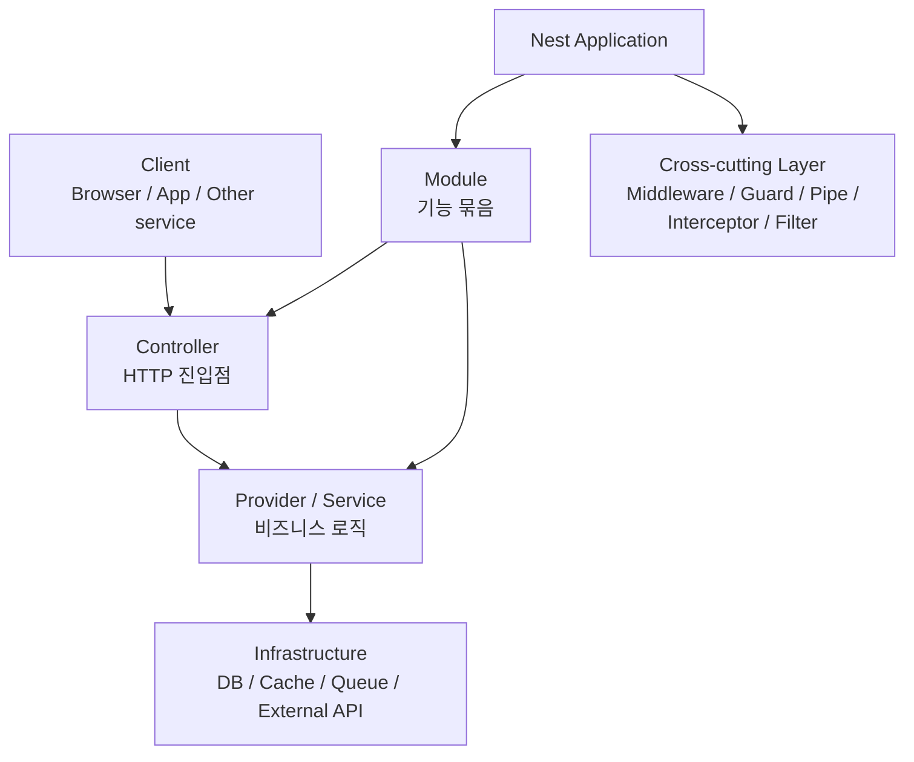
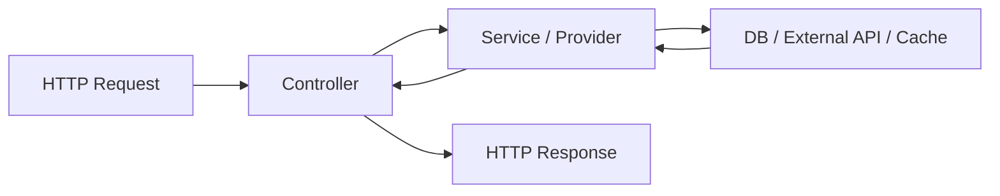
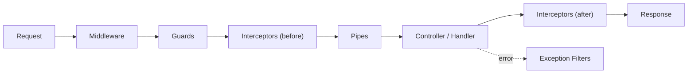

# NEST 상세 정리

작성 기준일: 2026-04-13  
가정: 이 문서의 `NEST`는 `NestJS`를 의미함  
주요 참고: `nestjs.com`, `docs.nestjs.com`

## 1. 한 줄 요약

`NestJS`는 `Node.js 서버 애플리케이션을 구조적으로 만들기 위한 프레임워크`다.

짧게 말하면:

- Express나 Fastify 위에서 동작하면서
- Angular 스타일의 `Module`, `Controller`, `Provider`, `Decorator`, `DI`
- 개념을 서버 개발에 가져와
- 대규모 백엔드 코드를 더 일관되고 테스트 가능하게 만드는 프레임워크

라고 보면 된다.

---

## 2. 먼저 큰 그림

이 그림에서 가장 중요한 건 Nest가 단순히 "HTTP 라우터"가 아니라:

- `모듈 구조`
- `의존성 주입`
- `공통 관심사 분리`

를 함께 제공한다는 점이다.

---

## 3. NestJS는 왜 나왔는가

NestJS 공식 소개 문서는 문제의식을 아주 명확하게 적고 있다.

요지는:

- Node.js 생태계에는 좋은 라이브러리가 많지만
- 서버 코드 전체의 `architecture` 문제를 일관되게 해결해주진 못했다

는 것이다.

즉 Nest는:

- "Node 생태계를 버리고 새로 만들자"

가 아니라

- "기존 Node 생태계를 유지한 채, 그 위에 구조와 규칙을 얹자"

라는 접근이다.

이게 Nest의 핵심 철학이다.

---

## 4. NestJS의 철학

공식 docs의 `Introduction / Philosophy`를 보면 Nest는 다음 특징을 강조한다.

### 4.1 TypeScript 중심

Nest는 TypeScript를 강하게 전제로 설계되어 있다.

물론 JavaScript도 가능하지만, 실제 강점은:

- 타입
- 데코레이터
- 클래스 기반 구조
- 메타데이터

와 결합될 때 나온다.

### 4.2 OOP + FP + FRP 혼합

공식 문서는 Nest가:

- OOP
- FP
- FRP

요소를 함께 가져온다고 설명한다.

실무적으로는 아래 식으로 이해하면 충분하다.

- `Controller`, `Service`, `Provider`는 OOP적
- 함수형 조합과 RxJS 흐름도 활용 가능

### 4.3 Progressive framework

Nest는 모든 걸 강제하는 프레임워크라기보다:

- 기본 아키텍처는 제공하되
- 필요하면 아래 플랫폼 기능도 직접 쓸 수 있게 둔다

는 방향이다.

즉 Nest는 Express/Fastify를 감추기만 하는 프레임워크가 아니라, 필요하면 underlying API에도 접근하게 해준다.

---

## 5. NestJS는 어떤 기술 위에 서 있나

Nest 공식 문서 기준:

- 기본 HTTP 엔진은 `Express`
- 선택적으로 `Fastify` 사용 가능

즉 Nest는:

- 자체 HTTP 서버를 새로 만든 것이 아니라
- 기존 검증된 서버 프레임워크 위에
- 구조와 추상화를 올린 것이다

### 5.1 왜 이게 중요한가

이 구조 덕분에:

- Express 생태계 모듈 활용 가능
- Fastify로 성능 최적화 가능
- 플랫폼 종속성을 어느 정도 분리 가능

즉 "Node 세계와 단절되지 않는다"는 장점이 있다.

---

## 6. Nest의 가장 중요한 구성 요소

Nest를 이해하려면 아래 4개를 먼저 잡아야 한다.

- Module
- Controller
- Provider
- Dependency Injection

### 6.1 Module

`Module`은 기능 단위를 묶는 컨테이너다.

공식 docs에서 module은 애플리케이션 구조를 조직하는 핵심 메커니즘으로 설명된다.

쉽게 말하면:

- 사용자 관리 관련 것들
- 인증 관련 것들
- 게시글 관련 것들

을 각각 독립된 기능 묶음으로 만드는 단위다.

### 6.2 Controller

`Controller`는 들어오는 요청을 받는 진입점이다.

주로 하는 일:

- route 정의
- request parameter 추출
- service 호출
- response 반환

즉 컨트롤러는 HTTP 계층과 가장 가까운 코드다.

### 6.3 Provider

`Provider`는 Nest에서 DI 컨테이너가 관리하는 객체를 뜻한다.

실무적으로 가장 흔한 provider는 `Service`다.

예:

- UserService
- AuthService
- PaymentService

### 6.4 Dependency Injection

Nest의 핵심 중 핵심이다.

Provider를 직접 new 해서 쓰지 않고:

- Nest container가 생성/주입/생명주기 관리

를 담당한다.

이 구조 덕분에:

- 느슨한 결합
- 테스트 용이성
- 구현 교체

가 쉬워진다.

---

## 7. Module은 왜 중요한가

Nest의 모듈 시스템은 애플리케이션을 크게 구조화하는 데 핵심이다.

### 7.1 Module이 하는 일

- Controller 등록
- Provider 등록
- 외부 module import
- 다른 module에 export

### 7.2 왜 좋은가

프로젝트가 커지면:

- 코드가 많아지고
- 경계가 흐려지고
- import가 엉키고
- 책임이 섞인다

Nest는 module을 통해:

- 기능 경계를 명시적으로 나누게 한다

### 7.3 실무적 해석

Nest에서 module은 단순 파일 grouping이 아니라:

- 기능 단위의 경계
- 의존성 공개 범위
- 조립 단위

라고 보는 것이 맞다.

---

## 8. Controller는 어떻게 봐야 하나

Controller는 "요청을 받는 얇은 계층"으로 이해하는 것이 가장 좋다.

### 8.1 Controller의 역할

- route path 정의
- HTTP method 연결
- request body/query/param 추출
- response status/shape 제어

### 8.2 Controller가 하면 안 좋은 것

다음이 컨트롤러 안에 과도하게 들어가면 냄새가 난다.

- 복잡한 비즈니스 로직
- DB 직접 접근
- 긴 트랜잭션 흐름
- 외부 API orchestration 전부

이런 건 보통 service/provider로 내려야 한다.

즉 Nest 철학에서는:

- Controller는 얇게
- Service는 진하게

가는 편이 좋다.

---

## 9. Provider와 Service

Nest에서 `Provider`는 더 넓은 개념이고, `Service`는 가장 흔한 구체 형태다.

### 9.1 Provider란

Nest container에 등록되어:

- 생성
- 주입
- 재사용

되는 대상

### 9.2 Service란

보통 비즈니스 로직을 담는 provider다.

예:

- 유저 생성
- 인증 검증
- 주문 처리
- 메일 발송 orchestration

### 9.3 왜 분리하나

이 구조 덕분에:

- 컨트롤러는 HTTP에 집중
- 서비스는 업무 규칙에 집중
- 테스트는 서비스 단위로 쉬워짐

즉 Nest는 사실상 "서비스 레이어를 강하게 권장하는 프레임워크"다.

---

## 10. DI(의존성 주입)가 핵심인 이유

Nest를 단순 Express wrapper로 보면 안 되는 이유가 여기 있다.

### 10.1 직접 생성 방식의 문제

예를 들어 컨트롤러 안에서:

- 서비스 new
- 레포지토리 new
- 설정 new

를 직접 하면:

- 결합도가 높아지고
- 테스트 대체가 어렵고
- 라이프사이클 관리가 복잡해진다

### 10.2 DI의 장점

DI를 쓰면:

- 인터페이스/토큰 기준 주입 가능
- mock 대체 쉬움
- provider 재사용 쉬움
- 설정/비동기 초기화도 체계화 가능

### 10.3 Nest에서 DI가 중요한 이유

공식 docs의 `Providers`, `Custom providers`, `Asynchronous providers`, `Injection scopes` 등을 보면, Nest는 단순 주입을 넘어:

- 커스텀 토큰
- 비동기 초기화
- 범위(scope)

까지 체계적으로 다룬다.

즉 DI는 Nest의 부가기능이 아니라 중심축이다.

---

## 11. Nest의 요청 처리 파이프라인

Nest에는 요청을 가로채거나 검증하거나 변경하는 계층이 많다.

대표적으로:

- Middleware
- Guards
- Pipes
- Interceptors
- Exception Filters

이 5개를 구분해야 한다.

이건 Nest를 공부할 때 가장 중요한 그림 중 하나다.

---

## 12. Middleware

Middleware는 Express와 유사한 개념으로 이해하면 된다.

### 12.1 역할

- 요청 전 공통 처리
- 로깅
- 헤더 처리
- request 변형

### 12.2 언제 적합한가

- 라우트 진입 전에 단순한 공통 로직
- framework-independent한 요청 전처리

### 12.3 한계

Middleware는 Nest의 execution context와 guard/pipe 수준의 의미를 fully 알지 못한다.

즉 인증/인가의 핵심 로직은 종종 Guard가 더 적합하다.

---

## 13. Guards

Guard는 "이 요청이 실행될 자격이 있는가?"를 판단하는 계층이다.

### 13.1 대표 용도

- 인증
- 권한 검사
- RBAC
- 특정 조건 차단

### 13.2 Middleware와 차이

- Middleware는 단순 전처리
- Guard는 실행 허용 여부 결정

즉 "이 사용자가 이 엔드포인트에 접근 가능하냐" 같은 건 Guard가 더 자연스럽다.

---

## 14. Pipes

Pipe는 입력값을 `변환(transform)`하거나 `검증(validate)`하는 계층이다.

### 14.1 대표 용도

- DTO validation
- 문자열을 숫자로 변환
- enum 파싱
- request payload 검사

### 14.2 왜 중요한가

컨트롤러 안에서 매번:

- if 문으로 검증하고
- 타입 변환하고

하는 코드를 줄일 수 있다.

즉 Pipes는 입력계층 정리를 담당한다.

---

## 15. Interceptors

Interceptor는 요청 전/후를 둘 다 감쌀 수 있는 계층이다.

### 15.1 대표 용도

- 로깅
- 응답 포맷 래핑
- 캐싱
- execution timing 측정
- serialization

### 15.2 왜 유용한가

공통 후처리를 일관되게 넣기 좋다.

예:

- 모든 응답을 같은 포맷으로 감싼다
- 실행 시간을 재서 로그 남긴다

이런 것들이 Interceptor와 잘 맞는다.

---

## 16. Exception Filters

에러를 한 곳에서 처리하는 계층이다.

### 16.1 대표 용도

- 에러 응답 표준화
- 커스텀 예외 매핑
- 로그/모니터링 연계

### 16.2 왜 필요한가

try/catch를 모든 컨트롤러에 반복하면 코드가 지저분해진다.

Nest는 필터를 통해:

- 예외 처리 정책을 중앙화

할 수 있다.

---

## 17. Request lifecycle 이해가 중요한 이유

Nest 공식 FAQ에는 request lifecycle 문서가 따로 있다.

이게 중요한 이유는:

- middleware
- guard
- pipe
- interceptor
- filter

가 많아질수록, "이 코드가 언제 실행되는지" 헷갈리기 쉽기 때문이다.

실무에서 Nest를 잘 쓰려면:

- 인증은 어디
- 검증은 어디
- 응답 포맷은 어디
- 로깅은 어디

를 계층적으로 구분할 수 있어야 한다.

---

## 18. Nest의 장점

### 18.1 구조 강제력이 적당히 있다

너무 자유로운 Express 코드베이스는 시간이 지나면 구조가 무너지기 쉽다.

Nest는:

- module
- controller
- service
- DI

패턴을 통해 어느 정도 질서를 만든다.

### 18.2 TypeScript와 궁합이 좋다

Nest의 실제 생산성은 TS와 함께 쓸 때 크게 올라간다.

### 18.3 테스트하기 좋다

DI 컨테이너 덕분에:

- mock provider
- unit test
- e2e test

구성이 비교적 깔끔하다.

### 18.4 확장 생태계가 넓다

공식 docs의 `Techniques`를 보면:

- validation
- caching
- queues
- scheduling
- configuration
- GraphQL
- microservices

등이 매우 체계적으로 정리돼 있다.

즉 단순 REST API를 넘어 확장이 쉽다.

---

## 19. Nest의 단점

### 19.1 러닝커브가 있다

Express보다 처음엔 어렵다.

왜냐하면:

- 데코레이터
- DI
- 모듈 시스템
- lifecycle 계층

을 함께 이해해야 하기 때문이다.

### 19.2 소규모 프로젝트엔 과할 수 있다

간단한 API 하나만 빨리 만들 때는:

- Express
- Fastify
- Hono

같은 더 가벼운 도구가 더 맞을 수도 있다.

### 19.3 추상화가 많아 디버깅이 어려울 수 있다

구조가 좋은 대신:

- 실제 흐름이 감춰질 수 있고
- 내부 container, decorator metadata, scope 문제를 알아야 할 수 있다

즉 규모가 커질수록 장점이 커지지만, 초반 단순함은 줄어든다.

---

## 20. Nest가 특히 잘 맞는 프로젝트

### 20.1 팀 개발 백엔드

- 사람 수가 늘고
- 구조 일관성이 중요하고
- 테스트와 유지보수가 중요한 프로젝트

### 20.2 엔터프라이즈 API 서버

- 인증
- 권한
- 설정
- 모듈화
- 다수 기능 도메인

이 필요한 서비스

### 20.3 Monolith를 구조적으로 운영할 때

Nest는 모듈 기반 monolith에도 잘 맞는다.

### 20.4 GraphQL / Microservices 확장까지 고려할 때

공식 docs가 이 영역을 꽤 강하게 지원한다.

---

## 21. Nest가 덜 맞는 프로젝트

### 21.1 정말 작은 장난감 프로젝트

- 기능 몇 개
- 파일 몇 개
- 금방 버릴 코드

라면 오히려 무거울 수 있다.

### 21.2 framework 추상화를 최소화하고 싶을 때

Express/Fastify를 직접 다루는 쪽이 더 단순할 수 있다.

### 21.3 함수형/미니멀 스타일을 강하게 선호할 때

Nest는 class/decorator/DI 중심이라 취향이 갈린다.

---

## 22. Nest를 공부할 때의 올바른 순서

처음엔 아래 순서가 제일 좋다.

### 1단계

- Introduction / Philosophy
- Module
- Controller
- Provider

### 2단계

- Dependency Injection
- Custom provider
- Module import/export

### 3단계

- Middleware
- Guard
- Pipe
- Interceptor
- Exception Filter

### 4단계

- Validation
- Configuration
- Database 연동
- Testing

### 5단계

- GraphQL
- Microservices
- Queues
- Scheduling

이 순서가 좋은 이유는:

- 먼저 구조를 이해해야
- 그 다음 고급 기능이 자연스럽게 붙기 때문이다.

---

## 23. 면접/실무에서 자주 묻는 질문

### 23.1 "Nest는 Express와 뭐가 다른가?"

좋은 답:

- Express 위에서 동작할 수 있지만
- 구조, 모듈화, DI, 공통 계층 관리가 더 강하다

### 23.2 "왜 굳이 Nest를 쓰나?"

좋은 답:

- 코드가 커졌을 때 구조 일관성과 테스트 가능성을 확보하기 쉽다

### 23.3 "Guard와 Middleware 차이는?"

좋은 답:

- Middleware는 일반 전처리
- Guard는 실행 허용 여부 판단

### 23.4 "Pipe와 Interceptor 차이는?"

좋은 답:

- Pipe는 입력 변환/검증
- Interceptor는 요청 전후 공통 처리/응답 흐름 개입

---

## 24. 빠른 복습

- Nest는 구조적인 Node.js 서버 프레임워크다.
- 핵심은 `Module`, `Controller`, `Provider`, `DI`다.
- Express/Fastify 위에서 동작한다.
- Guard, Pipe, Interceptor, Filter를 구분할 수 있어야 한다.
- 규모 있는 팀 백엔드에서 장점이 크다.
- 작은 프로젝트엔 과할 수 있다.

---

## 25. 참고 링크

- NestJS 공식 문서 메인: [링크](https://docs.nestjs.com/)
- NestJS Introduction / Philosophy: [링크](https://docs.nestjs.com/)
- Modules: [링크](https://docs.nestjs.com/modules)
- Controllers: [링크](https://docs.nestjs.com/controllers)
- Providers: [링크](https://docs.nestjs.com/providers)
- Custom providers: [링크](https://docs.nestjs.com/fundamentals/custom-providers)
- Request lifecycle: [링크](https://docs.nestjs.com/faq/request-lifecycle)
- Interceptors: [링크](https://docs.nestjs.com/interceptors)
- Official site: [링크](https://nestjs.com/)

