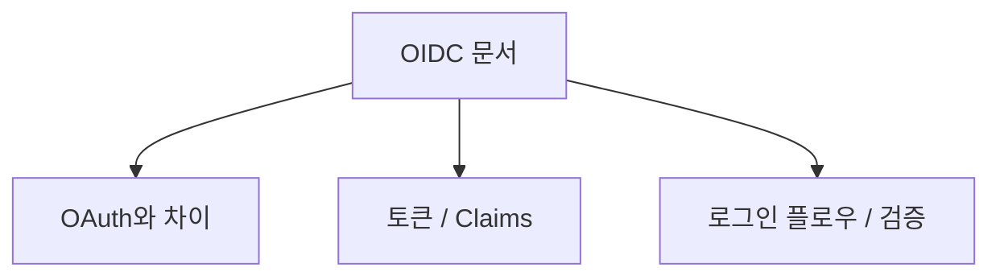
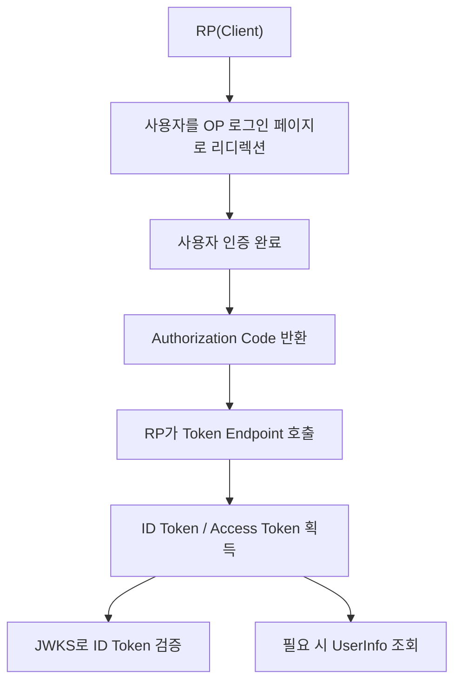
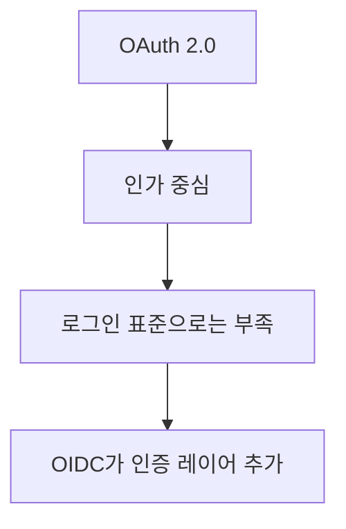
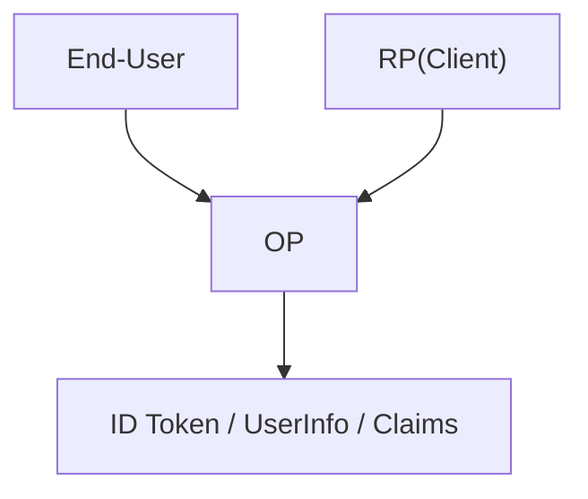
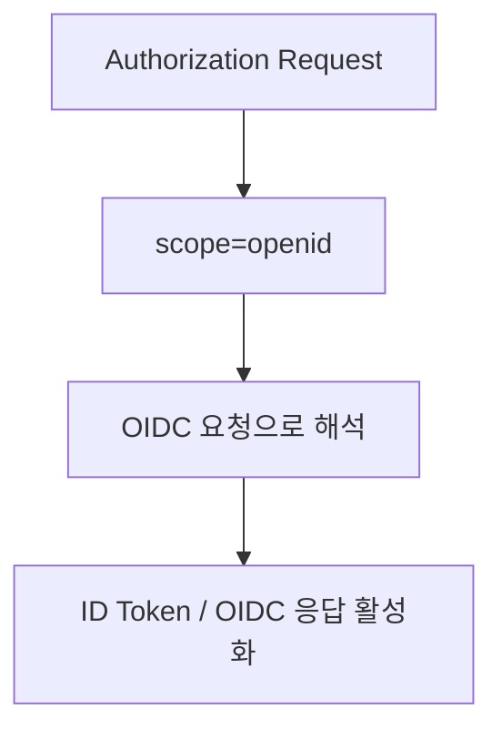
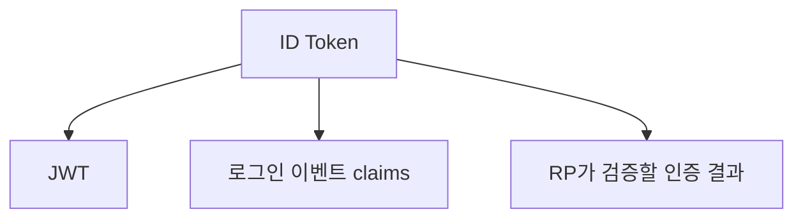
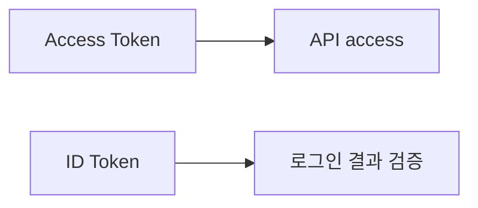

# OIDC 상세 정리

작성 기준일: 2026-04-19  
조사 방식: 웹검색 기반 최신 조사  
주요 참고: `openid.net` 공식 OpenID Connect 사양, `rfc-editor.org` RFC

## 1. 문서 목적



이 문서는 `OIDC(OpenID Connect)`를 처음 배우는 사람부터 이미 OAuth 2.0은 어느 정도 알고 있는 사람까지, "OIDC가 정확히 무엇이고 실제 로그인/SSO 시스템에서 어떤 역할을 하는지"를 한 번에 연결해서 이해할 수 있도록 정리한 학습 문서다.

특히 아래를 함께 설명한다.

- OIDC가 정확히 무엇인가
- OAuth 2.0과는 어떤 관계인가
- 왜 OAuth만으로는 로그인 표준이 되지 않는가
- `ID Token`, `Access Token`, `Refresh Token`은 각각 무엇인가
- `scope=openid`가 왜 중요한가
- `Authorization Code Flow`, `Implicit Flow`, `Hybrid Flow`
- `PKCE`, `state`, `nonce`는 각각 왜 필요한가
- `UserInfo Endpoint`, `Discovery`, `JWKS`
- `OP(OpenID Provider)`와 `RP(Relying Party)`는 각각 누구인가
- 로그아웃, 세션, SAML과의 비교

즉 이 문서는 단순히 "OIDC는 인증용이다"라는 한 줄 설명을 넘어서, "`현대 웹 로그인 프로토콜로서의 OIDC`"를 이해하게 하는 문서다.

---

## 2. 먼저 한 줄 요약



OIDC는 `OAuth 2.0` 위에 얹힌 `인증(identity) 레이어`로, 클라이언트가 사용자의 신원을 검증하고 표준화된 사용자 정보를 받아올 수 있게 해 주는 프로토콜이다.

OpenID Connect Core 공식 문서는 OIDC를:

- a simple identity layer on top of OAuth 2.0
- end-user identity를 검증하고
- 기본 프로필 정보를 interoperable and REST-like manner로 얻는 방식

이라고 설명한다.

즉 아주 단순하게 말하면:

- OAuth 2.0만으로는 "누가 로그인했는지"를 표준 방식으로 알 수 없고
- OIDC는 그 위에 "로그인 결과와 사용자 claims"를 표준화해서 얹은 것

이다.

---

## 3. OIDC가 왜 필요한가



### 3.1 OAuth 2.0만으로는 로그인 표준이 아니다

RFC 6749는 OAuth 2.0을 `Authorization Framework`라고 설명한다.

즉 OAuth 2.0의 핵심 질문은:

- "이 클라이언트에게 이 리소스에 제한된 접근 권한을 줄 것인가"

이다.

반면 로그인에서 필요한 질문은:

- "지금 로그인한 사용자가 누구인가"

다.

즉 인가와 인증은 다른 문제다.

### 3.2 OAuth만으로 로그인하면 왜 문제가 생기나

OIDC Core 문서도 분명히 말한다.

OAuth 2.0은:

- access token을 얻어 protected resource에 접근하는 일반 프레임워크일 뿐
- end-user authentication 정보를 표준적으로 전달하지 않는다

즉 provider마다:

- access token 구조도 다를 수 있고
- user info를 어디서/어떻게 가져올지도 다르고
- 그 결과를 "로그인 완료"로 해석하는 규칙도 다를 수 있다

그래서 OIDC가 필요하다.

### 3.3 OIDC가 해결하는 것

OIDC는 표준적으로:

- 인증 결과를 `ID Token`으로 전달
- 사용자 정보는 `Claims`라는 공통 개념으로 표현
- Discovery 문서로 endpoint/JWKS 위치를 찾게 하고
- UserInfo endpoint로 추가 정보를 읽게 한다

즉 provider마다 제각각이던 "로그인"을 프로토콜 수준에서 표준화한다.

---

## 4. OIDC의 핵심 구성요소



OIDC Core와 Discovery 문서를 기준으로 핵심 구성요소를 보면 다음과 같다.

### 4.1 End-User

인증 대상이 되는 사람이다.

즉 실제 로그인하는 사용자다.

### 4.2 Client

로그인을 사용하려는 애플리케이션이다.

예:

- 웹앱
- SPA
- 모바일 앱
- 백엔드 서비스

### 4.3 OpenID Provider (OP)

OIDC Core는 OP를:

- end-user를 authenticate하고
- RP에게 authentication event와 end-user claims를 제공하는
- OAuth 2.0 Authorization Server

라고 설명한다.

즉:

- Google 로그인 서버
- Auth0
- Okta
- 사내 IdP

같은 것이 OP가 될 수 있다.

### 4.4 Relying Party (RP)

OIDC Core는 RP를:

- OpenID Provider에 인증을 의존하는 OAuth 2.0 Client

라고 설명한다.

즉 우리 서비스 앱이 보통 RP다.

### 4.5 User Agent

보통 브라우저를 뜻한다.

즉 많은 OIDC 흐름은 브라우저 redirect를 포함한다.

### 4.6 Issuer

OIDC Core는 issuer identifier를:

- `https` URL
- query/fragment 없는 형태

로 설명한다.

즉 OP를 고유하게 식별하는 기준 URL이다.

이 값은 토큰 검증에서 매우 중요하다.

---

## 5. OIDC에서 가장 중요한 개념: `scope=openid`



OIDC Core 문서는:

- Client가 Authorization Request에 `openid` scope를 포함해 OIDC extension 사용을 요청한다고

설명한다.

즉:

```text
scope=openid
```

가 OIDC와 순수 OAuth를 가르는 대표적인 차이점이다.

### 5.1 왜 중요한가

이 값이 들어가면:

- 이 요청은 단순 인가 요청이 아니라
- authentication request라는 의미를 갖게 된다

즉 provider는:

- access token뿐 아니라
- ID Token을 포함한 OIDC 응답을 준비하게 된다

### 5.2 추가 scope

OIDC에서는 보통 `openid`와 함께:

- `profile`
- `email`
- `address`
- `phone`

같은 scope를 붙일 수 있다.

즉:

- `openid` = OIDC 자체 활성화
- 나머지 = 어떤 사용자 claims를 원하는지

라고 이해하면 된다.

---

## 6. ID Token



OIDC에서 가장 핵심적인 새 개념이다.

### 6.1 무엇인가

OIDC Core는 `ID Token`을:

- Authentication event에 대한 claims를 담은 `JWT`

라고 설명한다.

즉 ID Token은:

- access token처럼 API 호출에 쓰는 토큰이 아니라
- 로그인 사실과 사용자 식별 정보를 RP가 검증할 수 있게 만든 토큰

이다.

### 6.2 왜 중요한가

RP는 ID Token을 검증해:

- 이 사용자가 실제로 OP에서 인증되었는지
- 내가 기대한 issuer인지
- 내가 intended audience인지
- replay 공격이 아닌지

등을 확인한다.

즉 OIDC의 "로그인 성공" 판단은 보통 ID Token 검증에 달려 있다.

### 6.3 자주 들어가는 claim

OIDC Core 기준 핵심 claim:

- `iss` = issuer
- `sub` = subject identifier
- `aud` = audience
- `exp` = expiration
- `iat` = issued at

그리고 흐름에 따라:

- `nonce`
- `auth_time`
- `azp`
- `acr`
- `amr`

등도 중요해질 수 있다.

### 6.4 `sub`

OIDC에서 진짜 사용자 식별자는 보통 `sub`다.

즉:

- email은 바뀔 수 있고
- profile은 수정될 수 있지만
- `sub`는 OP 안에서 사용자를 식별하는 핵심 안정 식별자

로 보는 것이 맞다.

실무에서 user mapping 키를 email이 아니라 `iss + sub` 조합으로 보는 이유가 여기에 있다.

---

## 7. Access Token과의 차이



OIDC를 배울 때 가장 많이 하는 혼동이다.

### 7.1 Access Token

OAuth 2.0 / RFC 6750 문맥에서 access token은:

- resource server에 접근 권한을 증명하는 토큰

이다.

즉 API 호출용이다.

### 7.2 ID Token

ID Token은:

- RP가 로그인 결과를 검증하기 위한 토큰

이다.

즉 인증 결과용이다.

### 7.3 한 줄 구분

- Access Token = API access
- ID Token = user authentication result

### 7.4 왜 access token으로 로그인 처리하면 위험한가

provider마다 access token 형식/의미는 다를 수 있다.

즉:

- opaque token일 수도 있고
- JWT일 수도 있고
- 사용자 식별 정보가 표준적이지 않을 수 있다

따라서 access token만 보고 로그인 완료로 처리하면 provider 종속과 보안 문제가 생기기 쉽다.

OIDC는 이 문제를 ID Token으로 정리한다.

---

## 8. UserInfo Endpoint

OIDC Basic Client Guide와 OIDC Core는 UserInfo Endpoint를 설명한다.

### 8.1 무엇인가

UserInfo Endpoint는:

- access token을 들고 호출하면
- 해당 authorization grant에 연결된 end-user claims를 돌려주는 보호된 리소스

다.

### 8.2 왜 필요한가

ID Token에는 보통 최소한의 로그인 claims만 있고,

추가로:

- name
- picture
- email
- locale

같은 정보를 더 가져오고 싶을 수 있다.

이때 UserInfo endpoint를 사용한다.

### 8.3 중요한 포인트

OIDC Basic Guide는 UserInfo response에도 `sub`가 포함되고, 이를 ID Token의 `sub`와 일치시켜야 한다고 설명한다.

즉:

- ID Token의 사용자
- UserInfo의 사용자

가 같은 사람인지 확인해야 한다.

이 검증을 빼면 account mix-up 같은 문제가 생길 수 있다.

---

## 9. Discovery

OIDC Discovery 1.0은 RP가 OP 정보를 자동으로 찾는 메커니즘을 정의한다.

### 9.1 왜 필요한가

OIDC를 실제로 쓰려면 RP는 아래를 알아야 한다.

- authorization endpoint
- token endpoint
- userinfo endpoint
- jwks_uri
- issuer

이걸 하드코딩하면 provider마다 설정이 번거롭다.

### 9.2 Discovery가 주는 것

Discovery 문서는 `.well-known/openid-configuration` 형태 메타데이터를 제공한다.

즉 RP는 이 문서를 읽어:

- endpoint 위치
- 지원 scope/response type
- signing algorithm
- logout endpoint

같은 정보를 자동으로 알 수 있다.

### 9.3 실무 감각

요즘 OIDC 클라이언트 라이브러리가 편한 이유 중 하나가 Discovery 덕분이다.

즉 Issuer URL만 주면 나머지를 자동으로 채우는 경우가 많다.

---

## 10. JWKS와 서명 검증

OIDC Core는 ID Token이 JWT라고 설명하고, Discovery는 `jwks_uri`를 제공한다.

### 10.1 왜 필요한가

RP는 ID Token의 서명이 진짜 OP가 만든 것인지 검증해야 한다.

### 10.2 어떻게 하나

대체로:

1. Discovery에서 `jwks_uri`를 얻음
2. OP의 공개키 목록(JWKS)을 가져옴
3. ID Token header의 `kid`와 매칭
4. 서명 검증

### 10.3 중요한 포인트

즉 OIDC는 단순히 "JWT를 decode해서 읽는 것"이 아니다.

반드시:

- issuer 확인
- audience 확인
- signature 확인
- expiration 확인

까지 해야 한다.

즉 JWT를 그냥 Base64 decode해서 믿으면 안 된다.

---

## 11. OIDC Flow

OIDC Core는 세 가지 주요 흐름을 다룬다.

- Authorization Code Flow
- Implicit Flow
- Hybrid Flow

### 11.1 Authorization Code Flow

가장 중요한 흐름이다.

대략:

1. RP가 브라우저를 OP authorization endpoint로 리디렉션
2. 사용자 로그인/동의
3. OP가 authorization code를 RP에 반환
4. RP가 back-channel로 token endpoint에 code를 제출
5. ID Token / Access Token / 필요 시 Refresh Token 획득

### 11.2 Implicit Flow

OIDC Core에는 나오지만, modern security practice에선 일반 웹앱에서 주류 선택이 아니다.

토큰이 front-channel로 직접 노출되기 쉽기 때문이다.

### 11.3 Hybrid Flow

Authorization Endpoint에서 code와 일부 token을 함께 받는 흐름이다.

latency 이점이 있을 수 있지만 복잡하다.

### 11.4 실무 결론

대부분의 현대 웹앱/백엔드는:

- Authorization Code Flow

를 기본으로 본다.

그리고 public client라면 PKCE를 거의 기본으로 붙인다.

---

## 12. PKCE

RFC 7636은 PKCE를 authorization code interception attack 방어를 위한 OAuth 확장으로 설명한다.

### 12.1 왜 필요한가

Authorization Code Flow는 중간에 code가 탈취되면 문제가 될 수 있다.

PKCE는:

- client가 만든 임시 비밀(정확히는 verifier/challenge 쌍)

을 이용해,

- token endpoint에서 code를 redeem하는 주체가 정말 같은 client인지

를 검증하게 한다.

### 12.2 어떻게 동작하나

대략:

1. client가 `code_verifier` 생성
2. 해시한 `code_challenge`를 authorization request에 포함
3. 나중에 token request에서 `code_verifier` 제출
4. 서버가 둘이 맞는지 확인

### 12.3 왜 OIDC에서 중요한가

OIDC는 로그인과 직접 연결되므로 authorization code 탈취는 곧 계정 탈취로 이어질 수 있다.

즉 modern OIDC client는:

- public client는 물론
- confidential client도 보안 강화를 위해

PKCE를 고려하는 흐름이 강하다.

---

## 13. `state`

OIDC/OAuth 요청에서 매우 중요하다.

### 13.1 무엇인가

`state`는 client가 authorization request에 넣고, 응답에서 그대로 돌려받는 상관관계 값이다.

### 13.2 왜 필요한가

주 목적:

- CSRF 방어
- 요청/응답 매칭

즉 "이 redirect 응답이 내가 시작한 로그인 요청에 대한 것인지"를 확인한다.

### 13.3 실무 감각

`state`는 선택적처럼 보여도 실제 웹 로그인에서는 사실상 필수라고 보는 편이 맞다.

즉 로그인 요청 단위 correlation ID로 이해하면 된다.

---

## 14. `nonce`

OIDC Core는 `nonce`를 특히 중요하게 다룬다.

### 14.1 무엇인가

client가 인증 요청에 넣고, ID Token에서 다시 확인하는 랜덤 값이다.

### 14.2 왜 필요한가

주 목적:

- replay 방지
- 다른 인증 응답이 섞이는 것 방지

즉:

- `state`는 요청/응답 correlation
- `nonce`는 ID Token 재사용/재주입 방지

에 가깝다.

### 14.3 실무 감각

특히 front-channel 요소가 있는 흐름에서 중요하다.

즉 OIDC 로그인 구현에서 `nonce` 검증을 빼먹으면 ID Token replay 방어가 약해진다.

---

## 15. Claims

OIDC Core는 사용자 정보와 인증 이벤트 정보를 `Claims`라는 개념으로 표현한다.

### 15.1 무엇인가

Claims는:

- 사용자 속성
- 인증 결과 속성

같은 key/value 정보다.

### 15.2 대표 사용자 claims

예:

- `sub`
- `name`
- `given_name`
- `family_name`
- `preferred_username`
- `email`
- `email_verified`
- `picture`
- `locale`

### 15.3 인증 이벤트 claims

예:

- `iss`
- `aud`
- `exp`
- `iat`
- `auth_time`
- `nonce`
- `acr`
- `amr`

### 15.4 왜 중요한가

OIDC는 로그인 결과를 "서버마다 제각각 JSON"으로 주는 게 아니라, claims라는 공통 vocabulary로 정리한다.

즉 interoperability의 핵심이다.

---

## 16. Scope와 Claims 관계

OIDC Basic Guide는:

- `profile`
- `email`
- `address`
- `phone`

같은 scope가 어떤 claims 세트와 연결되는지 설명한다.

### 16.1 `openid`

OIDC 자체 활성화

### 16.2 `profile`

기본 프로필 claims

### 16.3 `email`

이메일 관련 claims

### 16.4 `address`

주소 claims

### 16.5 `phone`

전화번호 claims

### 16.6 중요한 감각

즉 scope는 "API 권한 범위" 느낌도 있지만, OIDC에서는 "어떤 사용자 정보 범주를 요청하는가"로 읽어야 하는 경우도 많다.

---

## 17. ID Token 검증에서 꼭 봐야 하는 것

OIDC Core와 Basic Guide는 ID Token validation을 매우 중요하게 다룬다.

실무에서는 최소한 아래를 확인해야 한다.

### 17.1 서명 검증

진짜 OP가 발급한 토큰인지

### 17.2 `iss`

기대한 issuer인지

### 17.3 `aud`

내 client ID가 audience에 포함되는지

### 17.4 `exp`

토큰이 만료되지 않았는지

### 17.5 `nonce`

내가 보낸 nonce와 일치하는지

### 17.6 필요시 `azp`, `auth_time`, `acr`

고급 시나리오에서 중요

### 17.7 왜 중요한가

OIDC 로그인 취약점 상당수는:

- 토큰을 그냥 디코드만 하고
- 검증을 제대로 안 해서

생긴다.

즉 "JWT 파싱"과 "OIDC 로그인 검증"은 완전히 다른 수준의 작업이다.

---

## 18. Discovery가 실제로 주는 endpoint들

OIDC Discovery 문서 기준 메타데이터에는 보통 아래가 포함된다.

- `issuer`
- `authorization_endpoint`
- `token_endpoint`
- `userinfo_endpoint`
- `jwks_uri`

그리고 구현에 따라:

- `end_session_endpoint`
- 지원 scope
- 지원 response type
- signing alg

등도 볼 수 있다.

### 18.1 실무 감각

OIDC 설정 화면에서 보통:

- Issuer URL 하나만 입력하면

나머지 endpoint가 자동으로 채워지는 경우가 많다.

이건 Discovery 덕분이다.

---

## 19. 로그아웃

OIDC는 로그인만이 아니라 로그아웃 관련 스펙도 있다.

### 19.1 RP-Initiated Logout

OpenID Connect RP-Initiated Logout 1.0은:

- RP가 OP에 사용자 로그아웃을 요청하는 메커니즘

을 정의한다.

### 19.2 왜 중요한가

실무에서는 "로그인"보다 "로그아웃"이 더 헷갈릴 때가 많다.

왜냐하면:

- 앱 로컬 세션만 지우면 되는지
- OP 세션까지 같이 끊어야 하는지
- 여러 RP에 걸친 SSO 세션을 어떻게 끊을지

가 문제이기 때문이다.

### 19.3 한 줄 감각

OIDC 로그아웃은:

- 내 앱 세션
- IdP(OP) 세션
- 다른 연동 앱 세션

중 어디까지 끊을지를 설계하는 문제다.

즉 단순 `logout()` 버튼보다 훨씬 복잡할 수 있다.

---

## 20. OIDC와 SAML 차이

이건 실무에서 매우 자주 비교된다.

### 20.1 공통점

- 둘 다 연합 인증 / SSO 문제를 푼다
- RP/SP와 IdP/OP 구조가 있다

### 20.2 차이

대체로:

- OIDC = OAuth 2.0 위, JSON/REST/JWT 친화
- SAML = XML 기반, 전통 엔터프라이즈 SSO에 강함

### 20.3 실무 감각

- 신규 웹/모바일/SPA/modern API -> OIDC가 더 자연스러운 경우 많음
- 엔터프라이즈 SaaS / 오래된 기업 SSO -> SAML이 여전히 많음

즉 둘은 경쟁도 하지만, 시장 세그먼트가 조금 다르다.

---

## 21. OIDC에서 자주 하는 오해

### 21.1 "OAuth 로그인 = OIDC"

아니다.

OAuth만으로는 표준 로그인 프로토콜이 아니다.

### 21.2 "Access Token만 있으면 사용자 인증도 끝"

아니다.

사용자 인증 결과는 보통 ID Token 검증으로 처리해야 한다.

### 21.3 "`sub` 대신 email을 사용자 식별자로 쓰면 된다"

위험할 수 있다.

email은 바뀔 수 있고, provider마다 semantics가 다를 수 있다.

보통은 `iss + sub` 조합이 더 안전한 식별 기준이다.

### 21.4 "OIDC는 웹 로그인 전용이다"

웹이 가장 흔하지만:

- 모바일 앱
- 네이티브 앱
- SPA
- 서버 간 인증 보조

문맥에서도 쓴다.

### 21.5 "`state`와 `nonce`는 비슷하니 하나만 있으면 된다"

아니다.

- `state` = CSRF / 요청-응답 매칭
- `nonce` = ID Token replay 방지

즉 목적이 다르다.

---

## 22. 언제 OIDC가 잘 맞는가

### 22.1 잘 맞는 경우

- 웹앱 로그인
- SaaS SSO
- 소셜 로그인
- SPA + backend API
- 사내 IdP 연동

### 22.2 특히 강한 부분

- 표준화된 로그인
- Discovery 기반 자동 설정
- JWT / claims 생태계
- provider 호환성

### 22.3 덜 맞는 경우

프로토콜 자체가 안 맞는다기보다, 조직/시장 맥락이 다를 수 있다.

예:

- 아주 오래된 엔터프라이즈 SSO 생태계는 SAML 비중이 여전히 큼
- 내부 순수 서비스 인가만 있으면 순수 OAuth가 더 핵심일 수 있음

즉 OIDC는 "인증"이 필요한 웹/앱 시스템에서 강하다.

---

## 23. 실무 체크리스트

OIDC를 도입하거나 리뷰할 때는 아래를 먼저 보면 된다.

### 23.1 프로토콜 레벨

- `scope=openid`를 붙이고 있는가
- Authorization Code Flow를 기본으로 보는가
- PKCE를 적용하는가

### 23.2 토큰 검증

- ID Token signature를 검증하는가
- `iss`, `aud`, `exp`, `nonce`를 확인하는가
- UserInfo의 `sub`를 ID Token과 대조하는가

### 23.3 운영 레벨

- Discovery를 쓰는가
- JWKS rotation을 처리하는가
- refresh token과 logout 전략이 정리돼 있는가

### 23.4 계정 모델

- 내부 사용자 식별자를 `iss + sub`로 안정화하는가
- email 변경 가능성을 고려하는가

---

## 24. 추천 학습 순서

OIDC를 처음부터 제대로 익히려면 아래 순서가 좋다.

### 1단계: OAuth와 차이

- OAuth 2.0은 인가
- OIDC는 인증 레이어

### 2단계: 핵심 역할

- OP
- RP
- End-User
- ID Token
- Access Token

### 3단계: 기본 흐름

- Authorization Code Flow
- PKCE
- state
- nonce

### 4단계: 메타데이터와 검증

- Discovery
- `jwks_uri`
- ID Token validation
- UserInfo

### 5단계: 운영

- refresh token
- logout
- SAML과 비교
- 사용자 식별 모델

이 순서로 가면 "소셜 로그인 도구"가 아니라 실제 인증 프로토콜로 이해하게 된다.

---

## 25. 한 문장 결론

OIDC는 OAuth 2.0의 인가 프레임워크 위에 사용자 인증과 표준 claims 전달을 얹은 identity layer로, RP가 OP에서 로그인된 사용자의 신원을 안전하게 검증하고 interoperable한 방식으로 사용자 정보를 얻을 수 있게 해 주는 현대 웹 로그인 표준이다.

즉 OIDC를 제대로 이해한다는 것은:

- OAuth와의 역할 차이
- ID Token과 Access Token 차이
- Code Flow + PKCE
- state / nonce
- Discovery / JWKS / validation

를 함께 이해하는 것을 뜻한다.

---

## 26. 공식 출처

- OpenID Connect Core 1.0 (errata set 2): <https://openid.net/specs/openid-connect-core-1_0.html>
- OpenID Connect Core 1.0 (original final text): <https://openid.net/specs/openid-connect-core-1_0-18.html>
- OpenID Connect Discovery 1.0 (errata set 2): <https://openid.net/specs/openid-connect-discovery-1_0.html>
- OpenID Connect Basic Client Implementer's Guide 1.0: <https://openid.net/specs/openid-connect-basic-1_0.html>
- OpenID Connect RP-Initiated Logout 1.0: <https://openid.net/specs/openid-connect-rpinitiated-1_0.html>
- RFC 6749, OAuth 2.0 Authorization Framework: <https://www.rfc-editor.org/rfc/rfc6749>
- RFC 6750, Bearer Token Usage: <https://www.rfc-editor.org/rfc/rfc6750>
- RFC 7636, Proof Key for Code Exchange (PKCE): <https://www.rfc-editor.org/rfc/rfc7636>
- RFC 7519, JSON Web Token (JWT): <https://www.rfc-editor.org/rfc/rfc7519>

<!-- study-links:start -->
## 관련 문서

- `sso`: [[정보처리기사/5과목 정보시스템 구축 관리/257 SSO(Single Sign On)/257 SSO(Single Sign On)|257 SSO(Single Sign On)]]
- `해시`: [[정보처리기사/5과목 정보시스템 구축 관리/304 해시(Hash)/304 해시(Hash)|304 해시(Hash)]]
<!-- study-links:end -->
