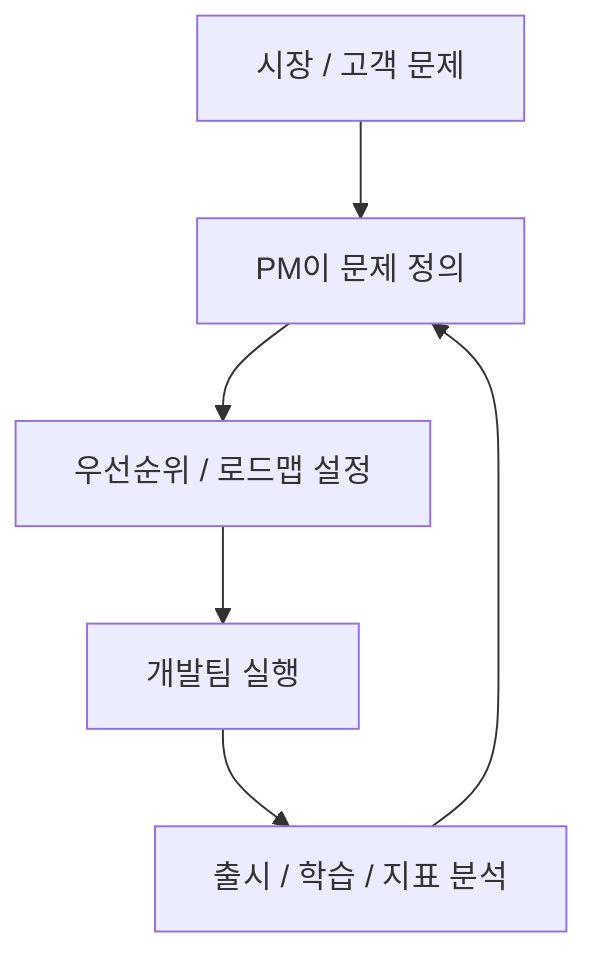
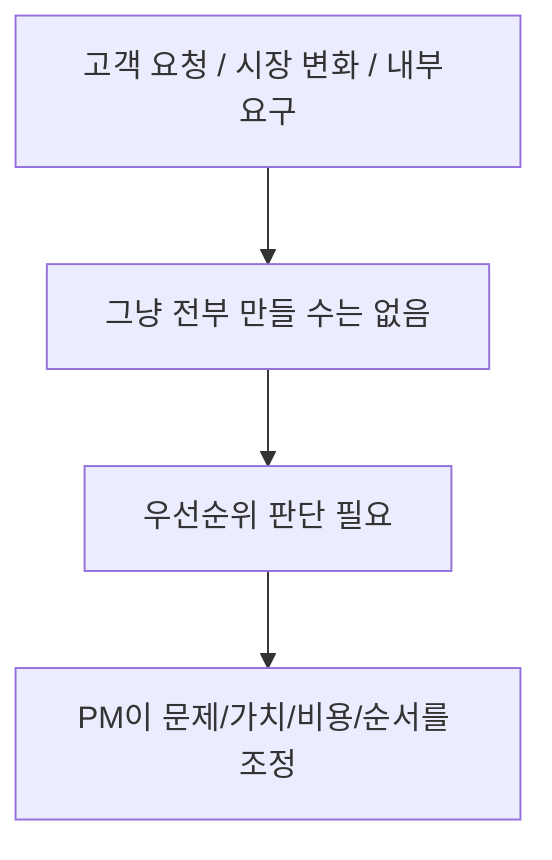
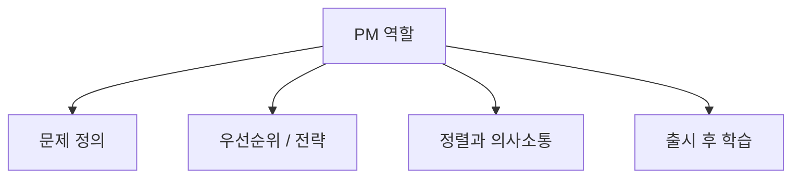
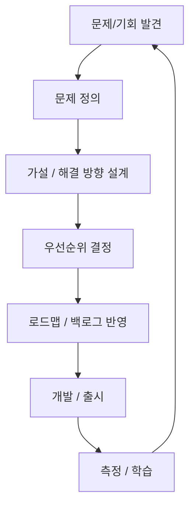
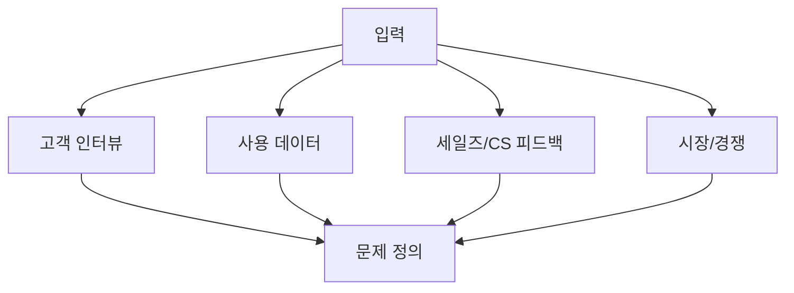
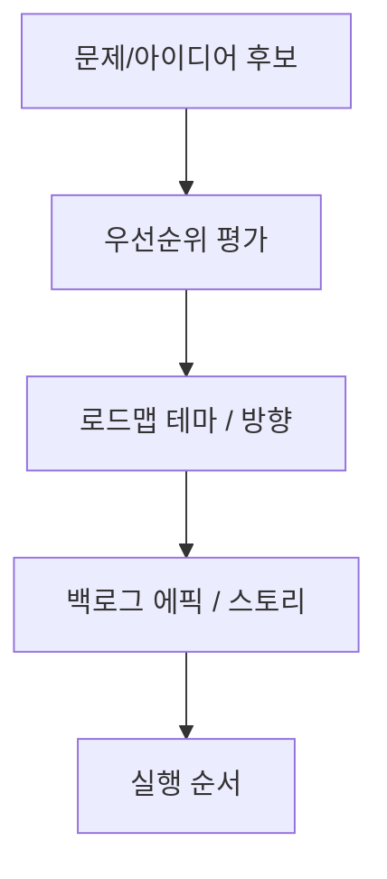
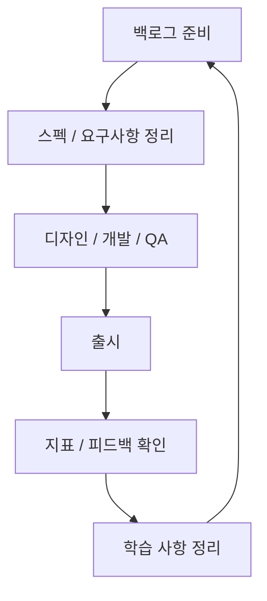

# PM(Product Management) 기본과 워크플로우 상세 정리

작성 기준일: 2026-04-20  
조사 방식: 웹검색 기반 최신 조사  
가정: 사용자가 말한 `PM`은 이 문맥상 `Product Manager / Product Management`를 의미하는 것으로 해석함  
주요 참고: `atlassian.com`, `productboard.com`, `linear.app/docs`

## 1. 한 줄 요약

`PM(Product Management)`은 고객 문제와 비즈니스 목표를 이해하고, 무엇을 왜 만들어야 하는지 정의하고, 팀이 그 방향으로 움직이게 만드는 역할과 운영 체계를 뜻한다.

Atlassian의 제품 관리 가이드는 product management를:

- 제품과 고객에 집중해
- 제품 생애주기 전반을 이끌고
- 고객의 목소리를 조직 안에 반영하는 기능

이라고 설명한다.

즉 아주 단순하게 말하면:

- PM은 "무엇을 만들까"를 정하고
- 왜 그게 중요한지 설명하고
- 팀이 실제로 그걸 만들고 학습하도록 연결하는 사람/기능

이다.

---

## 2. 왜 PM이 필요한가

소프트웨어 팀은 보통 항상 선택 압박을 받는다.

예:

- 고객이 원하는 기능
- 경영진이 원하는 방향
- 기술 부채
- 매출 목표
- 경쟁사 대응
- 운영 안정성

이런 요구가 동시에 들어온다.

### 2.1 PM이 없으면 흔히 생기는 문제

- 큰소리치는 사람 요청이 우선됨
- 개발은 바쁜데 성과는 흐릿함
- 왜 이 기능을 만드는지 팀이 모름
- 출시 후 무엇을 배웠는지 정리가 안 됨

즉 PM의 핵심 가치는 "결정 비용을 줄이고, 팀의 에너지를 더 가치 있는 방향으로 모으는 것"에 있다.

### 2.2 PM은 무엇을 대체하는가

PM은 단순 프로젝트 관리자나 일정 관리자와 다르다.

PM은 일정만 추적하는 게 아니라:

- 문제 정의
- 우선순위
- 성공 기준
- 고객 가치

를 다룬다.

즉 "일을 잘 굴리는 사람"을 넘어서 "`올바른 일`을 고르는 역할"이 핵심이다.

---

## 3. PM의 핵심 역할

Atlassian은 product manager를 business, user experience, technology의 교차점이라고 설명한다.

즉 PM은 세 영역을 동시에 봐야 한다.

### 3.1 고객 관점

- 고객이 실제로 뭘 원하는가
- 더 근본적인 문제는 무엇인가
- 지금의 불편은 얼마나 큰가

### 3.2 비즈니스 관점

- 이 기능이 매출, 활성화, 유지율, 비용 절감에 어떤 영향을 주는가
- 지금 이걸 만드는 것이 회사 전략과 맞는가

### 3.3 기술 관점

- 구현 난이도는 어떤가
- 시스템 제약은 무엇인가
- 엔지니어링 리스크는 무엇인가

### 3.4 조직 정렬 관점

PM은 혼자 제품을 만들지 않는다.

즉:

- 디자인
- 엔지니어링
- 데이터
- 세일즈
- CS
- 마케팅

사이에서 공통 언어를 만드는 역할도 중요하다.

### 3.5 한 줄 요약

PM은 "정답을 아는 사람"이라기보다:

- 문제를 정의하고
- 적절한 사람들과 정보를 모아
- 가장 좋은 다음 결정을 내리게 하는 사람

에 가깝다.

---

## 4. PM의 기본 워크플로우

실무에서 PM 워크플로우는 회사마다 조금씩 다르지만, 핵심 골격은 거의 비슷하다.

### 4.1 발견(Discovery)

- 고객 인터뷰
- 사용자 피드백
- 로그 / 데이터 분석
- 세일즈/CS 인사이트
- 경쟁사 관찰

### 4.2 정의(Definition)

- 지금 해결하려는 문제가 무엇인지
- 누구의 문제인지
- 왜 지금 중요한지

를 정리한다.

### 4.3 우선순위(Prioritization)

- 가치
- 노력
- 리스크
- 전략 적합성

을 보고 순서를 정한다.

### 4.4 실행(Delivery)

- 요구사항 구체화
- 팀 정렬
- 구현 진행
- 출시 관리

### 4.5 학습(Learning)

- 실제로 목표를 달성했는지
- 무엇을 배웠는지
- 다음 iteration에 무엇을 바꿀지

를 본다.

즉 좋은 PM 워크플로우는 직선이 아니라 반복 루프다.

---

## 5. Discovery: 무엇을 만들지 정하기 전에 하는 일

Atlassian과 Productboard 모두 product management의 핵심을 고객 이해와 인사이트에 둔다.

즉 PM의 시작은 "무엇을 만들자"가 아니라 "어떤 문제를 풀고 있지?"다.

### 5.1 Discovery에서 하는 대표 질문

- 사용자는 무엇을 하려다 막히는가
- 이 문제는 얼마나 자주 발생하는가
- 현재 대안은 무엇인가
- 이 문제를 푸는 것이 정말 가치 있는가
- 문제를 해결했을 때 어떤 행동 변화가 생길까

### 5.2 Discovery 입력 소스

실무에서 보통 아래를 섞는다.

- 인터뷰
- 설문
- support ticket
- sales call note
- product analytics
- session replay
- churn reason
- 경쟁사 분석

### 5.3 좋은 Discovery의 특징

- 기능 아이디어보다 문제를 먼저 적는다
- anecdote와 data를 함께 본다
- 내부 큰소리보다 고객 evidence를 중시한다

### 5.4 나쁜 Discovery의 특징

- 이미 만들 기능을 정해 놓고 근거만 끼워 맞춤
- 한 고객의 큰 요청을 전체 문제처럼 확대
- 출시 일정에 쫓겨 문제 정의를 건너뜀

즉 Discovery는 느린 단계가 아니라, 나중에 낭비를 줄이는 단계다.

---

## 6. Prioritization, Roadmap, Backlog

PM의 가장 어려운 일 중 하나가 우선순위다.

Atlassian prioritization 문서는 prioritization이:

- immediate business needs
- long-term strategy
- customer requests
- competition

같은 요소 사이에서 신중한 판단을 요구한다고 설명한다.

### 6.1 우선순위 평가 축

대표적으로 자주 보는 것:

- 고객 영향도
- 비즈니스 임팩트
- 전략 적합성
- 긴급도
- 학습 가치
- 구현 난이도
- 의존성

### 6.2 Roadmap

Atlassian은 roadmap을:

- vision, direction, priorities, progress를 시간 축 위에 정렬하는 shared source of truth

라고 설명한다.

즉 roadmap은 단순 기능 목록이 아니라:

- "왜 이 방향으로 가는지"

를 조직에 공유하는 도구다.

### 6.3 Backlog

Atlassian backlog 문서는 product backlog를:

- roadmap과 requirements에서 파생된 우선순위 작업 목록

이라고 설명한다.

즉:

- roadmap = 중장기 방향
- backlog = 실제 실행 가능한 작업 목록

이다.

### 6.4 한 줄 관계

- Discovery가 입력을 만든다
- Prioritization이 순서를 정한다
- Roadmap이 방향을 보여 준다
- Backlog가 실행 단위로 쪼갠다

이 흐름을 이해하면 PM 문서와 회의가 훨씬 덜 헷갈린다.

---

## 7. Delivery와 운영 루프

PM은 "아이디어를 냈다"에서 끝나지 않는다.

실제로는 delivery와 출시 후 학습까지 이어진다.

### 7.1 Delivery 단계에서 하는 일

- 요구사항 정리
- acceptance criteria 정의
- 팀 간 의존성 조율
- scope trade-off 관리
- 일정/리스크 소통

### 7.2 출시 전 확인

- 무엇이 MVP인지
- launch criteria가 무엇인지
- metrics를 어떻게 측정할지
- rollback이 가능한지

### 7.3 출시 후 확인

- 실제 사용률
- activation / retention 변화
- 에러/성능 이슈
- 정성 피드백

### 7.4 PM의 실수 포인트

가장 흔한 실수는:

- delivery만 보고 discovery와 learning을 잊는 것

이다.

즉 PM workflow는 "계획 -> 개발 -> 끝"이 아니라:

- 문제 발견
- 해결
- 학습
- 다시 발견

의 루프다.

---

## 참고 링크

- Atlassian Product Management Guide: [Product Management](https://www.atlassian.com/agile/product-management)
- Atlassian Product Manager Role: [Product Manager](https://www.atlassian.com/agile/product-management/product-manager)
- Atlassian Product Roadmaps: [Product Roadmap Guide](https://www.atlassian.com/agile/product-management/product-roadmaps)
- Atlassian Prioritization Guide: [Prioritizing ideas for effective product development](https://www.atlassian.com/software/jira/product-discovery/resources/handbook/prioritization)
- Atlassian Product Backlog Guide: [Product backlog](https://www.atlassian.com/agile/backlogs)
- Productboard Product Excellence: [What is Product Excellence?](https://www.productboard.com/product-excellence)
- Productboard Product Management Guide: [What is Product Management?](https://www.productboard.com/what-is-product-management)
- Linear Triage: [Triage](https://linear.app/docs/triage)
- Linear Workflow / Status: [Issue status](https://linear.app/docs/configuring-workflows)
