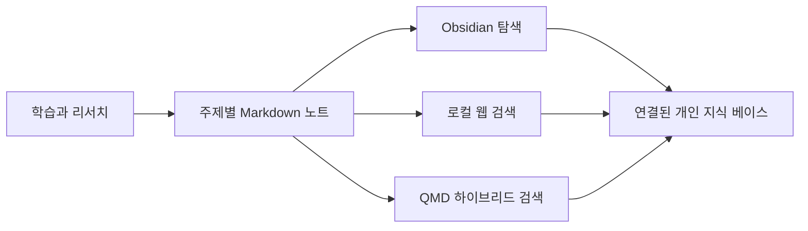

# Study

> 흩어진 공부를 검색하고 연결할 수 있는 지식으로 만드는 개인 학습 위키.


개발, 웹, 인프라, 보안, 데이터, AI, 자격증 공부를 Markdown으로 축적하는 저장소입니다. 각 주제는 독립된 문서로 관리하고, Mermaid 다이어그램과 출처 링크를 더해 다시 읽기 쉬운 형태로 정리합니다.

## 한눈에 보기

- **400개 이상의 Markdown 노트**를 주제별 폴더로 관리합니다.
- **Obsidian vault**로 바로 열어 탐색하고 문서를 연결할 수 있습니다.
- **로컬 웹 UI**에서 전체 노트를 검색할 수 있습니다.
- **QMD**를 연결하면 BM25, 벡터 검색, LLM rerank를 활용할 수 있습니다.
- **자동 링크 도구**로 관련 문서의 Obsidian 링크를 제안하거나 생성할 수 있습니다.
- 원문은 모두 평범한 Markdown이므로 특정 앱에 종속되지 않습니다.



## 주요 주제

| 영역 | 대표 노트 |
| --- | --- |
| 프론트엔드 | [React](./react/react.md) · [Next.js](./nextjs/nextjs.md) · [Vue Props & Emit](./vue-props-emit/props-emit.md) · [Vite](./vite/vite.md) · [Tailwind CSS](./tailwindcss/tailwindcss.md) |
| 백엔드·아키텍처 | [Dependency Injection](./dependency-injection/dependency-injection.md) · [Webhook](./webhook/webhook.md) · [Kafka](./kafka/kafka.md) · [Redis](./redis/redis.md) · [WebSocket](./websocket/websocket.md) |
| 웹·보안 | [OIDC](./OIDC/oidc.md) · [ABAC/RBAC](./abac-rbac/abac-rbac.md) · [Cross-Origin Policy](./cross-origin-policy/cross-origin-policy.md) · [Browser Cookie](./browser-cookie/browser-cookie.md) · [Helmet](./helmet/helmet.md) |
| 인프라·운영 | [AWS EC2](./AWS/ec2.md) · [VPS](./VPS/vps.md) · [Certbot](./certbot/certbot.md) · [SSHFS](./sshfs/sshfs.md) · [tmux](./tmux/tmux.md) |
| 데이터·CS | [ACID Transaction](./ACID-%ED%8A%B8%EB%9E%9C%EC%9E%AD%EC%85%98/ACID-%ED%8A%B8%EB%9E%9C%EC%9E%AD%EC%85%98.md) · [SQL Query](./sql-query/sql-query.md) · [SQLite](./sqlite/sqlite.md) · [Time Complexity](./time-complexity/time-complexity.md) · [BM25](./bm25/bm25.md) |
| AI·에이전트 | [LLM Wiki](./llm-wiki/llm-wiki.md) · [Codex Agent Team](./codex-agent-team/codex-agent-team.md) · [QMD](./qmd/qmd.md) |
| 자격증 | [정보처리기사](./%EC%A0%95%EB%B3%B4%EC%B2%98%EB%A6%AC%EA%B8%B0%EC%82%AC/%EC%A0%95%EB%B3%B4%EC%B2%98%EB%A6%AC%EA%B8%B0%EC%82%AC.md) |

## 저장소 구조

```text
study/
├── <topic>/              # 주제별 Markdown 노트
│   └── <topic>.md
├── 정보처리기사/          # 과목과 개념별 자격증 노트
├── .study-wiki/          # 검색 UI와 자동 링크 도구
├── .obsidian/            # Obsidian vault 설정
├── .qmd/                 # QMD 로컬 인덱스
├── .agents/              # 노트 작성 규칙과 로컬 skill
└── AGENTS.md             # 저장소 작업 규칙
```

## 빠른 시작

### 1. 저장소 받기

```bash
git clone https://github.com/nes0903/study.git
cd study
```

### 2. Obsidian에서 열기

- Obsidian의 **Open folder as vault**를 선택합니다.
- 복제한 `study` 폴더를 지정합니다.
- 폴더 탐색, 검색, 백링크, Mermaid 렌더링을 바로 사용할 수 있습니다.

Obsidian 없이 GitHub, VS Code 또는 원하는 Markdown 편집기에서 읽어도 됩니다.

## 로컬 검색 UI

Node.js가 설치되어 있다면 별도 애플리케이션 의존성 없이 검색 서버를 실행할 수 있습니다.

```bash
cd .study-wiki
npm run dev
```

- 기본 주소: `http://127.0.0.1:4317`
- **Hybrid**: QMD를 먼저 사용하고, 사용할 수 없으면 로컬 키워드 검색으로 전환합니다.
- **Local**: Node.js 서버가 만든 로컬 Markdown 인덱스만 사용합니다.
- 로컬 인덱스는 짧게 캐시되며, 새로 작성한 노트도 자동으로 검색 대상에 반영됩니다.

## QMD 검색 준비

QMD를 사용하면 키워드 검색과 의미 기반 검색을 함께 활용할 수 있습니다. 첫 실행에서는 `npx`가 QMD 패키지를 내려받으므로 네트워크 연결이 필요합니다.

```bash
cd .study-wiki

# collection 등록과 BM25 인덱스 갱신
npm run qmd:setup

# 벡터 임베딩까지 생성
npm run qmd:embed
```

`qmd:embed`는 로컬 모델 다운로드와 임베딩 생성 때문에 처음 실행할 때 시간이 더 걸릴 수 있습니다.

## 관련 문서 자동 연결

자동 링크 도구는 각 문서의 제목과 핵심 용어를 비교해 관련 Obsidian 링크를 만듭니다.

```bash
cd .study-wiki

# 변경 예정 내용만 확인하는 안전한 dry-run
npm run link:check

# 확인 후 실제 문서에 링크 반영
npm run link:write
```

실제 반영 시 문서 끝의 아래 관리 블록만 생성하거나 갱신합니다.

```md
<!-- study-links:start -->
## 관련 문서

- `keyword`: [[target/path|Target Title]]
<!-- study-links:end -->
```

## 노트 작성 규칙

- 하나의 주제는 `topic-name/topic-name.md` 형태로 분리합니다.
- 문서 첫 제목은 주제를 명확하게 드러내는 `H1`으로 작성합니다.
- 설명은 기본적으로 한국어로 작성하되, 정확한 기술 용어는 원문 표기를 함께 사용합니다.
- 큰 섹션에는 흐름, 구조, 비교를 보여 주는 Mermaid 다이어그램을 배치합니다.
- 시의성이 있는 내용은 작성 시점을 남기고 최신 자료를 확인합니다.
- 공식 문서와 1차 자료를 우선하고, 실제로 참고한 자료는 문서 끝의 `참고 링크`에 남깁니다.
- 여러 자료의 내용을 나열하기보다 하나의 이해 흐름으로 재구성합니다.

새 노트의 기본 형태는 다음과 같습니다.

```text
한 줄 요약 → 중요한 이유 → 핵심 개념 → 구조와 흐름
→ 세부사항과 트레이드오프 → 실전 예시 → 빠른 복습 → 참고 링크
```

---

꾸준히 적고, 연결하고, 다시 찾기 위한 저장소입니다.
