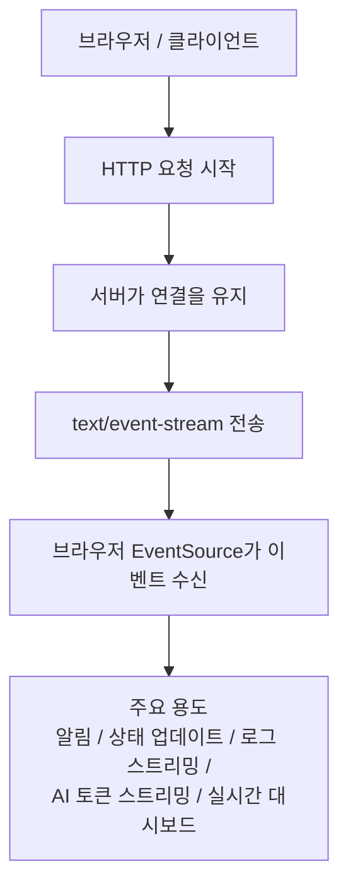
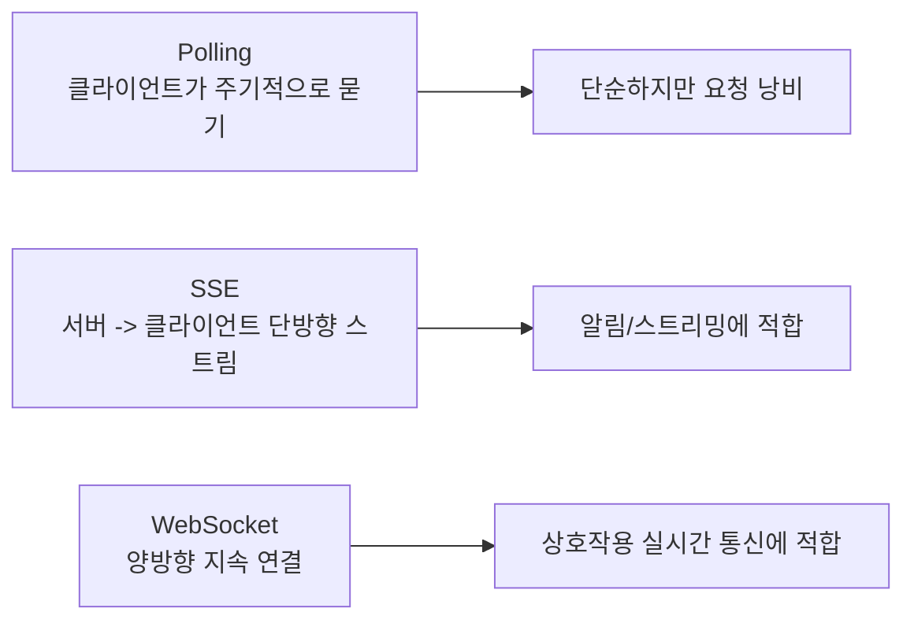
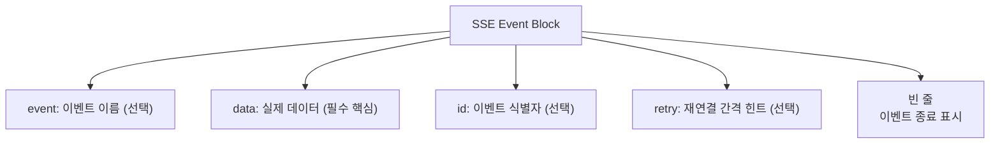
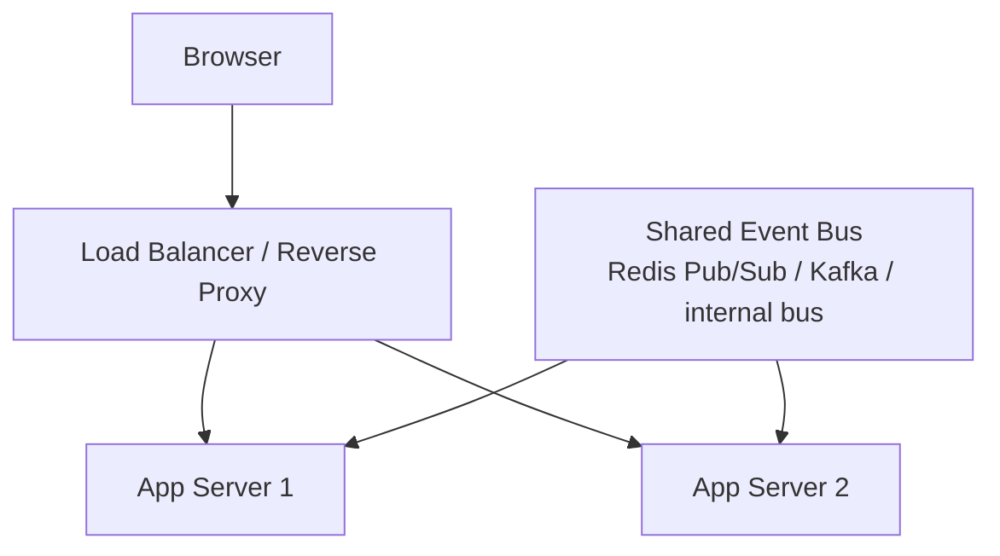

# SSE 상세 정리

작성 기준일: 2026-04-13  
주요 참고: `MDN Server-sent events`, `MDN EventSource`, `HTML Living Standard`

## 1. 한 줄 요약

`SSE(Server-Sent Events)`는 서버가 HTTP 연결을 오래 유지한 채, 클라이언트에게 텍스트 이벤트를 계속 밀어 보내는 `서버 -> 클라이언트 단방향 실시간 전송 방식`이다.

짧게 말하면:

- 브라우저가 한 번 연결을 열고
- 서버가 `text/event-stream` 형식으로 데이터를 계속 흘려보내며
- 브라우저는 `EventSource` API로 이를 받는다

는 구조다.

---

## 2. 먼저 큰 그림



이 구조에서 가장 중요한 포인트는:

- 시작은 그냥 HTTP 요청이고
- 연결이 끝나지 않은 채 유지되며
- 서버만 계속 데이터를 보낸다는 점

이다.

---

## 3. SSE가 왜 필요한가

웹은 기본적으로 요청-응답 구조다.

즉 보통은:

- 클라이언트가 요청
- 서버가 응답
- 연결 종료

로 끝난다.

하지만 아래 같은 경우에는 서버가 먼저 상태 변화를 알려주고 싶다.

- 새 알림 도착
- 작업 진행률 변화
- 실시간 로그 출력
- AI 답변 토큰 스트리밍
- 주가/모니터링 대시보드 갱신

이런 상황에서 매번 polling하면:

- 불필요한 요청이 많고
- 지연도 생긴다

그래서 서버가 데이터를 계속 밀어 넣는 방식으로 SSE가 쓰인다.

---

## 4. SSE의 핵심 특징

### 4.1 서버 -> 클라이언트 단방향

가장 중요한 특징이다.

- 서버는 클라이언트에게 계속 보낼 수 있다
- 하지만 같은 연결로 클라이언트가 서버에 자유롭게 메시지를 보내는 구조는 아니다

즉 `양방향`이 아니라 `단방향 스트리밍`이다.

### 4.2 HTTP 위에서 동작

SSE는 별도 프로토콜을 새로 올리는 것이 아니라:

- 그냥 HTTP 응답을 길게 유지하면서
- 특정 포맷의 텍스트 스트림을 보내는 방식

이다.

그래서 WebSocket보다 네트워크 인프라와 더 잘 맞는 경우가 많다.

### 4.3 브라우저 표준 API 존재

브라우저에서는 `EventSource` API로 다룬다.

즉 JS에서 아래처럼 바로 쓸 수 있다.

```js
const source = new EventSource("/events");
```

### 4.4 자동 재연결

브라우저 `EventSource`는 연결이 끊기면 자동 재연결을 시도하는 동작을 가진다.

이 점이 실무에서 매우 편리하다.

### 4.5 텍스트 기반

SSE는 기본적으로 텍스트 스트림이며, `text/event-stream` MIME 타입을 사용한다.

즉 WebSocket처럼 바이너리 프레임 기반 프로토콜은 아니다.

---

## 5. Polling, WebSocket과 비교

SSE를 가장 쉽게 이해하려면 비교가 필요하다.



### 5.1 Polling과 비교

- Polling은 클라이언트가 계속 확인해야 한다
- SSE는 서버가 생기면 바로 보낼 수 있다

즉 SSE는 polling보다:

- 더 실시간에 가깝고
- 요청 낭비가 적다

### 5.2 WebSocket과 비교

- WebSocket은 양방향
- SSE는 서버 -> 클라이언트 단방향

따라서:

- 채팅, 게임, 협업처럼 양방향 상호작용이면 WebSocket
- 알림, 로그, 토큰 스트리밍처럼 서버 push 위주면 SSE

가 자연스럽다.

---

## 6. SSE는 어떻게 시작되나

SSE는 별도 upgrade handshake가 필요 없다.

클라이언트는 그냥 HTTP 요청을 보낸다.

서버는 보통 아래 헤더를 달아 응답한다.

- `Content-Type: text/event-stream`
- `Cache-Control: no-cache`
- `Connection: keep-alive`

그리고 응답을 끝내지 않고 계속 쓴다.

즉:

- 일반 HTTP 응답처럼 시작하고
- 응답 body가 끝없이 이어진다

고 보면 된다.

---

## 7. 브라우저 API: EventSource

MDN 기준 SSE의 대표 클라이언트 API는 `EventSource`다.

기본 사용 예:

```js
const source = new EventSource("/events");

source.onmessage = (event) => {
  console.log(event.data);
};

source.onerror = (err) => {
  console.error("SSE error", err);
};
```

### 7.1 주요 이벤트

- `open`
- `message`
- `error`

### 7.2 커스텀 이벤트

서버가 `event:` 필드로 이름을 붙이면 클라이언트는 `addEventListener()`로 받을 수 있다.

예:

```js
source.addEventListener("progress", (event) => {
  console.log(event.data);
});
```

### 7.3 withCredentials

MDN의 `EventSource()` 문서 기준 `withCredentials` 옵션이 있다.

즉:

- CORS 환경에서 쿠키/인증 포함 여부를 조정할 수 있다

이건 인증 구조를 설계할 때 중요하다.

---

## 8. SSE 메시지 포맷

SSE의 핵심은 `event-stream format`이다.

서버가 보내는 데이터는 보통 이런 형태다.

```text
event: progress
data: 10%

event: progress
data: 20%

data: hello

```

중요한 점:

- 각 이벤트는 빈 줄로 구분된다
- `data:`가 핵심 payload다
- `event:`는 이벤트 이름
- `id:`는 last-event-id용
- `retry:`는 재연결 대기 시간 힌트

### 8.1 가장 중요한 필드

#### data

실제 payload다.

이게 없으면 의미 있는 이벤트가 전달되지 않는다.

#### event

이벤트 타입 이름이다.

없으면 기본적으로 일반 `message` 이벤트로 처리된다.

#### id

이벤트 식별자다.

브라우저는 이 값을 저장해 두었다가 재연결 시 `Last-Event-ID`로 다시 보낼 수 있다.

#### retry

재연결 간격 힌트다.

밀리초 단위로 해석된다.

---

## 9. 메시지 포맷을 구조적으로 보기



이 포맷은 단순해 보이지만 매우 중요하다.

왜냐하면:

- SSE는 JSON 프로토콜이 아니라
- 줄 기반 텍스트 프로토콜

이기 때문이다.

즉 서버가 응답을 JSON 배열처럼 보내면 안 되고, SSE 형식으로 잘라서 보내야 한다.

---

## 10. Last-Event-ID와 재연결

SSE의 실무 핵심 중 하나다.

연결이 중간에 끊기면 브라우저는 자동 재연결을 시도한다.

이때 이전에 받은 마지막 `id`가 있으면:

- `Last-Event-ID`

헤더를 포함해 다시 연결할 수 있다.

### 10.1 왜 중요한가

이 기능 덕분에 서버는:

- "클라이언트가 어디까지 받았는지"

를 알고, 그 이후 이벤트만 이어서 보낼 수 있는 구조를 만들 수 있다.

### 10.2 언제 특히 유용한가

- 로그 스트리밍
- 이벤트 피드
- 장시간 진행률 스트리밍
- 주가/실시간 피드

즉 네트워크가 잠깐 끊겨도 continuity를 유지하기 쉬워진다.

---

## 11. SSE 응답은 왜 자꾸 flush가 필요하나

SSE를 구현할 때 자주 막히는 부분이다.

서버는 이벤트를 썼다고 끝이 아니다.

중간 버퍼에 갇히면 클라이언트가 바로 못 본다.

그래서 보통:

- chunked response
- response flush
- 프록시 buffering 해제

같은 처리가 필요하다.

### 11.1 왜 이런 문제가 생기나

웹서버/프록시/CDN은 기본적으로 응답을 버퍼링하려는 경향이 있다.

하지만 SSE는:

- "즉시 조금씩 보내는 것"

이 중요하므로 buffering이 맞지 않는다.

### 11.2 실무 포인트

SSE가 안 되는 것처럼 보일 때 실제 원인은 자주 아래다.

- reverse proxy buffering
- gzip/compression 문제
- framework flush 미지원
- load balancer idle timeout

즉 애플리케이션 코드만 맞아서는 안 되고, 인프라까지 같이 봐야 한다.

---

## 12. Content-Type이 중요한 이유

SSE는 반드시 아래 MIME 타입을 써야 한다.

- `text/event-stream`

이게 중요한 이유:

- 브라우저가 이 응답을 일반 다운로드/텍스트 응답이 아니라
- EventSource 스트림으로 해석해야 하기 때문이다

즉 Content-Type이 틀리면 SSE가 제대로 동작하지 않는다.

---

## 13. 캐시와 압축은 어떻게 보나

보통 SSE에서는:

- `Cache-Control: no-cache`

를 함께 쓴다.

이유:

- 중간 캐시가 스트림을 캐싱하면 안 되기 때문이다

압축은 환경에 따라 도움이 될 수도 있지만, 실시간 flush 특성과 충돌하는 경우도 있다.

그래서 실전에서는:

- "조금 더 효율적일까?"보다
- "바로바로 도착하나?"가 더 중요하다

는 관점으로 본다.

---

## 14. SSE가 잘 맞는 대표 용도

### 14.1 AI 응답 스트리밍

요즘 매우 흔한 용도다.

서버가 토큰을 생성할 때마다:

- chunk
- delta
- progress

를 SSE로 보내면 브라우저가 실시간 타이핑처럼 보여줄 수 있다.

### 14.2 작업 진행률 표시

예:

- 대용량 파일 처리
- 배치 작업
- 리포트 생성

### 14.3 실시간 로그 출력

예:

- 서버 로그 tail
- 빌드 로그
- 배포 상태 출력

### 14.4 알림 피드

예:

- 운영 알림
- 시스템 이벤트
- 대시보드 상태 변화

즉 "서버가 일방향으로 계속 알려주기만 하면 되는 문제"에 매우 적합하다.

---

## 15. SSE가 잘 안 맞는 경우

### 15.1 양방향 상호작용이 많은 경우

예:

- 채팅
- 협업 편집
- 게임

이런 경우는 클라이언트 -> 서버 방향도 실시간으로 많기 때문에 WebSocket이 더 자연스럽다.

### 15.2 브라우저가 아닌 다양한 바이너리 클라이언트가 핵심일 때

SSE는 웹 친화적이지만, 모든 플랫폼에서 WebSocket만큼 일반적인 양방향 채널은 아니다.

### 15.3 아주 복잡한 메시지 프로토콜이 필요한 경우

SSE는 간단한 text stream에 강점이 있다.

복잡한 상호작용 프로토콜을 얹으려 하면 오히려 구조가 불편해질 수 있다.

---

## 16. SSE vs WebSocket

| 비교 항목 | SSE | WebSocket |
|---|---|---|
| 방향 | 서버 -> 클라이언트 | 양방향 |
| 시작 방식 | 일반 HTTP 요청 | HTTP Upgrade 후 전환 |
| 데이터 형식 | 텍스트 이벤트 스트림 | 프레임 기반 |
| 브라우저 API | EventSource | WebSocket |
| 자동 재연결 | 기본 지원 성격 강함 | 직접 구현하는 경우 많음 |
| 적합한 용도 | 알림, 스트리밍, 진행률 | 채팅, 협업, 게임 |

핵심 정리:

- `단방향 서버 push`면 SSE
- `양방향 상호작용`이면 WebSocket

---

## 17. SSE vs Long Polling

| 비교 항목 | Long Polling | SSE |
|---|---|---|
| 구조 | 응답 끝나면 다시 요청 | 한 연결을 오래 유지 |
| 지연 | 요청 재개 시점 영향 | 더 자연스러운 연속 스트림 |
| 구현 | 비교적 단순 | 서버 flush/streaming 이해 필요 |
| 효율 | 반복 요청 필요 | 연결 유지로 더 효율적 |

즉 SSE는 long polling보다 더 "스트리밍다운" 모델이다.

---

## 18. 인증은 어떻게 처리하나

SSE는 HTTP 요청으로 시작하므로 인증도 보통 HTTP 문맥을 그대로 활용한다.

예:

- 쿠키 기반 세션
- bearer token
- reverse proxy auth

### 18.1 주의점

단, EventSource는 일반 fetch보다 헤더 제어가 제한적일 수 있어 구조에 따라 인증 방식 선택이 달라질 수 있다.

그래서 실무에서는 자주:

- same-origin + cookie
- short-lived token을 query나 별도 endpoint에서 교환

같은 패턴을 쓴다.

즉 "클라이언트가 마음대로 헤더 다 넣는 fetch"처럼 생각하면 안 된다.

---

## 19. 운영할 때 어려운 점

SSE는 WebSocket보다 단순하지만 운영 포인트는 분명 있다.

### 19.1 장기 연결 수 관리

연결을 오래 유지하므로:

- 동시 연결 수
- 메모리 사용
- worker/thread 모델

을 신경 써야 한다.

### 19.2 프록시/로드밸런서 timeout

중간 장비가 idle stream을 끊을 수 있다.

그래서 heartbeat나 주기적 comment line 송신이 필요할 수 있다.

### 19.3 scale-out

서버가 여러 대면:

- 어떤 인스턴스가 어떤 클라이언트를 들고 있는지
- 새 이벤트를 어느 인스턴스가 push할지

문제가 생긴다.

이 경우 보통:

- shared pub/sub
- message bus

를 쓴다.

---

## 20. Heartbeat는 왜 필요한가

SSE에서도 연결이 가만히 있으면 중간 장비가 죽은 연결로 보고 끊을 수 있다.

그래서 흔히:

- comment line
- 빈 keepalive event

를 주기적으로 보낸다.

예:

```text
: keepalive

```

이건 브라우저 입장에선 특별한 메시지로 처리되지 않지만, 연결 유지에는 도움이 된다.

---

## 21. 실무 아키텍처 예시



이 구조의 의미:

- 브라우저는 SSE 연결을 앱 서버에 유지
- 실제 이벤트 생성은 별도 시스템에서도 가능
- 앱 서버는 shared event bus를 구독하고, 연결된 클라이언트로 SSE를 흘려보낸다

즉 SSE 서버는 단독 앱이 아니라 event delivery edge가 되는 경우가 많다.

---

## 22. 브라우저 친화성 측면에서의 장점

SSE는 브라우저에서 특히 다루기 좋다.

이유:

- 표준 `EventSource` API 존재
- 텍스트 기반이라 디버깅 쉬움
- HTTP 인프라와 자연스럽게 맞음
- 서버 -> 클라이언트 push만 필요하면 구조가 단순함

즉 "웹 프론트엔드에서 서버 상태를 계속 받아야 하는데, 양방향까진 필요 없다"면 매우 실용적이다.

---

## 23. 자주 하는 오해

### 23.1 SSE는 WebSocket의 하위호환이다

아니다.

둘은 목적이 다르다.

- SSE: 단방향 서버 push
- WebSocket: 양방향 실시간 채널

### 23.2 SSE는 그냥 긴 HTTP 응답일 뿐이라 아무 설정 없이 다 된다

아니다.

실전에서는:

- buffering
- flush
- timeout
- proxy

문제를 자주 만난다.

### 23.3 SSE는 무조건 가볍다

프로토콜은 단순하지만, 장기 연결이 많아지면 서버 운영 부담은 커질 수 있다.

### 23.4 SSE는 메시지 유실 문제를 자동으로 해결한다

부분적으로만 그렇다.

`id`와 `Last-Event-ID`를 잘 설계해야 복구가 가능하다.

즉 자동 재연결이 있다고 해서 자동 정확한 복구가 되는 건 아니다.

---

## 24. 실전 체크리스트

- 이 문제는 정말 `서버 -> 클라이언트` 단방향인가?
- WebSocket까지 필요한가, SSE면 충분한가?
- `Content-Type: text/event-stream` 설정했는가?
- reverse proxy buffering이 꺼져 있는가?
- heartbeat를 보낼 것인가?
- `id`와 재연결 전략이 있는가?
- 인증 방식을 EventSource 제약과 맞게 설계했는가?
- scale-out 시 shared event bus가 필요한가?

이 질문들에 답할 수 있으면 SSE 설계가 많이 안정된다.

---

## 25. 빠른 복습

- SSE는 `서버 -> 클라이언트 단방향 실시간 스트림`이다.
- 브라우저에서는 `EventSource` API로 사용한다.
- 응답 MIME 타입은 `text/event-stream`이다.
- 이벤트는 `data`, `event`, `id`, `retry` 같은 줄 기반 포맷으로 보낸다.
- 재연결과 `Last-Event-ID`를 활용할 수 있다.
- 알림, 진행률, 로그, AI 토큰 스트리밍에 잘 맞는다.
- 양방향 상호작용이면 WebSocket이 더 적합하다.

---

## 26. 참고 링크

- MDN, Using server-sent events: [링크](https://developer.mozilla.org/en-US/docs/Web/API/Server-sent_events/Using_server-sent_events)
- MDN, EventSource: [링크](https://developer.mozilla.org/en-US/docs/Web/API/EventSource)
- MDN, EventSource() constructor: [링크](https://developer.mozilla.org/en-US/docs/Web/API/EventSource/EventSource)
- HTML Living Standard, Server-sent events: [링크](https://html.spec.whatwg.org/multipage/server-sent-events.html)
- web.dev, Stream updates with server-sent events: [링크](https://web.dev/eventsource-basics/)

