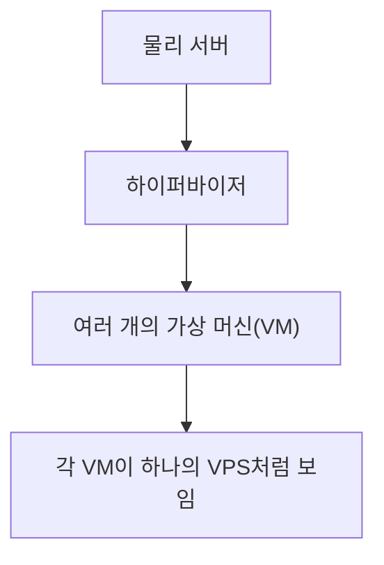
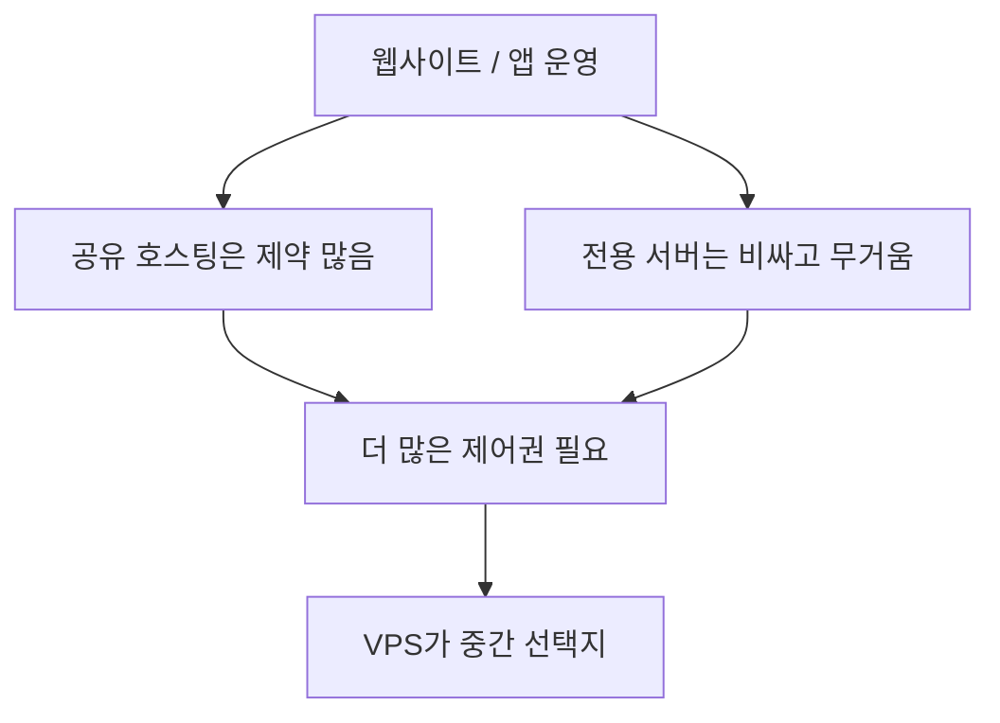
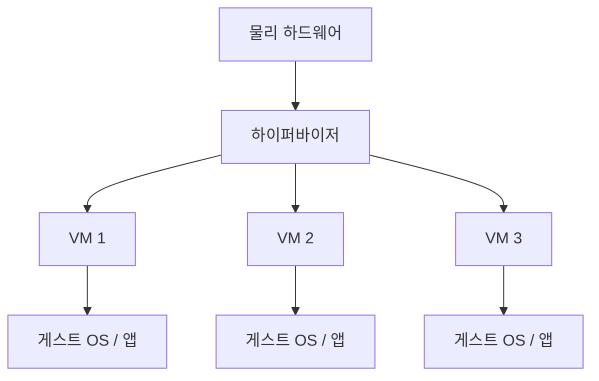
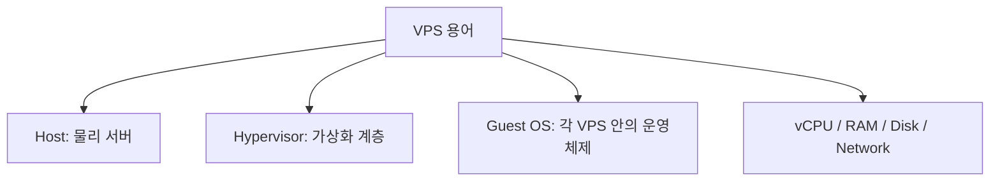
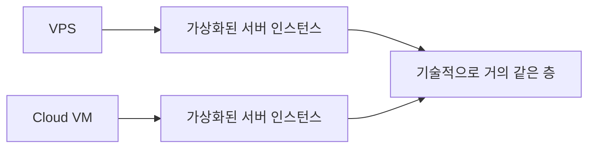
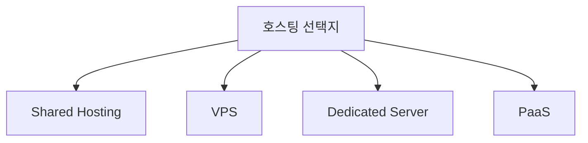
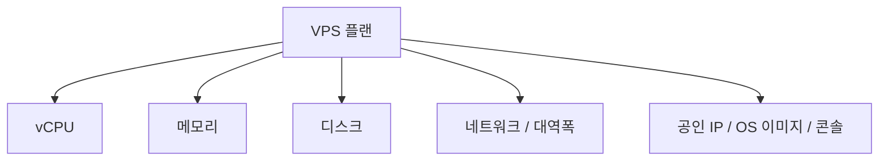
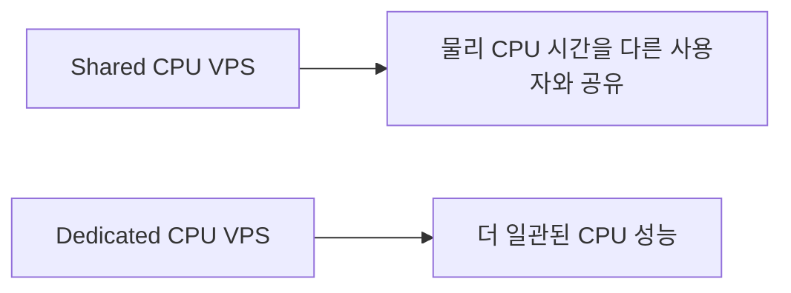

# VPS 상세 정리

작성 기준일: 2026-04-19  
조사 방식: 웹검색 기반 최신 조사  
주요 참고: `docs.aws.amazon.com` Lightsail 문서, `linode.com/docs`, `redhat.com`, `digitalocean.com`

## 1. 한 줄 요약

`VPS(Virtual Private Server)`는 물리 서버 한 대의 자원을 가상화해서 여러 개의 독립된 가상 서버처럼 나누어 제공하는 서비스 또는 그 가상 서버 자체를 뜻한다.

AWS Lightsail 문서는 Lightsail instance를 `virtual private server (VPS)`라고 직접 설명하고, DigitalOcean 문서도 VPS를 "물리 서버를 가상으로 나눠 각 사용자가 자기 가상 서버를 갖는 방식"이라고 설명한다. 즉 VPS는 "독립 서버처럼 보이지만 실제로는 가상화된 VM"이라고 이해하면 된다.

---

## 2. 왜 VPS가 필요한가

VPS가 나온 이유는 공유 호스팅과 전용 서버 사이의 간극을 메우기 위해서다.

- `공유 호스팅`은 싸고 간단하지만, OS 수준 제어권이 거의 없고 다른 사용자와 자원을 많이 공유한다.
- `전용 서버`는 완전한 제어권이 있지만 비용과 운영 부담이 크다.
- `VPS`는 전용 서버처럼 OS/root 권한을 갖고 다룰 수 있으면서도, 실제 물리 서버는 여러 사용자가 분할해 쓰기 때문에 비용이 더 낮다.

즉 VPS는 보통 "내 서버처럼 다루고 싶지만, 물리 서버를 통째로 살 필요는 없을 때" 가장 자연스러운 선택이다.

---

## 3. VPS는 기술적으로 어떻게 동작하나

Red Hat의 하이퍼바이저 설명은 VPS의 기술적 핵심을 이해하는 데 도움이 된다. 하이퍼바이저는 CPU, 메모리, 스토리지 같은 물리 자원을 가상 머신들에 나눠 주는 소프트웨어다.

즉 VPS는 보통 아래 구조로 동작한다.

1. 물리 서버(host)가 있다.
2. 그 위에 하이퍼바이저가 올라간다.
3. 하이퍼바이저가 여러 가상 머신(VM)을 만든다.
4. 각 VM은 자기 OS를 가진 독립 서버처럼 동작한다.

이때 각 VPS/VM은:

- 자체 운영체제
- 자체 파일시스템
- 자체 네트워크 인터페이스
- 자체 프로세스 공간

을 가지므로 사용자는 "거의 전용 서버처럼" 느낄 수 있다.

즉 VPS는 마케팅 용어로만 보면 안 되고, 실제로는 "VM 기반 격리된 서버 인스턴스"라고 이해하는 편이 정확하다.

---

## 4. VPS에서 자주 나오는 핵심 용어

VPS를 읽을 때는 아래 용어를 먼저 구분해야 한다.

### 4.1 Host

실제 물리 하드웨어 서버다.

### 4.2 Hypervisor

가상화를 담당하는 소프트웨어 계층이다. 물리 자원을 잘라 여러 VM에 할당한다.

### 4.3 Guest OS

각 VPS 안에서 돌아가는 운영체제다.

예:

- Ubuntu
- Debian
- Rocky Linux
- Windows Server

### 4.4 vCPU

가상 CPU다. 실제 물리 CPU 코어를 일정 규칙으로 나누어 VM에 제공한 논리 CPU라고 보면 된다.

### 4.5 RAM / Disk / Network

VPS는 보통 메모리, 스토리지, 네트워크 대역폭/전송량도 플랜 단위로 함께 제공된다.

즉 VPS는 "서버 전체"가 아니라 "가상화된 자원 묶음"을 받는 것이라고 이해하면 된다.

---

## 5. VPS와 클라우드 VM은 같은가

실무에서는 VPS와 cloud VM을 상당히 비슷한 층의 개념으로 볼 수 있다.

AWS Lightsail 문서가 instance를 `virtual private server (VPS)`라고 부르고, Linode 문서가 compute instance를 virtual machine으로 설명하는 것에서 알 수 있듯:

- Lightsail instance
- Linode compute instance
- DigitalOcean Droplet
- 일반적인 VPS

는 기술적으로 꽤 비슷한 종류의 자원이다.

다만 차이는 있다.

- `VPS`는 더 전통 호스팅/상품 용어에 가깝다.
- `Cloud VM`은 클라우드 인프라 문맥에서 쓰는 표현에 가깝다.

즉 기술적으로는 유사하지만, 마케팅/제품 포지셔닝 문맥이 조금 다르다.

### 5.1 실무 감각

소규모 프로젝트에서는:

- Lightsail
- Linode
- Vultr
- DigitalOcean

같은 서비스를 "VPS"라고 부르는 게 자연스럽다.

반면 대규모 인프라 문맥에서는:

- EC2 instance
- GCE VM

처럼 cloud VM이라고 부르는 경우가 많다.

---

## 6. VPS와 shared hosting / dedicated server / PaaS 차이

이 비교는 VPS를 이해하는 데 매우 중요하다.

### 6.1 VPS vs Shared Hosting

`shared hosting`은:

- 서버 전체 환경을 호스팅 업체가 정하고
- 여러 사용자가 같은 웹서버/환경을 강하게 공유하며
- 사용자의 OS/root 제어권이 거의 없다.

`VPS`는:

- 사용자마다 독립 VM이 있고
- root 권한과 패키지 설치 권한이 있으며
- 서버 설정을 훨씬 자유롭게 바꿀 수 있다.

즉 제어권과 격리 수준에서 차이가 크다.

### 6.2 VPS vs Dedicated Server

`dedicated server`는:

- 물리 서버를 혼자 쓴다

`VPS`는:

- 물리 서버는 공유하지만
- 논리적으로 독립된 VM을 쓴다

즉 dedicated가 성능/격리 최상단이라면, VPS는 비용 효율적인 중간 선택지다.

### 6.3 VPS vs PaaS

DigitalOcean의 PaaS 설명을 보면, PaaS는 인프라를 더 많이 숨긴다.

즉:

- `VPS`는 서버를 직접 운영한다
- `PaaS`는 코드를 올리면 플랫폼이 배포/스케일링을 많이 대신한다

즉 VPS는 IaaS 쪽에 가깝고, PaaS는 한 단계 더 추상화된 모델이다.

### 6.4 한 줄 요약

- Shared Hosting = 가장 단순, 제어권 낮음
- VPS = 중간, 제어권 높고 비용 합리적
- Dedicated = 가장 강한 격리/제어, 비용 큼
- PaaS = 서버 자체를 덜 의식하고 싶을 때

---

## 7. VPS에서 실제로 제공받는 것

Linode compute instance 문서는 인스턴스가 보통 다음을 포함한다고 설명한다.

- shared 또는 dedicated vCPU
- SSD 스토리지
- 네트워크 전송량
- IPv4 / IPv6
- OS 이미지
- 콘솔/CLI/API 관리

즉 VPS는 "CPU 몇 개만 주는 것"이 아니라, 서버 운영에 필요한 기본 자원 묶음을 준다.

### 7.1 보통 같이 보는 항목

- vCPU 수
- RAM 용량
- 디스크 크기
- SSD/NVMe 여부
- 월간 트래픽
- 공인 IP 개수
- 백업 옵션
- 스냅샷 옵션

### 7.2 왜 이게 중요한가

VPS는 가격이 저렴해 보여도, 실제 성능은:

- CPU가 shared인지 dedicated인지
- 디스크가 느린지 빠른지
- 네트워크 전송량 초과 비용이 있는지

에 따라 크게 달라질 수 있다.

즉 단순 월 가격만 보고 고르면 안 된다.

---

## 8. Shared CPU vs Dedicated CPU

DigitalOcean과 Linode 문서는 공통적으로:

- shared CPU
- dedicated CPU

유형을 나누어 설명한다.

### 8.1 Shared CPU VPS

특징:

- 저렴함
- 일반 웹사이트, 개발, 테스트에 적합
- 순간적인 성능 흔들림이 있을 수 있음

### 8.2 Dedicated CPU VPS

특징:

- 더 비쌈
- CPU 성능이 더 예측 가능
- 트래픽이 꾸준하거나 CPU 바운드 작업에 유리

### 8.3 실무 감각

아주 단순하게:

- 개인 블로그 / 작은 API / staging -> shared CPU
- 고정 트래픽 앱 / 빌드 작업 / 게임 서버 / CPU 민감 서비스 -> dedicated CPU 검토

정도로 시작하면 된다.

---

## 9. VPS에서 운영자가 직접 책임지는 것

VPS를 쓰는 순간 보통 아래 책임이 생긴다.

### 9.1 운영체제 관리

- 패키지 업데이트
- 보안 패치
- 사용자 계정 관리

### 9.2 네트워크/방화벽

- UFW / iptables / nftables
- SSH 포트 보호
- 서비스 포트 공개 여부

### 9.3 애플리케이션 운영

- 웹서버(Nginx/Apache)
- 런타임(Node/Python/Java 등)
- 로그 관리
- 프로세스 관리자(systemd/pm2)

### 9.4 백업/복구

- 스냅샷
- DB 백업
- 파일 백업
- 복구 테스트

### 9.5 모니터링

- CPU/RAM/Disk
- 프로세스 상태
- 네트워크
- 업타임

즉 VPS는 저렴하고 유연하지만, 그만큼 "서버 운영" 자체를 해야 한다.

---

## 10. VPS의 장점

### 10.1 제어권

root 권한이 있어서:

- 패키지 설치
- 커널/시스템 설정
- 웹서버/DB/캐시/프록시 구성

을 자유롭게 할 수 있다.

### 10.2 가격 대비 유연성

전용 서버보다 싸고, shared hosting보다 훨씬 강력하다.

### 10.3 학습/실험에 좋음

리눅스 서버 운영, 네트워크, 배포, 웹서버, DB를 직접 다뤄 볼 수 있다.

### 10.4 다양한 워크로드 가능

- 웹사이트
- API 서버
- 블로그
- VPN
- 개인 Git 서버
- 개발 환경
- 게임 서버

즉 범용성이 높다.

---

## 11. VPS의 단점과 한계

### 11.1 운영 부담

PaaS와 달리:

- OS 관리
- 패치
- 보안 설정
- 장애 대응

을 직접 해야 한다.

### 11.2 물리 자원 공유

가상화 기반이므로 완전한 dedicated server만큼 예측 가능한 성능이 아닐 수 있다.

특히 shared CPU는 이 영향이 크다.

### 11.3 관리형 서비스보다 기능이 적을 수 있음

예:

- 자동 스케일링
- 고가용성
- 관리형 DB
- managed backup

은 별도 구축이 필요할 수 있다.

### 11.4 잘못 운영하면 보안 사고 위험

예:

- root 로그인 허용
- 약한 SSH 설정
- 패치 방치
- DB 공개 노출

즉 "싼 서버"가 아니라 "운영 책임이 따라오는 서버"다.

---

## 12. VPS에서 자주 같이 보는 기능들

보통 VPS 서비스는 서버만 던져 주고 끝나지 않는다.

### 12.1 Snapshot / Backup

서버 전체 상태 백업이나 디스크 스냅샷을 제공하는 경우가 많다.

### 12.2 Block Storage

별도 볼륨을 붙여 데이터 디스크를 분리할 수 있다.

### 12.3 Static IP

고정 공인 IP를 제공하는 경우가 많다.

### 12.4 Firewall / VPC / Private Networking

클라우드형 VPS는 전용 사설 네트워크와 방화벽 기능도 붙는 경우가 많다.

### 12.5 Load Balancer

상위 플랜이나 별도 상품으로 제공되기도 한다.

즉 현대 VPS는 단순 "가상 머신 하나"라기보다, 작은 규모 IaaS 묶음으로 제공되는 경우가 많다.

---

## 13. VPS가 잘 맞는 경우

### 13.1 개인 프로젝트 / 사이드 프로젝트

- 블로그
- 포트폴리오
- 간단한 API
- 봇

### 13.2 소규모 서비스

- 트래픽이 크지 않은 웹앱
- MVP
- 내부 업무 도구

### 13.3 서버 운영을 직접 배우고 싶을 때

VPS는 리눅스/웹서버/배포/방화벽을 직접 만져 보기 좋다.

### 13.4 특정 소프트웨어를 자유롭게 설치해야 할 때

PaaS보다 제어권이 커서:

- 특수 미들웨어
- custom daemon
- VPN / reverse proxy / media server

같은 설치형 워크로드에 유리하다.

---

## 14. VPS가 덜 맞는 경우

### 14.1 운영을 직접 하고 싶지 않을 때

그런 경우는:

- PaaS
- Managed hosting
- serverless

가 더 맞을 수 있다.

### 14.2 자동 스케일링과 고가용성이 핵심일 때

VPS 하나로는 한계가 있다.

즉 분산 구조가 필요하면:

- 클라우드 VM 여러 대
- managed LB
- Kubernetes

같은 단계로 가는 편이 자연스럽다.

### 14.3 강한 규제/보안/엔터프라이즈 운영이 필요할 때

단순 VPS보다:

- managed cloud
- dedicated
- enterprise virtualization

가 더 적합할 수 있다.

---

## 15. 실무 체크리스트

VPS를 고를 때는 아래를 보면 실수가 줄어든다.

### 15.1 CPU 유형

- shared CPU인가
- dedicated CPU인가

### 15.2 스토리지

- SSD/NVMe인가
- 백업/스냅샷이 쉬운가

### 15.3 네트워크

- 월간 트래픽 제한이 있는가
- 고정 IP를 주는가
- IPv6 지원하는가

### 15.4 운영 편의성

- 콘솔 접근
- API/CLI
- 이미지 선택
- 백업 기능

### 15.5 책임 범위

- 패치/백업/모니터링을 내가 직접 할 것인가
- managed 서비스가 더 맞는가

---

## 16. 추천 mental model

VPS를 헷갈리지 않으려면 이렇게 생각하면 된다.

### 16.1 기술적으로

VPS는:

- 물리 서버를 가상화한 VM

이다.

### 16.2 제품적으로

VPS는:

- 개인/소규모 팀이 쉽게 시작할 수 있게 포장된 cloud VM 상품

인 경우가 많다.

### 16.3 운영적으로

VPS는:

- 서버는 내 마음대로 다룰 수 있지만
- 운영 책임도 내가 가진다

고 보면 된다.

즉 VPS는 "제어권과 운영 부담을 함께 사는 모델"이다.

---

## 17. 한 문장 결론

VPS는 물리 서버 자원을 하이퍼바이저로 가상화해 여러 개의 독립된 VM처럼 나누어 제공하는 서버 상품으로, shared hosting보다 훨씬 큰 제어권을 주고 dedicated server보다 비용은 낮지만, 그만큼 운영체제·보안·백업·모니터링 책임을 사용자가 직접 져야 하는 중간 지점의 인프라 모델이다.

---

## 참고 링크

- Amazon Lightsail 소개: [What is Amazon Lightsail?](https://docs.aws.amazon.com/lightsail/latest/userguide/what-is-amazon-lightsail.html)
- Amazon Lightsail 인스턴스 FAQ: [What is a Lightsail instance?](https://docs.aws.amazon.com/lightsail/latest/userguide/amazon-lightsail-faq-instances.html)
- Amazon Lightsail 개요 백서: [Amazon Lightsail](https://docs.aws.amazon.com/whitepapers/latest/overview-deployment-options/lightsail.html)
- Akamai Cloud / Linode Compute Instance 문서: [Compute Instance](https://techdocs.akamai.com/cloud-computing/docs/compute-instance)
- DigitalOcean VPS 설명: [VPS hosting on DigitalOcean](https://www.digitalocean.com/solutions/vps-hosting)
- DigitalOcean 클라우드 호스팅/가상 서버 설명: [What is Cloud Hosting?](https://www.digitalocean.com/resources/articles/cloud-hosting)
- Red Hat 하이퍼바이저 설명: [What is a hypervisor?](https://www.redhat.com/en/topics/virtualization/what-is-a-hypervisor)

<!-- study-links:start -->
## 관련 문서

- `daemon`: [[daemon/daemon|데몬(daemon) 상세 정리]]
- `미들웨어`: [[정보처리기사/1과목 소프트웨어 설계/054 미들웨어(Middleware)/054 미들웨어(Middleware)|054 미들웨어(Middleware)]]
- `ipv4`: [[정보처리기사/4과목 프로그래밍 언어 활용/207 인터넷 주소 체계 - IPv4/207 인터넷 주소 체계 - IPv4|207 인터넷 주소 체계 - IPv4]]
- `ipv6`: [[정보처리기사/4과목 프로그래밍 언어 활용/208 인터넷 주소 체계 - IPv6/208 인터넷 주소 체계 - IPv6|208 인터넷 주소 체계 - IPv6]]
- `aws`: [[AWS/aws-sam|AWS SAM(Serverless Application Model) 상세 정리]]
- `ec2`: [[AWS/ec2|AWS EC2 관련 용어 상세 정리]]
- `vpn`: [[정보처리기사/5과목 정보시스템 구축 관리/323 VPN(Virtual Private Network, 가상 사설 통신망)/323 VPN(Virtual Private Network, 가상 사설 통신망)|323 VPN(Virtual Private Network, 가상 사설 통신망)]]
- `ssh`: [[정보처리기사/5과목 정보시스템 구축 관리/324 SSH(Secure SHell, 시큐어 셸)/324 SSH(Secure SHell, 시큐어 셸)|324 SSH(Secure SHell, 시큐어 셸)]]
<!-- study-links:end -->
