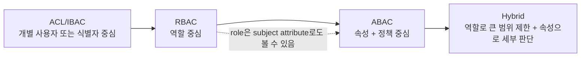
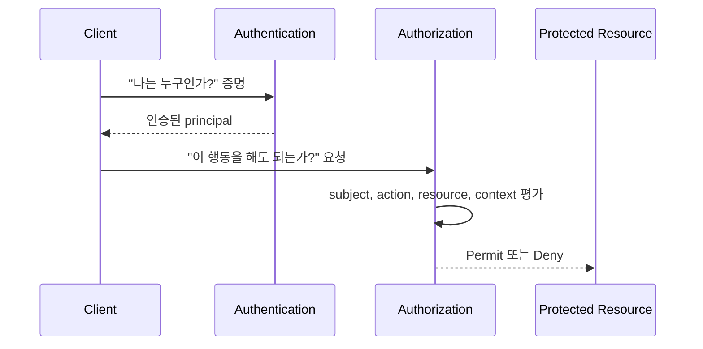
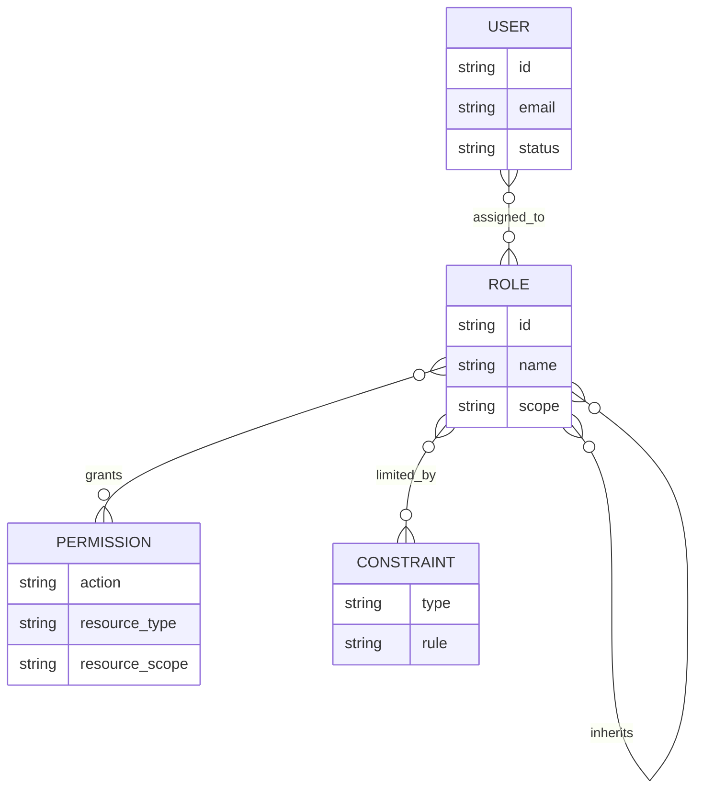
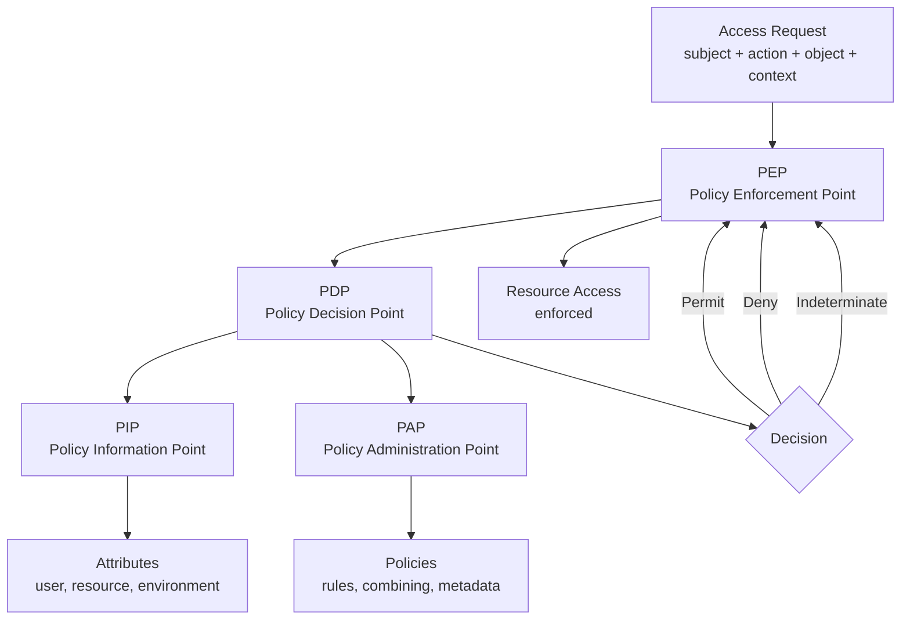
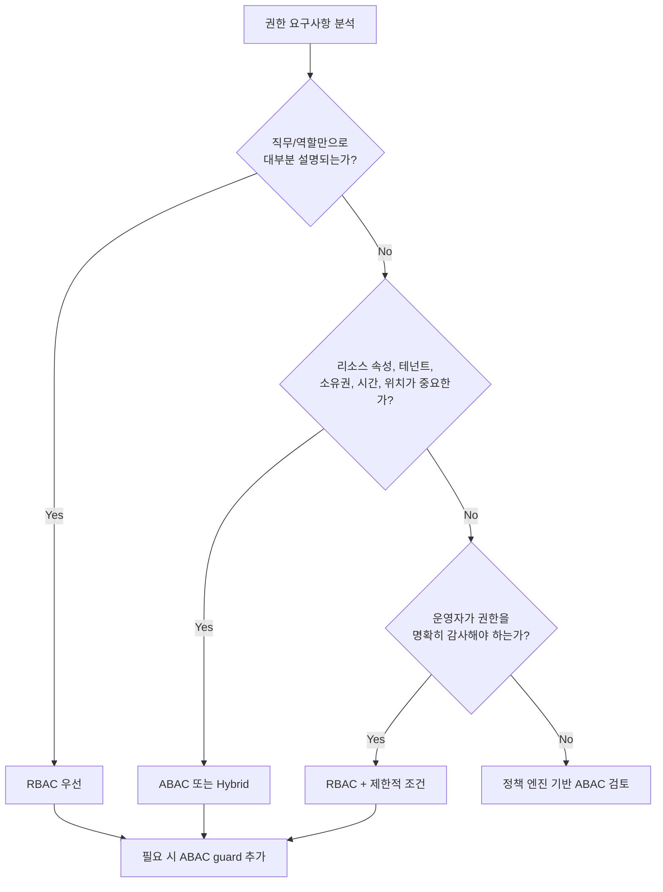
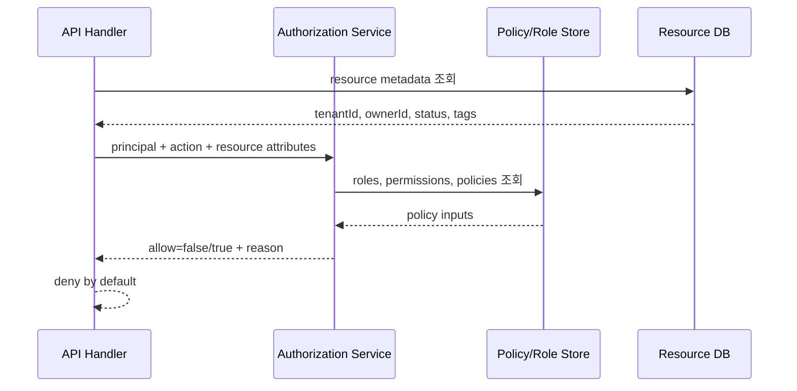
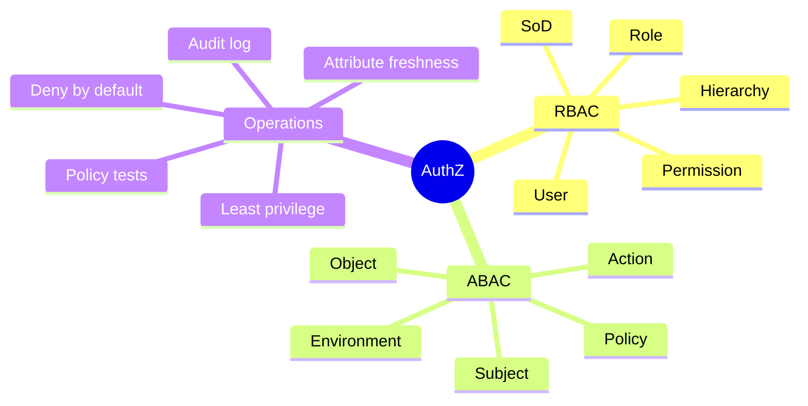

# ABAC와 RBAC 권한 모델

- 검색일: 2026-06-22
- 주제: `ABAC(Attribute-Based Access Control)`와 `RBAC(Role-Based Access Control)` 권한 모델의 개념, 구조, 설계 기준, 구현 예시, 운영 리스크
- 핵심 출처: NIST SP 800-162, NIST RBAC, OASIS XACML, AWS IAM, Kubernetes RBAC, Open Policy Agent, OWASP Authorization Cheat Sheet

## 1. 한 줄 요약



- `RBAC`는 "사용자에게 역할을 부여하고, 역할에 권한을 연결하는 방식"이다.
- `ABAC`는 "사용자, 리소스, 행위, 환경의 속성을 정책에 대입해 매 요청마다 허용/거부를 판단하는 방식"이다.
- NIST 관점에서 RBAC의 `role`은 ABAC에서 평가할 수 있는 주체 속성 중 하나로 볼 수 있다.
- 실무에서는 둘 중 하나만 고르는 경우보다, `RBAC로 기본 권한 범위를 제한하고 ABAC로 테넌트, 소유권, 상태, 시간, 위치, 위험도 같은 조건을 추가`하는 하이브리드가 흔하다.
- 빠른 감각:
  - `RBAC`: "이 사용자가 관리자/매니저/회계 담당자 역할인가?"
  - `ABAC`: "이 사용자의 부서, 프로젝트, 교육 이수 상태, 요청 시간, 리소스 분류, 리소스 소유자, 테넌트가 정책 조건을 만족하는가?"

## 2. 왜 중요한가



- 권한은 `인증(Authentication)` 다음 단계인 `인가/권한 부여(Authorization)` 문제다.
- 인증은 "누구인지" 확인하는 것이고, 인가는 "무엇을 할 수 있는지" 결정하는 것이다.
- 권한 설계가 부실하면 다음 문제가 바로 발생한다.
  - 일반 사용자가 관리자 API를 호출한다.
  - 다른 사용자의 주문, 문서, 결제 정보, 개인정보를 `id`만 바꿔 조회한다.
  - 퇴사자, 부서 이동자, 외주 계정이 이전 권한을 계속 가진다.
  - 테넌트 A 사용자가 테넌트 B 데이터를 읽는다.
  - 화면에서는 버튼이 숨겨졌지만 API는 직접 호출 가능하다.
- OWASP는 접근 제어 실패를 대표적인 웹 애플리케이션 보안 리스크로 다룬다.
- 권한 모델은 단순한 코드 분기 문제가 아니라 다음을 같이 결정한다.
  - 최소 권한 원칙을 어떻게 보장할지
  - 운영자가 권한을 얼마나 쉽게 이해하고 감사할 수 있을지
  - 신규 리소스, 신규 역할, 신규 테넌트가 생길 때 정책 변경 비용이 얼마나 될지
  - 장애나 외부 속성 저장소 오류 시 `fail-open`이 될지 `fail-closed`가 될지

## 3. RBAC 상세 정리



- `RBAC(Role-Based Access Control)`의 기본 구조:
  - `User/Principal`: 사용자, 서비스 계정, 시스템 주체
  - `Role`: 조직 기능이나 책임을 표현하는 권한 묶음
  - `Permission`: 어떤 리소스에 어떤 행위를 할 수 있는지 나타내는 승인
  - `User-Role Assignment`: 사용자에게 역할을 부여
  - `Role-Permission Assignment`: 역할에 권한을 부여
  - `Session/Active Role`: 로그인 세션에서 활성화된 역할 집합
- NIST RBAC 모델의 주요 수준:
  - `Flat RBAC`: 사용자는 여러 역할을 가질 수 있고, 역할은 여러 권한을 가질 수 있다.
  - `Hierarchical RBAC`: 상위 역할이 하위 역할의 권한을 상속한다.
  - `Constrained RBAC`: 업무 분리, 상호 배타 역할 같은 제약을 둔다.
  - `Symmetric RBAC`: 어떤 권한이 어떤 역할에 들어있는지 역방향 조회와 감사를 지원한다.
- RBAC가 잘 맞는 상황:
  - 조직의 직무와 책임이 비교적 안정적이다.
  - 권한이 "직책/직무/부서" 중심으로 설명된다.
  - 운영자가 권한 목록을 쉽게 이해해야 한다.
  - 빠르게 시작해야 하고, 프레임워크나 플랫폼이 RBAC를 기본 지원한다.
- RBAC의 장점:
  - 이해하기 쉽다.
  - 운영 UI를 만들기 쉽다.
  - 권한 검토와 승인 프로세스에 맞추기 쉽다.
  - 감사 로그에서 "이 사용자는 어떤 역할 때문에 허용됐는가"를 설명하기 쉽다.
  - 조직의 업무 분리 원칙을 역할 단위로 적용하기 쉽다.
- RBAC의 약점:
  - 조건이 많아지면 `role explosion`이 발생한다.
  - 예: `cardiology-doctor`, `cardiology-doctor-night-shift`, `cardiology-doctor-hipaa-trained`, `cardiology-doctor-tenant-a`, `cardiology-doctor-tenant-b`처럼 역할이 폭증한다.
  - 리소스 소유권, 테넌트, 프로젝트, 데이터 등급, 시간, 위치 같은 조건을 역할 이름에 억지로 넣게 된다.
  - "관리자" 같은 넓은 역할이 시간이 지나며 과도한 권한을 흡수하기 쉽다.
  - 사용자가 직무를 바꿨는데 이전 역할이 제거되지 않으면 권한 누적이 생긴다.
- RBAC 설계 시 구체 기준:
  - 역할 이름은 직무나 책임으로 짓고, 임시 조건을 이름에 넣지 않는다.
  - `admin` 하나로 모든 것을 처리하지 않는다.
  - 역할은 `global`, `organization`, `tenant`, `project`, `resource` 같은 scope를 가져야 한다.
  - 권한은 가능하면 `resource_type:action` 형태로 쪼갠다.
  - 예: `project:read`, `project:update`, `billing:read`, `billing:refund`, `user:invite`
  - 역할 변경, 승인, 회수, 만료일, 부여 사유를 감사 가능하게 남긴다.
  - 상호 배타 역할을 정의한다.
  - 예: `payment_requester`와 `payment_approver`를 같은 결제 건에서 동시에 행사하지 못하게 한다.

## 4. ABAC 상세 정리



- `ABAC(Attribute-Based Access Control)`의 기본 판단 재료:
  - `Subject attributes`: 사용자/주체 속성
    - 예: `department=cardiology`, `employmentStatus=active`, `clearance=confidential`, `training.hipaa=true`, `tenantId=t1`
  - `Object/Resource attributes`: 보호 대상 속성
    - 예: `resource.type=medical_record`, `ownerDepartment=cardiology`, `classification=restricted`, `tenantId=t1`, `project=star`
  - `Action/Operation`: 수행하려는 행위
    - 예: `read`, `write`, `edit`, `delete`, `approve`, `export`, `share`
  - `Environment/Context attributes`: 요청 순간의 환경
    - 예: `time=business_hours`, `network=corp_vpn`, `location=KR`, `riskScore=low`, `mfa=true`
  - `Policy`: 속성과 조건을 조합해 허용 여부를 결정하는 규칙
- ABAC의 전형적인 컴포넌트:
  - `PEP`: 요청을 가로채고 최종 결정을 강제한다. API 게이트웨이, 미들웨어, 서비스 메서드, 데이터 접근 계층이 될 수 있다.
  - `PDP`: 정책을 평가해 허용/거부 결정을 계산한다. 정책 엔진이나 인가 서비스가 맡는다.
  - `PIP`: PDP가 필요한 속성을 가져오는 출처다. IdP, HR 시스템, 리소스 DB, 태그 저장소, 위험도 엔진 등이 해당된다.
  - `PAP`: 정책을 만들고 관리하고 테스트하는 관리 지점이다.
  - `Context Handler`: 요청, 속성 조회, 캐시, 정책 평가 순서를 조정하는 계층이다.
- ABAC가 잘 맞는 상황:
  - 사용자의 역할만으로는 권한을 설명하기 어렵다.
  - 리소스마다 소유자, 테넌트, 프로젝트, 데이터 등급이 중요하다.
  - 요청 시간, 위치, MFA, 디바이스 상태, 위험도 같은 동적 조건이 필요하다.
  - 외부 조직, 파트너, 임시 사용자에게 사전 등록 없이 속성 기반으로 접근을 허용해야 한다.
  - 클라우드 리소스처럼 태그 기반으로 계속 늘어나는 리소스를 다뤄야 한다.
- ABAC의 장점:
  - 매우 세밀한 권한 판단이 가능하다.
  - 신규 리소스가 생겨도 올바른 속성만 붙으면 기존 정책이 그대로 적용된다.
  - `role explosion`을 줄일 수 있다.
  - 여러 조직이나 시스템 사이에서 공통 속성 정의를 맞추면 확장성이 좋아진다.
  - 실시간 맥락에 따라 접근을 허용하거나 거부할 수 있다.
- ABAC의 약점:
  - 속성 품질이 낮으면 정책 품질도 무너진다.
  - 어떤 사용자가 어떤 리소스에 접근 가능한지 사전에 열거하기 어렵다.
  - 정책이 복잡해질수록 테스트, 디버깅, 감사가 어려워진다.
  - PIP 장애, 속성 캐시 만료, 속성 최신성, 속성 위조 방지 같은 운영 문제가 중요해진다.
  - 정책 충돌 시 우선순위와 결합 규칙을 명확히 정하지 않으면 예외가 많아진다.
- ABAC 속성 관리에서 특히 중요한 항목:
  - `attribute authority`: 이 속성은 누가 발급하고 신뢰하는가
  - `freshness`: 이 속성은 얼마나 최신인가
  - `assurance`: 이 속성의 정확도를 어느 정도 믿을 수 있는가
  - `binding`: 이 속성이 해당 사용자나 리소스에 안전하게 연결되어 있는가
  - `revocation`: 속성이 바뀌었을 때 캐시와 토큰에 남은 이전 값은 언제 사라지는가

## 5. RBAC와 ABAC 비교 및 선택 기준



| 기준 | RBAC | ABAC |
| --- | --- | --- |
| 판단 중심 | 역할 | 속성 + 정책 |
| 대표 질문 | "이 사용자가 이 역할인가?" | "이 요청의 속성 조합이 정책을 만족하는가?" |
| 세밀도 | 중간 | 높음 |
| 운영 난이도 | 낮음에서 중간 | 중간에서 높음 |
| 감사 용이성 | 좋음 | 정책/속성 도구가 없으면 어려움 |
| 정책 변경 비용 | 역할/권한 매핑 변경 | 정책 또는 속성 변경 |
| 신규 리소스 확장 | 역할 정책 수정이 필요할 수 있음 | 속성/태그가 맞으면 자동 적용 가능 |
| 동적 조건 | 약함 | 강함 |
| 대표 리스크 | role explosion, privilege creep | policy sprawl, stale attributes, 설명 가능성 저하 |

- RBAC를 먼저 고려할 상황:
  - 사내 어드민, 백오피스, CMS처럼 직무 기반 권한이 대부분이다.
  - 권한 매트릭스를 엑셀이나 관리 화면으로 명확히 검토해야 한다.
  - "매니저는 승인, 멤버는 작성, 뷰어는 조회"처럼 역할과 행위가 안정적이다.
- ABAC를 먼저 고려할 상황:
  - 멀티테넌트 SaaS에서 `tenantId`가 모든 권한 판단에 들어간다.
  - 사용자의 프로젝트 배정과 리소스의 프로젝트 태그가 일치해야 한다.
  - 데이터 등급, 보안 교육, MFA, 위치, 요청 시간, 위험도 점수 조건이 필요하다.
  - 클라우드 리소스처럼 리소스 수가 계속 늘어나고 태그로 통제하는 편이 자연스럽다.
- 하이브리드가 실용적인 상황:
  - `role=project_editor`인 사용자만 쓰기 후보가 된다.
  - 그다음 `user.tenantId == resource.tenantId`, `user.projectIds contains resource.projectId`, `resource.status != archived` 같은 ABAC 조건을 추가한다.
  - 즉, `RBAC는 coarse-grained gate`, `ABAC는 fine-grained guard`로 둔다.
- 선택 기준을 한 문장으로 정리하면:
  - 역할 목록이 자연스럽고 적으면 RBAC.
  - 조건 조합이 많고 리소스별 맥락이 중요하면 ABAC.
  - 둘 다 중요하면 RBAC로 기본 의미를 만들고 ABAC로 경계를 좁힌다.

## 6. 구현 패턴과 설계 예시



- 공통 원칙:
  - 기본값은 `deny`로 둔다.
  - 권한 검사는 서버에서 매 요청마다 수행한다.
  - 프론트엔드 버튼 숨김은 UX일 뿐 보안 통제가 아니다.
  - 권한 판단은 한 곳에서 재사용 가능한 함수, 미들웨어, 정책 엔진, 인가 서비스로 모은다.
  - "이 역할이면 통과"가 아니라 "이 주체가 이 리소스에 이 행위를 할 수 있는가" 형태의 API를 만든다.
  - 로그에는 최소한 `principal`, `action`, `resource`, `decision`, `reason`, `policy version`을 남긴다.

### RBAC 스키마 예시

```sql
users(id, email, status)
roles(id, name, scope_type, scope_id)
permissions(id, resource_type, action)
user_roles(user_id, role_id, granted_by, granted_at, expires_at)
role_permissions(role_id, permission_id)
```

- 예시 역할:
  - `org_owner`: 조직 설정, 결제, 멤버 관리 가능
  - `project_admin`: 특정 프로젝트 설정과 멤버 관리 가능
  - `project_editor`: 특정 프로젝트 콘텐츠 생성/수정 가능
  - `project_viewer`: 특정 프로젝트 조회 가능
- 주의:
  - `role.name = admin` 하나만 두면 시간이 지날수록 모든 예외가 admin으로 몰린다.
  - `scope_type`, `scope_id`가 없으면 멀티테넌트나 프로젝트 단위 권한에서 쉽게 깨진다.
  - `expires_at` 없이 임시 권한을 주면 장기 권한으로 굳어질 가능성이 높다.

### ABAC 정책 예시

```text
allow if
  subject.status == "active"
  and subject.tenantId == resource.tenantId
  and action in ["read", "update"]
  and resource.projectId in subject.projectIds
  and resource.classification <= subject.clearance
  and environment.mfa == true
  and environment.riskScore != "high"
```

- 이 정책은 역할보다 훨씬 많은 조건을 직접 표현한다.
- 역할을 완전히 버릴 필요는 없다.
- 예를 들어 `subject.roles contains "project_editor"` 조건을 ABAC 정책 안의 하나의 속성 조건으로 넣을 수 있다.

### AWS IAM식 ABAC 감각

- AWS IAM 문서에서는 ABAC를 태그 기반 권한 전략으로 설명한다.
- 예를 들어 principal과 resource가 모두 `access-project=Star` 태그를 가지면 접근을 허용하는 식이다.
- 이 방식의 장점은 신규 리소스가 생겨도 태그가 정확하면 기존 정책을 재사용할 수 있다는 점이다.
- 단점은 태그 누락, 태그 오타, 태그 변경 권한 통제가 곧 보안 문제가 된다는 점이다.

### Kubernetes RBAC 감각

- Kubernetes RBAC는 `Role/ClusterRole`과 `RoleBinding/ClusterRoleBinding`으로 권한을 연결한다.
- `RoleBinding`은 특정 namespace 범위에 권한을 부여한다.
- `ClusterRoleBinding`은 cluster 전체 범위에 권한을 부여할 수 있어 훨씬 조심해야 한다.
- Kubernetes의 사례는 RBAC에서 `scope`가 얼마나 중요한지 보여준다.

## 7. 실무 예시, edge case, 용어 요약



### 예시 1: 병원 진료 기록

- RBAC만 쓰면:
  - `doctor` 역할은 의료 기록 조회 가능
  - `nurse` 역할은 일부 의료 기록 조회 가능
  - `billing_staff` 역할은 청구 관련 항목 조회 가능
- ABAC를 추가하면:
  - `subject.department == resource.patientDepartment`
  - `subject.training.hipaa == true`
  - `subject.assignedPatients contains resource.patientId`
  - `environment.purpose == treatment`
  - `environment.network == hospital_network`
- 결론:
  - "의사인가?"만으로는 부족하다.
  - "담당 환자인가, 필요한 교육을 받았는가, 진료 목적 요청인가"까지 봐야 한다.

### 예시 2: 멀티테넌트 SaaS 프로젝트 관리

- 기본 RBAC:
  - `owner`, `admin`, `editor`, `viewer`
- 필요한 ABAC 조건:
  - `subject.tenantId == resource.tenantId`
  - `resource.projectId in subject.projectIds`
  - `resource.archived == false`
  - `action == delete`일 때는 `subject.roles contains owner`
- 흔한 버그:
  - 사용자가 `projectId`를 URL에서 바꿨는데 서버가 `tenantId`와 멤버십을 다시 확인하지 않는다.
  - 전역 `admin` 역할이 모든 테넌트를 통과한다.
  - 초대받은 게스트가 조직의 다른 프로젝트까지 조회한다.

### 예시 3: 결제 승인

- RBAC:
  - `payment_requester`: 지급 요청 생성 가능
  - `payment_approver`: 지급 승인 가능
- ABAC 또는 제약 조건:
  - 요청자와 승인자가 같으면 거부
  - 금액이 일정 기준 이상이면 2명 이상 승인 필요
  - 승인자는 같은 조직과 비용 센터에 속해야 함
  - 휴가, 퇴사, 잠금 상태 계정은 승인 불가
- 핵심:
  - 이 경우는 `Constrained RBAC`의 업무 분리와 ABAC의 요청 속성 평가가 함께 필요하다.

### 자주 터지는 edge case

- `role explosion`
  - 역할 이름에 부서, 지역, 시간, 리소스 상태를 계속 붙여 역할 수가 폭증한다.
- `privilege creep`
  - 부서 이동, 프로젝트 종료, 외주 계약 종료 후에도 과거 권한이 남는다.
- `stale attribute`
  - HR 시스템에서는 퇴사 처리됐는데 토큰이나 캐시에 `status=active`가 남아 있다.
- `attribute spoofing`
  - 클라이언트가 보낸 `tenantId`, `role`, `department`를 서버가 그대로 믿는다.
- `fail-open`
  - 정책 엔진이나 속성 저장소가 장애일 때 기본 허용으로 동작한다.
- `policy conflict`
  - 한 정책은 허용, 다른 정책은 거부할 때 우선순위가 불명확하다.
- `hidden authorization`
  - 서비스 곳곳에 `if user.role == "admin"` 같은 분기가 흩어져 전체 권한 지도를 파악할 수 없다.

### 빠른 용어 요약

- `Principal`: 권한 판단의 주체. 사용자, 서비스 계정, 워크로드가 될 수 있다.
- `Subject`: 접근을 요청하는 주체. ABAC 문맥에서 자주 쓰인다.
- `Object/Resource`: 보호 대상. 파일, API, DB row, 프로젝트, 클라우드 리소스 등이 해당된다.
- `Action/Operation`: read, write, delete, approve, export 같은 행위.
- `Permission`: 특정 리소스나 리소스 유형에 대해 특정 행위를 할 수 있는 승인.
- `Role`: 권한을 묶은 직무/책임 단위.
- `Policy`: 허용/거부를 결정하는 규칙.
- `PEP`: 결정을 집행하는 지점.
- `PDP`: 결정을 계산하는 지점.
- `PIP`: 결정에 필요한 속성을 제공하는 지점.
- `PAP`: 정책을 작성, 관리, 테스트하는 지점.
- `Least Privilege`: 필요한 최소 권한만 부여하는 원칙.
- `Deny by Default`: 명시적으로 허용되지 않으면 거부하는 원칙.

## 참고 링크

- [NIST SP 800-162, Guide to Attribute Based Access Control](https://csrc.nist.gov/pubs/sp/800/162/upd2/final)
- [NIST SP 800-162 PDF](https://nvlpubs.nist.gov/nistpubs/specialpublications/nist.sp.800-162.pdf)
- [NIST Role-Based Access Control Project](https://csrc.nist.gov/projects/role-based-access-control)
- [NIST Glossary: Role-Based Access Control](https://csrc.nist.gov/glossary/term/role_based_access_control)
- [The NIST Model for Role-Based Access Control: Towards a Unified Standard](https://tsapps.nist.gov/publication/get_pdf.cfm?pub_id=916402)
- [OASIS XACML FAQ](https://www.oasis-open.org/committees/xacml/faq.php)
- [AWS IAM: Define permissions based on attributes with ABAC authorization](https://docs.aws.amazon.com/IAM/latest/UserGuide/introduction_attribute-based-access-control.html)
- [Kubernetes: Using RBAC Authorization](https://kubernetes.io/docs/reference/access-authn-authz/rbac/)
- [Open Policy Agent: Access Control Systems](https://www.openpolicyagent.org/docs/comparisons/access-control-systems)
- [OWASP Authorization Cheat Sheet](https://cheatsheetseries.owasp.org/cheatsheets/Authorization_Cheat_Sheet.html)
- [OWASP Top 10 2021: Broken Access Control](https://owasp.org/Top10/2021/A01_2021-Broken_Access_Control/)
