# ACP

- 작성일: 2026-06-29
- 범위: Agent Client Protocol, Agent Communication Protocol, MCP, A2A와의 관계
- 주의: 이 노트는 AI 에이전트 프로토콜 문맥의 `ACP`를 다룬다. 보안, 건축자재, 결제, 의료 등 다른 분야의 ACP 약어는 별도 확인이 필요하다.

## 1. 한 줄 요약

- AI 에이전트 문맥에서 `ACP`는 보통 두 가지를 가리킨다.
- `Agent Client Protocol`은 IDE, 에디터, 앱 같은 클라이언트가 코딩 에이전트를 붙일 때 쓰는 표준 프로토콜이다.
- `Agent Communication Protocol`은 에이전트, 애플리케이션, 사람 사이의 상호운용을 목표로 한 프로토콜이며, 현재는 Linux Foundation의 `A2A` 흐름과 함께 보는 것이 안전하다.

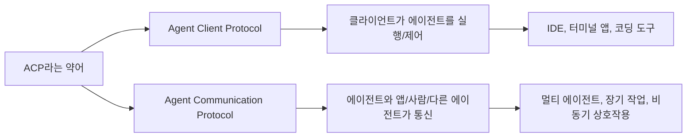

## 2. 왜 중요한가

- AI 에이전트 생태계는 모델, IDE, CLI, 툴, 외부 서비스가 빠르게 늘어나고 있다.
- 각 도구가 자체 방식으로만 에이전트를 붙이면, 같은 에이전트를 여러 클라이언트에서 재사용하기 어렵다.
- ACP 계열 프로토콜은 "에이전트를 어떻게 연결할 것인가"를 표준화해 통합 비용을 줄이려는 시도다.
- 단, `ACP`라는 약어가 하나의 표준만 뜻하지 않기 때문에 문맥을 먼저 확인해야 한다.

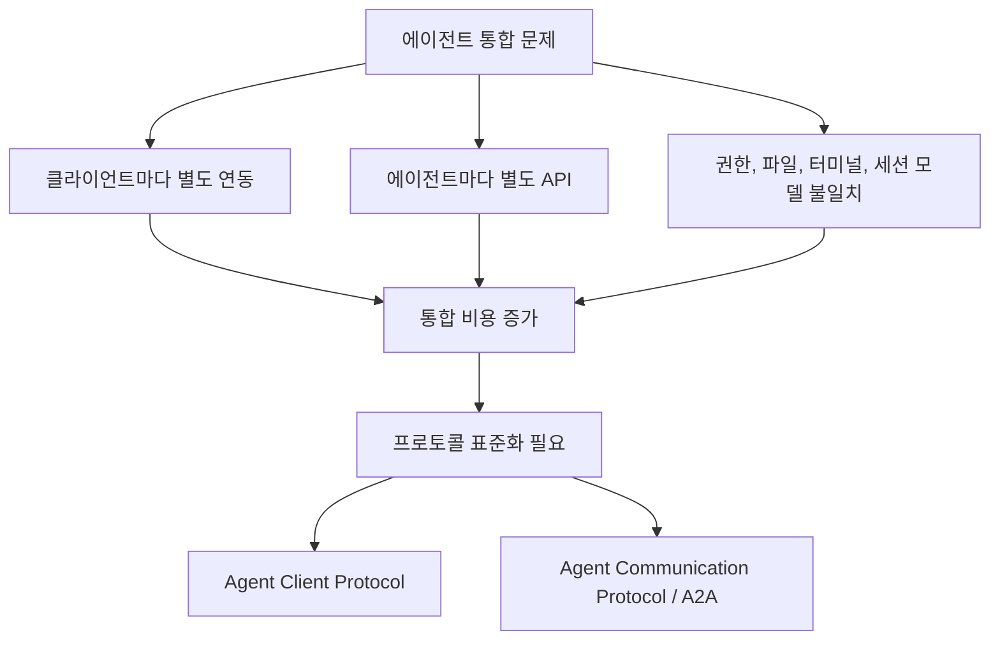

## 3. 핵심 개념

### Agent Client Protocol

- 목적: 클라이언트와 에이전트 사이의 연결 방식을 표준화한다.
- 대표 문맥: IDE나 개발자 도구가 Claude Code, Gemini CLI, 커스텀 코딩 에이전트 같은 백엔드 에이전트를 붙이는 경우.
- 구조: Language Server Protocol처럼 클라이언트가 에이전트 프로세스를 실행하고, 표준 메시지로 세션과 요청을 주고받는 모델에 가깝다.
- 전송: 현재 중심은 JSON-RPC 2.0이며, 로컬 프로세스는 stdio 기반 흐름이 핵심이다.
- 특징: 세션 생성, 프롬프트 전송, 세션 업데이트, 권한 요청, 파일 읽기/쓰기, 터미널 작업 같은 코딩 에이전트용 기능을 다룬다.

### Agent Communication Protocol

- 목적: 에이전트, 애플리케이션, 사람 사이의 상호운용 가능한 통신을 제공한다.
- 대표 문맥: 여러 에이전트가 작업을 주고받거나, 앱이 에이전트와 장기 작업을 비동기로 진행하는 경우.
- 구조: RESTful API와 메시지 중심 모델을 통해 동기/비동기 실행, 스트리밍, 상태 있는 작업과 상태 없는 작업을 다룬다.
- 현재성: 공식 GitHub 저장소는 2025-08-27에 archive 상태가 되었고, ACP가 Linux Foundation의 A2A 프로젝트 일부가 되었음을 안내한다. 따라서 새 설계에서는 A2A를 우선 검토하는 것이 안전하다.

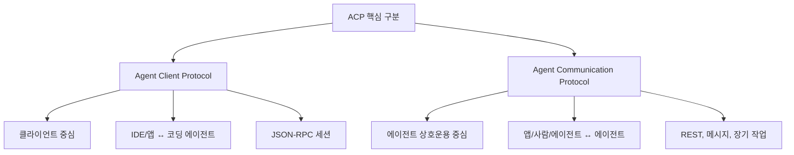

### 비교 표

| 구분 | Agent Client Protocol | Agent Communication Protocol |
| --- | --- | --- |
| 초점 | 클라이언트가 에이전트를 붙이는 방법 | 에이전트와 앱/사람/다른 에이전트의 상호작용 |
| 주 사용처 | IDE, 코드 편집기, 로컬 개발 도구 | 멀티 에이전트 시스템, 장기 작업, 비동기 워크플로 |
| 통신 스타일 | JSON-RPC 기반 세션 | RESTful API, 메시지, 스트리밍 |
| 비유 | LSP의 에이전트 버전 | 에이전트 간 업무 교환 API |
| 현재 볼 점 | Zed, JetBrains, 에이전트 구현체 | A2A로의 이동과 호환성 |

## 4. 아키텍처와 흐름

### Agent Client Protocol 흐름

- 사용자는 IDE나 앱에서 에이전트 기능을 호출한다.
- 클라이언트는 ACP 에이전트 프로세스를 시작하거나 연결한다.
- 클라이언트와 에이전트는 초기화와 capability 협상을 한다.
- 사용자의 prompt가 세션으로 전달되고, 에이전트는 파일 변경, 터미널 실행, 권한 요청, 진행 상태 업데이트를 표준 메시지로 돌려준다.

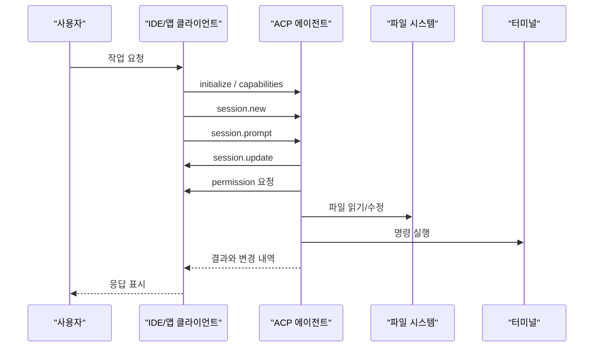

### Agent Communication Protocol 흐름

- 클라이언트나 다른 에이전트가 작업 메시지를 보낸다.
- 수신 에이전트는 작업을 동기적으로 처리하거나 장기 작업으로 등록한다.
- 필요하면 스트리밍으로 중간 결과를 전달하고, 최종 상태를 반환한다.
- 이 흐름은 현재 A2A와 함께 비교하거나 마이그레이션 대상으로 보는 것이 좋다.

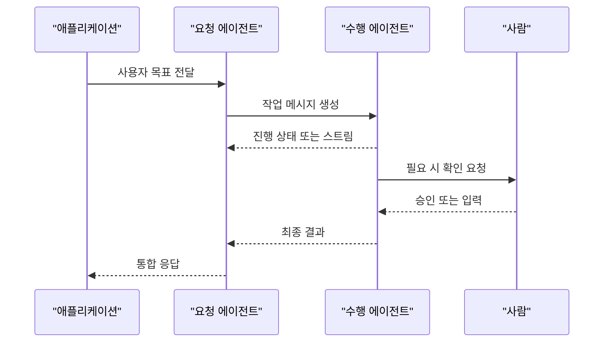

## 5. MCP, A2A와의 차이

- `MCP`는 에이전트가 외부 도구, 데이터, 컨텍스트에 접근하는 표준에 가깝다.
- `Agent Client Protocol`은 클라이언트가 에이전트를 실행하고 대화하는 표준에 가깝다.
- `A2A`는 에이전트끼리 작업을 주고받고 협업하는 표준 흐름에 가깝다.
- `Agent Communication Protocol`은 A2A와 겹치는 영역이 많고, 공식 저장소 기준으로 A2A 쪽으로 이동하는 흐름을 확인해야 한다.

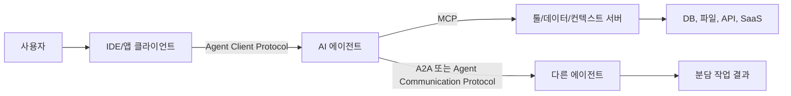

### 선택 기준

| 하고 싶은 일 | 먼저 볼 표준 |
| --- | --- |
| 에디터나 앱에 코딩 에이전트를 붙이기 | Agent Client Protocol |
| 에이전트가 외부 도구와 데이터를 쓰게 하기 | MCP |
| 에이전트끼리 작업을 위임하고 결과를 주고받기 | A2A |
| 기존 BeeAI/ACP 기반 통신을 유지보수하기 | Agent Communication Protocol 문서와 A2A 마이그레이션 |

## 6. 실무 예시

### 예시 1: IDE에 코딩 에이전트 붙이기

- 목표: 특정 IDE에서 여러 코딩 에이전트를 교체 가능하게 붙인다.
- 선택: Agent Client Protocol.
- 이유: 클라이언트와 에이전트 사이의 세션, 메시지, 권한 요청, 파일/터미널 상호작용을 표준화하기 때문이다.

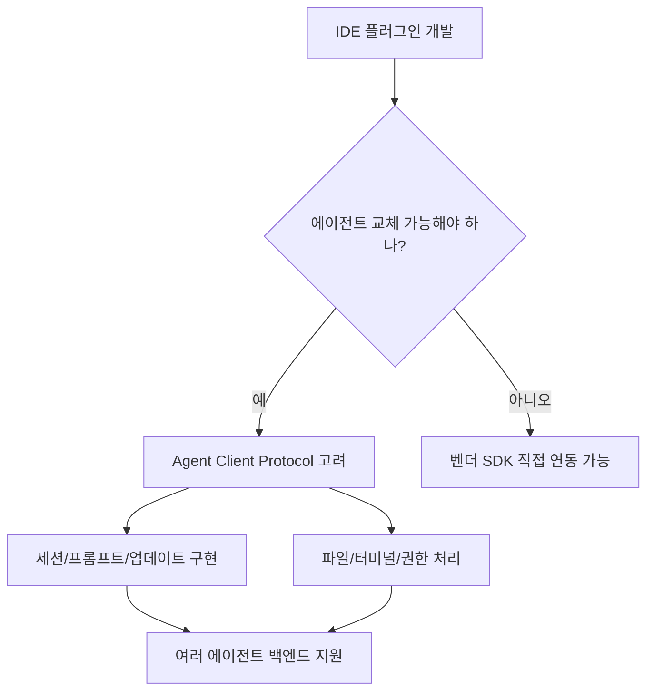

### 예시 2: 에이전트가 사내 API를 호출하게 하기

- 목표: 코딩 에이전트가 Jira, GitHub, DB, 사내 API를 안전하게 호출한다.
- 선택: ACP보다 MCP를 먼저 검토한다.
- 이유: 이 문제는 "클라이언트와 에이전트 연결"이 아니라 "에이전트와 도구 연결" 문제이기 때문이다.

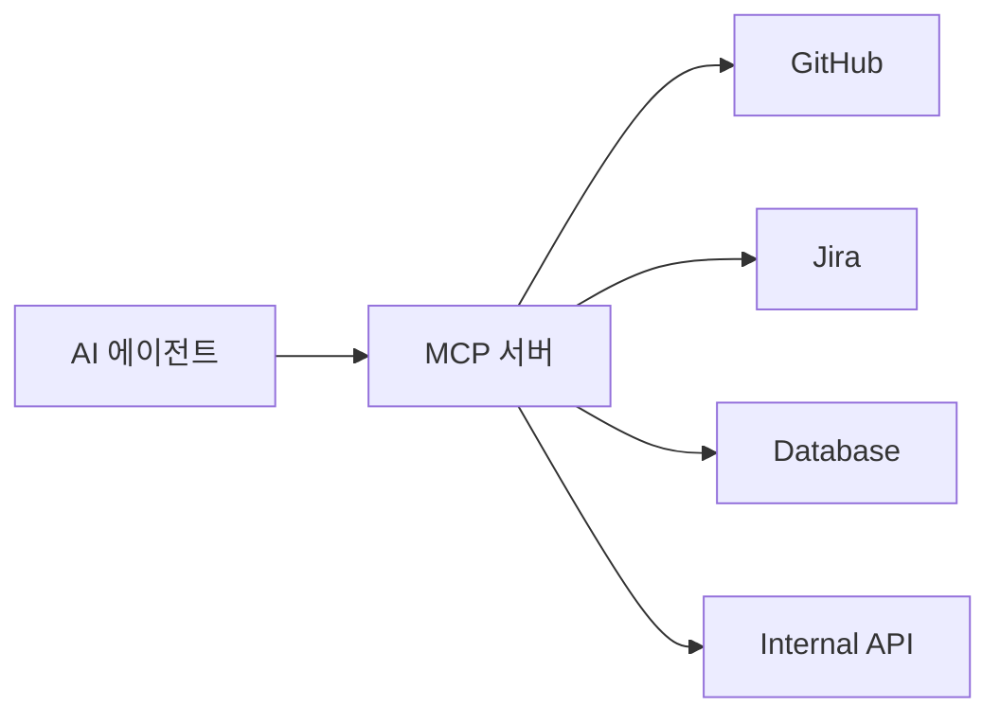

### 예시 3: 여러 에이전트가 업무를 나눠 처리하기

- 목표: 리서치 에이전트, 코드 에이전트, 리뷰 에이전트가 장기 작업을 분담한다.
- 선택: A2A를 우선 검토하고, 기존 ACP 구현이 있다면 마이그레이션 여부를 확인한다.
- 이유: 이 문제는 "클라이언트가 에이전트를 제어"하는 것보다 "에이전트끼리 작업을 교환"하는 성격이 강하다.

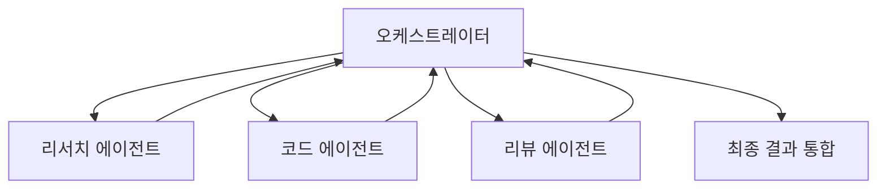

## 7. 용어 정리와 빠른 복습

- `ACP`: 문맥 의존 약어다. AI 에이전트에서는 최소한 두 의미가 있다.
- `Agent Client Protocol`: 클라이언트와 에이전트 사이의 표준 통신 프로토콜이다.
- `Agent Communication Protocol`: 에이전트, 앱, 사람 사이의 상호운용을 목표로 한 프로토콜이다.
- `MCP`: 에이전트와 도구/데이터/컨텍스트 사이의 표준 연결 방식이다.
- `A2A`: 에이전트와 에이전트 사이의 작업 교환과 협업을 위한 프로토콜 흐름이다.
- `JSON-RPC`: 메서드 호출, 응답, notification을 JSON으로 표현하는 RPC 방식이다.

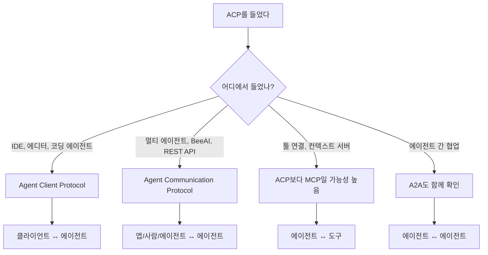

### 빠른 결론

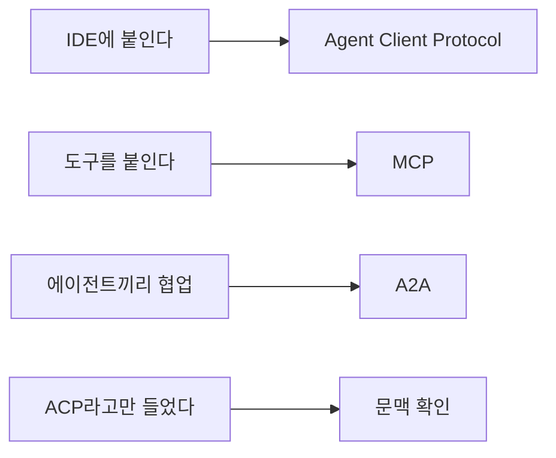

- `ACP`가 코딩 도구나 IDE 문맥이면 `Agent Client Protocol`일 가능성이 높다.
- `ACP`가 BeeAI, 멀티 에이전트, REST API 문맥이면 `Agent Communication Protocol`일 가능성이 높다.
- 새 시스템을 설계한다면 `MCP`, `Agent Client Protocol`, `A2A`의 역할을 분리해서 보는 것이 안전하다.

## 8. 참고 링크

- [Agent Client Protocol - Introduction](https://agentclientprotocol.com/get-started/introduction)
- [Agent Client Protocol - GitHub](https://github.com/agentclientprotocol/agent-client-protocol)
- [Zed Blog - Bring Your Own Agent to Zed](https://zed.dev/blog/bring-your-own-agent-to-zed)
- [JetBrains Blog - JetBrains × Zed: Open Interoperability for AI Coding Agents in Your IDE](https://blog.jetbrains.com/ai/2025/10/jetbrains-zed-open-interoperability-for-ai-coding-agents-in-your-ide/)
- [Agent Communication Protocol - Welcome](https://agentcommunicationprotocol.dev/introduction/welcome)
- [Agent Communication Protocol - Architecture](https://agentcommunicationprotocol.dev/core-concepts/architecture)
- [Agent Communication Protocol - MCP and A2A](https://agentcommunicationprotocol.dev/about/mcp-and-a2a)
- [Agent Communication Protocol - GitHub](https://github.com/i-am-bee/acp)
- [A2A Protocol](https://a2a-protocol.org/latest/)
