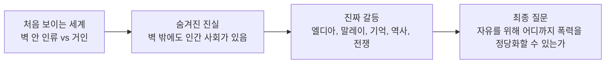
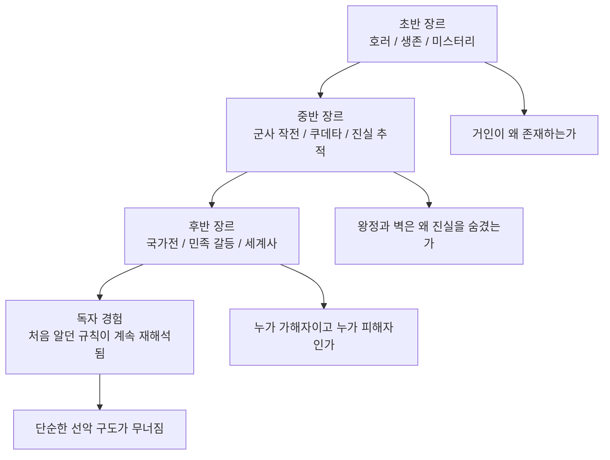
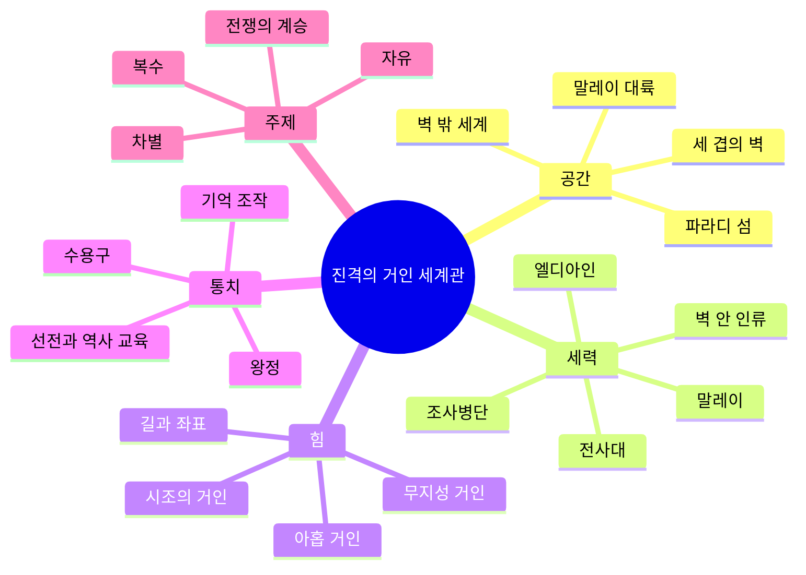
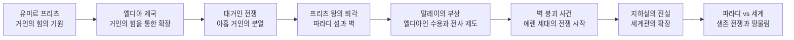
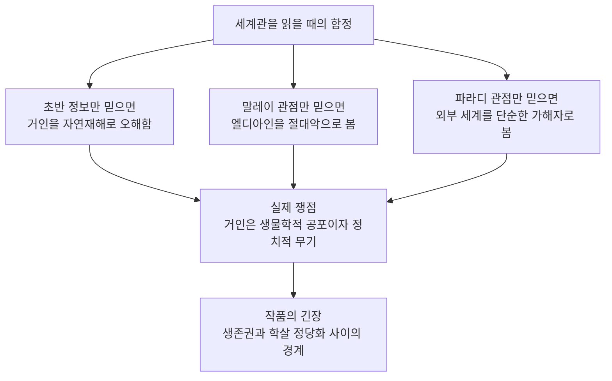
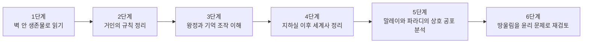
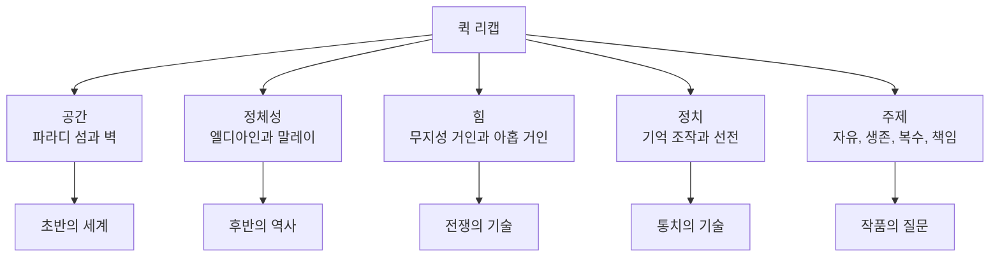

# 진격의 거인 세계관 정리

작성 기준일: 2026-06-26  
스포일러 범위: 완결까지의 핵심 세계관 반전과 설정을 포함한다.

주요 참고:

- Kodansha, `Attack on Titan` 시리즈 소개
- Kodansha, `Attack on Titan Guidebook: INSIDE & OUTSIDE`
- Kodansha, `Attack on Titan Character Encyclopedia`
- TV 애니메이션 공식 사이트, `Keyword`
- Wikipedia, `Attack on Titan`

---

## 1. 한 줄 요약

`진격의 거인` 세계관은 처음에는 "거인에게 포위된 인류의 생존물"처럼 보이지만, 실제로는 거인의 힘을 둘러싼 민족사, 제국주의, 기억 조작, 군사 기술, 복수의 악순환을 다루는 정치적 판타지다.

핵심은 다음 한 문장으로 정리할 수 있다.

- 벽은 피난처이면서 감옥이다.
- 거인은 괴물이면서 무기다.
- 역사는 진실이면서 통치 도구다.
- 자유는 목표이면서 폭력의 명분이 될 수 있다.

---

## 2. 왜 이 세계관이 중요한가

`진격의 거인`을 학습할 때 중요한 이유는 단순히 설정이 많아서가 아니다.

- 초반에는 `공간적 미스터리`가 중심이다.
  - 벽 밖은 어떤 곳인가?
  - 거인은 어디서 오는가?
  - 벽 안의 인류가 정말 마지막 인류인가?
- 중반에는 `권력 구조의 미스터리`가 중심이다.
  - 왕정은 왜 정보를 통제하는가?
  - 조사병단은 왜 금기된 외부 세계를 보려 하는가?
  - 기억은 왜 정치적으로 중요해지는가?
- 후반에는 `역사 해석의 충돌`이 중심이다.
  - 엘디아인은 악마인가, 피해자인가?
  - 말레이는 피해국인가, 새로운 제국인가?
  - 파라디 섬은 생존을 위해 어디까지 할 수 있는가?

이 작품의 세계관은 정보를 순서대로 공개하면서 독자의 윤리 판단을 흔든다. 같은 사건도 어느 시점의 정보를 알고 있느냐에 따라 완전히 다르게 보인다.

---

## 3. 핵심 개념

### 3.1 벽과 파라디 섬

- 초반 배경은 거대한 세 겹의 벽 안 사회다.
- 벽은 바깥 거인으로부터 사람들을 보호하는 방어 시설처럼 보인다.
- 후반에 밝혀지는 관점에서는 벽이 단순한 방어 시설이 아니라, 왕정의 고립 정책과 거대 군사 억지력을 함께 품은 장치다.
- 파라디 섬은 벽 안 인류의 생활권이자, 외부 세계가 두려워하고 증오하는 상징적 장소다.

### 3.2 거인

- `무지성 거인`은 인간을 잡아먹는 본능적 괴물처럼 나타난다.
- 그러나 거인의 정체는 단순한 외계 생물이나 자연재해가 아니라, 특정 민족과 거인의 힘이 연결된 결과다.
- `아홉 거인`은 지성을 가진 계승형 거인들이다.
  - 시조의 거인
  - 진격의 거인
  - 초대형 거인
  - 갑옷 거인
  - 여성형 거인
  - 짐승 거인
  - 턱 거인
  - 차력 거인
  - 전퇴의 거인

### 3.3 엘디아와 말레이

- 엘디아는 거인의 힘과 깊게 연결된 역사적 집단이다.
- 말레이는 과거 엘디아 제국의 지배를 받았고, 이후 엘디아인을 억압하고 거인의 힘을 군사 자산으로 활용하는 국가다.
- 이 구조 때문에 작품의 갈등은 `괴물 대 인간`에서 `인간 사회 내부의 역사 전쟁`으로 바뀐다.

### 3.4 길, 좌표, 기억

- `길`은 엘디아인과 거인의 힘을 연결하는 초월적 네트워크처럼 작동한다.
- `좌표`는 시조의 거인 권능과 관련된 중심 개념이다.
- 기억은 개인의 내면이 아니라 정치적 통제 수단이 된다.
  - 왕정은 기억을 지워 질서를 유지한다.
  - 계승자는 과거 계승자의 기억을 일부 이어받는다.
  - 역사는 누가 기억을 관리하느냐에 따라 통치 논리가 된다.

---

## 4. 세계 구조와 역사 흐름

### 4.1 초반에 보이는 지도

초반 지도는 매우 단순하다.

- 안쪽: 인간이 사는 벽 안
- 바깥쪽: 거인이 돌아다니는 죽음의 영역
- 목표: 벽 밖을 탐사하고 인류의 생존권을 넓히는 것

이때 독자가 믿는 전제는 다음과 같다.

- 인류는 거의 멸망했다.
- 벽 안 사람들이 마지막 생존자에 가깝다.
- 거인은 외부에서 온 정체불명의 재앙이다.

### 4.2 후반에 드러나는 실제 지도

후반의 지도는 완전히 다르다.

- 벽 밖에는 국가, 군대, 기술, 외교, 식민 통치가 존재한다.
- 파라디 섬은 세계 전체가 두려워하는 엘디아인의 거점이다.
- 말레이는 엘디아인을 차별하면서도 전쟁에는 엘디아인의 거인 능력을 사용한다.
- 벽 안 사람들은 무지해서 순수한 피해자인 동시에, 세계사 안에서는 과거 제국의 후예로 낙인찍힌 존재다.

### 4.3 역사 흐름의 핵심

- 유미르 프리츠가 거인의 힘과 연결되면서 엘디아의 신화와 역사적 권력이 시작된다.
- 엘디아 제국은 거인의 힘으로 세계에 막대한 영향을 끼친다.
- 대거인 전쟁 이후 엘디아 권력은 붕괴하고, 프리츠 왕은 파라디 섬으로 물러난다.
- 파라디에는 거대한 벽이 세워지고, 벽 안 주민 다수는 외부 세계와 과거사를 잊는다.
- 말레이는 엘디아인을 억압하지만, 동시에 아홉 거인의 일부를 전쟁 무기로 운용한다.
- 에렌 세대의 이야기는 이 닫힌 세계가 다시 세계사와 충돌하는 과정이다.

---

## 5. 중요한 디테일, 함정, 트레이드오프

### 5.1 벽은 보호 장치이자 협박 장치다

- 초반의 벽은 단순히 거인을 막는 성벽처럼 보인다.
- 하지만 벽 자체에는 초대형급 거인들이 잠들어 있다는 설정이 붙는다.
- 따라서 벽은 세 가지 기능을 동시에 가진다.
  - 주민에게는 피난처
  - 왕정에게는 고립 통치 장치
  - 외부 세계에는 대량파괴 억지력

### 5.2 거인은 공포물이 아니라 군사 기술이다

- 초반 거인은 예측 불가능한 괴물처럼 보인다.
- 후반의 관점에서는 거인은 국가가 운용하는 전략 자산이 된다.
- 말레이는 엘디아인을 차별하면서도 전쟁에는 엘디아인 전사를 동원한다.
- 하지만 기술 발전이 진행되면서 거인의 군사적 우위도 흔들린다.
  - 대포, 장갑열차, 비행선, 현대식 함대가 등장한다.
  - 거인의 힘은 압도적이지만 영원한 우위는 아니다.

### 5.3 아홉 거인은 권능이 아니라 계승 비용이 있는 무기다

- 아홉 거인은 각각 고유 능력을 가진다.
- 계승자는 힘을 얻는 대신 수명과 기억의 문제를 떠안는다.
- 힘은 개인의 자유를 넓히는 것처럼 보이지만, 실제로는 국가, 혈통, 전쟁 계획에 묶이기 쉽다.
- 특히 시조의 거인은 단독으로 모든 문제를 해결하는 만능 권능이 아니라, 왕가 혈통과 사상적 제약이 얽힌 정치적 핵심 자산이다.

### 5.4 역사 교육은 무기가 된다

- 말레이의 엘디아인 교육은 죄책감과 충성심을 생산한다.
- 파라디 왕정의 기억 조작은 무지와 안정감을 생산한다.
- 양쪽 모두 "사람들이 무엇을 기억하는가"를 통치의 기반으로 삼는다.

### 5.5 작품의 핵심 트레이드오프

| 선택지 | 장점처럼 보이는 점 | 치르는 비용 |
|---|---|---|
| 벽 안에 머문다 | 당장의 안정 | 진실과 자유의 상실 |
| 외부 세계와 싸운다 | 생존권 확보 가능성 | 증오의 확대 |
| 거인을 무기로 쓴다 | 압도적 군사력 | 인간을 도구화 |
| 기억을 통제한다 | 질서 유지 | 개인과 공동체의 판단력 붕괴 |
| 땅울림을 실행한다 | 파라디의 절대적 안전에 가까워짐 | 세계적 학살과 윤리적 파탄 |

---

## 6. 실전 학습 예시

### 6.1 처음 공부할 때의 순서

1. 벽 안 사회부터 정리한다.
   - 세 겹의 벽
   - 조사병단, 주둔병단, 헌병단
   - 입체기동장치
   - 벽 밖 조사
2. 거인의 규칙을 정리한다.
   - 무지성 거인과 지성 거인
   - 약점, 재생, 인간화
   - 아홉 거인의 계승 구조
3. 정치 구조를 정리한다.
   - 왕정
   - 레이스 가문
   - 기억 조작
   - 조사병단의 쿠데타
4. 지하실 이후의 세계를 다시 그린다.
   - 파라디 섬
   - 말레이
   - 엘디아인 수용구
   - 전사 후보생 제도
5. 마지막으로 윤리 문제를 본다.
   - 생존권
   - 보복
   - 억지력
   - 세계적 학살
   - 자유와 책임

### 6.2 스스로 점검할 질문

- 초반의 "인류"라는 말은 실제로 누구를 가리키는가?
- 벽은 외부의 위협에서 사람을 지키는가, 내부의 사람을 가두는가?
- 말레이는 엘디아의 피해자인가, 엘디아인을 이용하는 가해자인가?
- 에렌의 자유는 개인적 해방인가, 타인의 자유를 파괴하는 폭력인가?
- 아르민, 미카사, 조사병단의 선택은 생존 전략인가, 윤리적 저항인가?

### 6.3 한 문단으로 설명하는 연습

`진격의 거인`은 거인에게 포위된 인간들의 생존 이야기로 시작하지만, 점차 그 거인이 인간 사회가 만들어낸 역사적 폭력과 군사 자산임이 드러나는 작품이다. 벽 안의 파라디 사람들은 진실을 잊은 채 살아가고, 벽 밖의 말레이와 세계는 엘디아인을 악마로 규정한다. 이야기는 거인의 정체를 밝히는 미스터리에서 출발해, 누적된 증오 속에서 생존과 학살의 경계를 묻는 정치적 비극으로 확장된다.

---

## 7. 용어 정리와 퀵 리캡

| 용어 | 뜻 | 학습 포인트 |
|---|---|---|
| 파라디 섬 | 벽 안 인류가 사는 섬 | 초반에는 세계 전체처럼 보이지만 실제로는 세계의 일부다. |
| 벽 | 마리아, 로제, 시나로 대표되는 거대 방벽 | 피난처, 감옥, 억지력이라는 세 기능을 동시에 갖는다. |
| 엘디아인 | 거인의 힘과 연결된 민족 집단 | 피해자와 가해자의 위치가 역사 시점에 따라 바뀐다. |
| 말레이 | 엘디아를 제압한 뒤 거인의 힘을 군사적으로 이용하는 국가 | 차별과 제국주의가 동시에 작동한다. |
| 무지성 거인 | 인간을 잡아먹는 본능적 거인 | 초반 공포의 핵심이지만 후반에는 그 기원이 정치적으로 해석된다. |
| 아홉 거인 | 계승되는 지성형 거인들 | 능력보다 계승, 기억, 수명, 국가 운용 방식을 함께 봐야 한다. |
| 시조의 거인 | 엘디아인과 거인의 힘에 가장 깊게 연결된 핵심 거인 | 왕가 혈통, 기억 조작, 좌표, 땅울림과 연결된다. |
| 입체기동장치 | 병사들이 거인과 싸우기 위해 쓰는 기동 장비 | 벽 안 인류가 가진 비대칭 전술의 핵심이다. |
| 조사병단 | 벽 밖 조사와 진실 추적을 맡는 군 조직 | 작품의 탐구 정신과 자유 의지를 상징한다. |
| 전사대 | 말레이가 운용하는 엘디아인 거인 전력 | 억압받는 집단을 전쟁 도구로 쓰는 구조를 보여준다. |
| 길 | 엘디아인과 거인의 힘을 연결하는 초월적 통로 | 기억, 계승, 시조의 권능을 이해하는 열쇠다. |
| 땅울림 | 벽 속 거인들을 움직이는 대규모 파괴 개념 | 생존 논리와 학살 윤리의 충돌점이다. |

퀵 리캡:

- `진격의 거인`은 "거인이 무서운 작품"에서 시작해 "인간이 역사를 어떻게 무기화하는가"로 확장된다.
- 거인의 힘은 마법적 능력처럼 보이지만, 실제 서사에서는 군사력, 차별, 기억, 혈통, 외교가 얽힌 정치 장치다.
- 파라디와 말레이는 각각 피해와 가해의 기억을 갖고 있지만, 어느 한쪽만 순수한 선으로 남지 않는다.
- 세계관을 제대로 이해하려면 `벽`, `거인`, `엘디아`, `말레이`, `기억`, `자유`를 따로 보지 말고 하나의 구조로 연결해야 한다.

---

## 참고 링크

- [Kodansha - Attack on Titan](https://kodansha.us/series/attack-on-titan/)
- [Kodansha - Attack on Titan Guidebook: INSIDE & OUTSIDE](https://kodansha.us/book/attack-on-titan-guidebook-inside-and-outside/)
- [Kodansha - Attack on Titan Character Encyclopedia](https://kodansha.us/book/attack-on-titan-character-encyclopedia/)
- [TV Anime Attack on Titan Official Site - Keyword](https://shingeki.tv/final/keyword/)
- [Wikipedia - Attack on Titan](https://en.wikipedia.org/wiki/Attack_on_Titan)
