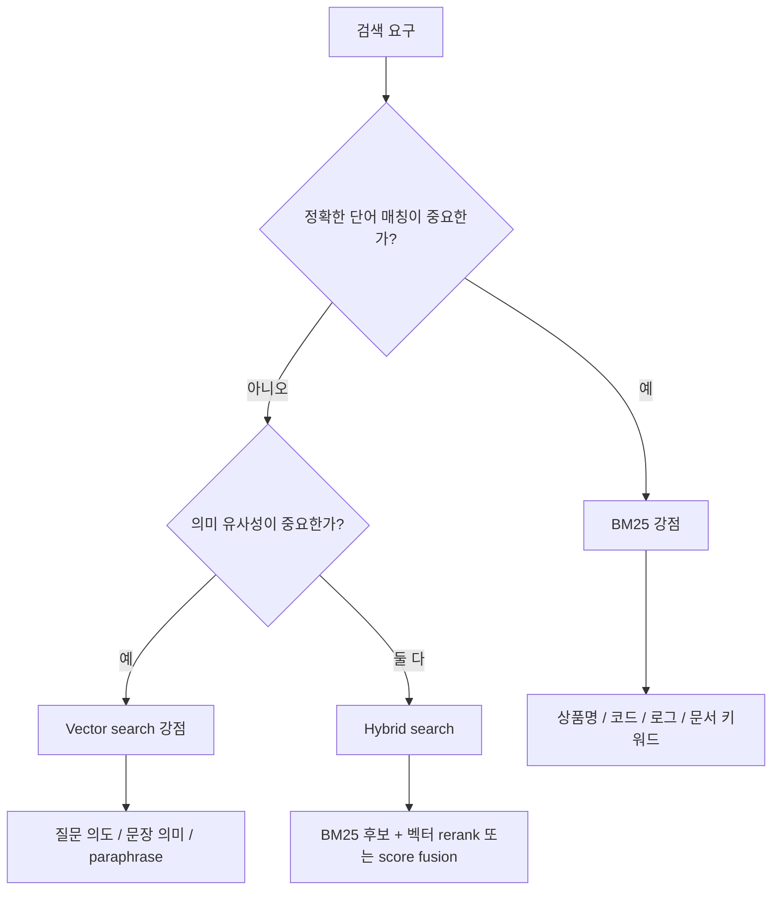
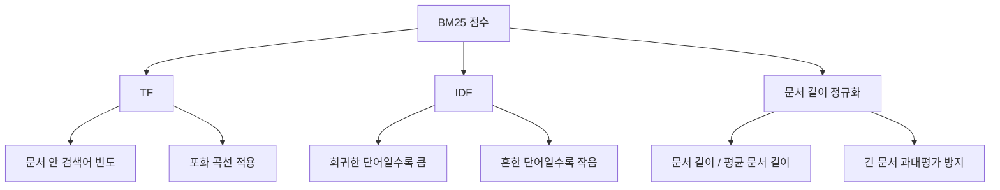
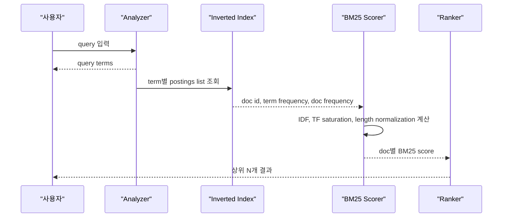
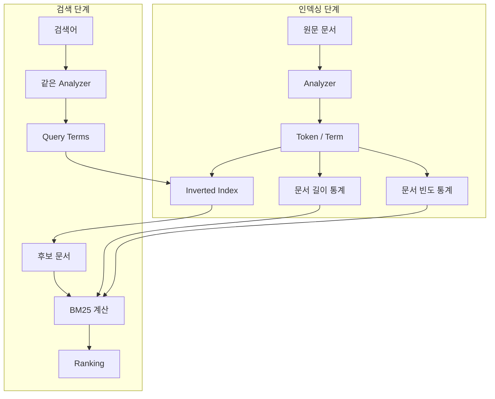
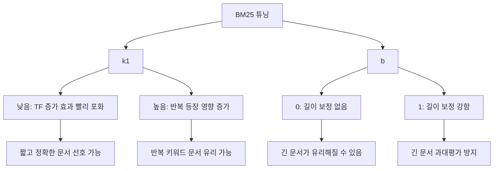
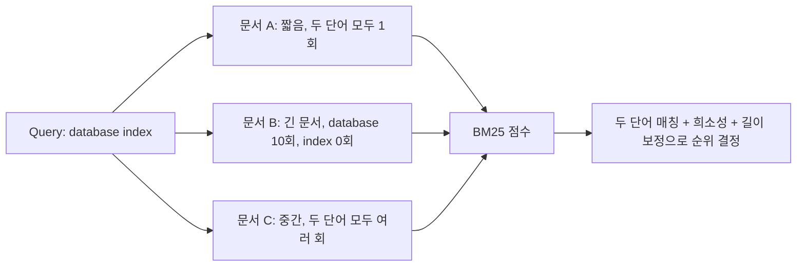
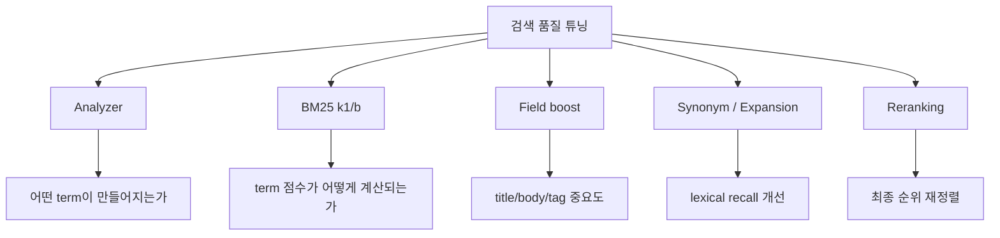
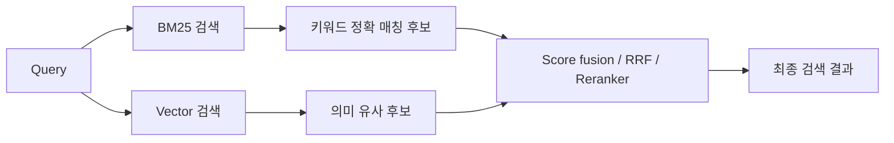
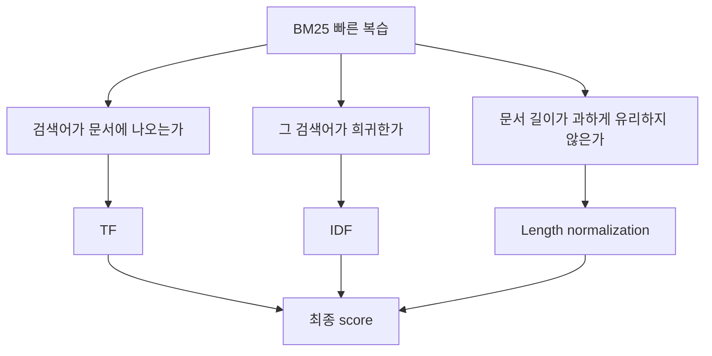
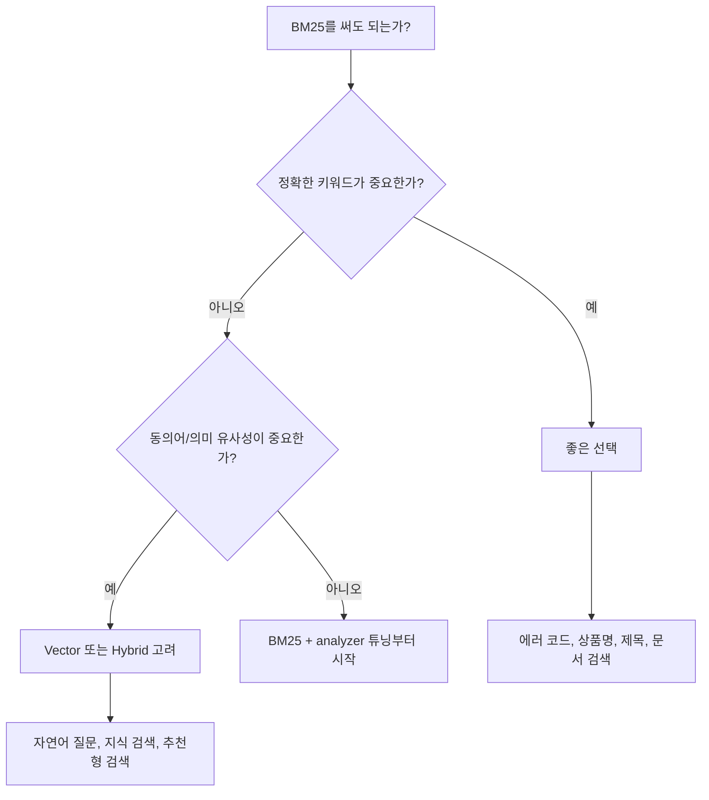

# BM25 검색 방식

- 작성일: 2026-06-29
- 범위: Okapi BM25, lexical search, inverted index, ranking function, Lucene/Elasticsearch 계열 검색 점수화

## 1. 한 줄 요약

- BM25는 검색어가 문서에 등장하는 빈도, 검색어의 희소성, 문서 길이를 함께 고려해서 문서의 관련도 점수를 계산하는 대표적인 키워드 기반 검색 랭킹 함수다.
- 핵심은 "검색어가 많이 나오면 점수가 오르지만 무한히 오르지는 않고, 전체 문서에 흔한 단어는 덜 중요하게 보며, 긴 문서가 무조건 유리해지는 것을 보정한다"는 것이다.
- Elasticsearch, OpenSearch, Apache Lucene 계열 검색에서 오랫동안 기본 또는 핵심 ranking 방식으로 쓰여 왔다.


## 2. 왜 중요한가

- BM25는 벡터 검색이나 LLM 검색이 보편화된 뒤에도 기본 검색 품질의 기준선으로 자주 쓰인다.
- 이유는 단순하다. exact keyword matching이 강하고, 빠르며, 설명 가능하고, inverted index와 잘 맞는다.
- 사용자가 상품명, 에러 메시지, 함수명, 법령 조항, 로그 문자열처럼 정확한 단어를 입력하는 상황에서는 BM25가 여전히 매우 강하다.
- 반대로 "의미는 비슷하지만 단어가 다름"을 찾아야 하는 semantic search에는 약하므로, 최근에는 BM25와 vector search를 섞는 hybrid search가 많이 쓰인다.



## 3. 핵심 개념

### BM25가 보는 세 가지 신호

- `TF(term frequency)`: 검색어가 문서 안에 몇 번 등장하는가.
- `IDF(inverse document frequency)`: 검색어가 전체 문서 집합에서 얼마나 희귀한가.
- `문서 길이 정규화`: 긴 문서가 단어를 많이 포함한다는 이유만으로 과도하게 유리해지지 않도록 보정한다.



### 대표 수식

```text
score(D, Q) =
  sum over q in Q:
    IDF(q) *
    ((f(q, D) * (k1 + 1)) /
      (f(q, D) + k1 * (1 - b + b * |D| / avgdl)))
```

- `D`: 점수를 계산할 문서.
- `Q`: 검색 쿼리.
- `q`: 쿼리 안의 개별 검색어.
- `f(q, D)`: 문서 `D` 안에서 검색어 `q`가 등장한 횟수.
- `|D|`: 문서 길이. 보통 분석된 term 개수에 가깝다.
- `avgdl`: 전체 문서의 평균 길이.
- `k1`: term frequency 포화 정도를 조절하는 파라미터다.
- `b`: 문서 길이 정규화 강도를 조절하는 파라미터다.
- 실제 구현은 Lucene처럼 IDF 공식, field 통계, norm 저장 방식이 조금씩 다를 수 있다.

### TF-IDF와의 차이

| 항목 | TF-IDF | BM25 |
| --- | --- | --- |
| term frequency | 등장 횟수에 비례해 계속 증가하기 쉬움 | 많이 나올수록 증가폭이 줄어드는 포화 구조 |
| 문서 길이 보정 | 구현마다 다름 | 공식 안에 길이 정규화가 들어감 |
| 파라미터 | 상대적으로 단순 | `k1`, `b`로 튜닝 가능 |
| 검색엔진 실무 | 고전적 기준 | Lucene/Elasticsearch 계열의 핵심 기본 모델 |

## 4. 아키텍처와 검색 흐름

- BM25는 단독으로 "검색 시스템 전체"가 아니라 ranking function이다.
- 검색엔진은 먼저 문서를 분석해서 term 단위로 쪼개고 inverted index를 만든다.
- 검색 시에는 쿼리도 같은 방식으로 분석한 뒤, 각 term의 postings list를 조회한다.
- 후보 문서마다 term frequency, document frequency, 문서 길이, 평균 문서 길이를 이용해 BM25 점수를 계산한다.
- 최종 결과는 BM25 점수, 필터, 정렬 조건, boost, reranking 등을 거쳐 반환된다.



### 인덱싱 단계와 검색 단계



### Lucene 계열에서의 위치

- Lucene의 `BM25Similarity`는 field별로 통계를 사용한다.
- Elasticsearch/OpenSearch는 내부적으로 Lucene을 사용하므로 BM25 점수는 Lucene의 similarity 모델과 analyzer 설정의 영향을 받는다.
- 같은 BM25라도 analyzer, synonym filter, stopword, stemming, ngram, field boost, shard 통계에 따라 결과가 크게 달라질 수 있다.

## 5. 중요 세부사항, 엣지 케이스, 트레이드오프

### `k1`: TF 포화 조절

- `k1`은 같은 검색어가 문서 안에 여러 번 등장할 때 점수가 얼마나 빨리 포화되는지 조절한다.
- `k1`이 낮으면 term frequency 증가 효과가 빨리 줄어든다.
- `k1`이 높으면 반복 등장에 더 많은 가중치를 준다.
- Lucene/Elasticsearch 계열 기본값으로는 대체로 `k1 = 1.2`가 자주 언급된다.

### `b`: 문서 길이 정규화 조절

- `b`는 긴 문서를 얼마나 강하게 보정할지 정한다.
- `b = 0`이면 문서 길이 정규화를 하지 않는다.
- `b = 1`이면 문서 길이 비율을 강하게 반영한다.
- Lucene/Elasticsearch 계열 기본값으로는 대체로 `b = 0.75`가 자주 언급된다.



### BM25의 강점

- 빠르다. inverted index와 잘 맞아서 대규모 문서 검색에 적합하다.
- 설명 가능하다. 왜 문서가 높은 점수를 받았는지 term frequency, IDF, 길이 보정으로 해석할 수 있다.
- exact match에 강하다. 고유명사, 에러 코드, 함수명, 상품 SKU, 문서 제목 검색에 유리하다.
- 구현이 널리 검증됐다. Lucene, Elasticsearch, OpenSearch 같은 엔진에서 실전 검증이 많다.

### BM25의 한계

- 의미를 직접 이해하지 않는다. `자동차`와 `차량`이 같은 의미라는 사실을 analyzer나 synonym 설정 없이는 모른다.
- 단어 순서를 기본적으로 보지 않는다. phrase query, proximity query는 BM25 자체 밖의 검색 조건으로 다루는 경우가 많다.
- 매우 짧은 문서와 매우 긴 문서가 섞인 컬렉션에서는 `b` 튜닝이 중요하다.
- score는 절대적인 의미의 확률이 아니다. 같은 query 안에서 문서 순위를 비교하는 값에 가깝다.
- field가 여러 개인 문서에서는 title, body, tag, comment를 어떻게 합칠지가 중요하다. 단순히 모든 필드를 붙이면 품질이 나빠질 수 있다.

### 흔한 실무 함정

| 증상 | 원인 | 대응 |
| --- | --- | --- |
| 검색어와 같은 단어가 있는데 결과가 안 나옴 | analyzer가 색인/검색 시 다르게 적용됨 | index analyzer와 search analyzer 확인 |
| 너무 흔한 단어가 결과를 오염 | stopword나 IDF 영향 부족 | stopword, minimum_should_match, query 설계 |
| 긴 문서가 상위에 너무 많이 뜸 | 길이 보정이 약하거나 field 설계가 부적절 | `b` 조정, field 분리, boost 조정 |
| 짧은 제목 문서만 과도하게 뜸 | title boost가 강함 | field boost 재조정 |
| 의미상 관련 문서가 안 뜸 | lexical matching 한계 | synonym, query expansion, vector/hybrid search |

## 6. 실무 예시

### 간단한 계산 감각

- 검색어가 `database index`라고 하자.
- 문서 A는 짧고 `database`, `index`가 각각 1번씩 정확히 나온다.
- 문서 B는 매우 길고 `database`가 10번 나오지만 `index`는 없다.
- 문서 C는 중간 길이이고 `database`, `index`가 모두 여러 번 나온다.
- BM25는 단순히 총 등장 횟수만 보지 않고, 두 query term이 모두 등장하는지, 각 term이 얼마나 희귀한지, 문서 길이가 어느 정도인지까지 함께 본다.



### Python으로 직관 구현

```python
import math
from collections import Counter

def idf(term, docs):
    n = sum(1 for doc in docs if term in doc)
    N = len(docs)
    return math.log(1 + (N - n + 0.5) / (n + 0.5))

def bm25_score(query_terms, doc_terms, docs, avgdl, k1=1.2, b=0.75):
    tf = Counter(doc_terms)
    dl = len(doc_terms)
    score = 0.0

    for term in query_terms:
        f = tf[term]
        if f == 0:
            continue

        numerator = f * (k1 + 1)
        denominator = f + k1 * (1 - b + b * dl / avgdl)
        score += idf(term, docs) * numerator / denominator

    return score
```

### Elasticsearch/Lucene 관점의 예시

- Elasticsearch에서 `match` query를 쓰면 text field는 analyzer를 거쳐 term query들로 바뀌고, 기본 similarity가 BM25라면 각 term match가 BM25 계열 점수로 계산된다.
- `_explain` API를 쓰면 특정 문서가 왜 그 점수를 받았는지 TF, IDF, field length normalization에 가까운 세부 정보를 확인할 수 있다.
- 검색 품질 튜닝은 BM25 파라미터만 만지는 것이 아니라 analyzer, field mapping, boost, query type, synonym, reranker까지 함께 봐야 한다.



### BM25와 벡터 검색을 같이 쓰는 패턴



- `BM25 only`: 정확한 용어가 중요하고 데이터가 구조화되어 있을 때 좋다.
- `Vector only`: 사용자가 자연어로 의도를 말하고 표현이 다양할 때 좋다.
- `Hybrid`: 정확한 용어와 의미 유사성을 모두 놓치기 싫을 때 좋다.

## 7. 용어 정리와 빠른 복습

- `BM25`: Best Matching 25 또는 Okapi BM25로 알려진 probabilistic retrieval 계열 ranking 함수다.
- `Okapi`: BM25가 발전한 검색 시스템/연구 맥락의 이름이다.
- `TF`: term frequency. 특정 단어가 문서에 등장한 횟수다.
- `IDF`: inverse document frequency. 전체 문서에서 희귀한 단어일수록 큰 값을 준다.
- `k1`: TF 포화 정도를 조절하는 파라미터다.
- `b`: 문서 길이 정규화 강도를 조절하는 파라미터다.
- `inverted index`: term에서 문서 목록으로 가는 색인 구조다.
- `analyzer`: 텍스트를 검색 가능한 term으로 바꾸는 처리기다. tokenizer, lowercase, stopword, stemming, synonym 등이 포함될 수 있다.
- `lexical search`: 단어/문자열 매칭 기반 검색이다.
- `semantic search`: 단어 표면형보다 의미 유사성을 중심으로 찾는 검색이다.



### 판단 기준



- BM25는 검색 시스템 전체가 아니라 ranking 함수다.
- 핵심 신호는 TF, IDF, 문서 길이 정규화다.
- `k1`은 단어 반복의 영향, `b`는 문서 길이 보정의 강도를 조절한다.
- analyzer 설정이 잘못되면 BM25 수식이 좋아도 검색 품질은 나빠진다.
- 의미 검색이 필요하면 BM25만 고집하지 말고 synonym, query expansion, vector search, reranker를 함께 검토한다.

## 8. 참고 링크

- [Stanford IR Book - Okapi BM25](https://nlp.stanford.edu/IR-book/html/htmledition/okapi-bm25-a-non-binary-model-1.html)
- [The Probabilistic Relevance Framework: BM25 and Beyond](https://www.staff.city.ac.uk/~sbrp622/papers/foundations_bm25_review.pdf)
- [Apache Lucene - BM25Similarity](https://lucene.apache.org/core/9_12_0/core/org/apache/lucene/search/similarities/BM25Similarity.html)
- [Elasticsearch Guide - Similarity](https://www.elastic.co/docs/reference/elasticsearch/index-settings/similarity)
- [Elastic Blog - Practical BM25](https://www.elastic.co/blog/practical-bm25-part-2-the-bm25-algorithm-and-its-variables)
- [OpenSearch Documentation - BM25](https://docs.opensearch.org/latest/search-plugins/keyword-search/)
