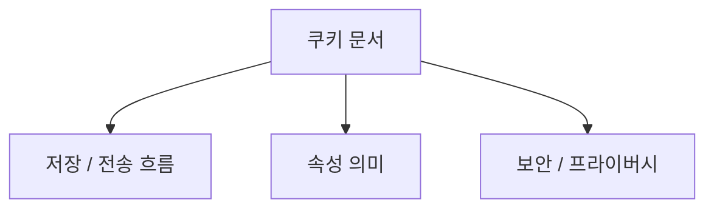
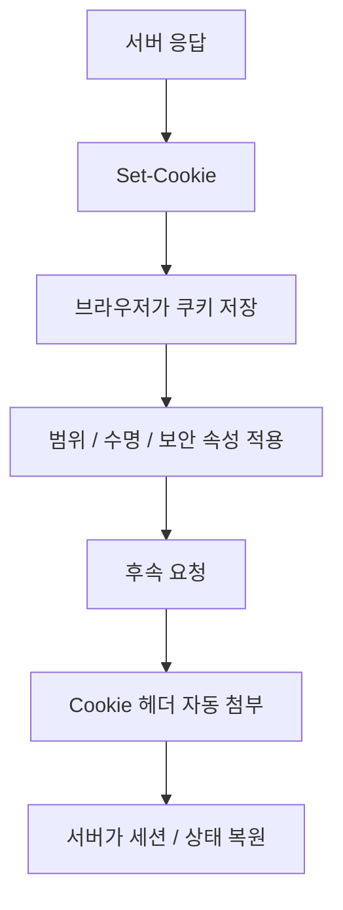
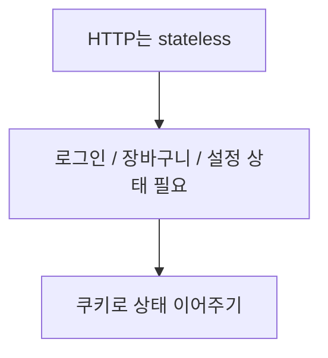
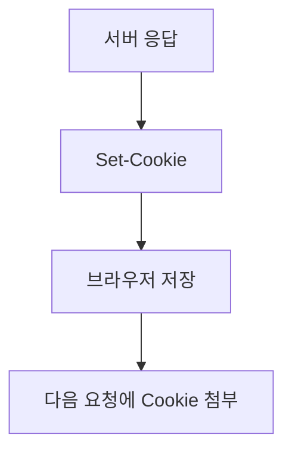
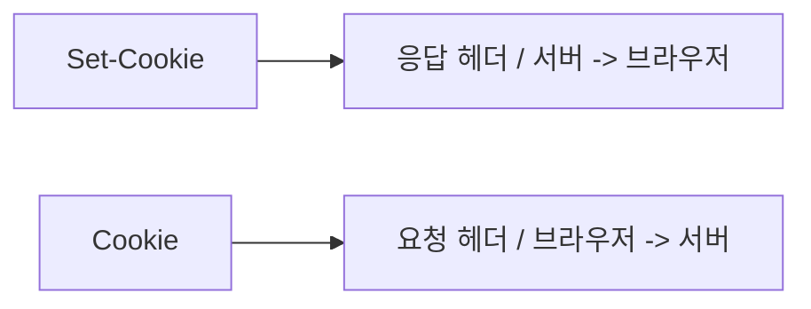
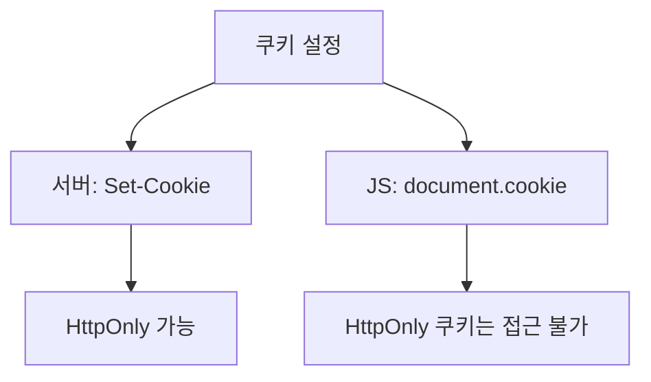
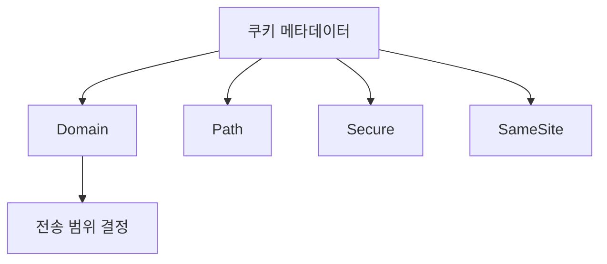

# 브라우저 쿠키 상세 정리

작성 기준일: 2026-04-19  
조사 방식: 웹검색 기반 최신 조사  
주요 참고: `developer.mozilla.org` 공식 MDN 문서, `rfc-editor.org` RFC 6265, IETF `rfc6265bis` 초안

## 1. 문서 목적



이 문서는 브라우저 쿠키를 처음 배우는 사람부터 이미 한두 번 써 본 사람까지, "쿠키가 정확히 무엇이고 HTTP/브라우저가 어떤 규칙으로 저장하고 보내는지"를 한 번에 연결해서 이해할 수 있도록 정리한 학습 문서다.

특히 아래를 함께 설명한다.

- 쿠키가 정확히 무엇인가
- 왜 HTTP에서 쿠키가 필요했는가
- `Set-Cookie`와 `Cookie` 헤더는 어떻게 동작하는가
- `Expires`, `Max-Age`, `Domain`, `Path`, `Secure`, `HttpOnly`, `SameSite`, `Partitioned`는 각각 무슨 뜻인가
- 세션 쿠키와 영속 쿠키는 무엇이 다른가
- first-party / third-party cookie는 어떻게 구분되는가
- modern browser에서 third-party cookie가 왜 문제가 되고 무엇이 달라졌는가
- `document.cookie`는 언제 쓰고 왜 조심해야 하는가
- 쿠키가 어떤 보안/프라이버시 문제를 만들 수 있는가

즉 이 문서는 단순 헤더 속성 암기보다, "`브라우저 쿠키를 시스템으로 이해하는 문서`"에 가깝다.

---

## 2. 먼저 한 줄 요약



브라우저 쿠키는 서버가 브라우저에게 작은 상태 조각을 저장하게 하고, 이후 같은 사이트에 다시 요청할 때 그 상태를 함께 보내게 만드는 HTTP 상태 관리 메커니즘이다.

RFC 6265는 쿠키를:

- 서버가 `Set-Cookie` 응답 헤더로 보내고
- 사용자 에이전트(브라우저)가 저장하고
- 이후 요청에서 `Cookie` 헤더로 다시 보내는

방식으로 정의한다.

즉 아주 단순하게 말하면:

- HTTP는 본래 stateless인데
- 쿠키는 "같은 브라우저/사용자였던 것처럼" 서버가 상태를 이어서 처리하게 해 준다

는 것이다.

---

## 3. 왜 쿠키가 필요한가



### 3.1 HTTP는 기본적으로 stateless다

RFC 6265도 이 점을 전제로 깔고 있다.

즉 기본 HTTP 요청만 보면 서버 입장에서는:

- 이전 요청의 사용자인지
- 로그인한 상태인지
- 장바구니를 담았는지

를 모른다.

### 3.2 그래서 상태 저장이 필요하다

웹 서비스는 자주 아래 상태를 기억해야 한다.

- 로그인 세션
- 장바구니
- CSRF 토큰
- UI 선호 설정
- A/B 테스트 버킷
- 언어/지역 설정

이걸 서버/브라우저 사이에서 이어주는 대표 메커니즘이 쿠키다.

### 3.3 쿠키는 "작은 상태 조각"

쿠키는 DB가 아니다.

즉:

- 작은 문자열 기반 상태
- 브라우저가 저장
- 요청마다 자동 첨부 가능

정도로 생각하는 편이 맞다.

즉 데이터 저장소라기보다 `HTTP 요청에 따라다니는 상태 메타데이터`에 가깝다.

---

## 4. 쿠키의 기본 흐름



쿠키를 이해하려면 흐름을 먼저 잡아야 한다.

### 4.1 서버가 응답에서 `Set-Cookie`

예:

```http
Set-Cookie: sessionId=abc123; HttpOnly; Secure; SameSite=Lax; Path=/
```

이건:

- 브라우저에게 `sessionId=abc123`를 저장하라고 지시하는 것

이다.

### 4.2 브라우저가 저장

브라우저는:

- 해당 쿠키의 유효기간
- 도메인/경로 범위
- 보안 속성

을 메타데이터와 함께 저장한다.

### 4.3 이후 요청에서 `Cookie`

같은 범위에 해당하는 요청을 보낼 때 브라우저는:

```http
Cookie: sessionId=abc123
```

를 자동으로 붙인다.

### 4.4 서버는 그 값을 보고 상태를 복원

즉 서버는:

- `sessionId`
- `cartId`
- `lang`

같은 쿠키 값을 보고, 이전 상태와 연결된 사용자라고 판단할 수 있다.

---

## 5. `Set-Cookie`와 `Cookie` 차이



이건 매우 중요하다.

### 5.1 `Set-Cookie`

MDN `Set-Cookie`는:

- 서버가 브라우저에게 쿠키를 저장/수정/삭제하게 하는 응답 헤더

라고 설명한다.

즉:

- 응답 헤더
- 서버 -> 브라우저 방향

이다.

### 5.2 `Cookie`

MDN `Cookie` header는:

- 브라우저가 이전에 저장한 쿠키를 요청 헤더로 보내는 것

이라고 설명한다.

즉:

- 요청 헤더
- 브라우저 -> 서버 방향

이다.

### 5.3 한 줄 요약

- `Set-Cookie` = 저장 지시
- `Cookie` = 저장된 값 전달

즉 이름이 비슷해도 방향과 역할이 완전히 다르다.

---

## 6. 쿠키를 누가 설정할 수 있나



### 6.1 서버

가장 표준적인 방식은 서버가 `Set-Cookie`를 응답에 넣는 것이다.

### 6.2 JavaScript

MDN `Document.cookie`는 JavaScript가 `document.cookie`로 일부 쿠키를 읽고 쓸 수 있다고 설명한다.

즉 브라우저 JS도 쿠키를 다룰 수 있다.

### 6.3 하지만 차이가 있다

중요한 차이:

- 서버가 `Set-Cookie`로 만든 쿠키는 `HttpOnly`를 줄 수 있다
- `HttpOnly` 쿠키는 JS에서 읽을 수 없다

즉 모든 쿠키가 프런트 JS에서 보이는 것은 아니다.

### 6.4 실무 감각

보통:

- 세션 토큰 같은 민감한 값 -> 서버가 `Set-Cookie` + `HttpOnly`
- 단순 UI preference 같은 값 -> JS 쿠키 또는 다른 저장소

로 나누어 생각한다.

---

## 7. 쿠키는 어디 범위에 붙나



쿠키는 "저장만 하면 모든 요청에 붙는 것"이 아니다.

범위를 정하는 속성이 있다.

대표:

- `Domain`
- `Path`
- `Secure`
- `SameSite`

즉 브라우저는 저장된 쿠키 메타데이터를 보고:

- 이 요청에 붙여도 되는가

를 판단한다.

---

## 8. `Domain`

RFC 6265와 MDN `Set-Cookie`는 `Domain` 속성이 어떤 호스트들에 쿠키를 보낼지 범위를 넓힐 수 있다고 설명한다.

### 8.1 기본값: host-only cookie

`Domain`을 생략하면 그 쿠키는 기본적으로 host-only다.

즉:

- 쿠키를 설정한 정확한 host에만 전송

된다.

예:

- `app.example.com`에서 설정했고 `Domain`을 안 줌
- 그러면 `api.example.com`이나 `www.example.com`에는 자동 공유되지 않음

### 8.2 `Domain=example.com`

이렇게 주면:

- `example.com`
- 그 하위 서브도메인들

에 쿠키가 전송될 수 있다.

즉 범위를 넓히는 옵션이다.

### 8.3 왜 중요한가

이 속성 하나로:

- 하위 서브도메인들과 세션을 공유할지
- 특정 host에만 제한할지

가 달라진다.

### 8.4 실무 감각

가능하면 범위는 좁게 주는 편이 좋다.

즉 굳이 여러 서브도메인이 공유할 필요가 없으면 `Domain`을 생략해 host-only로 두는 편이 안전하다.

---

## 9. `Path`

RFC 6265와 MDN은 `Path`가 요청 URL path 범위를 제한한다고 설명한다.

예:

```http
Set-Cookie: sessionId=abc; Path=/app
```

이면 브라우저는:

- `/app`
- `/app/anything`

같은 경로에만 쿠키를 보낸다.

### 9.1 기본값

MDN은 `Path`를 생략하면 요청 URL의 path component를 기준으로 기본값이 정해진다고 설명한다.

즉:

- 쿠키를 어디에서 설정했는지

에 따라 기본 path가 달라질 수 있다.

### 9.2 중요한 경고

RFC 6265와 MDN 둘 다 사실상 같은 메시지를 준다.

- `Path`는 보안 경계가 아니다

즉:

- `/admin`에만 보내게 제한했다고
- 다른 path의 JS가 절대 못 읽는다는 뜻은 아니다

특히 `HttpOnly`가 아니면 JS 접근 여부는 또 다른 문제다.

---

## 10. `Expires`와 `Max-Age`

이 둘은 만료 시점을 제어한다.

### 10.1 `Expires`

절대 날짜/시간을 준다.

예:

```http
Set-Cookie: lang=ko; Expires=Wed, 21 Oct 2026 07:28:00 GMT
```

### 10.2 `Max-Age`

현재 시점으로부터 몇 초 뒤 만료인지 상대 시간으로 준다.

예:

```http
Set-Cookie: token=abc; Max-Age=3600
```

### 10.3 우선순위

MDN `Set-Cookie`는 `Expires`와 `Max-Age`가 같이 있으면 `Max-Age`가 우선한다고 설명한다.

즉 실무에서는 `Max-Age`가 더 예측 가능할 때가 많다.

### 10.4 삭제

보통 쿠키 삭제는:

- `Max-Age=0`
- 또는 과거 `Expires`

로 구현한다.

즉 "쿠키 삭제 API"가 따로 있는 게 아니라, 만료된 값으로 다시 set하는 감각이다.

---

## 11. 세션 쿠키 vs 영속 쿠키

### 11.1 세션 쿠키

만료 시간을 지정하지 않으면 보통 session cookie가 된다.

즉:

- 브라우저 세션 동안 유지
- 브라우저 종료 시 사라질 수 있음

다.

### 11.2 영속 쿠키

`Expires` 또는 `Max-Age`가 있으면 persistent cookie가 된다.

즉 브라우저가 디스크에 저장해 두고:

- 재시작 이후에도 남을 수 있다

### 11.3 실무 감각

- 로그인 세션을 브라우저 닫을 때 같이 끝내고 싶으면 session cookie
- 언어, 테마, remember-me 같은 건 persistent cookie

처럼 생각할 수 있다.

### 11.4 주의점

브라우저 정책, 사용자 설정, 프라이버시 모드에 따라 실제 보존 방식은 달라질 수 있다.

즉 "persistent면 절대 안 지워진다"는 뜻은 아니다.

---

## 12. `Secure`

RFC 6265는 `Secure`가 쿠키를 secure channel(보통 HTTPS/TLS)에서만 보내게 제한한다고 설명한다.

### 12.1 의미

```http
Set-Cookie: session=abc; Secure
```

이면 브라우저는 보통 HTTPS 요청에서만 그 쿠키를 보낸다.

### 12.2 왜 중요한가

민감한 세션 쿠키가 평문 HTTP로 나가면 중간에서 훔쳐질 수 있다.

즉 `Secure`는 사실상 세션 쿠키 기본 옵션이라고 생각해도 된다.

### 12.3 중요한 한계

RFC 6265는 `Secure`가 기밀성에는 도움이 되지만, active network attacker 앞에서 integrity를 완벽히 보장하는 것은 아니라고 지적한다.

즉:

- `Secure`만 있다고 쿠키 보안이 끝나는 건 아니다

### 12.4 실무 요약

로그인/세션/인증 쿠키는 거의 항상:

- HTTPS
- `Secure`

를 기본 전제로 둬야 한다.

---

## 13. `HttpOnly`

RFC 6265와 MDN은 `HttpOnly`가:

- JavaScript의 `document.cookie` 같은 비-HTTP API 접근을 막는 속성

이라고 설명한다.

### 13.1 의미

```http
Set-Cookie: session=abc; HttpOnly
```

이면:

- 브라우저는 그 쿠키를 HTTP 요청에는 보낼 수 있지만
- JS는 읽지 못한다

### 13.2 왜 중요한가

XSS가 났을 때:

- JS가 쿠키를 읽어 훔쳐 가는 것

을 줄이는 데 매우 중요하다.

즉 세션 식별자 쿠키에는 거의 필수에 가깝다.

### 13.3 중요한 점

MDN도 설명하듯 `HttpOnly` 쿠키는:

- JS에서 `fetch()` / `XMLHttpRequest`로 요청을 보낼 때도
- 브라우저가 HTTP 레벨에서 자동 첨부할 수 있다

즉 "JS가 아예 사용할 수 없는 쿠키"가 아니라, "JS 코드가 값을 읽지 못하는 쿠키"다.

---

## 14. `SameSite`

이건 modern cookie behavior의 핵심이다.

MDN `Set-Cookie`와 third-party cookies guide는 `SameSite`가 cross-site 요청에 쿠키를 보낼지 제어한다고 설명한다.

### 14.1 `Strict`

- same-site 요청에만 보냄
- 외부 사이트에서 링크 타고 들어오는 top-level navigation에도 안 보낼 수 있음

즉 가장 보수적이다.

### 14.2 `Lax`

MDN 설명:

- cross-site subrequest에는 안 보내고
- 사용자가 링크 클릭 등으로 top-level navigation으로 들어오는 경우는 보낼 수 있다

즉 실무 기본값으로 가장 자주 선택된다.

### 14.3 `None`

- same-site / cross-site 모두 보낼 수 있음

하지만 중요한 조건:

- `SameSite=None`이면 반드시 `Secure`도 필요

### 14.4 왜 중요한가

`SameSite`는 CSRF 위험을 줄이는 핵심 도구 중 하나다.

즉 서버 세션 쿠키를 쓸 때:

- 아무 설정도 안 하면 브라우저 기본 동작에 의존하게 되고
- modern browser는 대체로 `Lax` 기본값을 쓰는 흐름

이 있다.

### 14.5 실무 감각

대체로:

- 일반 세션 -> `Lax` 검토
- 아주 엄격한 민감 세션 -> `Strict` 검토
- cross-site embed/SSO 필요 -> `None; Secure`

처럼 생각한다.

---

## 15. first-party cookie와 third-party cookie

MDN third-party cookies guide는 쿠키가:

- 현재 페이지와 같은 site에 속하면 first-party
- 다른 site에 속하면 third-party

라고 설명한다.

### 15.1 first-party cookie

예:

- 사용자가 `shop.example`를 보고 있고
- `shop.example`가 설정한 쿠키

### 15.2 third-party cookie

예:

- 사용자가 `site-a.example`를 보고 있는데
- 그 안에 `third-party.example` iframe/script/img가 있고
- 그쪽이 설정한 쿠키

즉 top-level page와 다른 site가 설정한 쿠키다.

### 15.3 왜 문제가 되었나

third-party cookie는 여러 사이트를 가로질러 같은 사용자를 추적하는 데 쓰일 수 있었다.

즉:

- 광고 추적
- 행동 프로파일링
- cross-site tracking

의 대표 도구가 되었다.

### 15.4 오늘날 상황

MDN은 modern browsers가 기본적으로 third-party cookies를 제한하거나 차단하는 방향으로 가고 있다고 설명한다.

즉 예전처럼 "쿠키면 어디서든 다 잘 붙는다"라고 생각하면 안 된다.

---

## 16. Same-site와 same-origin은 다르다

이 부분도 자주 헷갈린다.

### 16.1 same-origin

보통:

- scheme
- host
- port

까지 모두 같은지를 본다.

### 16.2 same-site

MDN third-party cookies guide는 same-site를:

- scheme과 registrable domain 기준으로 설명한다

즉 same-origin보다 범위가 더 넓을 수 있다.

### 16.3 왜 중요한가

`SameSite` 쿠키는:

- origin 기준이 아니라 site 기준

으로 동작한다.

즉 서브도메인 구조와 사이트 구조를 같이 이해해야 한다.

---

## 17. `Partitioned`와 CHIPS

MDN `Set-Cookie`와 CHIPS 문서는 `Partitioned` 속성을 설명한다.

### 17.1 무엇인가

`Partitioned`가 붙으면 쿠키는:

- top-level site별로 분리된 storage jar

에 저장된다.

즉 같은 third-party가 여러 사이트에 embed되어도:

- 사이트 A에서 본 쿠키
- 사이트 B에서 본 쿠키

를 서로 분리한다.

### 17.2 왜 나왔나

third-party cookie를 완전히 허용하면 추적이 심하고,

완전히 막으면:

- 임베디드 챗
- 관련 사이트 간 설정 유지
- 일부 합법적 위젯

이 깨질 수 있다.

CHIPS는:

- 추적은 줄이고
- 정당한 cross-site embedded use case는 일부 살리려는

절충안이다.

### 17.3 중요한 조건

MDN은 `Partitioned` 쿠키에:

- `Secure`가 필요하다고 설명한다

즉:

```http
Set-Cookie: __Host-example=...; Secure; Path=/; SameSite=None; Partitioned
```

같은 형태가 자주 나온다.

### 17.4 실무 감각

즉 modern browser 시대에는 third-party cookie 전략을 짤 때:

- 예전 일반 third-party cookie
- `SameSite=None; Secure`
- `Partitioned`
- Storage Access API

를 함께 봐야 한다.

---

## 18. Cookie Prefixes

MDN `Set-Cookie`는 쿠키 이름 prefix도 설명한다.

대표:

- `__Secure-`
- `__Host-`
- `__Http-`
- `__Host-Http-`

### 18.1 `__Secure-`

의미:

- `Secure`가 있는 HTTPS origin에서만 설정 가능

### 18.2 `__Host-`

의미:

- `Secure`
- `Path=/`
- `Domain` 없음

즉 가장 host-bound한 쿠키를 만들 수 있다.

### 18.3 왜 중요한가

이 prefix들은:

- 쿠키 범위를 더 엄격하게 하고
- 설정 실수를 줄이는 데

도움이 된다.

즉 민감한 세션 쿠키라면 `__Host-` 계열을 검토할 가치가 있다.

---

## 19. `document.cookie`

MDN `Document.cookie`는 브라우저 JS가 현재 document와 연결된 쿠키를 읽고 쓸 수 있다고 설명한다.

### 19.1 읽기

```js
document.cookie
```

는:

- 세미콜론으로 구분된 `key=value` 목록 문자열

을 반환한다.

### 19.2 쓰기

```js
document.cookie = "theme=dark; Path=/; Max-Age=3600";
```

같이 일부 쿠키를 설정할 수 있다.

### 19.3 중요한 한계

MDN은 `document.cookie`가:

- synchronous API라 성능 문제가 될 수 있고
- 가능하면 async Cookie Store API를 고려하라고

설명한다.

즉 대규모/자주 읽는 코드에서 무심코 남발하면 안 된다.

### 19.4 `HttpOnly`와의 관계

`HttpOnly`가 있으면 `document.cookie`에서 안 보인다.

즉 JS에서 세션 쿠키를 읽고 싶다면 `HttpOnly`를 못 쓰는데, 그건 보안 trade-off를 의미한다.

---

## 20. 쿠키를 갱신/삭제하는 방법

쿠키는 DB row처럼 update API가 따로 있는 게 아니다.

### 20.1 갱신

같은 이름/도메인/경로 범위의 쿠키를 다시 `Set-Cookie`하면 새 값으로 덮인다.

### 20.2 삭제

보통:

```http
Set-Cookie: session=; Max-Age=0; Path=/; HttpOnly; Secure
```

처럼 만료시킨다.

### 20.3 중요한 점

삭제할 때도:

- `Domain`
- `Path`

범위가 원래와 같아야 정확히 같은 쿠키를 지울 수 있다.

즉 삭제가 안 되는 버그는 종종 범위 mismatch 때문이다.

---

## 21. 쿠키와 보안

쿠키는 편하지만 보안 문제도 많다.

### 21.1 XSS

`HttpOnly`가 없는 민감한 쿠키는 JS로 읽힐 수 있다.

즉 XSS가 나면 세션 탈취 위험이 커진다.

### 21.2 CSRF

쿠키는 브라우저가 자동으로 첨부하므로, CSRF 공격의 핵심 요소가 된다.

그래서:

- `SameSite`
- CSRF token
- double-submit pattern

같은 방어가 중요하다.

### 21.3 Session fixation

세션 쿠키를 로그인 전후로 제대로 갱신하지 않으면 fixation 문제가 생길 수 있다.

즉 로그인 시 세션 회전(rotation) 감각도 중요하다.

### 21.4 Secure transport

민감한 쿠키는:

- HTTPS
- `Secure`
- `HttpOnly`
- 적절한 `SameSite`

가 기본이다.

---

## 22. 쿠키와 프라이버시

RFC 6265 자체도 cookies have security and privacy issues라고 언급한다.

### 22.1 tracking

쿠키는 사용자를 기억하는 데 유용하지만, 그 기억이 곧 추적이 되기도 한다.

특히 third-party cookie는:

- 사이트 간 추적
- 프로파일링
- 광고 타게팅

문제로 연결됐다.

### 22.2 modern browser 변화

브라우저는 점점:

- third-party cookie 제한
- partitioned storage
- storage access gating

방향으로 가고 있다.

즉 예전 웹의 "쿠키는 어디서든 다 통한다"는 감각은 이미 깨졌다.

### 22.3 법/규제

MDN도 GDPR/CCPA 같은 규제를 함께 언급한다.

즉 쿠키는 단순 기술 문제가 아니라 법적/동의 문제와도 연결된다.

---

## 23. 쿠키를 어디에 쓰면 좋고, 어디에 쓰면 안 좋나

### 23.1 잘 맞는 경우

- 서버 세션 ID
- CSRF 방어 보조 토큰
- 짧은 사용자 설정
- 언어/테마 preference

### 23.2 덜 맞는 경우

- 큰 데이터 저장
- 클라이언트만 쓰는 대용량 상태
- 민감 정보를 평문으로 저장

즉 쿠키는 작은 상태 조각용이지 일반 저장소가 아니다.

### 23.3 localStorage와의 비교

쿠키는:

- HTTP 요청에 자동 첨부 가능

반면 localStorage는:

- JS만 접근
- 자동 전송 안 됨

즉 세션 관리와 서버 연동이 핵심이면 쿠키가, purely client-side 저장이면 localStorage 등이 더 맞을 수 있다.

---

## 24. 자주 하는 실수

### 24.1 `Path`를 보안 경계로 착각

공식 문서도 명확히 경고한다.

`Path`는 전송 범위 힌트이지 강한 보안 경계가 아니다.

### 24.2 민감 쿠키에 `HttpOnly`/`Secure` 누락

세션 쿠키라면 거의 기본 옵션처럼 생각해야 한다.

### 24.3 `SameSite`를 명시하지 않음

브라우저 기본값에 의존하면 cross-site 흐름에서 예측이 어려워질 수 있다.

### 24.4 third-party cookie가 계속 잘 동작할 거라 가정

현대 브라우저 환경에서는 매우 위험한 가정이다.

### 24.5 `document.cookie`를 자주 읽어도 괜찮다고 생각

MDN은 동기 API라 성능 문제 가능성을 명시한다.

즉 자주 읽는 핫패스에서는 조심해야 한다.

---

## 25. 추천 mental model

헷갈리지 않으려면 아래 순서로 생각하면 된다.

### 25.1 누가 설정하는가

- 서버 -> `Set-Cookie`
- JS -> `document.cookie`

### 25.2 누가 보내는가

- 브라우저가 `Cookie` 요청 헤더로 자동 첨부

### 25.3 어디까지 보내는가

- `Domain`
- `Path`
- `Secure`
- `SameSite`

### 25.4 얼마나 오래 사는가

- session
- `Expires`
- `Max-Age`

### 25.5 누가 읽을 수 있는가

- HTTP만 -> `HttpOnly`
- JS도 가능 -> `HttpOnly` 없음

### 25.6 cross-site 상황인가

- first-party
- third-party
- `SameSite`
- `Partitioned`

즉 쿠키는 단순 name/value가 아니라 "브라우저가 갖는 전송 정책 포함 상태 객체"라고 보면 된다.

---

## 26. 한 문장 결론

브라우저 쿠키는 HTTP의 stateless 특성을 보완하기 위해 서버가 브라우저에 저장시키고 이후 요청에 자동 첨부되게 만드는 상태 관리 메커니즘이지만, 실제로는 `Domain/Path/Expires/Max-Age/Secure/HttpOnly/SameSite/Partitioned` 같은 속성으로 범위와 수명과 보안 성질이 세밀하게 결정되는 브라우저 정책 시스템에 가깝다.

즉 쿠키를 제대로 이해한다는 것은:

- `Set-Cookie`와 `Cookie` 흐름
- 범위/만료 속성
- first-party / third-party / same-site 구분
- `HttpOnly`, `Secure`, `SameSite`
- modern browser privacy 변화

를 함께 이해하는 것을 뜻한다.

---

## 27. 공식 출처

- RFC 6265, HTTP State Management Mechanism: <https://www.rfc-editor.org/rfc/rfc6265.html>
- MDN Using HTTP cookies: <https://developer.mozilla.org/docs/Web/HTTP/Guides/Cookies>
- MDN Set-Cookie header: <https://developer.mozilla.org/en-US/docs/Web/HTTP/Reference/Headers/Set-Cookie>
- MDN Cookie header: <https://developer.mozilla.org/en-US/docs/Web/HTTP/Reference/Headers/Cookie>
- MDN Document.cookie: <https://developer.mozilla.org/en-US/docs/Web/API/Document/cookie>
- MDN Third-party cookies: <https://developer.mozilla.org/en-US/docs/Web/Privacy/Guides/Third-party_cookies>
- MDN CHIPS / Partitioned cookies: <https://developer.mozilla.org/en-US/docs/Web/Privacy/Privacy_sandbox/Partitioned_cookies>
- IETF draft rfc6265bis: <https://datatracker.ietf.org/doc/html/draft-ietf-httpbis-rfc6265bis>

<!-- study-links:start -->
## 관련 문서

- `ietf`: [[IETF/README|IETF 상세 정리]]
- `sso`: [[정보처리기사/5과목 정보시스템 구축 관리/257 SSO(Single Sign On)/257 SSO(Single Sign On)|257 SSO(Single Sign On)]]
<!-- study-links:end -->
