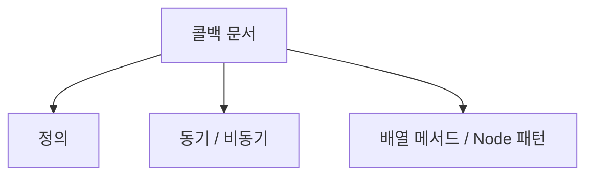
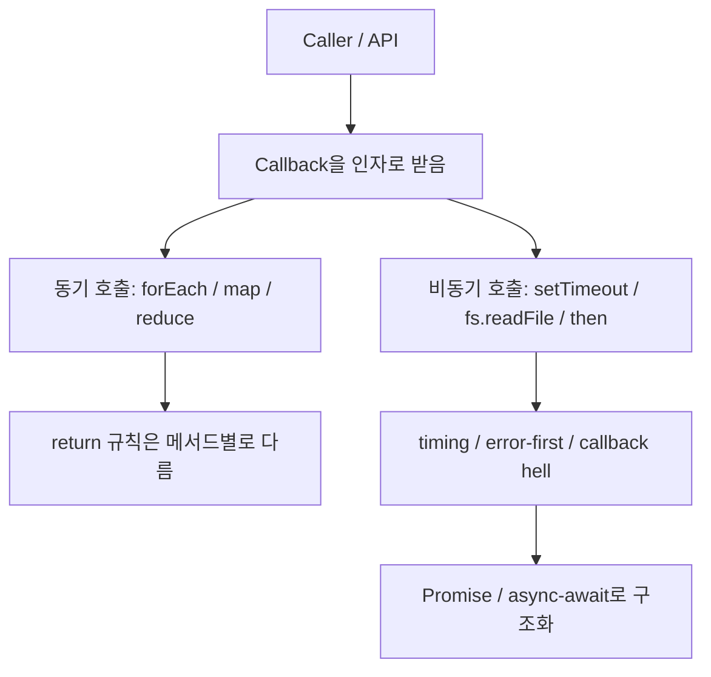
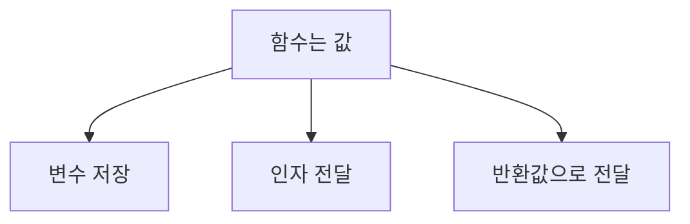
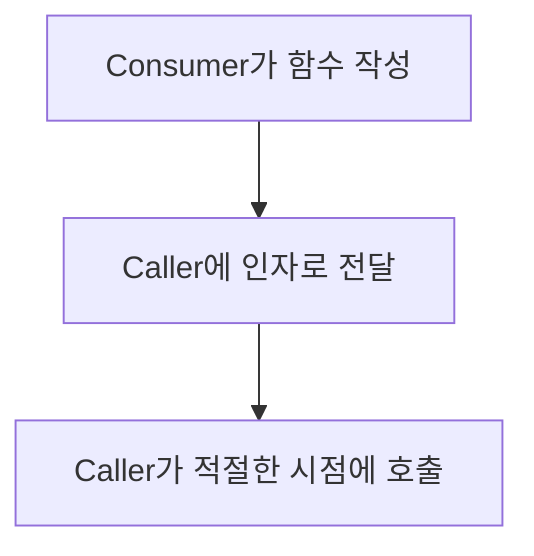
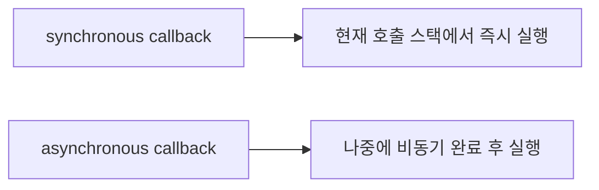
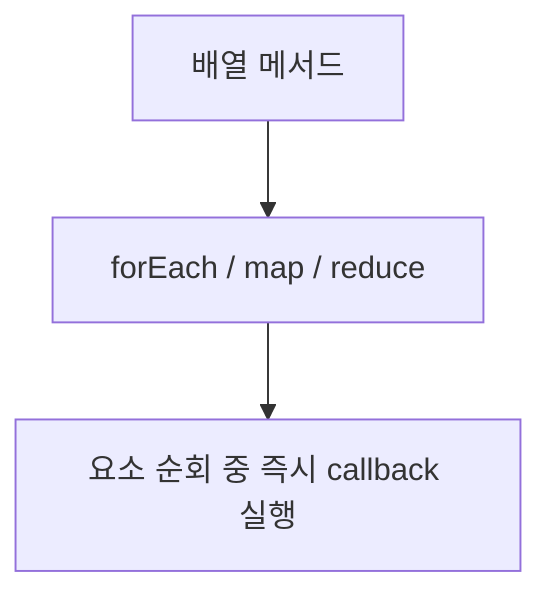
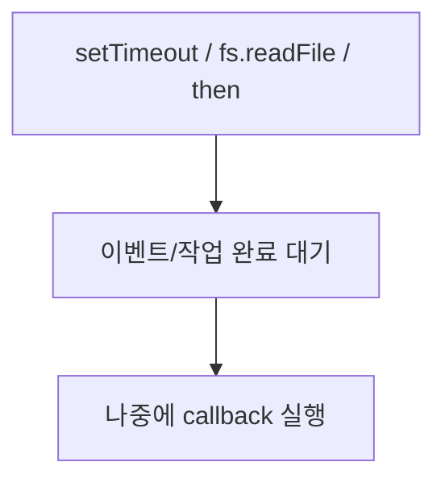

# 콜백 함수 상세 정리

작성 기준일: 2026-04-14  
조사 방식: 웹검색 기반 최신 조사  
주요 참고: `developer.mozilla.org` 공식 MDN 문서, `nodejs.org` 공식 Learn 문서

## 1. 문서 목적


이 문서는 JavaScript의 `callback function`을 처음 배우는 사람부터 이미 어느 정도 사용해 본 사람까지, "콜백 함수가 정확히 무엇이고 언제 유용하며 언제 문제가 되는지"를 한 번에 연결해서 이해할 수 있도록 정리한 학습 문서다.

단순히 "함수를 인자로 넘기는 것" 정도로 끝내지 않고 아래를 함께 설명한다.

- 콜백 함수의 정확한 정의
- 콜백이 가능한 이유: first-class function
- synchronous callback과 asynchronous callback의 차이
- Array 메서드에서 콜백이 어떻게 쓰이는지
- 콜백의 `return` 값이 언제 의미 있고 언제 버려지는지
- `thisArg`, 화살표 함수, `this` 바인딩 문제
- Node.js의 error-first callback 패턴
- callback hell이 왜 생기는지
- Promise / async-await와의 관계
- 실무에서 자주 하는 실수와 설계 원칙

즉 이 문서는 "콜백 문법"이 아니라 "`콜백 기반 제어 흐름` 전체를 이해하는 문서"라고 보면 된다.

---

## 2. 먼저 한 줄 요약



콜백 함수는 다른 함수에 인자로 전달되어, 그 함수 내부에서 나중에 실행되는 함수다.

MDN `Callback function`은 이를 다음처럼 설명한다.

- 어떤 함수에 인자로 전달되고
- 바깥 함수 내부에서 호출되며
- 어떤 루틴이나 동작을 완성하는 데 사용되는 함수

즉 콜백의 핵심은:

- "함수를 값처럼 전달한다"
- "실행 시점을 받는 쪽이 결정한다"

는 두 가지다.

예:

```js
function greet(name, callback) {
  console.log(`Hello, ${name}`)
  callback()
}

greet("Kim", () => {
  console.log("Welcome!")
})
```

이 코드에서:

- `() => { console.log("Welcome!") }`가 콜백
- `greet`는 그 콜백을 받아
- 자기 내부에서 적절한 시점에 실행한다

즉 "지금 즉시 내가 실행하는 함수"와 "남에게 넘겨서 나중에 실행하게 하는 함수"를 구분하는 감각이 중요하다.

---

## 3. 콜백이 가능한 이유: 함수가 값이기 때문


### 3.1 first-class function

MDN `First-class function`은 함수가 다른 값처럼 취급되는 언어를 first-class functions를 가진 언어라고 설명한다.

JavaScript에서는 함수가:

- 변수에 담길 수 있고
- 다른 함수 인자로 전달될 수 있고
- 함수의 반환값으로 돌아올 수 있다

즉 함수는 특별한 문법 덩어리이면서 동시에 값이다.

예:

```js
const sayHello = () => {
  console.log("hello")
}

sayHello()
```

여기서 함수는 변수 `sayHello`에 담겨 있다.

### 3.2 "함수를 전달한다"는 감각

콜백을 이해하려면 아래 차이를 분명히 알아야 한다.

```js
doSomething(sayHello)
```

는 함수 자체를 전달한다.

```js
doSomething(sayHello())
```

는 함수를 먼저 실행한 뒤 그 결과를 전달한다.

이 차이를 놓치면 콜백 관련 버그가 바로 생긴다.

### 3.3 higher-order function

MDN first-class function 문서는:

- 다른 함수를 인자로 받거나
- 다른 함수를 반환하는 함수

를 higher-order function이라고 설명한다.

즉:

- `map`
- `filter`
- `forEach`
- `setTimeout`
- `then`

은 모두 콜백을 받는 higher-order function의 예시라고 볼 수 있다.

---

## 4. 콜백 함수의 정확한 정의


MDN `Callback function`의 정의는 매우 중요하다.

핵심 문장을 풀면 다음과 같다.

- 콜백은 다른 함수에 인자로 전달된다.
- 그 콜백은 바깥 함수 내부에서 호출된다.
- 바깥 함수를 제공하는 쪽이 `caller`
- 콜백을 작성해 전달하는 쪽이 `consumer`

즉 역할이 나뉜다.

### 4.1 consumer

콜백 기반 API를 사용하는 사람은 콜백 함수를 작성한다.

예:

```js
array.map((x) => x * 2)
```

여기서 `(x) => x * 2`를 작성한 쪽이 consumer다.

### 4.2 caller / provider

`map()`은:

- 그 함수를 인자로 받고
- 배열의 각 요소에 대해
- 정해진 규칙으로 호출한다

즉 caller는 `map()`이다.

### 4.3 caller의 책임

MDN은 caller가:

- 콜백에 어떤 인자를 넘길지 정하고
- 언제 호출할지 정하고
- 어떤 반환값을 기대할지도 정할 수 있다고 설명한다

즉 콜백은 "함수 하나"이지만, 사실상 caller와 consumer 사이의 계약이다.

이 계약이 중요하다.

- 인자 개수
- 호출 시점
- 동기/비동기 여부
- 반환값 의미
- 에러 전달 방식

이 caller마다 다를 수 있기 때문이다.

---

## 5. synchronous callback과 asynchronous callback


### 5.1 가장 중요한 구분

MDN callback glossary는 콜백이 호출되는 방식이 두 가지라고 설명한다.

- synchronous callback
- asynchronous callback

### 5.2 synchronous callback

동기 콜백은 바깥 함수를 호출한 직후, 사이에 비동기 작업 없이 바로 실행된다.

예:

```js
function doSomething(callback) {
  callback()
}
```

이 경우:

- `doSomething()`이 실행되고
- 그 안에서 콜백이 즉시 실행된다

### 5.3 asynchronous callback

비동기 콜백은 바깥 함수 호출이 끝난 뒤, 나중에 어떤 비동기 작업이 완료되었을 때 실행된다.

예:

```js
function doSomething(callback) {
  setTimeout(callback, 0)
}
```

이 경우:

- `doSomething()` 호출 자체는 먼저 끝나고
- 콜백은 나중에 실행된다

### 5.4 왜 이 차이가 중요한가

MDN은 side effect를 분석할 때 이 timing 차이가 특히 중요하다고 설명한다.

예:

```js
let value = 1

doSomething(() => {
  value = 2
})

console.log(value) // 1 or 2 ?
```

이 코드는:

- 콜백이 동기면 `2`
- 콜백이 비동기면 `1`

이 나온다.

즉 "콜백을 받는다"는 사실만으로는 충분하지 않고, "`언제 호출되는가`"를 알아야 한다.

### 5.5 대표 예시

MDN callback glossary가 드는 대표 예시는 아래다.

- synchronous callback: `Array.prototype.map()`, `Array.prototype.forEach()`
- asynchronous callback: `setTimeout()`, `Promise.prototype.then()`

즉 callback이라는 말 하나로 다 같은 종류라고 생각하면 안 된다.

---

## 6. synchronous callback 예시


### 6.1 `forEach`

MDN `forEach()`는 배열 각 요소마다 제공된 함수를 한 번씩 실행한다고 설명한다.

```js
["a", "b", "c"].forEach((element) => {
  console.log(element)
})
```

이 콜백은 동기다.

즉:

- 첫 요소 처리
- 둘째 요소 처리
- 셋째 요소 처리

가 현재 호출 스택 안에서 바로 일어난다.

### 6.2 `map`

MDN `map()`도 `callbackFn`을 받아 각 요소를 변환한 새 배열을 만든다고 설명한다.

```js
const mapped = [1, 4, 9].map((x) => x * 2)
// [2, 8, 18]
```

여기서도 콜백은 동기적으로 순서대로 실행된다.

### 6.3 `reduce`

MDN `reduce()`는 reducer callback이 이전 계산 결과와 현재 요소를 받아 최종 단일 값을 만든다고 설명한다.

```js
const sum = [1, 2, 3, 4].reduce((acc, cur) => acc + cur, 0)
```

이 콜백도 동기다.

즉 callback을 "언제 호출할지"는 API가 결정하지만, 배열 메서드 계열은 기본적으로 동기 콜백이라고 보면 된다.

---

## 7. asynchronous callback 예시


### 7.1 `setTimeout`

MDN callback glossary는 `setTimeout()` 콜백을 비동기 콜백 예시로 든다.

```js
setTimeout(() => {
  console.log("later")
}, 1000)
```

이 콜백은:

- 지금 즉시 실행되지 않고
- 타이머가 끝난 뒤
- 나중에 실행된다

### 7.2 `Promise.prototype.then`

MDN callback glossary와 `Promise.prototype.then()` 문서는 `then()`이 fulfilled / rejected 케이스를 위한 콜백을 받는다고 설명한다.

```js
promise.then(
  (value) => {
    console.log("fulfilled", value)
  },
  (error) => {
    console.error("rejected", error)
  }
)
```

여기서 콜백은:

- promise 상태가 결정된 이후
- 비동기 흐름 안에서 실행된다

### 7.3 `fs.readFile`

Node.js Learn `Reading files with Node.js`는 `fs.readFile()`이 파일 경로와 encoding, 그리고 `(err, data)` 형태의 callback을 받는다고 설명한다.

```js
const fs = require("node:fs")

fs.readFile("/path/to/file.txt", "utf8", (err, data) => {
  if (err) {
    console.error(err)
    return
  }
  console.log(data)
})
```

이 콜백은 파일 읽기가 끝난 뒤 호출되므로 비동기 콜백이다.

### 7.4 브라우저 Web API 예시

MDN `Geolocation.getCurrentPosition()`은 `success`와 `error` callback을 받는다고 설명한다.

```js
navigator.geolocation.getCurrentPosition(
  (pos) => {
    console.log(pos.coords.latitude)
  },
  (err) => {
    console.error(err)
  }
)
```

즉 브라우저 API도 callback-based인 경우가 많다.

---

## 8. 콜백은 "무엇을 받느냐"와 "무엇을 돌려주느냐"가 다르다

콜백을 배울 때 가장 중요한 사실 중 하나는:

- 모든 콜백이 같은 인자를 받지 않고
- 모든 콜백이 같은 반환 규칙을 갖지 않는다는 점

이다.

즉 콜백은 항상 API별 계약을 봐야 한다.

### 8.1 인자 개수는 caller가 정한다

예:

- `map(callbackFn)`의 callback은 보통 `(element, index, array)`
- `reduce(callbackFn)`의 callback은 `(accumulator, currentValue, currentIndex, array)`
- `fs.readFile()` 콜백은 `(err, data)`
- `then()` 콜백은 보통 `(value)` 또는 `(reason)`

즉 같은 "callback"이어도 시그니처가 완전히 다르다.

### 8.2 반환값 의미도 caller가 정한다

예:

- `forEach`는 return value를 버린다
- `map`은 return value로 새 배열 요소를 만든다
- `filter`는 truthy/falsy로 포함 여부를 결정한다
- `reduce`는 return value를 다음 accumulator로 넘긴다
- `sort` compareFn은 negative / positive / zero의 의미를 가진다

즉 callback을 작성할 때는 "내가 무엇을 반환하면 caller가 그걸 어떻게 쓰는가"를 알아야 한다.

---

## 9. 배열 메서드의 callback 시그니처

MDN `Array` 문서는 많은 배열 메서드가 callback을 받으며, 일반적인 iterative methods는 공통 시그니처를 가진다고 설명한다.

공통 감각:

```js
method(callbackFn, thisArg)
```

그리고 `callbackFn`은 보통 아래 인자를 받는다.

- `element`
- `index`
- `array`

### 9.1 `element`

현재 처리 중인 요소다.

### 9.2 `index`

현재 처리 중인 인덱스다.

### 9.3 `array`

그 메서드가 호출된 원래 배열이다.

이 구조를 이해하면 대부분의 배열 콜백 메서드를 빨리 익힐 수 있다.

---

## 10. `forEach` 콜백

### 10.1 정체

MDN `forEach()`는 배열 각 요소에 대해 제공된 함수를 한 번씩 실행한다고 설명한다.

시그니처:

```js
forEach(callbackFn)
forEach(callbackFn, thisArg)
```

### 10.2 반환값은 버려진다

MDN은 `forEach()`의 callback return value는 discarded된다고 설명한다.

즉 아래 코드는 의미가 없다.

```js
[1, 2, 3].forEach((x) => x * 2)
```

return값을 모아 새 배열을 만들지 않는다.

### 10.3 언제 쓰는가

`forEach`는 보통 side effect에 쓴다.

예:

```js
items.forEach((item) => {
  console.log(item)
})
```

즉:

- 로그
- DOM 반영
- 외부 상태 업데이트

같은 동작에 적합하다.

### 10.4 중간에 멈출 수 없다

MDN은 `forEach()` 루프를 중간에 멈추거나 break할 수 없다고 설명한다.

즉:

- 조건 만족 시 중단
- 찾는 즉시 종료

가 필요하면 `forEach`가 잘못된 도구일 수 있다.

그럴 때는:

- `for...of`
- `some`
- `every`
- `find`

같은 도구가 더 적절할 수 있다.

### 10.5 `async`와 함께 자주 생기는 실수

MDN은 `forEach()`가 synchronous function을 기대하며, promise를 기다리지 않는다고 명시적으로 경고한다.

예:

```js
const ratings = [5, 4, 5]
let sum = 0

ratings.forEach(async (rating) => {
  sum += await Promise.resolve(rating)
})

console.log(sum) // 기대와 다를 수 있음
```

즉 `forEach(async ...)`는 "await를 순차적으로 기다리는 루프"가 아니다.

실무에서는 매우 자주 나오는 함정이다.

---

## 11. `map` 콜백

### 11.1 정체

MDN `map()`은 배열 각 요소에 대해 callback을 호출한 결과로 새 배열을 만든다고 설명한다.

```js
const mapped = [1, 2, 3].map((x) => x * 10)
// [10, 20, 30]
```

### 11.2 `map`의 callback return은 중요하다

`map`은 callback return value를 새 배열의 요소로 사용한다.

즉:

```js
const result = users.map((user) => user.name)
```

는 사용자 배열을 이름 배열로 변환한다.

### 11.3 `forEach`와의 차이

- `forEach`: side effect
- `map`: transformation

즉 새로운 배열이 필요하면 `map`, 단순 실행이면 `forEach`가 맞다.

### 11.4 return을 빼먹으면

```js
const result = [1, 2, 3].map((x) => {
  x * 2
})
// [undefined, undefined, undefined]
```

왜냐하면 block body를 썼는데 `return`이 없기 때문이다.

이건 콜백에서 자주 하는 실수다.

---

## 12. `filter`, `some`, `every`, `find`

MDN `Array` 문서는 iterative methods가 return value에 따라 다르게 동작한다고 설명한다.

콜백을 이해할 때 이 차이를 알아야 한다.

### 12.1 `filter`

callback의 truthy / falsy로 포함 여부를 결정한다.

```js
const evens = [1, 2, 3, 4].filter((x) => x % 2 === 0)
// [2, 4]
```

즉 callback은 boolean스럽게 동작해야 한다.

### 12.2 `some`

하나라도 조건을 만족하면 `true`다.

즉 "존재 여부"를 묻는 데 자주 쓴다.

### 12.3 `every`

모든 요소가 조건을 만족해야 `true`다.

즉 "전부 검증"에 맞다.

### 12.4 `find`

조건을 만족하는 첫 번째 요소를 반환한다.

즉 "찾는 즉시 종료"라는 점에서 `forEach`와 다르다.

### 12.5 실무 감각

같은 콜백처럼 보여도 목적이 다르다.

- 변환 -> `map`
- 필터링 -> `filter`
- 존재 여부 -> `some`
- 모두 만족 -> `every`
- 첫 매칭 -> `find`
- 부수효과 -> `forEach`

즉 "콜백 함수"를 배우는 것은 결국 "어떤 higher-order function이 무엇을 기대하는가"를 배우는 일이기도 하다.

---

## 13. `reduce` 콜백

### 13.1 시그니처가 다르다

MDN `reduce()`는 reducer callback이 다음 형태라고 설명한다.

- `accumulator`
- `currentValue`
- `currentIndex`
- `array`

그리고 선택적으로 `initialValue`를 받는다.

```js
const sum = [1, 2, 3, 4].reduce((acc, cur) => acc + cur, 0)
```

### 13.2 return value가 다음 accumulator가 된다

이게 핵심이다.

즉:

- 콜백의 반환값이
- 다음 호출의 `accumulator`

가 된다.

그래서 reducer는 보통 순수 함수 형태로 쓰는 편이 읽기 좋다.

### 13.3 `initialValue`를 왜 자주 넣어야 하나

MDN은 `initialValue`가 없으면 첫 호출의 `accumulator`는 `array[0]`이 되고, 빈 배열이면 에러가 난다고 설명한다.

즉:

- 안전성
- 타입 일관성

을 위해 `initialValue`를 명시하는 습관이 좋다.

### 13.4 `thisArg`가 없다

MDN `Array` 문서와 `reduce()` 문서는 `reduce`가 다른 iterative methods와 달리 `thisArg`를 받지 않는다고 설명한다.

즉 `reduce`의 callback은 일반 `method(callbackFn, thisArg)` 패턴에서 약간 벗어난다.

---

## 14. `sort` compareFn도 콜백이다

`Array.prototype.sort()`의 compareFn도 callback이다.

다만 MDN `Array` 문서는 `sort()`가 iterative method는 아니고:

- 배열을 in-place로 바꾸며
- `thisArg`도 없고
- callback을 여러 번 호출할 수 있다고 설명한다

즉 `sort`의 callback은 일반 배열 순회 콜백과는 성격이 다르다.

예:

```js
[3, 1, 2].sort((a, b) => a - b)
```

여기서 callback의 의미는:

- 음수 -> `a`가 앞
- 양수 -> `b`가 앞
- 0 -> 동등

이다.

즉 sort callback은 "값을 변환"하는 게 아니라 "순서를 결정"한다.

---

## 15. callback의 `this`와 `thisArg`

### 15.1 `thisArg`가 있는 이유

MDN `Array` 문서는 많은 iterative methods가 `thisArg`를 받을 수 있다고 설명한다.

즉 callback을 실행할 때:

```js
callbackFn.call(thisArg, element, index, array)
```

비슷한 방식으로 `this`를 정할 수 있다.

예:

```js
const logger = {
  prefix: "[LOG]",
}

[1, 2].forEach(function (value) {
  console.log(this.prefix, value)
}, logger)
```

### 15.2 화살표 함수에서는 `thisArg`가 의미 없다

MDN `Array` 문서는 `thisArg`가 arrow function callback에는 irrelevant하다고 설명한다.

왜냐하면 MDN `Arrow function expressions`가 설명하듯, 화살표 함수는 자기 own `this` binding이 없기 때문이다.

즉:

```js
[1, 2].forEach((value) => {
  console.log(this)
}, someObject)
```

에서 `someObject`가 callback의 `this`를 바꾸지 못한다.

### 15.3 왜 자주 헷갈리나

예전 코드나 라이브러리에서는:

- `function () { ... }`
- `thisArg`

패턴이 자주 보인다.

반면 현대 코드에서는:

- arrow function
- lexical `this`

가 흔하다.

즉 콜백을 읽을 때는:

- 이 함수가 일반 함수인지
- 화살표 함수인지

를 먼저 봐야 한다.

### 15.4 메서드를 callback으로 넘길 때의 함정

이것도 자주 생긴다.

```js
const user = {
  name: "Kim",
  print() {
    console.log(this.name)
  },
}

setTimeout(user.print, 1000)
```

이 코드는 기대와 다르게 동작할 수 있다.

왜냐하면 callback으로 넘겨지는 순간 method call 형태가 깨져서 `this`를 잃을 수 있기 때문이다.

이럴 때는 보통:

```js
setTimeout(() => user.print(), 1000)
```

또는

```js
setTimeout(user.print.bind(user), 1000)
```

처럼 쓴다.

이 부분은 MDN arrow function과 `this` 설명에서 자연스럽게 유도되는 실무 결론이다.

---

## 16. callback의 반환값은 API마다 다르게 해석된다

이건 꼭 따로 정리해 둘 가치가 있다.

### 16.1 `forEach`

return 값은 버려진다.

### 16.2 `map`

return 값이 새 배열 요소가 된다.

### 16.3 `filter`

return 값의 truthy / falsy가 포함 여부를 결정한다.

### 16.4 `some` / `every`

return 값의 truthy / falsy가 검사 결과를 결정한다.

### 16.5 `reduce`

return 값이 다음 accumulator가 된다.

### 16.6 `sort`

return 값의 부호가 정렬 순서를 결정한다.

즉 "callback이니까 return 아무거나 해도 되겠지"라고 생각하면 안 된다.

콜백은 항상 caller의 규칙에 맞춰 써야 한다.

---

## 17. callback은 언제 편한가

콜백은 지금도 매우 유용하다.

### 17.1 동작을 바깥에서 주입하고 싶을 때

예:

```js
items.map(transform)
items.filter(predicate)
```

즉 caller는 흐름만 제공하고, 세부 동작은 callback이 결정한다.

### 17.2 이벤트 처리

버튼 클릭, 입력 변화, 사용자 상호작용은 본질적으로 "일이 생겼을 때 호출될 함수"가 필요하다.

즉 이벤트 리스너도 넓게 보면 callback 패턴이다.

### 17.3 비동기 완료 후 후속 작업

예:

- 파일 읽기 후 처리
- 위치 정보 받은 후 처리
- 네트워크 응답 후 처리

즉 callback은 비동기 결과 전달의 고전적인 방식이다.

### 17.4 재사용 가능한 순회/변환/검사 추상화

배열 메서드들이 대표적이다.

즉 callback은 "반복문을 추상화하는 도구"이기도 하다.

---

## 18. Node.js의 error-first callback

### 18.1 정체

Node.js의 전통적인 비동기 API는 흔히 "error-first callback" 또는 "Node-style callback" 패턴을 따른다.

Node.js Learn `Reading files with Node.js`가 보여주는 `fs.readFile()` 예시가 대표적이다.

```js
fs.readFile("/path/to/file.txt", "utf8", (err, data) => {
  if (err) {
    console.error(err)
    return
  }
  console.log(data)
})
```

### 18.2 왜 첫 번째 인자가 error인가

의미는 간단하다.

- 성공하면 `err`는 `null` 또는 falsy
- 실패하면 `err`에 에러 객체
- 성공 데이터는 뒤쪽 인자들에 전달

즉 성공/실패를 하나의 callback 시그니처로 처리할 수 있다.

### 18.3 실무 감각

이 패턴을 이해하면:

- 오래된 Node 코드
- 라이브러리 callback API
- `util.promisify`

같은 흐름을 더 쉽게 이해할 수 있다.

### 18.4 Promise와 대비

callback 기반:

```js
fs.readFile(path, "utf8", (err, data) => {
  if (err) return handle(err)
  handleData(data)
})
```

Promise 기반:

```js
fsPromises.readFile(path, "utf8")
  .then(handleData)
  .catch(handle)
```

즉 Promise는 성공/실패 흐름을 분리해서 표현한다.

---

## 19. callback hell

### 19.1 왜 생기나

Node.js Learn `Asynchronous flow control`은 복잡한 절차에서 callback이 중첩되면 "callback hell"이 생길 수 있다고 설명한다.

예시 느낌:

```js
async1((result1) => {
  async2(result1, (result2) => {
    async3(result2, (result3) => {
      async4(result3, (result4) => {
        // ...
      })
    })
  })
})
```

### 19.2 문제점

Node.js Learn이 지적하는 핵심:

- 읽기 어려움
- 디버깅 어려움
- 정리 어려움
- 구조적 중첩 증가

즉 콜백 자체가 나쁜 게 아니라, 중첩이 커질수록 제어 흐름이 인간 친화적이지 않게 되는 문제가 있다.

### 19.3 왜 "hell"이라고 부르나

보통 아래가 한꺼번에 꼬인다.

- 성공/실패 처리
- 들여쓰기 증가
- 중간 데이터 전달
- early return 처리
- 공통 에러 처리 중복

즉 단일 callback은 괜찮아도, 여러 비동기 단계를 callback만으로 이어 붙이면 급격히 난독화될 수 있다.

### 19.4 완화 방법

대표적인 완화 방법:

- 중첩 함수를 이름 붙여 분리
- 작은 함수로 나누기
- Promise 체인
- `async/await`

즉 callback hell의 해결책은 "콜백 금지"가 아니라 "제어 흐름을 평평하게 만든다"에 가깝다.

---

## 20. callback과 Promise의 관계

### 20.1 Promise도 내부적으로 callback을 받는다

MDN `Promise.prototype.then()`은 `then()`이 fulfilled와 rejected 케이스의 callback function을 받는다고 설명한다.

즉 Promise는 콜백을 없앤 것이 아니다.

오히려:

- callback을 더 구조화된 객체/체인 모델 안으로 옮긴 것

에 가깝다.

### 20.2 차이

전통 callback:

- 함수 인자로 callback 전달
- 성공/실패 규약이 API마다 다를 수 있음
- 체이닝이 직접적이지 않음

Promise:

- 비동기 결과를 Promise 객체로 표현
- 성공/실패 callback을 `then/catch`로 부착
- 체이닝 가능

즉 Promise는 callback이 사라진 세계가 아니라 "callback을 덜 흩어지게 한 세계"라고 이해하면 좋다.

### 20.3 `then` callback도 async callback

MDN callback glossary가 명시하듯 `Promise.prototype.then()` callback은 asynchronous callback의 예시다.

즉 "Promise 쓰면 callback이 아니다"라고 생각하면 틀리다.

---

## 21. callback과 async/await의 관계

### 21.1 async/await는 무엇을 바꿨나

`async/await`는 Promise 기반 비동기 흐름을 동기 코드처럼 읽기 쉽게 만든 문법이다.

즉:

- callback -> Promise -> async/await

는 완전히 다른 세계가 아니라 점진적으로 추상화 수준이 올라간 흐름이다.

### 21.2 callback 기반 코드

```js
fs.readFile(path, "utf8", (err, data) => {
  if (err) {
    console.error(err)
    return
  }
  console.log(data)
})
```

### 21.3 Promise 기반 코드

```js
fsPromises.readFile(path, "utf8")
  .then((data) => {
    console.log(data)
  })
  .catch((err) => {
    console.error(err)
  })
```

### 21.4 async/await 기반 코드

```js
try {
  const data = await fsPromises.readFile(path, "utf8")
  console.log(data)
} catch (err) {
  console.error(err)
}
```

### 21.5 언제 callback을 그대로 써도 되나

- 이벤트 핸들러
- 배열 메서드
- 아주 단순한 비동기 completion handler
- 라이브러리 API가 callback 중심일 때

즉 callback이 구식이라서 무조건 피해야 하는 것은 아니다.

### 21.6 언제 Promise/async-await가 더 낫나

- 비동기 단계가 여러 개 이어질 때
- 에러 처리가 복잡할 때
- 순차 실행 흐름이 길 때
- 중첩이 깊어질 때

즉 읽기/조합/에러 처리가 중요하면 Promise/async-await 쪽이 더 자연스러운 경우가 많다.

---

## 22. 콜백 설계 관점에서 중요한 질문

콜백 기반 API를 만들거나 사용할 때는 아래 질문을 해야 한다.

### 22.1 이 콜백은 동기인가 비동기인가

이건 제일 중요하다.

타이밍이 다르면 side effect와 상태 흐름이 달라진다.

### 22.2 콜백은 몇 번 호출되는가

예:

- `map` callback은 요소마다 여러 번
- `setTimeout` callback은 한 번
- 이벤트 리스너는 이벤트 발생 때마다 반복

즉 "one-shot callback"인지 "repeated callback"인지 구분해야 한다.

### 22.3 에러는 어떻게 전달되는가

예:

- Node-style error-first callback
- success/error callback 두 개
- promise rejection
- throw

즉 에러 전달 규약이 API마다 다르다.

### 22.4 return value가 의미 있는가

예:

- `map`에서는 중요
- `forEach`에서는 의미 없음
- `sort`에서는 부호 의미

즉 callback에서 `return`을 쓸 때는 caller 규칙을 먼저 봐야 한다.

### 22.5 `this`가 필요한가

필요하다면:

- 일반 함수
- `thisArg`
- `bind`

를 고려해야 하고, arrow function은 적합하지 않을 수 있다.

---

## 23. 콜백과 화살표 함수

### 23.1 왜 화살표 함수가 많이 쓰이나

MDN `Arrow function expressions`는 화살표 함수가:

- 문법이 짧고
- 자기 own `this`, `arguments`, `super`가 없고
- 콜백 예제에서 특히 많이 쓰인다고 설명한다

즉 callback 자리에서 쓰기 매우 편하다.

예:

```js
[1, 2, 3].map((x) => x * 2)
```

### 23.2 장점

- 짧다
- 읽기 쉽다
- lexical `this`를 유지한다

즉 배열 메서드 callback, promise chain callback에 잘 맞는다.

### 23.3 단점 / 주의점

MDN은 화살표 함수가:

- own `this` 없음
- own `arguments` 없음
- constructor 불가

라고 설명한다.

즉 callback이라도 항상 arrow가 정답은 아니다.

예를 들어 `thisArg`를 기대하는 callback이나 메서드 형태 동작이 중요하면 일반 함수가 더 맞을 수 있다.

### 23.4 block body와 `return`

화살표 callback에서 자주 하는 실수:

```js
arr.map((x) => {
  x * 2
})
```

이 코드는 `undefined` 배열을 만든다.

왜냐하면 block body에는 명시적 `return`이 필요하기 때문이다.

즉 callback 문법이 짧아질수록 return 실수를 더 주의해야 한다.

---

## 24. 실무에서 자주 하는 실수

### 24.1 함수 호출 결과를 넘김

잘못된 예:

```js
setTimeout(doSomething(), 1000)
```

이건 함수를 나중에 실행하게 넘기는 게 아니라 지금 즉시 실행한다.

올바른 예:

```js
setTimeout(doSomething, 1000)
```

또는

```js
setTimeout(() => doSomething(arg), 1000)
```

### 24.2 `forEach(async ...)`를 순차 루프로 착각

MDN이 명시적으로 경고하는 부분이다.

`forEach`는 promise를 기다리지 않는다.

즉 비동기 순차 실행이 필요하면:

- `for...of` + `await`
- `Promise.all(map(...))`

같은 패턴이 더 맞다.

### 24.3 콜백의 return을 잘못 이해

예:

```js
const result = arr.forEach((x) => x * 2)
```

`result`는 새 배열이 아니라 `undefined`다.

즉 callback의 return이 어디로 가는지 API별로 이해해야 한다.

### 24.4 콜백 내부 에러 처리 누락

Node-style callback에서는 첫 번째 인자를 꼭 확인해야 한다.

```js
fs.readFile(path, "utf8", (err, data) => {
  if (err) return handle(err)
  use(data)
})
```

이 패턴을 빼먹으면 실패 케이스 처리가 무너진다.

### 24.5 callback이 여러 번 호출되는 상황을 고려하지 않음

이벤트 리스너나 구독형 API는 callback이 한 번만 불릴 거라고 가정하면 안 된다.

즉:

- one-shot callback
- repeated callback

을 반드시 구분해야 한다.

### 24.6 callback 안에서 외부 상태를 과하게 변경

특히 비동기 callback에서는:

- 실행 순서
- 호출 횟수
- 타이밍

을 놓치면 race condition이나 예측 불가 상태가 생기기 쉽다.

즉 callback은 가급적 입력/출력 경계가 명확한 함수로 유지하는 편이 좋다.

---

## 25. 콜백 설계 원칙

콜백 기반 코드를 설계하거나 리뷰할 때는 아래 원칙이 유용하다.

### 25.1 타이밍을 문서화할 것

- 동기 호출인지
- 비동기 호출인지
- 여러 번 호출 가능한지

를 분명히 해야 한다.

### 25.2 시그니처를 일관되게 할 것

- 어떤 인자를 넘기는지
- 어떤 순서인지
- 에러가 있으면 어디로 가는지

를 예측 가능하게 유지해야 한다.

### 25.3 반환값 계약을 분명히 할 것

- return을 쓰는 callback인지
- side effect만 기대하는 callback인지

를 명확히 해야 한다.

### 25.4 중첩 대신 분리

콜백이 많아질수록:

- 이름 있는 함수로 뽑고
- 중첩을 줄이고
- 책임을 나누는 편이 좋다

즉 callback hell은 문법 문제보다 구조 문제다.

### 25.5 Promise로 옮길 기준을 알 것

- 단계가 늘어나면
- 에러 흐름이 길어지면
- 순차 비동기가 많아지면

callback보다 Promise/async-await가 더 낫다.

즉 callback은 출발점이고, 복잡도가 올라가면 다른 추상화로 옮길 줄도 알아야 한다.

---

## 26. 추천 학습 순서

콜백을 처음부터 다시 잡는다면 아래 순서가 좋다.

### 1단계: 함수가 값이라는 감각

- first-class function
- higher-order function
- 함수 전달 vs 함수 실행

### 2단계: synchronous callback

- `forEach`
- `map`
- `filter`
- `reduce`

### 3단계: asynchronous callback

- `setTimeout`
- `then`
- Web API callback
- Node callback

### 4단계: callback 계약 읽기

- 인자
- 반환값
- `this`
- `thisArg`
- 호출 시점

### 5단계: 제어 흐름

- callback hell
- Promise
- async/await

이 순서로 가면 "콜백은 옛날 방식" 같은 오해 없이 개념을 제대로 잡을 수 있다.

---

## 27. 한 문장 결론

콜백 함수는 단순히 "함수를 인자로 넘기는 테크닉"이 아니라, 함수가 값이기 때문에 가능한 제어 흐름 설계 방식이며, JavaScript에서 동기 순회, 이벤트 처리, 비동기 완료 처리, Promise 체인까지 이어지는 핵심 개념이다.

그래서 콜백을 제대로 이해한다는 것은:

- 함수 전달과 실행의 차이
- synchronous / asynchronous timing
- caller가 정하는 callback 계약
- `this`, return value, error 전달 방식

까지 함께 이해하는 것을 뜻한다.

---

## 28. 공식 출처

- MDN Callback function glossary: <https://developer.mozilla.org/en-US/docs/Glossary/Callback_function>
- MDN First-class function glossary: <https://developer.mozilla.org/en-US/docs/Glossary/First-class_Function>
- MDN Functions guide: <https://developer.mozilla.org/en-US/docs/Web/JavaScript/Guide/Functions>
- MDN Arrow function expressions: <https://developer.mozilla.org/en-US/docs/Web/JavaScript/Reference/Functions/Arrow_functions>
- MDN Array reference: <https://developer.mozilla.org/en-US/docs/Web/JavaScript/Reference/Global_Objects/Array>
- MDN Array.prototype.forEach(): <https://developer.mozilla.org/en-US/docs/Web/JavaScript/Reference/Global_Objects/Array/forEach>
- MDN Array.prototype.map(): <https://developer.mozilla.org/en-US/docs/Web/JavaScript/Reference/Global_Objects/Array/map>
- MDN Array.prototype.reduce(): <https://developer.mozilla.org/en-US/docs/Web/JavaScript/Reference/Global_Objects/Array/reduce>
- MDN Promise.prototype.then(): <https://developer.mozilla.org/en-US/docs/Web/JavaScript/Reference/Global_Objects/Promise/then>
- MDN Window.setTimeout(): <https://developer.mozilla.org/en-US/docs/Web/API/Window/setTimeout>
- MDN Geolocation.getCurrentPosition(): <https://developer.mozilla.org/en-US/docs/Web/API/Geolocation/getCurrentPosition>
- Node.js Learn - Reading files with Node.js: <https://nodejs.org/learn/manipulating-files/reading-files-with-nodejs>
- Node.js Learn - Asynchronous flow control: <https://nodejs.org/learn/asynchronous-work/asynchronous-flow-control>
