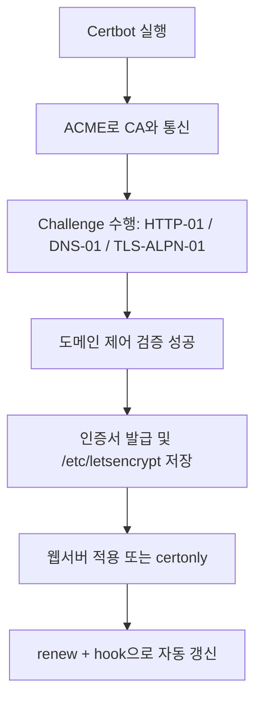

# Certbot 상세 정리

작성 기준일: 2026-04-16  
조사 방식: 웹검색 기반 최신 조사  
주요 참고: `certbot.eff.org`, `eff-certbot.readthedocs.io`, `letsencrypt.org`, `rfc-editor.org`

## 1. 문서 목적

이 문서는 `Certbot`을 처음 접하는 사람부터 이미 한두 번 써 본 사람까지, "Certbot이 정확히 무엇이고 어떤 방식으로 인증서를 발급/설치/갱신하는지"를 한 번에 이해할 수 있도록 정리한 학습 문서다.

특히 아래를 함께 설명한다.

- Certbot이 정확히 무엇인가
- Let's Encrypt와는 어떤 관계인가
- ACME는 무엇이고 왜 중요한가
- `certbot`, `certonly`, `renew` 같은 명령은 어떻게 다른가
- `apache`, `nginx`, `webroot`, `standalone`, `dns`, `manual` 플러그인은 어떤 상황에서 쓰는가
- `HTTP-01`, `DNS-01`, `TLS-ALPN-01` challenge는 어떤 차이가 있는가
- 인증서는 어디에 저장되는가
- 자동 갱신은 어떻게 돌아가는가
- hook은 언제 필요한가
- staging 환경과 rate limit는 왜 꼭 알아야 하는가

즉 이 문서는 단순 설치 명령 몇 개를 적는 문서가 아니라, "`Certbot을 운영 도구로 제대로 이해하는 문서`"다.

---

## 2. 먼저 한 줄 요약



`Certbot`은 `ACME` 프로토콜을 이용해 `Let's Encrypt` 같은 인증기관(CA)에서 공개 TLS 인증서를 자동으로 발급받고, 필요하면 웹서버 설정까지 자동으로 적용하며, 이후 정기 갱신까지 관리해 주는 클라이언트 도구다.

Certbot 공식 소개 문서는 Certbot을:

- easy-to-use client
- Let's Encrypt에서 인증서를 받아 오고
- 웹 서버에 배포(deploy)할 수 있는 도구

로 설명한다.

즉 아주 단순하게 말하면:

- 사람이 수동으로 CSR 만들고
- 도메인 소유 확인하고
- 인증서 받아서
- 서버 설정에 복사하고
- 만료 전에 다시 갱신하는

복잡한 절차를 자동화해 주는 도구다.

---

## 3. Certbot은 어디에 속한 도구인가

### 3.1 Certbot 자체

Certbot은 ACME client다.

즉:

- 인증서 발급 기관(CA) 그 자체가 아니라
- CA와 대화하는 자동화 클라이언트

다.

### 3.2 Let's Encrypt와의 관계

Certbot 소개 문서는 Certbot이 Let's Encrypt에서 인증서를 받아 온다고 설명한다.

즉:

- Let's Encrypt = 무료 공개 CA
- Certbot = 그 CA와 통신해 인증서를 발급/갱신하는 클라이언트

라고 보면 된다.

### 3.3 ACME와의 관계

RFC 8555는 ACME(Automatic Certificate Management Environment)를:

- 도메인 소유 검증
- 인증서 발급
- 일부 인증서 관리 기능

을 자동화하는 프로토콜로 설명한다.

즉 Certbot은 ACME를 구현한 클라이언트고, Let's Encrypt는 ACME를 제공하는 CA 중 하나다.

### 3.4 중요한 구조

즉 관계를 한 줄로 쓰면:

```text
사용자/서버 관리자 -> Certbot -> ACME API -> Let's Encrypt(CA)
```

이다.

이 구조를 이해하면 Certbot을 단순 "Let's Encrypt 설치 스크립트"처럼 오해하지 않게 된다.

---

## 4. Certbot이 해결하는 문제

RFC 8555는 ACME 이전 인증서 발급 과정이 보통 아래처럼 번거로웠다고 설명한다.

- CSR 생성
- CA 웹페이지 접속
- 도메인 제어 증명
- 인증서 다운로드
- 웹서버에 설치
- 만료 전 재발급

그리고 이런 과정은:

- 표준화되지 않았고
- 자동화가 어렵고
- 운영자에게 큰 부담이었다

고 설명한다.

Certbot은 이 문제를 다음 방식으로 푼다.

- ACME로 CA와 통신
- challenge 수행
- 인증서 획득
- 웹서버 적용 가능
- 자동 갱신

즉 Certbot의 본질은 "인증서 수명주기 자동화"다.

---

## 5. Certbot이 가장 잘 맞는 상황

Certbot은 특히 아래 환경에서 잘 맞는다.

- Nginx / Apache가 직접 돌아가는 서버
- Linux 서버에서 root 권한으로 운영하는 웹 서비스
- Let's Encrypt 기반 무료 DV 인증서 자동화를 원할 때
- 정적 웹, 일반 웹앱, reverse proxy, 단일 서버 운영

특히 공식 설치 문서도 Certbot이:

- 서버에서 직접 실행되고
- root 권한일 때 가장 유용하다고

설명한다.

### 5.1 반대로 덜 맞는 경우

- AWS ACM처럼 플랫폼 관리형 인증서를 쓰는 경우
- Cloudflare Tunnel 같은 외부 종단 구조
- 완전 서버리스 구조
- 컨테이너/오케스트레이션이 더 적합한 환경

즉 Certbot은 "서버에 직접 인증서를 내려서 쓰는 전통적/실용적 운영 모델"에 특히 잘 맞는다.

---

## 6. Certbot이 다루는 인증서 종류

### 6.1 보통은 DV 인증서

Let's Encrypt와 Certbot 조합은 기본적으로 domain validation(DV) 인증서 흐름에 가장 잘 맞는다.

즉:

- 도메인 제어권을 증명하면
- 그 도메인용 인증서를 발급받는다

는 모델이다.

### 6.2 무엇을 증명하나

중요한 점:

- "회사 실체 검증"
- "브랜드 실체 검증"

이 아니라,

- "이 도메인을 제어하고 있다"

를 증명하는 데 초점이 있다.

즉 Certbot은 도메인 제어 증명 자동화 도구라고 보는 것이 맞다.

---

## 7. Certbot 설치 경로와 공식 권장 방향

Certbot 공식 설치 문서는 현재 설치 경로로:

- `Snap (Recommended)`
- `Docker`
- `Pip`
- `Third Party Distributions`

를 안내한다.

### 7.1 왜 설치 방법이 중요한가

Certbot은 단순 바이너리 하나만 설치하면 끝이 아니다.

설치 방법에 따라:

- 업데이트 주기
- 자동 갱신 timer 포함 여부
- 플러그인 설치 방식

이 달라질 수 있다.

### 7.2 실무 감각

공식 문서가 권장하는 기본 흐름은:

- `certbot.eff.org/instructions`에서
- 사용 중인 웹서버와 OS 조합을 선택해
- 그 조합에 맞는 설치법을 쓰는 것

이다.

즉 블로그에 떠도는 임의 설치 스크립트를 그대로 따르기보다 공식 설치 가이드를 먼저 봐야 한다.

### 7.3 설치보다 더 중요한 것

실제로는 설치 그 자체보다:

- 어떤 plugin을 쓸지
- challenge를 어떻게 풀지
- 자동 갱신이 어떻게 돌지

가 운영상 더 중요하다.

---

## 8. Certbot의 핵심 명령 구조

Certbot man page는 아래 같은 주요 subcommand를 설명한다.

- `run`
- `certonly`
- `renew`
- `certificates`
- `revoke`
- `delete`
- `reconfigure`

즉 Certbot은 "한 번 발급"만 하는 도구가 아니라, 발급 후 lifecycle 전반을 다룬다.

### 8.1 `certbot` 또는 `certbot run`

공식 user guide는 `certbot` 기본 동작이:

- 인증서 획득
- 필요하면 웹서버 설치까지

포함한다고 설명한다.

즉 "발급 + 설치"를 같이 처리하고 싶을 때 기본 진입점이다.

### 8.2 `certbot certonly`

`certonly`는:

- 인증서만 발급/갱신
- 서버 설정은 건드리지 않음

이라는 뜻이다.

이건 매우 중요하다.

왜냐하면 많은 운영 환경에서는:

- Nginx/Apache가 아닌 다른 프록시
- 컨테이너/커스텀 배포
- 수동 배포 파이프라인

을 쓰기 때문이다.

즉 "파일만 받고 설치는 내가 하겠다"면 `certonly`가 맞다.

### 8.3 `certbot renew`

공식 user guide는 `renew`가:

- 만료가 가까운 기존 인증서를 갱신 시도하고
- 원래 발급 때 사용한 plugin과 옵션을 재사용한다고

설명한다.

즉 `renew`는 "새 인증서 신청"이 아니라 "기존 라인리지(lineage) 갱신"이다.

### 8.4 `certbot certificates`

관리 중인 인증서 목록과 경로를 보여 준다.

운영 중에는 이 명령이 꽤 유용하다.

왜냐하면:

- 어떤 도메인이 어떤 cert-name으로 저장됐는지
- 경로가 어디인지

를 확인하기 좋기 때문이다.

### 8.5 `revoke`, `delete`, `reconfigure`

- `revoke` = 인증서 취소
- `delete` = 로컬 관리 파일 정리
- `reconfigure` = 갱신/설정 변경

즉 발급 이후 관리 작업도 별도 subcommand로 분리돼 있다.

---

## 9. Certbot의 두 가지 큰 일

공식 user guide는 Certbot이 크게 두 가지 일을 한다고 설명한다.

### 9.1 인증서 획득

즉:

- challenge 수행
- 도메인 제어 증명
- 인증서 저장

### 9.2 인증서 설치

즉:

- Apache / Nginx 설정 수정
- 새 인증서 경로 적용
- 필요 시 HTTPS 설정 보강

### 9.3 왜 구분이 중요하나

운영 환경에 따라:

- 두 작업을 같이 하고 싶을 수도 있고
- 인증서만 받고 설치는 외부 시스템이 담당할 수도 있다

즉 Certbot을 쓸 때는 늘:

- `인증서 발급`
- `서버 설정 설치`

를 분리해서 생각해야 한다.

---

## 10. Plugin이란 무엇인가

Certbot user guide는 인증서를 얻을 때 `plugin`을 고르는 것이 핵심이라고 설명한다.

plugin은 크게 두 역할로 나뉜다.

- `Authenticator`
- `Installer`

### 10.1 Authenticator

도메인 제어를 증명하는 challenge를 실제로 수행한다.

예:

- webroot에 파일 놓기
- standalone 서버 띄우기
- DNS TXT 넣기

### 10.2 Installer

발급받은 인증서를 웹서버 설정에 적용한다.

예:

- Nginx 설정 수정
- Apache VirtualHost 수정

### 10.3 왜 중요한가

같은 Certbot이라도:

- challenge 수행 방식
- 웹서버 수정 여부

가 plugin 조합에 따라 달라진다.

즉 Certbot 사용법의 핵심은 사실상 "어떤 plugin 조합을 쓸 것인가"다.

---

## 11. 대표 plugin들

공식 user guide는 아래 plugin 유형을 설명한다.

- Apache
- Nginx
- Webroot
- Standalone
- DNS Plugins
- Manual

### 11.1 `--apache`

의미:

- Apache가 challenge도 처리
- 설치도 자동화 가능

즉 Apache를 직접 운영 중이고 자동 수정이 가능한 환경이면 편하다.

### 11.2 `--nginx`

의미:

- Nginx가 challenge 처리
- 설치도 자동화 가능

즉 Nginx 단일 서버 운영에서 가장 자연스럽다.

### 11.3 `--webroot`

의미:

- 이미 돌아가는 웹서버의 document root에 challenge 파일을 놓는다
- 서버 설정 자동 수정은 보통 직접 하지 않는다

즉:

- 현재 웹서버를 중단하고 싶지 않고
- 웹 루트 경로를 알고 있으며
- 설정은 내가 직접 할 때

잘 맞는다.

### 11.4 `--standalone`

의미:

- Certbot이 임시 웹서버를 직접 띄워 challenge를 처리한다

즉:

- 아직 웹서버가 없거나
- 잠깐 포트 80/443을 Certbot이 가져갈 수 있을 때

편하다.

### 11.5 `--manual`

의미:

- 사용자가 challenge를 수동 또는 스크립트 방식으로 직접 처리

즉 자동화가 어려운 특수 환경에서만 보통 쓴다.

### 11.6 DNS plugin

의미:

- DNS provider API를 써서 `_acme-challenge` TXT를 자동 생성

즉 wildcard, 비공개 웹서버, 다중 서버 구조에서 매우 중요하다.

---

## 12. Challenge란 무엇인가

Let's Encrypt challenge docs는 인증서 발급 전에 서버가 "그 도메인을 실제로 제어하고 있는지"를 확인하기 위해 challenge를 사용한다고 설명한다.

즉 challenge는:

- 도메인 제어권 증명 절차

다.

### 12.1 왜 필요한가

CA 입장에서는 아무나 `example.com` 인증서를 발급받게 하면 안 된다.

그래서:

- HTTP 응답을 확인하거나
- DNS TXT를 확인하거나
- TLS 레벨에서 특수 응답을 확인하는 식으로

제어권을 본다.

### 12.2 Certbot의 역할

Certbot은 challenge를:

- 자동으로 준비하고
- 제출하고
- 성공 여부를 확인한 뒤
- 인증서를 받아 온다

즉 challenge는 사람이 수동으로 하던 검증 단계를 ACME client가 기계적으로 수행하는 것이다.

---

## 13. HTTP-01

Let's Encrypt challenge docs는 HTTP-01을 가장 흔한 challenge 방식이라고 설명한다.

### 13.1 동작 방식

대략 흐름은 이렇다.

1. CA가 token을 준다
2. Certbot이 web server 아래 특정 경로에 파일을 둔다
3. Let's Encrypt가 `http://<domain>/.well-known/acme-challenge/<TOKEN>`를 가져와 검증한다

즉 "이 도메인의 웹서버를 실제로 제어하고 있느냐"를 확인한다.

### 13.2 장점

Let's Encrypt 문서 기준:

- 자동화가 쉽다
- 일반 웹서버에서 잘 동작한다
- 특별한 DNS API가 필요 없다

### 13.3 단점

공식 문서가 명시하는 핵심 제한:

- 포트 `80`이 열려 있어야 한다
- wildcard 인증서에는 쓸 수 없다
- 다중 웹서버면 모든 서버가 같은 challenge 응답을 해야 한다

### 13.4 언제 적합한가

- 일반 웹사이트
- 단일 Nginx/Apache 서버
- 외부에서 80 포트 접근 가능

이면 기본 선택지로 가장 자연스럽다.

### 13.5 중요한 운영 포인트

Let's Encrypt는:

- 최대 10단계 리다이렉트를 따라가고
- `http`/`https`와 포트 80/443만 허용한다고

설명한다.

즉 리버스 프록시, 리다이렉트 설정, WAF가 challenge 경로를 막지 않도록 주의해야 한다.

---

## 14. DNS-01

Let's Encrypt challenge docs는 DNS-01이:

- DNS에 특정 TXT 레코드를 두어
- 도메인 제어권을 증명하는 방식이라고

설명한다.

### 14.1 동작 방식

대략:

1. CA가 token을 준다
2. Certbot 또는 DNS plugin이 `_acme-challenge.<domain>` 아래 TXT를 생성
3. Let's Encrypt가 DNS 조회로 이 값을 확인

### 14.2 장점

공식 문서 기준:

- wildcard 인증서 발급 가능
- 여러 웹서버여도 잘 동작
- 웹서버가 외부 인터넷에 노출되지 않아도 가능

### 14.3 단점

- DNS provider API가 필요할 수 있다
- DNS 전파(propagation)를 기다려야 할 수 있다
- API 자격 증명 관리가 민감하다

### 14.4 wildcard에서 중요한 이유

Let's Encrypt 문서는 wildcard는 DNS-01만 가능하다고 명시한다.

즉:

```text
*.example.com
```

형태 인증서가 필요하면 거의 자동으로 DNS-01을 생각해야 한다.

### 14.5 보안 주의점

공식 문서도:

- DNS API 자격 증명을 웹서버에 두는 것은 위험하다고

설명한다.

즉 가능하면:

- 제한된 권한 토큰
- challenge 전용 DNS zone
- 별도 검증 서버

를 고려하는 편이 좋다.

---

## 15. TLS-ALPN-01

Let's Encrypt challenge docs는 TLS-ALPN-01을:

- 포트 443의 TLS 계층에서
- 특별한 ALPN 프로토콜과 응답을 통해 검증하는 방식이라고

설명한다.

### 15.1 장점

- 포트 80이 없어도 가능
- TLS 계층만으로 검증 가능

### 15.2 단점

- 대부분 사용자에게는 적합하지 않다
- 클라이언트/프록시 지원이 제한적이다
- wildcard에는 쓸 수 없다

### 15.3 언제 보나

보통:

- TLS termination reverse proxy 작성자
- 호스팅 제공자
- 매우 특수한 네트워크 제약 환경

에서 더 자주 본다.

즉 일반적인 Nginx/Apache 운영자는 HTTP-01이나 DNS-01을 먼저 본다.

---

## 16. Certbot에서 challenge와 plugin이 어떻게 연결되나

### 16.1 `nginx` / `apache`

보통 HTTP-01을 자연스럽게 처리한다.

### 16.2 `webroot`

역시 HTTP-01 계열이다.

### 16.3 `standalone`

HTTP-01 또는 환경에 따라 TLS-ALPN-01을 지원할 수 있지만, 일반적으로는 임시 서버 기반 검증으로 생각하면 된다.

### 16.4 DNS plugin

DNS-01에 해당한다.

### 16.5 `manual`

HTTP-01 / DNS-01 등 challenge 준비를 직접 수행할 수 있게 해 준다.

즉 Certbot을 잘 쓰려면 command만 외울 게 아니라:

- 어떤 plugin을 고르면
- 어떤 challenge 방식으로
- 어떤 네트워크/권한 요구가 생기는지

를 연결해서 봐야 한다.

---

## 17. 대표 사용 시나리오

### 17.1 단일 Nginx 서버

가장 흔하다.

보통:

```bash
certbot --nginx -d example.com -d www.example.com
```

처럼 생각할 수 있다.

의미:

- challenge와 설치를 Nginx plugin이 담당

### 17.2 이미 잘 운영 중인 웹서버, 설정 자동 수정은 싫다

보통:

```bash
certbot certonly --webroot -w /var/www/html -d example.com
```

같은 흐름이 자연스럽다.

의미:

- 인증서만 받음
- challenge는 webroot
- 실제 Nginx/Apache 설정은 직접 관리

### 17.3 웹서버가 아직 없거나 잠깐 내려도 된다

보통:

```bash
certbot certonly --standalone -d example.com
```

### 17.4 wildcard 인증서

보통:

```bash
certbot certonly --dns-... -d example.com -d '*.example.com'
```

처럼 DNS plugin 기반으로 간다.

즉 wildcard 요구가 나오면 거의 바로 DNS-01을 떠올리면 된다.

---

## 18. Certbot이 인증서를 저장하는 위치

공식 user guide와 backwards compatibility 문서는 Certbot이 주로 `/etc/letsencrypt` 아래를 사용한다고 설명한다.

### 18.1 가장 중요한 경로

공식 문서가 stable behavior 대상으로 명시한 경로:

```text
/etc/letsencrypt/live/$domain/{cert,chain,fullchain,privkey}.pem
```

즉 운영 중 서버 설정에서 제일 많이 참조하는 곳은 `live`다.

### 18.2 왜 `live`가 중요한가

Certbot 문서는:

- 직접 파일 복사보다
- 서버 설정이 `live` 경로를 가리키도록 두는 것을 권장한다

즉 renewal 시 symlink 갱신만으로 새 인증서를 반영하기 쉽게 한다.

### 18.3 다른 디렉터리

일반적으로 `/etc/letsencrypt` 아래에는 이런 것들이 같이 있다.

- `live/`
- `archive/`
- `renewal/`
- `renewal-hooks/`

### 18.4 `live`와 `archive` 차이

실무 감각으로는:

- `live/` = 현재 사용해야 하는 최신 경로
- `archive/` = 실제 버전별 파일 저장

로 이해하면 된다.

즉 서버 설정은 보통 `live/`를 보게 두는 편이 안전하다.

### 18.5 `renewal/`

이 디렉터리에는 각 인증서 라인리지의 갱신 설정이 들어간다.

공식 user guide는 이 파일을 수동으로 함부로 수정하는 것을 권장하지 않는다.

즉 renewal config는 조심해서 다뤄야 한다.

---

## 19. Lineage와 cert-name

### 19.1 왜 중요한가

Certbot은 인증서를 단발성 파일 몇 개로 다루지 않고, `lineage`라는 개념으로 관리한다.

즉:

- 같은 인증서 계열의 갱신 이력과 설정을 묶어서 관리

한다.

### 19.2 `cert-name`

공식 문서는 `--cert-name`이 lineage 이름과 연결된다고 설명한다.

즉:

- 어떤 도메인을 담은 인증서인지
- 갱신 설정이 어느 lineage에 속하는지

를 관리하는 이름이다.

### 19.3 왜 신경 써야 하나

같은 도메인으로 여러 번 발급하다 보면:

- `example.com`
- `example.com-0001`

같이 이름이 늘어날 수 있다.

운영이 복잡해지면:

- 의도한 lineage가 맞는지
- 새 인증서를 만든 건지 기존을 갱신한 건지

를 구분해야 한다.

---

## 20. 자동 갱신

### 20.1 Certbot의 핵심은 발급보다 갱신

인증서는 만료된다.

즉 Certbot의 진짜 운영 가치는:

- 처음 발급보다
- 만료 전에 반복적으로 자동 갱신되는 것

에 있다.

### 20.2 공식 문서 기준

Certbot user guide는:

- 대부분의 설치 방식에서 자동 갱신이 미리 구성돼 있고
- 주기적으로 `certbot renew`가 실행된다고

설명한다.

### 20.3 어떻게 확인하나

공식 문서가 권장하는 확인 방법:

- 설치 방식별 `certbot.eff.org/instructions` 확인
- Linux/BSD라면 cron 또는 systemd timer 확인

즉 "설치했으니 알아서 되겠지"라고 추정하지 말고 실제 갱신 스케줄을 확인해야 한다.

### 20.4 `renew`의 동작

공식 문서 기준:

- 만료가 가까운 인증서만 시도
- 원래 plugin/옵션 재사용
- `--dry-run`으로 미래 갱신 테스트 가능

즉 운영에서는 `certbot renew --dry-run`이 매우 중요한 검증 명령이다.

### 20.5 자동 갱신이 중요한 이유

Let's Encrypt 인증서는 비교적 짧은 주기다.

즉 수동 갱신에 의존하면 언젠가 사고가 난다.

실무에서 Certbot은 사실상:

- "자동 갱신 파이프라인"

으로 이해하는 편이 맞다.

---

## 21. Hook

### 21.1 왜 필요한가

갱신 후에는 종종 후속 작업이 필요하다.

예:

- 웹서버 reload
- 프록시 재시작
- 다른 위치로 인증서 복사
- 컨테이너 재배포

이걸 위해 hook이 있다.

### 21.2 종류

공식 man page는:

- `--pre-hook`
- `--post-hook`
- `--deploy-hook`

를 설명한다.

### 21.3 `pre-hook`

인증서 갱신 시도 전에 실행한다.

주 용도:

- standalone plugin과 충돌하는 웹서버 중지

### 21.4 `post-hook`

갱신 시도 후 실행한다.

주 용도:

- 중지했던 서버 재시작

### 21.5 `deploy-hook`

성공적으로 발급/갱신된 인증서마다 실행된다.

공식 문서에 따르면 환경 변수도 제공된다.

- `$RENEWED_LINEAGE`
- `$RENEWED_DOMAINS`

즉 실제로 새 인증서가 생겼을 때만 후속 배포 작업을 하기에 적합하다.

### 21.6 hook directory

backwards compatibility 문서는 hook directories in `/etc/letsencrypt/renewal-hooks`를 stable behavior 대상 중 하나로 설명한다.

즉:

- `/etc/letsencrypt/renewal-hooks/pre`
- `/etc/letsencrypt/renewal-hooks/post`
- `/etc/letsencrypt/renewal-hooks/deploy`

구조를 운영 포인트로 기억하면 된다.

---

## 22. 스테이징 환경

### 22.1 왜 필요한가

Let's Encrypt rate limits 문서는 테스트/개발 중에는 production API 대신 staging environment를 사용하라고 명확히 권장한다.

즉:

- 설정 실험
- challenge 디버깅
- 자동화 스크립트 검증

중에 production endpoint를 계속 때리면 안 된다.

### 22.2 Certbot에서 어떻게 쓰나

공식 man page와 user guide는:

- `--dry-run`
- `--test-cert`
- `--server`

같은 옵션을 설명한다.

실무 감각으로는:

- 기능 테스트/초기 셋업 검증 -> staging
- 진짜 운영 인증서 발급 -> production

으로 나눈다.

### 22.3 왜 중요한가

rate limit를 넘기면:

- 바로 풀어 달라고 요청할 수 없는 경우가 많고
- 시간이 지나야 회복된다

즉 초기 셋업을 production에서 마구 반복하는 것은 나쁜 습관이다.

---

## 23. Rate Limits

Let's Encrypt rate limits 문서는 현재 생산 환경에서 중요한 여러 제한을 설명한다.

### 23.1 왜 있는가

공식 설명:

- 공정 사용 보장
- 시스템 남용 방지
- 대규모 발급 부하 제어

### 23.2 실무적으로 자주 맞닥뜨리는 것

문서상 특히 중요하게 봐야 할 제한:

- `New Orders per Account`
- `New Certificates per Registered Domain`
- `New Certificates per Exact Set of Identifiers`
- `Authorization Failures per Identifier per Account`

### 23.3 대표 제한 예시

Let's Encrypt 문서 기준 현재 대표 값 중 일부:

- 계정당 3시간에 최대 300 new orders
- 등록 도메인당 7일에 최대 50 certificates
- 동일 exact set identifiers당 7일에 최대 5 certificates

즉 실수로 배포 파이프라인이 계속 새 인증서를 만들면 금방 막힐 수 있다.

### 23.4 그래서 중요한 실무 원칙

- 테스트는 staging에서
- 기존 lineage 재사용
- 불필요한 재발급 반복 금지
- 동일 도메인 집합으로 디버깅 반복 금지

즉 "인증서 발급도 API 자원"이라는 감각이 필요하다.

---

## 24. 와일드카드 인증서

### 24.1 무엇인가

예:

```text
*.example.com
```

형태 인증서다.

즉 여러 하위 도메인을 포괄한다.

### 24.2 Certbot에서 중요한 포인트

Let's Encrypt challenge docs가 명시하듯 wildcard는 `DNS-01`로만 검증 가능하다.

즉:

- `HTTP-01` 불가
- `TLS-ALPN-01` 불가

다.

### 24.3 운영 관점

wildcard는 편하지만:

- DNS API 자동화 필요
- 권한 관리 민감
- 모든 하위 서비스에 동일 인증서 범위가 미칠 수 있음

즉 편리성과 보안 경계를 같이 봐야 한다.

---

## 25. 웹서버가 여러 대일 때

이건 challenge 선택에 직접 영향을 준다.

### 25.1 HTTP-01

Let's Encrypt 문서는 여러 웹서버가 있다면 challenge 파일이 모든 서버에서 동일하게 제공돼야 한다고 설명한다.

즉 로드밸런서 뒤에 여러 대가 있으면:

- 공유 webroot
- sticky routing
- 일관된 배포

가 필요하다.

### 25.2 DNS-01

다중 서버 구조에 더 자연스럽다.

왜냐하면 웹서버 접근이 아니라 DNS 제어권만 보면 되기 때문이다.

### 25.3 실무 감각

- 단일 서버 -> HTTP-01 쉬움
- 다중 서버 / private origin / wildcard -> DNS-01 유리

라고 정리하면 된다.

---

## 26. 포트 80과 443은 왜 중요한가

### 26.1 HTTP-01은 포트 80이 필요

Let's Encrypt challenge docs는 HTTP-01이 port 80에서만 가능하다고 명시한다.

즉:

- 포트 80이 막혀 있거나
- 리버스 프록시/WAF가 접근을 차단하면

검증이 실패한다.

### 26.2 TLS-ALPN-01은 443 기반

즉 80이 불가능한 특별한 환경에서 TLS 계층 검증을 택할 수는 있지만, 일반적이지는 않다.

### 26.3 "HTTPS만 열어 두면 충분한가?"

HTTP-01 기준으로는 아니다.

즉 "운영 서비스는 443만 쓰더라도 인증서 bootstrap을 위해 80을 열어 둬야 할 수 있다"는 점을 기억해야 한다.

---

## 27. 인증서를 설치할 때 중요한 파일

공식 문서가 stable behavior 대상으로 명시한 대표 파일:

- `cert.pem`
- `chain.pem`
- `fullchain.pem`
- `privkey.pem`

위치는 보통:

```text
/etc/letsencrypt/live/<cert-name>/
```

### 27.1 실무 감각

보통 웹서버 설정은 아래 조합을 많이 쓴다.

- 서버 인증서 -> `fullchain.pem`
- 개인키 -> `privkey.pem`

왜냐하면 `fullchain.pem`에는 leaf + intermediate chain이 포함되기 때문이다.

### 27.2 직접 복사보다 참조가 낫다

공식 문서도 복사보다 경로 참조를 권장한다.

즉 renewal 시 파일 교체를 더 자연스럽게 따라간다.

---

## 28. RSA와 ECDSA

공식 user guide는 RSA와 ECDSA key type 변경도 다룬다.

즉 Certbot은 단순 발급만이 아니라:

- 어떤 키 타입을 쓸지도

운영 설정의 일부가 될 수 있다.

실무 감각으로는:

- 호환성 우선 -> RSA
- 현대적 경량/효율 -> ECDSA 고려

같이 판단할 수 있다.

즉 Certbot은 "CA와만 대화"하는 도구가 아니라 TLS 운영 파라미터도 일부 다루는 도구다.

---

## 29. Certbot이 안 맞는 경우

### 29.1 서버를 직접 만질 수 없는 경우

예:

- 완전 관리형 PaaS
- 서버 없는 플랫폼

이런 환경은 플랫폼 자체 인증서 기능이 더 자연스러울 수 있다.

### 29.2 외부 LB/Ingress가 TLS를 종단하는 경우

예:

- AWS ACM + ALB
- Cloudflare 프록시
- Kubernetes ingress controller 자체 ACME

즉 Certbot을 origin 서버에 두는 게 최적이 아닐 수 있다.

### 29.3 너무 복잡한 다중 환경

예:

- 수십~수백 서비스
- 중앙 secret distribution
- 컨테이너 기반 다중 노드

이런 경우는 cert-manager, Traefik, Caddy, 내부 PKI 자동화가 더 맞을 수 있다.

즉 Certbot은 훌륭하지만 만능은 아니다.

---

## 30. 자주 하는 실수

### 30.1 production API로 계속 테스트

가장 흔한 실수다.

반드시 staging과 `--dry-run`을 먼저 써야 한다.

### 30.2 `for one server` 설정을 다중 서버에 그대로 적용

HTTP-01은 여러 서버 구조에서 challenge 파일 일관성이 중요하다.

### 30.3 wildcard를 HTTP-01로 하려 함

공식 문서상 안 된다.

### 30.4 `/etc/letsencrypt/renewal/`을 수동으로 마구 수정

공식 user guide가 권장하지 않는다.

### 30.5 웹서버 설정에서 `archive/`를 직접 바라봄

보통은 `live/`를 보게 두는 것이 더 안전하다.

### 30.6 `forEach(async ...)`처럼 갱신 후처리를 부정확하게 짬

Certbot hook도 결국 셸/명령 흐름이므로:

- reload 타이밍
- 오류 처리
- idempotency

를 명확히 설계해야 한다.

즉 인증서 자동화도 운영 코드다.

---

## 31. 실무 체크리스트

### 31.1 시작 전

- 도메인이 올바르게 DNS 설정되어 있는가
- 80/443 포트 조건이 challenge 방식과 맞는가
- 단일 서버인지 다중 서버인지
- wildcard가 필요한지

### 31.2 plugin 선택

- Apache/Nginx 직접 운영 -> 해당 installer plugin
- 설정 자동 수정은 싫음 -> `certonly + webroot`
- 웹서버 잠깐 중단 가능 -> `standalone`
- wildcard / private origin -> DNS plugin

### 31.3 운영

- 자동 갱신이 실제 구성되어 있는가
- `certbot renew --dry-run`이 성공하는가
- 갱신 후 reload/deploy hook이 필요한가
- rate limit를 staging으로 회피하고 있는가

### 31.4 보안

- DNS API 자격 증명 범위를 최소화했는가
- `privkey.pem` 접근 권한을 최소화했는가
- 서버 설정이 `live/` 경로를 참조하는가

---

## 32. 추천 학습 순서

Certbot을 처음부터 제대로 잡으려면 아래 순서가 좋다.

### 1단계: 큰 그림

- Certbot
- Let's Encrypt
- ACME

### 2단계: challenge

- HTTP-01
- DNS-01
- TLS-ALPN-01

### 3단계: plugin 선택

- nginx
- apache
- webroot
- standalone
- dns

### 4단계: 운영

- `run`
- `certonly`
- `renew`
- `certificates`
- hook
- `--dry-run`

### 5단계: 고급 운영

- wildcard
- multiple servers
- rate limits
- key type
- staging vs production

이 순서로 보면 "명령 암기"보다 운영 감각이 먼저 생긴다.

---

## 33. 한 문장 결론

Certbot은 단순히 무료 인증서를 한 번 받아 오는 스크립트가 아니라, ACME를 통해 도메인 제어 검증부터 인증서 발급, 설치, 갱신, 후속 배포까지 이어지는 TLS 인증서 수명주기 자동화 도구다.

즉 Certbot을 제대로 이해한다는 것은:

- 어떤 challenge를 선택할지
- 어떤 plugin이 환경에 맞는지
- 인증서 파일이 어디에 저장되는지
- 자동 갱신과 hook이 어떻게 동작하는지
- staging과 rate limit를 어떻게 다뤄야 하는지

를 함께 이해하는 것을 뜻한다.

---

## 34. 공식 출처

- Certbot introduction: <https://eff-certbot.readthedocs.io/en/stable/intro.html>
- Certbot installation guide: <https://eff-certbot.readthedocs.io/en/stable/install.html>
- Certbot interactive instructions: <https://certbot.eff.org/instructions>
- Certbot user guide: <https://eff-certbot.readthedocs.io/en/stable/using.html>
- Certbot man page: <https://eff-certbot.readthedocs.io/en/latest/man/certbot.html>
- Certbot backwards compatibility: <https://eff-certbot.readthedocs.io/en/stable/compatibility.html>
- Let's Encrypt challenge types: <https://letsencrypt.org/docs/challenge-types/>
- Let's Encrypt rate limits: <https://letsencrypt.org/docs/rate-limits/>
- RFC 8555, ACME: <https://www.rfc-editor.org/info/rfc8555>
