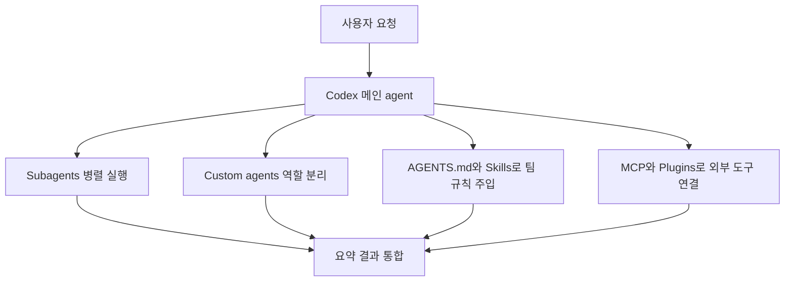
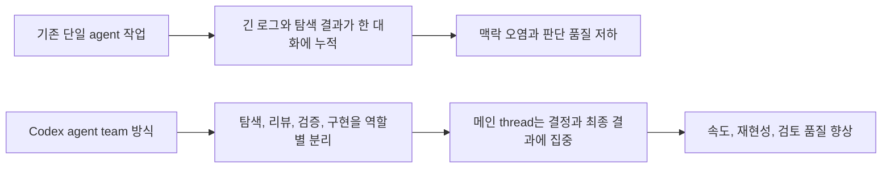
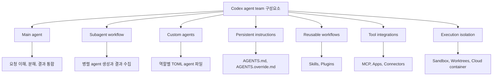
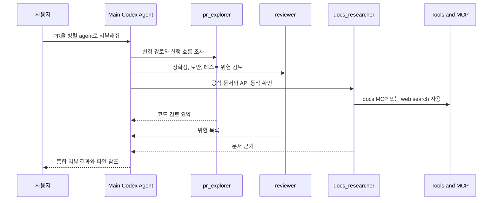
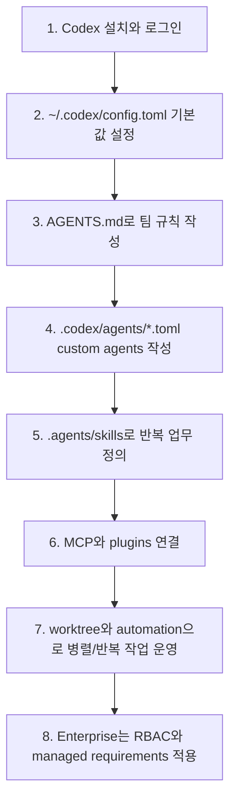
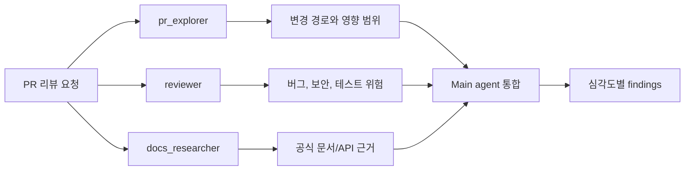
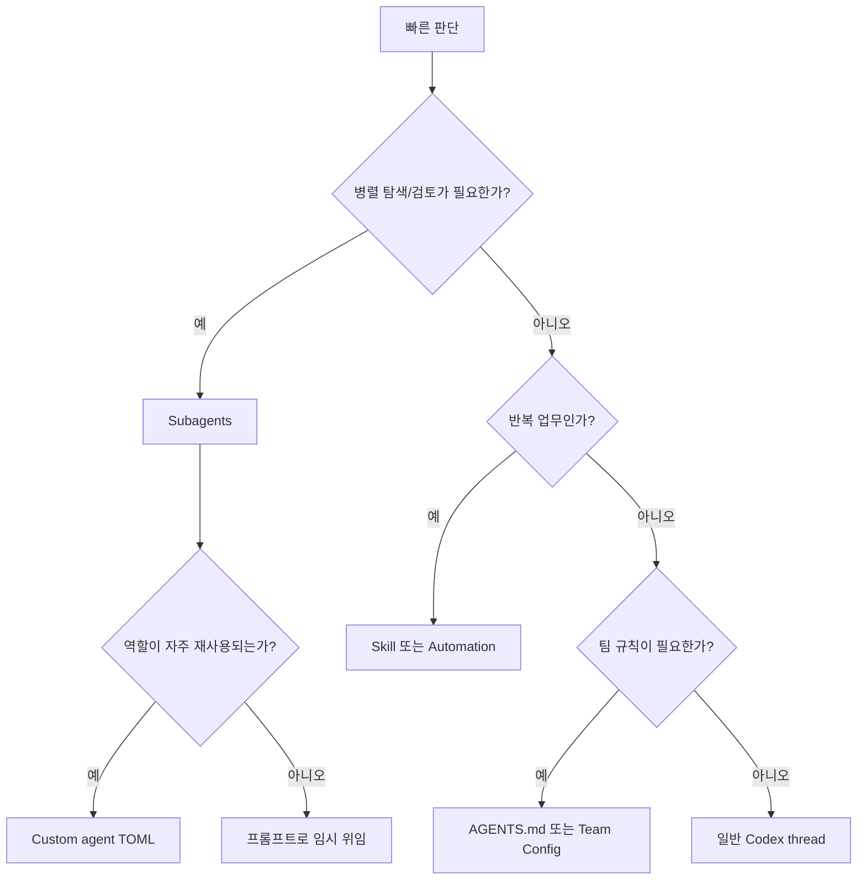

# Codex Agent Team

- 검증 기준일: 2026-05-28
- 범위: Codex app, Codex CLI, subagents, custom agents, AGENTS.md, skills, plugins, MCP, worktrees, automations, enterprise governance
- 결론: Codex에는 "Agent Team"이라는 단일 제품 메뉴만으로 닫힌 개념은 아니지만, 여러 전문 agent를 병렬로 실행하고 팀 규칙과 도구를 공유하는 "agent team"형 구성 요소가 있다.

## 1. 한 줄 요약



- Codex도 실질적으로는 "AGENT 팀"처럼 쓸 수 있다.
- 핵심은 `subagents`와 `custom agents`다.
- 여기에 `AGENTS.md`, `Skills`, `Plugins`, `MCP`, `Worktrees`, `Automations`, `Team Config`를 붙이면 개인용 agent 보조 도구가 아니라 팀 단위 개발 워크플로로 운영할 수 있다.
- 정확히 말하면:
  - `subagents`: 하나의 요청을 여러 agent에게 나눠 병렬 처리한다.
  - `custom agents`: 리뷰어, 조사자, 구현자 같은 역할별 agent 프로필을 만든다.
  - `AGENTS.md`: 팀/프로젝트 규칙을 모든 작업에 주입한다.
  - `Skills`: 반복 업무 절차를 재사용 가능한 능력으로 만든다.
  - `Worktrees`: 여러 작업을 같은 repo 안에서 충돌 없이 병렬 진행한다.

## 2. 왜 중요한가



- 큰 코드베이스에서는 한 agent가 탐색, 구현, 테스트, 문서 확인, 리뷰를 모두 떠안으면 대화 맥락이 빠르게 지저분해진다.
- Codex subagent 문서는 이 문제를 `context pollution`, `context rot` 관점에서 설명하고, noisy work를 하위 agent로 분리하는 방식을 권장한다.
- 팀 입장에서 중요한 효과:
  - 병렬화: 보안 리뷰, 테스트 공백 확인, 문서 검증, UI 재현을 동시에 진행할 수 있다.
  - 표준화: `AGENTS.md`, `.codex/config.toml`, `.agents/skills`로 팀 규칙을 공유할 수 있다.
  - 격리: Codex app의 worktree 기능으로 여러 작업이 같은 local checkout을 망가뜨리지 않게 할 수 있다.
  - 운영화: automations로 PR 점검, 버그 triage, 문서 갱신 같은 반복 업무를 주기적으로 돌릴 수 있다.
  - 보안 통제: sandbox, approvals, network allowlist, RBAC, managed requirements로 agent 권한을 제한할 수 있다.

## 3. 핵심 개념



- Main agent
  - 사용자가 직접 대화하는 Codex agent다.
  - 작업 분해, subagent 호출, 결과 통합, 최종 응답을 담당한다.

- Subagent workflow
  - Codex가 여러 전문 agent를 병렬로 띄우고 결과를 모아 하나의 응답으로 정리하는 흐름이다.
  - Codex는 subagent를 자동으로 막 띄우지 않는다. 사용자가 "spawn agents", "delegate in parallel", "use one agent per point"처럼 명시적으로 요청해야 한다.

- Subagent
  - 메인 agent가 특정 task를 맡기기 위해 시작하는 위임 agent다.
  - 예: 보안 위험만 보는 agent, 테스트 공백만 보는 agent, 문서/API 확인만 하는 agent.

- Agent thread
  - CLI에서 `/agent`로 전환하거나 확인할 수 있는 agent별 thread다.
  - 비활성 thread에서도 승인 요청이 올라올 수 있으므로 어떤 agent가 어떤 작업을 요청했는지 확인해야 한다.

- Custom agent
  - 사용자가 직접 정의하는 역할별 agent다.
  - 개인용은 `~/.codex/agents/*.toml`, 프로젝트용은 `<repo>/.codex/agents/*.toml`에 둔다.
  - 필수 필드는 `name`, `description`, `developer_instructions`다.

- AGENTS.md
  - Codex가 작업 전 읽는 지속 지침 파일이다.
  - 글로벌, 프로젝트 루트, 하위 디렉터리 규칙을 계층적으로 합친다.
  - 가까운 디렉터리의 규칙이 나중에 붙으므로 더 구체적인 지침으로 작동한다.

- Skills
  - 반복 업무 절차를 `SKILL.md` 중심의 폴더로 정의한 것이다.
  - Codex는 처음에는 skill 이름/설명/path만 보고, 필요할 때 전체 `SKILL.md`를 읽는다.

- Plugins와 MCP
  - Plugin은 skills, app integrations, MCP 서버를 묶어 배포하는 단위다.
  - MCP는 Codex가 외부 문서, 브라우저, Figma, 사내 도구 같은 context와 tool에 접근하게 해준다.

- Worktrees
  - Codex app에서 같은 Git repo의 별도 checkout을 만들어 병렬 작업을 안전하게 격리한다.

- Automations
  - 반복 Codex 작업을 백그라운드로 예약 실행한다.
  - Git repo에서는 local project나 dedicated worktree 중 실행 위치를 선택할 수 있다.

## 4. 아키텍처 또는 흐름



- Codex agent team은 보통 아래 계층으로 생각하면 이해하기 쉽다.

| 계층 | 구성 요소 | 역할 |
|---|---|---|
| 대화/오케스트레이션 | Main agent, thread | 요청 해석, 작업 분해, 결과 통합 |
| 역할 분리 | Built-in agents, custom agents | 탐색자, 리뷰어, 구현자, 문서 조사자 등 |
| 규칙 주입 | AGENTS.md, AGENTS.override.md | 프로젝트/팀 규칙, 테스트 명령, 금지 작업 |
| 반복 절차 | Skills | 릴리즈, 리뷰, 문서화, QA 같은 업무 절차 재사용 |
| 외부 도구 | Plugins, MCP, Apps | GitHub, Slack, Drive, Figma, 브라우저, 문서 검색 |
| 실행 격리 | Sandbox, worktrees, cloud container | 파일 쓰기, 네트워크, 병렬 작업 격리 |
| 조직 통제 | Team Config, RBAC, requirements.toml | 팀 표준, 권한, 보안 정책 배포 |

- Codex local과 Codex cloud는 역할이 다르다.
  - Codex local: app, CLI, IDE extension이 개발자 컴퓨터에서 sandbox 기반으로 실행된다.
  - Codex cloud: GitHub repo와 연결된 hosted container에서 실행된다.
  - Enterprise에서는 local, cloud, 둘 다 중 어떤 surface를 쓸지 정하고 RBAC로 접근을 제어한다.

## 5. 세팅 방법, 중요 디테일, 트레이드오프



### 5.1 Codex 설치와 로그인

- Codex app
  - macOS 또는 Windows 앱을 설치한다.
  - ChatGPT 계정 또는 OpenAI API key로 로그인한다.
  - 공식 문서상 API key 로그인은 일부 cloud thread 기능이 제한될 수 있다.

- Codex CLI

```bash
curl -fsSL https://chatgpt.com/codex/install.sh | sh
codex
```

- 첫 실행 시 ChatGPT 계정 또는 API key 인증을 진행한다.
- CLI는 터미널에서 로컬 디렉터리의 코드를 읽고, 변경하고, 명령을 실행할 수 있다.

### 5.2 개인/팀 기본 설정: `config.toml`

- 개인 기본값은 `~/.codex/config.toml`에 둔다.
- 프로젝트 공유 기본값은 trusted project의 `<repo>/.codex/config.toml`에 둔다.
- 설정 우선순위는 대략 CLI flag, project config, profile, user config, system config, built-in defaults 순서다.

```toml
# ~/.codex/config.toml
model = "gpt-5.5"
approval_policy = "on-request"
sandbox_mode = "workspace-write"
model_reasoning_effort = "high"
web_search = "cached"

[agents]
max_threads = 6
max_depth = 1
```

- `agents.max_threads`
  - 동시에 열어둘 agent thread 수를 제한한다.
  - 공식 문서의 기본값은 6이다.

- `agents.max_depth`
  - agent가 다시 child agent를 만들 수 있는 깊이를 제어한다.
  - 기본값 1을 유지하는 편이 예측 가능하다.

- 트레이드오프
  - 병렬 agent 수가 많을수록 속도는 좋아질 수 있지만 token 비용과 로컬 리소스 사용량이 증가한다.
  - `max_depth`를 높이면 recursive fan-out으로 비용과 지연이 커질 수 있다.

### 5.3 팀 규칙: `AGENTS.md`

- 글로벌 규칙:

```md
# ~/.codex/AGENTS.md

## Working agreements

- 답변은 한국어로 한다.
- 코드 수정 후 관련 테스트를 실행한다.
- 새 production dependency 추가 전 확인을 받는다.
- 변경 범위를 요청과 직접 관련된 파일로 제한한다.
```

- repo 공통 규칙:

```md
# <repo>/AGENTS.md

## Repository expectations

- TypeScript 변경 후 `pnpm typecheck`를 실행한다.
- UI 변경 후 브라우저에서 주요 화면을 확인한다.
- PR 전 `pnpm lint`와 관련 테스트를 통과시킨다.
```

- 하위 팀/서비스 override:

```md
# <repo>/services/payments/AGENTS.override.md

## Payments service rules

- 결제 로직 변경 시 `make test-payments`를 실행한다.
- API key, webhook secret, billing plan 변경은 보안 담당자 확인 없이 진행하지 않는다.
```

- 검증 명령 예시:

```bash
codex --ask-for-approval never "Summarize the current instructions."
codex --cd services/payments --ask-for-approval never "Show which instruction files are active."
```

- 트레이드오프
  - `AGENTS.md`는 매우 강력하지만 너무 길면 instruction budget을 잡아먹는다.
  - 공통 규칙은 루트에, 서비스별 규칙은 해당 하위 폴더에 두는 식으로 나눠야 한다.
  - 기존 팀 문서명이 `TEAM_GUIDE.md`라면 `project_doc_fallback_filenames`로 등록할 수 있다.

```toml
# ~/.codex/config.toml
project_doc_fallback_filenames = ["TEAM_GUIDE.md", ".agents.md"]
project_doc_max_bytes = 65536
```

### 5.4 역할별 custom agents

- 프로젝트에 역할별 agent를 정의한다.

```text
<repo>/
  .codex/
    config.toml
    agents/
      pr-explorer.toml
      reviewer.toml
      docs-researcher.toml
      ui-fixer.toml
```

- PR 탐색 agent:

```toml
# <repo>/.codex/agents/pr-explorer.toml
name = "pr_explorer"
description = "Read-only codebase explorer for gathering evidence before changes are proposed."
model = "gpt-5.4-mini"
model_reasoning_effort = "medium"
sandbox_mode = "read-only"

developer_instructions = """
Stay in exploration mode.
Trace real execution paths, cite files and symbols, and avoid proposing fixes unless the parent agent asks for them.
Prefer fast search and targeted file reads over broad scans.
"""
```

- 리뷰 agent:

```toml
# <repo>/.codex/agents/reviewer.toml
name = "reviewer"
description = "PR reviewer focused on correctness, security, regressions, and missing tests."
model = "gpt-5.4"
model_reasoning_effort = "high"
sandbox_mode = "read-only"

developer_instructions = """
Review code like a senior owner.
Prioritize correctness, security, behavior regressions, and missing test coverage.
Lead with concrete findings and file references.
Avoid style-only comments unless they hide a real issue.
"""
```

- 문서/API 검증 agent:

```toml
# <repo>/.codex/agents/docs-researcher.toml
name = "docs_researcher"
description = "Documentation specialist that verifies APIs and framework behavior."
model = "gpt-5.4-mini"
model_reasoning_effort = "medium"
sandbox_mode = "read-only"

developer_instructions = """
Verify API behavior against official documentation.
Return concise answers with links or exact references.
Do not edit code.
"""

[mcp_servers.openaiDeveloperDocs]
url = "https://developers.openai.com/mcp"
```

- 트레이드오프
  - `read-only` agent는 안전하지만 수정은 못 한다.
  - 구현 agent는 `workspace-write`가 필요할 수 있지만, 병렬 쓰기 작업은 충돌을 만들 수 있다.
  - 따라서 기본 패턴은 "여러 read-only agent로 조사/검증 -> 하나의 worker agent가 수정"이다.

### 5.5 반복 업무 절차: Skills

- repo-scoped skill 구조:

```text
<repo>/
  .agents/
    skills/
      pr-review/
        SKILL.md
        references/
        scripts/
```

- 최소 skill 예시:

```md
---
name: "pr-review"
description: "Use when reviewing a branch or PR for correctness, security, regressions, and missing tests."
---

# PR Review

- Compare the current branch against the base branch.
- Prioritize correctness, security, behavior regressions, and missing tests.
- Lead with actionable findings and file references.
- Do not report style-only issues unless they hide real risk.
```

- skill 호출 방식:
  - 명시 호출: `$pr-review`
  - CLI/IDE에서 `/skills` 또는 `$` 입력
  - 설명이 task와 맞으면 Codex가 암묵적으로 선택 가능

- skill 저장 위치:
  - repo: `$CWD/.agents/skills`, `$REPO_ROOT/.agents/skills`
  - user: `$HOME/.agents/skills`
  - admin: `/etc/codex/skills`
  - system: Codex에 번들된 기본 skill

### 5.6 MCP와 Plugins 연결

- MCP CLI 추가 예시:

```bash
codex mcp add context7 -- npx -y @upstash/context7-mcp
```

- `config.toml` 직접 설정 예시:

```toml
# ~/.codex/config.toml 또는 <repo>/.codex/config.toml
[mcp_servers.context7]
command = "npx"
args = ["-y", "@upstash/context7-mcp"]
env_vars = ["LOCAL_TOKEN"]

[mcp_servers.figma]
url = "https://mcp.figma.com/mcp"
bearer_token_env_var = "FIGMA_OAUTH_TOKEN"

[mcp_servers.chrome_devtools]
url = "http://localhost:3000/mcp"
```

- Plugin은 skills, apps, MCP servers를 묶는 배포 단위다.
- Codex app에서는 Plugins 화면에서 설치한다.
- CLI에서는:

```text
codex
/plugins
```

- 트레이드오프
  - MCP와 plugin은 agent team의 "도구 손발"을 늘려준다.
  - 반대로 외부 서비스 인증, 데이터 공유, destructive action 승인 정책을 반드시 같이 설계해야 한다.

### 5.7 Worktrees와 Automations

- Worktree 사용 흐름:
  - Codex app에서 새 thread 생성
  - composer 아래에서 `Worktree` 선택
  - 시작 branch 선택
  - prompt 제출
  - Codex가 별도 Git worktree에서 작업
  - 필요하면 branch 생성, commit, push, PR 생성

- 적합한 작업:
  - 기능 구현 후보를 여러 개 병렬 실험
  - QA 수정과 문서 수정 동시 진행
  - 자동화가 local checkout을 건드리지 않게 격리

- Automation 사용 흐름:
  - Codex app sidebar의 Automations에서 생성
  - 작업 prompt, schedule, 대상 project, local/worktree 실행 위치 선택
  - 반복 실행 결과는 Triage inbox로 들어온다.

- automation prompt 예시:

```md
Every weekday at 9 AM, use $pr-review to check open pull requests in this repository.
Report only actionable correctness, security, regression, or missing-test issues.
Run in a dedicated worktree.
```

- 트레이드오프
  - automations는 기본 sandbox 설정을 따른다.
  - full access와 background automation 조합은 위험하므로, read-only 또는 workspace-write 중심으로 시작하는 편이 낫다.
  - Git repo에서는 dedicated worktree를 쓰는 편이 unfinished local work와 충돌이 적다.

### 5.8 Enterprise와 팀 운영 세팅

- 먼저 결정할 것:
  - Codex local만 쓸지
  - Codex cloud도 쓸지
  - 둘 다 쓸지

- Enterprise rollout owner:
  - ChatGPT Enterprise workspace owner: workspace 설정
  - Security owner: sandbox, approvals, network, MCP 정책
  - Analytics owner: compliance와 analytics API

- workspace 설정:
  - `Allow members to use Codex Local` 활성화
  - cloud 사용 시 GitHub Connector 활성화
  - `Allow members to use Codex cloud` 활성화
  - RBAC로 `Codex Users`, `Codex Admin` 분리

- Team Config 구조:

```text
<repo>/
  .codex/
    config.toml
    rules/
      default.rules
    skills/
      shared-review/
        SKILL.md
```

- 관리형 requirements 예시:

```toml
# requirements.toml
enforce_residency = "us"
allowed_approval_policies = ["on-request"]
allowed_sandbox_modes = ["read-only", "workspace-write"]

[rules]
prefix_rules = [
  { pattern = [{ any_of = ["bash", "sh", "zsh"] }], decision = "prompt", justification = "Require explicit approval for shell entrypoints" },
]
```

- 보안 baseline:
  - network는 기본 off로 시작한다.
  - dependency 설치나 외부 API가 필요한 경우 domain allowlist 중심으로 연다.
  - MCP server는 allowlist를 적용한다.
  - GitHub cloud task는 least-privilege token, branch protection, repo 권한 모델과 함께 운영한다.

## 6. 실전 예시



### 6.1 PR 리뷰 팀

- 목적:
  - 변경 branch를 여러 관점에서 병렬 검토한다.

- prompt:

```md
Review this branch against main with parallel subagents.

- Have pr_explorer map the affected code paths.
- Have reviewer find correctness, security, regression, and missing-test risks.
- Have docs_researcher verify framework APIs and version-specific behavior.
- Wait for all agents.
- Return consolidated findings ordered by severity with file references.
```

- 기대 결과:
  - `pr_explorer`: 어떤 파일과 실행 경로가 바뀌었는지 요약
  - `reviewer`: 실제 위험만 findings로 정리
  - `docs_researcher`: API 사용이 공식 문서와 맞는지 확인
  - main agent: 세 결과를 병합해 중복 제거 후 severity별 최종 리뷰 제공

### 6.2 UI 디버깅 팀

- agent 구성:
  - `code_mapper`: 프론트/백엔드 관련 경로 탐색
  - `browser_debugger`: 브라우저에서 재현, screenshot, console, network 증거 수집
  - `ui_fixer`: 실패 모드가 확인된 뒤 작은 수정 수행

- prompt:

```md
Investigate why the settings modal fails to save.

- Have browser_debugger reproduce it and capture evidence.
- Have code_mapper trace the responsible frontend and backend code paths.
- Have ui_fixer implement the smallest fix after the failure mode is clear.
- Validate only the changed behavior.
```

- 핵심 원칙:
  - 재현 전 구현 금지
  - read-only agent가 먼저 증거 수집
  - 구현 agent는 마지막에 한 명만 쓰기 작업

### 6.3 반복 운영 자동화

- 예시 업무:
  - 매일 아침 open PR 위험 요약
  - 주 1회 오래된 dependency issue triage
  - 배포 후 canary check
  - 문서와 changelog drift 확인

- automation prompt:

```md
Every Monday at 10 AM, inspect this repository for stale documentation.
Use $docs-review if available.
Compare public API changes with docs and report only files that need updates.
Run in a dedicated worktree.
```

## 7. 용어 정리와 빠른 복습



- Codex
  - OpenAI의 software development용 coding agent다.

- Codex app
  - 여러 Codex thread, worktree, automation, Git 작업을 다루는 desktop command center다.

- Codex CLI
  - 터미널에서 Codex를 실행하는 로컬 agent surface다.

- Subagent workflow
  - 여러 agent를 병렬로 실행하고 결과를 통합하는 흐름이다.

- Custom agent
  - `.toml` 파일로 정의한 역할별 agent다.

- AGENTS.md
  - Codex가 작업 전에 읽는 지속 instruction 파일이다.

- Skill
  - 반복 업무를 `SKILL.md`와 optional scripts/references/assets로 패키징한 것이다.

- Plugin
  - skills, apps, MCP servers를 묶어 설치/배포하는 단위다.

- MCP
  - Codex가 외부 tool/context에 접근하도록 하는 연결 방식이다.

- Worktree
  - 같은 Git repo의 별도 checkout으로 병렬 작업을 격리하는 방식이다.

- Automation
  - Codex task를 schedule에 따라 백그라운드 실행하는 기능이다.

- Team Config
  - repo의 `.codex` 디렉터리로 팀 기본 설정, rules, skills를 공유하는 방식이다.

- Managed requirements
  - Enterprise 관리자가 사용자가 override할 수 없는 보안/운영 정책을 강제하는 방식이다.

## 참고 링크

- [Codex overview](https://developers.openai.com/codex)
- [Codex app](https://developers.openai.com/codex/app)
- [Codex CLI](https://developers.openai.com/codex/cli)
- [Subagents](https://developers.openai.com/codex/subagents)
- [Subagent concepts](https://developers.openai.com/codex/concepts/subagents)
- [Custom instructions with AGENTS.md](https://developers.openai.com/codex/guides/agents-md)
- [Agent Skills](https://developers.openai.com/codex/skills)
- [Config basics](https://developers.openai.com/codex/config-basic)
- [Model Context Protocol](https://developers.openai.com/codex/mcp)
- [Plugins](https://developers.openai.com/codex/plugins)
- [Worktrees](https://developers.openai.com/codex/app/worktrees)
- [Automations](https://developers.openai.com/codex/app/automations)
- [Enterprise Admin Setup](https://developers.openai.com/codex/enterprise/admin-setup)
- [Managed configuration](https://developers.openai.com/codex/enterprise/managed-configuration)
- [Agent approvals and security](https://developers.openai.com/codex/agent-approvals-security)
- [Agents SDK overview](https://developers.openai.com/api/docs/guides/agents)

<!-- study-links:start -->
## 관련 문서

- `rbac`: [[abac-rbac/abac-rbac|ABAC와 RBAC 권한 모델]]
<!-- study-links:end -->
