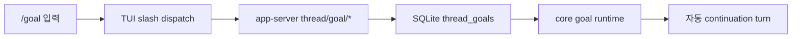
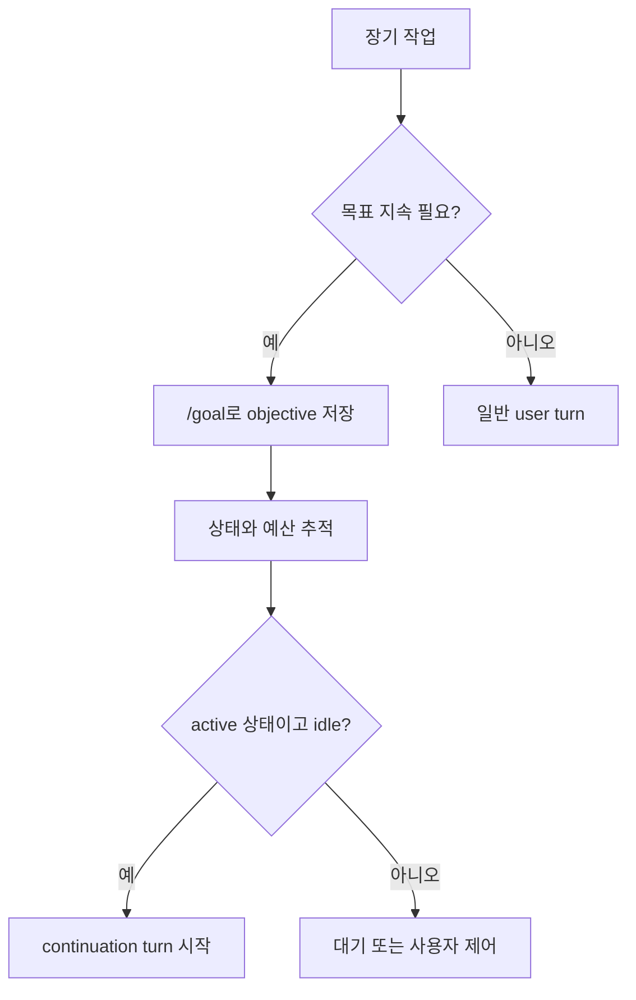
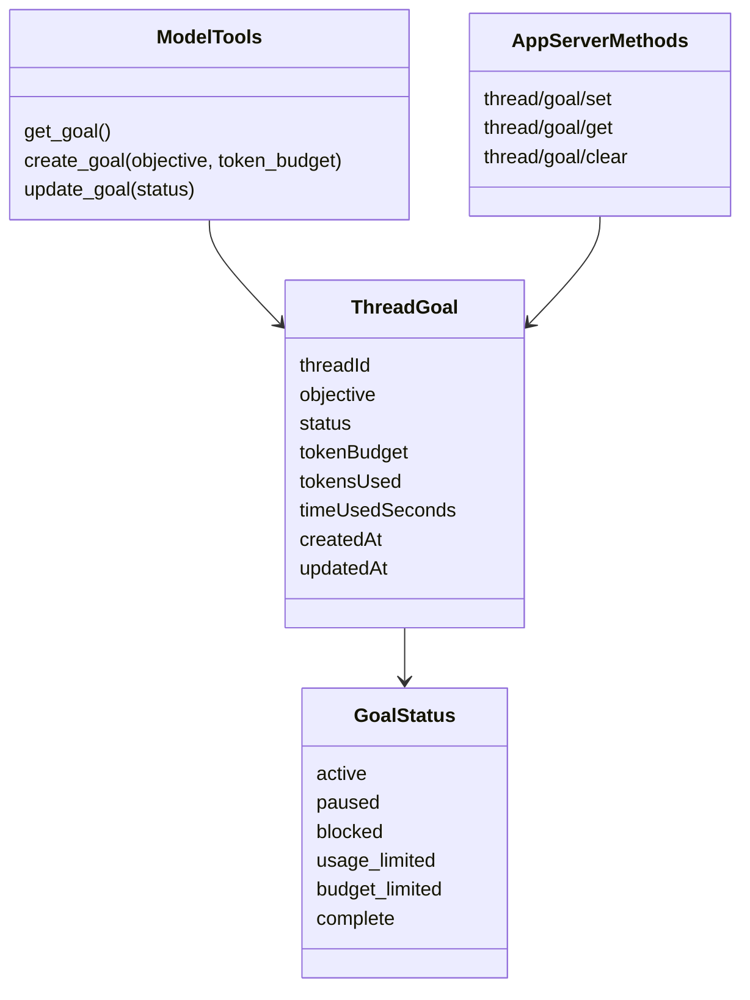
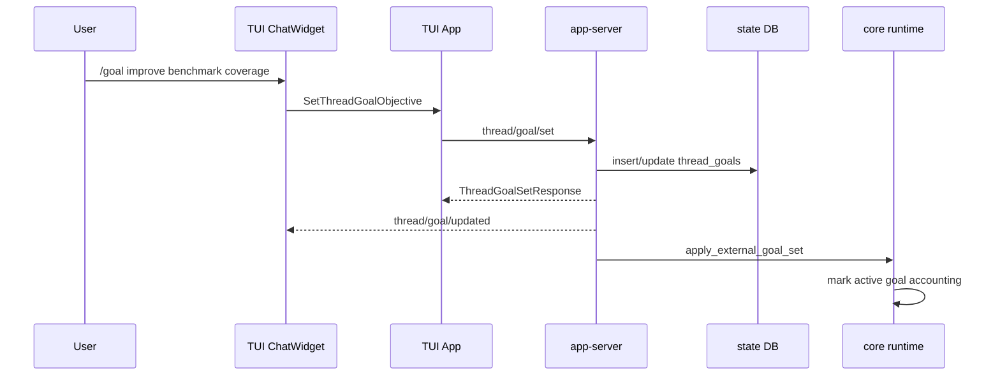
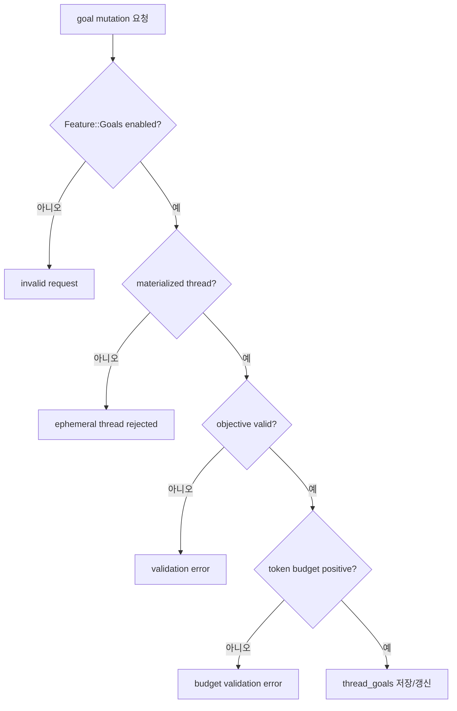
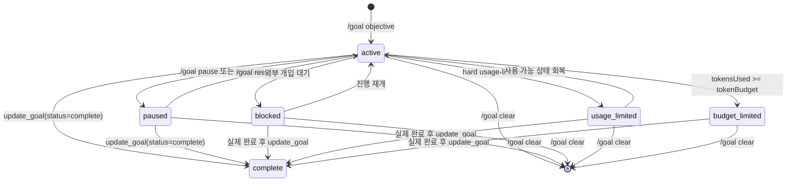
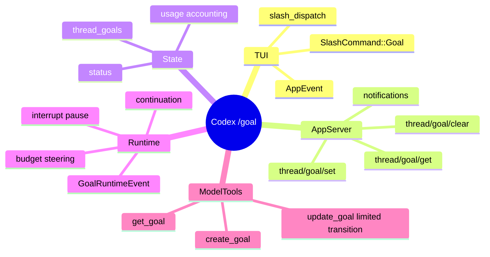
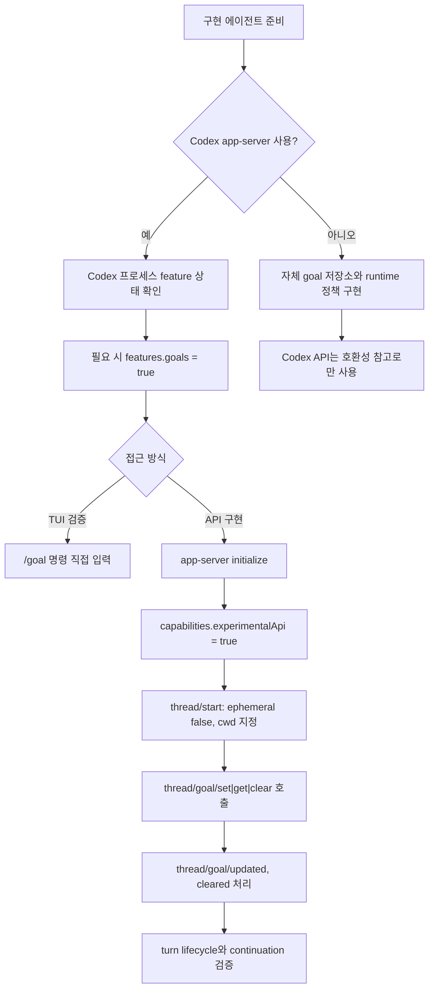
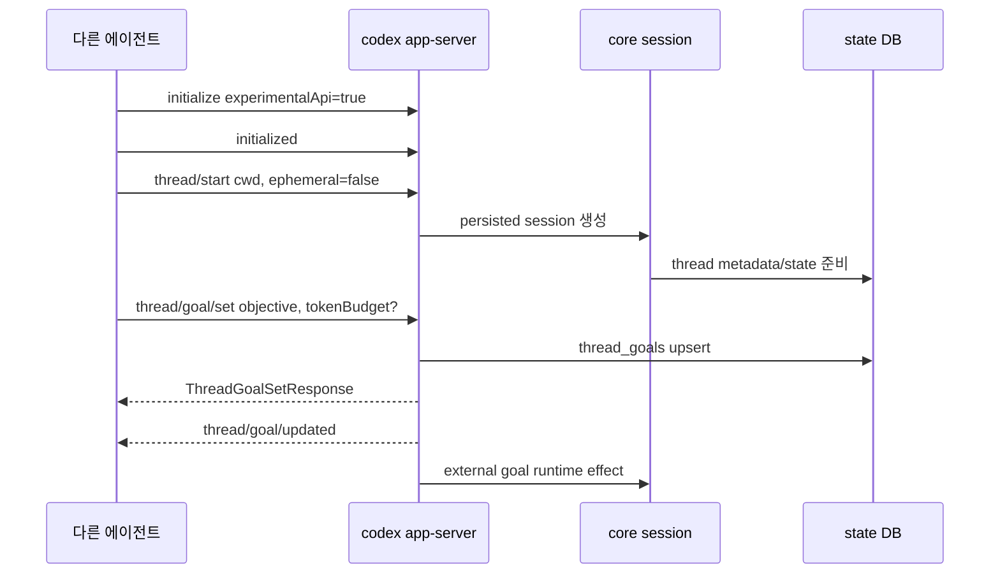
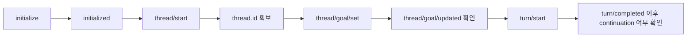

# Codex Goal Pipeline

## 1. 한 줄 요약

- Codex의 `/goal`은 단순한 TUI 명령이 아니라, 장기 작업 목표를 thread 단위로 저장하고, 상태/예산/사용량을 추적하며, idle 상태에서 자동 continuation turn을 시작할 수 있게 하는 persisted goal pipeline이다.
- 로컬 문서는 얇지만, 실제 구현은 TUI, app-server protocol, SQLite state DB, core runtime, model tool handler까지 연결되어 있다.



## 2. 왜 중요한가

- `/goal`은 긴 작업을 한 번의 턴으로 끝내려는 구조가 아니라, 목표를 thread에 남겨 다음 턴이나 재개 시점에도 이어서 처리하게 만드는 장치다.
- 사용자는 `/goal pause`, `/goal resume`, `/goal clear`, `/goal edit`로 목표의 lifecycle을 제어할 수 있고, 모델은 `get_goal`, `create_goal`, `update_goal` 도구로 현재 목표를 조회하거나 완료 처리할 수 있다.
- token budget과 elapsed time이 목표에 붙기 때문에, "계속 작업하되 예산을 넘기면 멈추고 정리한다"는 장기 실행 정책을 구현할 수 있다.



## 3. 핵심 개념

- `ThreadGoal`: thread 하나에 붙는 단일 persisted goal이다. objective, status, token budget, tokens used, time used를 가진다.
- `Feature::Goals`: `/goal` 및 goal tool 노출을 제어하는 feature flag다. 현재 로컬 Codex 소스에서는 stable/default enabled지만, 실행 config에서 꺼져 있으면 goal API가 거절된다.
- `thread/goal/set|get|clear`: TUI나 외부 클라이언트가 app-server에 목표 상태를 조작할 때 쓰는 JSON-RPC method다.
- `get_goal/create_goal/update_goal`: 모델에게 노출되는 tool이다. `update_goal`은 실제 완료 또는 반복된 blocking 조건처럼 제한된 상태 전환만 맡고, pause/resume/budget-limited/usage-limited 같은 lifecycle 제어는 사용자, 시스템, app-server runtime이 담당한다.
- `GoalRuntimeEvent`: turn 시작/종료, tool 완료, interrupt, resume, external mutation, idle continuation 같은 lifecycle event를 core runtime에 전달한다.



## 4. 아키텍처와 실행 흐름

- TUI는 `/goal`을 slash command로 인식하고, bare `/goal`이면 목표 요약 메뉴를 열고, `/goal <objective>`면 목표 생성/교체 이벤트를 발생시킨다.
- TUI app layer는 `AppEvent`를 받아 `AppServerSession`을 통해 `thread/goal/get`, `thread/goal/set`, `thread/goal/clear` 요청을 보낸다.
- app-server의 `ThreadGoalRequestProcessor`는 feature flag, materialized thread 여부, objective/budget validation을 확인한 뒤 state DB를 갱신한다.
- state DB는 `thread_goals` 테이블에 목표를 저장하고, core runtime은 active goal을 기준으로 usage accounting과 continuation을 수행한다.



## 5. 중요한 세부사항과 트레이드오프

- 목표 기능은 `goals` feature flag가 꺼져 있으면 동작하지 않는다. 현재 로컬 Codex 소스 기준으로 `goals`는 stable/default enabled feature이지만, 실행 프로세스에서 명시적으로 비활성화하면 `thread/goal/*` 요청은 `goals feature is disabled`로 거절된다.
- `/goal --tokens 98.5K ...`는 TUI 테스트 기준으로 token budget 옵션으로 파싱되지 않고 objective 문자열로 그대로 들어간다. token budget 자체는 app-server API의 `tokenBudget`과 model tool의 `token_budget`에는 존재한다.
- goal은 ephemeral thread에서는 지원되지 않는다. app-server는 materialized thread와 state DB를 요구한다.
- interrupt가 발생하면 active goal은 pause될 수 있다. budget 초과 시에는 `budget_limited`로 바뀌고, model에는 "새 substantive work를 시작하지 말고 정리하라"는 steering prompt가 주입된다.
- status 이름은 경계별로 표기가 다를 수 있다. state DB와 core model은 `budget_limited`, `usage_limited` 같은 snake_case를 쓰고, app-server JSON protocol은 `budgetLimited`, `usageLimited` 같은 camelCase로 직렬화한다.
- Plan mode처럼 goal을 무시해야 하는 collaboration mode에서는 continuation이 억제된다.



## 6. 실전 예시

- 새 목표 설정: `/goal keep improving the benchmark until p95 latency is under 120ms`
- 목표 요약 보기: `/goal`
- 목표 일시정지: `/goal pause`
- 목표 재개: `/goal resume`
- 목표 삭제: `/goal clear`
- 목표 편집: `/goal edit`
- API로 budget 포함 설정:

```json
{
  "method": "thread/goal/set",
  "id": 27,
  "params": {
    "threadId": "thr_123",
    "objective": "Keep improving the benchmark until p95 latency is under 120ms",
    "tokenBudget": 200000
  }
}
```



## 7. 빠른 복습

- `/goal`의 사용자-facing entrypoint는 TUI slash command다.
- persistence boundary는 app-server의 `thread/goal/*` protocol과 state DB의 `thread_goals` 테이블이다.
- autonomous behavior는 core의 `GoalRuntimeEvent`와 `maybe_start_goal_continuation_turn`에 있다.
- 모델 tool은 보수적으로 설계되어 있다. `create_goal`은 명시적 요청이 있을 때만 새 goal을 만들고, `update_goal`은 완료 또는 반복된 blocking 조건처럼 제한된 상태 전환만 허용한다.
- 이 파이프라인을 이해하려면 "UI command", "server RPC", "state DB", "runtime event", "model tool"을 분리해서 보는 것이 가장 빠르다.



## 8. 다른 에이전트에서 직접 구현하기 위한 세팅

- 이 절의 "다른 에이전트"는 Codex가 아닌 프로그램이 Codex app-server를 백엔드로 사용해 goal pipeline을 조작하는 경우를 뜻한다. 즉, 설정 대상은 새 에이전트의 자체 설정 파일이 아니라 그 에이전트가 연결할 Codex 실행 프로세스다.
- 현재 로컬 Codex 소스 기준으로 `goals`는 stable/default enabled라서 보통 별도 설정이 필요 없다. 다만 검증 대상 빌드에서 기능이 꺼져 있거나 오래된 빌드를 재현한다면 `~/.codex/config.toml`, `--enable goals`, 또는 `-c features.goals=true`로 Codex 프로세스의 feature flag를 켠다.

```toml
[features]
goals = true
```

- app-server API 클라이언트로 구현하는 외부 에이전트라면 initialize 시 `capabilities.experimentalApi = true`가 필요하다. `thread/goal/set|get|clear`가 protocol에서 experimental method로 표시되어 있기 때문에 opt-in 없이 호출하면 app-server가 거절한다.
- goal은 persisted thread에만 붙는다. 따라서 `thread/start`에서 `ephemeral: true`를 쓰면 안 되고, `cwd`를 명확히 줘서 materialized rollout과 state DB가 생기도록 해야 한다.
- 최소 구현 순서는 `app-server 실행 -> initialize(experimentalApi) -> initialized notification -> thread/start(ephemeral false) -> thread/goal/set -> notification 구독/처리 -> turn/start 또는 idle continuation 관찰`이다.
- TUI를 직접 띄워 수동 검증하는 경우에는 Codex repo의 환경 action이 `cargo +1.93.0 run --manifest-path=codex-rs/Cargo.toml --bin codex -- -c mcp_oauth_credentials_store=file` 형태로 잡혀 있다. 목표 기능까지 함께 보려면 여기에 `--enable goals` 또는 `-c features.goals=true`를 추가하는 식으로 생각하면 된다.
- API 클라이언트를 직접 붙이는 경우에는 `codex app-server --listen stdio://` 또는 daemon/proxy 경로를 선택한다. raw JSON-RPC를 쓸 때는 wire format에서 `"jsonrpc": "2.0"` header가 생략되는 app-server 관례를 README 기준으로 맞춰야 한다.
- token budget은 TUI `/goal --tokens ...` 옵션으로 파싱되는 구조가 아니다. 직접 구현 시 budget UI를 만들려면 app-server의 `thread/goal/set` payload에 `tokenBudget`을 넣거나 model tool의 `token_budget`을 사용해야 한다.
- Codex app-server 없이 완전히 독립적인 goal pipeline을 구현하는 에이전트라면 Codex의 `config.toml`은 적용 대상이 아니다. 이 경우에는 `thread_goals`에 해당하는 자체 저장소, goal status 전이, usage accounting, idle continuation 정책을 별도로 구현하고, Codex API 예시는 호환성 참고 자료로만 사용한다.



### 구현 체크리스트

- Codex app-server를 사용할 때는 `goals` feature flag가 실제 실행 프로세스에서 활성인지 `codex features list` 또는 goal API 호출 결과로 확인한다.
- 완전 독립 구현이라면 Codex 설정 대신 자체 저장소, 상태 전이, accounting, continuation scheduler의 책임 범위를 먼저 정한다.
- API 클라이언트는 initialize를 한 번만 보내고, 그 뒤 `initialized` notification을 보낸다.
- experimental method를 쓸 연결에는 반드시 `capabilities.experimentalApi = true`를 넣는다.
- `thread/start`는 persisted thread를 만들도록 `ephemeral`을 생략하거나 `false`로 둔다.
- `cwd`는 테스트 repo 또는 작업 디렉터리의 절대 경로로 지정한다.
- 목표 생성은 `thread/goal/set`에 `objective`를 넣어 호출한다.
- 목표 조회는 `thread/goal/get`, 삭제는 `thread/goal/clear`, pause/resume은 `thread/goal/set`의 `status`로 구현한다.
- 목표 완료는 사용자-facing API보다 model tool 관점에서는 `update_goal(status=complete)`가 담당한다. 별도 에이전트 UX를 만들 때도 "완료 검증 후 complete"라는 제약을 보존하는 편이 안전하다.
- budget 초과, interrupt pause, resume snapshot, idle continuation은 단위 테스트로 나누는 것이 좋다. 이 기능은 단순 CRUD가 아니라 runtime side effect가 핵심이다.



### 최소 JSON-RPC 흐름 예시

```json
{
  "method": "initialize",
  "id": 1,
  "params": {
    "clientInfo": {
      "name": "goal-agent",
      "title": "Goal Agent",
      "version": "0.1.0"
    },
    "capabilities": { "experimentalApi": true }
  }
}
```

```json
{ "method": "initialized", "params": {} }
```

```json
{
  "method": "thread/start",
  "id": 2,
  "params": {
    "cwd": "/Users/nes0903/Documents/reference/codex",
    "ephemeral": false
  }
}
```

```json
{
  "method": "thread/goal/set",
  "id": 3,
  "params": {
    "threadId": "응답으로 받은 thread.id",
    "objective": "Implement and verify the Codex goal pipeline",
    "tokenBudget": 200000
  }
}
```

```json
{
  "method": "turn/start",
  "id": 4,
  "params": {
    "threadId": "응답으로 받은 thread.id",
    "input": [
      { "type": "text", "text": "Start working toward the active goal." }
    ]
  }
}
```



## 참고 링크

- [Slash command 문서 stub](/Users/nes0903/Documents/reference/codex/docs/slash_commands.md)
- [SlashCommand::Goal 정의](/Users/nes0903/Documents/reference/codex/codex-rs/tui/src/slash_command.rs)
- [TUI slash dispatch](/Users/nes0903/Documents/reference/codex/codex-rs/tui/src/chatwidget/slash_dispatch.rs)
- [TUI goal app actions](/Users/nes0903/Documents/reference/codex/codex-rs/tui/src/app/thread_goal_actions.rs)
- [App server session goal RPC wrapper](/Users/nes0903/Documents/reference/codex/codex-rs/tui/src/app_server_session.rs)
- [App server goal API README](/Users/nes0903/Documents/reference/codex/codex-rs/app-server/README.md)
- [App server thread goal processor](/Users/nes0903/Documents/reference/codex/codex-rs/app-server/src/request_processors/thread_goal_processor.rs)
- [State DB goal runtime](/Users/nes0903/Documents/reference/codex/codex-rs/state/src/runtime/goals.rs)
- [thread_goals migration](/Users/nes0903/Documents/reference/codex/codex-rs/state/migrations/0029_thread_goals.sql)
- [Goal extension runtime](/Users/nes0903/Documents/reference/codex/codex-rs/ext/goal/src/runtime.rs)
- [Continuation prompt template](/Users/nes0903/Documents/reference/codex/codex-rs/ext/goal/templates/goals/continuation.md)
- [Budget limit prompt template](/Users/nes0903/Documents/reference/codex/codex-rs/ext/goal/templates/goals/budget_limit.md)
- [Goal tool definitions](/Users/nes0903/Documents/reference/codex/codex-rs/ext/goal/src/spec.rs)
- [Goal tool handlers](/Users/nes0903/Documents/reference/codex/codex-rs/ext/goal/src/tool.rs)
- [Goal feature flag](/Users/nes0903/Documents/reference/codex/codex-rs/features/src/lib.rs)
- [CLI feature toggle 옵션](/Users/nes0903/Documents/reference/codex/codex-rs/cli/src/main.rs)
- [Codex local environment action](/Users/nes0903/Documents/reference/codex/.codex/environments/environment.toml)
- [ThreadStartParams protocol](/Users/nes0903/Documents/reference/codex/codex-rs/app-server-protocol/src/protocol/v2/thread.rs)
- [Experimental API opt-in](/Users/nes0903/Documents/reference/codex/codex-rs/app-server/README.md)

<!-- study-links:start -->
## 관련 문서

- `daemon`: [[daemon/daemon|데몬(daemon) 상세 정리]]
- `sqlite`: [[sqlite/sqlite|SQLite 상세 정리]]
- `단위 테스트`: [[정보처리기사/2과목 소프트웨어 개발/084 단위 테스트(Unit Test)/084 단위 테스트(Unit Test)|084 단위 테스트(Unit Test)]]
- `상태 전이`: [[정보처리기사/4과목 프로그래밍 언어 활용/203 프로세스 상태 및 상태 전이/203 프로세스 상태 및 상태 전이|203 프로세스 상태 및 상태 전이]]
- `파이프`: [[정보처리기사/1과목 소프트웨어 설계/029 파이프 - 필터 패턴/029 파이프 - 필터 패턴|029 파이프 - 필터 패턴]]
<!-- study-links:end -->
