# Codex 모바일 연동 원리와 기술

- 작성 기준: 2026-06-01
- 주제: ChatGPT 모바일 앱에서 Codex를 원격으로 이어 쓰는 기능이 어떤 원리와 기술로 가능한지
- 핵심 관점: 모바일 기기가 개발 환경을 직접 들고 다니는 것이 아니라, Codex가 실행되는 신뢰된 호스트를 ChatGPT 모바일 앱이 원격으로 조종한다.

## 1. 한 줄 요약

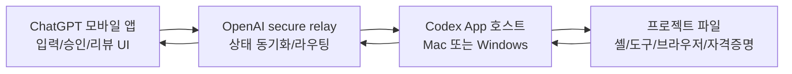

- Codex 모바일 연동은 "모바일에서 코드를 실행하는 기능"이 아니라 "모바일을 Codex 호스트의 원격 감독 콘솔로 만드는 기능"이다.
- 사용자는 iOS/Android ChatGPT 앱에서 새 스레드를 시작하거나 기존 스레드를 이어가고, 명령 실행 승인, 방향 전환, diff/테스트 결과/터미널 출력 확인을 할 수 있다.
- 실제 파일 읽기, 코드 수정, 셸 명령, 브라우저/Computer Use, 플러그인, MCP 서버, 로컬 자격증명 사용은 연결된 호스트 또는 그 호스트가 붙은 SSH 원격 환경에서 수행된다.
- 가능하게 하는 핵심 기술은 다음 조합이다.
  - ChatGPT 계정/워크스페이스 기반 인증
  - QR 코드 기반 호스트 연결 등록
  - 신뢰된 기기를 공개 인터넷에 직접 노출하지 않는 secure relay
  - 호스트의 live session state 동기화
  - Codex App/App Server 계층의 스레드, 턴, 이벤트, 승인 처리
  - OS 수준 sandbox, permission profile, approval policy

## 2. 왜 중요한가

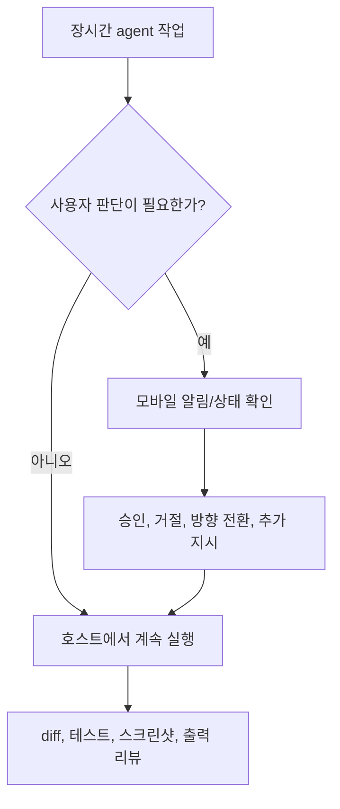

- agentic coding은 단일 질문-응답보다 시간이 길다.
  - 버그 재현, 테스트 실행, refactor, 브라우저 확인, diff 정리처럼 몇 분에서 몇 시간까지 이어질 수 있다.
  - 중간에 "네트워크 접근을 허용할지", "두 설계 중 어느 쪽을 택할지", "이 파일 변경을 승인할지" 같은 판단이 필요하다.
- 모바일 연동의 가치는 실행 환경을 휴대폰으로 옮기는 데 있지 않다.
  - 실행 환경은 파일, 의존성, 로그인된 웹사이트, SSH 키, 브라우저 상태, 로컬 도구가 준비된 호스트에 남긴다.
  - 휴대폰은 짧은 개입이 필요한 순간에 prompt, approval, review를 빠르게 보내는 인터페이스가 된다.
- 이 구조는 개발자의 작업 리듬을 바꾼다.
  - 자리를 비운 동안에도 agent 작업을 멈추지 않는다.
  - 사용자가 필요한 순간에만 개입한다.
  - 로컬/원격 개발환경의 보안 경계를 유지하면서 여러 기기에서 같은 작업 상태를 본다.

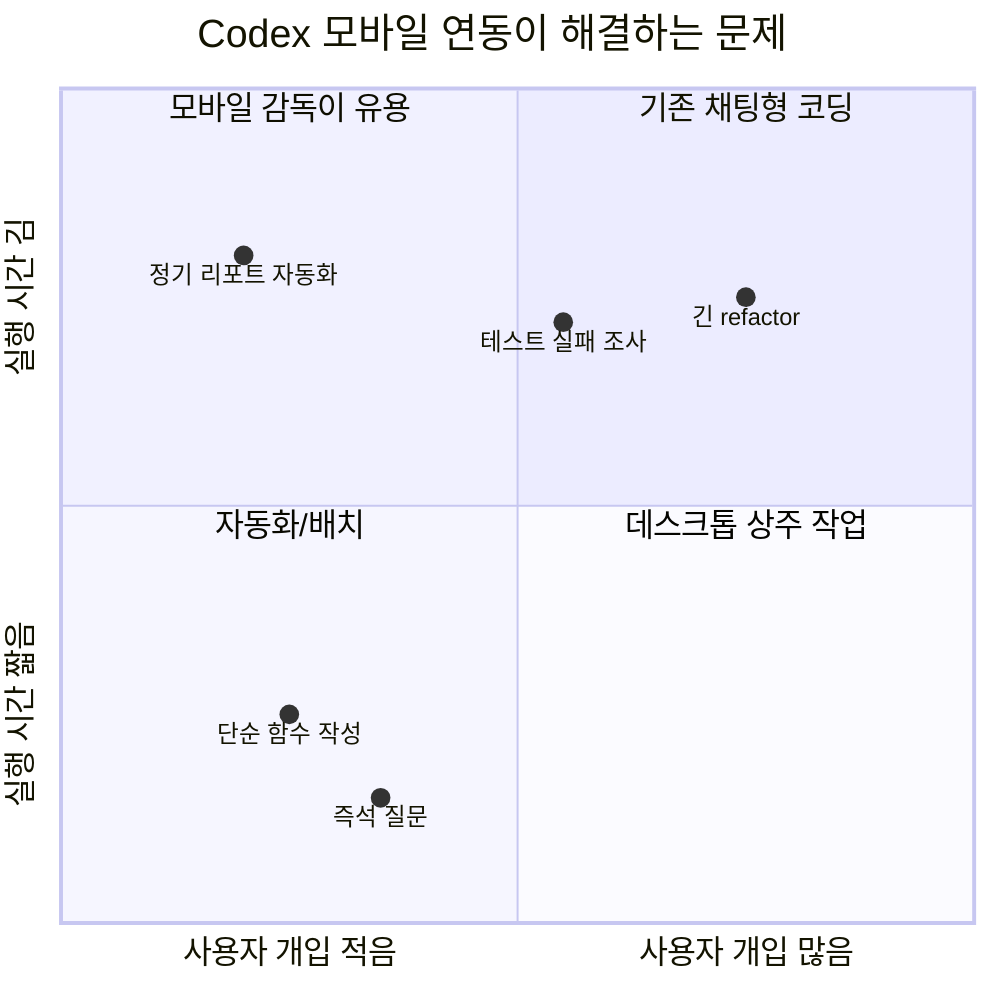

## 3. 핵심 개념

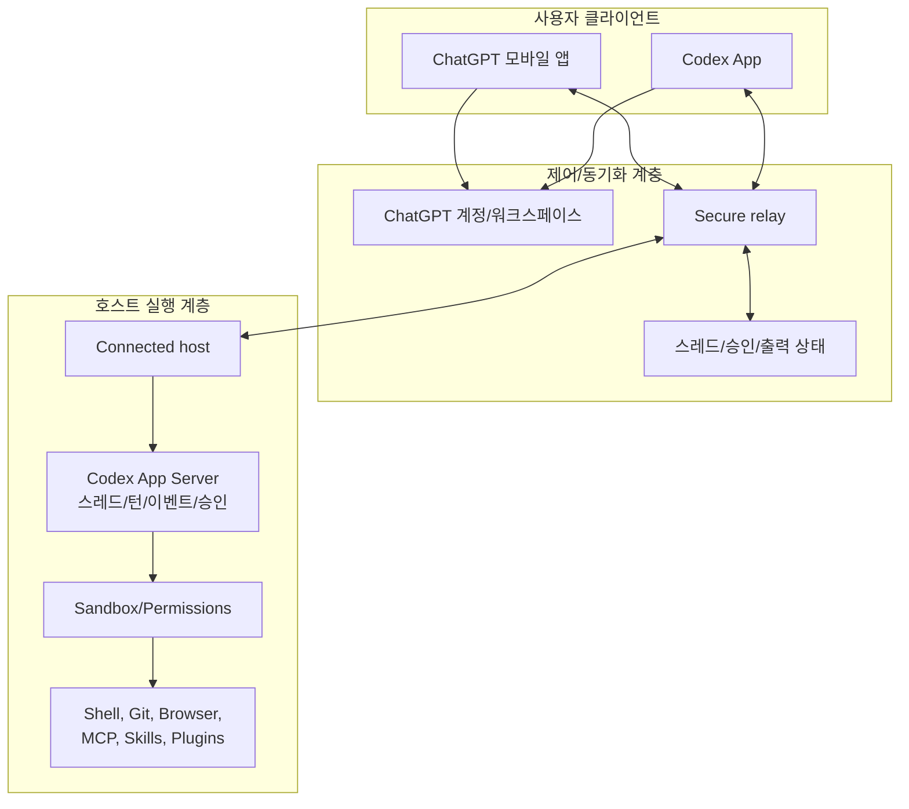

- ChatGPT 모바일 앱
  - 사용자가 보는 원격 UI다.
  - prompt, follow-up, 승인/거절, 모델 변경, 스레드 이동, 출력 리뷰 같은 제어 입력을 보낸다.
  - 호스트에서 생긴 screenshots, terminal output, diffs, test results, approvals 상태를 받아 보여준다.
- Connected host
  - Codex App이 실행 중인 Mac 또는 Windows 기기다.
  - 프로젝트 파일, 로컬 문서, 셸, 플러그인, MCP 서버, 브라우저 설정, Computer Use 설정, 로컬 도구, 로그인된 웹사이트 접근권을 제공한다.
  - 호스트가 잠들거나 네트워크를 잃거나 Codex App이 종료되면 모바일 원격 접근도 끊긴다.
- Secure relay
  - OpenAI 공식 설명상, trusted machine을 공개 인터넷에 직접 노출하지 않고 권한 있는 ChatGPT 기기에서 접근 가능하게 하는 중계 계층이다.
  - 공개 문서에는 relay의 내부 암호화 방식, connection establishment, notification backend 세부 구현이 공개되어 있지 않다.
  - 다만 "공개 인터넷에 직접 노출하지 않는다"는 설명상, 사용자가 포트 포워딩이나 public listener를 열지 않고도 모바일과 호스트가 OpenAI 계정/relay를 통해 만나는 구조라고 해석할 수 있다.
- Live state sync
  - 모바일은 단순히 새 작업을 던지는 UI가 아니라 현재 호스트의 active threads, approvals, plugins, project context를 불러온다.
  - 이 때문에 "데스크톱에서 시작한 스레드를 모바일에서 이어가기"와 "모바일에서 시작한 스레드를 나중에 데스크톱에서 이어가기"가 가능하다.
- App Server / event protocol
  - Codex App Server 문서는 rich client를 위한 interface로 인증, conversation history, approvals, streamed agent events를 제공한다고 설명한다.
  - 공개된 app-server 프로토콜은 JSON-RPC 2.0 형태의 bidirectional message를 사용하며, turn start, steer, interrupt, diff update, command output delta, approval request 같은 이벤트를 표현한다.
  - 공식 문서가 "모바일 앱이 이 app-server 프로토콜을 그대로 쓴다"고 명시하지는 않으므로, 모바일 구현 세부는 공개된 범위를 넘겨 단정하면 안 된다. 다만 Codex 클라이언트들이 공유하는 하위 제어 모델을 이해하는 데 유용한 공개 근거다.

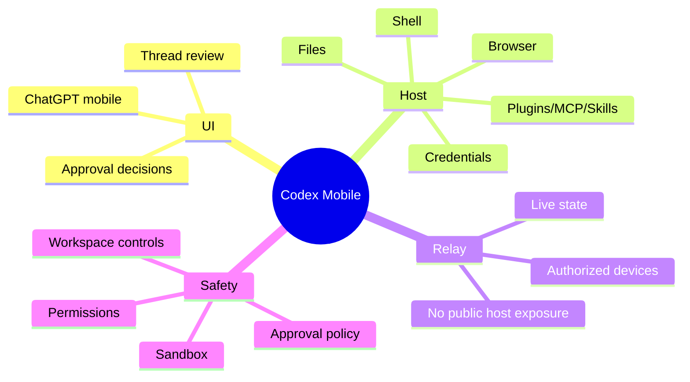

## 4. 아키텍처와 흐름

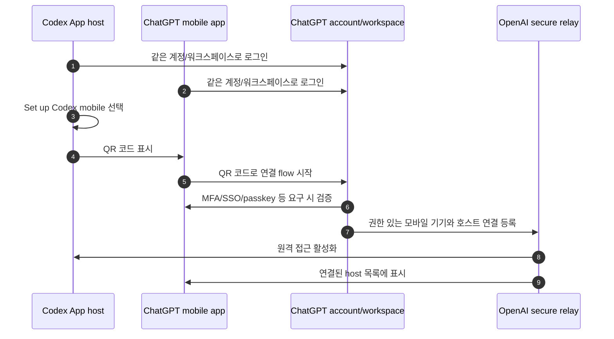

- 설정 흐름
  - 시작점은 Codex App 호스트다. 모바일 앱이나 CLI/IDE Extension에서 먼저 설정하는 구조가 아니다.
  - Codex App에서 mobile setup을 시작하면 QR 코드가 표시된다.
  - 휴대폰으로 QR 코드를 스캔하면 ChatGPT 앱이 열리고, 같은 ChatGPT 계정/워크스페이스인지 확인한다.
  - 워크스페이스에서 MFA, SSO, passkey가 요구되면 해당 절차를 완료해야 한다.
  - 설정이 끝나면 모바일 Codex 화면에 연결된 호스트가 나타난다.
  - Business/Enterprise/Edu 같은 워크스페이스에서는 admin이 Remote Control access를 허용해야 할 수 있다.

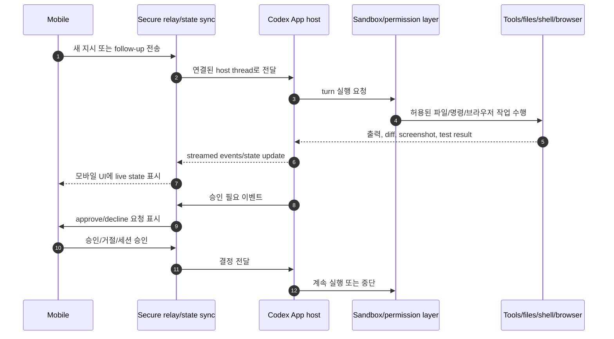

- 런타임 흐름
  - 모바일이 보내는 것은 주로 prompt, steering, approval decision이다.
  - 실행은 호스트에서 일어난다.
  - 호스트는 파일 시스템, shell, Git, browser, Computer Use, MCP, skills, plugins 등 로컬 설정을 사용한다.
  - 출력은 terminal delta, screenshots, unified diff, test result, plan update, approval request 같은 이벤트로 모바일에 반영된다.
- 공개 app-server 관점에서 보면 핵심 event primitive는 다음과 비슷하다.
  - `thread/start`: 스레드 생성
  - `turn/start`: 특정 thread에 user input을 넣고 agent turn 시작
  - `turn/steer`: 실행 중인 turn에 추가 지시 삽입
  - `turn/interrupt`: 실행 중인 turn 중단
  - `turn/diff/updated`: 누적 diff 업데이트
  - `item/commandExecution/outputDelta`: 명령 출력 스트리밍
  - `item/commandExecution/requestApproval`: 명령 승인 요청
  - `item/fileChange/requestApproval`: 파일 변경 승인 요청
  - `turn/completed`: 완료/중단/실패 상태 전파

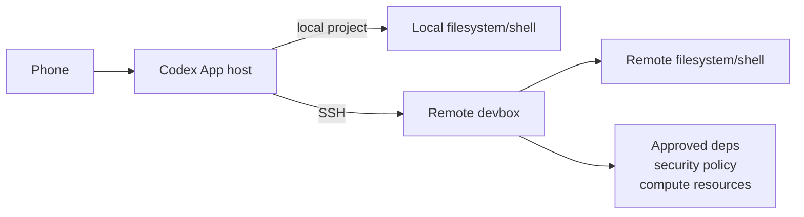

- SSH 원격 환경 흐름
  - 휴대폰이 SSH 호스트에 직접 붙는 것이 아니다.
  - Codex App 호스트가 SSH 설정을 통해 원격 devbox를 발견하고, remote Codex app server를 SSH로 시작/관리한다.
  - 원격 thread는 원격 파일 시스템과 원격 shell에서 실행된다.
  - 휴대폰은 여전히 Codex App 호스트를 제어하고, 그 호스트가 다시 SSH 환경에서 Codex 작업을 실행하는 형태다.
  - SSH 호스트는 일반 SSH 보안 기준을 따라야 한다. trusted keys, least-privilege account, public unauthenticated listener 금지가 중요하다.

## 5. 중요한 세부사항, edge case, tradeoff

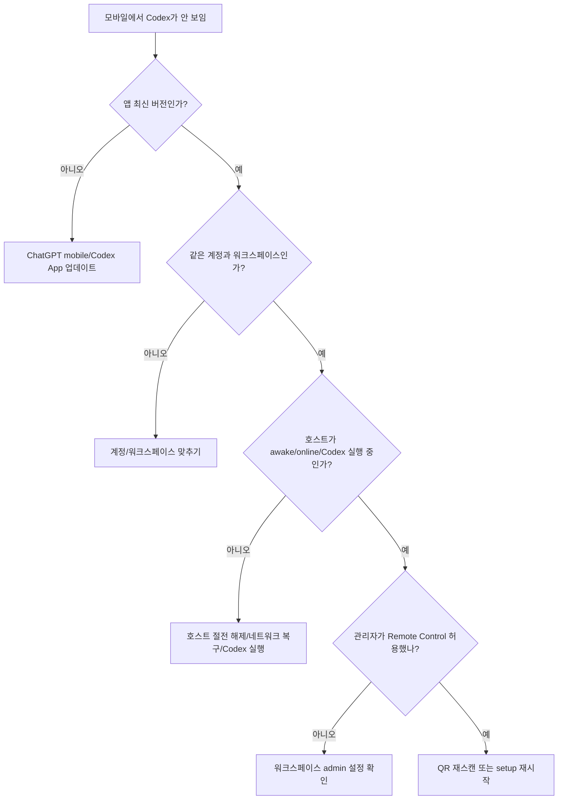

- 출시/지원 상태
  - 2026-05-14 OpenAI는 ChatGPT 모바일 앱의 Codex remote access preview를 발표했다.
  - 최초 release note 기준으로는 macOS 호스트 연결이 중심이었다.
  - 2026-05-29 release note 기준으로 Windows 호스트도 ChatGPT iOS/Android 또는 Codex on Mac에서 원격으로 이어갈 수 있다고 설명된다.
  - 2026-06-01 현재 개발자 문서의 Remote connections 페이지는 Codex App host로 macOS와 Windows를 모두 언급한다.
- 호스트 의존성
  - 호스트가 잠들면 연결이 끊긴다.
  - Mac laptop은 전원 연결과 덮개/외부 디스플레이 조건에 따라 원격 접근 유지가 달라진다.
  - Windows에서 Computer Use는 foreground 실행 제약이 있으므로, 원격 제어 중인 desktop session을 작업에 할당해 두는 것이 적합하다.
- 보안 경계
  - 파일, 자격증명, 로그인된 웹사이트, MCP 서버, plugin은 모바일로 복사되는 것이 아니라 호스트 측 설정을 사용한다.
  - sandbox와 approval policy는 원격 세션에도 계속 적용된다.
  - Codex는 기본적으로 로컬 명령에 OS-enforced sandbox를 적용하고, 보통 현재 workspace 내 쓰기와 no network 같은 제한을 둔다.
  - 네트워크 접근, workspace 밖 파일 수정, side-effect가 있는 connector/MCP 호출 등은 승인 흐름으로 넘어갈 수 있다.
- 데이터/계정 제어
  - ChatGPT로 로그인하면 ChatGPT workspace permissions, RBAC, retention/residency 설정이 적용된다.
  - API key 로그인은 API organization의 retention/data-sharing 설정을 따른다.
  - Codex usage는 agentic usage limit에 포함된다.
  - ChatGPT/Codex 대화는 별개로 유지되지만, 일부 connected service나 설정은 표면 간에 공유될 수 있다.
- 공개되지 않은 구현 세부
  - secure relay의 정확한 transport, encryption handshake, push notification implementation, device token lifecycle, reconnect algorithm은 공개 문서에서 확인되지 않는다.
  - 따라서 "어떤 내부 프로토콜로 모바일과 호스트가 직접 통신한다"는 식의 단정은 피해야 한다.
  - 공개 근거로 확실히 말할 수 있는 것은, Codex가 secure relay를 사용해 권한 있는 ChatGPT 기기에서 trusted host를 reachable하게 하고, 그 host를 public internet에 직접 노출하지 않는다는 점이다.

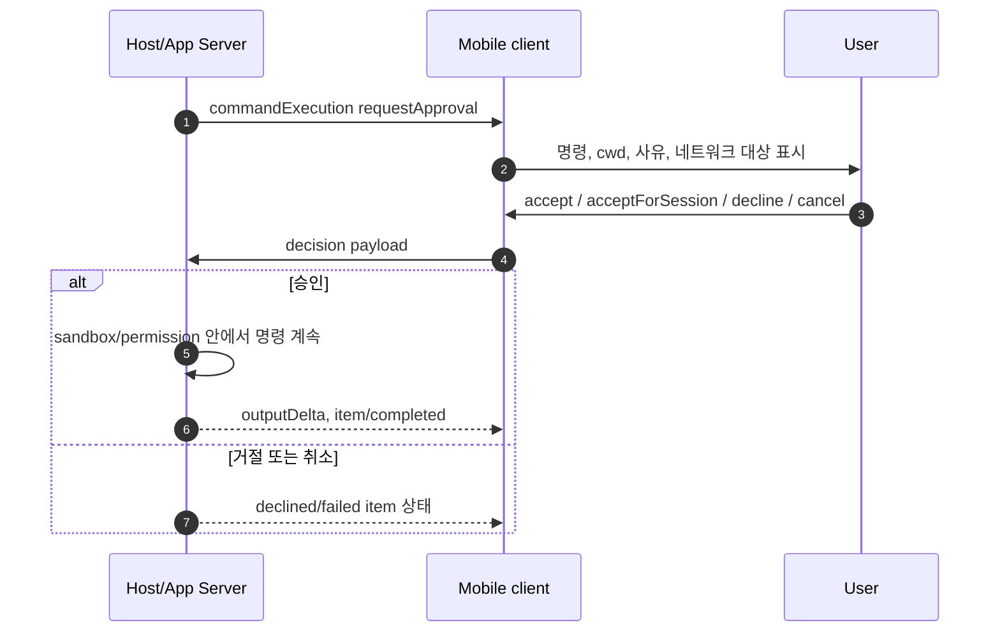

- 승인 UX의 기술적 의미
  - 승인은 단순한 UI 확인 버튼이 아니라 agent 실행권한의 경계다.
  - app-server 문서상 command execution과 file change는 server-initiated JSON-RPC request로 client에 승인 요청을 보낼 수 있다.
  - 승인 결정은 threadId/turnId 범위에 묶여 active conversation의 UI 상태와 연결된다.
  - 네트워크 승인 요청은 host/protocol/port 단위로 묶일 수 있어, 같은 목적지의 여러 pending request를 한 번에 풀어줄 수 있다.

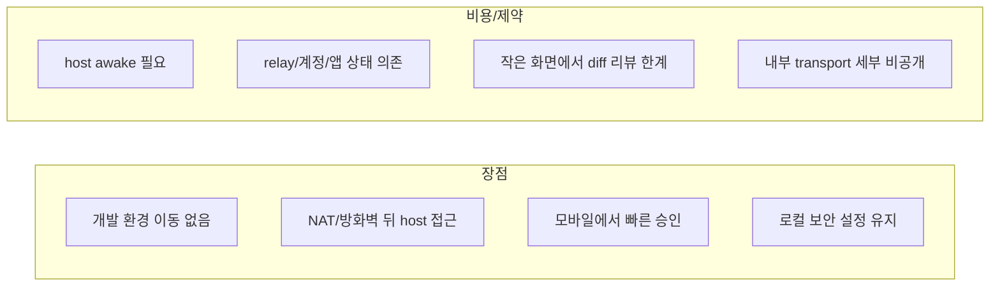

## 6. 실전 예시

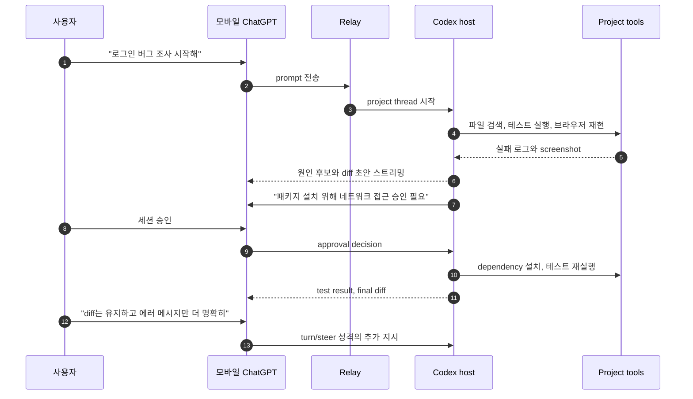

- 예시 1: 이동 중 버그 조사
  - 데스크톱에서 Codex App을 켜둔 상태로 이동한다.
  - 모바일에서 "최근 로그인 실패를 재현하고 원인 후보를 찾아줘"라고 보낸다.
  - 호스트는 프로젝트 파일, 테스트, 브라우저, 로컬 환경 변수를 이용해 조사한다.
  - Codex가 네트워크 접근이나 파일 변경 승인을 요구하면 모바일에서 승인한다.
  - 결과로 terminal output, screenshot, diff, test result를 모바일에서 확인한다.
- 예시 2: 긴 refactor의 방향 결정
  - 출근 전 데스크톱에서 refactor 작업을 시작한다.
  - 이동 중 Codex가 "A 방식은 변경 범위가 작지만 중복이 남고, B 방식은 구조가 깔끔하지만 테스트 수정이 많다"고 묻는다.
  - 모바일에서 tradeoff를 읽고 B 방식을 선택한다.
  - Codex는 호스트에서 계속 변경하고, 사용자는 나중에 데스크톱에서 full diff를 리뷰한다.
- 예시 3: always-on host 또는 SSH devbox
  - 노트북 대신 Mac mini/Windows PC 같은 항상 켜진 호스트를 둔다.
  - 프로젝트가 원격 devbox에 있으면 Codex App 호스트가 SSH로 원격 환경에 연결한다.
  - 모바일은 host를 제어하고, 실제 명령과 파일 변경은 remote filesystem/shell에서 수행된다.
  - 이 방식은 장시간 작업과 팀 보안 정책이 있는 managed environment에 유리하다.

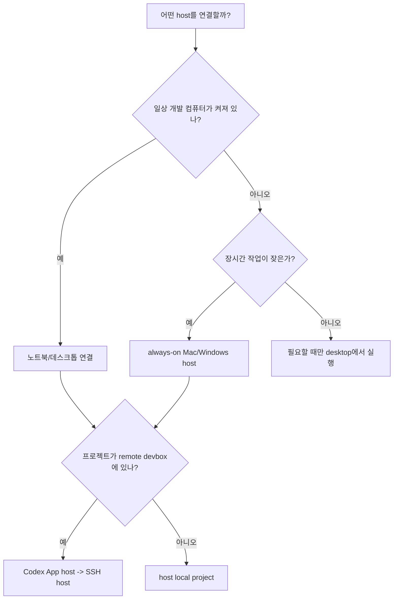

## 7. 용어집 또는 빠른 복습

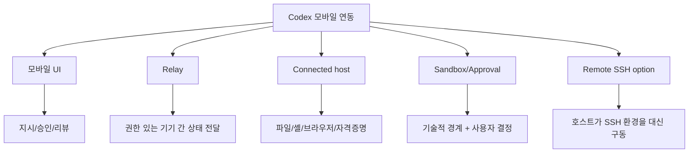

- Connected host
  - Codex App이 실행 중이고 모바일에서 제어할 수 있도록 등록된 Mac 또는 Windows 기기.
- Secure relay
  - trusted host를 public internet에 직접 노출하지 않고, 권한 있는 ChatGPT 기기에서 접근 가능하게 하는 OpenAI 중계 계층.
- Live state
  - active thread, approvals, plugins, project context, screenshots, terminal output, diffs, test results처럼 진행 중인 Codex 작업의 현재 상태.
- App Server
  - Codex rich client를 위한 공개 interface. JSON-RPC 기반으로 스레드, 턴, 승인, streamed events를 다룬다.
- Approval policy
  - agent가 어느 순간 사용자 승인을 받아야 하는지 결정하는 정책.
- Sandbox
  - agent-generated command가 무제한으로 실행되지 않도록 OS 수준에서 파일/네트워크/작업 범위를 제한하는 경계.
- Permission profile
  - read-only, workspace write, danger-full-access 같은 권한 범위를 명명된 profile로 관리하는 설정.
- Remote SSH
  - Codex App host가 SSH config를 통해 원격 환경을 발견하고, 원격 filesystem/shell에서 thread를 실행하게 하는 구조.
- 핵심 복습
  - "휴대폰이 개발 머신"이 아니라 "휴대폰이 감독 콘솔"이다.
  - "실행 위치"는 host 또는 host가 붙은 SSH 환경이다.
  - "접근 방식"은 secure relay와 ChatGPT 계정/워크스페이스 인증이다.
  - "안전장치"는 sandbox, permission, approval, admin controls다.
  - "주의점"은 host가 계속 awake/online이어야 하고, 작은 화면에서 최종 diff 검토는 한계가 있다는 점이다.

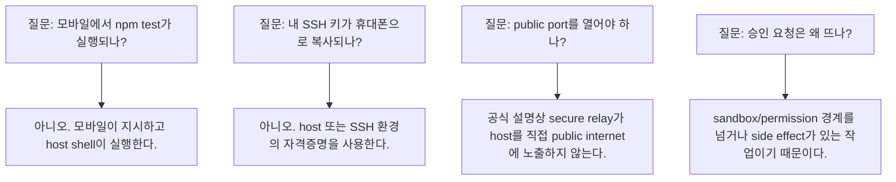

## 참고 링크

- [OpenAI - Work with Codex from anywhere](https://openai.com/index/work-with-codex-from-anywhere/)
- [OpenAI Developers - Remote connections](https://developers.openai.com/codex/remote-connections)
- [OpenAI Help Center - ChatGPT Release Notes](https://help.openai.com/en/articles/6825453-chatgpt-release-notes)
- [OpenAI Help Center - Using Codex with your ChatGPT plan](https://help.openai.com/en/articles/11369540)
- [OpenAI - Introducing the Codex app](https://openai.com/index/introducing-the-codex-app/)
- [OpenAI Developers - Codex app](https://developers.openai.com/codex/app)
- [OpenAI Developers - Codex app features](https://developers.openai.com/codex/app/features)
- [OpenAI Developers - Codex App Server](https://developers.openai.com/codex/app-server)
- [OpenAI Developers - Sandbox](https://developers.openai.com/codex/concepts/sandboxing)
- [OpenAI Developers - Permissions](https://developers.openai.com/codex/permissions)
- [OpenAI Developers - Authentication](https://developers.openai.com/codex/auth)
- [OpenAI Developers - Agent approvals & security](https://developers.openai.com/codex/agent-approvals-security)

<!-- study-links:start -->
## 관련 문서

- `rbac`: [[abac-rbac/abac-rbac|ABAC와 RBAC 권한 모델]]
- `sso`: [[정보처리기사/5과목 정보시스템 구축 관리/257 SSO(Single Sign On)/257 SSO(Single Sign On)|257 SSO(Single Sign On)]]
- `ssh`: [[정보처리기사/5과목 정보시스템 구축 관리/324 SSH(Secure SHell, 시큐어 셸)/324 SSH(Secure SHell, 시큐어 셸)|324 SSH(Secure SHell, 시큐어 셸)]]
<!-- study-links:end -->
