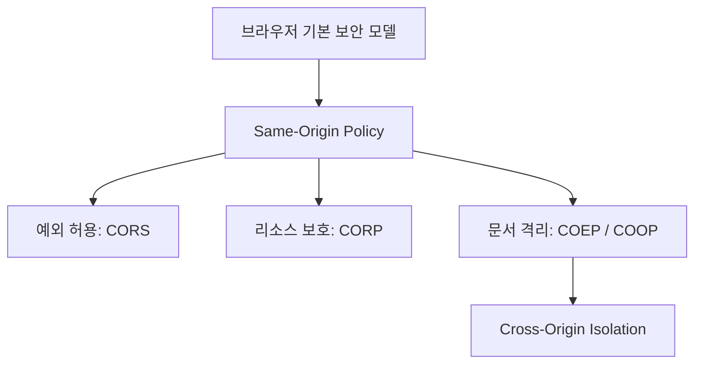
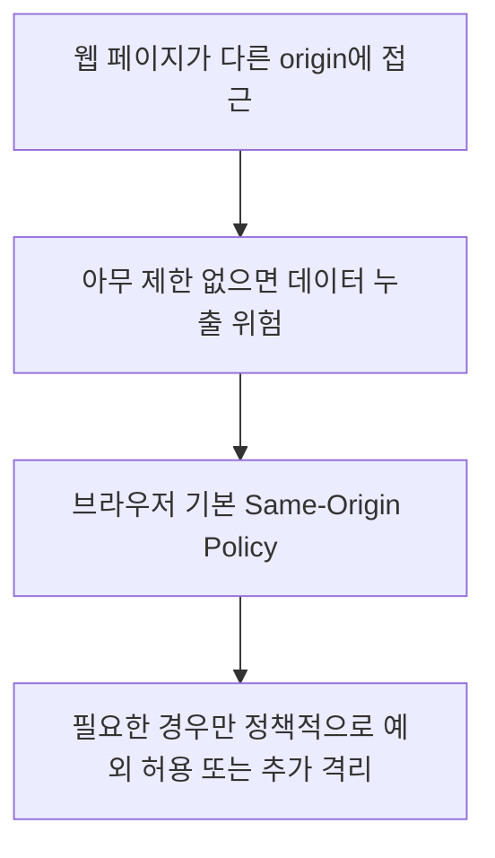
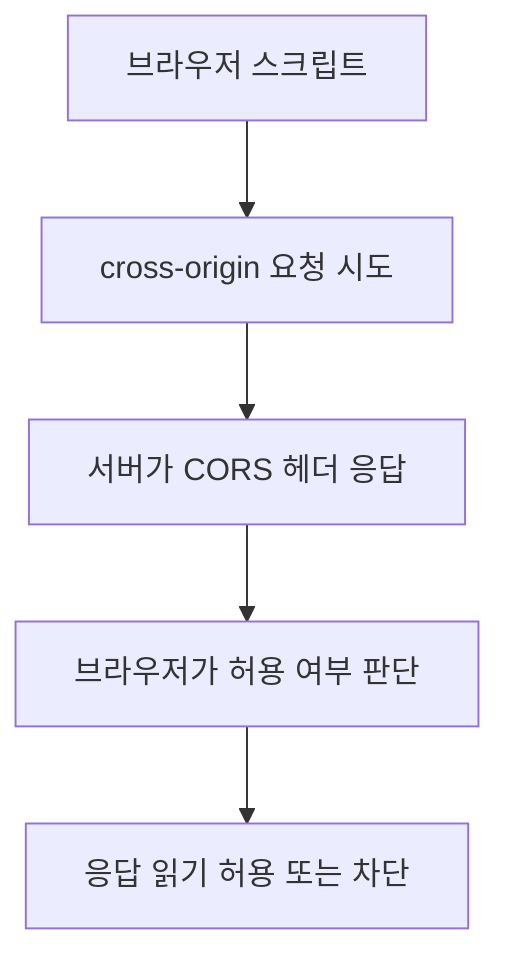
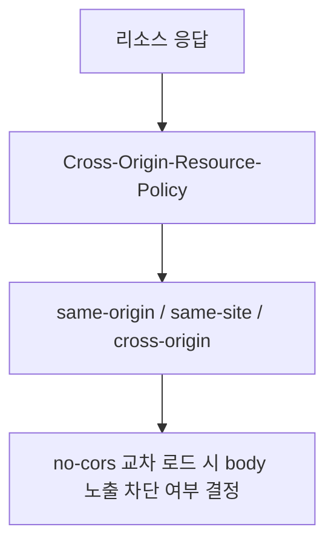
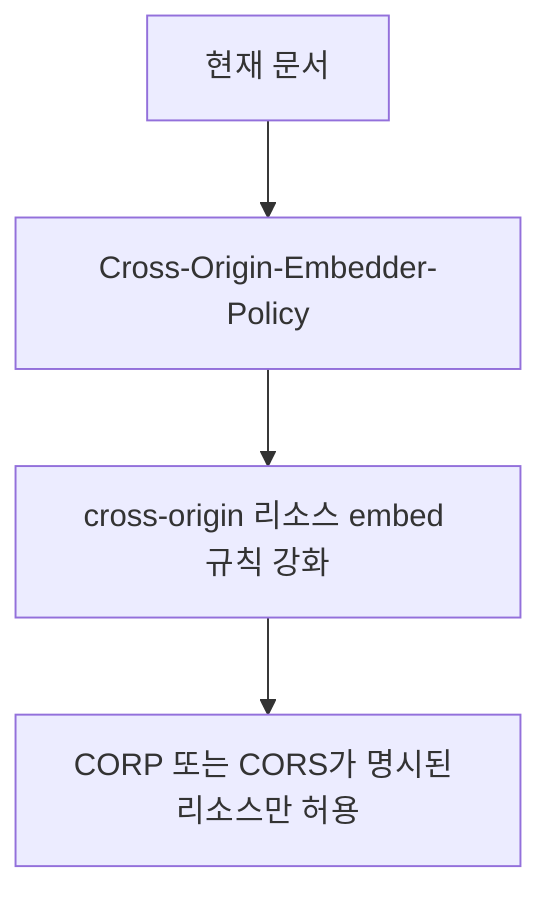
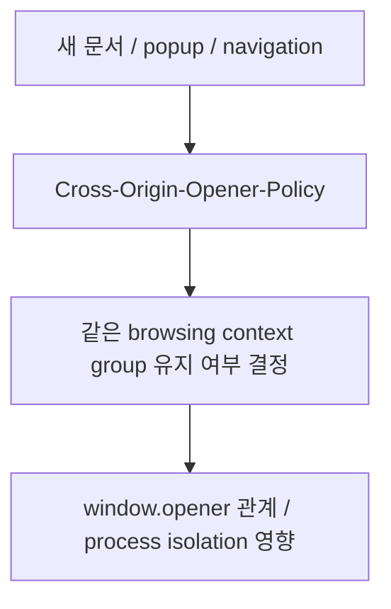
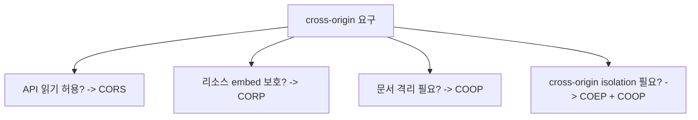

# crossOriginPolicy 상세 정리

작성 기준일: 2026-04-21  
조사 방식: 웹검색 기반 최신 조사  
주요 참고: MDN `CORS`, `CORP`, `COOP`, `COEP` 공식 문서

## 1. 한 줄 요약

`crossOriginPolicy`는 보통 단일 표준 헤더 이름이라기보다, 브라우저가 다른 origin의 리소스·문서·요청을 어떻게 허용하거나 격리할지를 제어하는 정책 묶음(CORS, CORP, COEP, COOP)을 넓게 부르는 표현으로 이해하는 것이 맞다.

즉:

- 어떤 요청은 허용할지
- 어떤 리소스는 막을지
- 어떤 문서는 서로 분리할지

를 정하는 브라우저 보안 정책 계열이라고 보면 된다.

실무에서는 특히 Helmet 같은 라이브러리에서:

- `crossOriginResourcePolicy`
- `crossOriginEmbedderPolicy`
- `crossOriginOpenerPolicy`

같은 옵션 이름으로 자주 보게 된다.

---

## 2. 왜 이런 정책이 필요한가

브라우저는 본질적으로 서로 다른 사이트가 함부로 데이터를 주고받지 못하게 해야 한다.

만약 아무 제한이 없다면:

- A 사이트의 스크립트가
- B 사이트 응답을 읽거나
- 다른 창의 DOM/글로벌 객체를 건드리거나
- 민감 리소스를 추측/유출하는

문제가 생긴다.

이걸 막는 가장 기본 장치가 `Same-Origin Policy`다.

### 2.1 same-origin policy

MDN CORS 문서는:

- `fetch()`와 `XMLHttpRequest`는 기본적으로 same-origin policy를 따른다고 설명한다.

즉 현재 페이지와:

- scheme
- host
- port

가 다른 origin으로의 script-initiated 접근은 기본적으로 제한된다.

### 2.2 그런데 현실에서는 교차 origin 요청이 필요하다

예:

- 프론트엔드 앱이 API 서버를 다른 도메인에서 호출
- CDN 이미지 로딩
- 외부 widget embed
- cross-origin login / SSO popup

즉 무조건 막기만 하면 웹이 안 돌아간다.

그래서:

- 예외 허용(CORS)
- 리소스 보호(CORP)
- 문서/프로세스 격리(COEP/COOP)

같은 정책이 등장했다.

---

## 3. CORS

MDN `Cross-Origin Resource Sharing (CORS)`는 CORS를:

- 서버가 특정 다른 origin으로부터의 리소스 로딩/읽기를 허용할지 알려 주는 HTTP-header 기반 메커니즘

이라고 설명한다.

### 3.1 핵심 감각

CORS는:

- "다른 origin 요청 자체를 무조건 막는다"가 아니라
- "요청은 갈 수 있어도, 응답을 브라우저 JS가 읽을 수 있을지"를 정책적으로 결정하는 메커니즘

으로 이해하는 편이 맞다.

### 3.2 대표 헤더

대표적으로:

- `Access-Control-Allow-Origin`
- `Access-Control-Allow-Methods`
- `Access-Control-Allow-Headers`
- `Access-Control-Allow-Credentials`

등이 있다.

즉 CORS는 주로 "API 읽기 허용 정책"이다.

### 3.3 preflight

MDN은 브라우저가 경우에 따라:

- 실제 요청 전에 `OPTIONS` preflight를 보내

허용 메서드/헤더를 확인한다고 설명한다.

즉 cross-origin API가 안 될 때는:

- 서버가 진짜 요청을 못 받은 게 아니라
- preflight에서 막혔을 수도 있다.

### 3.4 중요한 오해

CORS는:

- 서버 보안 전체를 대신해 주는 게 아니고
- 브라우저가 응답을 읽을지 결정하는 정책

이다.

즉 Postman/curl은 잘 되는데 브라우저만 막히는 경우가 많다.

그건 브라우저가 CORS를 해석하기 때문이다.

---

## 4. CORP

MDN `Cross-Origin Resource Policy (CORP)`는 CORP를:

- 특정 cross-origin 요청(특히 `no-cors` 요청)에 대해
- 브라우저가 응답 body를 노출/사용하지 못하게 막는
- 추가 보호층

으로 설명한다.

### 4.1 왜 필요한가

MDN 문서는 CORP가:

- speculative side-channel attacks
- cross-site script inclusion

같은 문제를 완화하는 데 도움을 준다고 설명한다.

즉 CORS와 문제 영역이 다르다.

### 4.2 CORS와 차이

CORS는:

- 주로 script가 응답을 읽는 것

과 관련이 강하다.

CORP는:

- 다른 페이지가 내 리소스를 embed/load할 때
- 브라우저가 응답 body를 막을지

와 관련이 더 크다.

즉:

- `CORS` = "누가 읽을 수 있나"
- `CORP` = "누가 이 리소스를 cross-origin으로 가져다 쓸 수 있나"

감각이 다르다.

### 4.3 값

MDN 기준 대표 값:

- `same-origin`
- `same-site`
- `cross-origin`

즉 리소스 제공자가 허용 범위를 선언한다.

### 4.4 중요한 점

MDN이 명확히 설명하듯:

- 실제 요청 자체가 완전히 안 나가는 것이 아니라
- 브라우저가 결과 body를 못 쓰게 하는 방향

으로 이해하는 편이 맞다.

---

## 5. COEP

MDN `Cross-Origin-Embedder-Policy (COEP)`는 COEP를:

- 현재 문서가 cross-origin 리소스를 어떻게 불러오고 embed할지 제어하는 응답 헤더

라고 설명한다.

### 5.1 핵심 감각

COEP는 문서 쪽 정책이다.

즉:

- "내 문서는 외부 리소스를 가져올 때, 명시적으로 허용된 것만 받겠다"

는 태도라고 보면 된다.

### 5.2 왜 중요한가

MDN은 COEP와 CORS/CORP 조합이 cross-origin isolation 조건 중 하나라고 설명한다.

즉 SharedArrayBuffer 같은 고성능/민감 기능을 쓰려면 COEP가 중요해진다.

### 5.3 대표 값

MDN 기준:

- `unsafe-none`
- `require-corp`
- `credentialless`

즉 강도와 동작 방식이 다르다.

### 5.4 CORP와 관계

COEP는:

- 현재 문서가 외부 리소스를 들여올 때
- 그 리소스가 CORP 또는 CORS 같은 명시적 허용을 갖고 있어야 한다

는 방향이다.

즉 COEP는 "문서가 더 엄격한 embed 정책을 선언하는 것"이고, CORP는 "리소스가 자기 노출 범위를 선언하는 것"이다.

---

## 6. COOP

MDN `Cross-Origin-Opener-Policy (COOP)`는 COOP를:

- 새 top-level document가 opener와 같은 browsing context group에 남을지
- 아니면 분리될지를 제어하는 응답 헤더

라고 설명한다.

### 6.1 왜 중요한가

COOP는:

- `window.opener` 관계
- popup/tab 사이 참조
- XS-Leaks 완화

와 관련이 깊다.

즉 단순 API CORS 문제가 아니라 "문서/창 격리" 문제다.

### 6.2 대표 값

MDN 기준:

- `unsafe-none`
- `same-origin`
- `same-origin-allow-popups`
- `noopener-allow-popups`

### 6.3 COEP와 함께 쓰이는 이유

MDN은 COOP + COEP 조합이 cross-origin isolation 핵심 조건이라고 설명한다.

즉:

- COOP = 문서/브라우징 컨텍스트 격리
- COEP = embed 리소스 격리

가 함께 가야 더 강한 격리가 된다.

---

## 7. 실무에서 어떻게 이해하고 적용하나

이 개념들을 실무에서 섞지 않으려면 질문을 먼저 바꿔야 한다.

### 7.1 "다른 origin API를 브라우저 JS에서 읽어야 하나?"

그러면 먼저 `CORS` 문제다.

### 7.2 "내 리소스를 다른 사이트가 함부로 가져다 쓰지 못하게 하고 싶나?"

그러면 `CORP` 문제다.

### 7.3 "popup/tab/opener 관계를 끊고 문서 격리를 강화하고 싶나?"

그러면 `COOP` 문제다.

### 7.4 "고성능 브라우저 기능(예: cross-origin isolated 컨텍스트)이 필요한가?"

그러면 보통 `COEP + COOP`를 같이 봐야 한다.

### 7.5 Helmet과의 관계

Node/Express 문맥에서 `crossOriginPolicy`가 나온다면, 실제로는 보통:

- `crossOriginResourcePolicy` -> CORP
- `crossOriginOpenerPolicy` -> COOP
- `crossOriginEmbedderPolicy` -> COEP

처럼 구체 헤더 옵션을 말하는 경우가 많다.

즉 `crossOriginPolicy`라는 말만 보면:

- 구체적으로 어느 헤더를 말하는지
- API 읽기 문제인지
- 문서 격리 문제인지

를 먼저 분해해서 확인해야 한다.

---

## 참고 링크

- MDN CORS Guide: [Cross-Origin Resource Sharing (CORS)](https://developer.mozilla.org/en-US/docs/Web/HTTP/Guides/CORS)
- MDN CORP Guide: [Cross-Origin Resource Policy (CORP)](https://developer.mozilla.org/en-US/docs/Web/HTTP/Guides/Cross-Origin_Resource_Policy)
- MDN CORP Header: [Cross-Origin-Resource-Policy](https://developer.mozilla.org/en-US/docs/Web/HTTP/Reference/Headers/Cross-Origin-Resource-Policy)
- MDN COEP Header: [Cross-Origin-Embedder-Policy](https://developer.mozilla.org/en-US/docs/Web/HTTP/Reference/Headers/Cross-Origin-Embedder-Policy)
- MDN COOP Header: [Cross-Origin-Opener-Policy](https://developer.mozilla.org/en-US/docs/Web/HTTP/Headers/Cross-Origin-Opener-Policy)

<!-- study-links:start -->
## 관련 문서

- `helmet`: [[helmet/helmet|Helmet.js(보안) 상세 정리]]
- `sso`: [[정보처리기사/5과목 정보시스템 구축 관리/257 SSO(Single Sign On)/257 SSO(Single Sign On)|257 SSO(Single Sign On)]]
<!-- study-links:end -->
