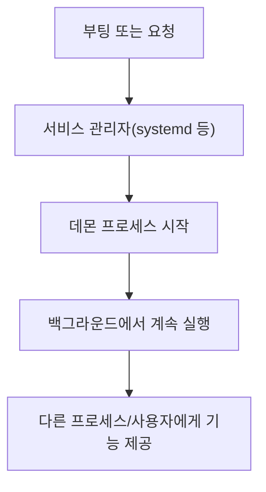
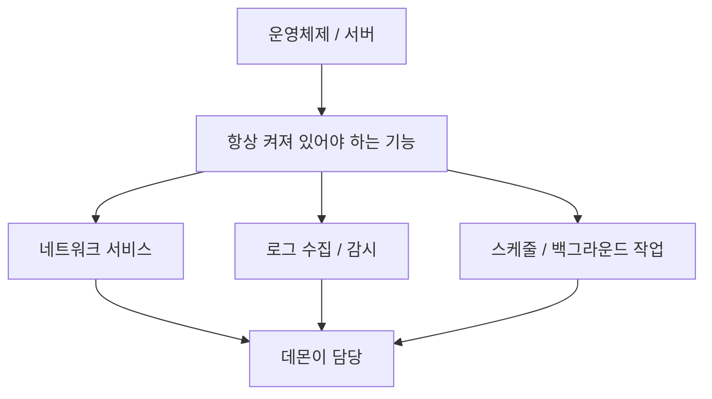
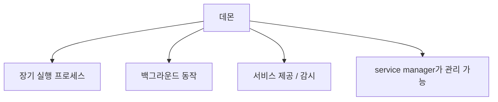
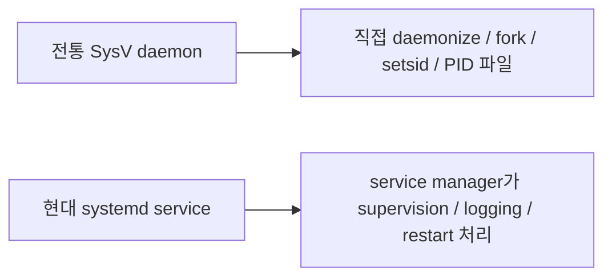
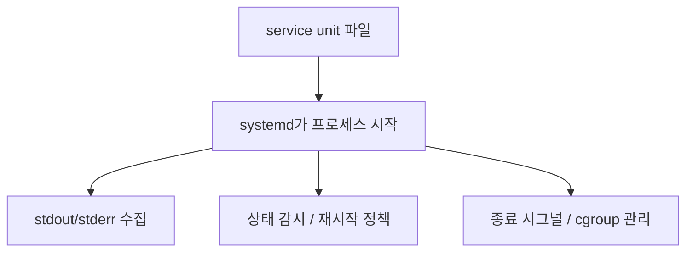
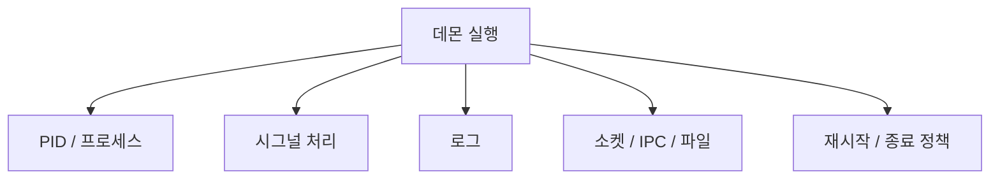
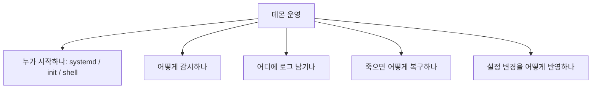

# 데몬(daemon) 상세 정리

작성 기준일: 2026-04-19  
조사 방식: 웹검색 기반 최신 조사  
주요 참고: `man7.org` / `freedesktop.org` systemd 문서, `redhat.com`

## 1. 한 줄 요약



`daemon`은 보통 Unix/Linux에서 백그라운드에서 계속 실행되며, 다른 프로세스를 위해 기능을 제공하거나 시스템 상태를 관리하는 장기 실행 서비스 프로세스를 뜻한다.

`daemon(7)`은 데몬을:

- background에서 실행되고
- 시스템을 감독하거나
- 다른 프로세스에 기능을 제공하는 서비스 프로세스

라고 설명한다.

즉 아주 단순하게 말하면:

- 사용자가 직접 앞에서 조작하는 interactive 프로그램이 아니라
- 뒤에서 계속 살아 있으면서
- 요청을 기다리거나 상태를 감시하는 서버형 프로세스

라고 이해하면 된다.

---

## 2. 왜 중요한가



운영체제와 서버는 사용자가 로그인해서 직접 실행하는 프로그램만으로 돌아가지 않는다.

항상 뒤에서 살아 있어야 하는 기능들이 있다.

예:

- 웹 서버
- SSH 서버
- 로그 수집기
- 스케줄러
- DNS 서버
- 메시지 큐 서버
- DB 서버

이런 것들은 대부분 데몬 형태로 동작한다.

즉 데몬을 이해하면:

- 리눅스 서비스가 어떻게 켜지는지
- 왜 `systemctl start`를 쓰는지
- 왜 어떤 프로세스는 터미널을 닫아도 살아 있는지
- 로그/시그널/재시작/장애복구가 어떻게 돌아가는지

를 같이 이해할 수 있다.

---

## 3. 데몬의 핵심 개념



### 3.1 long-running process

데몬은 보통 한 번 실행되면 짧게 끝나는 프로그램이 아니라 오래 살아 있는 프로세스다.

즉:

- 요청을 기다리거나
- 주기적으로 작업하거나
- 다른 프로세스 상태를 감시한다

### 3.2 background process

데몬은 일반적으로 interactive terminal에 묶여 있지 않다.

즉 사용자가 터미널을 닫아도 계속 살아 있을 수 있다.

다만 중요한 점:

- "백그라운드 프로세스"와 "데몬"은 완전히 같은 말은 아니다

단순히 `&` 붙여 백그라운드로 돌린 프로세스가 항상 잘 관리되는 데몬은 아니다.

### 3.3 service process

`daemon(7)`의 핵심 문구처럼, 데몬은 보통:

- 다른 프로세스에 기능을 제공하거나
- 시스템을 감독한다

즉:

- 수동 작업용 스크립트
- 한 번 실행하고 끝나는 배치

보다는 서비스 프로세스에 가깝다.

### 3.4 client/server와의 관계

많은 데몬은 서버 역할을 한다.

예:

- `sshd`
- `nginx`
- `mysqld`

하지만 모든 데몬이 네트워크 서버인 것은 아니다.

예:

- `cron`
- `systemd-journald`
- `dbus-daemon`

같이 로컬 시스템 기능을 담당하는 데몬도 많다.

즉 데몬은 "서비스 제공 방식"이지, 반드시 TCP 포트를 여는 프로그램만을 뜻하지는 않는다.

---

## 4. 전통적인 데몬과 현대적인 데몬



`daemon(7)`은 이 점을 매우 분명하게 설명한다.

### 4.1 전통적인 SysV 스타일

예전 Unix/SysV 스타일 데몬은 보통 직접 daemonization 절차를 구현했다.

대표적으로:

- 부모 프로세스에서 fork
- session 분리
- 작업 디렉터리 변경
- 파일 디스크립터 정리
- PID 파일 작성

등을 직접 했다.

### 4.2 왜 그랬나

옛 init 시스템은 지금의 systemd처럼 강한 supervision과 clean execution context를 잘 주지 못했다.

그래서 데몬 스스로:

- "나는 이제 터미널과 분리된 서비스 프로세스다"

라는 초기화 절차를 수행해야 했다.

### 4.3 현대 systemd 스타일

`daemon(7)`은 modern daemons should follow new-style daemons as implemented by systemd라고 설명한다.

즉 현대 Linux에서는:

- 데몬이 직접 복잡한 daemonization을 하는 대신
- systemd가 프로세스 시작/감시/재시작/로그 연결 등을 관리하는 쪽이 더 자연스럽다

### 4.4 핵심 차이

전통 스타일:

- 애플리케이션이 daemonization을 직접 담당

현대 스타일:

- 서비스 관리자(systemd)가 supervision을 담당

즉 지금은 "프로세스를 daemon처럼 만드는 코드"보다 "service unit에 맞게 잘 동작하는 프로세스"를 만드는 감각이 더 중요하다.

---

## 5. systemd 문맥에서 데몬은 어떻게 관리되나



`systemd.service` 문서는 `.service` unit file이 서비스 프로세스를 어떻게 관리하는지 설명한다.

### 5.1 service unit

현대 Linux에서 데몬은 보통:

- `.service` 유닛 파일

로 정의된다.

즉 운영자는:

- `ExecStart`
- `Restart`
- `User`
- `Environment`
- `Type`

같은 옵션으로 데몬 실행 방식을 제어한다.

### 5.2 supervision

systemd는:

- 프로세스를 시작하고
- 살아 있는지 감시하고
- 필요하면 재시작하고
- 종료 시 시그널을 전달하고
- 로그를 수집한다

즉 현대 데몬 운영에서 "실행"과 "감시"는 프로세스 내부가 아니라 service manager 바깥에서 이뤄진다.

### 5.3 logging

`daemon(7)`은 modern daemon이 보통:

- stdout/stderr가 journald로 연결된 clean context에서 시작된다고

설명한다.

즉 예전처럼 무조건 로그 파일을 직접 열어야 하는 감각은 줄었다.

### 5.4 restart policy

systemd는 데몬이 죽었을 때:

- 재시작할지
- 언제까지 재시도할지

를 정책으로 다룬다.

즉 서비스의 가용성도 프로세스 코드뿐 아니라 unit 설정의 문제다.

### 5.5 cgroup과 resource control

systemd 문서는 실행된 서비스 프로세스를 cgroup으로 관리한다.

즉:

- CPU/메모리 제한
- 프로세스 그룹 단위 종료

같은 운영 제어도 가능하다.

---

## 6. 데몬의 실제 동작 요소



데몬을 운영 관점에서 보면 몇 가지 공통 요소가 있다.

### 6.1 PID

데몬은 결국 프로세스이므로 PID를 가진다.

예전에는 PID 파일(`/var/run/...pid`)이 흔했지만, 현대 systemd 환경에서는 꼭 전통적 PID 파일에 의존하지 않을 수도 있다.

즉 "PID 파일이 있어야만 서비스"라는 감각은 오래된 패턴일 수 있다.

### 6.2 시그널

데몬은 보통:

- `SIGTERM`으로 정상 종료
- `SIGHUP`으로 설정 reload
- 기타 시그널 처리

를 정의하는 경우가 많다.

즉 `systemctl stop`, `systemctl reload`가 내부적으로 어떤 신호와 연결되는지도 중요하다.

### 6.3 로그

데몬은 대화형 프로그램이 아니므로:

- stdout/stderr
- syslog/journald
- 자체 로그 파일

중 하나 이상을 통해 상태를 남긴다.

즉 운영에서는 로그가 곧 데몬의 UI다.

### 6.4 소켓/IPC

많은 데몬은:

- TCP/UDP 포트
- Unix domain socket
- D-Bus
- FIFO

등을 통해 다른 프로세스와 통신한다.

즉 데몬은 "기능 제공"을 위해 대개 어떤 인터페이스를 외부에 노출한다.

### 6.5 graceful shutdown

좋은 데몬은 종료 시:

- 현재 작업 정리
- 파일/소켓 정리
- 상태 저장

을 하고 내려간다.

즉 강제 kill과 정상 종료는 다르다.

---

## 7. 실무에서 데몬을 볼 때 중요한 관점



실무에서 데몬을 이해할 때는 단순히 "백그라운드 프로세스"라고만 보면 부족하다.

### 7.1 누가 프로세스를 시작하는가

- systemd
- init script
- supervisor
- 직접 shell

이 출발점이 다르면 운영 방식도 달라진다.

### 7.2 어떻게 감시하는가

- systemd가 감시하는지
- 앱이 자체 watchdog를 가지는지
- health check가 있는지

### 7.3 장애 시 어떻게 복구되는가

- 자동 재시작 되는지
- 소켓 activation이 있는지
- state 복구가 가능한지

### 7.4 설정 변경을 어떻게 반영하는가

- 재시작이 필요한지
- reload가 가능한지

### 7.5 로그와 관찰성

- journald에 가는지
- 파일 로그를 남기는지
- metrics/health endpoint가 있는지

즉 데몬은 "돌아간다"보다 "`지속적으로 운영되는 프로세스`"라는 관점으로 읽어야 한다.

---

## 8. 자주 보는 데몬 예시

대표적인 Unix/Linux 데몬 예시:

- `sshd` = SSH 접속 서버
- `nginx` = 웹 서버 / 리버스 프록시
- `crond` = 스케줄러
- `systemd-journald` = 로그 수집
- `dbus-daemon` = IPC 버스
- `named` = DNS 서버(BIND)
- `mysqld`, `postgres` = DB 서버

이런 것들은:

- 장기 실행
- 백그라운드 동작
- 다른 프로세스/클라이언트를 위한 기능 제공

이라는 데몬의 전형적인 특징을 잘 보여 준다.

---

## 9. daemonization이란 무엇인가

전통적인 문맥에서 `daemonize`라는 말은:

- 프로세스를 터미널/세션에서 분리하고
- 백그라운드 서비스처럼 동작하게 만드는 초기화 절차

를 뜻했다.

### 9.1 왜 현대에는 덜 권장되나

`daemon(7)`은 modern daemon에서는 많은 전통적인 steps가 불필요하거나 systemd와 충돌할 수 있다고 설명한다.

예:

- double-fork
- 파일 디스크립터 정리
- 수동 daemon mode

즉 오늘날 Linux에서 새 프로그램을 만들 때는:

- 직접 daemonize하는 코드

보다

- foreground에서 잘 실행되는 프로세스 + systemd supervision

이 더 좋은 설계인 경우가 많다.

### 9.2 실무 감각

많은 현대 서비스는 오히려:

- `--daemon` 옵션 없이 foreground 실행
- systemd가 서비스로 관리

되는 구조가 더 자연스럽다.

즉 데몬 = 무조건 자기 안에서 백그라운드로 fork해야 한다는 생각은 오래된 감각일 수 있다.

---

## 10. socket activation과 timer activation

`daemon(7)`은 new-style daemon에서 socket-based activation과 timer-based activation을 강조한다.

### 10.1 socket activation

의미:

- systemd가 먼저 listening socket을 만들고
- 요청이 오면 데몬을 시작하거나
- 이미 실행 중인 데몬에 소켓을 넘긴다

장점:

- 병렬 부팅
- on-demand activation
- restart 중에도 소켓 유지 가능

즉 데몬이 직접 포트를 bind하는 것보다 운영적으로 유리할 수 있다.

### 10.2 timer activation

의미:

- 항상 살아 있는 데몬 대신
- timer unit이 주기적으로 작업 프로세스를 깨운다

즉:

- 정리 작업
- 배치 작업
- 주기적 maintenance

는 장기 상주 데몬이 아니라 timer + service 조합이 더 맞을 수 있다.

### 10.3 왜 중요한가

즉 "항상 떠 있는 프로세스"만이 데몬 설계의 정답은 아니다.

현대 systemd 세계에선:

- 소켓이 있으면 socket activation
- 주기 작업이면 timer activation

이 더 좋은 운영 모델일 수 있다.

---

## 11. 데몬과 일반 백그라운드 작업의 차이

이것도 자주 혼동된다.

### 11.1 단순 백그라운드 작업

예:

```bash
python script.py &
```

이건 그냥 쉘에서 프로세스를 백그라운드로 민 것일 수 있다.

하지만:

- 로그
- 재시작
- 부팅 시 시작
- 상태 감시

가 없다면 운영 서비스로서의 데몬이라고 보기 어렵다.

### 11.2 데몬

데몬은 보통:

- 지속 실행
- 서비스 관리자에 의해 관리
- 로그/시그널/재시작 정책 존재

를 가진다.

즉 단순 `nohup` + `&`와는 운영 품질이 다르다.

---

## 12. Windows Service와의 관계

Unix/Linux의 `daemon`에 대응하는 Windows 개념은 보통 `Windows Service`에 가깝다.

즉 이름은 다르지만 역할은 비슷하다.

- 사용자 세션과 독립
- 백그라운드 상주
- 시스템 부팅 시 시작 가능
- 서비스 관리자에 의해 관리

즉 데몬은 Unix/Linux 용어고, Windows에서는 service라는 표현이 더 자연스럽다.

---

## 13. 실무에서 자주 하는 오해

### 13.1 "데몬 = 그냥 뒤에서 도는 프로세스"

반만 맞다.

실무에서는 supervision, logging, restart, boot integration까지 포함해야 진짜 운영 서비스로서 의미가 있다.

### 13.2 "좋은 데몬은 직접 daemonize해야 한다"

현대 systemd 환경에서는 오히려 foreground 프로세스를 service manager가 관리하는 쪽이 더 낫다.

### 13.3 "PID 파일은 무조건 필요하다"

예전에는 흔했지만, modern service manager 환경에서는 꼭 그렇지 않다.

### 13.4 "데몬은 네트워크 서버여야 한다"

아니다.

cron, journald, dbus-daemon처럼 네트워크와 직접 관련 없는 시스템 데몬도 많다.

---

## 14. 실무 체크리스트

데몬을 설계/운영/리뷰할 때는 아래를 보면 좋다.

### 14.1 실행 방식

- foreground 프로세스로 두고 systemd가 관리하는가
- 전통 daemonization 코드가 꼭 필요한가

### 14.2 종료/재시작

- SIGTERM 시 정상 종료하는가
- restart policy가 있는가

### 14.3 로그

- stdout/stderr가 journald로 가는가
- 별도 로그 파일이 필요한가

### 14.4 설정 반영

- reload를 지원하는가
- restart가 필요한가

### 14.5 관찰성

- health check
- metrics
- 상태 확인 명령

즉 좋은 데몬은 "실행된다"보다 "운영된다"가 더 중요하다.

---

## 15. 한 문장 결론

데몬은 Unix/Linux에서 백그라운드에서 오래 살아 있으면서 다른 프로세스나 시스템 전체에 기능을 제공하는 서비스 프로세스를 뜻하며, 현대 Linux에서는 전통적인 fork 기반 daemonization보다 `systemd` 같은 서비스 관리자가 foreground 프로세스를 supervision하는 방식으로 이해하는 것이 더 정확하다.

---

## 참고 링크

- Linux man page `daemon(7)`: [daemon(7)](https://man7.org/linux/man-pages/man7/daemon.7.html)
- systemd service unit 문서: [systemd.service](https://www.freedesktop.org/software/systemd/man/253/systemd.service.html)
- systemd notify API: [sd_notify](https://www.freedesktop.org/software/systemd/man/253/sd_notify.html)
- systemd daemon APIs: [sd-daemon](https://www.freedesktop.org/software/systemd/man/sd-daemon.html)
- systemd-notify command: [systemd-notify](https://www.freedesktop.org/software/systemd/man/systemd-notify.html)
- Red Hat 하이퍼바이저 설명(배경지식): [What is a hypervisor?](https://www.redhat.com/en/topics/virtualization/what-is-a-hypervisor)

<!-- study-links:start -->
## 관련 문서

- `unix`: [[정보처리기사/4과목 프로그래밍 언어 활용/197 UNIX의 특징/197 UNIX의 특징|197 UNIX의 특징]]
- `fifo`: [[정보처리기사/4과목 프로그래밍 언어 활용/201 페이지 교체 알고리즘 - FIFO/201 페이지 교체 알고리즘 - FIFO|201 페이지 교체 알고리즘 - FIFO]]
- `dns`: [[DNS/DNS|DNS 상세 정리]]
- `udp`: [[정보처리기사/4과목 프로그래밍 언어 활용/216 TCP IP 프로토콜 - UDP/216 TCP IP 프로토콜 - UDP|216 TCP/IP 프로토콜 - UDP]]
- `ssh`: [[정보처리기사/5과목 정보시스템 구축 관리/324 SSH(Secure SHell, 시큐어 셸)/324 SSH(Secure SHell, 시큐어 셸)|324 SSH(Secure SHell, 시큐어 셸)]]
<!-- study-links:end -->
