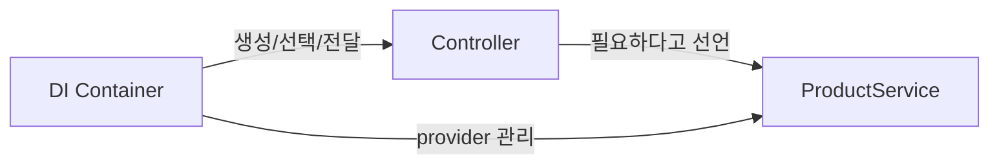
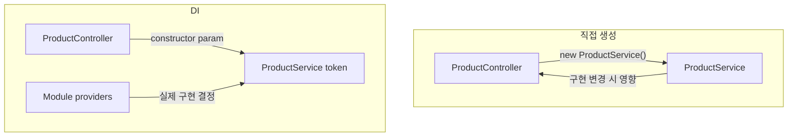
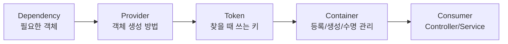
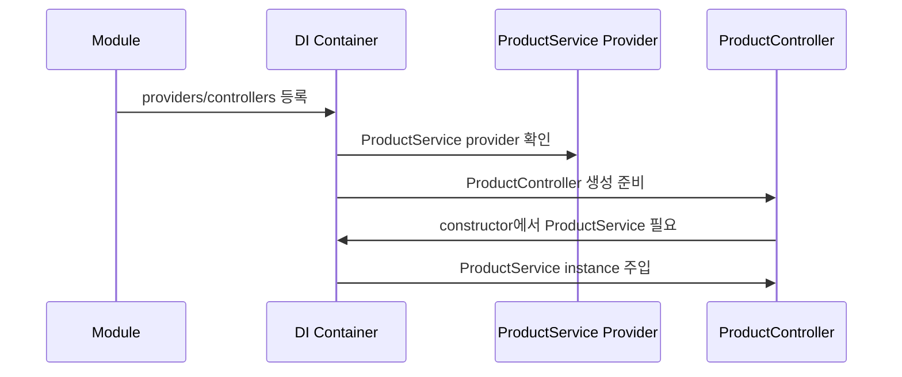
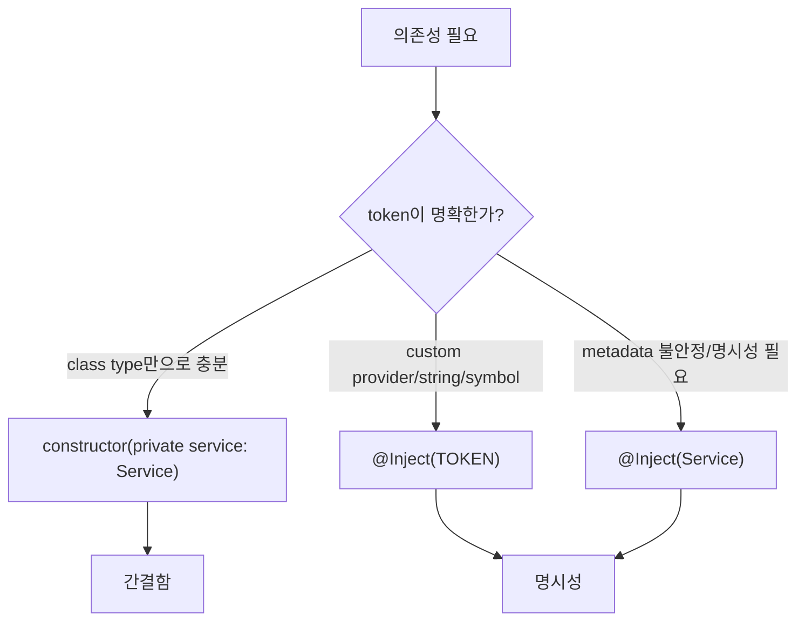
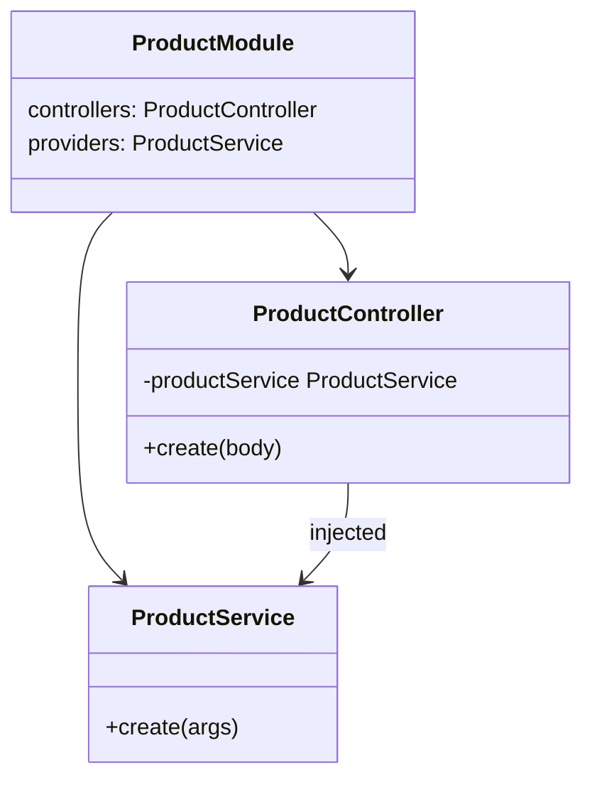
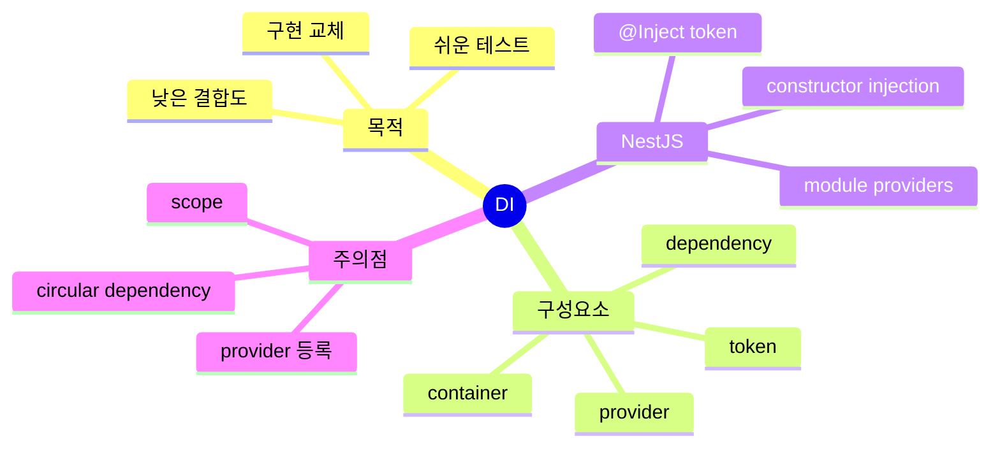

# Dependency Injection

## 1. 한 줄 요약

Dependency Injection(DI, 의존성 주입)은 클래스가 필요한 객체를 직접 만들지 않고, 외부의 컨테이너나 조립 코드가 만들어 전달하게 하는 설계 방식이다.



- 핵심은 `new ProductService()`를 사용하는 곳마다 직접 호출하지 않는 것이다.
- 클래스는 "무엇이 필요한지"만 선언하고, "어떻게 만들지"는 DI 컨테이너가 담당한다.
- NestJS에서는 `providers`에 등록된 class, value, factory 등이 DI 대상이 된다.

## 2. 왜 중요한가

DI는 코드 결합도를 낮추고, 테스트와 교체를 쉽게 만든다. 직접 생성 방식은 의존 대상이 바뀔 때 사용하는 클래스도 같이 바뀌기 쉽다.



- 유지보수: 의존 대상 생성 로직이 여러 파일에 흩어지지 않는다.
- 테스트: 실제 구현 대신 mock, stub, fake provider를 넣을 수 있다.
- 확장: 같은 token에 다른 구현을 연결해 환경별 동작을 바꿀 수 있다.
- 책임 분리: controller는 HTTP 처리, service는 use case, module은 조립 책임을 맡는다.

## 3. 핵심 개념

DI를 이해할 때는 `dependency`, `provider`, `token`, `container`, `consumer`를 구분하면 된다.



- Dependency: 어떤 클래스가 동작하기 위해 필요한 객체다. 예: `ProductController` 입장의 `ProductService`.
- Provider: dependency를 만드는 방법이다. NestJS의 `providers` 배열에 class나 factory provider로 등록한다.
- Token: 컨테이너가 provider를 찾는 키다. 보통 class 자체가 token이지만 문자열, symbol, custom token도 가능하다.
- Container: provider를 등록하고 필요할 때 인스턴스를 만들어 주입하는 런타임 시스템이다.
- Consumer: dependency를 주입받아 사용하는 class다.

## 4. 동작 흐름

NestJS 기준으로 DI는 module metadata를 읽고 provider graph를 만든 뒤, controller나 service의 constructor에 필요한 provider를 넣어준다.

`module metadata`는 `@Module({...})` 데코레이터에 넘기는 설정 객체다. 이 metadata는 Nest에게 "이 module이 어떤 controller와 provider를 소유하는지", "다른 module에서 무엇을 가져오는지", "외부 module에 무엇을 공개하는지"를 알려준다.



- module은 controller와 provider 목록을 선언한다.
- `controllers`는 HTTP 요청 같은 외부 입력을 받는 entry point를 module에 묶는다.
- `providers`는 service, repository, factory처럼 DI container가 생성하고 주입할 대상을 등록한다.
- `imports`는 다른 module이 `exports`로 공개한 provider를 현재 module에서 사용할 수 있게 연결한다.
- `exports`는 현재 module의 provider 중 다른 module이 import해서 사용할 수 있는 공개 API를 정한다.
- 컨테이너는 token을 기준으로 어떤 provider를 사용할지 찾는다.
- constructor parameter에 class type metadata가 있으면 Nest가 type 기반으로 resolve할 수 있다.
- `@Inject(ProductService)`를 쓰면 type metadata 추론에만 기대지 않고 token을 명시한다.

## 5. 중요한 디테일과 트레이드오프

DI는 편하지만, 모든 문제를 자동으로 해결하지 않는다. token 등록, scope, circular dependency, 테스트 override를 명확히 이해해야 한다.



- `@Inject()` 장점: 주입 token이 코드에 명시되어 custom provider나 factory provider를 읽기 쉽다.
- `@Inject()` 단점: 일반 class provider에서는 코드가 조금 장황해질 수 있다.
- 데코레이터 없이 쓰는 조건: TypeScript decorator metadata가 런타임에 남아야 하고, 해당 class token provider가 module에 등록되어 있어야 한다.
- scope 주의: singleton에 request-scoped provider를 잘못 주입하면 lifecycle 문제가 생길 수 있다.
- circular dependency: A가 B를, B가 A를 필요로 하면 설계 경계를 다시 보는 것이 우선이다.

## 6. 실전 예시

`test-player`의 `ProductController`는 `ProductService`를 직접 생성하지 않고 constructor에서 요청한다. 현재 코드는 token 명시를 위해 `@Inject(ProductService)`를 사용한다.



```ts
constructor(
  @Inject(ProductService)
  private readonly productService: ProductService,
) {}
```

- 이 형태는 "ProductService token으로 provider를 찾아 이 parameter에 넣어라"는 의미다.
- 아래처럼 쓸 수도 있다.

```ts
constructor(private readonly productService: ProductService) {}
```

- 단, 이 간단한 형태는 Nest가 constructor parameter type metadata를 읽어 `ProductService`를 resolve할 수 있어야 한다.
- 테스트에서는 provider override로 `ProductService`의 fake 구현을 넣으면 controller만 분리해서 검증할 수 있다.

## 7. 용어 정리와 빠른 복습

DI는 "생성 책임을 사용하는 클래스 밖으로 빼는 것"이고, IoC는 "흐름 제어를 프레임워크/컨테이너에 넘기는 더 넓은 개념"이다.



- DI: dependency를 외부에서 주입받는 패턴.
- IoC: 객체 생성과 연결 흐름의 제어권을 사용자 코드가 아니라 컨테이너/프레임워크가 갖는 방식.
- Provider: dependency를 제공하는 등록 단위.
- Token: provider를 찾는 키.
- Constructor injection: constructor parameter로 dependency를 받는 방식.

## 8. 참고 링크

- [NestJS Providers 공식 문서](https://docs.nestjs.com/components)
- [Angular Dependency Injection 공식 문서](https://angular.dev/guide/di)
- [.NET Dependency Injection 공식 문서](https://learn.microsoft.com/en-us/dotnet/core/extensions/dependency-injection/overview)
