# Dubright ShockWave

## 1. 한 줄 요약

- `dubright_front`의 `ShockWave`는 Dubright 프론트가 오디오 파일을 로드·디코딩·캐싱하고, `Tone.js`로 재생하며, `canvas`에 waveform을 그리는 사내 오디오 엔진이다.
- 핵심 파일은 `src/components/js/ShockWave.js`이고, 화면에서는 대부분 `src/components/audioWorkSpace/common/ShockWave.vue` wrapper component로 쓰인다.
- 녹음 쪽은 별도 class인 `src/components/js/ShockWaveMic.js`가 `getUserMedia`와 `MediaRecorder`를 사용한다.

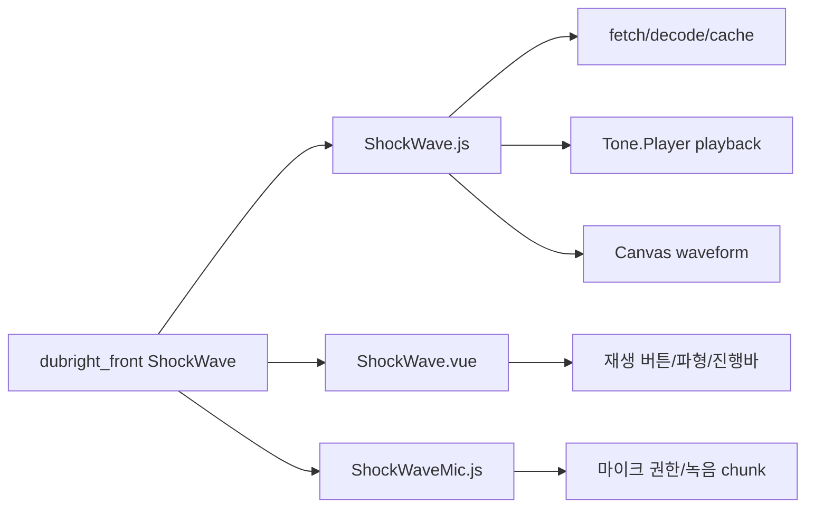

## 2. 대상 식별과 범위

- 이번 조사 대상은 다음 로컬 코드다.
  - `dubright_front/src/components/js/ShockWave.js`
  - `dubright_front/src/components/audioWorkSpace/common/ShockWave.vue`
  - `dubright_front/src/components/js/ShockWaveMic.js`
  - `dubright_front/src/components/js/AudioContextManager.js`
  - `dubright_front/src/components/js/effect.js`
- `package.json` 기준 `dubright_front`는 `tone` `^15.0.4`, Vue 3, Quasar 2를 사용한다.
- 이름은 `ShockWave`지만 실제 의미는 "충격파 그래픽"이 아니라 "audio waveform + playback engine"에 가깝다.
- 기존 `dubright` wiki에도 같은 코드 기반의 `shockwave-audio-engine.md`가 존재한다. 이번 노트는 해당 wiki와 실제 소스, Tone.js/MDN 공식 문서를 함께 대조해 study note 형태로 다시 정리한 것이다.

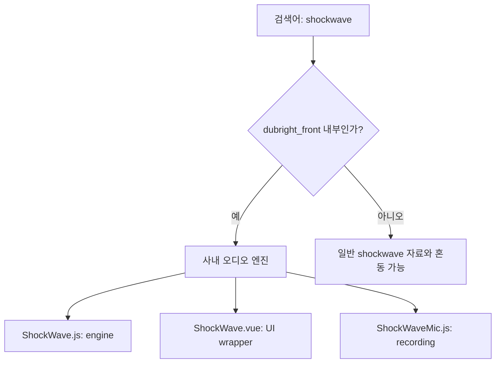

## 3. 레이어 구조

- Engine layer
  - `ShockWave.js`
  - URL load, `AudioBuffer` cache, `Tone.Player`, effect chain, waveform draw, cleanup을 담당한다.
- UI wrapper layer
  - `ShockWave.vue`
  - 재생/정지 버튼, 파형 숨김 버튼, progress bar, `SoundEffectIndicator`, prop/watch 기반 reload/redraw를 담당한다.
- Shared audio context layer
  - `AudioContextManager.js`
  - singleton `AudioContext`를 만들고, audio node registry를 관리한다.
- Recording layer
  - `ShockWaveMic.js`
  - 마이크 권한 획득, `MediaRecorder` chunk 수집, `AnalyserNode` 연결, data receiver fan-out을 담당한다.
- Diagnostics layer
  - `AudioDebugLogger.js`, `MemoryMonitor.vue`
  - active node/playback counter, JSON export, cache clear, 메모리 패널을 제공한다.

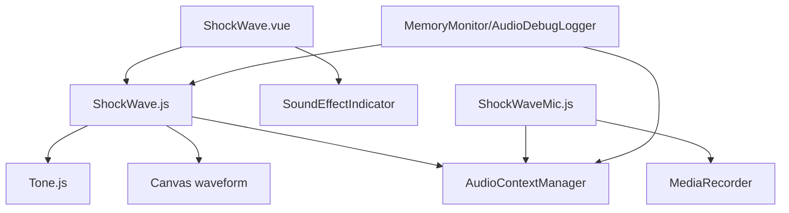

## 4. 로드, 디코딩, AudioBuffer 캐시

- `ShockWave.load(url, effects, auto_play)` 흐름
  - `this.url`을 저장한다.
  - `AudioContextManager.getContext()`로 공유 `AudioContext`를 연다.
  - `data:` URL이 아니면 module-level `audioBufferCache`를 먼저 확인한다.
  - 캐시 hit이면 `refCount`를 증가시키고 `_processAudioBuffer()`로 바로 넘긴다.
  - 캐시 miss이면 `fetch(url) -> arrayBuffer() -> decodeAudioData()` 순서로 디코딩한다.
  - 디코딩 성공 시 URL 기반 cache에 `{ buffer, refCount: 1 }`로 저장한다.
- `_processAudioBuffer()`
  - `duration`을 저장한다.
  - 최대 2채널까지 `audioBuffer.getChannelData(channelNum)` 결과를 `sampleBuffer`에 보관한다.
  - 새 오디오 데이터가 들어오면 waveform cache를 초기화한다.
  - 같은 `AudioBuffer`를 `loadTone(audioBuffer)`에 넘겨 Tone.js 쪽 이중 다운로드를 피한다.
- 외부 API 의미
  - MDN 기준 `decodeAudioData()`는 `fetch`, `XMLHttpRequest`, `FileReader` 등으로 얻은 완전한 `ArrayBuffer` 오디오 데이터를 비동기로 디코딩해 `AudioBuffer`로 만든다.
  - MDN은 `AudioContext`를 재사용하는 것을 권장한다. Dubright의 `AudioContextManager`도 같은 방향으로 singleton context를 쓴다.

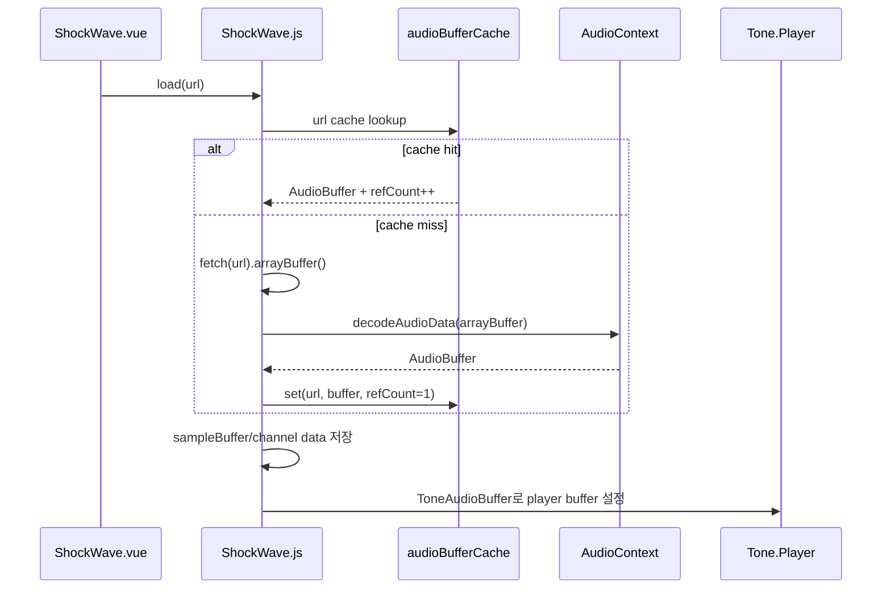

## 5. Waveform 렌더링

- `draw(targetElement, channelNum, millisecondPerPixel, height, volume)`이 waveform을 그린다.
- 계산 방식
  - `duration * 1000`으로 전체 ms를 구한다.
  - `millisecondPerPixel`과 `playbackRate`로 전체 waveform width를 계산한다.
  - channel, width, height를 cache key로 삼아 `cachedSamplesForDraw`를 재사용한다.
  - 각 pixel 구간마다 sample의 positive 평균과 negative 평균을 모아 `[positive, negative]` 배열로 저장한다.
- 긴 오디오 대응
  - browser canvas의 최대 width를 런타임에서 감지한다.
  - 기본 fallback은 `8192px`이다.
  - waveform이 최대 canvas width를 넘으면 여러 canvas tile로 나누어 `inline-block`으로 붙인다.
- draw style
  - `wave`: pixel 단위 세로 막대형 waveform을 촘촘히 그린다.
  - `bar`: `space + barWidth` 단위로 묶어 rounded bar 형태로 그린다.
- volume/gain 반영
  - waveform 높이에 `0.4 * volume`을 곱한다.
  - `ShockWave.vue.setGain()`은 audio reload 없이 engine의 gain을 바꾸고, `requestAnimationFrame`으로 waveform redraw를 예약한다.

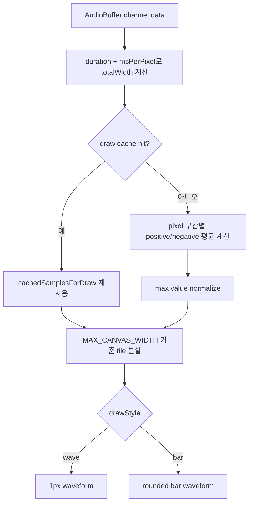

## 6. Tone.js 재생과 스케줄링

- `loadTone(urlOrBuffer, auto_play)`
  - 기존 Tone node를 `unloadTone()`으로 정리한다.
  - `Tone.setContext(audioManager.getContext())`로 Tone.js가 공유 `AudioContext`를 쓰도록 맞춘다.
  - `Tone.Player`를 생성한다.
  - `AudioBuffer`가 직접 들어오면 `Tone.ToneAudioBuffer`로 감싼 뒤 player buffer에 넣는다.
  - URL이 들어오면 `Tone.Player.load(url)`을 호출한다.
- `playSound(position, duration, speed, volume, scheduleDelay)`
  - `scheduleDelay > 0.1s`면 실제 node 생성을 재생 직전까지 미룬다.
  - 이 `LOOKAHEAD_SEC = 0.1` 구조는 동시에 많은 clip/hole을 예약할 때 node를 너무 일찍 만들지 않으려는 최적화로 보인다.
- `_executePlaySound()`
  - input/output `Tone.Gain` node를 만든다.
  - effect chain을 구성한다.
  - `Tone.now() + scheduleDelay`를 기준으로 `Tone.Player.start(startWhen, position, duration)`을 호출한다.
  - `onstop`을 primary cleanup으로 쓰고, `duration + scheduleDelay + 2초` safety timer를 fallback으로 둔다.
- Tone.js 공식 문서와 매칭
  - `Tone.Player`는 start/loop/stop을 가진 audio file player다.
  - `Player.start(time, offset, duration)`은 지정 시각, 시작 offset, 재생 길이를 받을 수 있다.
  - Dubright의 `position`은 Tone의 offset, `duration`은 sample play length에 대응한다.

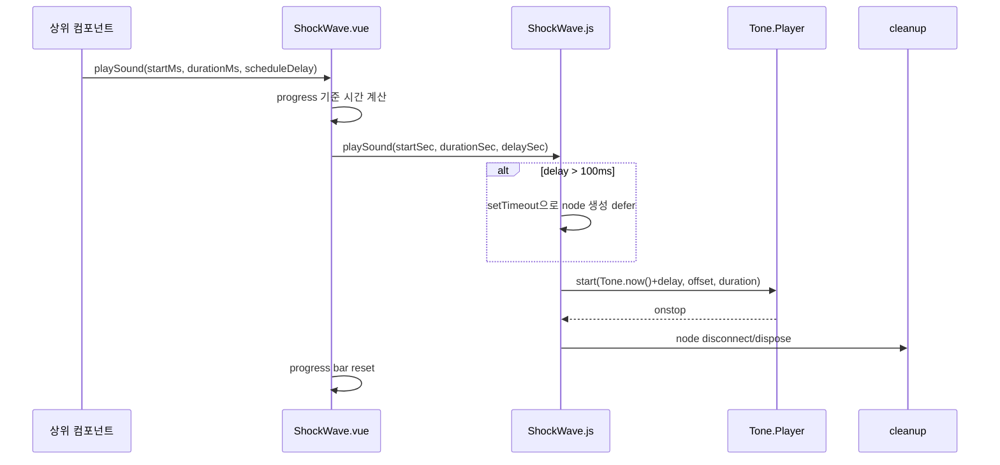

## 7. Effect 모델과 체인

- 기본 effect shape는 `effect.js`의 `DEFAULT_EFFECT`가 정의한다.
  - `eq.gain_values`: 9-band gain 배열
  - `delay.delay`, `delay.feedback`
  - `reverb.decay`, `reverb.preDelay`
  - `pitch_shift`
  - `chorus.frequency`, `chorus.depth`, `chorus.delayTime`
  - `gain.value`
- engine은 재생 직전에 effect node를 만든다.
  - EQ
  - Chorus
  - Reverb
  - FeedbackDelay
  - PitchShift
  - Gain
- EQ 구현
  - `Tone.MultibandSplit(250, 2000)`로 큰 대역을 나눈다.
  - low/mid/high를 다시 `MultibandSplit(50, 120)`, `(500, 1000)`, `(6000, 8000)`으로 나눈다.
  - 총 9개 gain node를 `output_multibandmain`으로 합친다.
- wrapper 최적화
  - `effects` watcher에서 gain만 바뀌었는지 검사한다.
  - gain만 바뀌면 `setGain()`만 호출한다.
  - delay/reverb/EQ/pitch/chorus가 바뀌면 `setEffect()`를 호출해 Tone player/effect chain을 다시 구성한다.
- 공식 문서와 매칭
  - Tone.js `Chorus`는 좌우 delay와 LFO 기반 stereo chorus effect다.
  - `FeedbackDelay`는 delay 출력 일부를 다시 delay input으로 되먹이는 effect다.
  - `PitchShift`는 입력 신호를 거의 실시간으로 pitch shifting한다.
  - `MultibandSplit`은 입력을 low/mid/high 세 대역으로 나누는 component다.

```mermaid
flowchart LR
    Player["Tone.Player"] --> Input["Input Gain"]
    Input --> EQ{"EQ 적용?"}
    EQ -- "yes" --> MB["MultibandSplit tree"]
    EQ -- "no" --> Chorus
    MB --> Chorus{"Chorus 적용?"}
    Chorus -- "yes" --> ChorusNode["Tone.Chorus"]
    Chorus -- "no" --> Reverb
    ChorusNode --> Reverb{"Reverb 적용?"}
    Reverb -- "yes" --> ReverbNode["Tone.Reverb"]
    Reverb -- "no" --> Delay
    ReverbNode --> Delay{"Delay 적용?"}
    Delay -- "yes" --> DelayNode["Tone.FeedbackDelay"]
    Delay -- "no" --> Pitch
    DelayNode --> Pitch{"Pitch 적용?"}
    Pitch -- "yes" --> PitchNode["Tone.PitchShift"]
    Pitch -- "no" --> Gain
    PitchNode --> Gain{"Gain != 1?"}
    Gain -- "yes" --> GainNode["Tone.Gain"]
    Gain -- "no" --> Output["Destination"]
    GainNode --> Output
```

## 8. Vue wrapper의 UX 역할

- `ShockWave.vue`가 화면에 제공하는 것
  - 재생/정지 toggle button
  - waveform hide/show button
  - left/right channel waveform container
  - progress bar
  - sound effect indicator
  - loading failed 표시
- props의 의미
  - `url`: 오디오 URL
  - `channel`: `mono` 또는 `stereo`
  - `drawStyle`: `wave` 또는 `bar`
  - `waveHeight`: waveform 높이
  - `left_trim_ms`, `right_trim_ms`: 재생 trim
  - `duration_ms_force`: 실제 audio duration 대신 timeline duration을 강제로 맞출 때 사용
  - `volume`: track/clip volume
  - `effects`, `parent_effect`: local/parent effect
  - `margin`: timeline상 clip offset
  - `skip_waveform_render`: waveform을 숨기되 audio load는 유지
  - `is_tts`: TTS waveform indicator padding 판단에 사용
- watcher 흐름
  - `url` 변경 시 `load()`
  - `scale` 변경 시 loaded 상태면 waveform redraw
  - `volume` 변경 시 `setVolume()` 후 redraw throttle
  - `effects` 변경 시 gain-only optimization 또는 `setEffect()`
  - `skip_waveform_render`가 false로 돌아오면 redraw
- 클릭 UX
  - 재생 버튼 클릭 시 `left_trim_ms`부터 `duration - right_trim - left_trim` 만큼 재생한다.
  - waveform click + `ctrlKey`는 `quick-punch` event를 emit한다.
  - recording mode에서는 waveform click이 quick-punch로 이어지지 않고 timeline 이동 역할만 남긴다.

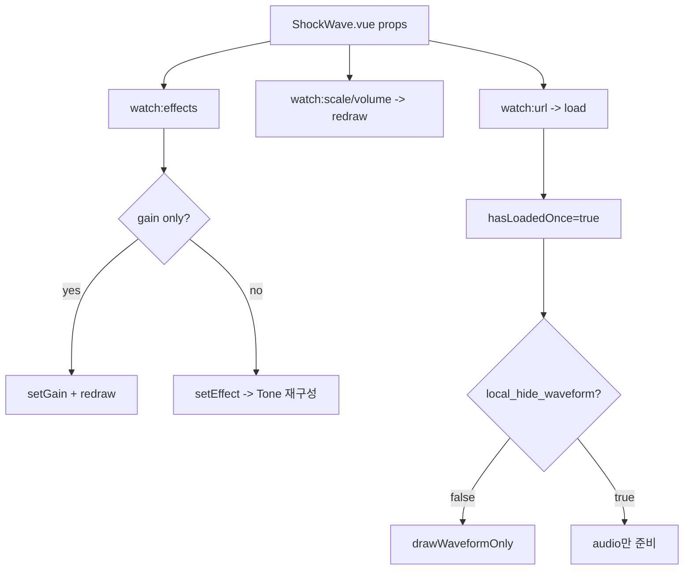

## 9. ShockWaveMic 녹음 구조

- `ShockWaveMic`는 재생용 `ShockWave`와 별개 class다.
- 기본 옵션
  - `bufferSize: 20`
  - `fftSize: 64`
  - `sampleRate: 48000`
  - `audioBitsPerSecond: 128000`
  - `fps: 30`
- MIME type
  - 우선 `audio/webm;codecs=opus`
  - fallback `audio/webm`
  - `MediaRecorder.isTypeSupported()`로 지원 여부를 판단한다.
- 권한/녹음 흐름
  - `getMicPermission()` 또는 `startMic()`에서 `navigator.mediaDevices.getUserMedia()`를 호출한다.
  - `MediaRecorder(stream, { mimeType, audioBitsPerSecond })`를 생성한다.
  - 공유 `AudioContext`에서 `createMediaStreamSource(stream)`을 만들고 `AnalyserNode`에 연결한다.
  - `startRecord()`는 `mediaRecorder.start(bufferSize)`를 호출한다.
  - `ondataavailable`마다 chunk를 `recordingChunks`에 쌓고 receiver callback들에 전달한다.
  - `onstop`에서 모든 chunk를 합쳐 `completeRecording` Blob을 만든다.
- 외부 API 의미
  - MDN 기준 `MediaRecorder.start(timeslice)`는 지정 ms마다 `dataavailable` event를 낼 수 있다. Dubright는 20ms bufferSize를 timeslice로 넣는다.
  - `createMediaStreamSource(stream)`은 `getUserMedia()`로 얻은 stream을 Web Audio processing graph의 source node로 바꾼다.

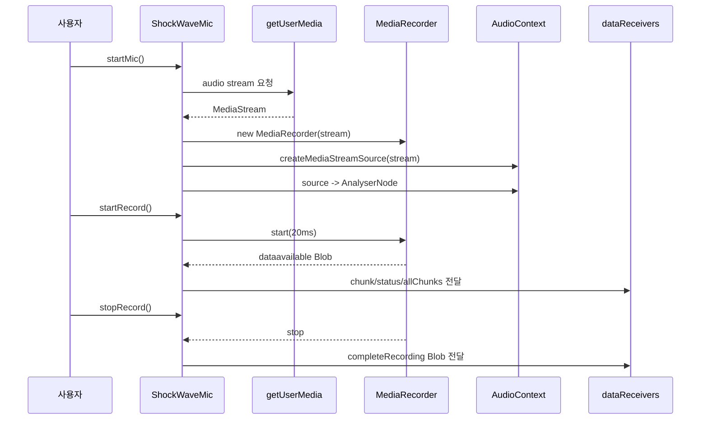

## 10. Cleanup, 메모리, 디버깅

- `ShockWave.stopSound()`
  - deferred play timer를 취소한다.
  - `Tone.Player.stop()`과 `disconnect()`를 호출한다.
  - 현재 재생 중인 effect/input/output node를 dispose하고 `AudioContextManager` registry에서 제거한다.
  - `need_to_dispose`를 비운다.
- `ShockWave.destory()`
  - `destroy`가 아니라 `destory`로 오타가 난 public method다.
  - `stopSound()`와 `unloadTone()`을 호출한다.
  - cacheable URL이면 `audioBufferCache`의 `refCount`를 감소시키고 0이면 삭제한다.
  - input/effect registry도 제거한다.
- 주의할 점
  - `ShockWave.vue.unmounted()`는 현재 `this.shockWave?.stopSound()`만 호출한다.
  - 즉 wrapper unmount가 항상 `destory()`까지 호출해 cache refCount를 낮추는지는 코드상 보장되지 않는다.
  - 장시간 오디오 작업에서 메모리 증가가 보이면 이 지점을 먼저 확인해야 한다.
- 디버깅 도구
  - `AudioContextManager`는 registered node 수가 500개를 넘으면 leak/excessive playback 가능성을 warning한다.
  - `AudioDebugLogger`는 node created/disposed, play/stop, active playback counter를 기록하고 JSON export를 지원한다.
  - `MemoryMonitor.vue`는 `clearAudioBufferCache()`와 work history clear 후 reload하는 강제 cleanup path를 제공한다.

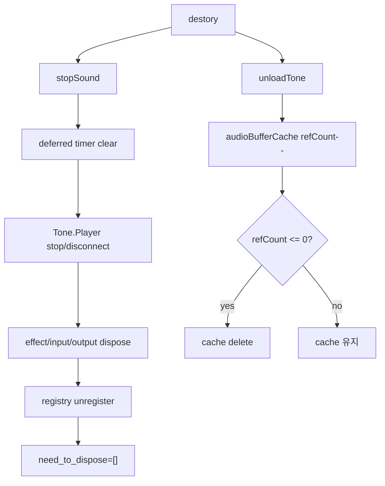

## 11. 사용 위치와 업무 흐름

- 주요 호출 위치
  - `audioWorkSpace/audiowork/AudioClip.vue`: 오디오 clip waveform과 playback
  - `audioWorkSpace/voicework/RecordHole.vue`: TTS, artist record, user record waveform
  - `dialog/HolePreview.vue`: 녹음 hole preview
  - `dialog/DialogRecordHistory.vue`: record history preview
  - `dialog/DialogSubmitDubbing.vue`: 제출 전 dubbing preview
  - `audioWorkSpace/common/ObjectSoundEffectMixin.vue`: 음향 효과 preview용 direct `new ShockWave()`
  - `pages/artist/record/FunctionTest.vue`: 테스트/legacy 성격
- 실제 업무 흐름
  - episode content JSON이나 record helper가 audio URL과 effect 정보를 만든다.
  - 상위 컴포넌트가 `<ShockWave>`에 URL, trim, effect, volume, timeline scale을 전달한다.
  - wrapper는 audio를 load하고, 필요한 경우 waveform을 그린다.
  - 사용자가 play하거나 timeline 전체 재생이 시작되면 `playSound()`가 trim/margin/scheduleDelay를 반영해 engine을 호출한다.
  - engine은 Tone.js graph를 구성해 audio destination으로 보낸다.

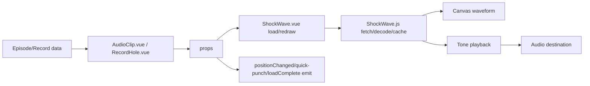

## 12. Known gaps와 점검 포인트

- `destory()` 오타
  - public cleanup method 이름이 `destory()`다.
  - 직접 호출하는 경로는 이 이름을 따라야 하므로 신규 코드에서 `destroy()`로 호출하면 동작하지 않는다.
- wrapper unmount cleanup
  - `ShockWave.vue.unmounted()`가 `destory()`를 호출하지 않는다.
  - URL cache refCount 감소, Tone player dispose가 누락될 수 있는지 실제 장시간 화면 전환에서 검증해야 한다.
- stale recorder 흔적
  - `ShockWave.js` constructor 안에는 `mediaRecorder`, `recordStream`, `recordingDuration` 같은 녹음 관련 필드가 남아 있지만 실제 녹음은 `ShockWaveMic.js`가 담당한다.
  - `FunctionTest.vue`에는 현재 `ShockWave.js`에 없는 API를 호출하는 흔적이 있어 stale 가능성이 높다.
- debug counter 정확도
  - `AudioDebugLogger.nodeCreated()`는 input/output 2개를 먼저 기록하고 dispose 때는 `need_to_dispose.length`를 빼는 구조다.
  - effect chain이 복잡할 때 counter가 실제 node 수와 정확히 맞는지는 별도 runtime 검증이 필요하다.
- `decodeAudioData()` catch 범위
  - 코드에서는 `decodeAudioData(arrayBuffer)` 호출을 `try/catch`로 감싸지만, promise rejection 처리도 함께 봐야 한다.
  - 현재 전체 chain 마지막에 `.catch()`가 있어 load 실패는 `false`로 내려간다.

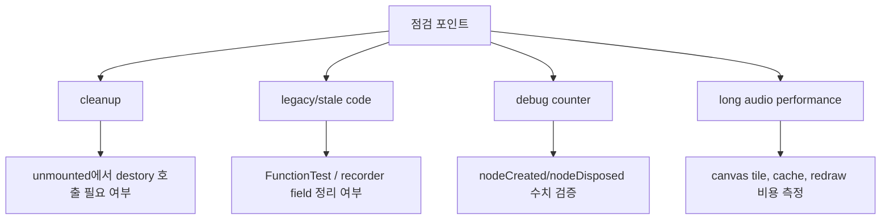

## 13. 빠른 복습

- `ShockWave.js`
  - 재생 engine이다.
  - URL fetch, Web Audio decode, cache, Tone.Player, effect chain, canvas waveform을 담당한다.
- `ShockWave.vue`
  - 화면 component다.
  - button, progress bar, waveform DOM, props/watch, event emit을 담당한다.
- `ShockWaveMic.js`
  - 녹음 engine이다.
  - 마이크 stream, MediaRecorder chunk, analyser node, receiver callback을 담당한다.
- `AudioContextManager.js`
  - 공유 `AudioContext`와 audio node registry를 관리한다.
- `effect.js`
  - Dubright의 음향 효과 데이터 shape와 preset을 정의한다.

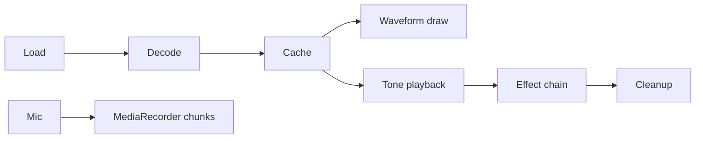

## 참고 링크

- [dubright_front ShockWave.js](/Users/nes0903/Documents/dobedub/dubright_front/src/components/js/ShockWave.js)
- [dubright_front ShockWave.vue](/Users/nes0903/Documents/dobedub/dubright_front/src/components/audioWorkSpace/common/ShockWave.vue)
- [dubright_front ShockWaveMic.js](/Users/nes0903/Documents/dobedub/dubright_front/src/components/js/ShockWaveMic.js)
- [dubright_front AudioContextManager.js](/Users/nes0903/Documents/dobedub/dubright_front/src/components/js/AudioContextManager.js)
- [dubright_front effect.js](/Users/nes0903/Documents/dobedub/dubright_front/src/components/js/effect.js)
- [dubright_front MemoryMonitor.vue](/Users/nes0903/Documents/dobedub/dubright_front/src/components/debug/MemoryMonitor.vue)
- [dubright wiki - shockwave-audio-engine.md](/Users/nes0903/Documents/dobedub/dobedub-wiki/services/dubright/workflows/shockwave-audio-engine.md)
- [Tone.js 15.0.4 - Player](https://tonejs.github.io/docs/15.0.4/classes/Player.html)
- [Tone.js 15.0.4 - FeedbackDelay](https://tonejs.github.io/docs/15.0.4/classes/FeedbackDelay.html)
- [Tone.js 15.0.4 - Chorus](https://tonejs.github.io/docs/15.0.4/classes/Chorus.html)
- [Tone.js 15.0.4 - PitchShift](https://tonejs.github.io/docs/15.0.4/classes/PitchShift.html)
- [Tone.js 15.0.4 - MultibandSplit](https://tonejs.github.io/docs/15.0.4/classes/MultibandSplit.html)
- [MDN - AudioContext](https://developer.mozilla.org/en-US/docs/Web/API/AudioContext)
- [MDN - BaseAudioContext.decodeAudioData()](https://developer.mozilla.org/en-US/docs/Web/API/BaseAudioContext/decodeAudioData)
- [MDN - AudioContext.createMediaStreamSource()](https://developer.mozilla.org/en-US/docs/Web/API/AudioContext/createMediaStreamSource)
- [MDN - MediaRecorder.start()](https://developer.mozilla.org/en-US/docs/Web/API/MediaRecorder/start)
- [MDN - MediaRecorder dataavailable event](https://developer.mozilla.org/en-US/docs/Web/API/MediaRecorder/dataavailable_event)
- [MDN - MediaDevices.getUserMedia()](https://developer.mozilla.org/en-US/docs/Web/API/MediaDevices/getUserMedia)

<!-- study-links:start -->
## 관련 문서

- `dubright`: [[dubright-yarn/dubright-yarn|dubright_front의 Yarn 패키지 매니저]]
- `스케줄링`: [[정보처리기사/4과목 프로그래밍 언어 활용/204 스케줄링 - SJF/204 스케줄링 - SJF|204 스케줄링 - SJF]]
<!-- study-links:end -->
