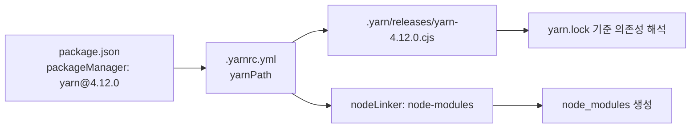
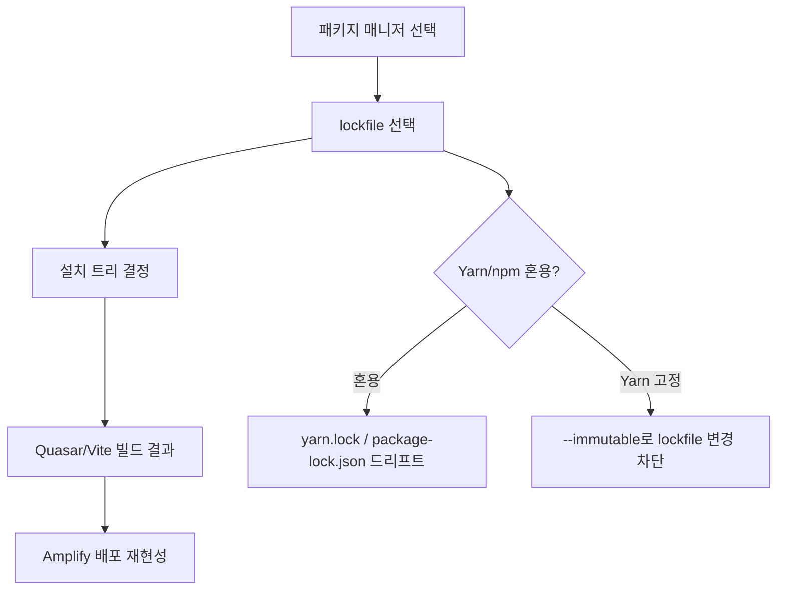
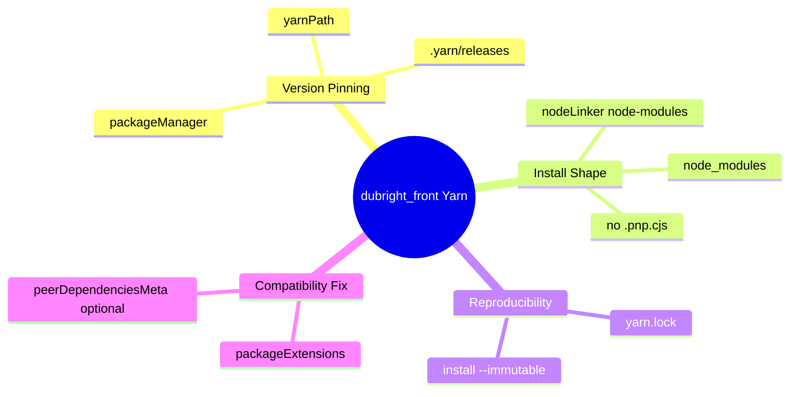
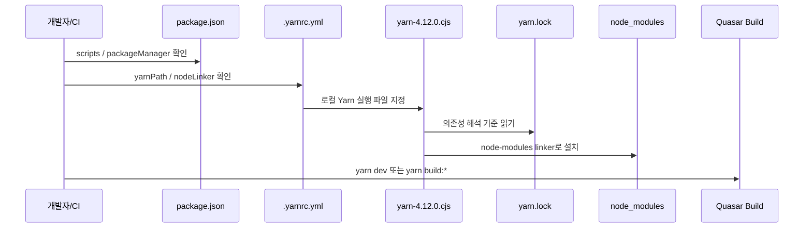
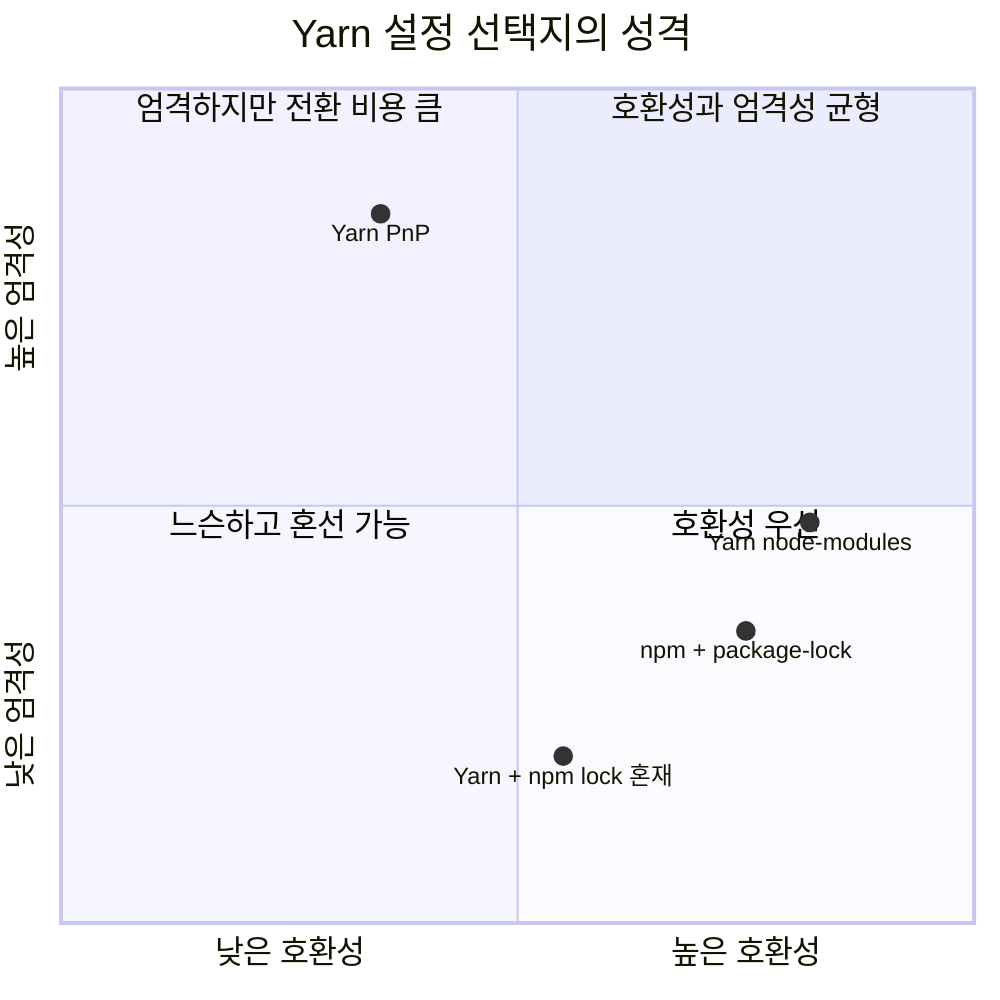
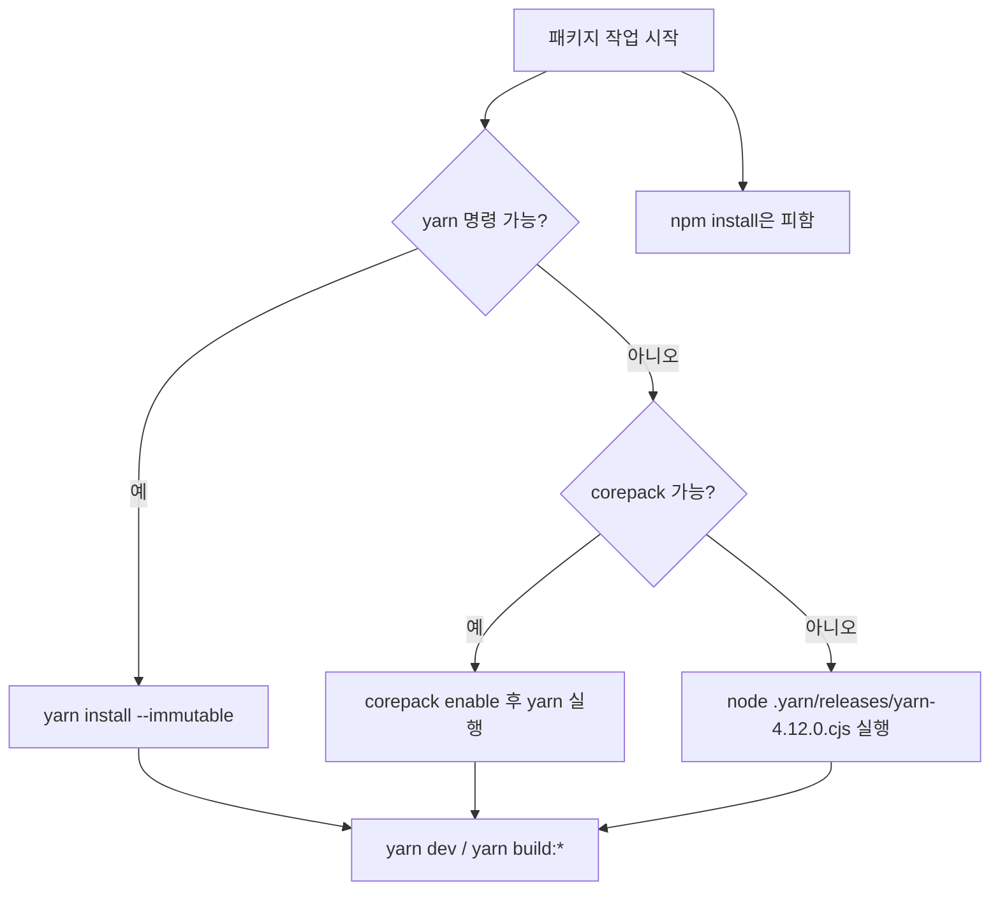
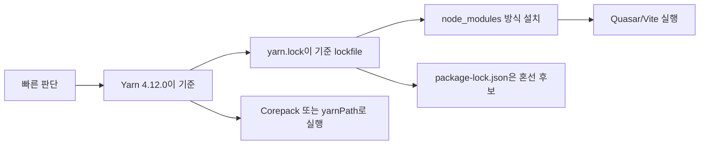

# dubright_front의 Yarn 패키지 매니저

- 작성일: 2026-05-08
- 조사 대상: `/Users/nes0903/Documents/dobedub/dubright_front`
- 결론: `dubright_front`는 `packageManager: "yarn@4.12.0"`과 `.yarn/releases/yarn-4.12.0.cjs`로 Yarn 4를 프로젝트 단위에 고정하고, Yarn PnP가 아니라 `nodeLinker: node-modules`로 전통적인 `node_modules` 설치 방식을 사용한다.
- 조사 전제: `dobedub-wiki/rules`에는 `dubright_front` 전용 rules 문서가 아직 없어 `rules 미등록` 상태로 보았고, 현재 레포 파일과 공식 Yarn/Node 문서를 기준으로 정리했다.

## 1. 한 줄 요약

- `dubright_front`의 패키지 매니저는 **Yarn 4.12.0**이다.
- 버전 고정은 `package.json`의 `packageManager`와 `.yarnrc.yml`의 `yarnPath`가 함께 담당한다.
- 설치 결과물은 PnP loader가 아니라 일반 `node_modules` 디렉터리다.



## 2. 왜 중요한가

- 패키지 매니저는 단순 실행 도구가 아니라 **의존성 해석 방식, lockfile, CI 재현성, 개발자 온보딩**을 결정한다.
- 같은 `package.json`이라도 Yarn과 npm은 lockfile 형식과 해석 결과가 다를 수 있다.
- 이 레포에는 `yarn.lock`과 `package-lock.json`이 모두 추적되어 있어, 어떤 lockfile을 신뢰할지 명확히 해야 한다.
- 현재 설정상 신뢰해야 할 기준은 `packageManager`가 가리키는 **Yarn 4 + `yarn.lock`**이다.



## 3. 핵심 개념

- **Yarn Berry/Modern**
  - Yarn 2 이상 계열을 보통 Yarn Berry 또는 Modern Yarn이라고 부른다.
  - `dubright_front`는 Yarn 4.12.0을 사용한다.
- **`packageManager`**
  - 프로젝트가 어떤 패키지 매니저와 버전을 써야 하는지 선언한다.
  - Corepack 같은 도구가 이 값을 읽어 맞는 Yarn 버전을 실행한다.
- **`yarnPath`**
  - 전역 Yarn 대신 레포 안의 Yarn 실행 파일을 쓰게 한다.
  - `dubright_front`는 `.yarn/releases/yarn-4.12.0.cjs`를 추적한다.
- **`nodeLinker: node-modules`**
  - Yarn PnP 대신 전통적인 `node_modules` 폴더를 만든다.
  - Quasar, Vite, Selenium, Puppeteer 같은 생태계 도구와의 호환성을 우선한 선택으로 볼 수 있다.
- **`packageExtensions`**
  - 서드파티 패키지의 잘못되었거나 부족한 의존성 메타데이터를 프로젝트 쪽에서 보정한다.
  - 여기서는 `pinia-plugin-persistedstate`의 `pinia` peer dependency를 optional로 처리한다.



## 4. 아키텍처와 실행 흐름

- 로컬 흐름은 `package.json`의 scripts를 Yarn으로 실행하는 구조다.
  - `yarn dev` → `quasar dev`
  - `yarn build:dev` → `NODE_ENV=development QENV=dev OUTPUT_DIR=dist quasar build`
  - `yarn build:test` → `NODE_ENV=test QENV=test OUTPUT_DIR=dist quasar build`
  - `yarn build:prod` → `NODE_ENV=production QENV=prod OUTPUT_DIR=dist quasar build`
- Amplify 흐름은 `preBuild`에서 Corepack과 Yarn 버전을 준비한 뒤 `yarn install --immutable`로 lockfile 변경을 막는다.
- 현재 로컬 셸에서는 `yarn`과 `corepack` 명령이 바로 잡히지 않았지만, 레포에 포함된 Yarn 실행 파일은 `node .yarn/releases/yarn-4.12.0.cjs`로 실행 가능했다.
- 이 로컬 환경의 Node는 `v25.6.1`이고, Node 공식 문서 기준 Node 25부터 Corepack은 번들 배포되지 않는다. 따라서 Node 25 환경에서는 Corepack을 별도 설치하거나 레포의 `.yarn/releases/yarn-4.12.0.cjs`를 직접 실행하는 우회가 필요할 수 있다.



## 5. 중요한 세부사항과 트레이드오프

- **좋은 점**
  - Yarn 버전이 `packageManager`와 `yarnPath`로 이중 고정되어 있다.
  - `.yarn/releases/yarn-4.12.0.cjs`가 Git 추적 대상이므로 전역 Yarn 설치에 덜 의존한다.
  - CI에서 `yarn install --immutable`을 사용해 `yarn.lock`이 빌드 중 바뀌는 것을 막는다.
- **주의할 점**
  - `nodeLinker: node-modules`는 호환성은 좋지만 PnP의 엄격한 의존성 검증과 Zero-Installs 장점은 거의 쓰지 않는다.
  - `.gitignore`는 `.yarn/cache`를 추적하지 않도록 되어 있고, 로컬 Yarn 설정은 `enableGlobalCache: true`로 확인됐다. Amplify는 `.yarn/cache/**/*`를 캐시하도록 되어 있어, CI 캐시 효율은 실제 Amplify 환경에서 한 번 확인하는 편이 좋다.
  - `package-lock.json`이 함께 추적되어 있다. `packageManager`가 Yarn을 가리키므로 `package-lock.json`은 설치 기준으로 보지 않는 편이 안전하다.
  - 실제로 `yarn.lock`의 첫 `@babel/code-frame` 해석은 `7.27.1`이고, `package-lock.json`의 같은 패키지는 `7.29.0`으로 시작해 두 lockfile이 같은 상태를 표현한다고 보기 어렵다.
- **권장 운영 원칙**
  - 의존성 추가/삭제는 `yarn add`, `yarn remove`, `yarn up` 계열로만 한다.
  - 설치 검증은 `yarn install --immutable` 기준으로 한다.
  - npm lockfile을 계속 보관할 명확한 이유가 없다면, 혼선을 줄이기 위해 별도 정리 후보로 다룬다.



## 6. 실무 예시

- 전역 `yarn`이 동작하는 환경:

```bash
yarn install --immutable
yarn dev
yarn build:prod
```

- 현재처럼 `yarn`/`corepack`이 바로 없지만 Node로 로컬 Yarn 파일을 실행할 수 있는 환경:

```bash
node .yarn/releases/yarn-4.12.0.cjs --version
node .yarn/releases/yarn-4.12.0.cjs install --immutable
node .yarn/releases/yarn-4.12.0.cjs dev
```

- 의존성 변경:

```bash
yarn add axios
yarn add -D dotenv
yarn remove unused-package
```

- 하지 않는 편이 좋은 명령:

```bash
npm install
npm update
```

- 이유:
  - npm 명령은 `package-lock.json`을 기준으로 별도 설치 트리를 만들거나 갱신할 수 있다.
  - `packageManager: "yarn@4.12.0"`가 이미 프로젝트의 의도된 도구를 명시한다.



## 7. 용어 정리와 빠른 복습

- `packageManager`
  - 프로젝트가 요구하는 패키지 매니저와 버전.
  - 이 레포에서는 `yarn@4.12.0`.
- `yarnPath`
  - 전역 Yarn 대신 실행할 로컬 Yarn 바이너리 경로.
  - 이 레포에서는 `.yarn/releases/yarn-4.12.0.cjs`.
- `nodeLinker`
  - Yarn이 의존성을 디스크에 배치하는 방식.
  - 이 레포에서는 `node-modules`.
- `yarn.lock`
  - Yarn이 해석한 정확한 의존성 버전과 checksum을 담는 lockfile.
- `--immutable`
  - 설치 중 lockfile 변경이 필요하면 실패하게 하는 옵션.
  - CI에서 재현성을 지키는 핵심 옵션.
- `Corepack`
  - 프로젝트의 `packageManager`를 읽어 적절한 Yarn/pnpm 버전을 실행해 주는 도구.
  - Node 25부터는 Node에 번들로 포함되지 않는다.
- `packageExtensions`
  - 서드파티 패키지 의존성 메타데이터 보정 장치.



## 참고 링크

- 로컬 소스
  - [`dubright_front/package.json`](../../dobedub/dubright_front/package.json)
  - [`dubright_front/.yarnrc.yml`](../../dobedub/dubright_front/.yarnrc.yml)
  - [`dubright_front/yarn.lock`](../../dobedub/dubright_front/yarn.lock)
  - [`dubright_front/package-lock.json`](../../dobedub/dubright_front/package-lock.json)
  - [`dubright_front/amplify.yml`](../../dobedub/dubright_front/amplify.yml)
  - [`dubright_front/.gitignore`](../../dobedub/dubright_front/.gitignore)
  - [`dubright_front/README.md`](../../dobedub/dubright_front/README.md)
  - [`dubright_front/PROJECT_GUIDE.md`](../../dobedub/dubright_front/PROJECT_GUIDE.md)
- 공식 문서
  - [Yarn Manifest: `packageManager`](https://yarnpkg.com/configuration/manifest#packageManager)
  - [Yarn Settings: `nodeLinker`, `yarnPath`, `packageExtensions`, cache settings](https://yarnpkg.com/configuration/yarnrc)
  - [Yarn CLI: `yarn install`](https://yarnpkg.com/cli/install)
  - [Yarn Corepack 안내](https://yarnpkg.com/corepack)
  - [Yarn Cache strategies / Zero-Installs](https://yarnpkg.com/features/caching)
  - [Node.js v25 Corepack 문서](https://nodejs.org/download/release/latest/docs/api/corepack.html)
  - [Node.js v20 Corepack 문서](https://nodejs.org/download/release/v20.18.2/docs/api/corepack.html)
