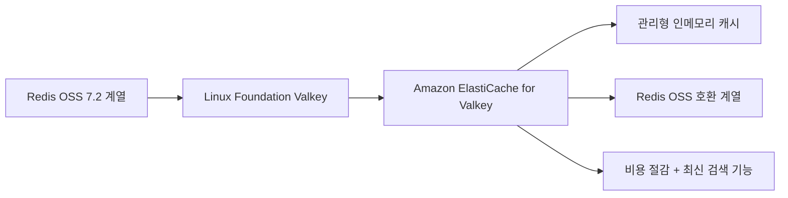
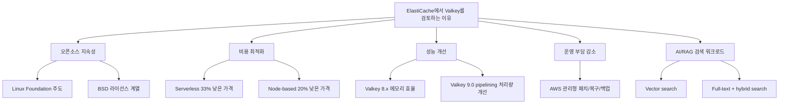
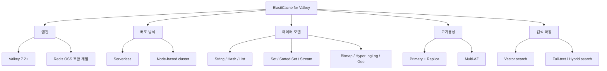
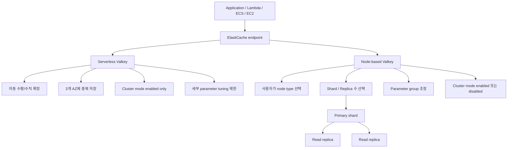
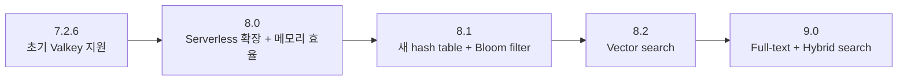
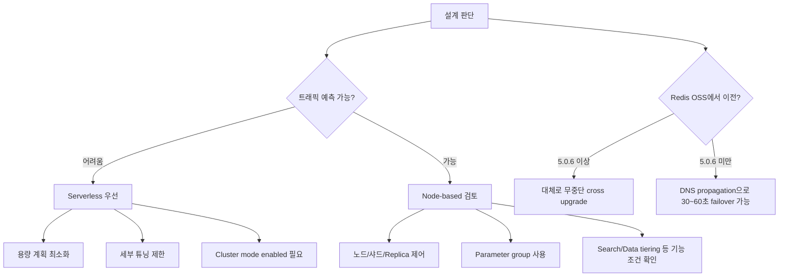
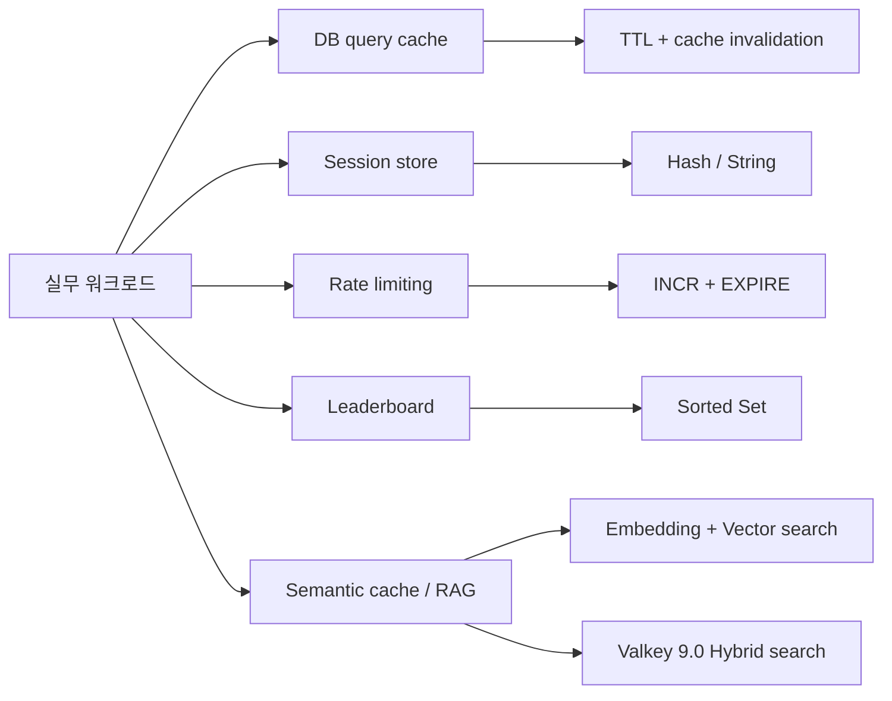
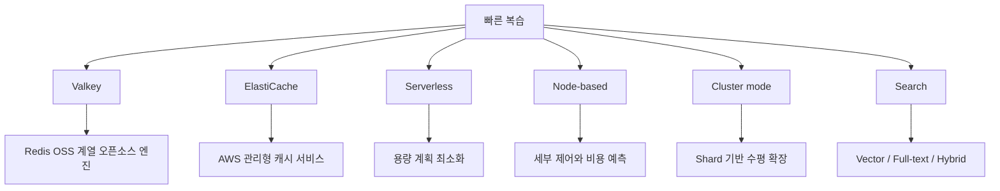

# Amazon ElastiCache for Valkey

- 작성일: 2026-05-11
- 기준: AWS 공식 문서와 AWS 공지 기준
- 표기: 질문의 `Vlakey`는 AWS 공식 엔진명인 `Valkey`로 정리한다.

## 1. 한 줄 요약



- `Amazon ElastiCache for Valkey`는 AWS가 제공하는 완전 관리형 Valkey 엔진 기반 인메모리 데이터 저장소다.
- Valkey는 Redis OSS 7.2 계열에서 갈라진 Linux Foundation 주도의 BSD 라이선스 오픈소스 프로젝트다.
- ElastiCache에서 Valkey는 `Redis OSS`와 같은 계열의 데이터 구조와 명령 체계를 제공하면서, AWS 기준으로 더 낮은 가격과 최신 기능을 제공하는 권장 엔진이다.
- 핵심 포인트는 다음과 같다.
  - Redis OSS의 실무 사용 모델을 대부분 유지한다.
  - AWS 운영 기능, Multi-AZ, 백업, 패치, 모니터링, 보안 통합을 관리형으로 받는다.
  - Serverless와 node-based 두 배포 방식을 선택할 수 있다.
  - 최신 `Valkey 9.0`에서는 full-text search, vector search, hybrid search, aggregation까지 캐시 안에서 처리할 수 있다.

## 2. 왜 중요한가



- Redis 라이선스 변화 이후, 클라우드와 오픈소스 생태계에서 Redis OSS의 장기 대안이 중요해졌다.
- Valkey는 Redis OSS와 유사한 사용 경험을 유지하면서, 특정 회사가 아닌 Linux Foundation 중심으로 운영되는 vendor-neutral 대안이다.
- AWS ElastiCache 관점에서는 비용 차이가 크다.
  - ElastiCache Serverless for Valkey는 다른 지원 엔진 대비 33% 낮은 가격으로 공지되었다.
  - Node-based ElastiCache for Valkey는 Redis OSS 대비 20% 낮은 가격으로 공지되었다.
  - Serverless Valkey의 최소 과금 저장 용량은 100 MB다.
  - Redis OSS/Memcached Serverless의 최소 과금 저장 용량은 1 GB다.
- 성능과 기능도 단순 Redis 대체 수준을 넘어섰다.
  - `Valkey 8.0`: 더 빠른 Serverless 확장, 메모리 효율 개선
  - `Valkey 8.1`: 새 hash table, Bloom filter, COMMANDLOG
  - `Valkey 8.2`: vector search
  - `Valkey 9.0`: full-text, exact-match, numeric range, vector, hybrid search, aggregation
- 따라서 단순 캐시뿐 아니라 다음 영역에서 의미가 커졌다.
  - 세션 저장소
  - DB query cache
  - 리더보드
  - rate limiting
  - semantic cache
  - RAG 검색 저장소
  - 실시간 추천/개인화

## 3. 핵심 개념



- Valkey
  - BSD 라이선스 기반의 오픈소스 인메모리 데이터 구조 저장소다.
  - 캐시, 데이터베이스, 메시지 브로커, 스트리밍 엔진 용도로 사용할 수 있다.
  - String, Hash, List, Set, Sorted Set, Bitmap, HyperLogLog, Geospatial index, Stream 같은 구조를 제공한다.

- ElastiCache for Valkey
  - Valkey 엔진을 AWS ElastiCache의 관리형 서비스로 제공하는 형태다.
  - 하드웨어 프로비저닝, 노드 교체, 패치, 모니터링, 백업, 장애 조치를 AWS가 관리한다.
  - 애플리케이션은 Valkey/Redis 계열 클라이언트로 접속한다.

- Redis OSS와의 관계
  - Valkey는 Redis OSS 7.2 계열의 실무 모델과 호환성을 강하게 유지한다.
  - AWS FAQ 기준, Redis OSS 7.2를 지원하는 클라이언트는 Valkey와 호환된다.
  - 단, Redis Inc.가 이후 Redis에 추가한 기능과 Valkey의 기능은 시간이 갈수록 분기될 수 있으므로, 장기적으로는 "Redis와 완전히 동일한 제품"이 아니라 "Redis OSS 계열에서 출발한 별도 오픈소스 엔진"으로 보는 것이 안전하다.

- Memcached와의 차이
  - Memcached는 단순 객체 캐시에 가깝다.
  - Valkey는 복잡한 자료구조, replication, failover, Pub/Sub, stream, sorted set, backup/restore, search 기능을 제공한다.
  - 단순하고 멀티스레드 객체 캐시만 필요하면 Memcached도 선택지지만, 대부분의 Redis 계열 워크로드는 Valkey가 더 자연스럽다.

## 4. 아키텍처와 동작 흐름



- Serverless 방식
  - 캐시 이름과 기본 네트워크 설정만으로 빠르게 생성할 수 있다.
  - 용량 계획 없이 자동으로 확장된다.
  - 데이터는 여러 Availability Zone에 중복 저장된다.
  - 클라이언트는 단일 endpoint 중심으로 접속한다.
  - 모든 Serverless Valkey/Redis OSS 캐시는 cluster mode enabled로 동작하므로, 클라이언트가 cluster mode를 지원해야 한다.
  - parameter group 기반의 세부 튜닝은 제공되지 않는다.

- Node-based 방식
  - node type, shard 수, replica 수, AZ 배치, parameter group을 직접 설계한다.
  - 예측 가능한 트래픽, 비용 제어, 세부 성능 튜닝이 중요하면 node-based가 적합하다.
  - cluster mode disabled는 단일 shard 기반이다.
  - cluster mode enabled는 데이터를 여러 shard로 분산한다.
  - 각 shard는 1개의 primary와 최대 5개의 read replica를 가질 수 있다.
  - Multi-AZ를 사용하면 장애 시 replica 승격을 통해 가용성을 높일 수 있다.

- 읽기/쓰기 흐름
  - 쓰기는 primary로 간다.
  - 읽기는 primary 또는 read replica에서 처리할 수 있다.
  - replication은 비동기 방식이므로 replica read는 eventual consistency 특성을 가진다.
  - Serverless에서는 read port를 통해 낮은 지연의 eventually consistent read를 사용할 수 있다.

- 백업과 복원
  - Valkey와 Redis OSS 백업은 상호 호환되는 방향으로 제공된다.
  - node-based 백업을 serverless로 복원하거나, serverless 백업을 node-based로 복원할 수 있다.
  - 검색 index가 포함된 RDB는 이전 버전 호환성 제약이 생길 수 있다.

## 5. 중요 세부사항, 버전, 엣지 케이스, 트레이드오프



| 버전 | 핵심 기능 | 적합한 사용처 |
| --- | --- | --- |
| `7.2.6` | Redis OSS 7.2 계열 기능, Valkey 첫 지원 라인 | Redis OSS에서 안정적으로 Valkey로 전환 |
| `8.0` | Serverless 확장 속도 개선, node-based 메모리 효율 개선, per-slot metrics | 트래픽 급증 대응, 메모리 비용 최적화 |
| `8.1` | 새 hash table, Bloom filter, COMMANDLOG, `SET IFEQ`, 일부 명령 성능 개선 | 메모리 민감 캐시, membership test, 운영 관측성 |
| `8.2` | vector search, valkey-search 기반 검색 기능 | semantic cache, RAG, 추천, anomaly detection |
| `9.0` | full-text, exact-match, numeric range, vector, hybrid search, aggregation, hash field expiration, cluster mode multi-database, pipelining 처리량 개선 | 캐시와 검색을 통합하려는 실시간 AI/검색 워크로드 |

- `Valkey 7.2+`
  - Redis OSS 7.2 계열 기능을 기본적으로 사용할 수 있다.
  - 기존 Redis OSS 사용자가 Valkey로 전환하는 기준선이 된다.

- `Valkey 8.0`
  - AWS 발표 기준, ElastiCache Serverless for Valkey 8.0은 지원 RPS를 2~3분마다 두 배로 늘릴 수 있고, 0에서 5M RPS까지 13분 미만에 도달할 수 있다.
  - node-based 환경에서는 key당 메모리 오버헤드가 줄어, 워크로드에 따라 동일 노드에 더 많은 데이터를 담을 수 있다.

- `Valkey 8.1`
  - 새 hash table 구현으로 일반 key-value 패턴의 메모리 사용량을 줄인다.
  - Bloom filter는 Set보다 훨씬 적은 메모리로 membership test를 수행할 수 있다.
  - COMMANDLOG는 느린 실행, 큰 요청, 큰 응답을 추적하는 데 유용하다.

- `Valkey 8.2`
  - node-based cluster에서 vector search를 사용할 수 있다.
  - embedding을 저장하고, 의미 기반 검색을 수행하는 semantic cache/RAG 워크로드에 적합하다.
  - AWS 문서 기준, vector dimension 최대값은 32768이다.

- `Valkey 9.0`
  - full-text, exact-match/tag, numeric range, vector, hybrid search, aggregation을 제공한다.
  - hash 내부 field 단위 TTL을 지원해 key sprawl을 줄일 수 있다.
  - cluster mode enabled에서도 numbered database를 지원해 standalone Redis/Valkey에서 cluster mode로 옮길 때 마이그레이션 부담을 줄인다.
  - pipelining 워크로드에서 최대 40% 처리량 개선이 발표되었다.
  - Search 기능은 AWS 문서 기준 node-based cluster에서 제공된다.

### 운영상 주의사항과 트레이드오프



- 업그레이드와 롤백
  - ElastiCache는 새 engine version으로 업그레이드할 수 있지만, 낮은 버전으로 downgrade하는 방식은 일반적으로 지원되지 않는다.
  - 이전 버전을 써야 하면 새 cache/cluster를 만들어야 한다.
  - Redis OSS에서 Valkey로 cross upgrade할 수 있다.
  - Redis OSS `5.0.6` 이상에서 Valkey로 업그레이드하면 AWS 문서상 endpoint와 애플리케이션 측 구조를 유지하며 무중단 전환이 가능하다.
  - Redis OSS `5.0.6` 이전은 DNS propagation 때문에 30~60초 failover가 발생할 수 있다.

- 클라이언트 연결
  - 엔진 업그레이드 중 기존 클라이언트 연결은 종료될 수 있다.
  - 운영 애플리케이션은 retry, reconnect, exponential backoff를 구현해야 한다.
  - Serverless는 cluster mode enabled만 지원하므로 cluster-aware client가 필요하다.

- parameter group
  - node-based cluster는 parameter group으로 세부 동작을 제어할 수 있다.
  - Serverless는 parameter group을 사용하지 않으며, 대부분의 엔진 설정을 직접 수정할 수 없다.
  - Valkey 8 이상 parameter group은 Redis OSS 7.2.4와 호환되지 않는다.

- Search 기능 제약
  - AWS 문서 기준 `Valkey 8.2`는 node-based cluster에서 vector search를 제공한다.
  - `Valkey 9.0+`는 node-based cluster에서 numeric, tag, full-text, vector, hybrid search, aggregation을 제공한다.
  - Search는 data tiering node에서는 사용할 수 없다.
  - t2/t3/t4g 같은 작은 인스턴스에서는 memory reserve 상향이 필요할 수 있다.
  - scaling 중에는 write RPS 감소나 index backfill에 따른 recall 저하 같은 운영 영향이 생길 수 있다.
  - `FT.CREATE`, `FT.DROPINDEX`는 transaction, Lua, Function 내부에서 실행할 수 없다.

- 명령 제한
  - ElastiCache는 관리형 서비스 안정성을 위해 일부 고권한 명령을 제한한다.
  - 예를 들면 직접적인 `BGSAVE`, `BGREWRITEAOF`, 일부 `ACL`, 일부 `CLUSTER` 관리 명령은 제한된다.
  - flush 동작은 배포 방식에 따라 다르다.
  - node-based cluster에서는 모든 primary에 flush 명령을 보내야 전체 keyspace가 지워진다.
  - Serverless에서는 `FLUSHDB`, `FLUSHALL`이 추상화된 전체 cluster에 적용된다.

- 비용 트레이드오프
  - Serverless는 운영 부담과 초기 용량 계획 부담을 줄인다.
  - 그러나 request/ECPU와 저장량 기반 과금이므로, 지속적으로 높은 트래픽에서는 node-based가 더 예측 가능할 수 있다.
  - node-based는 예약 노드와 크기 조정 전략으로 비용을 더 강하게 통제할 수 있다.

## 6. 실무 예시



- DB query cache
  - RDS/DynamoDB/API 호출 결과를 Valkey에 저장한다.
  - key 예시: `query:user-profile:123`
  - TTL을 반드시 설정해 stale data 위험을 줄인다.
  - write-through, cache-aside, CDC 기반 invalidation 중 하나를 선택한다.

- Session store
  - 로그인 세션, 장바구니, 임시 상태를 저장한다.
  - 단순 문자열이면 `SET session:{id} ... EX ...` 형태가 적합하다.
  - 세션 내부 속성이 많으면 `HASH`를 사용할 수 있다.
  - Valkey 9.0의 hash field expiration은 필드별 만료가 필요한 세션/상태 데이터에 유용하다.

- Rate limiting
  - API key, user id, IP 단위로 카운터를 둔다.
  - `INCR`와 `EXPIRE` 조합으로 fixed window를 만들 수 있다.
  - 더 엄밀한 제어가 필요하면 sorted set 기반 sliding window를 검토한다.
  - abuse traffic이 매우 크면 local L1 cache와 Valkey L2 cache를 조합해 비용을 줄일 수 있다.

- Leaderboard
  - `Sorted Set`을 사용해 점수 기반 순위를 저장한다.
  - `ZADD`, `ZRANK`, `ZREVRANGE` 계열 명령이 핵심이다.
  - `Valkey 8.1`은 일부 sorted set 명령 성능 개선을 포함한다.

- Semantic cache / RAG
  - embedding을 Valkey에 저장하고 vector search로 유사 질의를 찾는다.
  - `Valkey 8.2` 이상 node-based cluster에서 vector search를 사용할 수 있다.
  - `Valkey 9.0`에서는 full-text와 vector를 조합한 hybrid search가 가능하다.
  - RAG에서 keyword exact match와 semantic similarity를 함께 쓰면 검색 품질을 높일 수 있다.

- Redis OSS에서 Valkey로 업그레이드하는 CLI 예시

```bash
aws elasticache modify-replication-group \
  --replication-group-id myReplGroup \
  --engine valkey \
  --engine-version 9.0
```

- 실제 운영에서는 다음을 먼저 확인한다.
  - 현재 Redis OSS 엔진 버전
  - cluster mode enabled/disabled 여부
  - parameter group 호환성
  - client library의 cluster mode와 Valkey 호환성
  - retry/reconnect 구현 여부
  - maintenance window와 트래픽 저점

## 7. 용어 정리와 빠른 복습



- Valkey
  - Redis OSS 7.2 계열에서 출발한 Linux Foundation 주도의 오픈소스 인메모리 데이터 저장소다.

- ElastiCache for Valkey
  - Valkey를 AWS 관리형 캐시 서비스로 사용하는 방식이다.

- Serverless cache
  - 캐시 용량을 직접 산정하지 않고 AWS가 자동 확장하는 배포 방식이다.
  - cluster mode enabled만 지원한다.

- Node-based cluster
  - 사용자가 노드 타입, shard, replica, parameter group을 직접 설계하는 방식이다.
  - 예측 가능한 트래픽과 세부 튜닝에 유리하다.

- Cluster mode disabled
  - 단일 shard 중심 구조다.
  - 단순한 애플리케이션과 기존 standalone Redis 계열 모델에 가깝다.

- Cluster mode enabled
  - keyspace를 여러 shard에 분산한다.
  - 대규모 용량과 처리량을 위해 필요하다.

- Primary
  - 쓰기를 받는 노드다.

- Replica
  - primary 데이터를 비동기로 복제받아 읽기 확장과 장애 대응에 사용되는 노드다.

- ECPU
  - ElastiCache Serverless 요청 과금 단위다.
  - vCPU 사용량과 전송 데이터량을 반영한다.

- Vector search
  - embedding 간 유사도를 기반으로 의미적으로 가까운 데이터를 찾는 검색이다.

- Hybrid search
  - full-text keyword 검색과 vector similarity 검색을 조합하는 방식이다.

- 핵심 판단
  - 새 ElastiCache 캐시라면 특별한 Redis OSS 고정 사유가 없는 한 Valkey를 우선 검토한다.
  - 운영 단순성이 중요하면 Serverless를 먼저 본다.
  - 비용 예측, 세부 튜닝, search 기능이 중요하면 node-based를 검토한다.
  - AI/RAG 검색을 캐시 안에서 처리하려면 `Valkey 8.2+`, full-text와 hybrid까지 필요하면 `Valkey 9.0+`를 본다.

## 참고 링크

- [Amazon ElastiCache engine versions and upgrading](https://docs.aws.amazon.com/AmazonElastiCache/latest/dg/engine-versions.html)
- [Amazon ElastiCache version management](https://docs.aws.amazon.com/AmazonElastiCache/latest/dg/VersionManagement.html)
- [Upgrading engine versions including cross engine upgrades](https://docs.aws.amazon.com/AmazonElastiCache/latest/dg/VersionManagement.HowTo.html)
- [Choosing between ElastiCache deployment options](https://docs.aws.amazon.com/AmazonElastiCache/latest/dg/WhatIs.deployment.html)
- [Comparing node-based Valkey, Memcached, and Redis OSS clusters](https://docs.aws.amazon.com/AmazonElastiCache/latest/dg/SelectEngine.html)
- [Search features and limits in Amazon ElastiCache](https://docs.aws.amazon.com/AmazonElastiCache/latest/dg/search-features-limits.html)
- [Supported and restricted Valkey, Memcached, and Redis OSS commands](https://docs.aws.amazon.com/AmazonElastiCache/latest/dg/SupportedCommands.html)
- [Amazon ElastiCache pricing](https://aws.amazon.com/elasticache/pricing/)
- [Amazon ElastiCache FAQ: Valkey engine](https://aws.amazon.com/elasticache/faqs/)
- [Announcing Amazon ElastiCache for Valkey](https://aws.amazon.com/about-aws/whats-new/2024/10/amazon-elasticache-valkey)
- [Announcing Valkey 9.0 for Amazon ElastiCache](https://aws.amazon.com/about-aws/whats-new/2026/05/valkey-amazon-elasticache/)
- [Amazon ElastiCache now supports real-time hybrid search with vector and full-text](https://aws.amazon.com/about-aws/whats-new/2026/05/amazon-elasticache-hybrid-search/)
- [AWS Database Blog: Announcing Valkey 9.0 for Amazon ElastiCache](https://aws.amazon.com/blogs/database/announcing-valkey-9-0-for-amazon-elasticache/)
- [Valkey official introduction](https://valkey.io/topics/introduction/)
- [Linux Foundation launches open source Valkey community](https://www.linuxfoundation.org/press/linux-foundation-launches-open-source-valkey-community)

<!-- study-links:start -->
## 관련 문서

- `redis`: [[redis/redis|Redis 상세 정리]]
- `aws`: [[AWS/aws-sam|AWS SAM(Serverless Application Model) 상세 정리]]
- `dns`: [[DNS/DNS|DNS 상세 정리]]
<!-- study-links:end -->
