# Electron

- 한 줄 요약: Electron은 Chromium, Node.js, 네이티브 데스크톱 API를 묶어 HTML, CSS, JavaScript로 Windows, macOS, Linux 데스크톱 앱을 만들게 해주는 오픈소스 프레임워크다.
- 조사 기준일: 2026-06-15
- 최신 안정 버전: 공식 Electron Releases 기준 `42.4.0`이며, Chromium `148.0.7778.254`, Node.js `24.16.0`을 포함한다.

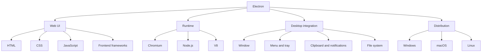

## 1. Electron이란 무엇인가

- Electron은 웹 기술로 데스크톱 앱을 만들기 위한 런타임이자 애플리케이션 프레임워크다.
- 일반 웹앱은 브라우저 안에서 실행되지만, Electron 앱은 앱 자체에 Chromium과 Node.js를 포함해서 독립 실행형 데스크톱 프로그램처럼 배포된다.
- 개발자는 React, Vue, Svelte, Vanilla JS 같은 웹 UI 기술을 그대로 사용할 수 있고, 동시에 파일 시스템, OS 메뉴, 트레이, 클립보드, 알림 같은 데스크톱 기능에도 접근할 수 있다.
- 핵심 아이디어는 다음과 같다.
  - 화면 렌더링: Chromium
  - JavaScript 실행: V8
  - 로컬/시스템 기능: Node.js와 Electron 네이티브 API
  - 데스크톱 배포: 플랫폼별 실행 파일, 앱 번들, 설치 파일
- 대표적인 사용 맥락은 다음과 같다.
  - 웹 제품을 데스크톱 앱으로 제공하려는 경우
  - Windows, macOS, Linux를 하나의 코드베이스로 지원하려는 경우
  - 브라우저보다 더 깊은 OS 연동이 필요한 경우
  - 프론트엔드 인력이 중심인 팀에서 데스크톱 앱을 빠르게 만들려는 경우

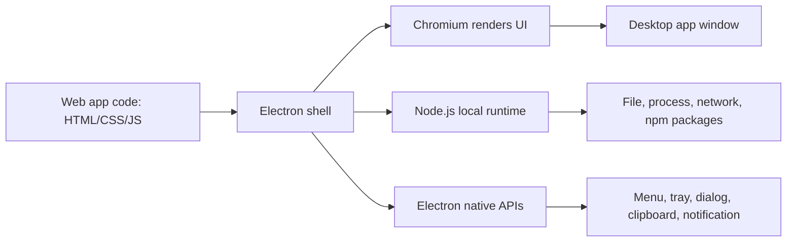

## 2. 왜 Electron을 쓰는가

- 가장 큰 장점은 하나의 웹 기술 스택으로 여러 데스크톱 플랫폼을 동시에 지원할 수 있다는 점이다.
- 기업이나 제품팀 입장에서는 웹앱과 데스크톱 앱 사이의 UI, 상태 관리, 비즈니스 로직, 디자인 시스템을 많이 공유할 수 있다.
- 브라우저 위에서만 동작하는 PWA보다 다음 기능을 더 자연스럽게 다룰 수 있다.
  - 로컬 파일 읽기/쓰기
  - 백그라운드 프로세스
  - 자동 업데이트
  - 시스템 트레이
  - OS 메뉴/단축키
  - 네이티브 알림
  - 클립보드
  - 프로토콜 핸들러
- 단점도 분명하다.
  - 앱마다 Chromium 런타임을 포함하므로 설치 파일과 메모리 사용량이 커지기 쉽다.
  - 웹 보안과 데스크톱 권한이 만나는 구조라 보안 설계를 잘못하면 피해 범위가 커진다.
  - 완전한 네이티브 앱보다 OS별 세밀한 UX, 저수준 성능, 배터리 효율에서 불리할 수 있다.
- 따라서 Electron은 "최고 성능의 네이티브 앱"보다 "빠르고 일관된 크로스플랫폼 데스크톱 제품"에 더 잘 맞는다.

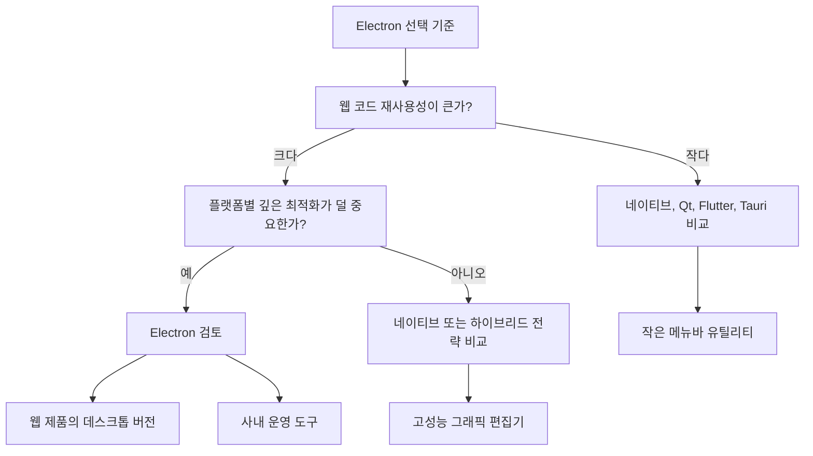

## 3. 핵심 아키텍처

- Electron 앱은 Chromium처럼 멀티 프로세스 모델을 사용한다.
- 개발자가 주로 다루는 프로세스는 두 종류다.
  - Main process: 앱의 진입점이며, Node.js 환경에서 실행된다.
  - Renderer process: 각 창의 웹 페이지를 렌더링하는 프로세스다.
- Main process의 역할은 다음과 같다.
  - 앱 생명주기 관리
  - BrowserWindow 생성
  - 메뉴, 트레이, 다이얼로그 등 네이티브 UI 제어
  - 파일 시스템, OS API, 백그라운드 작업 같은 권한 있는 작업 수행
  - renderer와 IPC 통신
- Renderer process의 역할은 다음과 같다.
  - 실제 화면 UI 렌더링
  - DOM, CSS, 브라우저 API 사용
  - React/Vue 같은 프론트엔드 앱 실행
  - 기본 보안 설정에서는 Node.js API를 직접 사용하지 않음
- Preload script는 main과 renderer 사이의 안전한 다리 역할을 한다.
  - 웹 페이지가 로드되기 전에 실행된다.
  - DOM과 제한된 Electron/Node API에 접근할 수 있다.
  - `contextBridge`로 renderer에 노출할 API를 명시적으로 제한한다.
- IPC는 프로세스 간 메시지 통신이다.
  - `ipcMain`: main process 쪽 수신/처리
  - `ipcRenderer`: renderer/preload 쪽 송신/수신
  - 채널 이름과 페이로드를 개발자가 정의한다.

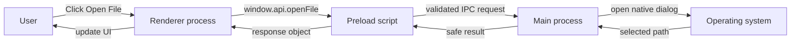

## 4. 실행 흐름과 주요 구성 파일

- 최소 Electron 앱은 보통 다음 파일로 시작한다.
  - `package.json`: 앱 이름, 버전, main entry, npm scripts 정의
  - `main.js`: main process 진입점
  - `preload.js`: renderer에 안전하게 노출할 API 정의
  - `index.html`: renderer가 표시할 화면
  - `renderer.js`: UI 로직
- 실행 흐름은 다음과 같다.
  - 사용자가 앱 실행
  - Electron이 `package.json`의 `main` 필드를 읽음
  - main process가 시작됨
  - `app.whenReady()` 이후 `BrowserWindow` 생성
  - `BrowserWindow`가 HTML 또는 URL을 renderer process에 로드
  - preload가 renderer보다 먼저 주입됨
  - UI 이벤트가 IPC를 통해 main process의 권한 있는 작업으로 연결됨
- `BrowserWindow`는 데스크톱 창 자체를 나타낸다.
- `webContents`는 그 창 안에서 렌더링되는 웹 콘텐츠를 제어하는 객체다.
- 창이 여러 개라면 보통 renderer process도 여러 개가 생긴다.

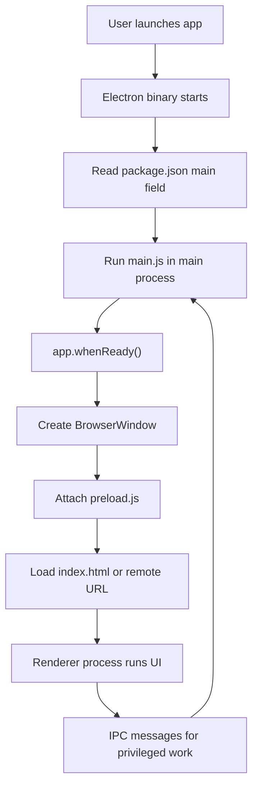

## 5. 보안 모델과 주의점

- Electron 보안의 핵심은 "웹 콘텐츠를 OS 권한과 직접 섞지 않는 것"이다.
- renderer는 HTML/JS를 실행하므로 XSS, 악성 스크립트, 원격 콘텐츠 변조 같은 웹 보안 문제가 발생할 수 있다.
- 그런데 Electron 앱은 파일 시스템, 프로세스, OS 기능에 접근할 수 있으므로 renderer에 과한 권한을 주면 일반 웹앱보다 피해가 커질 수 있다.
- 기본적으로 지켜야 할 원칙은 다음과 같다.
  - `nodeIntegration`은 끈다.
  - `contextIsolation`은 켠다.
  - 가능한 한 sandbox를 사용한다.
  - preload에서 필요한 최소 API만 `contextBridge`로 노출한다.
  - IPC 입력값을 반드시 검증한다.
  - 원격 콘텐츠를 로드할 때는 출처, navigation, popup, permission을 제한한다.
  - CSP를 설정해 실행 가능한 script/source 범위를 제한한다.
  - `<webview>`는 꼭 필요한 경우에만 쓰고, 생성 옵션을 main process에서 검증한다.
- 특히 위험한 패턴은 다음과 같다.
  - 원격 URL을 로드하면서 `nodeIntegration: true`를 켜는 것
  - renderer에서 임의 파일 경로나 shell 명령을 main process로 전달하고 그대로 실행하는 것
  - preload에서 `ipcRenderer` 전체를 그대로 노출하는 것
  - `eval`, inline script, 넓은 CSP를 허용하는 것
- 좋은 설계는 renderer를 일반 웹 페이지처럼 취급하고, main process를 권한 있는 백엔드처럼 취급하는 것이다.

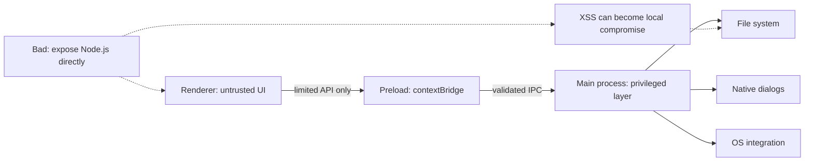

## 6. 배포, 패키징, 업데이트

- Electron core 자체는 앱 패키징/배포 도구를 내장하지 않는다.
- 공식 문서는 Electron Forge를 초보자와 일반적인 배포 흐름에 권장한다.
- Electron Forge의 기본 흐름은 다음과 같다.
  - `start`: 개발 모드 실행
  - `package`: 플랫폼별 앱 번들 생성
  - `make`: 설치 파일 또는 배포용 아티팩트 생성
  - `publish`: GitHub Releases 등 배포 위치로 업로드
- 배포 시 고려할 항목은 다음과 같다.
  - 코드 서명: Windows/macOS에서 신뢰 경고를 줄이고 업데이트를 안정화하기 위해 필요
  - macOS notarization: macOS 배포에서 사실상 필수에 가까운 검증 절차
  - auto update: `autoUpdater`, Squirrel, Forge publisher, electron-builder updater 등 선택지 비교 필요
  - native module rebuild: Electron에 포함된 Node.js 버전에 맞춰 native addon을 다시 빌드해야 할 수 있음
  - asar 패키징: 앱 소스를 `app.asar` 아카이브로 묶어 배포할 수 있음
  - 플랫폼별 installer: Windows MSI/NSIS/Squirrel, macOS DMG/ZIP/PKG, Linux deb/rpm/AppImage/Flatpak 등
- 릴리스 관리 관점에서는 Electron 버전 업데이트가 중요하다.
  - Electron은 Chromium과 Node.js를 포함하므로 보안 업데이트가 곧 런타임 업데이트다.
  - 공식 스케줄에 따르면 여러 stable 버전이 동시에 지원되지만, 오래된 버전은 빠르게 EOL이 된다.
  - 2026-06-15 기준 `42.x`, `41.x`, `40.x`가 안정 채널에서 보이고, `43.0.0`은 2026-06-30 stable 예정으로 표시된다.

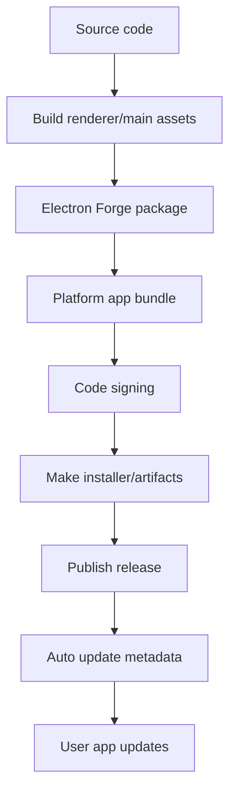

## 7. 장단점과 선택 기준

- 장점
  - 웹 기술을 그대로 사용한다.
  - 하나의 코드베이스로 주요 데스크톱 OS를 지원한다.
  - Chromium이 포함되어 브라우저 호환성 변수를 줄일 수 있다.
  - npm 생태계를 활용하기 쉽다.
  - 데스크톱 API가 풍부하다.
  - 웹 제품을 데스크톱 제품으로 확장하기 쉽다.
- 단점
  - 앱 용량이 커지기 쉽다.
  - 메모리 사용량이 네이티브 앱보다 큰 편이다.
  - 보안 설정 실수의 영향이 크다.
  - OS별 네이티브 UX 디테일은 직접 신경 써야 한다.
  - Chromium, Node.js, Electron 버전 업데이트를 계속 관리해야 한다.
- 잘 맞는 경우
  - Slack/Discord/VS Code류의 크로스플랫폼 생산성 도구
  - 웹앱과 데스크톱 앱을 같은 팀/코드베이스로 운영하고 싶은 경우
  - 로컬 파일, 알림, 트레이, 자동 업데이트가 필요한 웹 기반 앱
  - 내부 업무 도구, 개발자 도구, 협업 도구
- 덜 맞는 경우
  - 초경량 유틸리티
  - 배터리/메모리 사용량이 최우선인 앱
  - 고성능 3D/영상 처리/실시간 오디오처럼 네이티브 성능이 핵심인 앱
  - 플랫폼별 UI 관습을 깊게 따라야 하는 소비자용 앱
- 대안
  - Tauri: Rust + 시스템 WebView 기반, 더 작은 번들 크기를 지향
  - Flutter Desktop: Dart 기반 크로스플랫폼 UI
  - Qt: C++/Python 등으로 강력한 네이티브 GUI
  - Swift/AppKit 또는 SwiftUI: macOS 네이티브
  - .NET MAUI/WPF/WinUI: Windows 중심 또는 .NET 생태계
  - PWA: 브라우저 기반 설치형 웹앱

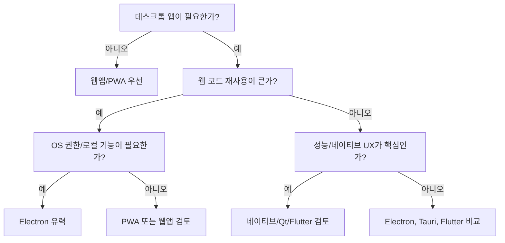

## 8. 간단한 예시

- 가장 단순한 Electron 앱의 사고방식은 "main process가 창을 만들고, renderer가 웹 화면을 보여준다"이다.
- `main.js` 예시는 다음처럼 구성된다.

```js
const { app, BrowserWindow } = require("electron");
const path = require("node:path");

function createWindow() {
  const win = new BrowserWindow({
    width: 1000,
    height: 700,
    webPreferences: {
      preload: path.join(__dirname, "preload.js"),
      contextIsolation: true,
      nodeIntegration: false,
    },
  });

  win.loadFile("index.html");
}

app.whenReady().then(createWindow);

app.on("window-all-closed", () => {
  if (process.platform !== "darwin") app.quit();
});
```

- `preload.js`에서는 필요한 API만 노출한다.

```js
const { contextBridge, ipcRenderer } = require("electron");

contextBridge.exposeInMainWorld("desktop", {
  openFile: () => ipcRenderer.invoke("dialog:openFile"),
});
```

- renderer에서는 Node.js를 직접 부르지 않고, 노출된 API만 사용한다.

```js
document.querySelector("#open").addEventListener("click", async () => {
  const result = await window.desktop.openFile();
  console.log(result);
});
```

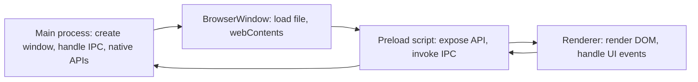

## 9. 용어 정리

- Electron: 웹 기술로 데스크톱 앱을 만드는 프레임워크.
- Chromium: Electron이 UI 렌더링에 사용하는 브라우저 엔진 기반 프로젝트.
- Node.js: Electron main process에서 동작하는 JavaScript 런타임.
- Main process: 앱의 진입점이자 권한 있는 제어 계층.
- Renderer process: 각 창의 웹 페이지를 그리는 프로세스.
- BrowserWindow: 데스크톱 창을 만드는 Electron 클래스.
- webContents: 창 안의 웹 콘텐츠를 제어하는 객체.
- Preload script: renderer가 로드되기 전에 실행되어 안전한 API를 연결하는 스크립트.
- IPC: main과 renderer 사이의 메시지 통신.
- contextIsolation: preload/Electron API와 웹 페이지 JavaScript context를 분리하는 보안 기능.
- nodeIntegration: renderer에서 Node.js API를 직접 사용할 수 있게 하는 옵션. 일반적으로 꺼야 한다.
- sandbox: renderer의 시스템 접근을 제한하는 보안 모델.
- Electron Forge: Electron 앱 생성, 패키징, 배포를 돕는 공식 도구 모음.
- asar: Electron 앱 소스를 하나의 아카이브로 묶는 패키징 형식.

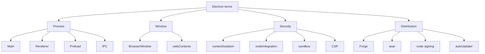

## 10. 빠른 결론

- Electron은 "웹앱을 데스크톱 앱처럼 포장하는 도구" 정도로만 보면 부족하다.
- 실제로는 Chromium, Node.js, 네이티브 API, 멀티 프로세스 구조, 보안 경계, 배포 파이프라인을 함께 다루는 데스크톱 앱 플랫폼에 가깝다.
- 생산성은 높지만, 런타임 크기와 메모리 사용량, 보안 설계, 업데이트 관리라는 비용을 함께 가져간다.
- 실무에서는 다음 질문으로 판단하면 좋다.
  - 이미 웹 UI/프론트엔드 자산이 중요한가?
  - 세 플랫폼을 모두 지원해야 하는가?
  - 로컬 파일/알림/트레이/자동 업데이트 같은 데스크톱 기능이 필요한가?
  - 네이티브급 성능보다 개발 속도와 일관성이 더 중요한가?
- 이 질문에 대부분 "예"라면 Electron은 강력한 후보가 된다.
- 반대로 앱 크기, 메모리, 배터리, 플랫폼별 네이티브 경험이 최우선이면 Tauri, Flutter, Qt, 네이티브 개발을 함께 비교해야 한다.

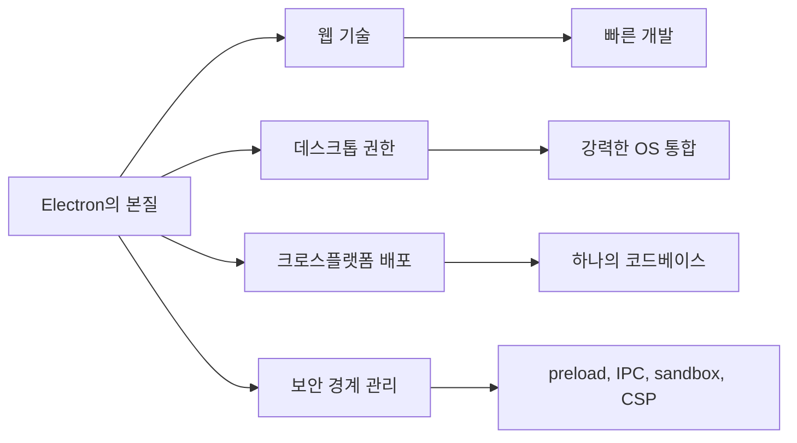

## 참고 링크

- [Electron 공식 문서 - Introduction](https://www.electronjs.org/docs/latest/)
- [Electron 공식 문서 - Process Model](https://www.electronjs.org/docs/latest/tutorial/process-model)
- [Electron 공식 문서 - Using Preload Scripts](https://www.electronjs.org/docs/latest/tutorial/tutorial-preload)
- [Electron 공식 문서 - Security](https://www.electronjs.org/docs/latest/tutorial/security)
- [Electron 공식 문서 - Packaging Your Application](https://www.electronjs.org/docs/latest/tutorial/tutorial-packaging)
- [Electron 공식 문서 - Distributing Apps With Electron Forge](https://www.electronjs.org/docs/latest/tutorial/forge-overview)
- [Electron 공식 문서 - Application Packaging](https://www.electronjs.org/docs/latest/tutorial/application-distribution)
- [Electron 공식 문서 - Updating Applications](https://www.electronjs.org/docs/latest/tutorial/updates)
- [Electron Releases](https://releases.electronjs.org/)
- [Electron Release Schedule](https://releases.electronjs.org/schedule)
- [Electron 42 release blog](https://www.electronjs.org/blog/electron-42-0)
- [Electron v42.4.0 release notes](https://releases.electronjs.org/release/v42.4.0)
- [Electron Forge 공식 문서](https://www.electronforge.io/)

<!-- study-links:start -->
## 관련 문서

- `react`: [[react/react|React 상세 정리]]
- `css`: [[tailwindcss/tailwindcss|Tailwind CSS 상세 정리]]
- `파이프`: [[정보처리기사/1과목 소프트웨어 설계/029 파이프 - 필터 패턴/029 파이프 - 필터 패턴|029 파이프 - 필터 패턴]]
- `스택`: [[정보처리기사/2과목 소프트웨어 개발/057 스택(Stack)/057 스택(Stack)|057 스택(Stack)]]
<!-- study-links:end -->
