# ESLint 상세 정리

작성 기준일: 2026-04-27  
조사 방식: 웹검색 기반 최신 조사, 공식 문서 우선 사용  
주요 참고: `eslint.org`, `typescript-eslint.io`, `github.com/prettier/eslint-config-prettier`

---

## 1. 한 줄 요약

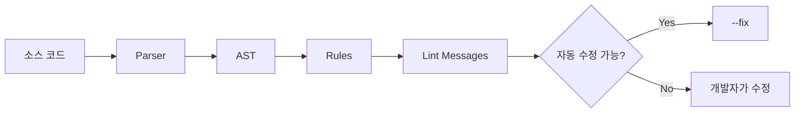

- `ESLint`는 JavaScript/TypeScript 코드에서 버그 가능성, 비일관성, 위험한 패턴, 팀 규칙 위반을 찾아주는 정적 분석 도구다.
- 실행하지 않고 코드를 분석한다.
- 현재 공식 문서 기준 ESLint의 중심 설정 방식은 `eslint.config.js` 기반의 `flat config`다.
- 2026-04-27 검색 기준 공식 블로그의 최신 릴리스는 `ESLint v10.2.1`, 2026-04-17 공개 버전이다.
- ESLint v10 계열의 핵심 흐름:
  - Node.js `20.19.0+`, `22.13.0+`, `24+` 지원
  - `.eslintrc.*` 같은 old config format은 더 이상 지원하지 않음
  - `eslint.config.js`, `eslint.config.mjs`, `eslint.config.cjs`, `eslint.config.ts` 등 flat config 중심
  - JS뿐 아니라 TypeScript, Markdown, JSON 등은 플러그인/processor/language 확장으로 처리
- 실무에서 ESLint는 보통 다음 역할을 맡는다.
  - 코드 품질 규칙
  - 잠재 버그 탐지
  - 팀 컨벤션 강제
  - PR/CI gate
  - IDE 실시간 피드백
  - 일부 자동 수정

---

## 2. 왜 중요한가

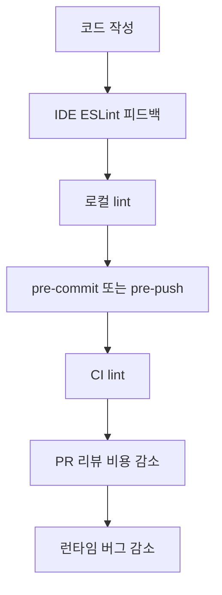

- ESLint가 필요한 이유는 "스타일 통일"보다 넓다.
- 주요 목적:
  - `no-undef`: 정의되지 않은 변수를 조기에 발견
  - `no-unused-vars`: 죽은 코드와 잘못된 import 탐지
  - `no-async-promise-executor`: 비동기 Promise executor 같은 위험 패턴 방지
  - `eqeqeq`: 암묵적 타입 변환으로 생기는 버그 방지
  - `prefer-const`: 불필요한 재할당 가능성 제거
  - `no-restricted-imports`: 팀 아키텍처에서 금지한 import 차단
- 코드 리뷰에서 사람이 반복적으로 지적할 일을 도구가 대신 처리한다.
- CI에서 `eslint . --max-warnings=0`을 사용하면 warning도 배포 차단 조건으로 만들 수 있다.
- TypeScript 프로젝트에서도 ESLint는 여전히 필요하다.
  - TypeScript compiler는 타입 오류 중심
  - ESLint는 코드 패턴, 컨벤션, 위험한 사용법 중심
  - `typescript-eslint`의 type-aware rule을 쓰면 타입 정보를 활용한 더 정교한 lint가 가능하다.
- 단, ESLint를 과하게 쓰면 개발 속도를 떨어뜨릴 수 있다.
  - 모든 stylistic rule을 ESLint로 강제하기보다 Prettier에 위임하는 편이 단순하다.
  - type-aware lint는 강력하지만 느릴 수 있으므로 CI/IDE 성능을 고려해야 한다.

---

## 3. 현재 버전 흐름과 큰 변화

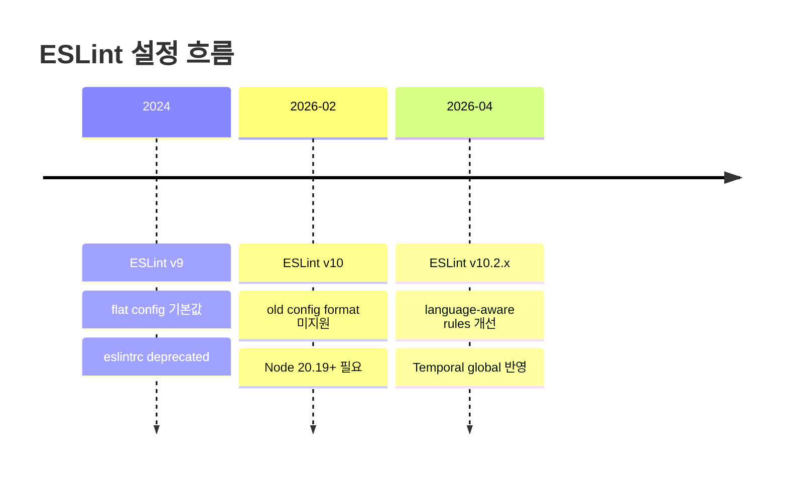

### 3.1 현재 기준 핵심 버전 정보

- 2026-04-27 검색 기준:
  - 최신 공식 릴리스: `ESLint v10.2.1`
  - 공개일: 2026-04-17
  - 성격: patch release
- 주요 최신 흐름:
  - `v9`: `eslint.config.js` flat config가 기본값이 됨
  - `v10`: 기존 `.eslintrc.*` old config format이 더 이상 지원되지 않음
  - `v10.2.0`: rule 작성자가 rule이 지원하는 language를 선언할 수 있는 `meta.languages` 지원

### 3.2 Node.js 요구사항

- ESLint 최신 문서 기준 요구사항:
  - Node.js `^20.19.0`
  - Node.js `^22.13.0`
  - Node.js `>=24`
- TypeScript type definition을 사용할 경우:
  - TypeScript `5.3+` 필요
- 실무 영향:
  - 로컬 Node 버전뿐 아니라 IDE extension이 사용하는 Node 버전도 확인해야 한다.
  - CI 이미지의 Node 버전이 낮으면 ESLint v10이 실행되지 않는다.
  - Node 업그레이드가 어렵다면 일시적으로 ESLint v9를 유지해야 할 수 있다.

### 3.3 flat config 전환 의미

- 예전 방식:
  - `.eslintrc.js`
  - `.eslintrc.json`
  - `.eslintrc.yml`
  - `package.json`의 `eslintConfig`
- 현재 방식:
  - `eslint.config.js`
  - `eslint.config.mjs`
  - `eslint.config.cjs`
  - `eslint.config.ts` 등
- 가장 큰 차이:
  - 설정이 "상속되는 여러 eslintrc 파일" 중심이 아니라, root의 config array 중심으로 정리된다.
  - plugin, parser, config를 문자열로만 선언하지 않고 import해서 JavaScript object로 다룬다.
  - `env`, `parserOptions`, `extends` 같은 개념은 flat config 문법에 맞게 바뀌었다.

---

## 4. 핵심 개념

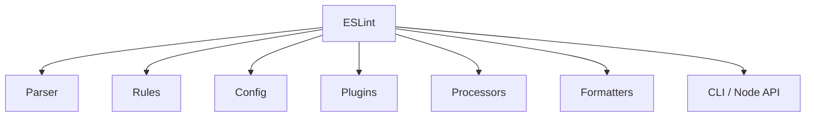

### 4.1 Linter

- `linter`는 코드를 분석해서 문제 목록을 만드는 도구다.
- ESLint는 코드를 직접 실행하지 않는다.
- 정적 분석으로 다음을 확인한다.
  - 문법 구조
  - 변수 scope
  - import/export
  - control flow
  - 특정 AST 패턴
  - rule별 옵션

### 4.2 Parser와 AST


- ESLint는 소스 코드를 parser로 읽고 AST로 변환한다.
- 기본 JavaScript parser는 ESLint가 제공하는 parser를 사용한다.
- TypeScript는 `typescript-eslint` parser/tooling을 통해 처리한다.
- JSX, 최신 ECMAScript, module/commonjs 여부는 `languageOptions`로 설정한다.

### 4.3 Rule

- rule은 ESLint의 핵심 단위다.
- rule은 특정 코드 패턴을 검사한다.
- rule severity:
  - `"off"` 또는 `0`: 비활성화
  - `"warn"` 또는 `1`: 경고
  - `"error"` 또는 `2`: 에러, ESLint exit code에 영향
- rule 예:
  - `"no-unused-vars": "warn"`
  - `"no-undef": "error"`
  - `"eqeqeq": ["error", "always"]`

### 4.4 Config

- config는 어떤 파일에 어떤 rule과 language option을 적용할지 정의한다.
- flat config는 배열이다.
- 여러 config object가 같은 파일에 매칭되면 병합된다.
- 뒤에 있는 config object가 충돌하는 값을 덮어쓴다.

### 4.5 Plugin

- plugin은 ESLint를 확장하는 패키지다.
- plugin이 제공할 수 있는 것:
  - custom rules
  - shareable configs
  - processors
  - languages
- 예:
  - `typescript-eslint`
  - `eslint-plugin-react`
  - `eslint-plugin-react-hooks`
  - `eslint-plugin-import-x`
  - `@eslint/markdown`

### 4.6 Processor

- processor는 JavaScript가 아닌 파일에서 lint할 코드를 추출하거나 변환한다.
- 예:
  - Markdown 코드블록 안의 JS lint
  - Vue SFC의 `<script>` lint
  - MDX 안의 코드 처리

### 4.7 Formatter

- formatter는 ESLint 결과 출력 형식을 정한다.
- 기본 formatter:
  - `stylish`
  - `json`
  - `json-with-metadata`
  - `html`
- CI에서는 보통:
  - 사람이 볼 때: `stylish`
  - 도구 연동: `json`
  - 리포트 파일: `html` 또는 외부 formatter

---

## 5. 설치와 실행

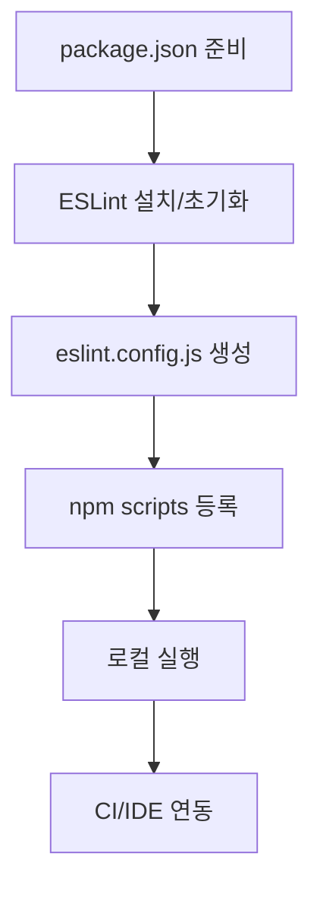

### 5.1 빠른 초기화

- 공식 문서 기준 quick start:

```bash
npm init @eslint/config@latest
```

```bash
yarn create @eslint/config
```

```bash
pnpm create @eslint/config@latest
```

```bash
bun create @eslint/config@latest
```

- 이 명령은 질문을 통해 프로젝트 성격을 파악하고 `eslint.config.js` 또는 `eslint.config.mjs`를 생성한다.
- `package.json`이 없다면 먼저 `npm init` 또는 해당 package manager의 init 명령을 실행한다.

### 5.2 수동 설치

```bash
npm install --save-dev eslint@latest @eslint/js@latest
```

```bash
yarn add --dev eslint@latest @eslint/js@latest
```

```bash
pnpm add --save-dev eslint@latest @eslint/js@latest
```

```bash
bun add --dev eslint@latest @eslint/js@latest
```

- 전역 설치는 권장되지 않는다.
- 이유:
  - 프로젝트별 ESLint 버전이 달라질 수 있다.
  - plugin/shareable config는 결국 프로젝트 local dependency로 설치해야 한다.
  - CI와 로컬 결과를 맞추기 어렵다.

### 5.3 기본 실행

```bash
npx eslint .
```

```bash
npx eslint src/**/*.js
```

```bash
npx eslint file.js
```

- `.`은 현재 프로젝트 전체를 대상으로 한다.
- shell glob은 OS/shell마다 동작이 다를 수 있으므로 CI에서는 따옴표를 쓰는 편이 안전하다.

```bash
npx eslint "src/**/*.{js,jsx,ts,tsx}"
```

### 5.4 package.json scripts

```json
{
  "scripts": {
    "lint": "eslint .",
    "lint:fix": "eslint . --fix",
    "lint:ci": "eslint . --max-warnings=0",
    "lint:cache": "eslint . --cache --cache-strategy content"
  }
}
```

- `lint`: 기본 검사
- `lint:fix`: 자동 수정 가능한 문제 수정
- `lint:ci`: warning도 실패 처리
- `lint:cache`: 변경 파일 위주로 빠르게 실행

### 5.5 자주 쓰는 CLI 옵션

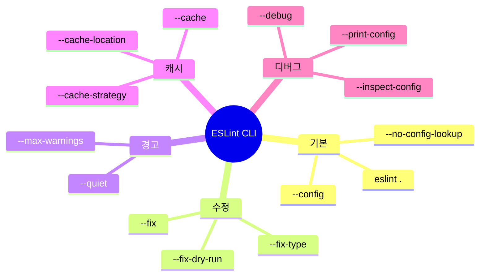

- `--fix`
  - 자동 수정 가능한 문제를 파일에 반영한다.
- `--fix-dry-run`
  - 실제 파일을 고치지 않고 수정 결과를 계산한다.
- `--fix-type`
  - `problem`, `suggestion`, `layout`, `directive` 같은 fix 유형을 제한한다.
- `--cache`
  - 변경되지 않은 파일을 다시 lint하지 않아 속도를 개선한다.
- `--cache-strategy content`
  - 파일 수정시간이 바뀌기 쉬운 CI/git 환경에서 유용하다.
- `--max-warnings=0`
  - warning이 하나라도 있으면 exit code를 실패로 만든다.
- `--print-config file.js`
  - 특정 파일에 실제 적용되는 최종 config를 출력한다.
- `--inspect-config`
  - config inspector를 실행해 어떤 config object가 적용되는지 시각적으로 확인한다.

---

## 6. flat config 구조

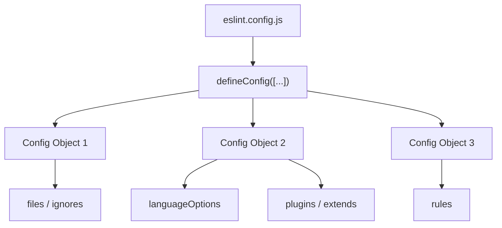

### 6.1 기본 파일명

- ESLint 최신 문서 기준 config 파일명:
  - `eslint.config.js`
  - `eslint.config.mjs`
  - `eslint.config.cjs`
  - `eslint.config.ts`
  - `eslint.config.mts`
  - `eslint.config.cts`
- TypeScript config 파일은 추가 setup이 필요할 수 있다.
- 실무에서는 보통:
  - ESM 프로젝트: `eslint.config.js` 또는 `eslint.config.mjs`
  - CommonJS 프로젝트: `eslint.config.cjs`

### 6.2 최소 JavaScript config 예시

```js
// eslint.config.js
import { defineConfig } from "eslint/config";
import js from "@eslint/js";

export default defineConfig([
  {
    files: ["**/*.{js,mjs,cjs}"],
    plugins: {
      js
    },
    extends: ["js/recommended"],
    rules: {
      "no-unused-vars": "warn",
      "no-undef": "error"
    }
  }
]);
```

- `@eslint/js`는 ESLint의 JavaScript recommended/all config를 제공한다.
- flat config에서는 `"eslint:recommended"` 문자열 대신 `@eslint/js`를 사용한다.
- `files`를 넣어 어떤 파일에 적용되는지 명시하는 것이 좋다.

### 6.3 files와 ignores

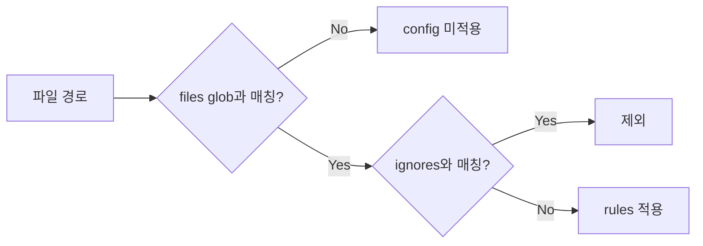

```js
import { defineConfig } from "eslint/config";

export default defineConfig([
  {
    files: ["src/**/*.js"],
    ignores: ["**/*.config.js"],
    rules: {
      semi: "error"
    }
  }
]);
```

- `files`는 config object가 적용될 파일을 제한한다.
- `ignores`는 해당 config object에서 제외할 파일을 제한한다.
- 여러 config object가 같은 파일에 매칭되면 순서대로 병합된다.

### 6.4 globalIgnores

```js
import { defineConfig, globalIgnores } from "eslint/config";

export default defineConfig([
  globalIgnores([
    "dist/",
    "coverage/",
    ".next/",
    "build/"
  ])
]);
```

- ESLint는 기본적으로 `node_modules/`, `.git/` 등을 무시한다.
- build output, coverage output, framework cache는 명시적으로 제외하는 편이 좋다.
- 주의:
  - directory 자체를 traversal하지 않게 하려면 패턴 끝의 `/`가 중요하다.
  - 특정 디렉터리 내부 일부 파일만 다시 포함하려면 `dir/**`와 `dir/**/*`의 차이를 이해해야 한다.

### 6.5 languageOptions

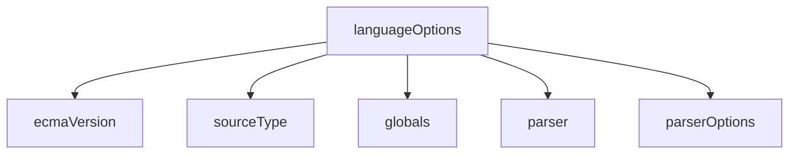

```js
import { defineConfig } from "eslint/config";
import globals from "globals";

export default defineConfig([
  {
    files: ["**/*.js"],
    languageOptions: {
      ecmaVersion: "latest",
      sourceType: "module",
      globals: {
        ...globals.browser,
        ...globals.node
      }
    }
  }
]);
```

- `ecmaVersion`: 사용할 ECMAScript 문법 버전
- `sourceType`:
  - `"module"`: ESM
  - `"script"`: classic script
  - `"commonjs"`: CommonJS
- `globals`: 브라우저, Node, test runner 전역 변수 선언
- `parser`: 기본 parser가 아닌 parser 사용
- `parserOptions`: parser별 추가 옵션

### 6.6 rules

```js
export default [
  {
    rules: {
      "no-unused-vars": "warn",
      "no-undef": "error",
      "eqeqeq": ["error", "always"],
      "no-console": ["warn", { allow: ["warn", "error"] }]
    }
  }
];
```

- rule 값은 보통 다음 형태다.
  - `"rule-name": "error"`
  - `"rule-name": ["error", option1, option2]`
- 추천 운영:
  - 잠재 버그 rule: `"error"`
  - 점진 도입 rule: `"warn"` 또는 bulk suppression 활용
  - 취향/스타일 rule: Prettier로 위임하거나 최소화

### 6.7 linterOptions

```js
import { defineConfig } from "eslint/config";

export default defineConfig([
  {
    linterOptions: {
      reportUnusedDisableDirectives: "error",
      reportUnusedInlineConfigs: "error"
    }
  }
]);
```

- `reportUnusedDisableDirectives`
  - 불필요한 `eslint-disable` 주석을 잡는다.
- `reportUnusedInlineConfigs`
  - 효과 없는 inline config 주석을 잡는다.
- 장점:
  - 오래된 disable 주석이 쌓이는 것을 막는다.
  - 예외를 계속 유지해야 하는지 확인하게 만든다.

### 6.8 settings

- `settings`는 rule/plugin이 공유해서 읽는 값이다.
- 예:
  - React version auto-detect
  - import resolver 설정
  - framework-specific metadata

```js
export default [
  {
    settings: {
      react: {
        version: "detect"
      }
    }
  }
];
```

- ESLint core가 직접 의미를 해석하는 값은 아니다.
- plugin 문서에서 요구할 때 사용한다.

---

## 7. JavaScript 프로젝트 권장 설정

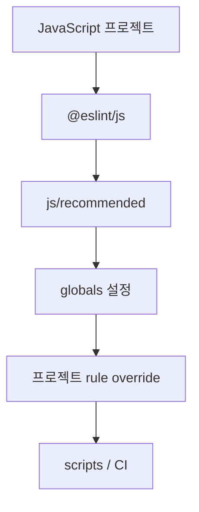

### 7.1 브라우저 JavaScript 예시

```js
// eslint.config.js
import { defineConfig } from "eslint/config";
import js from "@eslint/js";
import globals from "globals";

export default defineConfig([
  {
    files: ["**/*.{js,mjs}"],
    plugins: {
      js
    },
    extends: ["js/recommended"],
    languageOptions: {
      globals: globals.browser
    },
    rules: {
      "no-unused-vars": "warn",
      "no-undef": "error",
      "eqeqeq": ["error", "always"],
      "prefer-const": "error"
    }
  }
]);
```

- 브라우저 전역 객체:
  - `window`
  - `document`
  - `navigator`
  - `localStorage`
- `globals.browser`를 넣지 않으면 브라우저 전역을 `no-undef`가 잡을 수 있다.

### 7.2 Node.js JavaScript 예시

```js
// eslint.config.js
import { defineConfig } from "eslint/config";
import js from "@eslint/js";
import globals from "globals";

export default defineConfig([
  {
    files: ["**/*.{js,cjs,mjs}"],
    plugins: {
      js
    },
    extends: ["js/recommended"],
    languageOptions: {
      globals: globals.node,
      sourceType: "module"
    },
    rules: {
      "no-console": "off",
      "no-process-exit": "error"
    }
  },
  {
    files: ["**/*.cjs"],
    languageOptions: {
      sourceType: "commonjs"
    }
  }
]);
```

- Node CLI나 backend에서는 `console`을 허용하는 경우가 많다.
- CommonJS 파일과 ESM 파일이 섞이면 파일 확장자별 `sourceType`을 분리한다.

### 7.3 테스트 파일 override

```js
import { defineConfig } from "eslint/config";
import globals from "globals";

export default defineConfig([
  {
    files: ["**/*.{test,spec}.js"],
    languageOptions: {
      globals: {
        ...globals.jest
      }
    },
    rules: {
      "no-unused-expressions": "off"
    }
  }
]);
```

- test runner에 따라 globals가 다르다.
  - Jest
  - Vitest
  - Mocha
  - Playwright
- 테스트 파일에만 완화할 rule은 별도 config object로 제한한다.

---

## 8. TypeScript 프로젝트 설정

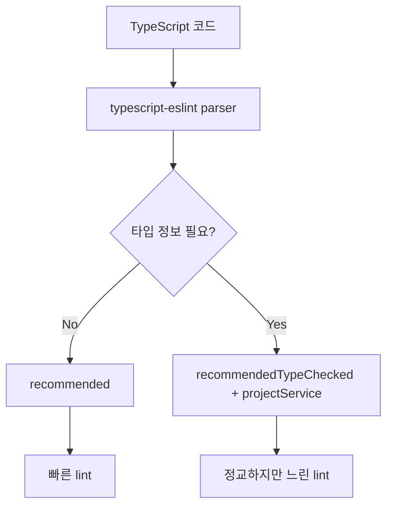

### 8.1 기본 TypeScript 설정

- 공식 `typescript-eslint` 문서는 flat config quickstart를 제공한다.
- 설치:

```bash
npm install --save-dev eslint @eslint/js typescript typescript-eslint
```

```bash
pnpm add --save-dev eslint @eslint/js typescript typescript-eslint
```

- 기본 설정:

```js
// eslint.config.mjs
import js from "@eslint/js";
import { defineConfig } from "eslint/config";
import tseslint from "typescript-eslint";

export default defineConfig(
  js.configs.recommended,
  tseslint.configs.recommended
);
```

- `tseslint.configs.recommended`는 타입 정보 없이 동작하는 기본 TypeScript rule set이다.
- 빠르고 설정이 단순하다.
- 대부분의 프로젝트 첫 도입 단계에는 이 설정이 적합하다.

### 8.2 Type-aware linting


- 타입 정보를 쓰는 rule은 더 강력하지만 느리다.
- 예:
  - Promise 오용
  - 불필요한 type assertion
  - unsafe any 흐름
  - floating promise
- 공식 문서 기준 type-aware 설정:

```js
// eslint.config.mjs
import js from "@eslint/js";
import { defineConfig } from "eslint/config";
import tseslint from "typescript-eslint";

export default defineConfig(
  js.configs.recommended,
  tseslint.configs.recommended,
  tseslint.configs.recommendedTypeChecked,
  {
    languageOptions: {
      parserOptions: {
        projectService: true
      }
    }
  }
);
```

- `projectService: true`
  - TypeScript project service를 통해 파일별 타입 정보를 찾는다.
  - 과거 `parserOptions.project` 직접 지정 방식보다 monorepo/IDE 경험이 나은 경우가 많다.
- 주의:
  - `tsconfig.json`에 포함되지 않는 파일은 parsing error가 날 수 있다.
  - generated file, config file, script file은 별도 include/ignore 전략이 필요하다.
  - CI에서 실행 시간이 늘어날 수 있다.

### 8.3 TypeScript rule 운영 기준

- 도입 순서:
  - 1단계: `tseslint.configs.recommended`
  - 2단계: `recommendedTypeChecked`
  - 3단계: 팀 기준에 맞춰 `strictTypeChecked` 검토
  - 4단계: legacy 위반은 bulk suppressions 또는 점진 수정
- `no-unused-vars`는 TypeScript에서는 `@typescript-eslint/no-unused-vars`를 우선 고려한다.
- TypeScript compiler가 이미 잡는 문제와 ESLint가 잡는 문제를 중복으로 강제하지 않도록 조정한다.

### 8.4 TS/JS 혼합 프로젝트

```js
import js from "@eslint/js";
import { defineConfig } from "eslint/config";
import tseslint from "typescript-eslint";

export default defineConfig(
  {
    files: ["**/*.{js,mjs,cjs}"],
    ...js.configs.recommended
  },
  ...tseslint.configs.recommended,
  {
    files: ["**/*.ts"],
    rules: {
      "no-undef": "off"
    }
  }
);
```

- TypeScript 파일에서는 `no-undef`가 TypeScript scope와 충돌하거나 불필요한 경우가 많다.
- JS와 TS가 섞인 monorepo에서는 파일 확장자별 config를 분리한다.
- `allowJs`, `checkJs`, JSDoc 기반 프로젝트는 별도 기준이 필요하다.

---

## 9. Prettier와의 관계

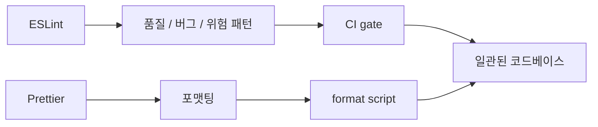

### 9.1 역할 분리

- ESLint:
  - 코드 품질
  - 잠재 버그
  - 팀 규칙
  - architectural restriction
- Prettier:
  - 줄바꿈
  - indentation
  - quote
  - trailing comma
  - formatting
- 권장 방향:
  - formatting은 Prettier에 맡긴다.
  - ESLint stylistic/layout rule은 최소화한다.
  - 충돌 rule은 `eslint-config-prettier`로 끈다.

### 9.2 eslint-config-prettier

```bash
npm install --save-dev eslint-config-prettier
```

```js
// eslint.config.js
import { defineConfig } from "eslint/config";
import js from "@eslint/js";
import eslintConfigPrettier from "eslint-config-prettier";

export default defineConfig([
  js.configs.recommended,
  eslintConfigPrettier
]);
```

- `eslint-config-prettier`는 Prettier와 충돌하거나 불필요한 ESLint rule을 꺼준다.
- 보통 config 배열의 마지막에 둔다.
- 이 패키지는 rule을 추가하지 않고, 충돌 rule을 off하는 역할에 가깝다.

### 9.3 eslint-plugin-prettier는 신중히

- `eslint-plugin-prettier`는 Prettier 결과를 ESLint rule 문제처럼 보고한다.
- 장점:
  - lint 하나로 format 문제까지 표시 가능
- 단점:
  - 느릴 수 있다.
  - ESLint 결과가 formatting noise로 가득 찰 수 있다.
  - 저장 시 Prettier 별도 실행이 더 단순한 경우가 많다.
- 실무 권장:
  - `npm run format`은 Prettier
  - `npm run lint`는 ESLint
  - CI에서는 둘을 별도 step으로 실행

```json
{
  "scripts": {
    "format": "prettier . --write",
    "format:check": "prettier . --check",
    "lint": "eslint .",
    "lint:fix": "eslint . --fix"
  }
}
```

---

## 10. Rule 설계와 운영 전략

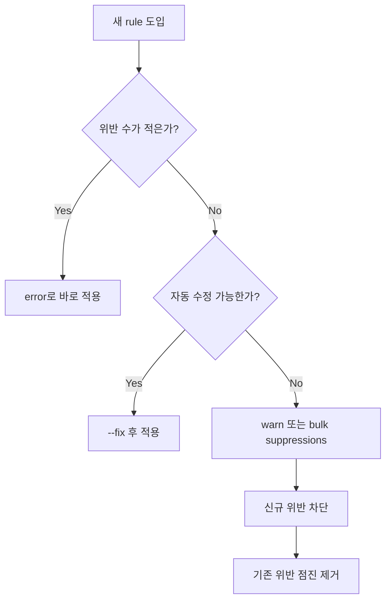

### 10.1 severity 기준

- `"error"`로 둘 rule:
  - 실제 버그 가능성이 높다.
  - 팀에서 반드시 지켜야 한다.
  - 자동 수정 가능하거나 위반 수가 적다.
- `"warn"`으로 둘 rule:
  - 점진 도입 중이다.
  - 아직 팀 합의가 약하다.
  - 기존 위반이 많아 PR을 모두 막기 어렵다.
- `"off"`로 둘 rule:
  - TypeScript/compiler/Prettier와 중복된다.
  - 프로젝트 특성상 오탐이 많다.
  - 규칙보다 개발자 판단이 더 중요하다.

### 10.2 추천 기본 rule 방향

- 잠재 버그:
  - `no-undef`
  - `no-unreachable`
  - `no-async-promise-executor`
  - `no-cond-assign`
  - `no-constant-condition`
- 유지보수:
  - `no-unused-vars`
  - `prefer-const`
  - `no-var`
  - `eqeqeq`
- 아키텍처:
  - `no-restricted-imports`
  - plugin 기반 import boundary rule
- 보안/안정성:
  - `no-eval`
  - `no-implied-eval`
  - `no-new-func`

### 10.3 rule 예외 주석

```js
// eslint-disable-next-line no-console -- CLI command intentionally writes output
console.log(result);
```

- 예외 주석에는 이유를 남긴다.
- 불필요한 disable 주석을 잡기 위해 `reportUnusedDisableDirectives`를 켠다.
- 파일 전체 disable은 마지막 수단으로 둔다.

```js
/* eslint-disable no-console -- migration script logs each step */
```

- 더 나은 선택:
  - config에서 파일 패턴별 override
  - 특정 rule만 disable
  - legacy/generated file을 ignore

### 10.4 Bulk suppressions

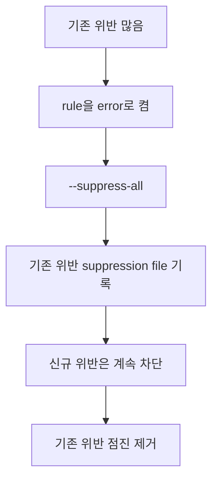

- ESLint의 bulk suppressions는 기존 위반은 숨기고 신규 위반은 막는 방식이다.
- 큰 레거시 코드베이스에서 강한 rule을 도입할 때 유용하다.
- 특징:
  - `"error"` severity rule에만 suppression이 적용된다.
  - `"warn"` rule은 suppress되지 않는다.
- 사용 예:

```bash
npx eslint . --suppress-all
```

- 운영 기준:
  - suppression 파일을 커밋한다.
  - suppression count가 늘지 않도록 CI에서 확인한다.
  - 새 코드에는 동일 위반이 들어오지 않게 한다.

---

## 11. Ignore, generated file, monorepo 전략

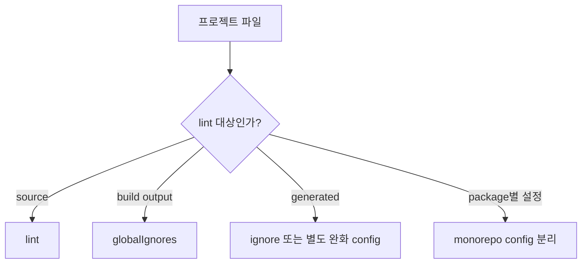

### 11.1 ignore 대상

- 보통 ignore:
  - `dist/`
  - `build/`
  - `coverage/`
  - `.next/`
  - `.nuxt/`
  - `.turbo/`
  - generated API client
  - generated GraphQL types
  - minified bundle
- ESLint 기본 ignore:
  - `node_modules/`
  - `.git/`

### 11.2 generated file 처리

- generated file을 lint하면 noise가 많다.
- 선택지:
  - 아예 ignore
  - generated 코드 생성기를 고쳐 lint-clean하게 만들기
  - 특정 rule만 완화
- 추천:
  - 사람이 수정하지 않는 generated file은 ignore
  - 사람이 수정하는 scaffold file은 lint 대상

### 11.3 monorepo config

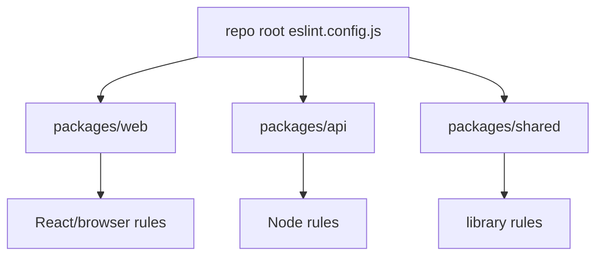

- flat config는 monorepo에서 root config 하나로 관리하기 좋다.
- 패키지별 override 예:

```js
import { defineConfig, globalIgnores } from "eslint/config";
import globals from "globals";

export default defineConfig([
  globalIgnores(["**/dist/", "**/coverage/"]),

  {
    files: ["packages/web/**/*.{js,jsx,ts,tsx}"],
    languageOptions: {
      globals: globals.browser
    }
  },

  {
    files: ["packages/api/**/*.{js,ts}"],
    languageOptions: {
      globals: globals.node
    },
    rules: {
      "no-console": "off"
    }
  }
]);
```

- package별 config 파일을 따로 둘 수도 있지만, root에서 한 번에 보는 편이 변경 추적이 쉽다.
- ESLint v10에는 config file lookup algorithm 변화가 있으므로, 여러 config 파일을 둘 때 어떤 config가 읽히는지 `--debug`와 `--print-config`로 확인한다.

---

## 12. 디버깅 방법

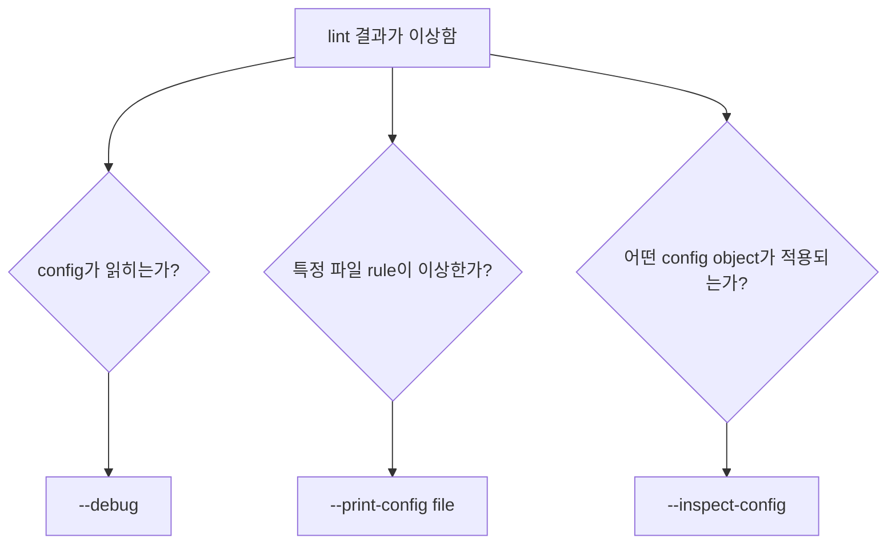

### 12.1 config 파일이 안 읽힐 때

```bash
npx eslint --debug src/index.js
```

- 확인할 것:
  - 어떤 `eslint.config.*` 파일을 찾는가?
  - 현재 working directory가 맞는가?
  - `--config`로 다른 파일을 지정했는가?
  - IDE가 다른 workspace root를 쓰는가?

### 12.2 특정 파일의 최종 config 확인

```bash
npx eslint --print-config src/index.js
```

- 확인할 것:
  - 적용 rule
  - severity
  - languageOptions
  - globals
  - parser
  - plugins
- rule이 예상과 다르면:
  - config object 순서 확인
  - `files` glob 확인
  - `ignores` 확인
  - shareable config가 뒤에서 덮어쓰는지 확인

### 12.3 config inspector

```bash
npx eslint --inspect-config
```

- config inspector는 특정 파일명에 어떤 config object가 적용되는지 볼 수 있다.
- rule deprecation, 사용 중인 rule 수 등을 확인하는 데도 유용하다.
- 큰 monorepo나 shareable config가 많은 프로젝트에서 특히 좋다.

### 12.4 성능 분석

```bash
TIMING=1 npx eslint .
```

- 느린 rule을 확인한다.
- type-aware TypeScript rule이 병목인 경우가 많다.
- 개선 방법:
  - type-aware rule을 필요한 파일에만 적용
  - generated file ignore
  - `--cache` 사용
  - CI와 local 설정 분리
  - 느린 plugin/rule 대체 검토

---

## 13. 마이그레이션 전략

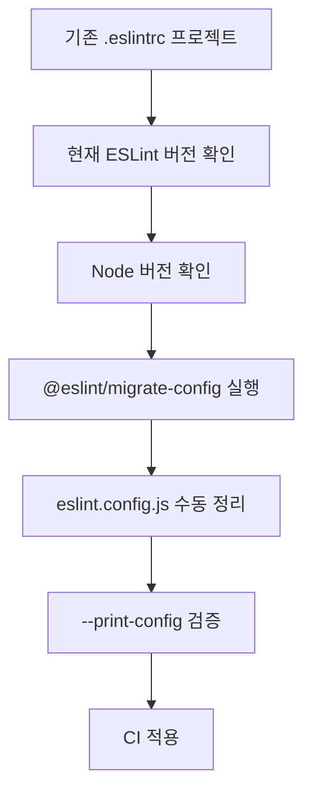

### 13.1 v8/v9에서 v10으로 갈 때 핵심

- v9:
  - flat config가 기본값
  - eslintrc는 deprecated
- v10:
  - old config format 더 이상 지원하지 않음
  - Node.js `20.19+`, `22.13+`, `24+` 필요
  - `eslint-env` comments가 에러로 보고됨
  - `eslint:recommended`가 업데이트됨
  - JSX reference tracking 개선으로 `no-unused-vars`, `no-undef` 결과가 바뀔 수 있음

### 13.2 자동 migration

```bash
npx @eslint/migrate-config .eslintrc.json
```

```bash
pnpm dlx @eslint/migrate-config .eslintrc.json
```

- `.eslintrc.json`, `.eslintrc.yml` 같은 데이터형 config는 비교적 잘 변환된다.
- `.eslintrc.js`는 함수, 조건문, 동적 로직이 있으면 변환 결과를 수동 검토해야 한다.
- 자동 변환은 시작점이지 최종본이 아니다.

### 13.3 eslintrc와 flat config 차이

| eslintrc | flat config |
|---|---|
| `.eslintrc.*` | `eslint.config.*` |
| `env` | `languageOptions.globals` |
| `parserOptions` | `languageOptions.parserOptions` |
| `parser` 문자열 | parser object import |
| `plugins: ["react"]` | `plugins: { react }` |
| `extends: ["eslint:recommended"]` | `@eslint/js` import |
| `.eslintignore` | `globalIgnores()` 또는 config ignores |
| `root: true` | flat config lookup 구조로 대체 |

### 13.4 migration 검증 루틴

- 기존 브랜치에서 lint 결과 저장:

```bash
npx eslint . -f json -o eslint-before.json
```

- migration 후 결과 저장:

```bash
npx eslint . -f json -o eslint-after.json
```

- 확인:
  - rule 수가 의도치 않게 크게 줄었는가?
  - 특정 파일이 lint 대상에서 빠졌는가?
  - TypeScript 파일이 parsing error를 내는가?
  - ignore가 너무 넓게 잡혔는가?
  - warning/error 정책이 CI에서 동일한가?

---

## 14. CI, Git Hook, IDE 연동

```mermaid
flowchart TD
    A["개발자 IDE"] --> B["저장 시 lint/fix"]
    B --> C["pre-commit 선택 적용"]
    C --> D["PR push"]
    D --> E["CI eslint"]
    E --> F{"통과?"}
    F -->|"Yes"| G["Merge 가능"]
    F -->|"No"| H["수정 필요"]
```

### 14.1 CI 설정 기준

- CI에서는 엄격하게 실행한다.

```bash
npm run lint -- --max-warnings=0
```

- 대규모 repo에서는 cache를 고려한다.

```bash
npx eslint . --cache --cache-strategy content --max-warnings=0
```

- CI에서 `--fix`는 일반적으로 실행하지 않는다.
- 이유:
  - CI가 코드를 수정해도 PR 브랜치에는 반영되지 않는다.
  - 자동 수정 결과가 리뷰되지 않는다.
- 예외:
  - 별도 bot이 autofix commit을 올리는 workflow를 명시적으로 운영하는 경우

### 14.2 Git hook

- pre-commit에서 전체 repo lint는 느릴 수 있다.
- 보통:
  - staged file만 lint
  - format 자동 적용
  - 전체 lint는 CI에서 수행
- 예:
  - `lint-staged`
  - `lefthook`
  - `husky`

### 14.3 IDE

- VS Code ESLint extension 같은 editor integration을 사용하면 저장 전/저장 시 피드백을 받을 수 있다.
- 확인할 것:
  - workspace root가 맞는가?
  - extension이 사용하는 Node 버전이 ESLint 요구사항을 만족하는가?
  - monorepo에서 working directories 설정이 필요한가?
  - flat config를 지원하는 extension 버전인가?

### 14.4 점진 도입 전략

- 새 프로젝트:
  - 처음부터 `error` 중심으로 강하게 설정
  - `--max-warnings=0` 적용
- 기존 프로젝트:
  - recommended부터 시작
  - `--fix`로 자동 수정
  - 남은 위반은 warn 또는 suppression
  - 주요 rule을 하나씩 error로 승격

---

## 15. 실전 설정 예시

```mermaid
flowchart TD
    A["프로젝트 유형"] --> B{"JS only?"}
    B -->|"Yes"| C["JavaScript config"]
    B -->|"No"| D{"TypeScript?"}
    D -->|"Yes"| E["typescript-eslint config"]
    D -->|"React/Next"| F["framework plugin 추가"]
    C --> G["Prettier conflict 제거"]
    E --> G
    F --> G
    G --> H["CI script"]
```

### 15.1 JavaScript + Prettier

```js
// eslint.config.js
import { defineConfig, globalIgnores } from "eslint/config";
import js from "@eslint/js";
import globals from "globals";
import eslintConfigPrettier from "eslint-config-prettier";

export default defineConfig([
  globalIgnores(["dist/", "coverage/"]),

  {
    files: ["**/*.{js,mjs,cjs}"],
    plugins: {
      js
    },
    extends: ["js/recommended"],
    languageOptions: {
      ecmaVersion: "latest",
      sourceType: "module",
      globals: {
        ...globals.browser,
        ...globals.node
      }
    },
    rules: {
      "no-unused-vars": "warn",
      "no-undef": "error",
      "eqeqeq": ["error", "always"],
      "prefer-const": "error"
    }
  },

  eslintConfigPrettier
]);
```

### 15.2 TypeScript 기본

```js
// eslint.config.mjs
import js from "@eslint/js";
import { defineConfig, globalIgnores } from "eslint/config";
import tseslint from "typescript-eslint";
import eslintConfigPrettier from "eslint-config-prettier";

export default defineConfig(
  globalIgnores(["dist/", "coverage/"]),
  js.configs.recommended,
  tseslint.configs.recommended,
  {
    files: ["**/*.ts"],
    rules: {
      "no-undef": "off"
    }
  },
  eslintConfigPrettier
);
```

### 15.3 TypeScript type-aware

```js
// eslint.config.mjs
import js from "@eslint/js";
import { defineConfig, globalIgnores } from "eslint/config";
import tseslint from "typescript-eslint";
import eslintConfigPrettier from "eslint-config-prettier";

export default defineConfig(
  globalIgnores(["dist/", "coverage/"]),
  js.configs.recommended,
  tseslint.configs.recommended,
  tseslint.configs.recommendedTypeChecked,
  {
    languageOptions: {
      parserOptions: {
        projectService: true
      }
    }
  },
  {
    files: ["**/*.js"],
    extends: [tseslint.configs.disableTypeChecked]
  },
  eslintConfigPrettier
);
```

- JS 파일에 type-aware rule을 적용하지 않으려면 `disableTypeChecked` 같은 제공 config를 활용한다.
- 프로젝트 구조에 따라 `tsconfigRootDir`, extra file inclusion 문제가 생길 수 있으므로 typescript-eslint 문서를 확인한다.

### 15.4 CI script 예시

```json
{
  "scripts": {
    "lint": "eslint .",
    "lint:fix": "eslint . --fix",
    "lint:ci": "eslint . --cache --cache-strategy content --max-warnings=0",
    "format": "prettier . --write",
    "format:check": "prettier . --check"
  }
}
```

---

## 16. 흔한 오류와 해결

```mermaid
flowchart TD
    A["ESLint 문제"] --> B["config 못 찾음"]
    A --> C["parser error"]
    A --> D["plugin not found"]
    A --> E["rule이 예상과 다름"]
    A --> F["너무 느림"]
    B --> G["--debug"]
    C --> H["languageOptions / tsconfig"]
    D --> I["dependency 설치/import 확인"]
    E --> J["--print-config"]
    F --> K["TIMING / cache / ignore"]
```

### 16.1 ESLint가 config를 못 찾음

- 증상:
  - `ESLint couldn't find an eslint.config.* file`
  - IDE에서는 안 되고 CLI에서는 됨
- 해결:
  - 프로젝트 root에 `eslint.config.js`가 있는지 확인
  - CLI 실행 위치 확인
  - `--debug`로 어떤 경로를 찾는지 확인
  - monorepo IDE working directory 확인

### 16.2 `.eslintrc`가 무시됨

- v10에서는 old config format이 지원되지 않는다.
- 해결:
  - `eslint.config.js`로 migration
  - `@eslint/migrate-config` 사용
  - plugin/shareable config가 flat config를 지원하는지 확인

### 16.3 TypeScript parsing error

- 원인 후보:
  - 해당 파일이 `tsconfig.json` include에 없음
  - type-aware lint가 JS/config/generated 파일에도 적용됨
  - monorepo에서 tsconfig 경로가 잘못 잡힘
- 해결:
  - `projectService: true` 사용 검토
  - generated file ignore
  - 파일 패턴별 type-aware rule 제한
  - `--print-config problematic-file.ts` 확인

### 16.4 plugin not found

- flat config에서는 plugin을 import해야 한다.
- 예전:

```js
plugins: ["jsdoc"]
```

- 현재:

```js
import jsdoc from "eslint-plugin-jsdoc";

export default [
  {
    plugins: {
      jsdoc
    }
  }
];
```

- 해결:
  - package 설치 확인
  - import 이름과 rule prefix 확인
  - shareable config가 peer dependency를 요구하는지 확인

### 16.5 lint가 너무 느림

- 원인:
  - type-aware TypeScript rule
  - generated/build output까지 lint
  - 느린 plugin rule
  - cache 미사용
- 해결:
  - `TIMING=1 npx eslint .`
  - `--cache --cache-strategy content`
  - `globalIgnores()` 정리
  - type-aware config 적용 범위 축소

---

## 17. 운영 체크리스트

```mermaid
flowchart TD
    A["ESLint 운영"] --> B["버전 고정"]
    A --> C["flat config"]
    A --> D["CI gate"]
    A --> E["IDE 동작"]
    A --> F["예외 주석 관리"]
    A --> G["성능 관리"]
```

- 버전:
  - ESLint major version을 lockfile로 고정한다.
  - Node.js 버전을 `.nvmrc`, `.node-version`, `engines` 등으로 명시한다.
- config:
  - `eslint.config.*` 사용
  - `files` 범위를 명확히 둔다.
  - generated/build output ignore
  - Prettier와 충돌 rule 제거
- rules:
  - recommended config에서 시작
  - 팀 규칙은 별도 섹션으로 override
  - warning을 방치하지 않는다.
  - disable 주석에는 이유를 남긴다.
- CI:
  - `eslint . --max-warnings=0`
  - 필요 시 `--cache --cache-strategy content`
  - lint와 format check를 분리
- IDE:
  - 저장 시 fix 정책을 팀에 맞춘다.
  - monorepo working directory 확인
  - extension Node 버전 확인
- migration:
  - v8/v9 legacy config가 남아 있으면 migration 계획 수립
  - v10 도입 전 Node 버전과 plugin 호환성 확인

---

## 18. 빠른 용어 정리

```mermaid
mindmap
  root((ESLint))
    Config
      flat config
      eslint.config.js
      files
      ignores
    Analysis
      parser
      AST
      scope
      code path
    Rules
      off
      warn
      error
      fix
      suggestion
    Extensions
      plugin
      processor
      formatter
      shareable config
    Workflow
      CLI
      cache
      CI
      IDE
      suppressions
```

- `ESLint`: JavaScript/TypeScript 생태계의 정적 분석 linter.
- `lint`: 코드 문제를 정적 분석으로 찾는 행위.
- `rule`: 특정 코드 패턴을 검사하는 단위.
- `severity`: rule 위반을 off/warn/error 중 어떻게 처리할지 정하는 값.
- `parser`: 소스 코드를 AST로 바꾸는 도구.
- `AST`: 코드 구조를 트리로 표현한 데이터.
- `flat config`: `eslint.config.*` 기반의 현재 ESLint 설정 방식.
- `config object`: flat config 배열 안의 개별 설정 객체.
- `files`: 설정이 적용될 파일 glob.
- `ignores`: 설정에서 제외할 파일 glob.
- `globalIgnores`: 프로젝트 전역 ignore helper.
- `languageOptions`: ECMAScript 버전, source type, globals, parser 관련 설정.
- `plugin`: rule, config, processor 등을 제공하는 확장 패키지.
- `processor`: Markdown/Vue/MDX 같은 파일에서 lint 대상 코드를 추출하는 확장.
- `formatter`: lint 결과 출력 형식.
- `shareable config`: npm 패키지로 공유되는 ESLint 설정.
- `type-aware linting`: TypeScript 타입 정보를 이용하는 lint.
- `suppression`: 기존 위반을 숨기고 신규 위반을 막기 위한 억제 정보.
- `--fix`: 자동 수정 가능한 lint 문제를 고치는 CLI 옵션.
- `--print-config`: 특정 파일의 최종 ESLint 설정을 출력하는 디버그 옵션.
- `--inspect-config`: config inspector를 실행하는 옵션.

---

## 19. 참고 링크

- [ESLint - Getting Started](https://eslint.org/docs/latest/use/getting-started)
- [ESLint - Core Concepts](https://eslint.org/docs/latest/use/core-concepts)
- [ESLint - Configuration Files](https://eslint.org/docs/latest/use/configure/configuration-files)
- [ESLint - Configure Rules](https://eslint.org/docs/latest/use/configure/rules)
- [ESLint - Configure Language Options](https://eslint.org/docs/latest/use/configure/language-options)
- [ESLint - Configure Plugins](https://eslint.org/docs/latest/use/configure/plugins)
- [ESLint - Ignore Files](https://eslint.org/docs/latest/use/configure/ignore)
- [ESLint - Combine Configs](https://eslint.org/docs/latest/use/configure/combine-configs)
- [ESLint - Debug Your Configuration](https://eslint.org/docs/latest/use/configure/debug)
- [ESLint - Command Line Interface Reference](https://eslint.org/docs/latest/use/command-line-interface)
- [ESLint - Bulk Suppressions](https://eslint.org/docs/latest/use/suppressions)
- [ESLint - Configuration Migration Guide](https://eslint.org/docs/latest/use/configure/migration-guide)
- [ESLint - Migrate to v9.x](https://eslint.org/docs/latest/use/migrate-to-9.0.0)
- [ESLint - Migrate to v10.x](https://eslint.org/docs/latest/use/migrate-to-10.0.0)
- [ESLint v10.2.1 released](https://eslint.org/blog/2026/04/eslint-v10.2.1-released/)
- [ESLint v10.2.0 released](https://eslint.org/blog/2026/04/eslint-v10.2.0-released/)
- [typescript-eslint - Getting Started](https://typescript-eslint.io/getting-started/)
- [typescript-eslint - Linting with Type Information](https://typescript-eslint.io/getting-started/typed-linting)
- [eslint-config-prettier](https://github.com/prettier/eslint-config-prettier)
