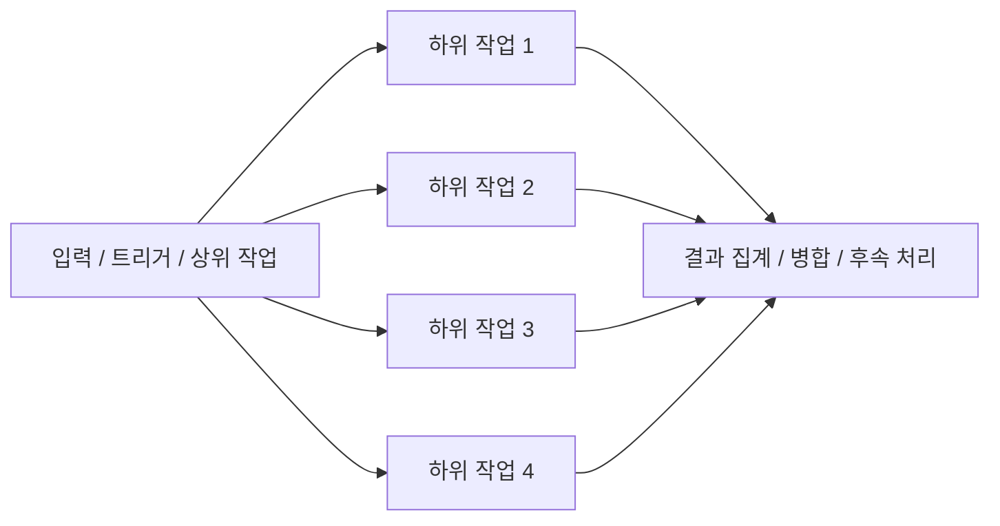
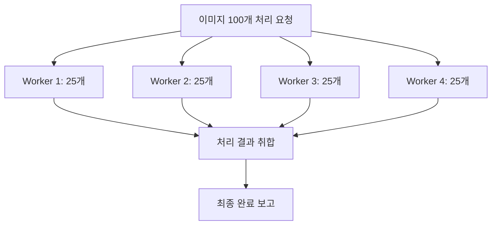
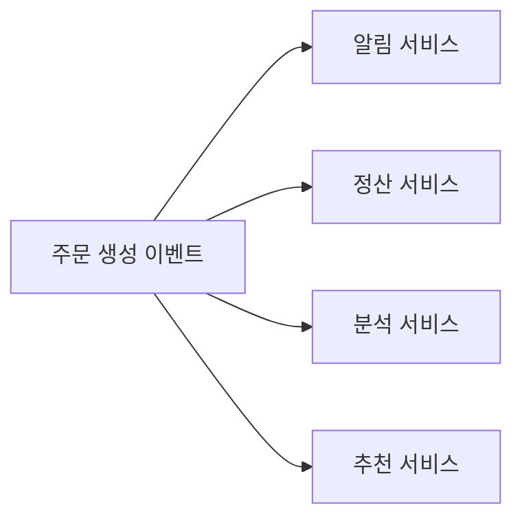

# fan-in / fan-out 상세 정리

작성 기준일: 2026-04-13  
주요 참고: `Microsoft Learn Durable Functions`, `AWS fan-out patterns`, `Temporal docs`, 일반 시스템 설계 문맥

## 1. 한 줄 요약

`fan-out`은 하나의 입력이나 작업을 여러 대상/작업으로 퍼뜨리는 구조이고, `fan-in`은 여러 결과를 다시 하나로 모으는 구조다.

짧게 말하면:

- `fan-out` = `하나 -> 여러 개`
- `fan-in` = `여러 개 -> 하나`

다.

그리고 실무에서는 대개 두 개가 붙어서 나온다.

- 하나의 큰 일을 여러 작업으로 쪼개서 병렬 처리하고
- 마지막에 결과를 다시 합치는 것

이 바로 `fan-out / fan-in` 패턴이다.

---

## 2. 먼저 큰 그림

이 그림은 가장 전형적인 형태다.

- 상위 작업이 여러 하위 작업으로 분산된다
- 하위 작업들이 끝난 뒤
- 하나의 집계 단계로 다시 모인다

즉 fan-out과 fan-in은 보통 세트로 이해하는 것이 가장 자연스럽다.

---

## 3. 용어를 직관적으로 이해하기

### 3.1 fan-out

부채살이 펴지듯이 한 점에서 여러 갈래로 퍼지는 모습이다.

예:

- 하나의 메시지를 여러 소비자에게 배포
- 하나의 배치 작업을 여러 shard로 분할
- 하나의 요청에서 여러 API를 병렬 호출

### 3.2 fan-in

여러 갈래가 다시 한 점으로 모이는 모습이다.

예:

- 병렬 작업 결과를 취합
- 여러 서비스 응답을 합쳐 최종 응답 생성
- 여러 이벤트를 집계해 요약 결과 생성

### 3.3 같이 쓰일 때

실무에서는 보통 이렇게 나온다.

- 팬아웃으로 병렬화
- 팬인으로 집계/완성

즉 성능 최적화와 결과 조립을 같이 다루는 패턴이다.

---

## 4. 왜 이런 패턴이 필요한가

fan-in / fan-out은 보통 `큰 작업을 효율적으로 처리`하기 위해 나온다.

### 4.1 이유 1: 병렬화

하나의 큰 작업을 순차적으로 다 처리하면 느리다.

예:

- 파일 100개 처리
- 고객 10만 명에게 메일 발송
- 50개 API 병렬 조회

이런 일은 fan-out이 유리하다.

### 4.2 이유 2: 책임 분리

한 작업을 여러 worker나 서비스에 나누면 각자의 책임이 명확해질 수 있다.

### 4.3 이유 3: 집계 필요

분산 처리 후에는 보통 결과를 다시 모아야 한다.

예:

- 전체 성공/실패 수 계산
- 병렬 fetch 결과 병합
- 최종 보고서 생성

이게 fan-in이다.

---

## 5. 어디에서 자주 등장하나

fan-in / fan-out은 특정 기술만의 용어가 아니라, 여러 층에서 공통으로 등장한다.

### 5.1 비동기 워크플로우 / 오케스트레이션

예:

- Durable Functions
- Temporal
- Airflow 일부 패턴
- Step Functions

### 5.2 분산 시스템 / 마이크로서비스

예:

- 이벤트를 여러 서비스로 브로드캐스트
- 각 서비스 결과를 집계

### 5.3 네트워크/하드웨어 문맥

예:

- 한 신호가 여러 대상에 분배됨
- 여러 입력이 하나의 포인트로 모임

### 5.4 소프트웨어 구조/메서드 호출 그래프

예:

- 어떤 함수가 여러 함수를 호출하면 fan-out이 큰 구조
- 여러 함수가 하나의 핵심 함수를 호출하면 fan-in이 큰 구조

즉 이 용어는 "방향성 있는 연결 구조"를 설명하는 일반 개념이다.

---

## 6. 가장 대표적인 예: 병렬 작업 처리

예를 들어 이미지 100개를 리사이징한다고 하자.

순차 처리:

1. 파일 1 처리
2. 파일 2 처리
3. 파일 3 처리
4. ...

fan-out / fan-in 처리:

1. 파일 목록을 나눔
2. 여러 worker가 동시에 처리
3. 결과를 다시 모음

이 구조는 fan-out/fan-in의 전형적인 사례다.

---

## 7. fan-out만 있는 경우

반드시 fan-in이 같이 있어야 하는 것은 아니다.

예:

- 하나의 이벤트를 여러 시스템에 브로드캐스트
- 각 시스템이 독립적으로 처리하고 끝냄

이 경우는:

- fan-out은 있지만
- 중앙 집계가 꼭 필요하지 않을 수 있다

즉 fan-out은 `배포`, fan-in은 `집계`에 더 가깝다고 생각하면 편하다.

---

## 8. fan-in만 강조되는 경우

반대로 여러 입력이 하나의 핵심 지점으로 모이는 구조만 강조될 때도 있다.

예:

- 여러 서비스 로그가 하나의 로그 수집기로 모임
- 여러 요청이 하나의 집계 서비스로 들어감
- 여러 모듈이 하나의 공용 유틸/핵심 API를 호출

이 경우는 "집중도"나 "병목"을 설명할 때 fan-in 용어가 자주 쓰인다.

---

## 9. 함수/모듈 구조에서 fan-in / fan-out

이건 시스템 설계보다 코드 구조 분석에서 자주 나오는 문맥이다.

### 9.1 fan-out이 큰 함수

한 함수가:

- 많은 다른 함수/모듈을 호출하면

fan-out이 크다고 볼 수 있다.

예:

- orchestrator 함수
- service facade
- controller에서 너무 많은 dependency를 직접 다룸

### 9.2 fan-in이 큰 함수

여러 함수/모듈이:

- 하나의 공통 함수나 서비스에 의존하면

그 함수의 fan-in이 크다고 볼 수 있다.

예:

- 핵심 계산 함수
- 공용 validator
- shared auth service

### 9.3 왜 중요한가

fan-in/fan-out은 코드 복잡도를 읽는 힌트가 된다.

예:

- fan-out이 너무 크면 오케스트레이션이 과도하게 비대해질 수 있다
- fan-in이 너무 크면 하나의 변경이 시스템 전반에 큰 영향을 미칠 수 있다

즉 구조 분석 지표처럼 쓸 수 있다.

---

## 10. 마이크로서비스에서의 fan-out

마이크로서비스에서는 fan-out이 매우 흔하다.

예:

- 주문 생성 이벤트 1개
- 여러 downstream 서비스가 구독

즉 이벤트 기반 아키텍처에서 fan-out은 거의 기본 패턴이다.

### 10.1 장점

- producer는 downstream을 직접 몰라도 됨
- 느슨한 결합
- 확장성 좋음

### 10.2 단점

- 누가 이벤트를 소비하는지 파악 어려움
- 장애/지연 추적 어려움
- 이벤트 중복 처리 문제

즉 fan-out은 시스템을 유연하게 하지만, 관찰성과 운영 복잡도가 올라간다.

---

## 11. 오케스트레이션에서의 fan-in

병렬 작업이 끝난 뒤 결과를 다시 모으는 단계가 fan-in이다.

예:

- 10개 shard 계산 결과를 더함
- 50개 API 응답을 하나의 화면 데이터로 조립
- 병렬 테스트 결과를 최종 상태로 집계

### 11.1 fan-in 단계의 책임

- 모든 결과를 기다릴지
- 일부만 와도 진행할지
- 실패한 항목은 어떻게 처리할지
- timeout은 어떻게 볼지

즉 fan-in은 단순 merge가 아니라, 종종 `정책 결정`의 지점이 된다.

---

## 12. fan-out/fan-in의 핵심 장점

### 12.1 성능 향상

병렬화가 가능하면 총 처리 시간을 줄일 수 있다.

### 12.2 확장성

worker 수를 늘려 throughput을 높일 수 있다.

### 12.3 구조 분리

한 작업을 성격별로 분해하기 쉽다.

### 12.4 이벤트 중심 아키텍처와 궁합

특히 fan-out은 pub/sub 모델과 잘 맞는다.

---

## 13. fan-out/fan-in의 단점

### 13.1 복잡도 증가

- 순차 코드는 단순하지만
- fan-out/fan-in은 상태 추적이 복잡하다

### 13.2 오류 처리 어려움

예:

- 10개 중 2개 실패
- 나머지는 성공

이럴 때 전체를 실패로 볼지, 부분 성공으로 볼지 정해야 한다.

### 13.3 재시도 설계 필요

병렬 작업 중 일부만 실패할 수 있으므로:

- 개별 재시도
- 전체 재시도
- idempotency

를 설계해야 한다.

### 13.4 집계 병목

fan-in 지점이 과도하게 무거우면 그 자체가 병목이 될 수 있다.

즉 분산했지만 마지막 집계가 너무 비싸면 효과가 줄어든다.

---

## 14. 실전에서 고민해야 하는 질문

fan-out/fan-in 구조를 쓸 때는 아래를 반드시 생각해야 한다.

### 14.1 분할 기준

- 무엇을 기준으로 fan-out할 것인가
- shard 기준은 무엇인가

### 14.2 병렬 수

- worker를 몇 개 띄울 것인가
- 과도한 병렬화로 오히려 느려지지 않는가

### 14.3 timeout

- 언제 실패로 볼 것인가

### 14.4 partial failure

- 일부 실패 시 전체 정책은 무엇인가

### 14.5 idempotency

- 재시도해도 중복 부작용이 없어야 한다

### 14.6 집계 방식

- 모두 기다릴지
- quorum만 만족하면 되는지

이 질문에 답하지 않으면 fan-out/fan-in은 쉽게 불안정해진다.

---

## 15. 시스템 설계에서 자주 나오는 패턴

### 15.1 브로드캐스트 fan-out

- 한 이벤트를 여러 consumer가 각자 처리

### 15.2 병렬 계산 fan-out/fan-in

- 큰 계산을 여러 shard로 나누고 결과 합치기

### 15.3 scatter-gather

이건 사실상 fan-out/fan-in과 매우 비슷하다.

- 여러 곳에 scatter
- 결과를 gather

라는 표현이다.

즉 distributed query나 aggregator 서비스 문맥에서는 `scatter-gather`라는 말도 함께 알아두면 좋다.

---

## 16. Azure Durable Functions 문맥

Microsoft Learn의 대표 문서가 `fan-out/fan-in scenarios in Durable Functions`다.

이 문맥에서의 의미는 매우 전형적이다.

- 오케스트레이터가 여러 activity를 병렬 호출
- 모든 activity 결과를 기다린 뒤
- 집계해서 다음 단계 진행

즉 durable workflow 엔진에서는 fan-out/fan-in이 핵심 패턴이다.

### 16.1 왜 잘 맞나

Durable workflow는:

- 상태 저장
- 재시도
- long-running orchestration

에 강하므로 fan-out/fan-in의 복잡성을 줄여준다.

---

## 17. Temporal 문맥

Temporal도 비슷한 문맥에서 fan-out/fan-in을 많이 쓴다.

의미:

- 워크플로우 안에서 여러 activity/child workflow를 병렬로 실행
- 결과를 기다린 뒤 집계

즉 장기 실행 / 재시도 / 장애 복구가 필요한 비즈니스 워크플로우에서 매우 자연스럽다.

---

## 18. AWS 문맥

AWS에서도 fan-out은 흔하다.

예:

- SNS -> 여러 SQS / Lambda
- EventBridge -> 여러 타깃
- Step Functions 병렬 처리

즉 클라우드 아키텍처 전반에서 fan-out은 기본 패턴이고, fan-in은 그 결과를 다시 모으는 후속 설계다.

---

## 19. fan-in/fan-out과 병렬성은 같은가

비슷하지만 완전히 같진 않다.

### 19.1 병렬성

- 동시에 처리한다는 실행 특성

### 19.2 fan-out

- 하나를 여러 갈래로 분해하는 구조

### 19.3 fan-in

- 여러 갈래를 다시 모으는 구조

즉 병렬성은 실행 방식이고, fan-in/fan-out은 구조적 패턴이다.

둘은 자주 같이 나오지만 같은 말은 아니다.

---

## 20. fan-out이 크다고 무조건 좋은가

아니다.

fan-out이 크면:

- 병렬화로 빨라질 수도 있지만
- downstream 압박이 커지고
- tracing이 어려워지고
- 장애 폭발 반경이 커질 수 있다

즉 적절한 fan-out이 중요하다.

### 20.1 과도한 fan-out의 문제

- API rate limit 초과
- 메시지 폭증
- 큐 backlog 증가
- 비용 증가

따라서 fan-out은 "많을수록 좋다"가 아니라 "통제 가능한 분산"이 중요하다.

---

## 21. fan-in이 크다고 무조건 나쁜가

fan-in도 무조건 나쁜 건 아니다.

높은 fan-in은 때로:

- 공통 유틸
- 핵심 도메인 서비스
- 표준화된 진입점

을 의미할 수 있다.

하지만 너무 크면:

- 병목
- 변경 영향도 증가
- 장애 집중

이 생길 수 있다.

즉 fan-in은 `중앙성`의 신호로 이해하면 된다.

---

## 22. 코드 리뷰에서 fan-in / fan-out을 어떻게 읽나

### 22.1 fan-out이 큰 함수

이런 질문을 해볼 수 있다.

- 너무 많은 책임을 가진 orchestrator인가?
- dependency가 과한가?
- service 분리 필요가 있는가?

### 22.2 fan-in이 큰 함수/서비스

이런 질문을 해볼 수 있다.

- 정말 공통 핵심인가?
- 병목이 될 수 있는가?
- 변경 시 위험이 큰가?

즉 fan-in/fan-out은 설계 품질을 읽는 보조 렌즈다.

---

## 23. 자주 하는 오해

### 23.1 fan-out/fan-in은 특정 기술 용어다

아니다.

이건 일반 패턴이다.

### 23.2 fan-out은 무조건 이벤트 시스템 얘기다

아니다.

함수 호출 구조, 하드웨어, 워크플로우 엔진에서도 쓴다.

### 23.3 fan-in은 단순 집계 함수 하나를 뜻한다

아니다.

집계 단계 전체, 또는 여러 입력이 모이는 구조 전체를 뜻할 수 있다.

### 23.4 fan-out/fan-in을 쓰면 자동으로 빨라진다

아니다.

분산/병렬화 오버헤드와 집계 병목까지 같이 봐야 한다.

---

## 24. 빠른 복습

- `fan-out`은 하나를 여러 갈래로 분해/분배하는 것
- `fan-in`은 여러 갈래를 하나로 모으는 것
- 둘은 병렬 워크플로우에서 자주 세트로 나온다
- fan-out은 배포/분산/병렬화와 연결
- fan-in은 집계/병합/후속 처리와 연결
- 장점은 속도와 확장성
- 단점은 오류 처리, 집계 병목, 운영 복잡도

---

## 25. 참고 링크

- Microsoft Learn, Fan-out/fan-in scenarios in Durable Functions: [링크](https://learn.microsoft.com/azure/azure-functions/durable/durable-functions-fan-in-fan-out)
- AWS Prescriptive Guidance, asynchronous and event-driven patterns: [링크](https://docs.aws.amazon.com/prescriptive-guidance/latest/modernization-data-persistence/asynchronous.html)
- Temporal docs, workflows and activities: [링크](https://docs.temporal.io/workflows)
- Confluent Kafka concepts (fan-out 문맥 참고용): [링크](https://docs.confluent.io/platform/current/kafka/introduction.html)

