# GA와 GTM 상세 정리

작성 기준일: 2026-04-27  
조사 방식: 웹검색 기반 최신 조사, Google 공식 문서 우선 사용  
주요 참고: `developers.google.com`, `support.google.com/analytics`, `support.google.com/tagmanager`

---

## 1. 한 줄 요약

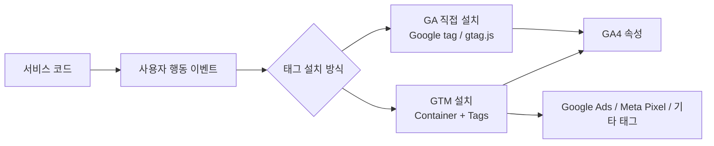

- `GA`는 보통 현재 기준으로 `Google Analytics 4`, 즉 `GA4`를 의미한다.
- `GA4`는 웹사이트나 앱의 사용자 행동을 `event` 중심으로 수집하고 분석하는 분석 도구다.
- `GTM`은 `Google Tag Manager`의 약자로, GA4, Google Ads, Meta Pixel 같은 여러 태그를 코드 배포 없이 관리하는 태그 관리 도구다.
- 아주 단순하게 나누면:
  - `GA4` = 데이터를 분석하고 리포트로 보는 곳
  - `Google tag / gtag.js` = Google 제품으로 데이터를 보내는 웹 태그 코드
  - `GTM` = 태그를 웹 콘솔에서 만들고, 조건에 따라 실행시키는 관리 레이어
  - `dataLayer` = 코드와 GTM 사이에서 이벤트와 값을 주고받는 표준 큐
- 실무 권장 구조는 보통:
  - 앱 코드에서는 `dataLayer.push()`로 도메인 이벤트만 발생
  - GTM 콘솔에서 `Google tag`, `GA4 Event`, 광고 태그, 트리거, 변수를 관리
  - GA4 콘솔에서 이벤트, 주요 이벤트, 맞춤 정의, 리포트를 관리

---

## 2. 왜 중요한가

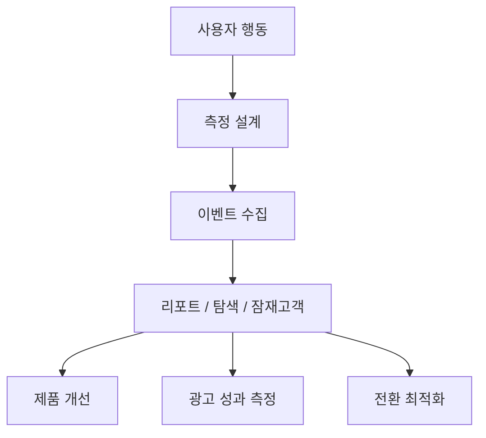

- GA와 GTM은 단순히 방문자 수를 보는 도구가 아니다.
- 실제로는 다음 질문에 답하기 위한 측정 인프라다.
  - 어떤 유입 경로가 회원가입으로 이어지는가?
  - 사용자가 어느 화면에서 이탈하는가?
  - 광고 클릭 이후 실제 구매나 리드 제출이 발생하는가?
  - 특정 버튼, 배너, 콘텐츠, 상품이 얼마나 클릭되는가?
  - 결제 funnel에서 어느 단계가 병목인가?
- GA4는 `event` 단위로 데이터를 수집하므로, 설계를 잘못하면 나중에 보고서가 애매해진다.
- GTM은 마케팅 태그를 빠르게 바꿀 수 있게 해 주지만, 관리 기준이 없으면 중복 발화, 개인정보 유출, 성능 저하가 발생할 수 있다.
- 따라서 실무에서는 "설치"보다 "이벤트 명세, 태그 발화 조건, 검증, 운영 규칙"이 더 중요하다.

---

## 3. 핵심 개념

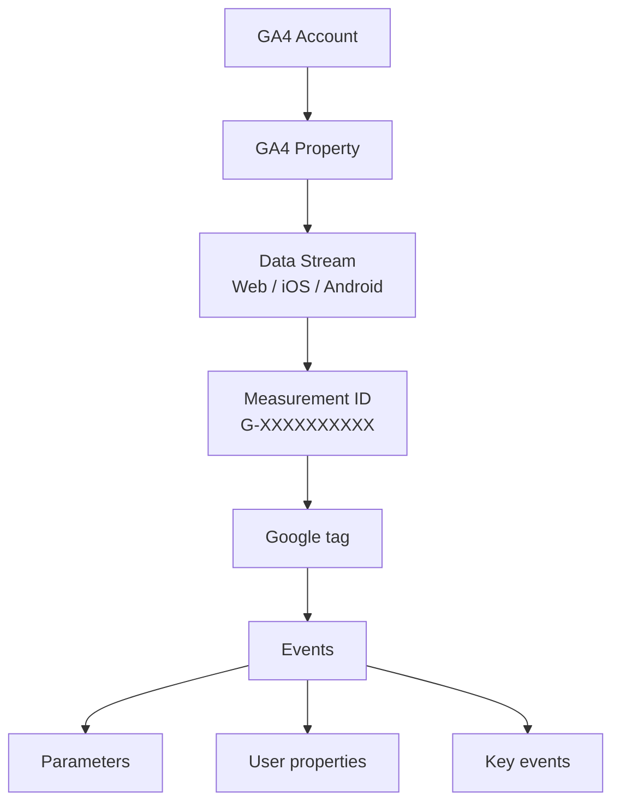

### 3.1 GA4

- `Google Analytics 4`는 Google Analytics의 현재 표준 버전이다.
- GA4의 데이터 모델은 `pageview/session` 중심이 아니라 `event` 중심이다.
- 거의 모든 행동은 이벤트로 표현된다.
  - 페이지 조회: `page_view`
  - 첫 방문: `first_visit`
  - 세션 시작: `session_start`
  - 스크롤: `scroll`
  - 링크 클릭: `click`
  - 구매: `purchase`
  - 회원가입: `sign_up`
  - 리드 생성: `generate_lead`
- 계층 구조:
  - `Account`: 조직 또는 회사 단위
  - `Property`: 분석 대상 서비스 단위
  - `Data stream`: 웹, iOS, Android 같은 데이터 입력 단위
  - `Measurement ID`: 웹 스트림 식별자, 보통 `G-`로 시작

### 3.2 Google tag와 gtag.js

- `Google tag`는 웹사이트에 설치하는 Google 측정 태그다.
- `gtag.js`는 Google tag를 코드에서 직접 다루는 JavaScript 프레임워크다.
- Google 공식 문서 기준으로 Google tag는 Google Analytics뿐 아니라 Google Ads 등 여러 Google 제품 목적지에 연결될 수 있다.
- 직접 설치 방식은 대략 다음 형태다.

```html
<!-- Google tag (gtag.js) -->
<script async src="https://www.googletagmanager.com/gtag/js?id=G-XXXXXXXXXX"></script>
<script>
  window.dataLayer = window.dataLayer || [];
  function gtag(){dataLayer.push(arguments);}
  gtag('js', new Date());

  gtag('config', 'G-XXXXXXXXXX');
</script>
```

- 이 방식은 단순하고 코드에서 명시적으로 관리하기 쉽다.
- 다만 마케팅 태그가 늘어나거나, 광고팀/마케팅팀이 태그를 자주 바꾸면 코드 배포가 계속 필요해진다.

### 3.3 GTM

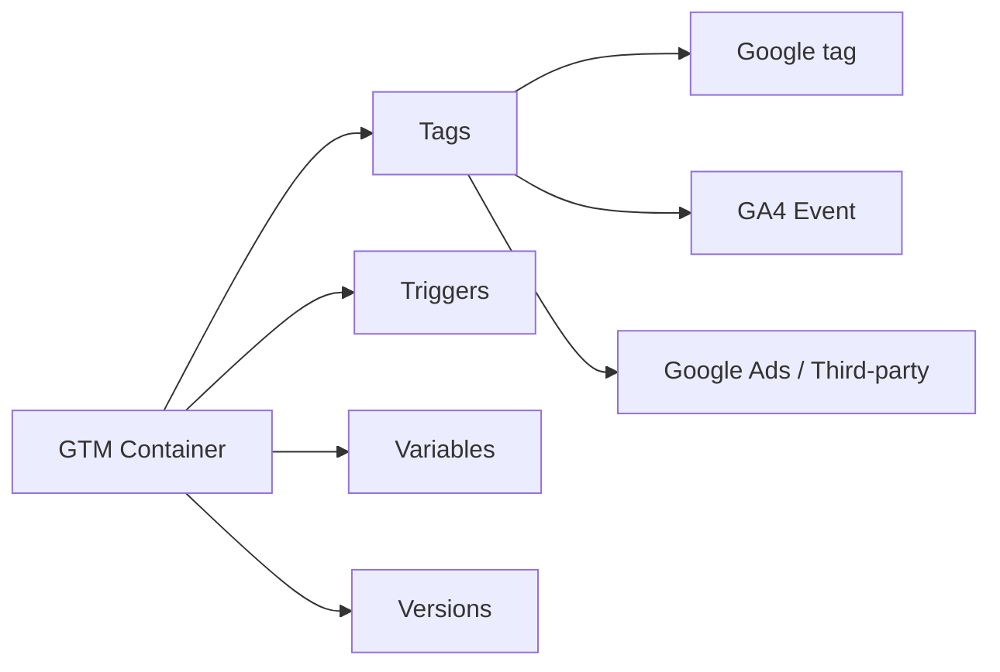

- `Google Tag Manager`는 태그 관리 시스템이다.
- 웹사이트에는 GTM container snippet만 심어두고, 실제 태그 설정은 GTM 콘솔에서 관리한다.
- GTM의 핵심 구성요소:
  - `Container`: 사이트나 앱에 설치되는 태그 관리 단위, ID는 `GTM-XXXXXXX` 형식
  - `Tag`: 실제 실행되는 코드 또는 템플릿, 예: `Google tag`, `GA4 Event`
  - `Trigger`: 태그가 실행될 조건, 예: All Pages, Click, Custom Event
  - `Variable`: 태그와 트리거에서 참조하는 값, 예: URL, Click Text, Data Layer Variable
  - `Workspace`: 변경 작업 공간
  - `Version`: 배포 이력
  - `Preview`: 배포 전 디버깅 모드

### 3.4 dataLayer

- `dataLayer`는 사이트 코드와 Google tag/GTM 사이에서 데이터를 주고받는 JavaScript 배열형 큐다.
- GTM은 `dataLayer`에 들어온 값을 읽어 변수로 쓰고, `event` 값을 기준으로 Custom Event Trigger를 실행할 수 있다.
- 대표 패턴:

```js
window.dataLayer = window.dataLayer || [];
window.dataLayer.push({
  event: 'sign_up',
  method: 'email',
  placement: 'footer'
});
```

- 중요한 규칙:
  - `window.dataLayer = window.dataLayer || []`를 먼저 선언한다.
  - 기존 `dataLayer`를 덮어쓰지 않는다.
  - GTM container보다 먼저 필요한 값은 container snippet보다 위에서 `push()`한다.
  - 이벤트명과 파라미터명은 대소문자까지 일관되게 유지한다.

### 3.5 주요 이벤트와 전환

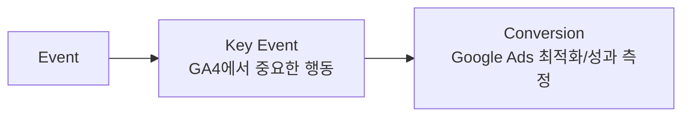

- GA4에서 비즈니스에 중요한 이벤트는 `Key event`, 즉 주요 이벤트로 표시한다.
- 예전 GA 문맥에서는 이걸 `conversion`이라고 부르는 경우가 많았지만, 현재 GA4에서는 개념이 나뉘었다.
- 현재 기준:
  - `Key event`: GA4 내부에서 중요한 사용자 행동
  - `Conversion`: Google Ads 성과 측정과 입찰 최적화에 쓰는 전환
- 예:
  - `generate_lead`를 GA4에서 주요 이벤트로 표시
  - Google Ads와 연결한 뒤 해당 주요 이벤트 기반 conversion 생성

---

## 4. GA 직접 설치와 GTM 설치 선택 기준

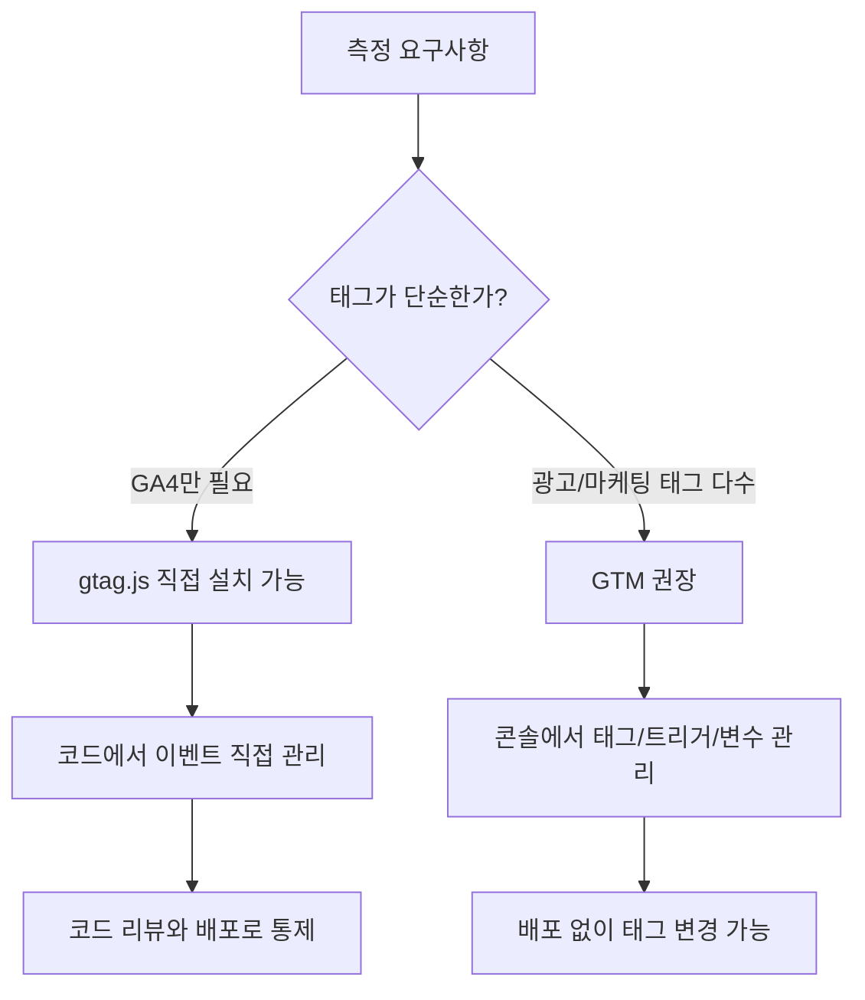

### 4.1 gtag.js 직접 설치가 맞는 경우

- GA4만 쓰고, 이벤트 수가 적다.
- 개발팀이 모든 측정 코드를 코드 리뷰로 관리하고 싶다.
- 외부 광고 태그나 픽셀이 거의 없다.
- 태그 변경 빈도가 낮다.
- CMS나 정적 사이트처럼 단순 삽입이 충분하다.

### 4.2 GTM이 맞는 경우

- GA4 외에 Google Ads, Floodlight, Meta Pixel, LinkedIn Insight Tag 등 여러 태그를 운영한다.
- 마케팅팀이 태그 발화 조건을 자주 바꾼다.
- 배포 없이 태그 설정을 수정해야 한다.
- click, form submit, custom event 등 다양한 trigger가 필요하다.
- dataLayer 기반 이벤트 명세를 만들어 개발/마케팅 역할을 분리하고 싶다.

### 4.3 절대 피해야 할 중복 구조

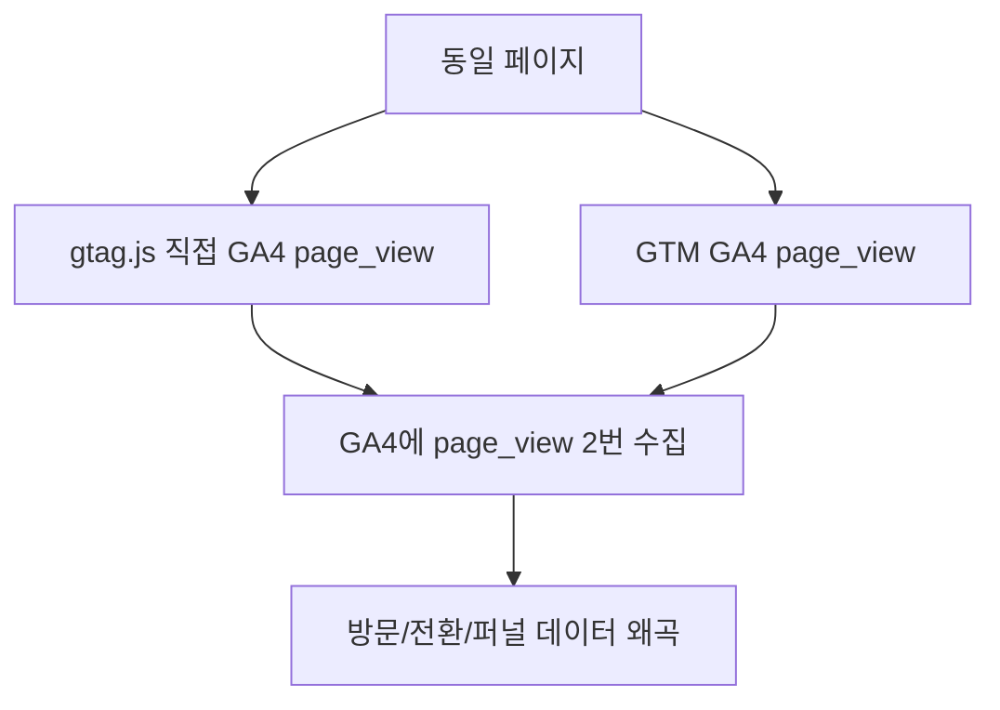

- 같은 GA4 Measurement ID에 대해 `gtag.js 직접 설치`와 `GTM GA4 태그`를 동시에 쓰면 중복 수집이 발생하기 쉽다.
- 마이그레이션 중이라면 임시로 둘 다 존재할 수 있지만, 같은 이벤트가 두 번 전송되지 않도록 설계해야 한다.
- Google 공식 문서도 GTM을 쓰는 경우 사이트에 별도 gtag.js snippet을 추가할 필요가 없다고 설명한다.
- 운영 기준:
  - `GTM 운영`이면 사이트에는 GTM container만 설치하고, GA4도 GTM에서 설정한다.
  - `gtag.js 운영`이면 GA4 이벤트는 코드에서 보내고 GTM을 섞지 않는다.
  - 예외가 필요하면 이벤트별 책임 경계를 문서화한다.

---

## 5. 코드 내부 설정 방법

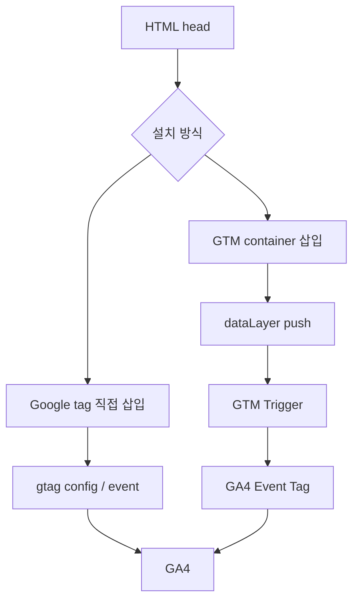

### 5.1 GA4를 gtag.js로 직접 설치

- GA4 콘솔에서 `Measurement ID`를 찾는다.
  - 경로: `Admin` -> `Property settings` -> `Data streams` -> 웹 스트림 선택 -> `Measurement ID`
- 모든 측정 대상 페이지의 `<head>` 시작 부분 가까이에 Google tag를 넣는다.
- 환경별 ID를 분리한다.
  - production: 실제 GA4 property 또는 stream
  - staging/dev: 별도 GA4 property 또는 debug 전용 property
  - local: 보통 비활성화하거나 debug mode만 사용

```html
<!-- production HTML head -->
<script async src="https://www.googletagmanager.com/gtag/js?id=G-XXXXXXXXXX"></script>
<script>
  window.dataLayer = window.dataLayer || [];
  function gtag(){dataLayer.push(arguments);}
  gtag('js', new Date());

  gtag('config', 'G-XXXXXXXXXX', {
    send_page_view: true
  });
</script>
```

- `send_page_view: true`는 기본 page view 수집을 명시적으로 보여주기 위한 예시다.
- SPA에서 route 변경마다 직접 page view를 보낼 계획이면 초기 자동 page view와 route page view 중복을 조심한다.

### 5.2 GTM container를 코드에 설치

- GTM 콘솔에서 container ID를 확인한다.
  - 형식: `GTM-XXXXXXX`
- 첫 번째 script는 `<head>`에 최대한 높게 넣는다.
- 두 번째 `noscript` iframe은 `<body>` 바로 다음에 넣는다.

```html
<!-- Google Tag Manager -->
<script>
(function(w,d,s,l,i){w[l]=w[l]||[];w[l].push({'gtm.start':
new Date().getTime(),event:'gtm.js'});var f=d.getElementsByTagName(s)[0],
j=d.createElement(s),dl=l!='dataLayer'?'&l='+l:'';j.async=true;j.src=
'https://www.googletagmanager.com/gtm.js?id='+i+dl;f.parentNode.insertBefore(j,f);
})(window,document,'script','dataLayer','GTM-XXXXXXX');
</script>
<!-- End Google Tag Manager -->
```

```html
<!-- Google Tag Manager (noscript) -->
<noscript>
  <iframe src="https://www.googletagmanager.com/ns.html?id=GTM-XXXXXXX"
    height="0" width="0" style="display:none;visibility:hidden"></iframe>
</noscript>
<!-- End Google Tag Manager (noscript) -->
```

- GTM을 쓰면 GA4 Google tag도 GTM 콘솔에서 만든다.
- 같은 페이지에 GA4용 gtag.js snippet을 또 넣지 않는 것이 기본 원칙이다.

### 5.3 GTM용 dataLayer 초기화

- GTM container보다 먼저 필요한 값은 container snippet보다 위에서 push한다.

```html
<script>
  window.dataLayer = window.dataLayer || [];
  window.dataLayer.push({
    event: 'page_context_ready',
    page_type: 'pricing',
    user_type: 'anonymous'
  });
</script>

<!-- Google Tag Manager snippet comes after this if these values are needed immediately -->
```

- GTM 콘솔에서는 `page_type`, `user_type`을 `Data Layer Variable`로 만든 뒤 태그 파라미터나 trigger 조건에 사용할 수 있다.

### 5.4 gtag.js에서 이벤트 보내기

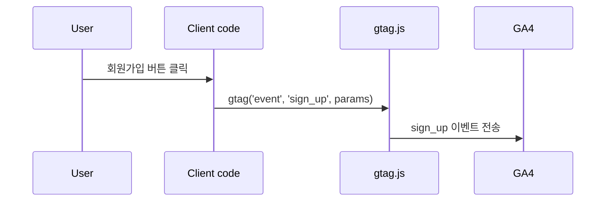

- Google 공식 문서의 기본 이벤트 전송 형태는 `gtag('event', event_name, parameters)`다.

```js
function trackSignup(method) {
  if (typeof gtag !== 'function') return;

  gtag('event', 'sign_up', {
    method,
    form_location: 'header'
  });
}
```

- 이벤트명은 가능하면 GA4 recommended event를 먼저 사용한다.
  - 회원가입: `sign_up`
  - 리드 생성: `generate_lead`
  - 검색: `search`
  - 공유: `share`
  - 구매: `purchase`
- recommended event에 정해진 파라미터가 있으면 그 이름을 그대로 쓰는 것이 리포트 호환성에 유리하다.

### 5.5 GTM에서 처리할 이벤트를 dataLayer로 보내기

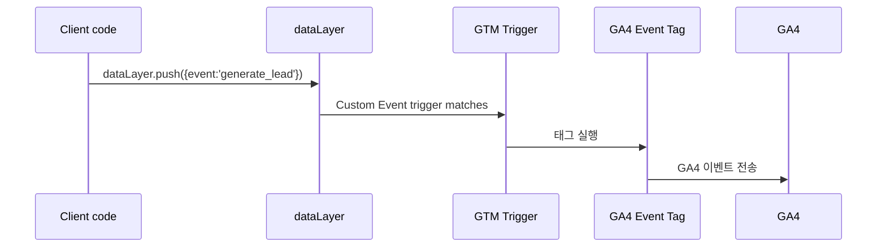

```js
window.dataLayer = window.dataLayer || [];

function trackLeadSubmit({ plan, source }) {
  window.dataLayer.push({
    event: 'generate_lead',
    lead_plan: plan,
    lead_source: source,
    form_location: 'pricing_page'
  });
}
```

- 코드에서는 "무슨 일이 일어났는지"만 보낸다.
- GTM 콘솔에서 할 일:
  - Custom Event Trigger 이름: `generate_lead`
  - Data Layer Variable:
    - `lead_plan`
    - `lead_source`
    - `form_location`
  - GA4 Event Tag:
    - Event Name: `generate_lead`
    - Event Parameters:
      - `lead_plan`: `{{DLV - lead_plan}}`
      - `lead_source`: `{{DLV - lead_source}}`
      - `form_location`: `{{DLV - form_location}}`

### 5.6 SPA 라우팅 page_view 처리

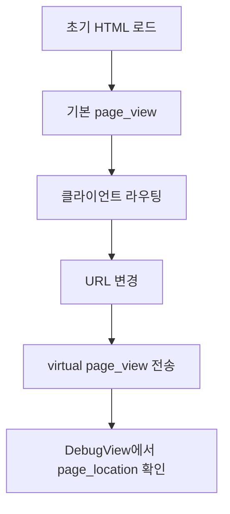

- React, Vue, Next.js, Nuxt 같은 SPA는 HTML 문서를 한 번만 로드하고 화면을 JavaScript로 바꾼다.
- 그래서 route 변경을 page view로 볼지 설계해야 한다.
- Google 공식 SPA 문서는 화면 전환마다 page view를 측정하고, referrer와 location을 정확히 관리해야 한다고 설명한다.

gtag.js 예시:

```js
let previousUrl = document.location.href;

function trackVirtualPageView(nextUrl, title = document.title) {
  if (typeof gtag !== 'function') return;

  gtag('event', 'page_view', {
    page_title: title,
    page_location: nextUrl,
    page_referrer: previousUrl
  });

  previousUrl = nextUrl;
}
```

GTM dataLayer 예시:

```js
let previousUrl = document.location.href;

function pushVirtualPageView(nextUrl, title = document.title) {
  window.dataLayer = window.dataLayer || [];
  window.dataLayer.push({
    event: 'virtual_page_view',
    page_title: title,
    page_location: nextUrl,
    page_referrer: previousUrl
  });

  previousUrl = nextUrl;
}
```

- GTM 콘솔에서는:
  - Trigger: Custom Event `virtual_page_view`
  - Tag: `Google Analytics: GA4 Event`
  - Event Name: `page_view`
  - Parameters: `page_title`, `page_location`, `page_referrer`
- 주의:
  - 초기 page_view와 route page_view가 중복되지 않게 한다.
  - modal, tab, accordion 같은 UI 변화까지 page_view로 볼지는 제품 분석 기준에 맞춰 정한다.

### 5.7 전자상거래 purchase 이벤트 예시

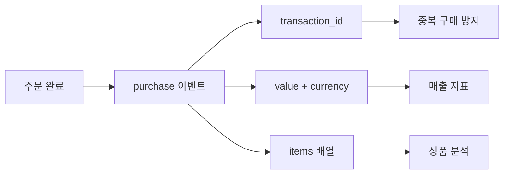

gtag.js 예시:

```js
gtag('event', 'purchase', {
  transaction_id: 'T_12345',
  value: 59000,
  currency: 'KRW',
  items: [
    {
      item_id: 'SKU_PRO_MONTHLY',
      item_name: 'Pro Monthly Plan',
      price: 59000,
      quantity: 1
    }
  ]
});
```

GTM dataLayer 예시:

```js
window.dataLayer.push({
  event: 'purchase',
  ecommerce: {
    transaction_id: 'T_12345',
    value: 59000,
    currency: 'KRW',
    items: [
      {
        item_id: 'SKU_PRO_MONTHLY',
        item_name: 'Pro Monthly Plan',
        price: 59000,
        quantity: 1
      }
    ]
  }
});
```

- `value`를 보내면 `currency`도 함께 보내는 것이 매출 지표 계산에 중요하다.
- `transaction_id`는 중복 구매 이벤트 검증과 분석에 중요하다.
- 결제 완료 페이지 새로고침, 뒤로가기, retry로 `purchase`가 중복 발화되지 않게 서버 주문 상태 또는 클라이언트 dedupe 처리를 둔다.

### 5.8 Consent Mode v2 코드 설정

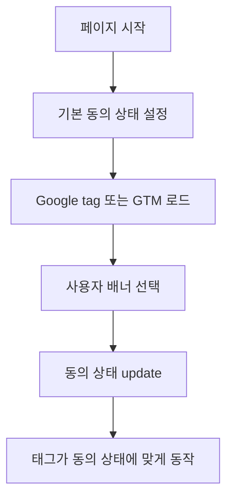

- Google Consent Mode는 쿠키/광고/분석 동의 상태에 따라 Google tag와 관련 태그의 동작을 조정하는 기능이다.
- 동의 배너 자체를 제공하는 기능은 아니다.
- 자체 CMP를 운영하거나 CMP 제품을 붙인 뒤, 그 선택 결과를 Google tag/GTM에 전달해야 한다.
- Consent Mode v2의 핵심 동의 타입:
  - `analytics_storage`: 분석용 쿠키 저장
  - `ad_storage`: 광고용 쿠키 저장
  - `ad_user_data`: 광고 목적 사용자 데이터 전송 동의
  - `ad_personalization`: 개인화 광고 동의
- 자체 구현에서 기본값을 먼저 설정할 때:

```html
<script>
  window.dataLayer = window.dataLayer || [];
  function gtag(){dataLayer.push(arguments);}

  gtag('consent', 'default', {
    ad_storage: 'denied',
    ad_user_data: 'denied',
    ad_personalization: 'denied',
    analytics_storage: 'denied',
    wait_for_update: 500
  });
</script>
```

- 사용자가 동의하면:

```js
function grantAllConsent() {
  gtag('consent', 'update', {
    ad_storage: 'granted',
    ad_user_data: 'granted',
    ad_personalization: 'granted',
    analytics_storage: 'granted'
  });
}
```

- 중요한 순서:
  - 기본 동의 상태는 Google tag 또는 GTM container가 실행되기 전에 설정한다.
  - 동의 변경은 사용자가 선택한 페이지에서 즉시 update한다.
  - GTM에서는 가능하면 CMP 템플릿 또는 Consent API 기반 템플릿을 사용한다.
  - GTM Custom HTML 태그로 consent 명령을 늦게 실행하는 방식은 피한다.
- 법적 동의 요건은 지역, 서비스, 데이터 처리 방식에 따라 달라지므로 법무/개인정보 담당자의 기준과 함께 결정해야 한다.

### 5.9 프레임워크별 구현 포인트

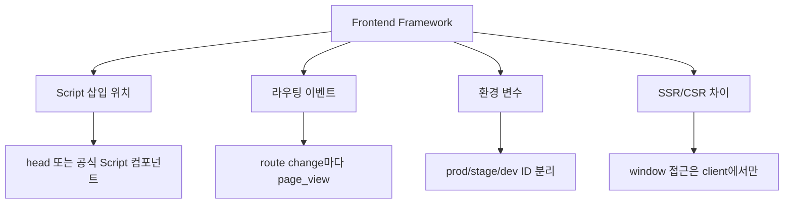

- React/Vue 일반 SPA:
  - 앱 진입점에서 GTM 또는 gtag script를 한 번만 삽입한다.
  - router hook에서 virtual page view를 보낸다.
  - component mount마다 태그를 다시 삽입하지 않는다.
- Next.js:
  - `next/script`를 사용해 script 로딩 전략을 명시한다.
  - App Router에서는 client component 또는 router 이벤트 감지 지점에서 page view를 보낸다.
  - 서버 컴포넌트에서 `window`, `dataLayer`, `gtag`를 직접 참조하지 않는다.
- Nuxt/Vue:
  - plugin 또는 app mounted 이후 client-only로 태그를 초기화한다.
  - route middleware/plugin에서 page view를 보낸다.
- 공통:
  - `NEXT_PUBLIC_GA_ID`, `PUBLIC_GTM_ID`처럼 브라우저 노출이 필요한 ID만 public env로 둔다.
  - API secret, server-side Measurement Protocol secret은 클라이언트에 노출하지 않는다.
  - localhost와 staging 데이터가 production GA4에 섞이지 않게 필터 또는 별도 property를 사용한다.

---

## 6. GA4 콘솔 설정 방법

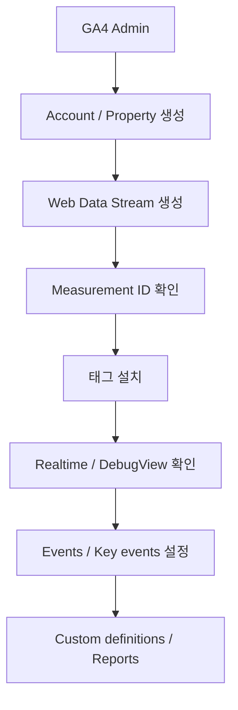

### 6.1 계정과 속성 생성

- 경로:
  - [Google Analytics](https://analytics.google.com/) 접속
  - `Admin`
  - `Create` 또는 `Create property`
- 권장 구조:
  - 회사/조직 단위로 `Account`
  - 서비스 또는 앱 단위로 `Property`
  - 웹/앱 플랫폼 단위로 `Data stream`
- 예:
  - Account: `Acme`
  - Property: `Acme Web`
  - Data streams:
    - `acme.com Web`
    - `Acme iOS`
    - `Acme Android`

### 6.2 Web Data Stream 생성

- 경로:
  - `Admin`
  - `Property settings`
  - `Data streams`
  - `Web`
  - 사이트 URL과 stream name 입력
- 생성 후 확인할 값:
  - `Measurement ID`: `G-XXXXXXXXXX`
  - `Stream ID`
  - `Tag instructions`
  - `Enhanced measurement`

### 6.3 Enhanced Measurement 설정

- `Enhanced measurement`는 웹 스트림에서 기본적으로 여러 행동을 자동 수집하는 기능이다.
- 보통 검토할 항목:
  - page views
  - scrolls
  - outbound clicks
  - site search
  - video engagement
  - file downloads
  - form interactions
- 실무 판단:
  - 자동 수집이 제품 분석 기준과 맞으면 사용한다.
  - 자동 수집과 커스텀 이벤트가 같은 행동을 동시에 잡으면 중복이 생길 수 있다.
  - form submit 자동 측정은 폼 구조에 따라 오탐이 있을 수 있으므로 DebugView로 확인한다.

### 6.4 이벤트 확인과 생성

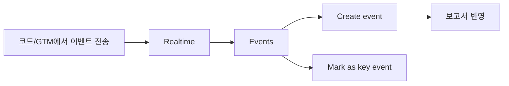

- 이벤트는 코드 또는 GTM에서 먼저 보내는 것이 가장 명확하다.
- GA4 콘솔에서도 기존 이벤트 조건을 기반으로 새 이벤트를 만들 수 있다.
- 예:
  - 모든 `page_view` 중 URL이 `/contact-us-submitted`인 경우만 `generate_lead`로 생성
- 경로:
  - `Admin`
  - `Data display`
  - `Events`
  - `+ Create event`
- 주의:
  - 콘솔에서 이벤트를 새로 만들면 개발 코드와 중복 설계가 생길 수 있다.
  - 누가 어떤 이벤트를 콘솔에서 생성했는지 changelog로 관리한다.

### 6.5 주요 이벤트 설정

- 경로:
  - `Admin`
  - `Data display`
  - `Events`
  - 이벤트 옆 star icon으로 주요 이벤트 표시
- 아직 수집되지 않은 새 이벤트도 미리 주요 이벤트로 등록할 수 있다.
- 주요 이벤트 후보:
  - `sign_up`
  - `login`
  - `generate_lead`
  - `purchase`
  - `subscribe`
  - `trial_start`
  - `contact_submit`
- 실무 기준:
  - 모든 클릭을 주요 이벤트로 만들지 않는다.
  - 비즈니스 성공에 직접 연결되는 행동만 주요 이벤트로 둔다.
  - page_view 전체를 주요 이벤트로 만드는 것은 대부분 잘못된 설정이다.

### 6.6 Google Ads conversion과 연결

- Google Ads 입찰/성과 측정에 쓰려면 GA4 주요 이벤트 기반 conversion을 만든다.
- 조건:
  - GA4와 Google Ads 계정 연결
  - 필요한 권한 보유
  - 광고 목적 데이터 처리와 동의 기준 검토
- 현재 개념 구분:
  - GA4 표준 리포트에서는 `Key event`
  - Google Ads 성과/입찰에서는 `Conversion`

### 6.7 맞춤 정의 설정

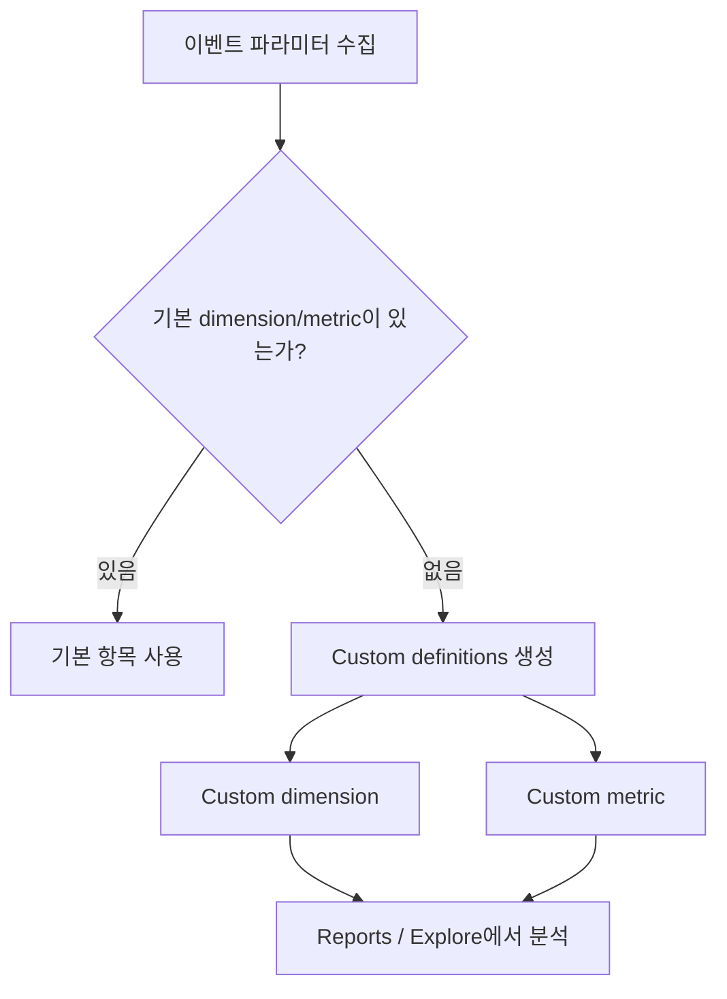

- GA4는 이벤트 파라미터를 받았다고 해서 모든 파라미터가 자동으로 표준 리포트 차원으로 보이는 것은 아니다.
- 커스텀 파라미터를 리포트에서 쓰려면 `Custom definitions`가 필요하다.
- 경로:
  - `Admin`
  - `Data display`
  - `Custom definitions`
  - `Create custom dimension` 또는 `Create custom metric`
- 예:
  - 코드에서 `form_location` 파라미터 전송
  - GA4 Custom dimension 생성:
    - Dimension name: `Form location`
    - Scope: `Event`
    - Event parameter: `form_location`
- 주의:
  - 기본 dimension/metric이 있으면 커스텀 정의를 만들지 않는 것이 좋다.
  - 생성 후 표준 리포트 반영까지 시간이 걸릴 수 있다.
  - 이름과 파라미터명은 변경 비용이 크므로 이벤트 명세 단계에서 확정한다.

### 6.8 DebugView와 Realtime

- Realtime:
  - 실제 이벤트 수집 여부를 빠르게 확인한다.
  - 경로: `Reports` -> `Realtime`
- DebugView:
  - 이벤트와 파라미터가 예상대로 들어오는지 더 세밀하게 본다.
  - 경로: `Admin` -> `Data display` -> `DebugView`
- DebugView 사용 방법:
  - Tag Assistant로 사이트 연결
  - GTM Preview mode 사용
  - 또는 개발 환경에서 `debug_mode: true`를 설정
- 주의:
  - DebugView용 traffic이 일반 리포트에 섞이지 않게 developer traffic 필터 전략을 검토한다.
  - consent mode에서 analytics consent가 거부된 상태면 DebugView에 기대한 이벤트가 보이지 않을 수 있다.

### 6.9 운영 설정 체크

- `Data retention` 기간 확인
- `Internal traffic` 필터 설정
- `Developer traffic` 필터 설정
- `Referral exclusion` 또는 unwanted referrals 확인
- `Cross-domain measurement` 필요 여부 확인
- `BigQuery Links` 필요 여부 확인
- `Google Ads Links` 필요 여부 확인
- 사용자 권한:
  - 개발자: 필요한 property 수준 권한
  - 마케팅 운영자: 태그/이벤트 관리 권한
  - 외부 대행사: 최소 권한 원칙

---

## 7. GTM 콘솔 설정 방법

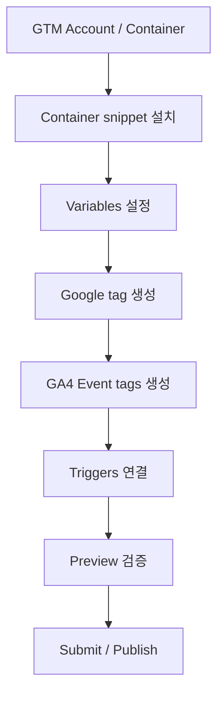

### 7.1 Account와 Container 생성

- 경로:
  - [Google Tag Manager](https://tagmanager.google.com/) 접속
  - `Create Account`
  - `Container name` 입력
  - Target platform: 보통 `Web`
- 생성 후 확인:
  - Container ID: `GTM-XXXXXXX`
  - 설치 snippet
  - Workspace

### 7.2 container snippet 설치 확인

- GTM 콘솔의 container ID를 클릭하면 설치 코드를 볼 수 있다.
- 설치 위치:
  - 첫 번째 script: `<head>`에 최대한 높게
  - `noscript`: `<body>` 바로 다음
- 배포 후 확인:
  - 페이지 source에 GTM ID가 있는가?
  - Network에서 `gtm.js?id=GTM-XXXXXXX`가 로드되는가?
  - Tag Assistant에서 container가 잡히는가?

### 7.3 기본 변수 활성화

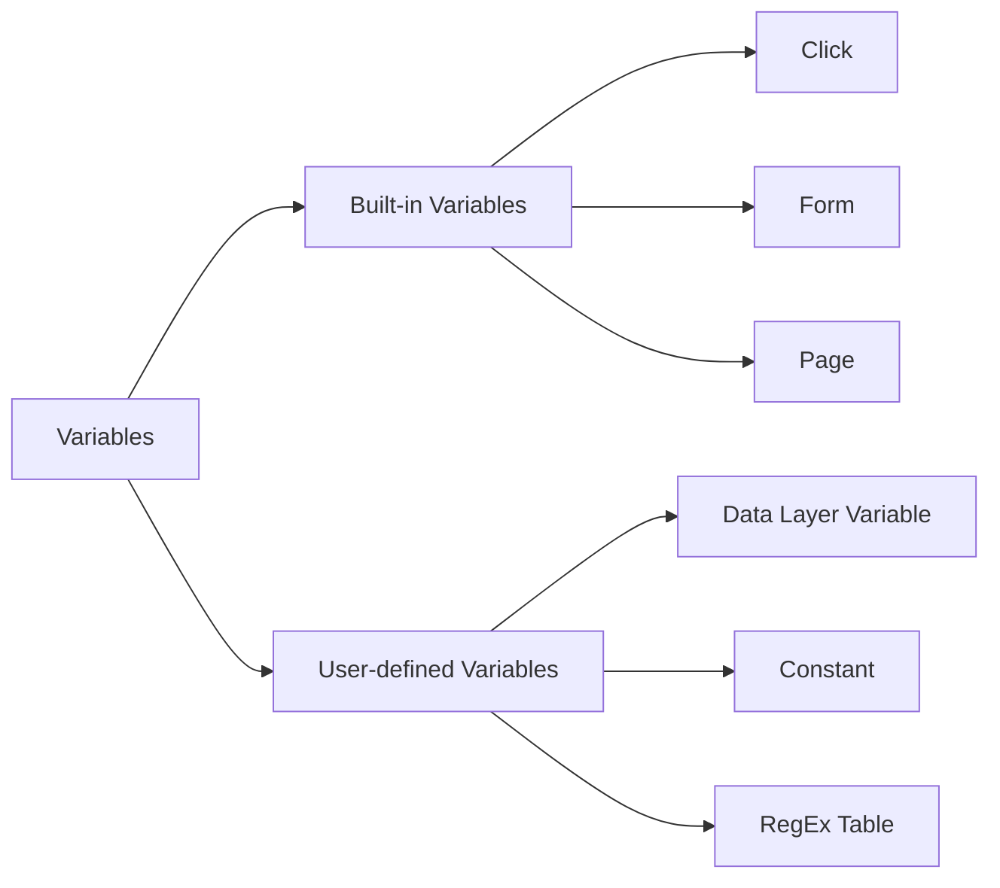

- 경로:
  - `Variables`
  - `Configure`
  - 필요한 built-in variables 체크
- 자주 쓰는 built-in variables:
  - `Page URL`
  - `Page Path`
  - `Page Hostname`
  - `Click Text`
  - `Click URL`
  - `Click Classes`
  - `Click ID`
  - `Form ID`
  - `Form Classes`
- 자주 쓰는 user-defined variables:
  - `Constant - GA4 Measurement ID`
  - `Data Layer Variable - lead_plan`
  - `Data Layer Variable - form_location`
  - `Lookup Table - hostname to measurement id`

### 7.4 Google tag 만들기

- 경로:
  - `Tags`
  - `New`
  - `Tag Configuration`
  - `Google tag`
- 설정:
  - Tag ID: `G-XXXXXXXXXX`
  - Trigger: `Initialization - All Pages`
- 이유:
  - Google tag는 다른 GA4 Event tag보다 먼저 초기화되는 것이 안정적이다.
  - GTM 공식 도움말도 Google tag trigger로 `Initialization - All pages` 사용을 안내한다.
- 이름 예:
  - `GA4 - Google tag - Production`

### 7.5 GA4 Event tag 만들기

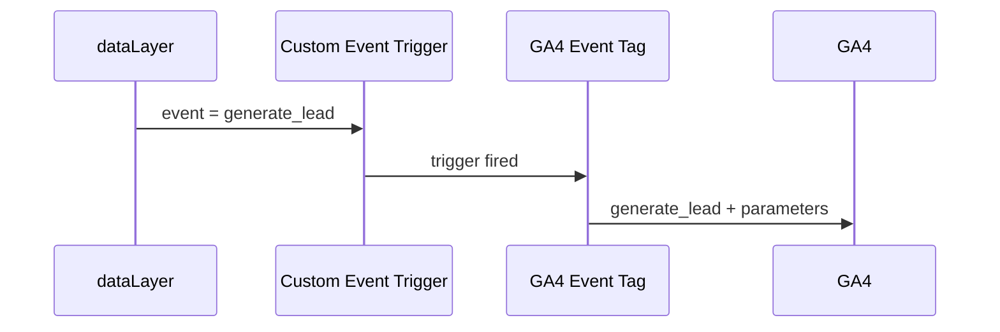

- 예: 회원가입 이벤트
- 경로:
  - `Tags`
  - `New`
  - `Tag Configuration`
  - `Google Analytics: GA4 Event`
- 설정:
  - Measurement ID: `G-XXXXXXXXXX` 또는 측정 ID 변수
  - Event Name: `sign_up`
  - Event Parameters:
    - `method`: `{{DLV - method}}`
    - `form_location`: `{{DLV - form_location}}`
  - Trigger: Custom Event `sign_up`
- 이름 예:
  - `GA4 Event - sign_up`

### 7.6 Custom Event Trigger 만들기

- 코드:

```js
window.dataLayer.push({
  event: 'sign_up',
  method: 'email',
  form_location: 'header'
});
```

- GTM 콘솔:
  - `Triggers`
  - `New`
  - `Trigger Configuration`
  - `Custom Event`
  - Event name: `sign_up`
  - This trigger fires on: `All Custom Events` 또는 조건 지정
- 조건을 추가하는 경우:
  - `form_location equals header`
  - `Page Path contains /pricing`
  - `method matches RegEx email|google|kakao`

### 7.7 Click Trigger로 이벤트 만들기

```mermaid
flowchart TD
    A["사용자 클릭"] --> B["Click Trigger"]
    B --> C{"조건 일치?"}
    C -->|"Yes"| D["GA4 Event Tag 실행"]
    C -->|"No"| E["무시"]
```

- 코드 수정 없이 버튼 클릭을 측정할 수 있다.
- 예:
  - Trigger type: `Click - All Elements`
  - This trigger fires on: `Some Clicks`
  - 조건: `Click Text contains Sign up`
- 단점:
  - 버튼 텍스트, CSS class, DOM 구조가 바뀌면 깨질 수 있다.
  - 다국어 서비스에서는 `Click Text` 의존이 위험하다.
- 더 안정적인 방식:
  - 코드에서 `dataLayer.push({ event: 'sign_up' })`
  - 또는 버튼에 안정적인 `data-analytics-id` 부여 후 변수로 읽기

### 7.8 Preview, Submit, Version 운영

- Preview:
  - `Preview` 클릭
  - 사이트 URL 입력
  - Tag Assistant 연결
  - 이벤트별로 어떤 태그가 fired/not fired 되었는지 확인
- 확인할 것:
  - Google tag가 먼저 실행되는가?
  - 원하는 custom event가 dataLayer에 들어오는가?
  - GA4 Event tag가 한 번만 실행되는가?
  - event parameters 값이 비어 있지 않은가?
  - consent 상태가 예상과 같은가?
- Publish:
  - `Submit`
  - `Publish and Create Version`
  - version name과 description 작성
- version description 예:
  - `Add GA4 generate_lead event for pricing form`
  - `Fix duplicate sign_up trigger on header CTA`
  - `Add consent checks for GA4 tags`

### 7.9 Consent 설정

- GTM에서 consent를 다룰 때는 가능한 CMP 템플릿을 사용한다.
- 직접 구현한다면 Tag Manager Consent APIs를 사용하는 템플릿 방식이 바람직하다.
- 태그별 확인:
  - `Advanced settings`
  - `Consent settings`
  - Built-in consent checks
  - Additional consent checks
- 운영 기준:
  - 동의 초기화 태그는 `Consent Initialization`에서 실행
  - 일반 태그는 consent 초기화 이후 실행
  - 광고 태그는 `ad_storage`, `ad_user_data`, `ad_personalization` 정책 확인
  - 분석 태그는 `analytics_storage` 정책 확인

---

## 8. 브라우저 콘솔, Tag Assistant, DebugView 검증 방법

```mermaid
flowchart TD
    A["검증 시작"] --> B["브라우저 DevTools"]
    A --> C["GTM Preview"]
    A --> D["Tag Assistant"]
    A --> E["GA4 Realtime"]
    A --> F["GA4 DebugView"]
    B --> G["script/network/dataLayer 확인"]
    C --> H["tag fired 여부 확인"]
    D --> I["Google tag 인식 확인"]
    E --> J["이벤트 수집 여부 확인"]
    F --> K["파라미터 단위 디버깅"]
```

### 8.1 브라우저 개발자 콘솔 확인

- GTM 설치 확인:

```js
window.dataLayer
```

- 최근 dataLayer 이벤트 확인:

```js
window.dataLayer?.slice(-10)
```

- 테스트 이벤트 push:

```js
window.dataLayer.push({
  event: 'debug_test',
  debug_value: 'manual_console'
});
```

- gtag 함수 존재 확인:

```js
typeof window.gtag
```

- 직접 이벤트 테스트:

```js
gtag('event', 'debug_test', {
  debug_value: 'manual_console',
  debug_mode: true
});
```

### 8.2 Network 탭 확인

- 확인할 요청:
  - GTM: `https://www.googletagmanager.com/gtm.js?id=GTM-...`
  - Google tag: `https://www.googletagmanager.com/gtag/js?id=G-...`
  - GA4 collect: `https://www.google-analytics.com/g/collect...`
- 확인 포인트:
  - 요청이 차단되지 않는가?
  - Measurement ID가 맞는가?
  - 이벤트명 파라미터가 예상과 같은가?
  - 브라우저 확장 프로그램이나 ad blocker 때문에 차단되지 않는가?

### 8.3 GTM Preview 확인

- GTM 콘솔에서 `Preview`
- 사이트 URL 입력 후 연결
- 왼쪽 이벤트 타임라인에서 확인:
  - `Consent Initialization`
  - `Initialization`
  - `Container Loaded`
  - `DOM Ready`
  - `Window Loaded`
  - custom event
- 각 이벤트에서 확인:
  - Tags Fired
  - Tags Not Fired
  - Variables
  - Data Layer
  - Consent

### 8.4 GA4 DebugView 확인

- Debug mode 활성화 방법:
  - Tag Assistant 연결
  - GTM Preview 사용
  - gtag config 또는 event에 `debug_mode: true`
- 예:

```js
gtag('config', 'G-XXXXXXXXXX', {
  debug_mode: true
});
```

- 특정 이벤트만 debug:

```js
gtag('event', 'generate_lead', {
  form_location: 'pricing',
  debug_mode: true
});
```

- DebugView에서 확인할 것:
  - 이벤트 이름
  - 파라미터 이름과 값
  - user properties
  - page_location
  - engagement timing
  - consent 상태 영향

### 8.5 Realtime 확인

- 경로:
  - GA4 -> `Reports` -> `Realtime`
- 확인:
  - 사용자 수
  - event count by event name
  - key events by event name
  - source/medium
- Realtime은 빠른 확인용이고, 파라미터 단위 세부 검증은 DebugView가 더 적합하다.

---

## 9. 이벤트 설계와 네이밍 규칙

```mermaid
flowchart TD
    A["측정하고 싶은 행동"] --> B{"GA4 추천 이벤트가 있는가?"}
    B -->|"있음"| C["추천 이벤트명 사용"]
    B -->|"없음"| D["custom event 설계"]
    C --> E["공식 파라미터 사용"]
    D --> F["snake_case 이름"]
    E --> G["이벤트 명세서 기록"]
    F --> G
```

### 9.1 이벤트명 규칙

- 가능하면 GA4 recommended event를 먼저 사용한다.
- custom event는 `snake_case`를 권장한다.
- 예:
  - 좋음: `pricing_cta_click`, `lead_form_submit`, `trial_start`
  - 나쁨: `Pricing CTA Click`, `click1`, `button_event`, `폼제출`
- 이벤트명에는 비즈니스 의미가 있어야 한다.
- 너무 세부적인 UI 위치를 이벤트명에 넣기보다 파라미터로 분리한다.
  - 나쁨: `header_pricing_red_button_click`
  - 좋음:
    - event: `cta_click`
    - params:
      - `cta_location: header`
      - `cta_variant: red`
      - `cta_text: Start trial`

### 9.2 파라미터명 규칙

- `snake_case`로 통일한다.
- 기본 파라미터와 충돌하지 않게 한다.
- 민감정보를 보내지 않는다.
  - 이메일
  - 전화번호
  - 이름
  - 주민등록번호
  - 주소
  - 비밀번호
  - raw user id
- ID가 필요하면 내부 정책에 맞는 비식별 ID를 검토한다.

### 9.3 이벤트 명세서 예시

| 이벤트명 | 발생 시점 | 주요 파라미터 | 주요 이벤트 여부 | 구현 위치 |
|---|---|---|---|---|
| `sign_up` | 회원가입 완료 | `method`, `form_location` | 예 | app code -> dataLayer |
| `generate_lead` | 리드 폼 제출 성공 | `lead_type`, `lead_plan`, `form_location` | 예 | app code -> dataLayer |
| `cta_click` | 주요 CTA 클릭 | `cta_id`, `cta_location`, `cta_text` | 아니오 | GTM or app code |
| `purchase` | 결제 성공 | `transaction_id`, `value`, `currency`, `items` | 예 | server-confirmed client event |

### 9.4 이벤트 수집 기준

- 실패한 요청과 성공한 요청을 구분한다.
  - 폼 submit 버튼 클릭: `lead_form_click`
  - 서버 저장 성공: `generate_lead`
- 비즈니스 성과 이벤트는 서버 성공 이후 보내는 것이 정확하다.
- 단순 클릭 이벤트를 전환으로 쓰면 광고 최적화가 왜곡될 수 있다.
- purchase 같은 매출 이벤트는 주문 확정 기준을 명확히 한다.

---

## 10. 실전 설정 예시: 리드 폼 제출 측정

```mermaid
flowchart TD
    A["사용자 폼 입력"] --> B["Submit 클릭"]
    B --> C["API 요청"]
    C --> D{"서버 저장 성공?"}
    D -->|"No"| E["에러 표시\n전환 이벤트 보내지 않음"]
    D -->|"Yes"| F["dataLayer.push generate_lead"]
    F --> G["GTM GA4 Event tag"]
    G --> H["GA4 generate_lead"]
    H --> I["Key event"]
```

### 10.1 코드 구현

```js
async function submitLeadForm(formValues) {
  const response = await fetch('/api/leads', {
    method: 'POST',
    headers: { 'Content-Type': 'application/json' },
    body: JSON.stringify(formValues)
  });

  if (!response.ok) {
    throw new Error('Lead submit failed');
  }

  const result = await response.json();

  window.dataLayer = window.dataLayer || [];
  window.dataLayer.push({
    event: 'generate_lead',
    lead_type: result.leadType,
    lead_plan: result.plan,
    form_location: 'pricing_page'
  });

  return result;
}
```

- 개인정보 주의:
  - `email`, `phone`, `name`, 문의 내용 원문은 GA4/GTM으로 보내지 않는다.
  - 리드 유형, 플랜, 위치처럼 분석에 필요한 비식별 값만 보낸다.

### 10.2 GTM 콘솔 설정

- Variables:
  - `DLV - lead_type`
    - Variable Type: `Data Layer Variable`
    - Data Layer Variable Name: `lead_type`
  - `DLV - lead_plan`
    - Name: `lead_plan`
  - `DLV - form_location`
    - Name: `form_location`
- Trigger:
  - Type: `Custom Event`
  - Event name: `generate_lead`
- Tag:
  - Type: `Google Analytics: GA4 Event`
  - Measurement ID: `{{Constant - GA4 Measurement ID}}`
  - Event Name: `generate_lead`
  - Event Parameters:
    - `lead_type`: `{{DLV - lead_type}}`
    - `lead_plan`: `{{DLV - lead_plan}}`
    - `form_location`: `{{DLV - form_location}}`
  - Trigger: `CE - generate_lead`

### 10.3 GA4 콘솔 설정

- `Reports` -> `Realtime`에서 `generate_lead` 수집 확인
- `Admin` -> `Data display` -> `Events`에서 `generate_lead` 확인
- star icon으로 주요 이벤트 표시
- `Admin` -> `Data display` -> `Custom definitions`에서 event-scoped custom dimensions 생성:
  - `Lead type` -> event parameter `lead_type`
  - `Lead plan` -> event parameter `lead_plan`
  - `Form location` -> event parameter `form_location`
- Google Ads 최적화에 사용할 경우:
  - GA4와 Google Ads 연결
  - `generate_lead` 주요 이벤트 기반 conversion 생성

### 10.4 검증 시나리오

- 정상 제출:
  - dataLayer에 `generate_lead`가 한 번만 들어온다.
  - GTM Preview에서 GA4 Event tag가 한 번만 fired 된다.
  - DebugView에서 파라미터가 비어 있지 않다.
- 실패 제출:
  - 서버 에러 시 `generate_lead`가 발생하지 않는다.
- 중복 제출:
  - 더블 클릭, 새로고침, 뒤로가기로 중복 이벤트가 생기지 않는다.
- consent 거부:
  - 회사 정책과 지역 요건에 맞게 태그 동작이 제한된다.

---

## 11. 흔한 실수와 운영 체크리스트

```mermaid
flowchart TD
    A["문제 발생"] --> B{"데이터가 안 들어옴"}
    A --> C{"데이터가 너무 많음"}
    A --> D{"파라미터가 안 보임"}
    B --> E["ID/설치/동의/차단 확인"]
    C --> F["중복 태그/중복 trigger 확인"]
    D --> G["Custom definitions 확인"]
```

### 11.1 흔한 실수

- 같은 페이지에 `gtag.js`와 GTM GA4 tag를 동시에 설치해서 page_view가 두 번 잡힘
- GTM container snippet을 `<body>` 하단에 넣어서 초기 이벤트를 놓침
- `window.dataLayer = []`로 기존 dataLayer를 덮어씀
- dataLayer event 이름과 GTM Custom Event Trigger 이름이 다름
- 이벤트명 대소문자가 섞임
  - `sign_up`
  - `Sign_Up`
  - `signup`
- DebugView에는 보이는데 표준 리포트에는 바로 안 보인다고 오해함
- event parameter를 보냈지만 custom definition을 만들지 않아서 리포트에서 못 씀
- click text 기반 trigger가 다국어/디자인 변경으로 깨짐
- purchase 이벤트가 결제 완료 페이지 새로고침마다 반복 발화됨
- 개인정보를 event parameter로 보냄
- consent 기본값이 tag 실행 후에 설정됨
- staging/local 데이터가 production property에 섞임

### 11.2 배포 전 체크리스트

- GA4 Measurement ID가 올바른가?
- GTM Container ID가 올바른가?
- production/staging/dev ID가 분리되어 있는가?
- Google tag가 한 번만 설치되어 있는가?
- page_view가 중복되지 않는가?
- 주요 custom event가 한 번만 발화되는가?
- DebugView에서 event parameter가 예상대로 보이는가?
- 필요한 custom definitions를 만들었는가?
- 주요 이벤트로 표시할 이벤트가 맞는가?
- 광고 전환으로 쓸 이벤트가 진짜 비즈니스 성과인가?
- 개인정보가 GA/GTM으로 전송되지 않는가?
- consent mode 순서가 맞는가?
- GTM version name/description이 남아 있는가?

### 11.3 운영 원칙

- 이벤트 명세서를 먼저 만들고 구현한다.
- 코드 이벤트와 GTM click trigger를 섞을 때 책임 경계를 문서화한다.
- 중요한 전환은 "사용자 클릭"이 아니라 "서버 성공" 기준으로 잡는다.
- 모든 GTM 변경은 Preview로 검증한 뒤 Publish한다.
- GTM Publish 권한은 최소 인원에게만 준다.
- 광고 대행사에 권한을 줄 때도 최소 권한과 변경 이력 확인을 유지한다.
- 정기적으로 Events 목록을 보고 죽은 이벤트, 중복 이벤트, 의미 없는 이벤트를 정리한다.

---

## 12. 빠른 용어 정리

```mermaid
mindmap
  root((GA/GTM))
    GA4
      Property
      Data Stream
      Event
      Parameter
      Key Event
    Google tag
      gtag.js
      Measurement ID
      Destinations
    GTM
      Container
      Tag
      Trigger
      Variable
      Preview
    dataLayer
      push
      event
      Data Layer Variable
```

- `GA4`: Google Analytics 4. 이벤트 기반 분석 도구.
- `GTM`: Google Tag Manager. 태그를 코드 배포 없이 관리하는 도구.
- `Google tag`: Google 제품에 데이터를 보내는 공통 태그.
- `gtag.js`: Google tag를 직접 코드로 다루는 JavaScript API.
- `Measurement ID`: GA4 웹 스트림 식별자. 보통 `G-`로 시작.
- `Container ID`: GTM container 식별자. `GTM-`으로 시작.
- `Tag`: GTM에서 실행되는 측정/광고 코드 단위.
- `Trigger`: tag가 실행되는 조건.
- `Variable`: tag와 trigger에서 참조하는 값.
- `dataLayer`: 코드와 GTM 사이의 이벤트/데이터 큐.
- `Event`: 사용자 행동이나 시스템 사건.
- `Event parameter`: 이벤트의 상세 정보.
- `User property`: 사용자 단위 속성.
- `Key event`: GA4에서 중요한 이벤트.
- `Conversion`: Google Ads 성과 측정/입찰 최적화에 쓰는 전환.
- `DebugView`: GA4 이벤트를 실시간 디버깅하는 화면.
- `Tag Assistant`: Google tag/GTM 디버깅 도구.
- `Consent Mode`: 사용자 동의 상태에 따라 태그 동작을 조정하는 기능.

---

## 13. 참고 링크

- [Google Developers - Set up the Google tag with gtag.js](https://developers.google.com/tag-platform/gtagjs)
- [Google Developers - Tagging for Google Analytics](https://developers.google.com/analytics/devguides/collection/ga4/tag-options)
- [Google Analytics Help - Find your Google tag ID](https://support.google.com/analytics/answer/9539598?hl=en)
- [Google Analytics Help - Set up your Google tag across your Google accounts](https://support.google.com/analytics/answer/12002338?hl=en)
- [Google Tag Manager Help - Install a web container](https://support.google.com/tagmanager/answer/14847097?hl=en)
- [Google Tag Manager Help - Set up your Google tag in Google Tag Manager](https://support.google.com/tagmanager/answer/15756616?hl=en)
- [Google Developers - The data layer](https://developers.google.com/tag-platform/tag-manager/datalayer)
- [Google Developers - Set up GA4 events](https://developers.google.com/analytics/devguides/collection/ga4/events)
- [Google Developers - Set up event parameters](https://developers.google.com/analytics/devguides/collection/ga4/event-parameters)
- [Google Developers - Recommended events](https://developers.google.com/analytics/devguides/collection/ga4/reference/events)
- [Google Developers - Measure single-page applications](https://developers.google.com/analytics/devguides/collection/ga4/single-page-applications)
- [Google Analytics Help - Mark events as key events](https://support.google.com/analytics/answer/13128484?hl=en)
- [Google Analytics Help - Conversions vs. key events](https://support.google.com/analytics/answer/13965727?hl=en)
- [Google Analytics Help - Create event-scoped custom dimensions](https://support.google.com/analytics/answer/14239696?hl=en)
- [Google Analytics Help - Monitor events in DebugView](https://support.google.com/analytics/answer/7201382?hl=en)
- [Google Developers - Set up consent mode on websites](https://developers.google.com/tag-platform/security/guides/consent)
- [Google Developers - Consent mode overview](https://developers.google.com/tag-platform/security/concepts/consent-mode)

<!-- study-links:start -->
## 관련 문서

- `react`: [[react/react|React 상세 정리]]
- `분석 도구`: [[정보처리기사/2과목 소프트웨어 개발/094 소스 코드 품질 분석 도구 - 정적 분석 도구/094 소스 코드 품질 분석 도구 - 정적 분석 도구|094 소스 코드 품질 분석 도구 - 정적 분석 도구]]
- `css`: [[tailwindcss/tailwindcss|Tailwind CSS 상세 정리]]
- `트리거`: [[정보처리기사/3과목 데이터베이스 구축/158 트리거(Trigger)/158 트리거(Trigger)|158 트리거(Trigger)]]
<!-- study-links:end -->
