# Google Analytics API 상세 정리

작성 기준일: 2026-05-07  
조사 방식: 웹 검색 기반 최신 조사, Google 공식 문서 우선 사용  
범위: `GA API`를 현재 표준인 `Google Analytics 4`, 즉 `GA4` API 생태계로 해석한다.

---

## 1. 한 줄 요약

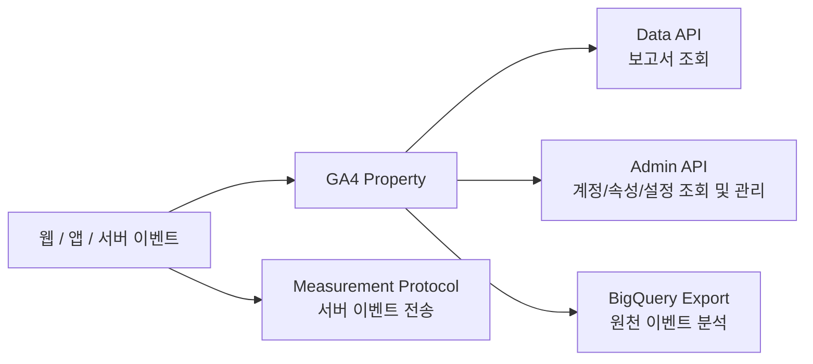

- `GA API`라고 부를 때 실무에서 가장 많이 쓰는 것은 `Google Analytics Data API`다.
- `Data API`는 GA4에 쌓인 데이터를 `dimension + metric` 테이블 형태로 조회한다.
- 응답은 대체로 다음 구조다.
  - `dimensionHeaders`: 차원 컬럼 설명
  - `metricHeaders`: 지표 컬럼 설명 및 타입
  - `rows`: 각 행의 `dimensionValues`, `metricValues`
  - `rowCount`: 전체 결과 행 수
  - `metadata`: 샘플링, thresholding, 통화, 타임존, 제한 정보
  - `propertyQuota`: 해당 요청 후 quota 상태
- `Admin API`는 보고서 값이 아니라 `계정, 속성, 데이터 스트림, 맞춤 정의, 주요 이벤트, 연결 설정` 같은 설정 정보를 다룬다.
- `Measurement Protocol`은 데이터를 가져오는 API가 아니라 서버/오프라인 이벤트를 GA4로 보내는 API다.
- `BigQuery Export`는 API 응답 테이블이 아니라 GA4 원천 이벤트를
  BigQuery 테이블로 내보내는 기능이다.
  개별 이벤트 수준 분석이 필요하면 Data API보다 BigQuery Export를 봐야 한다.
- 결론:
  - 대시보드/리포트 자동화 = `Data API`
  - GA 계정/속성 인벤토리 = `Admin API`
  - 서버 이벤트 수집 = `Measurement Protocol`
  - 원천 이벤트/유저 단위 분석 = `BigQuery Export`

---

## 2. GA API 지형

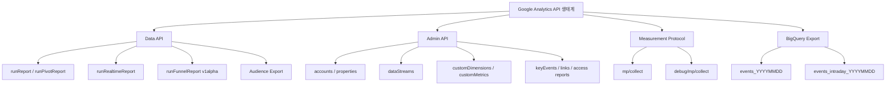

- `Data API`
  - 목적: GA4 리포트 데이터를 프로그램으로 조회한다.
  - 기본 endpoint: `https://analyticsdata.googleapis.com`
  - 대표 메서드:
    - `runReport`: 일반 보고서 조회
    - `batchRunReports`: 여러 일반 보고서 일괄 조회
    - `runPivotReport`: 피벗 보고서 조회
    - `runRealtimeReport`: 실시간 보고서 조회
    - `getMetadata`: 사용 가능한 dimension/metric/comparison 메타데이터 조회
    - `checkCompatibility`: dimension/metric 조합 가능 여부 확인
    - `audienceExports.create/get/list/query`: 오디언스 사용자 export 생성 및 조회
    - `runFunnelReport`: 퍼널 보고서 조회. 현재 `v1alpha`이며 breaking change 가능성을 전제로 봐야 한다.
- `Admin API`
  - 목적: GA4 설정과 계정 구조를 조회/관리한다.
  - 기본 endpoint: `https://analyticsadmin.googleapis.com`
  - 대표 리소스:
    - `accounts`, `accountSummaries`
    - `properties`
    - `properties.dataStreams`
    - `properties.customDimensions`
    - `properties.customMetrics`
    - `properties.keyEvents`
    - `properties.googleAdsLinks`, `properties.firebaseLinks`, `properties.bigQueryLinks`
    - `runAccessReport`, `searchChangeHistoryEvents`
- `Measurement Protocol`
  - 목적: 서버나 오프라인 환경에서 이벤트를 GA4로 전송한다.
  - 일반 endpoint:
    - `https://www.google-analytics.com/mp/collect`
    - EU 수집 endpoint: `https://region1.google-analytics.com/mp/collect`
  - 검증 endpoint:
    - `https://www.google-analytics.com/debug/mp/collect`
  - 중요한 차이:
    - 일반 수집 endpoint는 HTTP 요청을 받으면 보통 `2xx`만 반환한다.
    - payload가 잘못되어도 일반 endpoint가 상세 오류를 JSON으로 알려주지 않을 수 있다.
    - 상세 검증은 `debug/mp/collect`를 써야 한다.
- `BigQuery Export`
  - 목적: GA4 데이터를 BigQuery dataset/table로 내보낸다.
  - 대표 테이블:
    - `analytics_<property_id>.events_YYYYMMDD`
    - `analytics_<property_id>.events_intraday_YYYYMMDD`
  - 활용:
    - raw event, event parameter, item array, user pseudo id, timestamp,
      traffic source 등 더 세밀한 분석
    - Data API의 집계 테이블로는 어려운 event-level 분석

---

## 3. 인증, 권한, 기본 호출 구조

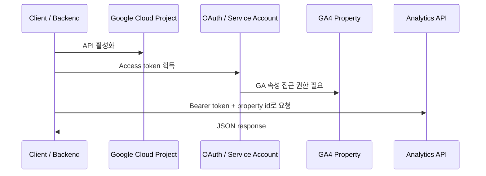

- 선행 조건:
  - Google Cloud 프로젝트에서 필요한 API를 활성화한다.
    - Data API: Google Analytics Data API
    - Admin API: Google Analytics Admin API
  - OAuth 사용자 계정 또는 서비스 계정으로 인증한다.
  - 인증 주체가 GA4 account/property에 실제 권한을 가져야 한다.
    - 서비스 계정은 GCP IAM 권한만으로 충분하지 않다.
    - GA4 UI에서 해당 서비스 계정 이메일에 property 접근 권한을 부여해야 한다.
- 주요 OAuth scope:
  - `https://www.googleapis.com/auth/analytics.readonly`
    - GA 데이터 조회, 다운로드
    - Data API 보고서 조회의 일반적인 최소 권한
  - `https://www.googleapis.com/auth/analytics`
    - GA 데이터 조회 및 관리
  - `https://www.googleapis.com/auth/analytics.edit`
    - Admin API에서 관리 엔티티 수정
  - `https://www.googleapis.com/auth/analytics.manage.users.readonly`
    - 사용자 권한 조회
  - `https://www.googleapis.com/auth/analytics.manage.users`
    - 사용자 권한 관리
- 기본 REST 호출 모양:

```http
POST https://analyticsdata.googleapis.com/v1beta/properties/123456789:runReport
Authorization: Bearer ACCESS_TOKEN
Content-Type: application/json

{
  "dateRanges": [
    { "startDate": "2026-04-01", "endDate": "2026-04-30" }
  ],
  "dimensions": [
    { "name": "sessionDefaultChannelGroup" }
  ],
  "metrics": [
    { "name": "sessions" },
    { "name": "activeUsers" }
  ]
}
```

- `property` path는 `properties/{property_id}` 형식이다.
- 웹 스트림의 `G-XXXXXXXXXX` Measurement ID와 GA4 Property ID는 다르다.
  - `G-...`: 웹 데이터 스트림의 Measurement ID
  - `properties/1234`: Data API/Admin API가 쓰는 Property ID
- API key는 주로 호출 프로젝트 식별과 quota/billing 연결에 쓰인다.
  GA4 property 데이터 조회 권한 자체를 대체하지 않는다고 보는 편이 안전하다.

---

## 4. Data API `runReport` 요청 구조

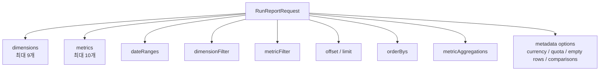

- `runReport`는 GA4 event data를 요청한 dimension/metric 컬럼으로 집계한 테이블을 반환한다.
- HTTP:
  - `POST https://analyticsdata.googleapis.com/v1beta/{property=properties/*}:runReport`
- 핵심 request body:
  - `dimensions[]`
    - 조회할 차원 컬럼
    - 예: `date`, `country`, `eventName`, `pageTitle`, `sessionSourceMedium`
    - 요청당 최대 9개
  - `metrics[]`
    - 조회할 수치 컬럼
    - 예: `activeUsers`, `sessions`, `eventCount`, `purchaseRevenue`
    - 요청당 최대 10개
  - `dateRanges[]`
    - 조회 기간
    - 여러 기간을 넣으면 응답 row에 `dateRange` 개념이 추가된다.
  - `dimensionFilter`
    - 집계 전 dimension 조건
    - SQL로 치면 `WHERE`에 가깝다.
    - metric은 여기서 사용할 수 없다.
  - `metricFilter`
    - 집계 후 metric 조건
    - SQL로 치면 `HAVING`에 가깝다.
    - dimension은 여기서 사용할 수 없다.
  - `offset`, `limit`
    - pagination
    - `limit` 미지정 시 기본 10,000 rows
    - 요청당 최대 250,000 rows
  - `metricAggregations`
    - `TOTAL`, `MINIMUM`, `MAXIMUM` 같은 집계 행 요청
  - `orderBys`
    - 정렬 조건
  - `currencyCode`
    - 통화 metric 표시 기준
    - 비우면 property 기본 통화 사용
  - `cohortSpec`
    - cohort report 요청
  - `keepEmptyRows`
    - metric이 모두 0인 row 반환 여부
    - 단, GA4 property에 실제로 기록된 적 없는 조합은 0 row로 생성되지 않는다.
  - `returnPropertyQuota`
    - true면 response에 quota 상태 포함
  - `comparisons`
    - GA UI comparison과 유사한 비교 컬럼 요청

### 기본 요청 예시

```json
{
  "dateRanges": [
    {
      "startDate": "2026-04-01",
      "endDate": "2026-04-30"
    }
  ],
  "dimensions": [
    { "name": "date" },
    { "name": "sessionDefaultChannelGroup" },
    { "name": "deviceCategory" }
  ],
  "metrics": [
    { "name": "sessions" },
    { "name": "activeUsers" },
    { "name": "eventCount" },
    { "name": "keyEvents" }
  ],
  "dimensionFilter": {
    "filter": {
      "fieldName": "country",
      "stringFilter": {
        "matchType": "EXACT",
        "value": "South Korea"
      }
    }
  },
  "orderBys": [
    {
      "metric": { "metricName": "sessions" },
      "desc": true
    }
  ],
  "limit": "1000",
  "returnPropertyQuota": true
}
```

- 이 요청이 의미하는 것:
  - 2026-04-01부터 2026-04-30까지
  - 한국 사용자만
  - 날짜, 기본 채널 그룹, 디바이스별로
  - 세션, 활성 사용자, 이벤트 수, 주요 이벤트 수를
  - 세션 내림차순으로 최대 1,000행 조회한다.

---

## 5. Data API 응답 구조

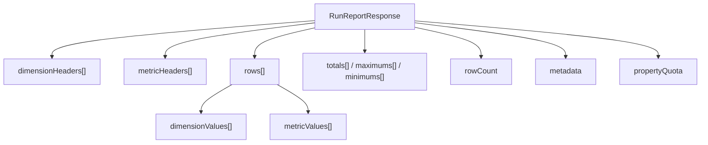

- `RunReportResponse`는 요청에 대응하는 보고서 테이블이다.
- 응답의 주요 필드:
  - `dimensionHeaders[]`
    - dimension 컬럼 이름과 순서
    - `rows[].dimensionValues[]`와 같은 순서로 매핑된다.
  - `metricHeaders[]`
    - metric 컬럼 이름과 타입
    - `rows[].metricValues[]`와 같은 순서로 매핑된다.
  - `rows[]`
    - 실제 데이터 행
    - 각 행은 `dimensionValues[]`, `metricValues[]`를 가진다.
  - `totals[]`
    - 요청한 경우 metric 합계 행
  - `maximums[]`
    - 요청한 경우 metric 최대값 행
  - `minimums[]`
    - 요청한 경우 metric 최소값 행
  - `rowCount`
    - 전체 query 결과 행 수
    - 현재 response에 포함된 행 수와 다를 수 있다.
    - 예: 전체 175행인데 `limit=50`이면 response rows는 50개, `rowCount=175`
  - `metadata`
    - report 해석에 필요한 부가 정보
  - `propertyQuota`
    - `returnPropertyQuota=true`일 때 quota 상태
  - `kind`
    - 응답 종류 식별자
    - `analyticsData#runReport`

### 응답 예시

```json
{
  "dimensionHeaders": [
    { "name": "date" },
    { "name": "sessionDefaultChannelGroup" },
    { "name": "deviceCategory" }
  ],
  "metricHeaders": [
    { "name": "sessions", "type": "TYPE_INTEGER" },
    { "name": "activeUsers", "type": "TYPE_INTEGER" },
    { "name": "eventCount", "type": "TYPE_INTEGER" },
    { "name": "keyEvents", "type": "TYPE_FLOAT" }
  ],
  "rows": [
    {
      "dimensionValues": [
        { "value": "20260401" },
        { "value": "Organic Search" },
        { "value": "desktop" }
      ],
      "metricValues": [
        { "value": "1200" },
        { "value": "930" },
        { "value": "8400" },
        { "value": "34.0" }
      ]
    },
    {
      "dimensionValues": [
        { "value": "20260401" },
        { "value": "Paid Search" },
        { "value": "mobile" }
      ],
      "metricValues": [
        { "value": "880" },
        { "value": "720" },
        { "value": "5100" },
        { "value": "52.0" }
      ]
    }
  ],
  "rowCount": 2,
  "metadata": {
    "currencyCode": "KRW",
    "timeZone": "Asia/Seoul"
  },
  "propertyQuota": {
    "tokensPerDay": {
      "consumed": 8,
      "remaining": 199992
    },
    "tokensPerHour": {
      "consumed": 8,
      "remaining": 39992
    }
  },
  "kind": "analyticsData#runReport"
}
```

- 해석 규칙:
  - `dimensionHeaders[0] = date`이므로 각 row의 `dimensionValues[0]`은 날짜다.
  - `dimensionHeaders[1] = sessionDefaultChannelGroup`이므로
    `dimensionValues[1]`은 채널 그룹이다.
  - `metricHeaders[0] = sessions`이므로 `metricValues[0]`은 세션 수다.
  - metric 값도 JSON에서는 문자열로 온다.
  - 실제 숫자 타입 해석은 `metricHeaders[].type`을 참고해야 한다.
- `metadata`에서 반드시 확인할 값:
  - `dataLossFromOtherRow`
    - high-cardinality 때문에 일부 dimension 조합이 `(other)`로 말렸는지 여부
  - `samplingMetadatas`
    - 샘플링된 보고서인지, 분석된 이벤트 수와 전체 sampling space
  - `schemaRestrictionResponse`
    - cost/revenue 등 제한된 metric이 실제로 제한되었는지
  - `currencyCode`
    - 통화 metric 해석 기준
  - `timeZone`
    - 날짜/시간 dimension 해석 기준
  - `emptyReason`
    - 빈 보고서 이유
  - `subjectToThresholding`
    - privacy thresholding 적용 여부

### 여러 date range 응답

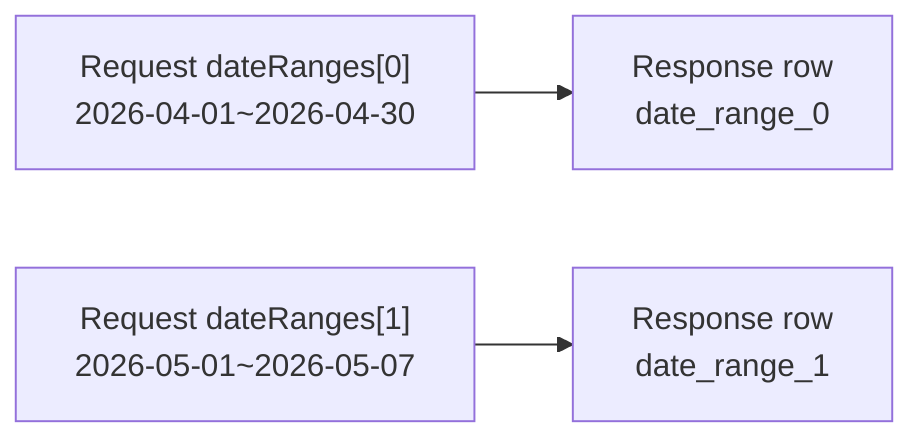

- 요청에 여러 `dateRanges`를 넣으면 response row에 기간 구분용 값이 들어간다.
- `date_range_0`은 첫 번째 date range, `date_range_1`은 두 번째 date range를 의미한다.
- 기간이 겹치면 겹친 날짜의 이벤트 데이터는 각 date range 결과에 모두 포함될 수 있다.

---

## 6. 어떤 정보까지 가져올 수 있는가

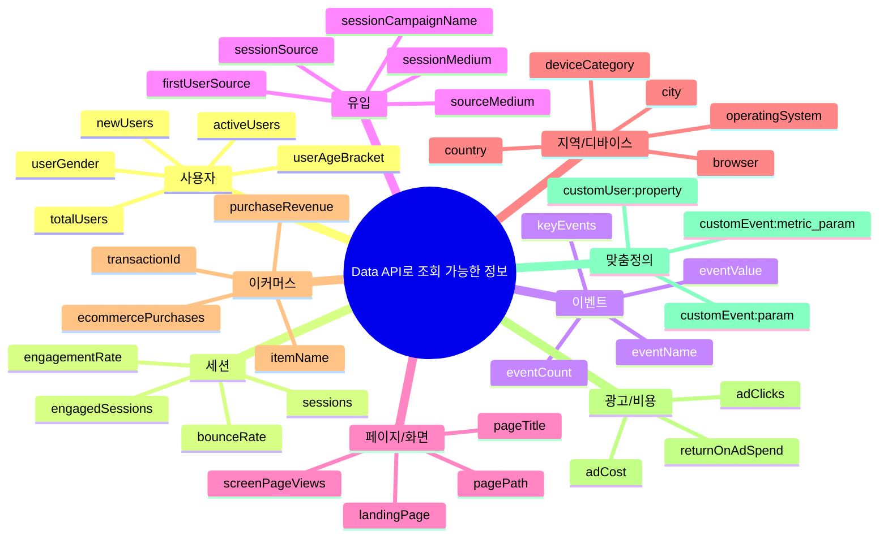

- Data API는 "GA4 UI에서 볼 수 있는 리포트성 데이터"를 프로그램으로 가져오는 API에 가깝다.
- 가져올 수 있는 정보는 `dimension`과 `metric`의 조합으로 결정된다.
- 단, 모든 dimension/metric이 서로 조합 가능한 것은 아니다.
  - 예: item scope, event scope, session scope, user scope가 섞이면 안 되는 조합이 있다.
  - `checkCompatibility`로 조합 가능성을 먼저 확인하는 것이 좋다.
  - `getMetadata`로 현재 property에서 쓸 수 있는 dimension/metric 목록을 확인할 수 있다.
- `getMetadata` response는 다음 구조다.

```json
{
  "name": "properties/123456789/metadata",
  "dimensions": [
    {
      "apiName": "eventName",
      "uiName": "Event name",
      "description": "The name of the event.",
      "customDefinition": false,
      "category": "Event"
    }
  ],
  "metrics": [
    {
      "apiName": "eventCount",
      "uiName": "Event count",
      "description": "The count of events.",
      "type": "TYPE_INTEGER",
      "customDefinition": false,
      "category": "Event"
    }
  ],
  "comparisons": [
    {
      "apiName": "comparisons/1234",
      "uiName": "Mobile traffic",
      "description": "..."
    }
  ]
}
```

### 6.1 사용자/세션/참여 정보

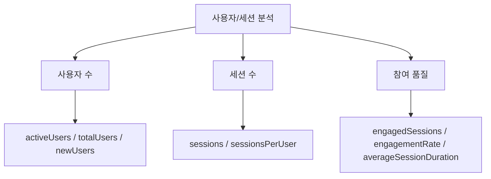

- 대표 metric:
  - `activeUsers`: 활성 사용자 수
  - `totalUsers`: 전체 사용자 수
  - `newUsers`: 신규 사용자 수
  - `sessions`: 세션 수
  - `sessionsPerUser`: 사용자당 세션 수
  - `engagedSessions`: 참여 세션 수
  - `engagementRate`: 참여율
  - `bounceRate`: 이탈률
  - `averageSessionDuration`: 평균 세션 지속 시간
- 대표 dimension:
  - `date`, `week`, `month`, `yearMonth`
  - `country`, `region`, `city`
  - `deviceCategory`, `browser`, `operatingSystem`
  - `newVsReturning`
- 주의:
  - `activeUsers`, `totalUsers` 같은 사용자 중복 제거 metric은
    dimension별 row를 단순 합산하면 전체 사용자 수와 다를 수 있다.
  - 전체 사용자 수가 필요하면 dimension을 빼거나 필요한 grouping 수준에서 별도로 요청해야 한다.

### 6.2 이벤트/주요 이벤트 정보

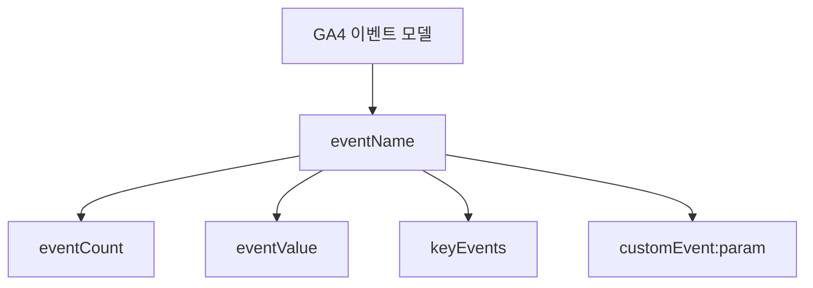

- 대표 dimension:
  - `eventName`: 이벤트명
  - `method`: 이벤트 parameter `method` 기반
  - `achievementId`, `level`, `virtualCurrencyName` 등 앱/게임 이벤트 관련 dimension
  - `customEvent:PARAMETER_NAME`: 등록된 event-scoped custom dimension
- 대표 metric:
  - `eventCount`: 이벤트 수
  - `eventCountPerUser`: 사용자당 이벤트 수
  - `eventsPerSession`: 세션당 이벤트 수
  - `eventValue`: 이벤트 parameter `value` 합계
  - `keyEvents`: 주요 이벤트 수
  - `userKeyEventRate`, `sessionKeyEventRate`: 사용자/세션 기준 주요 이벤트율
- 가능한 질문:
  - 어떤 이벤트가 가장 많이 발생했나?
  - 회원가입/구매/문의 같은 주요 이벤트가 어떤 채널에서 많이 발생했나?
  - 특정 버튼 클릭 이벤트가 디바이스별로 얼마나 발생했나?

### 6.3 유입/캠페인/광고 정보

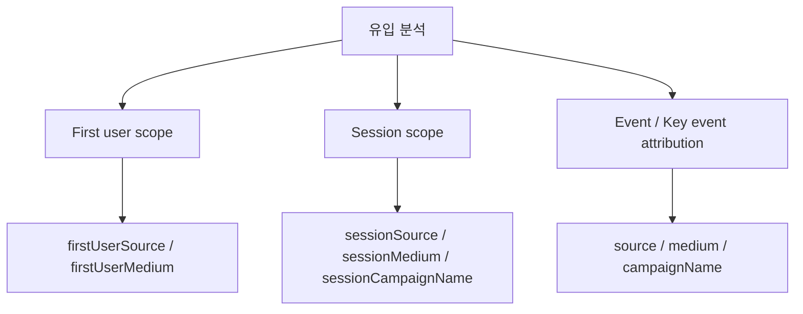

- 대표 dimension:
  - `firstUserSource`, `firstUserMedium`, `firstUserCampaignName`
  - `sessionSource`, `sessionMedium`, `sessionSourceMedium`, `sessionCampaignName`
  - `source`, `medium`, `sourceMedium`, `campaignName`
  - `manualSource`, `manualMedium`, `manualCampaignName`, `manualTerm`
  - `googleAdsCampaignName`, `googleAdsAdGroupName`, `googleAdsKeyword`
  - `defaultChannelGroup`, `sessionDefaultChannelGroup`, `firstUserDefaultChannelGroup`
- 대표 metric:
  - `sessions`
  - `activeUsers`
  - `keyEvents`
  - `purchaseRevenue`
  - `adCost`
  - `adClicks`
  - `returnOnAdSpend`
- 가능한 질문:
  - Organic Search, Paid Search, Direct 중 어떤 채널이 전환율이 높은가?
  - UTM 캠페인별 매출은 얼마인가?
  - Google Ads 비용 대비 구매 수익은 어느 정도인가?
- 주의:
  - 유입 dimension은 scope가 중요하다.
  - `firstUser...`는 사용자의 최초 획득 맥락이다.
  - `session...`은 세션 획득 맥락이다.
  - 일반 `source`, `medium` 계열은 key event attribution 문맥에서
    쓰이는 경우가 있어 리포트 목적에 맞춰 선택해야 한다.

### 6.4 페이지/화면/콘텐츠 정보

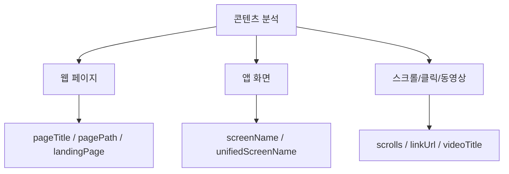

- 대표 dimension:
  - `pageTitle`
  - `pagePath`
  - `pageLocation`
  - `landingPage`
  - `unifiedPagePathScreen`
  - `unifiedPageScreen`
  - `unifiedScreenName`
  - `linkUrl`, `linkDomain`, `linkText`
  - `videoTitle`, `videoProvider`, `videoUrl`
- 대표 metric:
  - `screenPageViews`
  - `screenPageViewsPerSession`
  - `eventCount`
  - `activeUsers`
  - `sessions`
  - `userEngagementDuration`
- 가능한 질문:
  - 어느 landing page가 가장 많은 세션을 유입시키는가?
  - 어느 페이지에서 주요 이벤트가 많이 발생하는가?
  - 특정 콘텐츠의 page view와 engagement는 어떤가?
- 주의:
  - Core Web Vitals 같은 웹 성능 값은 GA4가 자동으로 모두 제공하는 지표가 아니다.
  - 필요하면 직접 이벤트/parameter로 수집하고 custom dimension/metric으로 등록해야 한다.

### 6.5 이커머스/수익 정보

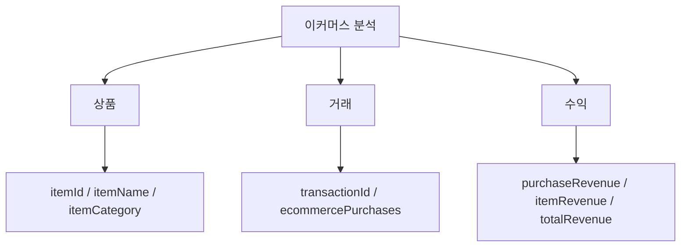

- 대표 dimension:
  - `transactionId`
  - `itemId`
  - `itemName`
  - `itemBrand`
  - `itemCategory`, `itemCategory2`, `itemCategory3`
  - `itemListName`
  - `currencyCode`
- 대표 metric:
  - `ecommercePurchases`
  - `purchaseRevenue`
  - `totalRevenue`
  - `itemRevenue`
  - `itemsPurchased`
  - `addToCarts`
  - `checkouts`
  - `itemListClicks`
  - `itemListViews`
- 가능한 질문:
  - 상품별 매출과 구매 수량은?
  - 카테고리별 장바구니 추가 대비 구매율은?
  - 캠페인별 구매 수익은?
- 주의:
  - item-scoped dimension과 event/session/user-scoped metric을 섞을 때 호환성 문제가 생길 수 있다.
  - 상품 단위 분석은 `checkCompatibility`와 실제 응답 검증이 중요하다.

### 6.6 맞춤 dimension/metric

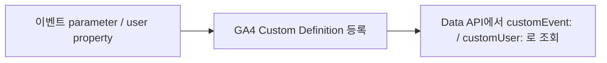

- event parameter나 user property를 API로 바로 무제한 조회할 수 있는 구조가 아니다.
- GA4에서 custom dimension/metric으로 등록해야 Data API 보고서 dimension/metric으로 조회할 수 있다.
- 대표 표현:
  - event-scoped custom dimension: `customEvent:parameter_name`
  - user-scoped custom dimension: `customUser:property_name`
  - event-scoped custom metric: `customEvent:metric_parameter_name`
- Admin API의 `properties.customDimensions`는 맞춤 dimension 정의를 조회/관리한다.
- `CustomDimension` 리소스의 핵심 필드:
  - `name`
  - `parameterName`
  - `displayName`
  - `description`
  - `scope`: `EVENT`, `USER`, `ITEM`
  - `disallowAdsPersonalization`

---

## 7. 특수 조회 API 응답

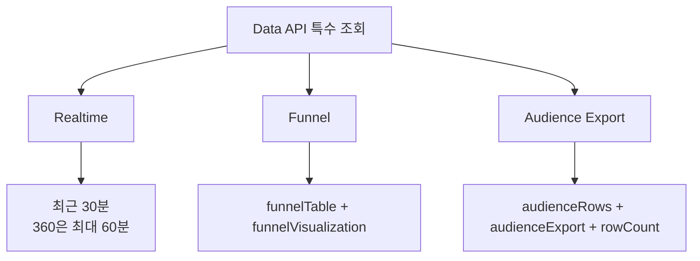

### 7.1 Realtime API

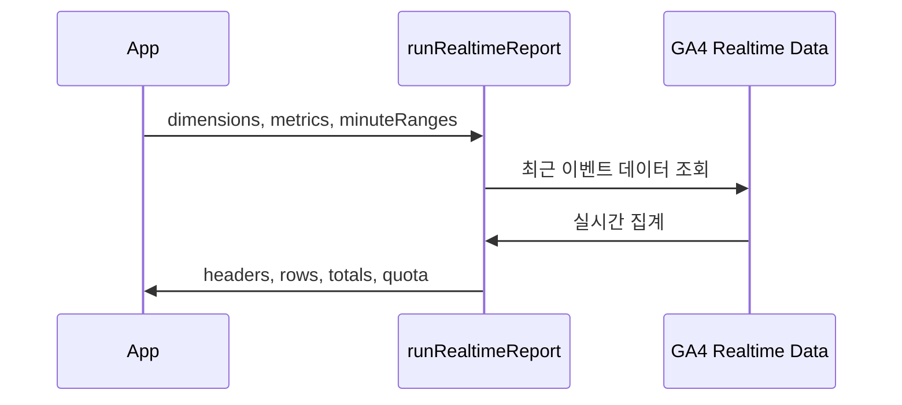

- HTTP:
  - `POST https://analyticsdata.googleapis.com/v1beta/{property=properties/*}:runRealtimeReport`
- 조회 범위:
  - 표준 property: 현재부터 최대 30분 전까지
  - Analytics 360 property: 현재부터 최대 60분 전까지
- request body:
  - `dimensions[]`
  - `metrics[]`
  - `dimensionFilter`
  - `metricFilter`
  - `limit`
  - `metricAggregations`
  - `orderBys`
  - `returnPropertyQuota`
  - `minuteRanges[]`
- `minuteRanges` 예:

```json
{
  "minuteRanges": [
    {
      "name": "last_5_minutes",
      "startMinutesAgo": 4,
      "endMinutesAgo": 0
    },
    {
      "name": "previous_5_minutes",
      "startMinutesAgo": 9,
      "endMinutesAgo": 5
    }
  ],
  "dimensions": [
    { "name": "country" },
    { "name": "minuteRange" }
  ],
  "metrics": [
    { "name": "activeUsers" }
  ]
}
```

- response는 일반 `runReport`처럼 headers/rows 구조를 따른다.
- 실시간 대시보드나 이벤트 유입 검증에 적합하다.

### 7.2 Funnel API

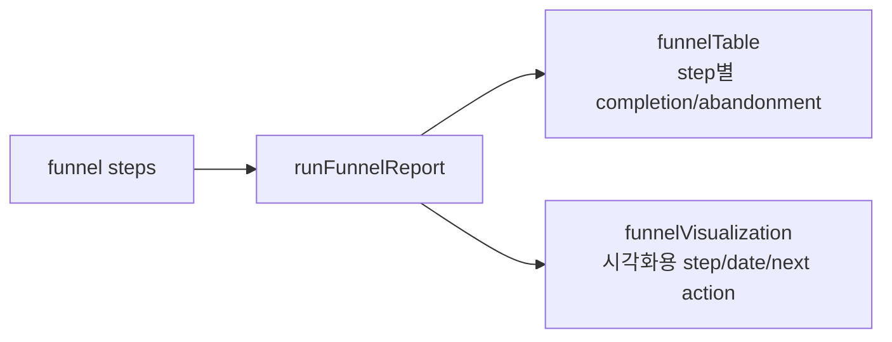

- HTTP:
  - `POST https://analyticsdata.googleapis.com/v1alpha/{property=properties/*}:runFunnelReport`
- 상태:
  - `v1alpha`
  - 공식 문서상 문법과 기능이 바뀔 수 있는 단계로 취급해야 한다.
- request body:
  - `dateRanges[]`
  - `funnel`
  - `funnelBreakdown`
  - `funnelNextAction`
  - `funnelVisualizationType`
  - `segments[]`
  - `limit`
  - `dimensionFilter`
  - `returnPropertyQuota`
- response body:

```json
{
  "funnelTable": {
    "dimensionHeaders": [],
    "metricHeaders": [],
    "rows": []
  },
  "funnelVisualization": {
    "dimensionHeaders": [],
    "metricHeaders": [],
    "rows": []
  },
  "propertyQuota": {},
  "kind": "analyticsData#runFunnelReport"
}
```

- `funnelTable`
  - step, segment, breakdown dimension, active users, completion rate,
    abandonments, abandonment rate 등 상세 테이블
- `funnelVisualization`
  - step, segment, date, next action dimension, active users 등 시각화용 sub-report
- 실무 활용:
  - `page_view -> sign_up -> purchase`
  - `view_item -> add_to_cart -> begin_checkout -> purchase`
  - `landing -> form_start -> generate_lead`

### 7.3 Audience Export API

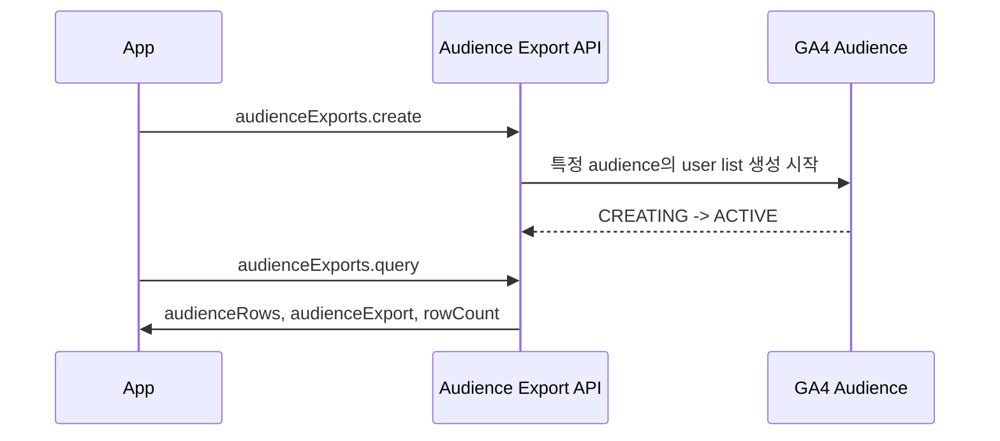

- 목적:
  - 특정 GA4 audience에 속한 사용자 목록을 export한다.
- 흐름:
  - `audienceExports.create`로 export 생성
  - `audienceExports.get`으로 `state` 확인
  - `state=ACTIVE`가 되면 `audienceExports.query`로 조회
- `AudienceExport` 리소스 핵심 필드:
  - `name`
  - `audience`
  - `audienceDisplayName`
  - `dimensions[]`
  - `creationQuotaTokensCharged`
  - `state`: `CREATING`, `ACTIVE`, `FAILED`
  - `beginCreatingTime`
  - `rowCount`
  - `errorMessage`
  - `percentageCompleted`
- `query` response:

```json
{
  "audienceRows": [
    {
      "dimensionValues": [
        { "value": "some-dimension-value" }
      ]
    }
  ],
  "audienceExport": {
    "name": "properties/123456789/audienceExports/987",
    "audience": "properties/123456789/audiences/456",
    "audienceDisplayName": "Purchasers",
    "state": "ACTIVE"
  },
  "rowCount": 175
}
```

- 주의:
  - audience export는 일반 `runReport`와 달리 audience user row를 다룬다.
  - 요청한 audience dimensions가 row의 컬럼 의미를 결정한다.
  - 개인정보/권한/thresholding 제약을 반드시 고려해야 한다.

---

## 8. Admin API로 가져올 수 있는 설정 정보

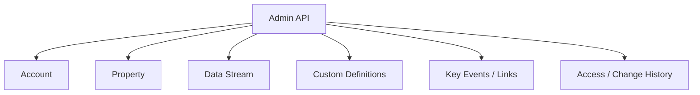

- Admin API는 "몇 명이 방문했는가"보다 "GA4가 어떻게 구성되어 있는가"를 가져오는 API다.
- 기본 endpoint:
  - `https://analyticsadmin.googleapis.com`
- 대표 사용 사례:
  - 내가 접근 가능한 GA account 목록 조회
  - account 아래 property 목록 조회
  - property의 timezone, currency, service level 확인
  - web/iOS/Android data stream 조회
  - web stream의 Measurement ID 조회
  - custom dimension/metric 목록 조회
  - 주요 이벤트 목록 조회
  - Google Ads/Firebase/BigQuery link 상태 조회
  - property access report 조회
  - change history 조회

### 8.1 Property response

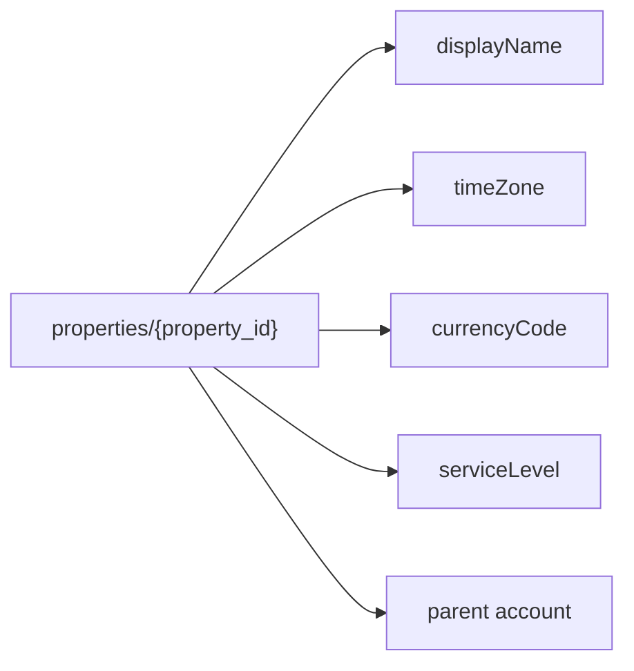

```json
{
  "name": "properties/1000",
  "propertyType": "PROPERTY_TYPE_ORDINARY",
  "createTime": "2024-01-01T00:00:00Z",
  "updateTime": "2026-04-01T12:00:00Z",
  "parent": "accounts/123",
  "displayName": "Example Service",
  "industryCategory": "INDUSTRY_CATEGORY_UNSPECIFIED",
  "timeZone": "Asia/Seoul",
  "currencyCode": "KRW",
  "serviceLevel": "GOOGLE_ANALYTICS_STANDARD",
  "account": "accounts/123"
}
```

- 가져올 수 있는 핵심 정보:
  - property resource name
  - property type
  - 생성/수정 시간
  - parent account
  - 표시 이름
  - 산업 카테고리
  - timezone
  - currency
  - service level: Standard 또는 360

### 8.2 Data Stream response

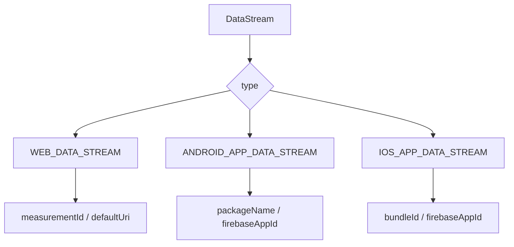

```json
{
  "name": "properties/1000/dataStreams/2000",
  "type": "WEB_DATA_STREAM",
  "displayName": "Web Stream",
  "createTime": "2024-01-01T00:00:00Z",
  "updateTime": "2026-04-01T12:00:00Z",
  "webStreamData": {
    "measurementId": "G-1A2BCD345E",
    "firebaseAppId": "1:123:web:abc",
    "defaultUri": "https://example.com"
  }
}
```

- 웹 스트림:
  - `measurementId`: `G-...`
  - `defaultUri`
  - Firebase web app id
- Android 스트림:
  - `packageName`
  - Firebase app id
- iOS 스트림:
  - `bundleId`
  - Firebase app id

### 8.3 Custom Dimension response

```mermaid
flowchart LR
    A["CustomDimension"] --> B["parameterName"]
    A --> C["displayName"]
    A --> D["scope"]
    D --> E["EVENT"]
    D --> F["USER"]
    D --> G["ITEM"]
```

```json
{
  "name": "properties/1000/customDimensions/3000",
  "parameterName": "plan_type",
  "displayName": "Plan Type",
  "description": "Subscription plan selected by the user",
  "scope": "EVENT",
  "disallowAdsPersonalization": false
}
```

- 가져올 수 있는 핵심 정보:
  - 어떤 event parameter/user property/item parameter가
    GA4 custom definition으로 등록되어 있는지
  - 표시 이름과 설명
  - scope
  - ads personalization 제외 여부
- 실무 활용:
  - Data API에서 `customEvent:plan_type` 같은 이름으로 조회 가능한지 사전 확인
  - 이벤트 명세서와 GA4 설정 불일치 점검

---

## 9. Measurement Protocol response와 한계

```mermaid
sequenceDiagram
    participant Server
    participant MP as mp/collect
    participant Debug as debug/mp/collect
    participant GA as GA4 Processing

    Server->>MP: production event payload
    MP-->>Server: 2xx if HTTP request received
    MP->>GA: processing may accept/reject later
    Server->>Debug: validation payload
    Debug-->>Server: validationMessages JSON
```

- Measurement Protocol은 데이터를 조회하는 API가 아니다.
- 서버에서 GA4로 이벤트를 보내는 수집 API다.
- 일반 수집 endpoint:

```http
POST https://www.google-analytics.com/mp/collect?measurement_id=G-XXXXXXXXXX&api_secret=SECRET
Content-Type: application/json

{
  "client_id": "1234567890.1234567890",
  "events": [
    {
      "name": "purchase",
      "params": {
        "transaction_id": "T12345",
        "value": 99000,
        "currency": "KRW"
      }
    }
  ]
}
```

- 일반 endpoint response:
  - HTTP request가 수신되면 `2xx`를 반환한다.
  - payload가 malformed이거나 데이터가 처리되지 않는 경우에도 상세 오류를 일반 response로 보장하지 않는다.
  - 즉, `204` 또는 다른 `2xx`는 "GA4 리포트에 정상 반영되었다"의 증거가 아니라 "HTTP 요청을 받았다"에 가깝다.
- 검증 endpoint response 예:

```json
{
  "validationMessages": [
    {
      "fieldPath": "events[0].name",
      "description": "Event name is invalid.",
      "validationCode": "NAME_INVALID"
    }
  ]
}
```

- 실무 권장:
  - production 전에는 `debug/mp/collect` 또는 Event Builder로 payload를 검증한다.
  - production에서는 `validation_behavior`를 과도하게 강제하지 않는 편이 권장된다.
  - `api_secret`, `measurement_id`, `client_id`, `session_id`,
    `engagement_time_msec` 같은 값이 올바른지 별도 점검해야 한다.
  - 서버 이벤트는 브라우저 문맥의 referrer/UTM/session 정보가
    자동으로 생기지 않는다. 필요한 attribution context를 설계해서 보내야 한다.

---

## 10. BigQuery Export와 Data API의 차이

```mermaid
flowchart TD
    A["GA4 데이터 조회 요구"] --> B{"집계 리포트면 충분한가?"}
    B -->|"예"| C["Data API"]
    B -->|"아니오, 원천 이벤트 필요"| D["BigQuery Export"]
    C --> C1["dimension + metric 집계 테이블"]
    D --> D1["events_YYYYMMDD 원천 이벤트 테이블"]
    D --> D2["event_params / items nested records"]
```

- Data API:
  - GA4가 만든 리포트 테이블을 API로 조회한다.
  - dimension/metric 조합 단위의 집계 결과를 반환한다.
  - 대시보드, 정기 리포트, KPI 추출에 적합하다.
- BigQuery Export:
  - GA4 event data를 BigQuery dataset으로 내보낸다.
  - `events_YYYYMMDD` 일별 테이블이 생성된다.
  - streaming export가 켜져 있으면 `events_intraday_YYYYMMDD`가 계속 채워진다.
  - event parameter와 item data는 nested/repeated record로 들어갈 수 있다.
- BigQuery에서 볼 수 있는 대표 필드:
  - `event_date`
  - `event_timestamp`
  - `event_name`
  - `event_params`
  - `user_pseudo_id`
  - `user_id`
  - `device`
  - `geo`
  - `traffic_source`
  - `items`
  - `ecommerce`
- 실무 판단:
  - "지난 30일 채널별 세션/구매/매출" = Data API가 적합
  - "특정 사용자의 이벤트 순서", "event parameter 원문", "세션 재구성",
    "복잡한 SQL 분석" = BigQuery Export가 적합
- 주의:
  - BigQuery export와 GA4 UI/Data API 숫자는 항상 100% 일치한다고 가정하면 안 된다.
  - 처리 시점, modeling, thresholding, reporting identity, timezone,
    consent, export 제외 설정 등으로 차이가 날 수 있다.

---

## 11. 한계, quota, 데이터 품질 체크포인트

```mermaid
flowchart TD
    A["Response 신뢰도 체크"] --> B["quota"]
    A --> C["rowCount / pagination"]
    A --> D["metadata"]
    A --> E["dimension/metric compatibility"]
    D --> D1["sampling"]
    D --> D2["thresholding"]
    D --> D3["dataLossFromOtherRow"]
    D --> D4["schema restrictions"]
```

- Data API quota category:
  - `Core`: `runReport`, `runPivotReport`, `batchRunReports`,
    `batchRunPivotReports`, `runAccessReport`, `getMetadata`,
    `checkCompatibility`, `createAudienceExports`
  - `Realtime`: `runRealtimeReport`
  - `Funnel`: `runFunnelReport`
- 표준 property 주요 quota:
  - Core tokens per property per day: `200,000`
  - Core tokens per property per hour: `40,000`
  - Core tokens per project per property per hour: `14,000`
  - Core concurrent requests per property: `10`
  - Realtime/Funnel도 같은 구조의 일/시간/token/concurrent quota가 있다.
- Analytics 360 property 주요 quota:
  - Core tokens per property per day: `2,000,000`
  - Core tokens per property per hour: `400,000`
  - Core tokens per project per property per hour: `140,000`
  - Core concurrent requests per property: `50`
- token 소모가 커지는 요인:
  - rows가 많음
  - columns가 많음
  - filter가 복잡함
  - date range가 김
- `returnPropertyQuota=true`로 response에 quota 상태를 포함시키면 운영 모니터링에 좋다.
- `rowCount`와 `rows.length`는 다를 수 있다.
  - `rowCount`: 전체 결과 행 수
  - `rows.length`: 이번 response에 실제 포함된 행 수
  - pagination은 `offset`, `limit`으로 처리한다.
- privacy/품질 관련 metadata:
  - `dataLossFromOtherRow=true`
    - high-cardinality 문제로 일부 dimension 조합이 `(other)`로 묶였을 수 있다.
  - `samplingMetadatas`
    - 샘플링이 발생했는지 확인한다.
  - `subjectToThresholding=true`
    - 개인정보 보호 thresholding 적용 가능성이 있다.
  - `schemaRestrictionResponse`
    - 권한상 cost/revenue metric 등이 제한되었는지 확인한다.
- thresholding 주의 dimension:
  - `userAgeBracket`
  - `userGender`
  - `brandingInterest`
  - `audienceId`
  - `audienceName`
- restricted metric 유형:
  - `COST_DATA`: 예: `adCost`
  - `REVENUE_DATA`: 예: `purchaseRevenue`
- 정확한 운영 패턴:
  - 중요한 ETL에서는 response의 `metadata`를 저장한다.
  - dashboard 숫자와 API 숫자가 다를 때는 dimension scope, timezone,
    date range, filtering, thresholding, sampling, row aggregation 방식을
    먼저 확인한다.
  - 사용자 수 같은 deduplicated metric은 row별 합계를 전체로 사용하지 않는다.

---

## 12. 실무 요청 레시피

```mermaid
flowchart TD
    A["비즈니스 질문"] --> B["dimension 선택"]
    A --> C["metric 선택"]
    B --> D["checkCompatibility"]
    C --> D
    D --> E["runReport"]
    E --> F["metadata / quota 검증"]
    F --> G["저장 / 시각화"]
```

### 12.1 채널별 성과

- 질문:
  - 채널별 세션, 사용자, 주요 이벤트, 구매 수익은?
- dimension:
  - `sessionDefaultChannelGroup`
  - `sessionSourceMedium`
  - `date`
- metric:
  - `sessions`
  - `activeUsers`
  - `keyEvents`
  - `purchaseRevenue`
- 주의:
  - 사용자 수는 채널별 합산과 전체가 다를 수 있다.

### 12.2 페이지별 성과

- 질문:
  - 어떤 landing page가 전환에 기여하는가?
- dimension:
  - `landingPage`
  - `pageTitle`
- metric:
  - `sessions`
  - `activeUsers`
  - `engagementRate`
  - `keyEvents`
- 주의:
  - page path query string 포함 여부를 목적에 맞게 선택한다.
  - `pagePath`, `pageLocation`, `unifiedPageScreen`의 의미가 다르다.

### 12.3 이벤트별 발생량

- 질문:
  - 어떤 이벤트가 많이 발생하고, 어떤 이벤트가 주요 이벤트로 이어지는가?
- dimension:
  - `eventName`
  - `date`
  - `deviceCategory`
- metric:
  - `eventCount`
  - `eventCountPerUser`
  - `keyEvents`
- 주의:
  - event parameter별 분석이 필요하면 custom dimension 등록이 필요할 수 있다.

### 12.4 이커머스 상품 분석

- 질문:
  - 상품별 구매 수량, 매출, 장바구니 추가는?
- dimension:
  - `itemName`
  - `itemId`
  - `itemCategory`
- metric:
  - `itemsPurchased`
  - `itemRevenue`
  - `addToCarts`
  - `ecommercePurchases`
- 주의:
  - item scope 조합 호환성을 확인한다.

### 12.5 GA 설정 인벤토리

- 질문:
  - 우리 계정에 어떤 GA4 property와 data stream이 있고, 어떤 custom definition이 설정되어 있는가?
- API:
  - `Admin API`
- 호출:
  - `accountSummaries.list`
  - `properties.list`
  - `properties.dataStreams.list`
  - `properties.customDimensions.list`
  - `properties.customMetrics.list`
  - `properties.keyEvents.list`
- 산출물:
  - 계정/속성/스트림 목록
  - Measurement ID 목록
  - timezone/currency/service level
  - custom dimensions/metrics 정의
  - 주요 이벤트 설정

---

## 13. 빠른 결론

```mermaid
flowchart LR
    A["질문"] --> B{"무엇이 필요한가?"}
    B -->|"보고서 수치"| C["Data API runReport"]
    B -->|"실시간"| D["Data API runRealtimeReport"]
    B -->|"퍼널"| E["Data API runFunnelReport v1alpha"]
    B -->|"오디언스 사용자 export"| F["Audience Export API"]
    B -->|"설정/계정 구조"| G["Admin API"]
    B -->|"서버 이벤트 전송"| H["Measurement Protocol"]
    B -->|"원천 이벤트 분석"| I["BigQuery Export"]
```

- GA4 API response의 핵심은 "headers와 row values의 인덱스 매핑"이다.
- metric 값은 문자열로 오므로 `metricHeaders[].type`을 보고 숫자로 파싱한다.
- `metadata`는 선택 정보가 아니라 운영상 필수 확인값에 가깝다.
- `rowCount`는 전체 결과 수이고, 현재 응답 row 수가 아니다.
- `limit`은 요청당 최대 250,000 rows다.
- Data API는 raw event export가 아니라 집계 리포트 API다.
- 원천 이벤트/사용자 여정/parameter 원문 분석은 BigQuery Export가 맞다.
- GA4 설정 자동 점검은 Admin API가 맞다.
- 서버에서 이벤트를 넣는 것은 Measurement Protocol이며, 일반 response의
  `2xx`를 "리포트 반영 성공"으로 해석하면 안 된다.
- Universal Analytics는 2024-07-01 이후 UI/API 접근이 대부분
  종료되었으므로, 새 작업은 GA4 기준으로 설계해야 한다.

---

## 참고 링크

- [Google Analytics Data API REST Overview](https://developers.google.com/analytics/devguides/reporting/data/v1/rest)
- [Method: properties.runReport](https://developers.google.com/analytics/devguides/reporting/data/v1/rest/v1beta/properties/runReport)
- [RunReportResponse](https://developers.google.com/analytics/devguides/reporting/data/v1/rest/v1beta/RunReportResponse)
- [Row](https://developers.google.com/analytics/devguides/reporting/data/v1/rest/v1beta/Row)
- [Dimension](https://developers.google.com/analytics/devguides/reporting/data/v1/rest/v1beta/Dimension)
- [Metric](https://developers.google.com/analytics/devguides/reporting/data/v1/rest/v1beta/Metric)
- [API Dimensions & Metrics](https://developers.google.com/analytics/devguides/reporting/data/v1/api-schema)
- [Method: properties.getMetadata](https://developers.google.com/analytics/devguides/reporting/data/v1/rest/v1beta/properties/getMetadata)
- [ResponseMetaData](https://developers.google.com/analytics/devguides/reporting/data/v1/rest/v1beta/ResponseMetaData)
- [Data API limits and quotas](https://developers.google.com/analytics/devguides/reporting/data/v1/quotas)
- [Method: properties.runRealtimeReport](https://developers.google.com/analytics/devguides/reporting/data/v1/rest/v1beta/properties/runRealtimeReport)
- [Method: properties.runFunnelReport](https://developers.google.com/analytics/devguides/reporting/data/v1/rest/v1alpha/properties/runFunnelReport)
- [REST Resource: properties.audienceExports](https://developers.google.com/analytics/devguides/reporting/data/v1/rest/v1beta/properties.audienceExports)
- [Method: properties.audienceExports.query](https://developers.google.com/analytics/devguides/reporting/data/v1/rest/v1beta/properties.audienceExports/query)
- [Google Analytics Admin API REST Overview](https://developers.google.com/analytics/devguides/config/admin/v1/rest)
- [Google Analytics Admin API Overview](https://developers.google.com/analytics/devguides/config/admin/v1)
- [REST Resource: properties](https://developers.google.com/analytics/devguides/config/admin/v1/rest/v1beta/properties)
- [REST Resource: properties.dataStreams](https://developers.google.com/analytics/devguides/config/admin/v1/rest/v1beta/properties.dataStreams)
- [REST Resource: properties.customDimensions](https://developers.google.com/analytics/devguides/config/admin/v1/rest/v1beta/properties.customDimensions)
- [Google Analytics API quickstart](https://developers.google.com/analytics/devguides/config/admin/v1/quickstart)
- [OAuth 2.0 Scopes for Google APIs](https://developers.google.com/identity/protocols/oauth2/scopes)
- [Measurement Protocol reference](https://developers.google.com/analytics/devguides/collection/protocol/ga4/reference)
- [Validate events](https://developers.google.com/analytics/devguides/collection/protocol/ga4/validating-events)
- [BigQuery export schemas](https://developers.google.com/analytics/bigquery/schemas)
- [[GA4] BigQuery Export schema](https://support.google.com/analytics/answer/7029846)
- [Google Analytics 4 has replaced Universal Analytics](https://support.google.com/analytics/answer/9973999)
