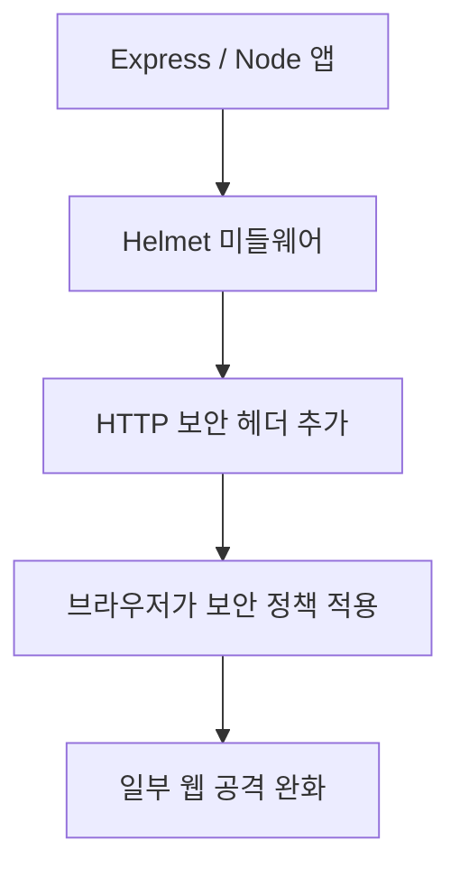
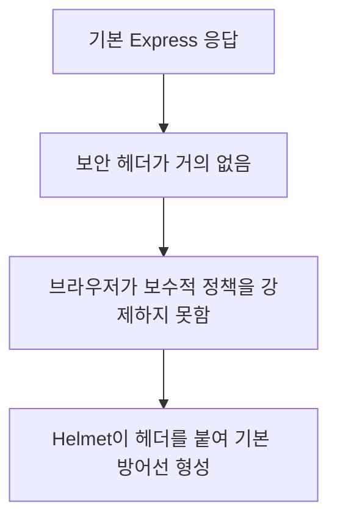
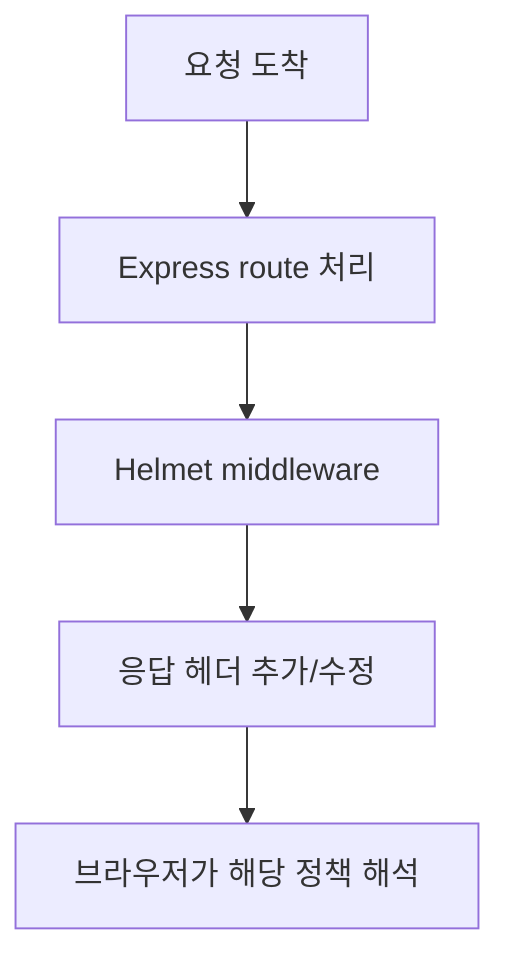
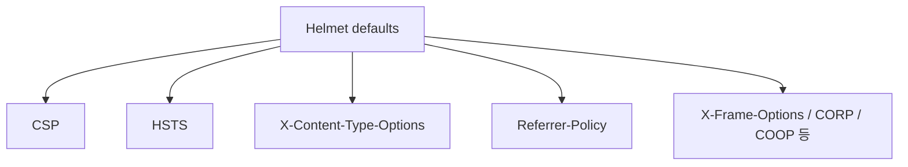
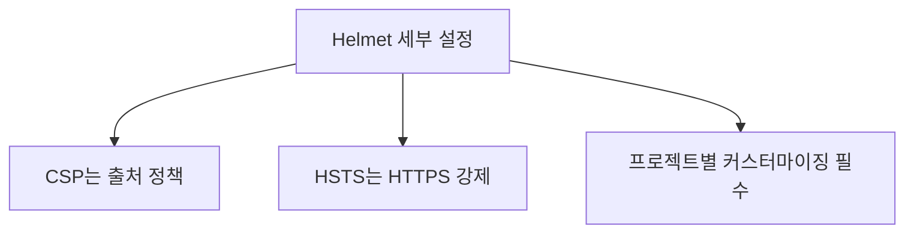
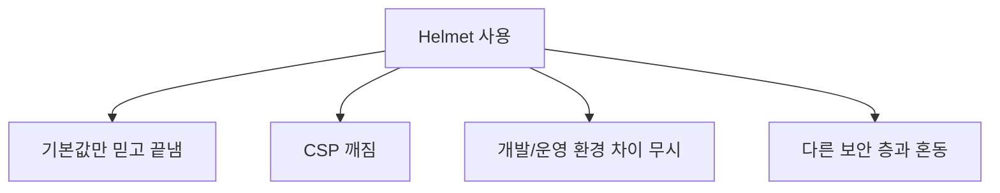
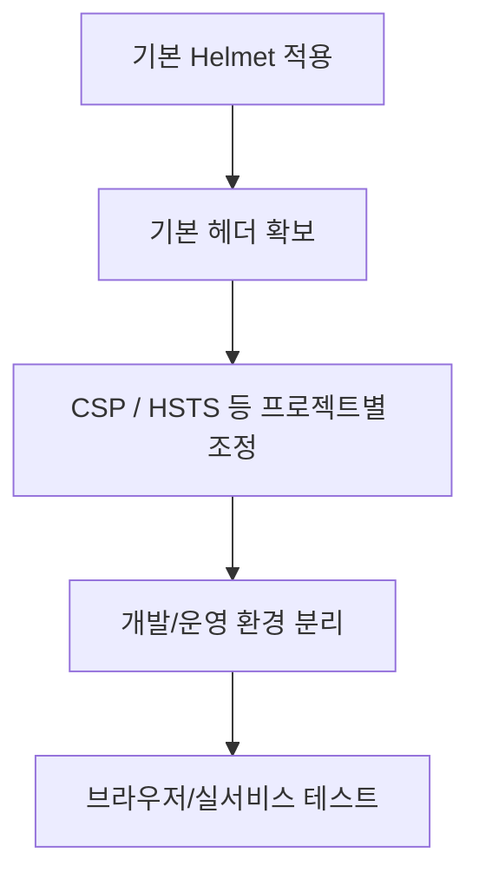

# Helmet.js(보안) 상세 정리

작성 기준일: 2026-04-20  
조사 방식: 웹검색 기반 최신 조사  
주요 참고: `helmetjs.github.io`, `github.com/helmetjs/helmet`, MDN HTTP 보안 헤더 문서

## 1. 한 줄 요약



`Helmet.js`는 Express(또는 Node HTTP 응답)에서 여러 HTTP 보안 헤더를 한 번에 설정해, 브라우저가 더 안전한 정책으로 페이지를 처리하도록 도와주는 보안 미들웨어다.

Helmet 공식 사이트는 Helmet을:

- Node/Express 앱을 더 안전하게 돕는 도구
- `Content-Security-Policy`, `Strict-Transport-Security` 같은 HTTP response headers를 설정하는 미들웨어

라고 설명한다.

즉 아주 단순하게 말하면:

- "앱 자체 코드를 암호화하는 도구"가 아니라
- "브라우저에게 이 사이트를 더 엄격하게 다루라고 지시하는 응답 헤더 세트"를 쉽게 붙여 주는 도구

다.

---

## 2. 왜 Helmet이 필요한가



브라우저 보안은 애플리케이션 코드만으로 끝나지 않는다.

서버는 브라우저에게 HTTP 응답 헤더를 통해:

- 어떤 스크립트 출처를 허용할지
- 프레임 안에 넣어도 되는지
- MIME sniffing을 허용할지
- HTTPS만 강제할지
- `Referer`를 얼마나 보낼지

같은 정책을 전달할 수 있다.

### 2.1 왜 중요한가

많은 공격은 서버가 직접 막는 것만으로 끝나지 않는다.

예:

- XSS 완화
- clickjacking 완화
- MIME confusion 완화
- mixed content 완화
- referrer leakage 완화

같은 문제는 브라우저 협조가 중요하다.

### 2.2 Helmet의 포지션

Helmet은 이런 보안 헤더를:

- 한 번에 켜고
- 기본적으로 비교적 안전한 설정을 제공하며
- 필요한 헤더만 세부 조정할 수 있게 하는

보안 편의 미들웨어다.

### 2.3 중요한 전제

Helmet 공식 README도 강조한다.

- `Helmet is not a silver bullet`

즉 Helmet은:

- 필요한 보안 헤더 기본값을 주는 도구

이지,

- 인증/인가
- 입력 검증
- SQL injection 방지
- XSS 완전 차단

을 혼자 해결하는 도구는 아니다.

즉 보안 전체의 한 층이다.

---

## 3. Helmet이 실제로 하는 일



Helmet은 응답 body를 암호화하거나, 런타임에서 무언가를 복잡하게 계산하는 도구가 아니다.

핵심은:

- 응답에 보안 관련 헤더를 추가하거나
- 일부 위험한 기본 동작을 꺼 주는 것

이다.

### 3.1 가장 기본 사용

공식 문서 예시:

```js
import helmet from "helmet";

app.use(helmet());
```

이 한 줄이면 Helmet이 기본으로 켜는 여러 헤더가 적용된다.

### 3.2 어떤 느낌으로 동작하나

예를 들면 Helmet은 응답에:

- `Content-Security-Policy`
- `X-Content-Type-Options`
- `Strict-Transport-Security`
- `Referrer-Policy`

같은 헤더를 붙인다.

즉 애플리케이션 로직을 바꾸기보다, 응답 메타데이터를 보강한다.

### 3.3 Express 전용인가

Helmet 사이트는 Helmet이:

- standalone Node.js
- 다른 framework

에서도 사용할 수 있다고 설명한다.

즉 가장 흔한 문맥은 Express지만, 본질은 Node HTTP response headers middleware 모음이라고 보면 된다.

---

## 4. Helmet이 기본으로 설정하는 주요 헤더들



Helmet 공식 문서 기준, 기본 설정 시 여러 헤더가 켜진다.

현재 공식 사이트가 보여 주는 대표 헤더는 다음과 같다.

- `Content-Security-Policy`
- `Cross-Origin-Opener-Policy`
- `Cross-Origin-Resource-Policy`
- `Origin-Agent-Cluster`
- `Referrer-Policy`
- `Strict-Transport-Security`
- `X-Content-Type-Options`
- `X-DNS-Prefetch-Control`
- `X-Download-Options`
- `X-Frame-Options`
- `X-Permitted-Cross-Domain-Policies`
- `X-XSS-Protection`

즉 Helmet은 사실상 "헤더 세트 모음"이다.

### 4.1 `Content-Security-Policy`

Helmet 공식 문서가 가장 먼저 강조하는 헤더다.

역할:

- 어떤 스크립트, 이미지, 폰트, frame, form target 등을 허용할지 제한

즉 XSS 완화의 핵심 수단 중 하나다.

### 4.2 `Strict-Transport-Security`

MDN HSTS 문서가 설명하듯:

- 브라우저에게 HTTPS만 사용하도록 기억시키는 정책

이다.

즉 한번 HTTPS로 접속한 뒤에는 같은 도메인을 HTTP로 열지 않게 강제할 수 있다.

### 4.3 `X-Content-Type-Options: nosniff`

MDN 문서 기준:

- 브라우저가 MIME sniffing 하지 않도록 제한

즉 응답 타입 오해로 인한 보안 문제를 줄인다.

### 4.4 `X-Frame-Options`

대표적으로 clickjacking 완화에 쓰인다.

즉 내 페이지가 임의의 외부 frame 안에 들어가는 것을 제한할 수 있다.

### 4.5 `Referrer-Policy`

외부 요청 시 `Referer` 헤더를 얼마나 보낼지 제어한다.

즉 민감한 URL 정보가 다른 사이트로 과도하게 새는 것을 줄인다.

### 4.6 `Cross-Origin-*`

현대 브라우저 격리 모델과 관련된 헤더들이다.

예:

- `Cross-Origin-Opener-Policy`
- `Cross-Origin-Resource-Policy`

즉 사이트를 더 엄격하게 분리/격리하는 데 도움이 될 수 있다.

---

## 5. Helmet에서 가장 중요한 세부 설정: CSP와 HSTS



Helmet을 쓸 때 가장 많이 손대게 되는 건 보통:

- `contentSecurityPolicy`
- `hsts`

다.

### 5.1 CSP는 강력하지만 설정 난이도가 높다

Helmet 공식 사이트도:

- CSP는 powerful
- but likely requires configuration for your specific app

라고 설명한다.

왜냐하면 실제 앱은:

- CDN script
- analytics script
- inline style/script
- third-party iframe
- image CDN

같은 외부 자원을 쓸 수 있기 때문이다.

즉 `helmet()` 기본값만 켜 두면 일부 앱은 깨질 수 있다.

### 5.2 기본 CSP 감각

Helmet 공식 문서 예시는 대체로:

- `default-src 'self'`

기반의 비교적 엄격한 allowlist 철학이다.

즉 "기본 차단 후 필요한 것만 열기"가 핵심이다.

### 5.3 nonce 기반 CSP

Helmet 공식 사이트는 요청마다 nonce를 만들어:

- `script-src 'self' 'nonce-...'`

같은 정책을 구성하는 예시도 보여 준다.

즉 현대 앱에서는 nonce 기반 CSP가 매우 자주 쓰인다.

### 5.4 HSTS는 조심해서 켜야 한다

`Strict-Transport-Security`는 강력하지만, 한 번 브라우저가 기억하면 이후에도 HTTPS만 강제한다.

즉:

- 로컬 개발
- 아직 HTTPS 완전 전환이 안 된 서브도메인

환경에서 섣불리 길게 켜면 운영 실수가 생길 수 있다.

### 5.5 `upgrade-insecure-requests` 주의

Helmet docs는 CSP 기본값에 `upgrade-insecure-requests`가 포함된다고 설명하면서, Safari가 `http://localhost`도 `https://localhost`로 업그레이드할 수 있으니 개발 환경에서는 꺼야 할 수 있다고 설명한다.

즉 Helmet은 운영 기본값은 꽤 공격적이고, 개발 환경에선 조정이 필요하다.

---

## 6. 실무에서 자주 하는 실수와 함정



Helmet은 편하지만, 자주 생기는 실수도 있다.

### 6.1 `app.use(helmet())` 한 줄이면 보안 끝이라고 생각

아니다.

Helmet은:

- 응답 헤더 기반 방어층

일 뿐이다.

즉 여전히:

- 입력 검증
- 인증/인가
- CSRF 전략
- 세션 보안
- 의존성 관리

가 별도로 필요하다.

### 6.2 CSP를 안 맞춰 놓고 production에 바로 적용

가장 흔한 실수다.

증상:

- 스크립트가 안 뜸
- 스타일이 깨짐
- 외부 이미지/CDN이 차단됨

즉 CSP는 staged rollout과 Report-Only 같은 전략을 같이 고려해야 한다.

### 6.3 개발 환경에서 HSTS / upgrade-insecure-requests 문제

로컬에서:

- `localhost`
- 자체 서명 인증서
- HTTP 테스트

가 섞이면 예기치 않은 동작이 나올 수 있다.

즉 개발/운영 설정을 분리하는 편이 좋다.

### 6.4 오래된 헤더의 의미를 과대평가

예:

- `X-XSS-Protection`

같은 헤더는 현대 브라우저 보안에서 핵심 축이 아니다.

즉 Helmet이 여러 헤더를 붙인다고 해서 모두 같은 중요도를 가지는 것은 아니다.

실무적으로는:

- CSP
- HSTS
- `nosniff`
- clickjacking 방지
- referrer policy

가 더 중요하다.

### 6.5 reverse proxy / CDN과 충돌 가능성

보안 헤더는:

- 앱 서버
- Nginx
- CDN
- Edge platform

중 어디서 넣는지가 겹칠 수 있다.

즉 중복 설정과 정책 충돌을 주의해야 한다.

---

## 7. 실무 권장 사용 방식



### 7.1 기본 시작점

대부분의 Express 앱은:

```js
app.use(helmet());
```

로 시작하는 게 맞다.

즉 "기본 보안 헤더가 아무 것도 없는 상태"보다는 훨씬 낫다.

### 7.2 그 다음은 커스터마이징

실무에서는 거의 항상 아래를 추가 검토한다.

- `contentSecurityPolicy`
- `hsts`
- `referrerPolicy`
- `crossOriginResourcePolicy`

즉 기본값 위에 프로젝트 문맥을 덧씌운다.

### 7.3 개발 환경 분리

공식 Helmet 문서처럼 개발 환경에서는:

- CSP 일부 완화
- `upgrade-insecure-requests` 비활성화

같은 처리가 필요할 수 있다.

### 7.4 점진 도입

특히 기존 서비스라면:

- 바로 모든 정책 강제

보다

- 먼저 어떤 리소스가 막히는지 확인
- CSP 정책 세분화
- 필요시 report-only 전략 병행

이 더 안전하다.

### 7.5 한 줄 권장안

Helmet은:

- "무조건 넣는 기본 방어층"
- 하지만 "기본값 그대로 끝내지 말고, CSP/HSTS를 서비스에 맞게 조정"

하는 것이 가장 현실적인 사용 방식이다.

---

## 참고 링크

- Helmet 공식 사이트: [Helmet.js](https://helmetjs.github.io/)
- Helmet GitHub README: [helmetjs/helmet](https://github.com/helmetjs/helmet)
- MDN Content-Security-Policy: [CSP](https://developer.mozilla.org/en-US/docs/Web/HTTP/CSP)
- MDN Strict-Transport-Security: [HSTS](https://developer.mozilla.org/en-US/docs/Web/HTTP/Reference/Headers/Strict-Transport-Security)
- MDN X-Content-Type-Options: [X-Content-Type-Options](https://developer.mozilla.org/en-US/docs/Web/HTTP/Reference/Headers/X-Content-Type-Options)
- MDN Referrer-Policy: [Referrer-Policy](https://developer.mozilla.org/en-US/docs/Web/HTTP/Headers/Referrer-Policy)
- MDN X-Frame-Options: [X-Frame-Options](https://developer.mozilla.org/en-US/docs/Web/HTTP/Headers/X-Frame-Options)
