# JavaScript 배열 `sort((a, b) => a.time_ms - b.time_ms)` 상세 노트

## 1. 한 줄 요약

- `this.contentData.spoints.sort((a, b) => a.time_ms - b.time_ms);`는 `spoints` 배열 안의 객체들을 각 객체의 `time_ms` 숫자값 기준으로 오름차순 정렬하는 코드다.
- `sort()`는 원본 배열을 직접 바꾸는 메서드이고, `(a, b) => a.time_ms - b.time_ms`는 두 원소의 순서를 결정하는 비교 함수다.

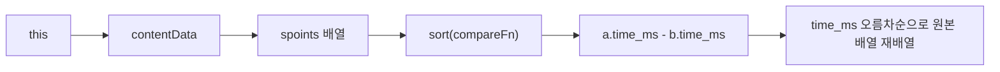

- 대상 코드에서는 `calcSpoints()` 첫 줄에서 시간순 정렬을 먼저 수행한다.
- 그 다음 `for` 루프에서 현재 `spoint`, 이전 `spoint`, 다음 `spoint`를 비교해 `duration_ms_prev`, `duration_ms_next`, `pixel_prev`, `pixel_next`를 계산한다.
- 즉 이 정렬은 단순한 보기용 정렬이 아니라, 뒤쪽 계산 로직의 전제 조건이다.

```js
calcSpoints() {
    this.contentData.spoints.sort((a, b) => a.time_ms - b.time_ms);
    for (let i = 0; i < this.contentData.spoints.length - 1; i++) {
        const current_spoint = this.contentData.spoints[i];
        const next_spoint = this.contentData.spoints[i + 1];
        // ...
    }
}
```

## 2. 왜 중요한가

- `spoints`는 이름과 사용 방식상 스크롤 포인트 또는 싱크 포인트처럼 보이며, `time_ms`와 `top` 값을 함께 가진 마커 배열이다.
- `calcSpoints()`는 정렬된 시간축을 기준으로 각 마커 사이의 시간 차이와 위치 차이를 계산한다.
- 만약 `spoints`가 시간순으로 정렬되어 있지 않으면 `next_spoint.time_ms - current_spoint.time_ms` 값이 음수가 되거나, 실제 다음 마커가 아닌 다른 마커와 비교될 수 있다.
- 그래서 이 한 줄은 "배열을 보기 좋게 정렬"하는 수준이 아니라 "시간 기반 계산의 기준축을 세우는 코드"다.

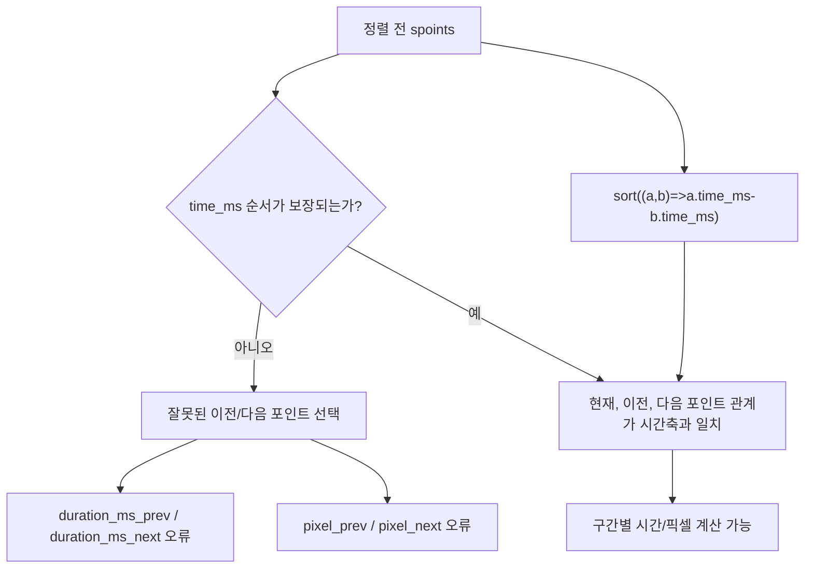

- JavaScript의 기본 `sort()`는 숫자 정렬이 아니라 문자열 기준 정렬이다.
- 예를 들어 `[1, 30, 4, 21, 100000].sort()`는 숫자 크기순이 아니라 문자열 변환 후 UTF-16 순서로 비교한다.
- 그래서 숫자 필드 기준 정렬에는 반드시 비교 함수를 넘기는 것이 안전하다.

```js
[1, 30, 4, 21, 100000].sort();
// [1, 100000, 21, 30, 4] 처럼 숫자 크기순이 아님

[1, 30, 4, 21, 100000].sort((a, b) => a - b);
// [1, 4, 21, 30, 100000]
```

## 3. 핵심 개념

### 표현식 전체를 쪼개서 보기

- `this`: 현재 `__CONTENT_DATA` 인스턴스.
- `this.contentData`: 생성자에서 받은 콘텐츠 데이터 객체.
- `this.contentData.spoints`: 콘텐츠 데이터 안의 포인트 배열.
- `.sort(...)`: 배열을 제자리에서 정렬하는 메서드.
- `(a, b) => a.time_ms - b.time_ms`: 두 원소 `a`, `b`의 순서를 숫자 차이로 판단하는 arrow function.

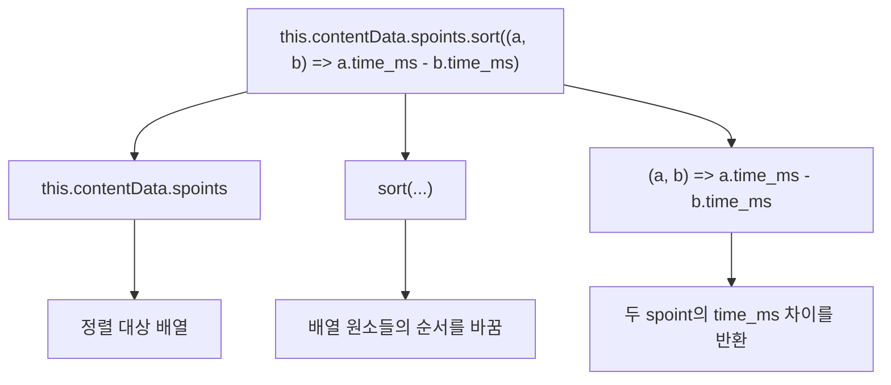

### `sort(compareFn)`의 비교 규칙

- `sort()`는 배열 안의 원소 두 개를 비교 함수에 넣어 본다.
- 비교 함수는 숫자를 반환해야 한다.
- 반환값이 음수이면 `a`가 `b`보다 앞에 온다.
- 반환값이 양수이면 `a`가 `b`보다 뒤에 온다.
- 반환값이 `0`이면 두 값의 정렬 기준이 같다고 본다.

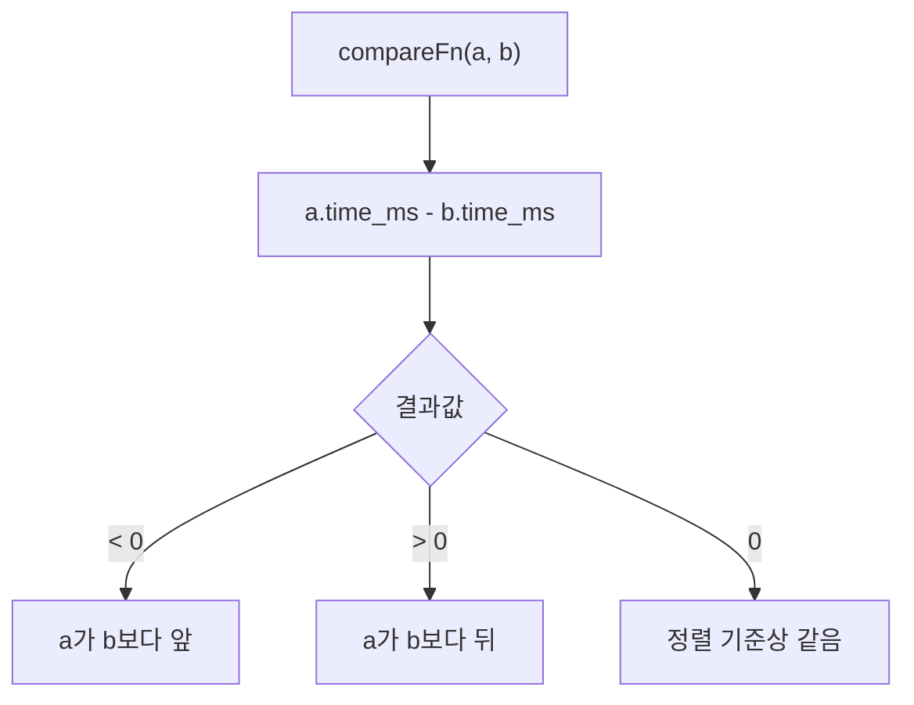

### 왜 `a.time_ms - b.time_ms`가 오름차순인가

- `a.time_ms`가 더 작으면 결과가 음수다.
- 음수이면 `a`가 앞에 온다.
- 따라서 작은 `time_ms`가 앞에 쌓인다.
- 결과적으로 배열은 `time_ms` 기준 오름차순이 된다.

```js
const a = { time_ms: 1000 };
const b = { time_ms: 3000 };

a.time_ms - b.time_ms; // -2000
// 음수이므로 a가 b보다 앞
```

## 4. 실행 흐름과 내부 동작

### `sort()`가 호출되는 흐름

- `calcSpoints()`가 호출된다.
- `this.contentData.spoints` 배열을 찾는다.
- 배열의 `sort()` 메서드를 호출한다.
- JavaScript 엔진이 정렬 알고리즘을 실행하면서 배열 원소들을 여러 번 비교한다.
- 비교가 필요할 때마다 `(a, b) => a.time_ms - b.time_ms`를 호출한다.
- 정렬이 끝나면 `spoints` 원본 배열의 순서가 시간순으로 바뀐다.
- 그 상태에서 `for` 루프가 실행된다.

```mermaid
sequenceDiagram
    participant Method as "calcSpoints()"
    participant Array as "spoints 배열"
    participant Sort as "sort()"
    participant Compare as "compareFn(a,b)"
    participant Loop as "for 루프"

    Method->>Array: "this.contentData.spoints 접근"
    Method->>Sort: "sort((a,b)=>a.time_ms-b.time_ms)"
    Sort->>Compare: "두 spoint 비교"
    Compare-->>Sort: "음수/양수/0 반환"
    Sort->>Array: "원본 배열 순서 변경"
    Method->>Loop: "정렬된 배열 기준으로 이전/다음 계산"
```

### 정렬 전후 예시

```js
const spoints = [
    { time_ms: 3000, top: 120 },
    { time_ms: 1000, top: 20 },
    { time_ms: 2000, top: 80 },
];

spoints.sort((a, b) => a.time_ms - b.time_ms);

console.log(spoints);
// [
//   { time_ms: 1000, top: 20 },
//   { time_ms: 2000, top: 80 },
//   { time_ms: 3000, top: 120 },
// ]
```

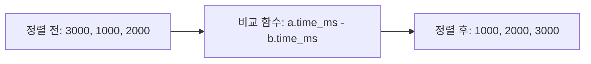

### 현재 코드의 다음 계산과 연결

- 정렬 후 `current_spoint`와 `next_spoint`는 시간상 현재 마커와 다음 마커가 된다.
- `duration_ms_next`는 다음 마커까지 걸리는 시간이다.
- `pixel_next`는 다음 마커까지 이동해야 하는 화면 위치 차이다.
- 첫 번째 마커는 이전 마커가 없으므로 `duration_ms_prev`를 자기 `time_ms`로 둔다.
- 두 번째 마커부터는 바로 앞 마커와의 차이를 계산한다.

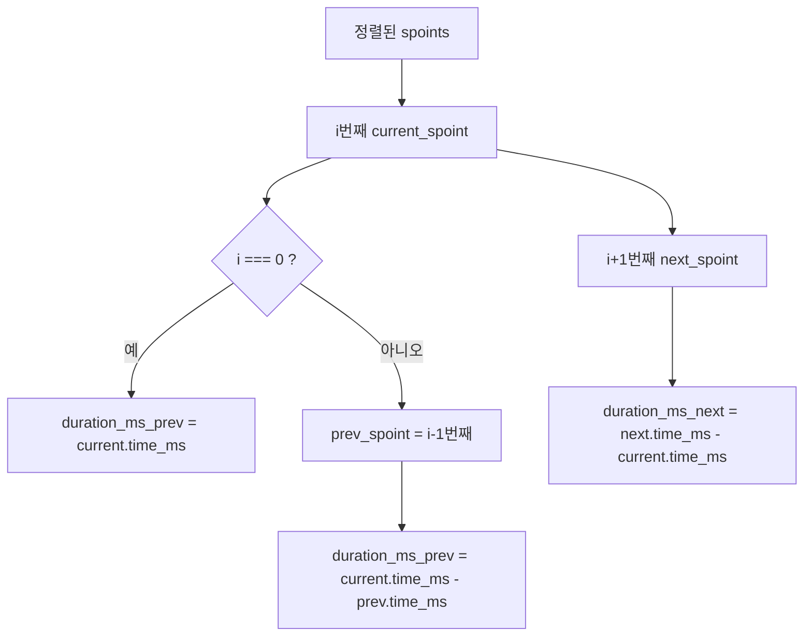

## 5. 중요한 디테일, 예외, 트레이드오프

### `sort()`는 원본 배열을 직접 바꾼다

- `sort()`는 새 배열을 만들어 반환하는 메서드가 아니다.
- 같은 배열 객체의 내부 순서를 바꾼다.
- 반환값도 정렬된 같은 배열 참조다.
- 따라서 아래 두 변수는 같은 배열을 가리킨다.

```js
const sorted = this.contentData.spoints.sort((a, b) => a.time_ms - b.time_ms);

console.log(sorted === this.contentData.spoints); // true
```

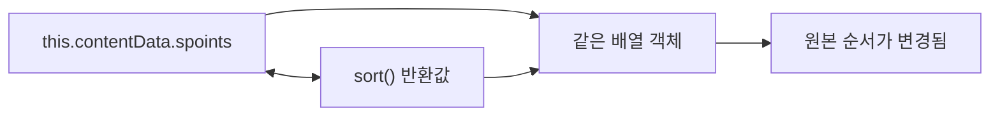

- 현재 `calcSpoints()`에서는 이 동작이 자연스럽다.
- 뒤쪽 루프가 정렬된 `this.contentData.spoints`를 그대로 사용해야 하기 때문이다.
- 반대로 원본 순서를 보존해야 한다면 `toSorted()` 또는 얕은 복사 후 `sort()`를 써야 한다.

```js
const sorted = this.contentData.spoints.toSorted((a, b) => a.time_ms - b.time_ms);
// 또는
const sorted = [...this.contentData.spoints].sort((a, b) => a.time_ms - b.time_ms);
```

### 비교 함수는 순수해야 한다

- 정렬 알고리즘은 비교 함수를 몇 번, 어떤 순서로 호출할지 구현에 따라 달라질 수 있다.
- 비교 함수 안에서 배열이나 외부 상태를 바꾸면 결과가 예측하기 어려워진다.
- 좋은 비교 함수는 같은 `a`, `b`에 대해 항상 같은 숫자를 반환해야 한다.

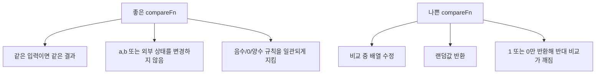

- 현재 코드의 `(a, b) => a.time_ms - b.time_ms`는 단순히 숫자 차이를 반환하므로 좋은 비교 함수에 가깝다.
- 단, `time_ms`가 숫자라는 전제가 깨지면 결과가 흔들린다.

### `time_ms`가 없거나 숫자가 아니면 생기는 문제

- `a.time_ms` 또는 `b.time_ms`가 `undefined`이면 뺄셈 결과가 `NaN`이 된다.
- MDN 기준으로 비교 함수가 `0` 또는 `NaN`을 반환하면 두 원소는 같은 순서로 취급된다.
- 하지만 많은 값이 `NaN`을 만들면 정렬 기준이 사실상 무너진다.
- `time_ms`가 문자열 숫자라면 뺄셈에서 숫자로 변환될 수 있지만, `"abc"` 같은 문자열은 `NaN`이 된다.

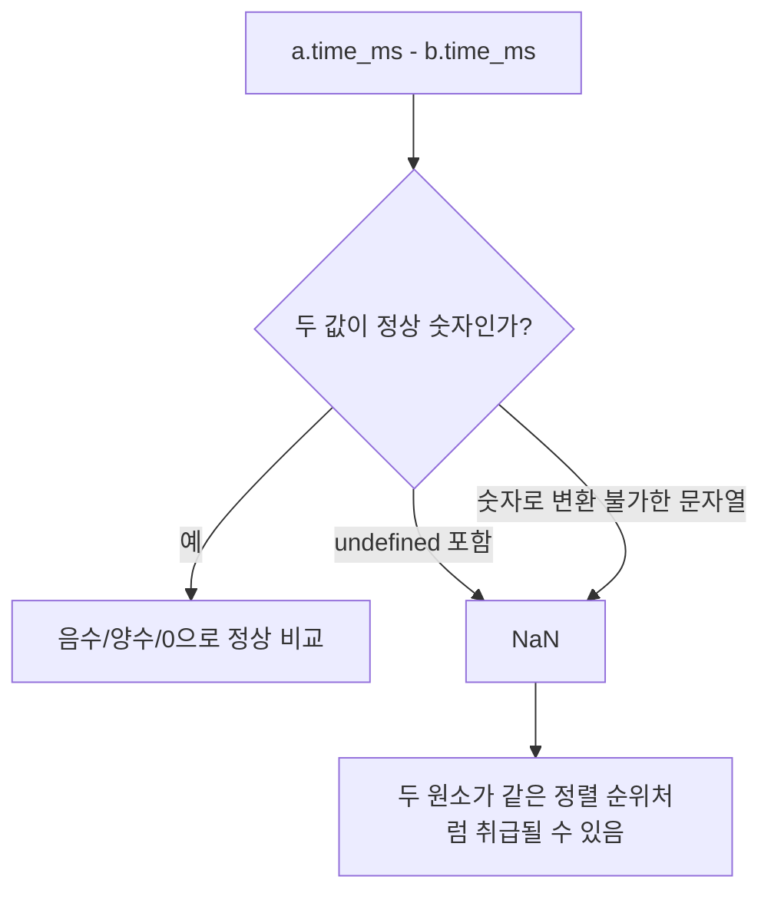

```js
({ time_ms: undefined }).time_ms - ({ time_ms: 1000 }).time_ms;
// NaN
```

- 데이터가 불확실하다면 정렬 전에 검증하거나 기본값을 정해야 한다.

```js
this.contentData.spoints.sort((a, b) => {
    const timeA = Number(a.time_ms);
    const timeB = Number(b.time_ms);

    if (!Number.isFinite(timeA)) return 1;
    if (!Number.isFinite(timeB)) return -1;
    return timeA - timeB;
});
```

### 안정 정렬과 같은 `time_ms`

- 최신 ECMAScript에서는 `Array.prototype.sort()`가 안정 정렬이어야 한다.
- 안정 정렬은 비교 결과가 같은 원소들의 기존 상대 순서를 유지한다는 뜻이다.
- `time_ms`가 같은 두 `spoint`가 있으면 `a.time_ms - b.time_ms`는 `0`을 반환한다.
- 따라서 같은 시간의 포인트들은 기존 배열에서의 상대 순서가 유지된다.

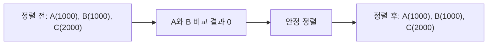

- 같은 `time_ms` 안에서도 `top` 기준으로 한 번 더 정렬하고 싶다면 tie-breaker를 추가한다.

```js
this.contentData.spoints.sort((a, b) => {
    const timeDiff = a.time_ms - b.time_ms;
    if (timeDiff !== 0) return timeDiff;
    return a.top - b.top;
});
```

- 다만 대상 코드에는 `DOBEDUB_UPDATE - 마커 재정렬 차단` 주석과 함께 `top` 기준 정렬이 주석 처리되어 있다.
- 이 주석은 현재 도메인에서는 `top` 순서보다 `time_ms` 순서를 유지하는 것이 더 중요하거나, 마커 위치 기반 재정렬을 의도적으로 막은 맥락이 있음을 시사한다.

## 6. 실전 예시

### 같은 코드를 더 긴 함수로 풀어 쓰기

- 아래 코드는 현재 arrow function과 같은 의미다.
- 짧은 표현이 익숙하지 않다면 이 형태로 먼저 이해하면 된다.

```js
this.contentData.spoints.sort(function compareByTimeMs(a, b) {
    return a.time_ms - b.time_ms;
});
```

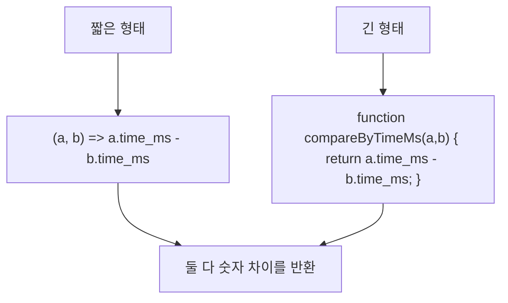

### 오름차순과 내림차순

- 오름차순은 `a - b`다.
- 내림차순은 `b - a`다.
- 객체 배열에서는 기준 필드를 꺼내 똑같이 적용한다.

```js
spoints.sort((a, b) => a.time_ms - b.time_ms); // 오래된 시간부터
spoints.sort((a, b) => b.time_ms - a.time_ms); // 최신 시간부터
```

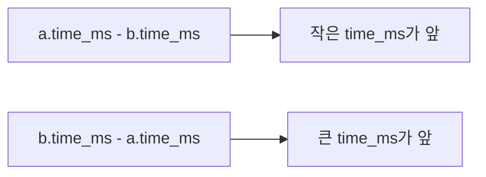

### 현재 `calcSpoints()`를 이해하기 위한 작은 시뮬레이션

```js
const spoints = [
    { time_ms: 2000, top: 80 },
    { time_ms: 0, top: 0 },
    { time_ms: 1000, top: 30 },
];

spoints.sort((a, b) => a.time_ms - b.time_ms);

for (let i = 0; i < spoints.length - 1; i++) {
    const current = spoints[i];
    const next = spoints[i + 1];

    current.duration_ms_next = next.time_ms - current.time_ms;
    current.pixel_next = next.top - current.top;
}

console.log(spoints);
```

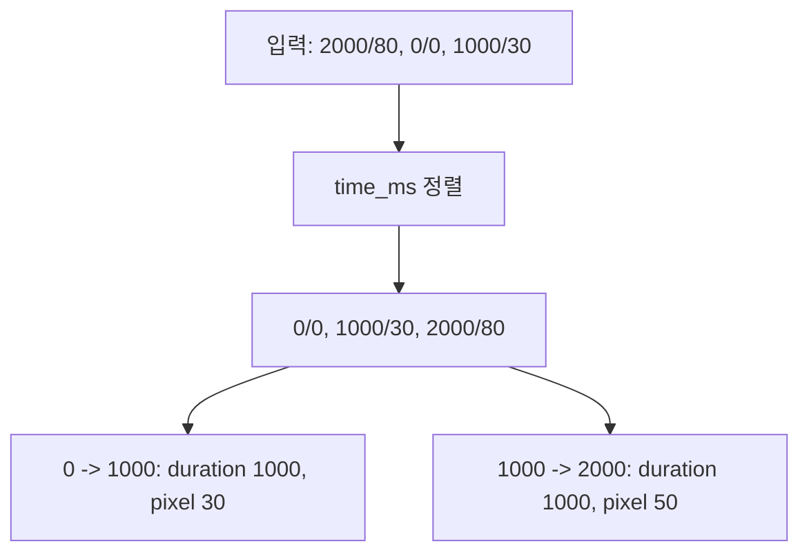

### 안전성을 높인 정렬 헬퍼

- 같은 정렬 기준을 여러 곳에서 쓴다면 이름 있는 함수로 빼는 것도 가능하다.
- 이름이 생기면 정렬 의도가 더 명확해지고 테스트하기도 쉬워진다.

```js
function compareSpointByTimeMs(a, b) {
    return a.time_ms - b.time_ms;
}

this.contentData.spoints.sort(compareSpointByTimeMs);
```

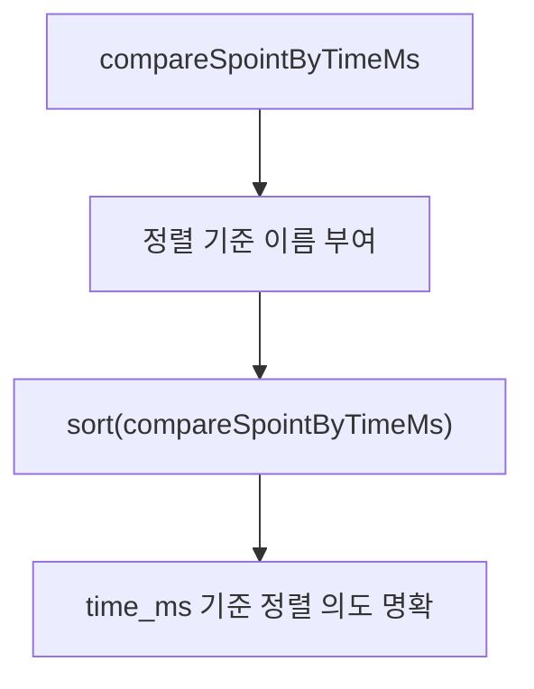

## 7. 용어 정리와 빠른 복습

```mermaid
mindmap
  root((sort comparator))
    "sort()"
      "배열 정렬"
      "원본 배열 변경"
      "같은 배열 참조 반환"
    "compareFn"
      "두 원소 비교"
      "음수면 a 앞"
      "양수면 b 앞"
      "0이면 같은 순위"
    "arrow function"
      "짧은 함수 표현"
      "표현식 본문은 암시적 return"
    "time_ms"
      "숫자 정렬 기준"
      "오름차순이면 a-b"
      "내림차순이면 b-a"
```

- `Array.prototype.sort()`: 배열 원소를 정렬하는 메서드.
- `in-place`: 원본 배열 자체를 바꾼다는 뜻.
- `compareFn`: `sort()`에 넘기는 비교 함수.
- `a`, `b`: 정렬 과정에서 비교되는 배열 원소 두 개.
- `a.time_ms - b.time_ms`: 두 원소의 `time_ms` 차이로 순서를 결정하는 숫자 비교식.
- arrow function: `(a, b) => expression` 형태의 짧은 함수 표현식.
- 암시적 반환: arrow function에서 `{}` 없이 표현식만 쓰면 그 표현식 값이 자동 반환되는 동작.
- 안정 정렬: 비교 결과가 같은 원소들의 기존 상대 순서를 유지하는 정렬.
- tie-breaker: 첫 번째 기준이 같을 때 사용하는 두 번째 정렬 기준.
- `toSorted()`: 원본 배열을 바꾸지 않고 정렬된 새 배열을 반환하는 최신 배열 메서드.

### 이 코드 기준으로 기억할 것

- `this.contentData.spoints.sort(...)`는 `spoints` 원본 배열을 직접 시간순으로 바꾼다.
- `(a, b) => a.time_ms - b.time_ms`는 `time_ms`가 작은 객체를 앞에 둔다.
- `sort()`의 기본 동작은 문자열 기준이므로 숫자 정렬에는 비교 함수가 필요하다.
- `calcSpoints()`는 정렬된 순서를 전제로 이전/다음 포인트의 시간 차이와 위치 차이를 계산한다.
- `time_ms`가 없거나 숫자가 아니면 비교 결과가 `NaN`이 될 수 있으므로 데이터 계약이 중요하다.

## 참고 링크

- [MDN - Array.prototype.sort()](https://developer.mozilla.org/en-US/docs/Web/JavaScript/Reference/Global_Objects/Array/sort)
- [MDN - Arrow function expressions](https://developer.mozilla.org/en-US/docs/Web/JavaScript/Reference/Functions/Arrow_functions)
- [ECMAScript Language Specification - Array.prototype.sort](https://tc39.es/ecma262/multipage/indexed-collections.html#sec-array.prototype.sort)
- [대상 코드 - content.util.js](../../dobedub/dubright_front/src/js/content.util.js)
