# JavaScript `constructor` 상세 노트

## 1. 한 줄 요약

- JavaScript 클래스의 `constructor`는 `new ClassName(...)`로 인스턴스를 만들 때 가장 먼저 실행되는 초기화 전용 메서드이며, 인자로 받은 외부 데이터를 `this`에 연결하고 이후 메서드들이 기대하는 객체 형태를 보장하는 진입점이다.

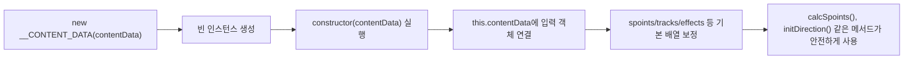

- 대상 코드의 핵심은 `contentData` 원본 객체를 클래스 인스턴스가 다루는 내부 상태로 삼고, 누락될 수 있는 배열 필드를 빈 배열로 채워 이후 메서드의 `forEach`, `sort`, `push`, `filter` 호출이 터지지 않게 만드는 것이다.

```js
class __CONTENT_DATA {
    constructor(contentData) {
        this.contentData = contentData;
        if (this.contentData.spoints === undefined) this.contentData.spoints = [];
        if (this.contentData.tracks === undefined) this.contentData.tracks = [];
        if (this.contentData.effects === undefined) this.contentData.effects = [];
        if (this.contentData.audio_tracks === undefined) this.contentData.audio_tracks = [];
        if (this.contentData.images === undefined) this.contentData.images = [];
        if (this.contentData.scripts === undefined) this.contentData.scripts = [];
        if (this.contentData.script_characters === undefined) this.contentData.script_characters = [];
    }
}
```

## 2. 왜 중요한가

- `constructor`는 클래스의 사용 계약을 한곳에 모으는 장치다.
- 클래스 사용자는 보통 아래처럼 인스턴스를 만든 뒤 바로 메서드를 호출한다.

```js
const content = new __CONTENT_DATA(rawContentData);
content.calcSpoints();
content.initDirection();
```

- 이때 `rawContentData.spoints`가 없으면 `calcSpoints()`의 `this.contentData.spoints.sort(...)`에서 바로 `TypeError`가 난다.
- `rawContentData.tracks`가 없으면 `addTrack()`의 `this.contentData.tracks.push(track)`에서 바로 실패한다.
- 그래서 `constructor`에서 "이 클래스가 정상 동작하기 위해 필요한 최소 형태"를 미리 만든다.

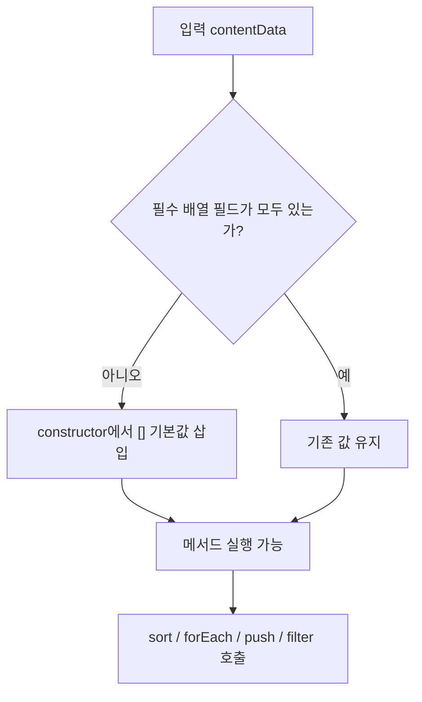

- 특히 이 파일의 `__CONTENT_DATA`는 비즈니스 데이터를 감싸는 래퍼 클래스에 가깝다.
- 래퍼 클래스에서 생성자는 단순히 값을 저장하는 곳을 넘어, "이후 모든 메서드가 믿고 사용할 수 있는 데이터 형태"를 만드는 곳이다.

## 3. 핵심 개념

### `class`, 인스턴스, `constructor`

- `class`는 객체를 만들기 위한 템플릿이다.
- `new __CONTENT_DATA(contentData)`를 호출하면 JavaScript 엔진은 새 객체를 만들고, 그 객체를 `this`로 삼아 `constructor(contentData)`를 실행한다.
- `constructor` 안에서 `this.contentData = contentData`를 하면 새 인스턴스에 `contentData`라는 프로퍼티가 생긴다.
- 이후 클래스 내부 메서드에서 `this.contentData`로 같은 값을 계속 접근한다.

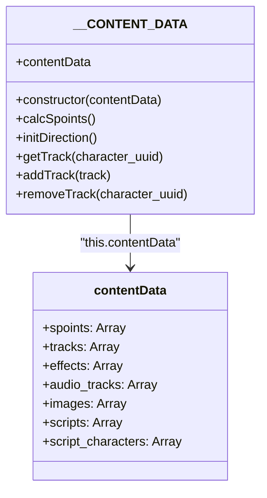

### `this`의 의미

- `constructor` 내부의 `this`는 지금 만들어지는 인스턴스를 가리킨다.
- 대상 코드에서 `this.contentData`는 클래스 자체의 전역 상태가 아니라, 특정 인스턴스가 들고 있는 상태다.
- 같은 클래스로 두 개의 인스턴스를 만들면 각 인스턴스의 `this.contentData`는 서로 다를 수 있다.

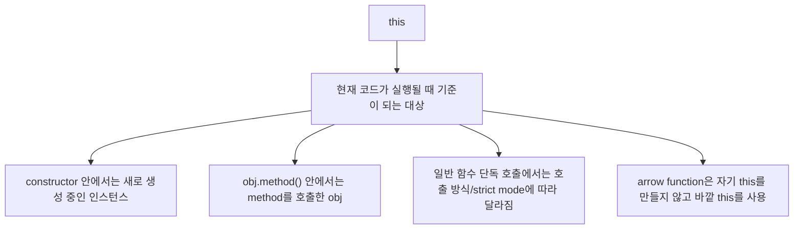

- `this`는 "이 코드가 지금 어느 객체를 기준으로 실행되고 있는가"를 나타내는 특별한 키워드다.
- 일반 변수처럼 개발자가 `const this = ...` 형태로 선언하는 값이 아니다.
- JavaScript 엔진이 함수나 메서드를 실행할 때 자동으로 정해주는 숨은 실행 문맥에 가깝다.
- 그래서 `this`의 핵심은 "어디에 작성됐는가"보다 "어떻게 호출됐는가"다.

```js
const obj = {
    name: "content wrapper",
    printName() {
        console.log(this.name);
    },
};

obj.printName(); // "content wrapper"

const detached = obj.printName;
detached(); // strict mode에서는 this가 undefined가 될 수 있음
```

- 위 예시에서 `printName` 함수의 코드 자체는 똑같다.
- `obj.printName()`처럼 객체를 통해 호출하면 `this`는 `obj`가 된다.
- `detached()`처럼 함수만 떼어서 호출하면 더 이상 `obj`를 기준으로 호출한 것이 아니므로 `this`가 달라진다.
- 클래스 메서드도 이 규칙을 따른다.
- 다만 클래스 본문은 항상 strict mode로 실행되므로, 메서드를 떼어서 단독 호출하면 `this`가 전역 객체로 자동 보정되지 않고 `undefined`가 되기 쉽다.

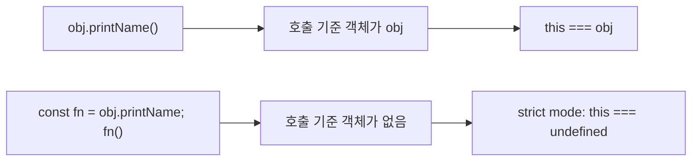

- `constructor`에서는 상황이 조금 더 명확하다.
- 클래스 생성자는 반드시 `new`로 호출되며, `new`가 새 인스턴스를 만든 뒤 그 인스턴스를 `this`로 넣어준다.
- 그래서 `new __CONTENT_DATA(raw)`가 실행될 때 `constructor` 내부의 `this`는 방금 만들어진 `__CONTENT_DATA` 인스턴스다.
- `this.contentData = contentData`는 "새 인스턴스에 `contentData`라는 프로퍼티를 만들고, 거기에 생성자 인자로 받은 객체를 넣는다"는 뜻이다.

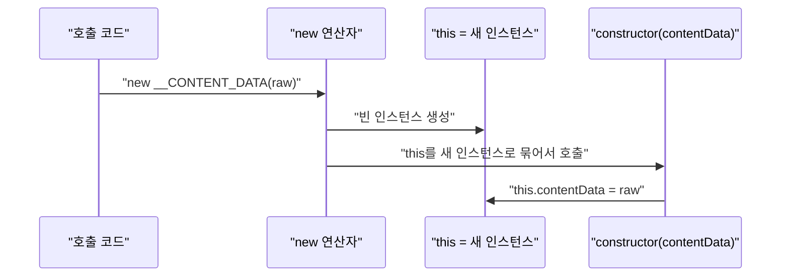

- 이 파일에서 `this.contentData.spoints`를 해석하면 아래와 같다.

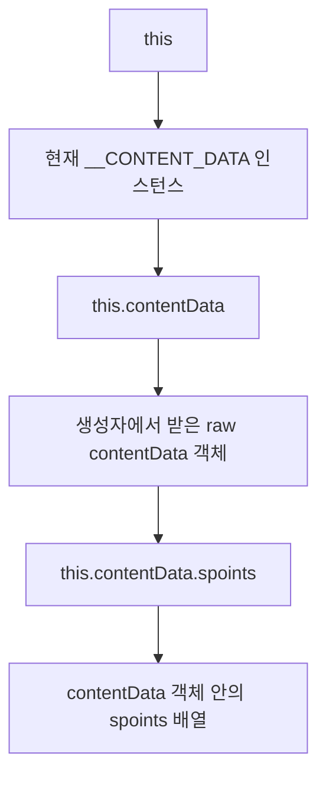

- 따라서 `this.contentData.spoints = []`는 "`this`라는 변수에 배열을 넣는다"가 아니다.
- 정확히는 "현재 인스턴스가 들고 있는 `contentData` 객체의 `spoints` 프로퍼티에 빈 배열을 넣는다"는 뜻이다.
- `this`를 빼고 `contentData.spoints = []`라고 쓸 수도 있지만, 생성자가 끝난 뒤 다른 메서드에서는 `contentData` 매개변수가 사라진다.
- 그래서 `calcSpoints()`, `initDirection()`, `addTrack()` 같은 메서드들은 생성자에서 저장해 둔 `this.contentData`를 통해 같은 데이터를 계속 사용한다.

```js
const a = new __CONTENT_DATA({ scripts: [] });
const b = new __CONTENT_DATA({ scripts: [{ uuid: "s1" }] });

console.log(a.contentData.scripts.length); // 0
console.log(b.contentData.scripts.length); // 1
```

### `constructor` 메서드의 문법적 특징

- 클래스 안에는 특별한 이름 `constructor`를 가진 메서드를 최대 하나만 둘 수 있다.
- `constructor`는 getter, setter, async 함수, generator 함수가 될 수 없다.
- 직접 작성하지 않으면 기본 생성자가 자동으로 제공된다.
- 일반 클래스의 기본 생성자는 사실상 비어 있는 `constructor() {}`처럼 동작한다.
- `extends`로 부모 클래스를 상속한 클래스의 기본 생성자는 부모 생성자에 인자를 넘기는 형태로 동작한다.

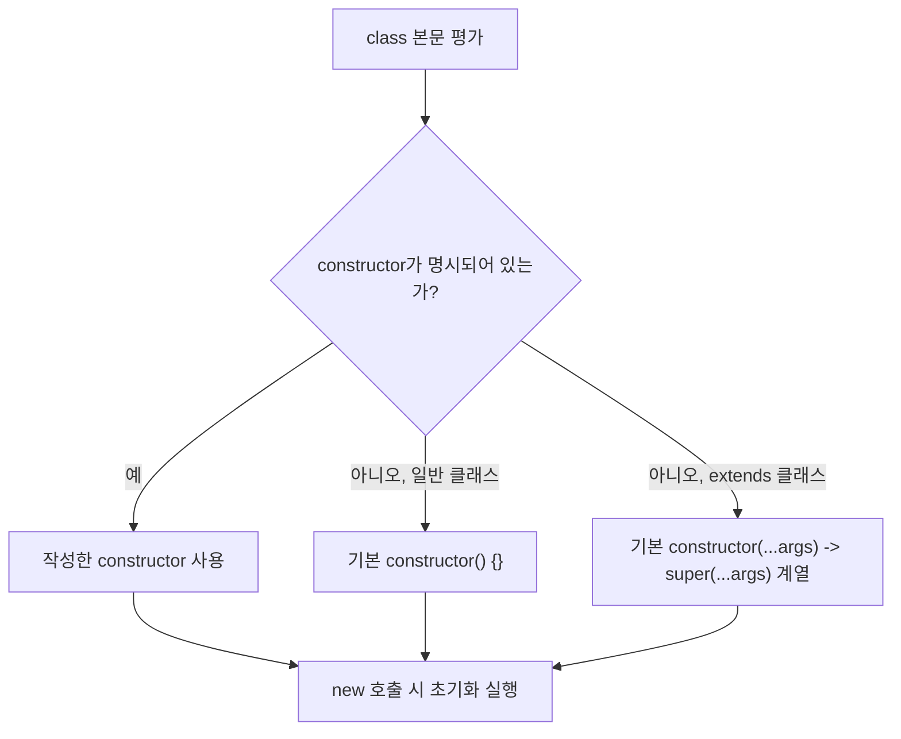

## 4. 실행 흐름과 대상 코드 해석

### `new __CONTENT_DATA(contentData)` 실행 순서

- 사용자가 `new`를 붙여 클래스를 호출한다.
- JavaScript 엔진이 `__CONTENT_DATA.prototype`을 프로토타입으로 갖는 새 객체를 만든다.
- 그 새 객체가 `constructor` 내부의 `this`가 된다.
- 인자로 전달한 `contentData`가 `constructor(contentData)`의 매개변수로 들어온다.
- `this.contentData = contentData`가 실행되며 인스턴스와 외부 객체가 연결된다.
- 이후 `undefined`인 필드가 빈 배열로 초기화된다.
- 생성이 끝난 인스턴스가 반환된다.

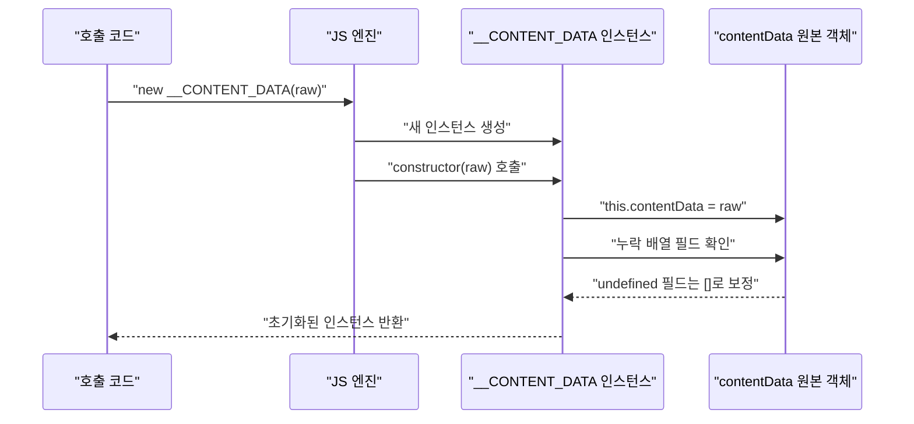

### 이 코드가 원본 객체를 직접 변경한다는 점

- `this.contentData = contentData`는 깊은 복사가 아니다.
- 인스턴스가 별도 사본을 갖는 것이 아니라, 호출자가 넘긴 객체 참조를 그대로 잡는다.
- 따라서 `constructor`에서 `this.contentData.spoints = []`를 하면 원래 넘겨준 `contentData` 객체도 같이 바뀐다.

```js
const raw = {};
const wrapped = new __CONTENT_DATA(raw);

console.log(raw.spoints);              // []
console.log(wrapped.contentData === raw); // true
```


- 이 동작은 의도적일 수 있다.
- 데이터 편집 도구나 콘텐츠 편집기에서는 원본 데이터를 감싼 뒤 같은 객체를 계속 수정하는 방식이 흔하다.
- 다만 "래퍼 내부에서만 보정하고 원본은 유지"해야 하는 요구가 있다면 생성자에서 복사본을 만들어야 한다.

## 5. 중요한 디테일, 예외, 트레이드오프

### `undefined`만 검사하는 의미

- 대상 코드는 `=== undefined`인 경우에만 빈 배열을 넣는다.
- 필드가 아예 없거나 값이 명시적으로 `undefined`면 보정된다.
- 하지만 값이 `null`, 문자열, 객체, 숫자이면 보정되지 않는다.

```js
new __CONTENT_DATA({ spoints: undefined }).contentData.spoints; // []
new __CONTENT_DATA({ spoints: null }).contentData.spoints;      // null
new __CONTENT_DATA({ spoints: "bad" }).contentData.spoints;     // "bad"
```

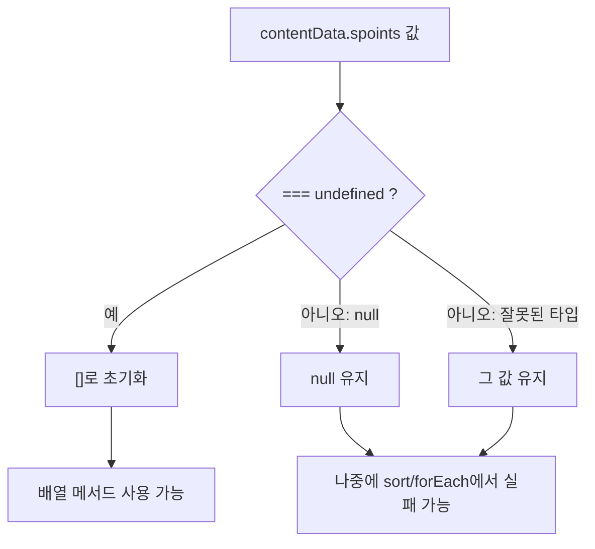

- 즉 현재 생성자는 "누락된 필드 보정"에는 강하지만, "잘못된 타입 검증"까지 하지는 않는다.
- 더 방어적으로 만들려면 `Array.isArray(...)`를 사용할 수 있다.

```js
if (!Array.isArray(this.contentData.spoints)) this.contentData.spoints = [];
```

- 다만 이렇게 바꾸면 `null`이나 잘못된 타입을 조용히 덮어쓴다.
- 데이터 오류를 빨리 발견해야 하는 화면이라면 덮어쓰기보다 예외를 던지는 편이 더 낫다.

### `|| []`, `?? []`, `=== undefined`의 차이

- `a || []`는 falsy 값이면 모두 빈 배열로 바꾼다.
- `a ?? []`는 `null` 또는 `undefined`일 때만 빈 배열로 바꾼다.
- `a === undefined ? [] : a`는 `undefined`만 보정하고 `null`은 그대로 둔다.

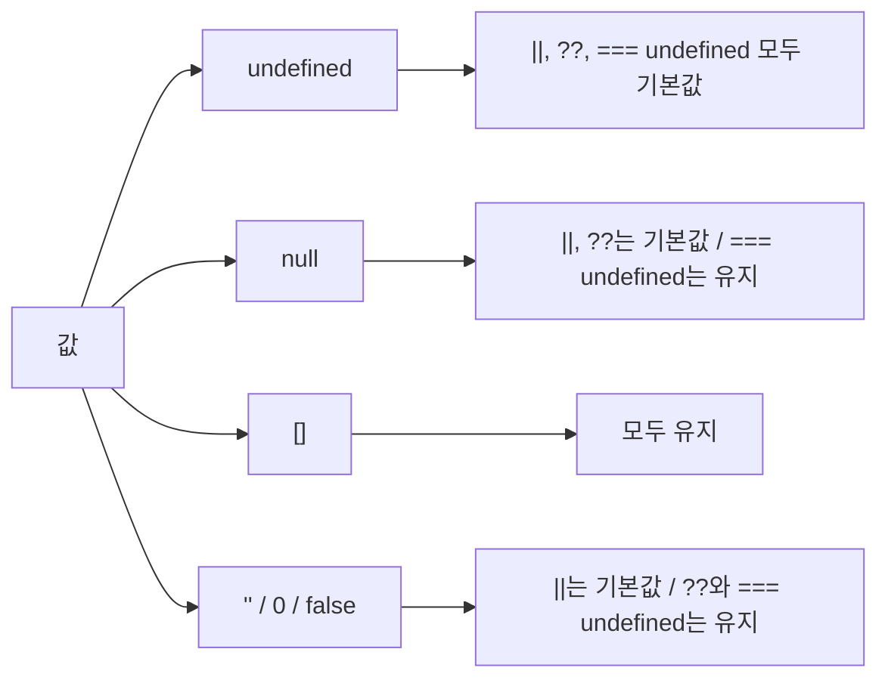

| 패턴 | `undefined` | `null` | `[]` | `""`, `0`, `false` | 의미 |
|---|---:|---:|---:|---:|---|
| `value || []` | `[]` | `[]` | `[]` | `[]` | falsy 값을 전부 기본값 처리 |
| `value ?? []` | `[]` | `[]` | `[]` | 원래 값 | nullish만 기본값 처리 |
| `value === undefined ? [] : value` | `[]` | `null` | `[]` | 원래 값 | undefined만 기본값 처리 |

### 클래스 필드와 생성자 초기화의 차이

- 최신 JavaScript에는 클래스 필드 문법이 있다.

```js
class Example {
    items = [];
    constructor(input) {
        this.input = input;
    }
}
```

- 하지만 대상 코드처럼 "생성자 인자로 받은 객체 내부의 필드"를 보정해야 할 때는 클래스 필드만으로 해결하기 어렵다.
- 클래스 필드는 인스턴스의 직접 프로퍼티를 선언하는 데 적합하고, 생성자는 인자를 사용한 초기화와 검증에 적합하다.

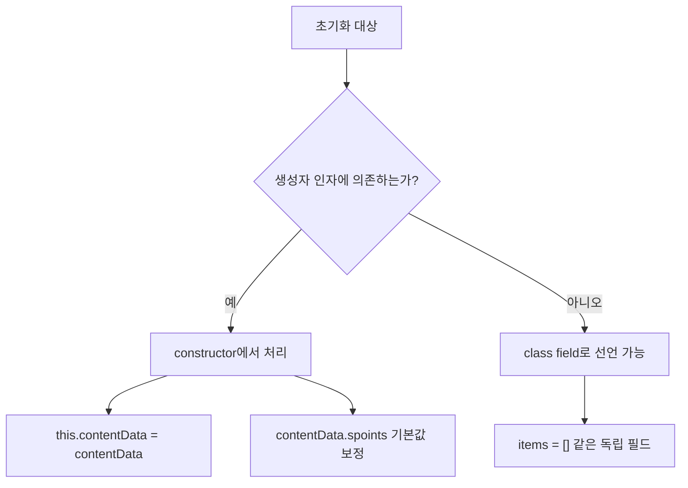

### 상속 클래스의 `constructor`와 `super()`

- `__CONTENT_DATA`는 현재 다른 클래스를 상속하지 않는다.
- 그래서 `constructor` 안에서 바로 `this`를 사용할 수 있다.
- 만약 `class Child extends Parent` 형태라면, 직접 작성한 `constructor` 안에서 `this`를 쓰기 전에 반드시 `super(...)`를 호출해야 한다.

```js
class BaseContentData {
    constructor(contentData) {
        this.contentData = contentData;
    }
}

class ContentDataWithDefaults extends BaseContentData {
    constructor(contentData) {
        super(contentData);
        if (this.contentData.spoints === undefined) this.contentData.spoints = [];
    }
}
```

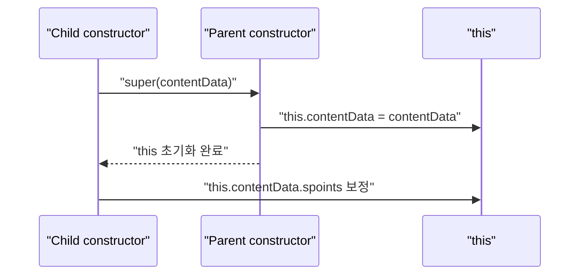

## 6. 실전 예시

### 현재 코드 스타일을 조금 정리한 버전

- 기존 코드와 같은 의미를 유지하면서 반복을 줄이면 아래처럼 쓸 수 있다.
- 이 방식은 필드 목록이 늘어나도 코드가 짧고, 어떤 필드를 기본 배열로 보정하는지 한눈에 보인다.

```js
class __CONTENT_DATA {
    constructor(contentData) {
        this.contentData = contentData;

        [
            "spoints",
            "tracks",
            "effects",
            "audio_tracks",
            "images",
            "scripts",
            "script_characters",
        ].forEach((key) => {
            if (this.contentData[key] === undefined) {
                this.contentData[key] = [];
            }
        });
    }
}
```

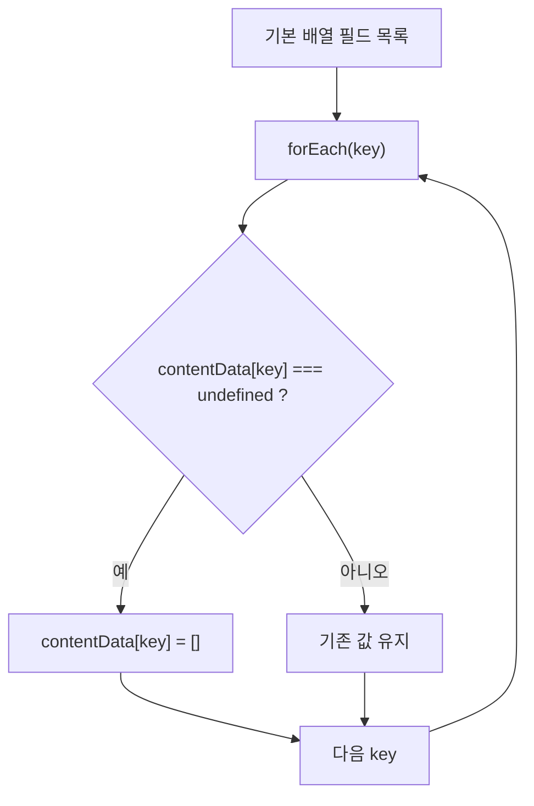

- 단, 이 리팩터링은 코드 모양만 바꾸는 것이다.
- `null`이나 잘못된 타입을 허용하는 기존 동작은 그대로 유지된다.

### 타입까지 방어하는 버전

- 뒤쪽 메서드가 배열 메서드를 반드시 사용한다면 `Array.isArray`로 검증하는 편이 더 안전하다.

```js
class __CONTENT_DATA {
    constructor(contentData) {
        this.contentData = contentData;

        const arrayKeys = [
            "spoints",
            "tracks",
            "effects",
            "audio_tracks",
            "images",
            "scripts",
            "script_characters",
        ];

        arrayKeys.forEach((key) => {
            if (!Array.isArray(this.contentData[key])) {
                this.contentData[key] = [];
            }
        });
    }
}
```

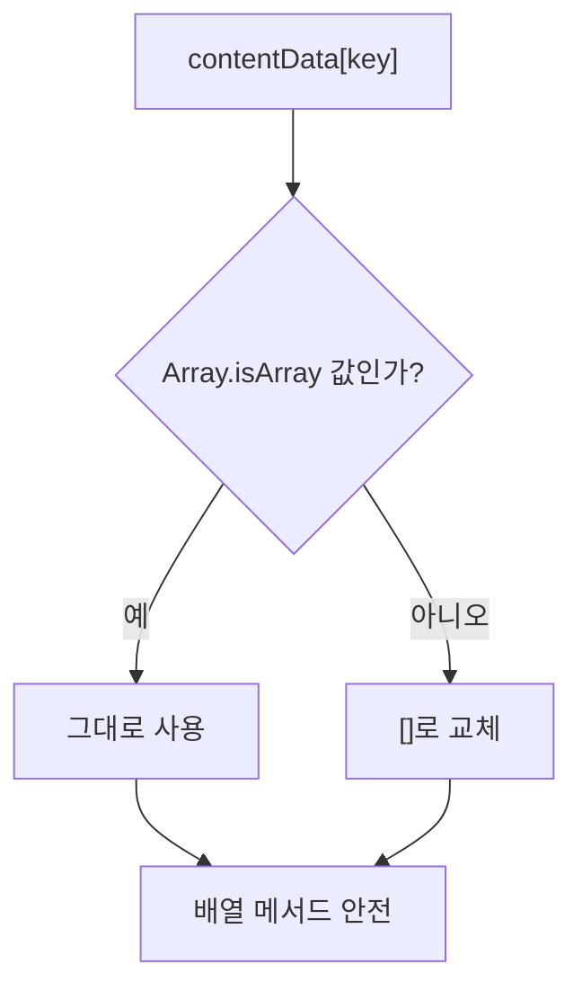

- 이 방식은 런타임 오류를 줄이지만, 원본 데이터가 잘못 들어왔다는 신호를 숨길 수 있다.
- 데이터 품질을 엄격히 관리해야 한다면 아래처럼 오류를 던지는 방식도 선택할 수 있다.

```js
if (this.contentData.spoints === undefined) {
    this.contentData.spoints = [];
} else if (!Array.isArray(this.contentData.spoints)) {
    throw new TypeError("contentData.spoints must be an array");
}
```

### `contentData` 자체가 없을 때

- 현재 생성자는 `contentData` 자체가 `undefined`이면 실패한다.

```js
new __CONTENT_DATA(undefined); // this.contentData.spoints 접근 시 TypeError
```

- 호출자가 항상 객체를 넘기는 계약이라면 괜찮다.
- 외부 API 응답이나 저장된 JSON처럼 불확실한 입력을 받는다면 생성자 앞부분에서 방어할 수 있다.

```js
constructor(contentData = {}) {
    this.contentData = contentData;
    if (this.contentData.spoints === undefined) this.contentData.spoints = [];
}
```

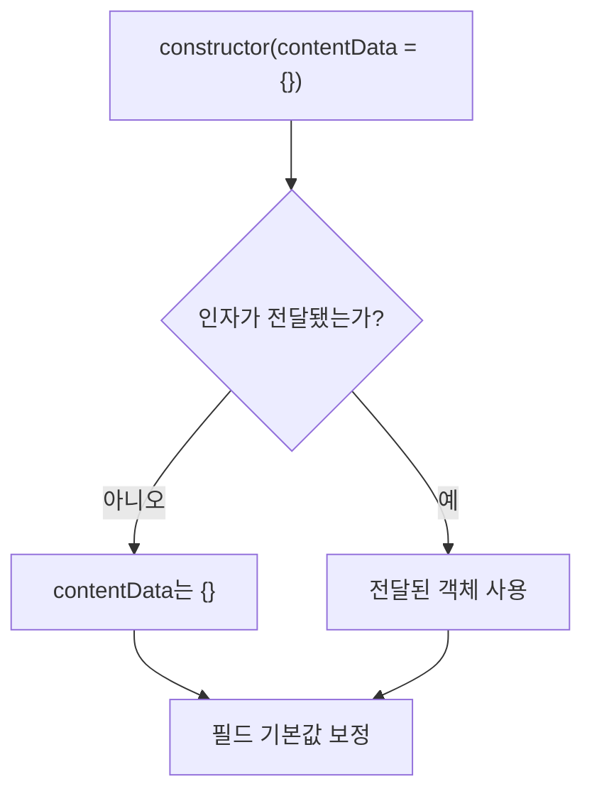

## 7. 용어 정리와 빠른 복습

```mermaid
mindmap
  root((constructor))
    "new"
      "인스턴스 생성"
      "생성자 호출"
    "this"
      "현재 인스턴스"
      "상태 저장 위치"
    "초기화"
      "인자 저장"
      "기본값 보정"
      "검증"
    "상속"
      "extends"
      "super() 먼저 호출"
    "주의점"
      "원본 객체 참조"
      "undefined/null 차이"
      "잘못된 타입 검증"
```

- `class`: 객체를 만들기 위한 템플릿.
- `instance`: `new`로 만들어진 실제 객체.
- `constructor`: 인스턴스를 만들고 초기화할 때 실행되는 클래스 내부의 특별한 메서드.
- `this`: 현재 생성 중이거나 메서드를 호출한 인스턴스.
- `new`: 클래스나 생성자 함수를 호출해 새 객체를 만드는 연산자.
- `prototype`: 인스턴스가 공유 메서드를 찾을 때 따라가는 객체 연결 구조.
- `default constructor`: 직접 생성자를 쓰지 않았을 때 엔진이 제공하는 기본 생성자.
- `super()`: 상속받은 클래스의 생성자를 호출하는 문법.
- `class field`: 생성자 밖 클래스 본문에서 인스턴스 필드를 선언하는 문법.
- `undefined`: 값이 할당되지 않았거나 프로퍼티가 없을 때 주로 나타나는 값.
- `null`: 개발자가 "값 없음"을 명시적으로 넣은 값.

### 이 파일 기준으로 기억할 것

- `__CONTENT_DATA`의 생성자는 `contentData`를 복사하지 않고 참조한다.
- 생성자는 `spoints`, `tracks`, `effects`, `audio_tracks`, `images`, `scripts`, `script_characters`가 없을 때만 빈 배열로 채운다.
- 이 초기화 덕분에 뒤쪽 메서드들이 배열 메서드를 비교적 안전하게 호출할 수 있다.
- 현재 구현은 누락 필드 보정용이지, 타입 검증용은 아니다.
- 생성자는 클래스의 "객체 사용 전 준비 단계"라고 이해하면 된다.

## 참고 링크

- [MDN - `constructor`](https://developer.mozilla.org/en-US/docs/Web/JavaScript/Reference/Classes/constructor)
- [MDN - Classes](https://developer.mozilla.org/en-US/docs/Web/JavaScript/Reference/Classes)
- [MDN - Using classes](https://developer.mozilla.org/en-US/docs/Web/JavaScript/Guide/Using_classes)
- [MDN - Public class fields](https://developer.mozilla.org/en-US/docs/Web/JavaScript/Reference/Classes/Public_class_fields)
- [MDN - `this`](https://developer.mozilla.org/docs/Web/JavaScript/Reference/Operators/this)
- [ECMAScript 2026 - Class Definitions](https://tc39.es/ecma262/2026/multipage/ecmascript-language-functions-and-classes.html#sec-class-definitions)
- [ECMAScript 2026 - InitializeInstanceElements / DefineField](https://tc39.es/ecma262/2026/multipage/abstract-operations.html#sec-initializeinstanceelements)
- [대상 코드 - content.util.js](../../dobedub/dubright_front/src/js/content.util.js)

<!-- study-links:start -->
## 관련 문서

- `상세 노트`: [[javascript-array-sort-comparator/javascript-array-sort-comparator|JavaScript 배열 `sort((a, b) => a.time_ms - b.time_ms)` 상세 노트]]
- `상속`: [[정보처리기사/1과목 소프트웨어 설계/034 상속(Inheritance)/034 상속(Inheritance)|034 상속(Inheritance)]]
<!-- study-links:end -->
