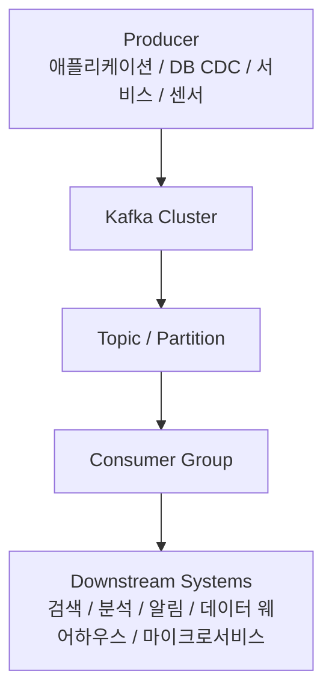
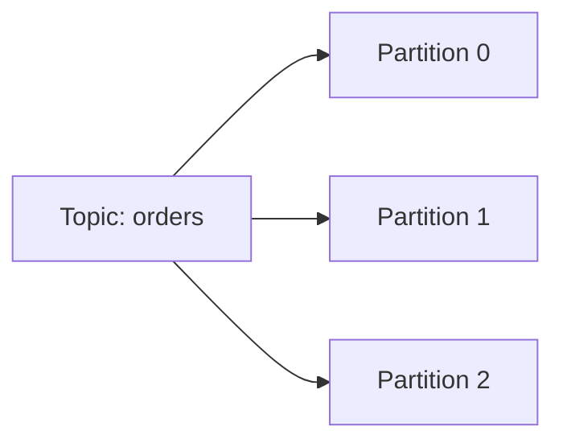
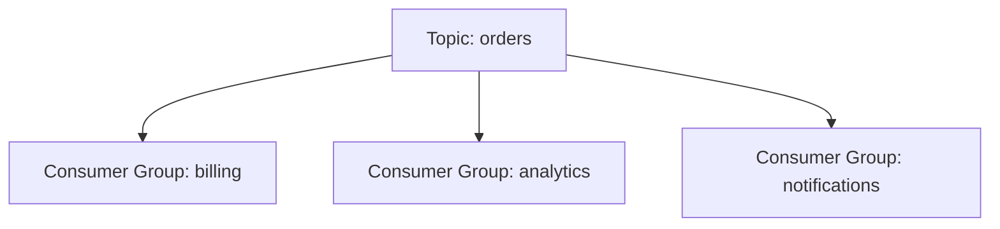

# Kafka 상세 정리

작성 기준일: 2026-04-13  
주요 참고: `kafka.apache.org`, `docs.confluent.io`

## 1. 한 줄 요약

`Apache Kafka`는 대규모 이벤트를 안정적으로 받아서 저장하고, 여러 소비자가 독립적으로 읽고 처리할 수 있게 해주는 `분산 이벤트 스트리밍 플랫폼`이다.

짧게 말하면:

- 로그처럼 이벤트를 쌓고
- 여러 시스템이 그 이벤트를 읽고
- 실시간 처리와 나중 재처리를 모두 지원하는
- 고처리량 분산 메시징/이벤트 저장 시스템

이라고 보면 된다.

---

## 2. 먼저 큰 그림

이 구조에서 중요한 포인트는:

- Kafka는 단순 큐가 아니라 `이벤트 로그 저장소`
- producer와 consumer를 느슨하게 분리
- 소비자는 각자 오프셋을 관리하며 독립적으로 읽을 수 있음

이라는 점이다.

---

## 3. Kafka는 무엇인가

공식 Kafka 소개 문서는 Kafka를 `event streaming platform`으로 설명한다.

핵심 의미:

- 이벤트를 실시간으로 받아서
- durable하게 저장하고
- 여러 소비자가 읽으며
- 실시간 처리와 재처리를 지원

하는 시스템이라는 것이다.

즉 Kafka는:

- 단순 message queue
- 단순 pub/sub
- 단순 로그 저장소

중 하나만이 아니라, 이 셋의 성격을 모두 가진다.

---

## 4. Kafka가 왜 필요한가

현대 시스템은 이벤트가 많다.

예:

- 주문 생성
- 결제 완료
- 사용자 가입
- 로그
- 클릭 이벤트
- 센서 데이터
- DB 변경 데이터

이런 이벤트를 한 번 생성한 뒤:

- 알림 시스템도 쓰고
- 분석 시스템도 쓰고
- 다른 서비스도 쓰고
- 나중에 재처리도 하고 싶다

면 단순 HTTP 호출로는 한계가 있다.

Kafka는 이 문제를 풀기 위해 등장했다.

### 4.1 직접 호출 방식의 문제

예를 들어 주문 서비스가:

- 결제 서비스
- 메일 서비스
- 분석 서비스
- 추천 서비스

를 직접 호출한다고 하자.

문제:

- 결합도가 높아짐
- 한 시스템 장애가 전파됨
- 재처리 어려움
- fan-out 복잡

Kafka는 이걸:

- 이벤트를 먼저 기록
- 각 소비자가 자기 타이밍에 읽음

으로 바꾼다.

---

## 5. Kafka의 핵심 철학

Kafka를 이해할 때 가장 중요한 철학은 `로그(log)`다.

Kafka는 메시지를 "잠깐 전달하고 버리는 것"보다, `append-only log`에 가깝게 생각한다.

즉:

- producer는 이벤트를 기록한다
- consumer는 그 로그를 읽는다

는 관점이 기본이다.

### 5.1 왜 로그 관점이 중요한가

이 덕분에:

- 메시지 재처리 가능
- 여러 consumer가 독립적으로 읽기 가능
- 과거 데이터 replay 가능

즉 Kafka는 queue라기보다 `durable event log`에 더 가깝다.

---

## 6. Kafka의 가장 중요한 구성 요소

Kafka를 공부할 때 먼저 잡아야 하는 단어는 아래다.

- Broker
- Topic
- Partition
- Producer
- Consumer
- Consumer Group
- Offset

---

## 7. Broker

`Broker`는 Kafka 서버 노드다.

Kafka cluster는 여러 broker로 이뤄질 수 있다.

### 7.1 Broker의 역할

- 토픽 데이터 저장
- producer 요청 받기
- consumer 읽기 제공
- replication 참여

### 7.2 하나만 있어도 되나

개발 환경에서는 broker 하나로도 가능하다.

하지만 production에서는 보통 여러 대를 사용한다.

이유:

- 가용성
- 확장성
- 복제

때문이다.

---

## 8. Topic

`Topic`은 이벤트가 기록되는 논리적 이름이다.

예:

- `orders`
- `payments`
- `user-signups`
- `page-views`

### 8.1 Topic은 테이블과 비슷한가

비슷하게 생각할 수는 있지만 완전히 같진 않다.

토픽은:

- 이벤트가 순서대로 append되는 스트림

에 가깝다.

즉 관계형 테이블보다 `이벤트 채널/로그`라는 감각이 더 맞다.

---

## 9. Partition

Kafka를 이해할 때 가장 중요한 개념 중 하나다.

토픽은 여러 `partition`으로 나뉠 수 있다.

### 9.1 왜 파티션이 필요한가

- 병렬 처리
- 확장성
- throughput 향상

### 9.2 중요한 사실

순서는 보통 `토픽 전체`가 아니라 `파티션 내부`에서만 보장된다.

즉:

- 한 토픽에 파티션이 여러 개 있으면
- 전체 전역 순서를 보장한다고 생각하면 안 된다

### 9.3 예시

즉 하나의 토픽도 내부적으로는 여러 로그 조각으로 쪼개진다.

---

## 10. Offset

Kafka에서 메시지를 읽을 때 핵심 위치 정보다.

`offset`은 파티션 안에서 메시지의 위치를 나타낸다.

### 10.1 왜 중요한가

consumer는 offset을 기반으로:

- 어디까지 읽었는지
- 어디서부터 다시 읽을지

를 판단한다.

### 10.2 의미

- offset은 전역 ID가 아니라 `파티션 내부 위치`다

즉:

- partition 0의 offset 10
- partition 1의 offset 10

은 서로 다른 메시지다.

---

## 11. Producer

`Producer`는 Kafka에 데이터를 쓰는 쪽이다.

예:

- 주문 서비스
- 클릭 로그 수집기
- CDC 커넥터

### 11.1 Producer가 하는 일

- topic 선택
- partition 결정
- 메시지 전송
- acks 처리
- 재시도

### 11.2 Key가 중요한 이유

Kafka producer는 메시지 key를 줄 수 있다.

이 key는 보통:

- 어떤 partition에 갈지
- 같은 key가 같은 partition으로 가도록

하는 데 쓰인다.

즉 ordering이 중요하면 key 설계가 중요하다.

예:

- userId를 key로 쓰면 같은 user 이벤트가 같은 partition에 갈 가능성이 높다

---

## 12. Consumer

`Consumer`는 Kafka에서 데이터를 읽는 쪽이다.

예:

- 메일 발송기
- 분석기
- 알림 서비스
- 적재 파이프라인

### 12.1 Consumer의 특징

- 메시지를 pull 기반으로 읽는다
- 자신의 offset을 관리한다

이게 중요하다.

Kafka는 보통:

- broker가 무작정 밀어넣는 push 모델이라기보다
- consumer가 읽는 pull 모델

로 이해하는 편이 맞다.

---

## 13. Consumer Group

Kafka의 매우 중요한 개념이다.

같은 topic을 여러 consumer가 읽더라도, `consumer group`이 다르면 각자 독립적으로 읽을 수 있다.

### 13.1 같은 group

같은 group 안에서는:

- 파티션이 consumer들에게 분산된다
- 같은 메시지를 중복 소비하지 않게 하려는 구조

### 13.2 다른 group

다른 group이면:

- 같은 토픽 데이터를 각 그룹이 독립적으로 다 읽을 수 있다

즉 한 이벤트를:

- 알림 시스템도 읽고
- 분석 시스템도 읽고
- 검색 인덱서도 읽고

싶을 때 매우 유용하다.

### 13.3 시각화

이게 Kafka의 fan-out 핵심이다.

---

## 14. Consumer Group 안에서의 병렬성

같은 consumer group 안에서는:

- 하나의 파티션은 동시에 한 consumer에게만 할당된다

즉:

- 파티션 수가 병렬 처리 최대치와 직접 연결된다

예:

- partition 3개
- consumer 5개

이면, 동시에 일하는 consumer는 최대 3개 수준이다.

즉 파티션 수 설계가 매우 중요하다.

---

## 15. Replication

Kafka는 durability와 availability를 위해 replication을 쓴다.

### 15.1 기본 아이디어

각 파티션은:

- leader replica
- follower replicas

를 가질 수 있다.

### 15.2 왜 중요한가

leader broker가 죽어도:

- follower가 승격되어 계속 서비스 가능

하게 하려는 목적이다.

### 15.3 ISR

Kafka에서 자주 나오는 용어:

- `ISR` = In-Sync Replicas

즉 leader를 충분히 따라잡고 있는 replica 집합이다.

이건 durability와 acks 정책을 이해할 때 중요하다.

---

## 16. acks

Producer가 메시지 전송 후 어느 수준까지 성공으로 볼지 정하는 옵션이다.

대표적으로:

- `acks=0`
- `acks=1`
- `acks=all`

### 16.1 acks=0

- 브로커 응답 기다리지 않음
- 빠르지만 유실 위험 큼

### 16.2 acks=1

- leader가 받으면 성공
- follower 반영 전 장애면 유실 가능

### 16.3 acks=all

- ISR 기준 충분히 반영되면 성공
- 가장 안전한 쪽

### 16.4 tradeoff

즉 acks는:

- 성능
- 지연
- 내구성

의 tradeoff 포인트다.

---

## 17. Kafka가 보장하는 것

Kafka는 강력하지만, 보장 범위를 정확히 알아야 한다.

### 17.1 파티션 내부 순서

- 같은 partition 안에서는 순서가 있다

### 17.2 토픽 전체 전역 순서

- 없다

### 17.3 내구성

- replication/acks 설정에 따라 높일 수 있다

### 17.4 재처리

- offset 기반으로 가능하다

### 17.5 exactly-once

Kafka는 `exactly-once semantics` 관련 기능을 제공하지만, 그냥 자동 마법처럼 되는 건 아니다.

관련 키워드:

- idempotent producer
- transactions

즉 설정과 사용 방식이 중요하다.

---

## 18. Kafka는 큐인가, 로그인가

정답은:

- `큐처럼도 쓸 수 있지만, 본질은 로그에 더 가깝다`

이다.

### 18.1 큐처럼 보이는 이유

- 작업을 넣고
- consumer가 가져가 처리

할 수 있기 때문이다.

### 18.2 로그에 더 가까운 이유

- 메시지가 즉시 삭제되지 않는다
- retention 동안 남는다
- 여러 consumer group이 독립적으로 읽는다
- replay가 가능하다

즉 RabbitMQ 같은 전통 메시지 큐와는 철학이 다르다.

---

## 19. Retention

Kafka의 핵심 개념 중 하나다.

Kafka는 데이터를 forever 저장하는 게 아니라, 보통 retention 정책에 따라 유지한다.

예:

- 7일 보관
- 30일 보관
- 100GB까지 보관

### 19.1 왜 중요한가

Kafka는 무한 저장소가 아니다.

즉:

- 나중에 재처리하려면 retention 내에 있어야 하고
- 데이터 레이크 역할을 완전히 대신하지는 않는다

---

## 20. Compaction

Kafka topic은 일반 retention 외에 `log compaction`도 가능하다.

### 20.1 개념

같은 key에 대해 최신 값만 남기도록 정리하는 방식

### 20.2 적합한 경우

- 최신 상태 테이블 같은 로그
- 사용자 프로필 변경 이벤트
- 설정값 변경 이벤트

즉 "모든 히스토리"보다 "최신 상태 재구성"이 중요한 경우에 유용하다.

---

## 21. Kafka Connect

Kafka 자체 외에 중요한 생태계 구성요소다.

### 21.1 역할

- 외부 시스템과 Kafka를 연결하는 integration framework

예:

- DB -> Kafka
- Kafka -> Elasticsearch
- Kafka -> S3

### 21.2 Source Connector / Sink Connector

- Source: 외부 -> Kafka
- Sink: Kafka -> 외부

즉 Connect는 "코드 안 짜고 데이터 파이프라인 붙이기"에 강하다.

---

## 22. Kafka Streams

또 다른 중요한 구성요소다.

### 22.1 역할

- Kafka 토픽을 읽고 가공해서 다시 Kafka나 다른 결과로 내보내는 스트림 처리 라이브러리

### 22.2 왜 중요한가

Kafka는 단순 저장소가 아니라:

- 처리
- 집계
- 윈도우
- 조인

같은 스트림 처리까지 붙일 수 있다.

즉 이벤트 스트리밍 플랫폼이라는 표현이 여기서 완성된다.

---

## 23. Kafka가 잘 맞는 대표 사례

### 23.1 이벤트 기반 마이크로서비스

- 주문 생성 이벤트
- 결제 완료 이벤트
- 사용자 가입 이벤트

### 23.2 로그 수집

- 앱 로그
- 클릭 로그
- 추적 이벤트

### 23.3 CDC(Change Data Capture)

- DB 변경을 Kafka로 내보내고 downstream에서 처리

### 23.4 실시간 분석 파이프라인

- 이벤트 수집
- 가공
- DW/OLAP 적재

### 23.5 비동기 fan-out

한 서비스의 이벤트를 여러 소비자가 각각 읽어 처리

---

## 24. Kafka가 덜 맞는 경우

### 24.1 단순 작업 큐만 필요할 때

너무 과할 수 있다.

예:

- background job 몇 개
- 단순 retry queue

면 Redis, SQS, RabbitMQ가 더 단순할 수 있다.

### 24.2 운영 복잡도를 감당하기 싫을 때

Kafka는:

- 브로커
- 파티션
- 복제
- consumer lag
- rebalancing

등 운영 개념이 많다.

### 24.3 strict request-response 중심 서비스

Kafka는 비동기/이벤트 중심이라, 동기 RPC 문제와는 결이 다르다.

---

## 25. Kafka에서 자주 생기는 오해

### 25.1 Kafka는 그냥 큐다

아니다.

큐처럼 쓸 수 있지만, durable log와 replay가 핵심이다.

### 25.2 consumer가 읽으면 메시지가 사라진다

보통 그렇지 않다.

retention 동안 남아 있다.

### 25.3 파티션이 많을수록 무조건 좋다

아니다.

- 운영 복잡도
- rebalancing 비용
- 메타데이터 비용

이 늘어난다.

### 25.4 순서는 항상 보장된다

아니다.

파티션 내부 순서만 보장된다고 보는 게 맞다.

### 25.5 exactly-once는 자동이다

아니다.

producer/consumer/transaction 사용 방식까지 맞춰야 한다.

---

## 26. 실무에서 중요한 관찰 포인트

Kafka를 운영할 때 자주 보는 지표/개념:

- consumer lag
- throughput
- partition skew
- ISR 상태
- under-replicated partitions
- rebalance 빈도

즉 Kafka는 단순 라이브러리보다 `운영 시스템`에 가깝다.

---

## 27. Kafka를 공부할 때의 좋은 순서

### 1단계

- broker
- topic
- partition
- producer
- consumer
- consumer group

### 2단계

- offset
- retention
- replication
- acks

### 3단계

- rebalancing
- compaction
- delivery semantics

### 4단계

- Kafka Connect
- Kafka Streams
- CDC architecture

이 순서가 좋다.

왜냐하면 Kafka는 개념이 연결되어 있어서, topic/partition/group을 먼저 이해하지 않으면 뒤가 다 꼬이기 때문이다.

---

## 28. 빠른 복습

- Kafka는 `분산 이벤트 스트리밍 플랫폼`이다.
- 핵심 개념은 `topic`, `partition`, `producer`, `consumer`, `consumer group`, `offset`.
- 순서는 `파티션 내부`에서만 강하게 이해해야 한다.
- 여러 consumer group은 같은 데이터를 독립적으로 읽을 수 있다.
- Kafka는 큐라기보다 `durable log`에 더 가깝다.
- replication, acks, retention, compaction이 운영의 핵심이다.

---

## 29. 참고 링크

- Apache Kafka Introduction: [링크](https://kafka.apache.org/documentation/#introduction)
- Apache Kafka Getting Started Introduction: [링크](https://kafka.apache.org/38/getting-started/introduction/)
- Confluent Kafka Design / Architecture: [링크](https://docs.confluent.io/platform/current/kafka/introduction.html)
- Confluent Producers: [링크](https://docs.confluent.io/platform/current/clients/producer.html)
- Confluent Consumers: [링크](https://docs.confluent.io/platform/current/clients/consumer.html)
- Confluent Consumer Groups: [링크](https://docs.confluent.io/platform/current/clients/consumer.html#consumer-groups)
- Confluent Topic Partitions: [링크](https://docs.confluent.io/platform/current/installation/configuration/topic-configs.html)
- Confluent Kafka Connect: [링크](https://docs.confluent.io/platform/current/connect/index.html)
- Confluent Kafka Streams: [링크](https://docs.confluent.io/platform/current/streams/index.html)

