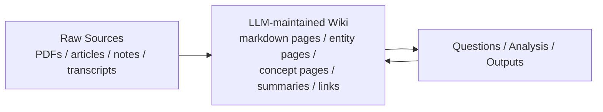
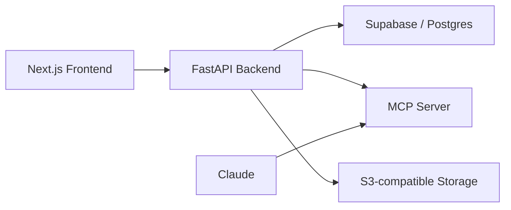

# Karpathy의 LLM Wiki 상세 정리

작성 기준일: 2026-04-13  
주요 참고:

- Andrej Karpathy gist `llm-wiki.md`
- `llmwiki.app`
- `lucasastorian/llmwiki`

## 1. 한 줄 요약

`LLM Wiki`는 Karpathy가 제안한 `개인 지식 베이스 구축 패턴`이다.

핵심은 단순한 `RAG 검색 시스템`과 다르다.

- 일반 RAG는 질문할 때마다 원문에서 다시 찾고 다시 조합한다.
- LLM Wiki는 원문을 읽을 때마다 `지속적으로 누적되는 위키`를 갱신한다.

즉:

- `raw sources -> query-time retrieval -> answer`

가 아니라

- `raw sources -> persistent wiki -> better answers -> wiki update`

로 바꾸는 발상이다.

Karpathy 본문 표현을 압축하면:

- 지식은 매번 재발견되는 것이 아니라
- 한 번 `compiled`되어 구조화되고
- 이후 계속 유지보수되며
- 질의 결과조차 다시 위키에 축적될 수 있다

---

## 2. 이게 왜 화제가 됐는가

Karpathy의 gist가 빠르게 퍼진 이유는 간단하다.

많은 사람이 이미 아래 문제를 느끼고 있었기 때문이다.

- PDF를 업로드해도 매 질문마다 비슷한 검색을 반복한다
- 문서가 많아질수록 맥락 축적이 약하다
- 여러 문서를 엮는 고차원 질의가 불안정하다
- 채팅 세션이 끝나면 분석 결과가 휘발된다
- 위키를 직접 유지보수하는 건 너무 귀찮다

Karpathy의 LLM Wiki는 이 병목을 정확히 겨냥한다.

요지는:

- 인간은 `소스 큐레이션`과 `질문`에 집중
- LLM은 `요약`, `교차참조`, `갱신`, `정리`, `파일링`, `정합성 유지`

를 맡긴다는 것이다.

즉, 인간이 하기 싫어하는 위키 유지보수 노동을 LLM에 위임하는 패턴이다.

---

## 3. 원문에서 가장 중요한 문장들

Karpathy gist에서 핵심만 재구성하면 아래 세 문장으로 압축된다.

### 3.1 핵심 차이

- 기존 RAG는 질문할 때마다 원문에서 다시 지식을 끌어온다
- LLM Wiki는 원문이 들어올 때마다 지식을 `compiled artifact`로 미리 축적한다

### 3.2 persistent, compounding artifact

Karpathy가 가장 강조하는 개념은 위키가 `persistent, compounding artifact`라는 점이다.

즉:

- 지식이 세션마다 사라지지 않고
- 계속 쌓이며
- 새로운 질문과 새로운 소스가 들어올수록
- 위키의 질이 올라간다

### 3.3 인간과 LLM의 역할 분리

Karpathy는 역할을 명확히 나눈다.

- 인간: 소스 선택, 탐색, 판단, 좋은 질문 던지기
- LLM: 요약, 연결, 정리, bookkeeping, cross-reference maintenance

이게 이 패턴의 본질이다.

---

## 4. 일반 RAG와 무엇이 다른가

Karpathy의 gist는 사실상 `RAG 비판`에서 출발한다.

### 4.1 일반적인 RAG의 동작

보통 RAG는 아래 식이다.

1. 문서를 업로드
2. 청크 분할
3. 임베딩 또는 BM25 색인
4. 질문 시 관련 청크 검색
5. LLM이 그 청크들을 조합해 답변

### 4.2 이 방식의 장점

- 구현이 비교적 단순하다
- 작은 지식 베이스에는 충분히 유용하다
- 빠르게 시도할 수 있다

### 4.3 이 방식의 한계

Karpathy가 문제 삼는 부분은 이거다.

- 지식이 `질문 시점`에 매번 다시 구성된다
- 복잡한 다문서 통합이 반복 비용을 발생시킨다
- 이전 질문에서 만든 통찰이 구조물로 남지 않는다
- contradiction 정리, cross-reference 유지, entity page 관리가 없다

즉:

- 매번 `on-demand retrieval`
- 매번 `from scratch synthesis`

가 반복된다.

### 4.4 LLM Wiki 방식

LLM Wiki는 retrieval 이전에 `knowledge compilation layer`를 하나 만든다.

구조는 아래처럼 생각하면 된다.



이 구조의 의미:

- 답변이 raw source에서 직접 나오지 않는다
- 먼저 위키라는 중간층을 통해 구조화된다
- 답변 결과도 다시 위키로 들어갈 수 있다

---

## 5. Karpathy가 제안한 3계층 구조

Karpathy gist의 핵심 아키텍처는 `three layers`다.

### 5.1 Raw Sources

원문 층이다.

예:

- 논문
- 기사
- 메모
- 인터뷰 transcript
- 이미지
- 데이터 파일

Karpathy는 이 층을 `immutable`하게 보라고 말한다.

즉:

- LLM은 raw source를 읽는다
- 하지만 raw source를 수정하지 않는다
- 여기가 source of truth다

이건 매우 중요하다.

왜냐하면 위키가 잘못될 수 있기 때문이다.

위키가 틀릴 경우:

- 항상 원문으로 되돌아갈 수 있어야 한다
- provenance가 유지되어야 한다

### 5.2 The Wiki

이 패턴의 중심이다.

위키 층은:

- markdown 페이지 모음
- entity page
- concept page
- overview
- synthesis
- comparison
- source summary

등으로 구성될 수 있다.

Karpathy는 여기서 중요한 역할 구분을 한다.

- `You read it; the LLM writes it.`

즉:

- 인간은 브라우저/Obsidian에서 읽고
- LLM은 파일을 생성/수정/연결/정리한다

### 5.3 The Schema

Karpathy가 가장 중요하게 보는 설정 층이다.

여기에는 아래가 들어간다.

- 위키 구조 규칙
- 어떤 종류의 페이지를 둘지
- ingest workflow
- query workflow
- lint workflow
- naming convention
- linking convention
- citation convention

즉 schema는 단순 config가 아니라:

- `이 LLM이 generic chatbot이 아니라 disciplined wiki maintainer로 행동하게 만드는 규칙서`

다.

Karpathy는 이걸 `CLAUDE.md` 또는 `AGENTS.md` 같은 파일로 상정한다.

---

## 6. 이 패턴의 핵심 동작 3가지

Karpathy gist는 운영 루프를 `Ingest / Query / Lint` 세 가지로 정리한다.

### 6.1 Ingest

새 소스를 raw collection에 넣고 LLM에게 처리시키는 단계다.

Karpathy가 제안하는 일반 흐름:

1. source 읽기
2. 핵심 takeaway 파악
3. summary page 작성
4. index 업데이트
5. 관련 entity/concept page 수정
6. contradiction 있으면 반영
7. log에 기록

중요한 포인트:

- 한 소스가 `10~15개 페이지`를 동시에 건드릴 수 있다
- source를 하나 넣을 때 끝나는 일이 아니라
- 기존 knowledge graph를 갱신하는 작업이다

### 6.2 Query

사용자가 질문하는 단계다.

Karpathy의 핵심 주장은 이렇다.

- 이미 지식은 위키에 합성되어 있으므로
- 질문 시 raw chunk를 매번 새로 찾는 부담이 줄어든다

여기서 매우 중요한 포인트가 있다.

- 좋은 답변은 그냥 채팅창에서 끝나지 말고
- 새로운 page나 analysis artifact로 다시 위키에 저장될 수 있다

즉 query도 지식 축적 루프의 일부다.

### 6.3 Lint

Karpathy가 넣은 세 번째 동작이 매우 중요하다.

Lint는 위키 health check다.

예시 체크 항목:

- page 간 contradiction
- 오래된 주장
- orphan page
- 중요한 개념인데 page가 없음
- missing cross-reference
- web search로 채울 수 있는 data gap

즉, 위키를 "한 번 만든 뒤 방치하는 것"이 아니라

- 지속적으로 유지보수
- 리팩터링
- 정합성 점검

하는 구조로 본다.

---

## 7. index.md와 log.md의 의미

Karpathy gist는 특별히 두 파일을 강조한다.

### 7.1 index.md

content-oriented catalog다.

역할:

- 위키 전체 페이지 목록
- 각 페이지 1줄 설명
- 카테고리별 정리
- query 시 LLM의 1차 탐색 진입점

Karpathy는 moderate scale에서는 embedding RAG 없이 index 파일만으로도 꽤 잘 작동한다고 본다.

즉:

- 먼저 index 읽기
- relevant page 후보 찾기
- 그 page들을 읽고 답변

이라는 경량 워크플로우가 가능하다는 뜻이다.

### 7.2 log.md

chronological append-only log다.

역할:

- 언제 무엇을 ingest했는지
- 어떤 query를 했는지
- 어떤 lint pass를 돌렸는지
- 위키가 어떻게 진화했는지

를 시간순으로 남긴다.

Karpathy는 로그 항목을 parseable한 일관된 prefix로 두는 팁도 준다.

예:

- `## [2026-04-02] ingest | Article Title`

이렇게 두면 shell 도구로 최근 활동을 뽑아보기 쉽다.

---

## 8. Obsidian이 중요한 이유

Karpathy는 본문에서 자신이:

- 한쪽에는 LLM agent
- 다른 한쪽에는 Obsidian

을 열고 실시간으로 결과를 본다고 말한다.

이건 단순 툴 취향이 아니라, 이 패턴의 UX를 설명하는 핵심이다.

### 8.1 Obsidian의 장점

- markdown 파일 기반
- link graph view
- plugin 생태계
- git과 잘 맞음

### 8.2 왜 적합한가

LLM Wiki는 본질적으로:

- 많은 markdown file
- 링크
- entity page
- concept page
- graph

를 다루기 때문에 Obsidian과 잘 맞는다.

### 8.3 Karpathy의 비유

가장 유명한 표현:

- `Obsidian is the IDE; the LLM is the programmer; the wiki is the codebase.`

이 비유는 정말 정확하다.

즉:

- 인간은 IDE에서 결과물을 inspect한다
- LLM은 code author처럼 파일을 수정한다
- 위키는 관리되는 코드베이스처럼 진화한다

---

## 9. 이 패턴이 특히 잘 맞는 분야

Karpathy gist는 여러 사례를 제안한다.

### 9.1 Personal knowledge / self-tracking

예:

- 건강
- 목표
- 자기 이해
- 저널
- 습관

이 경우 위키는 "자기 자신에 대한 evolving model"이 된다.

### 9.2 Research

가장 자연스러운 use case다.

예:

- 논문 읽기
- 업계 리포트 정리
- 기술 동향 분석
- 장기 주제 탐구

이 경우 위키는 `private research companion`이 된다.

### 9.3 책 읽기

Karpathy는 fan wiki를 예로 든다.

예:

- 인물
- 주제
- 플롯
- 사건
- 배경

을 읽으면서 자동 축적하는 구조다.

### 9.4 팀/비즈니스

예:

- Slack thread
- 회의록
- 프로젝트 문서
- 고객 콜 transcript

를 기반으로 internal wiki를 자동 유지할 수 있다.

다만 여기선 human review가 더 중요해진다.

---

## 10. 이 패턴이 왜 "컴파일"에 가깝다고 보는가

Karpathy의 발상은 단순히 RAG 개선이 아니라, 지식을 `compile`한다고 보는 데 특징이 있다.

왜냐하면:

- raw sources는 source code
- wiki는 compiled artifact
- schema는 build rules
- ingest/lint는 build + maintenance

처럼 해석되기 때문이다.

즉 이 패턴은:

- `retrieval system`

보다는

- `knowledge compilation system`

에 더 가깝다.

이 관점은 중요하다.

왜냐하면 설계 판단이 달라지기 때문이다.

예:

- focus가 vector DB recall이 아니라 page quality에 간다
- query quality보다 ingest quality가 더 중요해진다
- one-off answer보다 reusable artifact가 중요해진다

---

## 11. LLM Wiki의 장점

### 11.1 지식이 누적된다

가장 큰 장점이다.

- 질문할수록
- source를 넣을수록
- 페이지가 richer해진다

### 11.2 synthesis가 미리 되어 있다

복잡한 cross-document synthesis를 매 질문 때마다 다시 하지 않는다.

### 11.3 bookkeeping을 LLM이 담당한다

Karpathy가 가장 강조하는 포인트다.

인간이 위키를 버리는 이유는 읽고 생각하는 게 힘들어서가 아니라:

- 링크 유지
- 페이지 갱신
- 새 정보 반영
- contradiction 기록

같은 bookkeeping이 너무 귀찮기 때문이다.

LLM은 이걸 잘한다.

### 11.4 파일 기반이라 투명하다

markdown + git + folder 구조는 매우 투명하다.

- 버전 관리 가능
- diff 확인 가능
- lock-in 적음
- tool 교체 가능

### 11.5 결과물이 chat history에 묻히지 않는다

좋은 답변과 분석을 위키로 되돌려 넣을 수 있다.

---

## 12. LLM Wiki의 한계와 리스크

이 패턴은 강력하지만, 만능은 아니다.

### 12.1 토큰 비용이 높을 수 있다

소스 하나 넣을 때:

- source 읽기
- summary 작성
- 여러 페이지 수정
- index/log 갱신

을 하면 token 사용량이 커진다.

즉 질의 시점 비용을 ingest 시점 비용으로 앞당기는 구조다.

### 12.2 schema 품질이 매우 중요하다

schema가 약하면:

- 페이지 구조가 뒤죽박죽
- naming convention 불일치
- 링크 구조 혼란
- 스타일 drift

가 발생한다.

즉 generic prompt로는 오래 못 간다.

### 12.3 잘못된 synthesis가 퍼질 수 있다

wiki는 compiled artifact라서:

- 잘못 요약된 정보
- 과도한 일반화
- 근거 부족한 해석

이 여러 페이지에 전파될 수 있다.

그래서 provenance와 citations가 중요하다.

### 12.4 scale이 커지면 search/tooling이 필요하다

Karpathy도 moderate scale에서는 index만으로 충분하지만,

규모가 커지면:

- local search
- hybrid search
- better navigation

이 필요하다고 본다.

그 예로 `qmd`를 언급한다.

### 12.5 완전 자동은 위험하다

Karpathy 본문도 사실상 `human-in-the-loop`를 전제한다.

특히 ingest를 한꺼번에 몰아 돌리면:

- 정밀도 저하
- 지식 왜곡
- 잘못된 page touch

가 생길 수 있다.

---

## 13. Karpathy가 제안한 선택적 도구들

### 13.1 qmd

Karpathy는 위키가 커질 때 사용할 수 있는 local markdown search engine으로 `qmd`를 예로 든다.

이 도구를 언급한 이유는 명확하다.

- small scale: `index.md`로 충분
- larger scale: proper search 필요

즉 llm-wiki는 처음부터 heavy infra를 강제하지 않는다.

### 13.2 Obsidian Web Clipper

웹 기사 ingest를 쉽게 하기 위한 추천 도구다.

### 13.3 이미지 다운로드

Karpathy는 URL 이미지보다 로컬 파일 저장을 권장한다.

이유:

- URL이 깨질 수 있음
- 로컬 이미지면 LLM이 별도로 열어볼 수 있음

### 13.4 Marp

query 결과를 slide deck으로 내보내는 예시 도구다.

즉 output format을 markdown page로 제한하지 않는다.

### 13.5 Dataview

frontmatter를 구조화해서 dynamic query를 돌리려는 경우 유용한 Obsidian plugin이다.

---

## 14. 실전 디렉터리 구조를 어떻게 설계할 수 있나

Karpathy는 구체 구현을 고정하지 않는다.

하지만 gist를 바탕으로 현실적인 구조를 정리하면 대략 아래처럼 갈 수 있다.

```text
llm-wiki/
├── raw/
│   ├── articles/
│   ├── papers/
│   ├── transcripts/
│   └── assets/
├── wiki/
│   ├── overview.md
│   ├── index.md
│   ├── log.md
│   ├── entities/
│   ├── concepts/
│   ├── comparisons/
│   ├── timelines/
│   └── sources/
├── schema/
│   ├── AGENTS.md
│   ├── conventions.md
│   └── workflows.md
└── scripts/
    ├── search.sh
    ├── lint.sh
    └── export.sh
```

핵심은 다음이다.

- raw는 immutable
- wiki는 mutable
- schema는 behavior contract

---

## 15. AGENTS.md 또는 CLAUDE.md에는 무엇이 들어가야 하나

Karpathy는 schema 문서가 중요하다고 말하지만, 구체 항목은 사용자가 만들어야 한다고 한다.

현실적으로는 아래가 들어가야 한다.

### 15.1 페이지 타입

- entity page
- concept page
- source summary
- overview
- comparison
- timeline

### 15.2 naming convention

- 파일명 규칙
- slug 규칙
- entity 표기 방식

### 15.3 citation convention

- source id
- section reference
- quote 길이
- uncertainty 표기

### 15.4 update rules

- 새 source가 들어왔을 때 어떤 page를 업데이트할지
- contradictory claim은 어떻게 표시할지
- stale info는 어떻게 downgrade할지

### 15.5 query output rules

- 답변을 언제 새 page로 저장할지
- 어떤 질문은 ephemeral로 둘지

### 15.6 lint rules

- orphan page 탐지
- missing backlink 탐지
- unsupported claim 탐지

즉 schema는 사실상 `wiki maintenance operating manual`이다.

---

## 16. 이 패턴을 Codex/Claude Code 같은 에이전트와 붙이면 어떻게 되나

Karpathy 본문은 "이 idea file을 네 LLM agent에게 복붙해라"는 구조다.

즉 특정 제품 전용이 아니다.

이 패턴은 다음 유형의 에이전트에 잘 붙는다.

- 파일 수정이 가능한 coding agent
- markdown 디렉터리를 직접 읽고 쓸 수 있는 agent
- shell / search / image view가 가능한 agent

### 16.1 이상적인 능력

- raw source 읽기
- 여러 markdown page 수정
- 링크 삽입
- index/log 관리
- 주기적 lint 실행

### 16.2 좋은 조합

- Codex + Obsidian vault
- Claude Code + markdown repo
- OpenCode / Pi + local wiki repo

즉 "chat-only assistant"보다 "filesystem-aware agent"와 훨씬 잘 맞는다.

---

## 17. llmwiki.app은 무엇인가

Karpathy의 gist는 `아이디어 파일`이다.

즉:

- 공식 제품 문서가 아니라
- pattern description이다

그런데 현재는 이를 구현한 제품/프로젝트가 이미 나왔다.

대표 예가 `llmwiki.app`과 `lucasastorian/llmwiki`다.

### 17.1 llmwiki.app의 자기 설명

홈페이지는 자신을:

- `Open-source implementation of Karpathy's LLM Wiki`

라고 소개한다.

### 17.2 이 구현체가 추가한 것

Karpathy gist가 추상 패턴이라면, 이 구현체는 구체 제품이다.

공식 README 기준:

- Web UI
- Next.js frontend
- FastAPI backend
- Supabase/Postgres
- MCP server
- S3-compatible storage
- Claude integration via MCP

즉 gist를 실제 SaaS + self-hosted app 형태로 concretize한 것이다.

### 17.3 3계층이 약간 다르다

Karpathy는 `Raw Sources / Wiki / Schema`를 제안했는데,

`llmwiki.app` README는 이를 다음처럼 표현한다.

- Raw Sources
- The Wiki
- The Tools

즉 schema 대신 `Claude가 쓰는 tool layer`를 제품 문맥에서 강조한다.

### 17.4 왜 이게 중요하나

Karpathy의 원 아이디어는 매우 agent-centric하고 file-centric하다.

반면 llmwiki.app은:

- hosted or self-hosted service
- DB-backed app
- MCP connector
- source viewer

같은 product layer를 추가한다.

즉:

- Karpathy의 제안은 `pattern`
- llmwiki.app은 `product implementation`

이다.

---

## 18. llmwiki.app 구현체의 아키텍처

공식 README 기준 아키텍처는 다음과 같다.



이 구현체의 의미:

- Karpathy의 idea를 곧바로 로컬 파일 폴더로만 푸는 대신
- SaaS/self-hosted service 계층을 덧붙였다

즉 pattern을 operational product로 확장한 것이다.

---

## 19. LLM Wiki를 도입할 때의 현실적인 운영 전략

이 패턴은 바로 큰 규모로 시작하면 실패하기 쉽다.

### 19.1 작은 scope로 시작

좋은 시작 주제:

- 논문 10~20개
- 특정 프로젝트 회의록
- 한 권의 책
- 특정 경쟁사 조사

### 19.2 page type을 적게 유지

처음부터 15종류 페이지를 만들지 말고:

- overview
- source summary
- entity
- concept
- comparison

정도로 시작하는 게 낫다.

### 19.3 ingest를 human-guided로

Karpathy도 source를 one-by-one ingest하면서 사람이 함께 본다고 말한다.

그 이유는:

- 고품질 synthesis를 위해서다
- 완전 자동 대량 ingest는 drift를 만들 수 있다

### 19.4 query 결과의 저장 기준을 정해야 한다

모든 답변을 page로 저장하면 잡음이 쌓인다.

따라서:

- evergreen insight만 저장
- one-off answer는 저장 안 함

같은 기준이 필요하다.

### 19.5 lint를 정기적으로 돌린다

지식 베이스는 자연스럽게 entropy가 올라간다.

따라서:

- orphan pages
- duplicate concept
- outdated claims

를 정기적으로 정리해야 한다.

---

## 20. 누가 이 패턴을 가장 좋아할까

아래 유형은 특히 잘 맞는다.

### 20.1 장기 탐구형 연구자

- 논문을 많이 읽음
- 주제가 오래 누적됨
- 관계/모순/진화가 중요함

### 20.2 PKM(power-user) 사용자

- Obsidian
- Logseq
- personal knowledge graph

같은 걸 이미 쓰는 사람

### 20.3 due diligence / market research 작업

- 자료가 계속 추가됨
- cross-source synthesis가 중요함
- 반복 query가 많음

### 20.4 팀 위키를 유지하기 싫은 팀

단, 여기서는 human review와 access control이 훨씬 중요하다.

---

## 21. 누가 이 패턴을 싫어할 수 있나

### 21.1 단발성 검색만 필요한 사람

그냥:

- 웹 검색
- NotebookLM
- 파일 업로드 챗

이면 충분할 수 있다.

### 21.2 정교한 schema 설계를 싫어하는 사람

LLM Wiki는 schema가 매우 중요하다.

이걸 귀찮아하면 품질이 무너진다.

### 21.3 토큰 비용에 민감한 사람

질문 시점 비용을 줄이는 대신 ingest/lint 비용이 올라간다.

### 21.4 완전 자동을 기대하는 사람

이 패턴은 인간이 없어지는 구조가 아니다.

오히려:

- source selection
- emphasis
- interpretation
- quality control

은 인간이 계속 맡아야 한다.

---

## 22. 이 패턴의 진짜 본질

Karpathy의 LLM Wiki는 단순한 생산성 팁이 아니다.

그 본질은 다음과 같다.

- `LLM을 질의 응답기`가 아니라
- `지식 베이스 유지보수자`로 쓰자

는 발상이다.

즉 모델의 강점을:

- 즉답

보다

- 구조화
- 정리
- 링크 유지
- 문서 갱신
- bookkeeping

에 더 적극적으로 배치하는 것이다.

이 관점 전환이 중요하다.

---

## 23. 요약

Karpathy의 LLM Wiki는 아래 다섯 줄로 요약할 수 있다.

1. raw source 위에 persistent wiki라는 중간층을 만든다.
2. LLM은 질문 때마다 지식을 재발견하지 않고, 위키를 지속적으로 컴파일하고 유지한다.
3. 운영 루프는 `ingest`, `query`, `lint` 세 가지다.
4. schema/AGENTS 문서가 generic chatbot을 disciplined maintainer로 바꾼다.
5. 이 패턴의 핵심 가치는 검색 자체가 아니라 `누적되는 synthesis`와 `자동 bookkeeping`이다.

---

## 24. 공식/주요 참고 링크

- Karpathy gist: [llm-wiki.md](https://gist.github.com/karpathy/442a6bf555914893e9891c11519de94f)
- llmwiki.app: [홈페이지](https://llmwiki.app/)
- 구현체 GitHub: [lucasastorian/llmwiki](https://github.com/lucasastorian/llmwiki)

