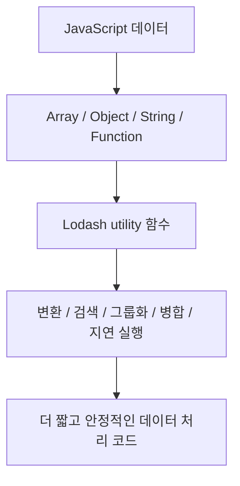
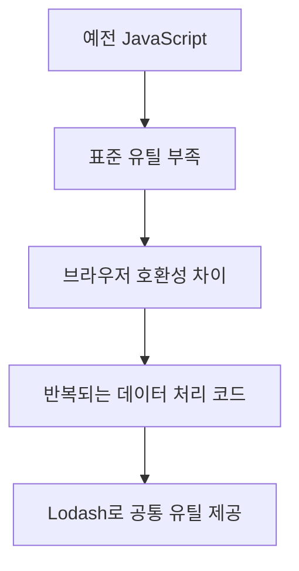
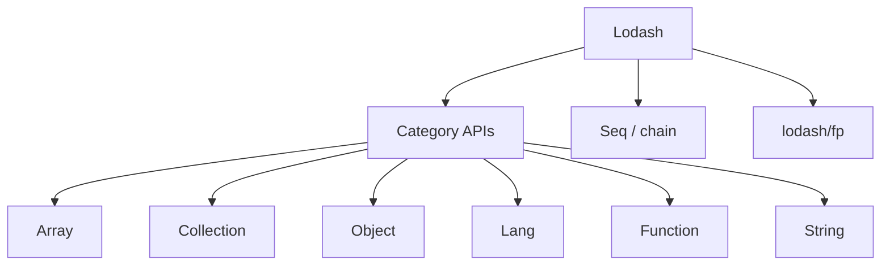
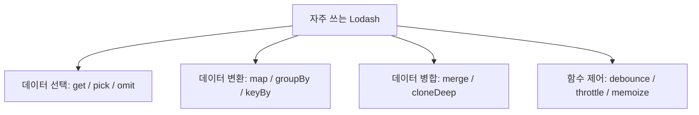
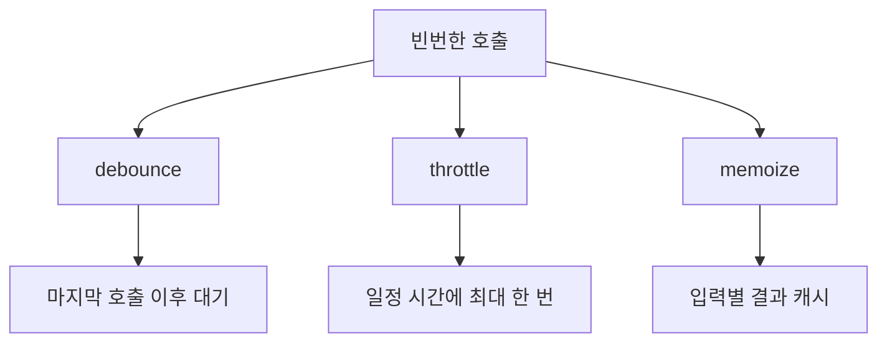
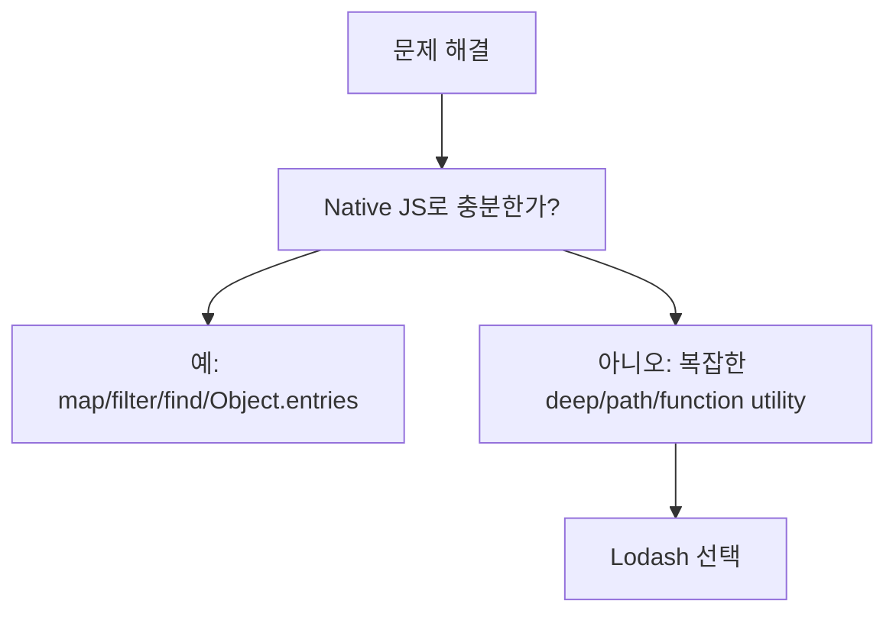
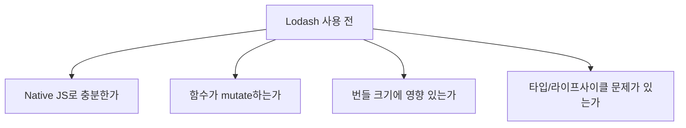

# Lodash 상세 정리

작성 기준일: 2026-04-21  
조사 방식: 웹검색 기반 최신 조사  
주요 참고: `lodash.com` 공식 문서, `npmjs.com/package/lodash`, `lodash/lodash` GitHub 저장소

## 1. 한 줄 요약



`Lodash`는 JavaScript에서 배열, 객체, 문자열, 함수, 컬렉션 데이터를 더 편하게 다루기 위한 유틸리티 라이브러리다.

공식 문서는 Lodash가:

- array
- collection
- date
- function
- lang
- math
- number
- object
- seq
- string
- util

같은 카테고리의 메서드를 제공한다고 설명한다.

즉 Lodash는 "하나의 기능"이 아니라, JavaScript 표준 라이브러리의 빈틈을 메우는 대형 utility toolkit에 가깝다.

---

## 2. 왜 Lodash가 필요했나



Lodash가 널리 쓰인 이유는 JavaScript가 오래전에는 지금처럼 풍부한 표준 메서드를 제공하지 않았기 때문이다.

예전에는 아래 같은 작업을 직접 구현해야 하는 경우가 많았다.

- 배열에서 중복 제거
- 객체 깊은 복사
- 깊은 경로 접근
- 객체 병합
- 함수 debounce/throttle
- 값 타입 판별
- 컬렉션 그룹화

Lodash는 이런 기능을:

- 일관된 API
- 브라우저 호환성
- edge case 처리
- 함수형 조합

형태로 제공했다.

### 2.1 지금도 필요한가

현대 JavaScript는:

- `Array.prototype.map`
- `filter`
- `reduce`
- `find`
- `Object.entries`
- `structuredClone`
- optional chaining
- nullish coalescing

같은 기능이 많이 좋아졌다.

그래서 예전만큼 모든 곳에 Lodash가 필수는 아니다.

하지만 여전히 Lodash가 강한 영역이 있다.

- `debounce`
- `throttle`
- `cloneDeep`
- `merge`
- `get/set` deep path
- `groupBy`, `keyBy`, `orderBy`
- 일관된 predicate shorthand

즉 오늘날 Lodash는 "기본 의존성"이라기보다 "복잡한 데이터 처리나 안정된 유틸이 필요할 때 선택하는 도구"에 가깝다.

---

## 3. Lodash의 핵심 구조



공식 문서의 카테고리를 보면 Lodash의 구조가 보인다.

### 3.1 Array

배열 전용 유틸이다.

예:

- `chunk`
- `compact`
- `difference`
- `flatten`
- `uniq`
- `zip`

### 3.2 Collection

배열뿐 아니라 객체 컬렉션에도 동작하는 유틸이다.

예:

- `map`
- `filter`
- `reduce`
- `groupBy`
- `keyBy`
- `orderBy`

### 3.3 Object

객체 조작 유틸이다.

예:

- `get`
- `set`
- `pick`
- `omit`
- `merge`
- `mapValues`

### 3.4 Lang

타입 검사, 복사, 변환 관련 유틸이다.

예:

- `isArray`
- `isEqual`
- `clone`
- `cloneDeep`
- `toNumber`

### 3.5 Function

함수를 감싸거나 호출 빈도를 제어하는 유틸이다.

예:

- `debounce`
- `throttle`
- `once`
- `memoize`
- `curry`

### 3.6 Seq / chain

여러 연산을 체인으로 이어서 쓰는 API다.

예:

```js
_.chain(users)
  .filter({ active: true })
  .map("name")
  .value()
```

### 3.7 lodash/fp

npm 패키지 설명은 `lodash/fp`를:

- immutable
- auto-curried
- iteratee-first
- data-last

메서드라고 설명한다.

즉 일반 Lodash보다 함수형 조합에 더 맞춘 변형이다.

---

## 4. 자주 쓰는 함수군



Lodash는 함수가 매우 많기 때문에 전부 외우는 방식은 비효율적이다.

실무에서는 아래 묶음으로 먼저 이해하는 편이 좋다.

### 4.1 안전한 값 접근: `_.get`

```js
_.get(user, "profile.name", "Anonymous")
```

객체 깊은 경로를 안전하게 읽는다.

현대 JS의 optional chaining으로 대체 가능한 경우가 많다.

```js
user?.profile?.name ?? "Anonymous"
```

하지만 path 문자열이나 동적 경로를 다룰 때는 `_.get`이 여전히 유용하다.

### 4.2 객체 일부 선택: `_.pick`, `_.omit`

```js
_.pick(user, ["id", "name"])
_.omit(user, ["password"])
```

API 응답 정리, DTO 생성, 민감 필드 제거에서 자주 쓰인다.

### 4.3 그룹화: `_.groupBy`

```js
_.groupBy(users, "role")
```

리스트를 특정 기준으로 묶을 때 유용하다.

### 4.4 키로 변환: `_.keyBy`

```js
_.keyBy(users, "id")
```

배열을 lookup map처럼 바꿀 때 많이 쓴다.

### 4.5 정렬: `_.orderBy`

```js
_.orderBy(users, ["role", "createdAt"], ["asc", "desc"])
```

여러 기준 정렬이 필요할 때 `Array.prototype.sort()`보다 읽기 쉬울 수 있다.

### 4.6 깊은 복사: `_.cloneDeep`

```js
const next = _.cloneDeep(state)
```

중첩 구조를 재귀적으로 복사한다.

단, 성능 비용이 크고 함수/DOM/특수 객체는 주의해야 한다.

### 4.7 깊은 병합: `_.merge`

```js
_.merge(target, source)
```

중첩 객체를 병합한다.

중요한 점:

- 공식 문서의 `_.mergeWith` 설명처럼 `merge` 계열은 object를 mutate할 수 있다.

즉 immutable 업데이트가 필요한 React 상태에서는 특히 주의해야 한다.

---

## 5. 특히 중요한 함수: `debounce`, `throttle`, `memoize`



Lodash에서 오늘날에도 특히 자주 쓰이는 함수군은 `Function` 카테고리다.

### 5.1 `_.debounce`

공식 문서는 `_.debounce`를:

- 마지막 호출 이후 `wait` 밀리초가 지난 뒤 `func`를 실행하는 함수

로 설명한다.

예:

```js
const onSearch = _.debounce((keyword) => {
  fetchResults(keyword)
}, 300)
```

적합한 상황:

- 검색어 입력
- resize 이벤트
- 자동 저장

즉 "사용자가 계속 입력 중이면 기다렸다가 마지막에 한 번 실행"할 때 좋다.

### 5.2 `_.throttle`

공식 문서는 `_.throttle`을:

- `wait` 밀리초마다 최대 한 번만 실행되도록 제한하는 함수

로 설명한다.

예:

```js
const onScroll = _.throttle(() => {
  updatePosition()
}, 100)
```

적합한 상황:

- scroll
- mousemove
- resize 중 지속 업데이트

즉 "계속 발생하지만 주기적으로만 처리"할 때 좋다.

### 5.3 debounce vs throttle

가장 중요한 차이:

- debounce = 조용해질 때까지 기다렸다가 실행
- throttle = 일정 간격마다 실행

### 5.4 `_.memoize`

공식 문서는 `_.memoize`를:

- 함수 결과를 캐시하는 함수

라고 설명한다.

기본 cache key는 첫 번째 인자다.

즉 복수 인자나 객체 인자를 쓸 때는 resolver를 신중히 설계해야 한다.

### 5.5 실무 주의점

- debounce/throttle 함수는 재사용되는 동일 참조가 중요하다.
- React 렌더마다 새로 만들면 의미가 깨질 수 있다.
- memoize cache는 메모리 누수 위험이 있다.
- debounce는 `cancel`, `flush`를 알아야 cleanup이 가능하다.

즉 이 함수들은 편하지만 lifecycle 관리가 필요하다.

---

## 6. 현대 JavaScript와 Lodash의 관계



요즘은 많은 Lodash 함수가 native JavaScript로 대체 가능하다.

### 6.1 Native로 충분한 경우

예:

```js
arr.map(fn)
arr.filter(fn)
arr.find(fn)
Object.entries(obj)
Object.fromEntries(entries)
structuredClone(value)
```

즉 단순 배열 변환은 굳이 Lodash가 필요 없을 수 있다.

### 6.2 Lodash가 여전히 유리한 경우

- 복잡한 deep path 조작
- 다중 기준 정렬
- 데이터 그룹화
- debounce/throttle
- 브라우저/런타임 차이를 덜 신경 쓰고 싶은 경우

### 6.3 번들 크기 문제

npm 문서는 lodash 패키지가 모듈 단위 import를 지원한다고 설명한다.

예:

```js
const debounce = require("lodash/debounce")
```

또는 ESM 빌드/개별 패키지 전략을 검토할 수 있다.

중요한 점:

- 전체 `_`를 통째로 가져오면 번들 크기가 커질 수 있다.
- 실제 번들러 설정과 import 방식에 따라 tree shaking 결과가 달라질 수 있다.

### 6.4 lodash-es

ES module 기반 tree shaking을 노릴 때는 `lodash-es`를 쓰는 경우도 많다.

다만 프로젝트 번들러와 환경에 따라 결과가 다를 수 있으므로 실제 bundle analyzer로 확인하는 게 맞다.

### 6.5 한 줄 판단 기준

- 단순하면 native
- edge case와 복잡한 데이터 조작이 많으면 Lodash
- 번들 크기가 민감하면 개별 import 또는 대체 구현 검토

---

## 7. 실무 체크리스트



Lodash를 쓸 때는 아래를 확인하면 실수가 줄어든다.

### 7.1 native JS로 충분한가

`map`, `filter`, `find`, `includes`, `Object.entries` 정도면 native가 더 명확할 수 있다.

### 7.2 mutate 여부를 확인했는가

특히:

- `merge`
- `set`
- `update`

같은 함수는 원본 객체를 바꿀 수 있다.

React/Vue 상태 업데이트에서는 치명적인 버그가 될 수 있다.

### 7.3 deep clone을 남용하지 않는가

`cloneDeep`은 편하지만 비용이 크다.

대안:

- 구조 공유
- 필요한 부분만 복사
- immutable update helper

를 고려해야 한다.

### 7.4 debounce/throttle cleanup을 했는가

컴포넌트 unmount 시:

```js
debounced.cancel()
```

같은 처리가 필요할 수 있다.

### 7.5 memoize cache가 무한히 커지지 않는가

`memoize`는 cache를 만든다.

입력이 계속 달라지는 경우 메모리 누수가 될 수 있다.

### 7.6 import 방식이 적절한가

번들 크기가 중요한 프런트엔드에서는:

- 전체 lodash import
- 개별 method import
- lodash-es

중 실제 번들 결과를 확인해야 한다.

### 7.7 타입 안정성

TypeScript 프로젝트에서는 Lodash 타입 추론이 native 코드보다 덜 직관적일 수 있다.

특히 `get`, `set`, path 문자열 기반 API는 타입 안정성이 약해질 수 있다.

즉 편의성과 타입 안정성 사이 trade-off를 봐야 한다.

---

## 참고 링크

- Lodash 공식 문서: [Lodash Documentation](https://lodash.com/docs/)
- Lodash npm package: [lodash on npm](https://www.npmjs.com/package/lodash)
- Lodash GitHub 저장소: [lodash/lodash](https://github.com/lodash/lodash)
- lodash-es npm package: [lodash-es on npm](https://www.npmjs.com/package/lodash-es)
