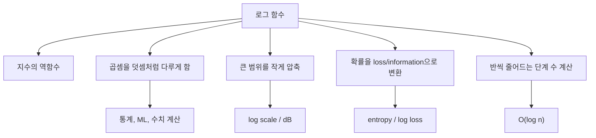
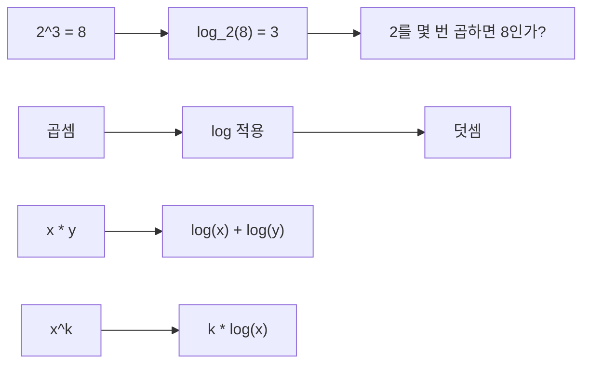
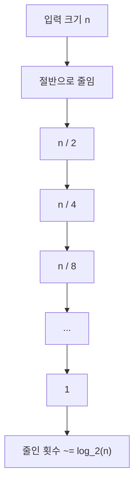
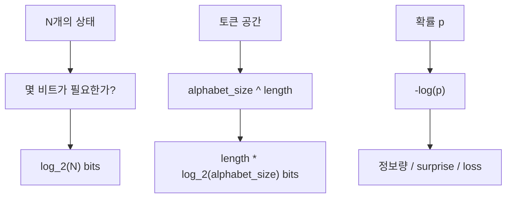
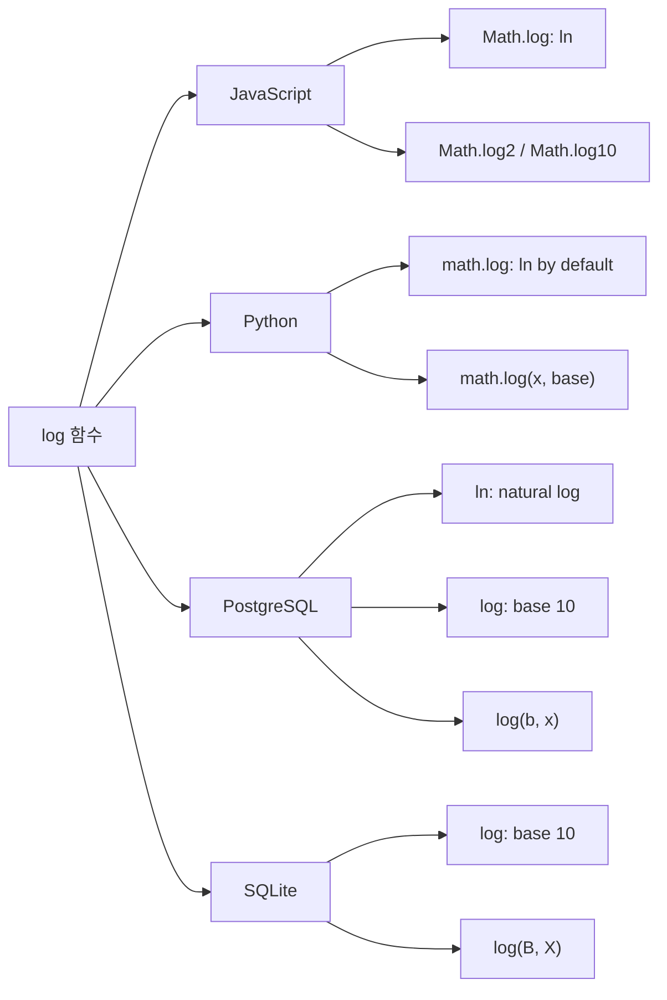
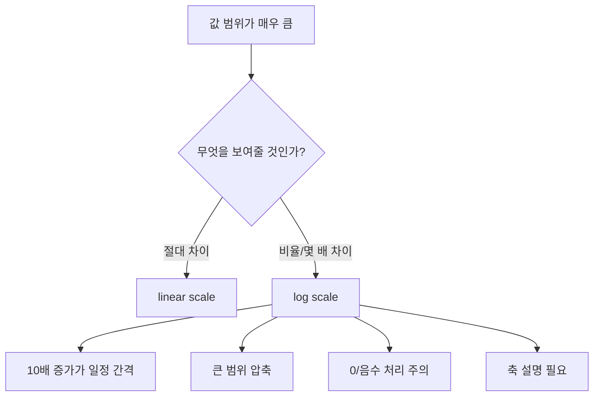
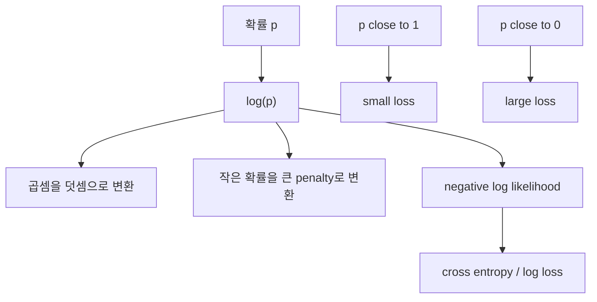
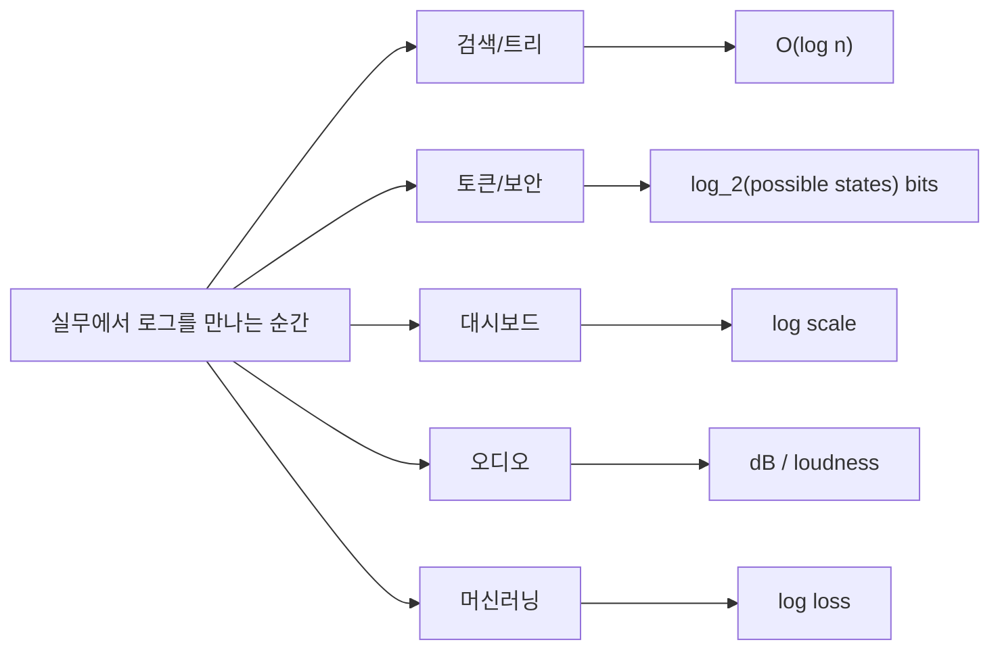
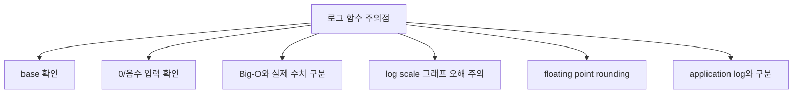
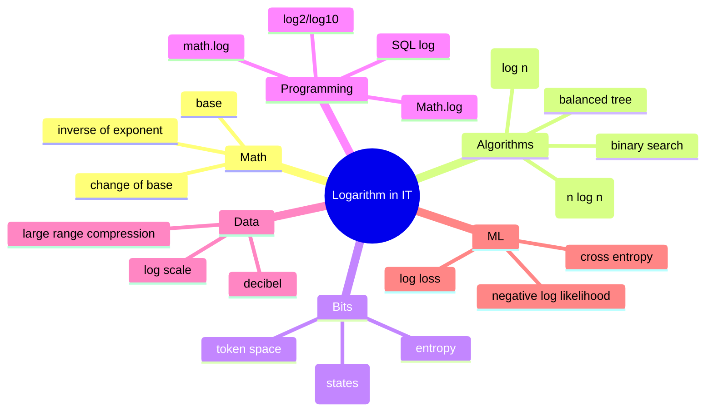

# IT에서 나오는 로그 함수

## 1. 한 줄 요약

- 로그 함수는 `b^y = x`일 때, "`b`를 몇 번 곱해야 `x`가 되는가"를 구하는 함수다.
- 수식으로는 `log_b(x) = y`라고 쓴다.
- IT에서는 로그 함수가 다음 상황에서 자주 등장한다.
  - 데이터를 절반씩 줄이는 알고리즘의 단계 수 계산
  - 이진수, 비트 수, 경우의 수, entropy 계산
  - 큰 범위의 값을 압축해서 그래프나 지표로 표시
  - 확률을 정보량, loss, likelihood로 바꾸는 머신러닝 계산
  - JavaScript, Python, SQL 같은 언어/DB의 수학 함수
  - 오디오/통신에서 dB처럼 비율을 다루는 단위
- 실무적으로는 "`log`는 증가가 느린 함수"라는 감각보다, "곱셈/제곱/경우의 수/확률/비율을 다루기 쉽게 바꾸는 도구"라고 이해하는 편이 좋다.



## 2. 수학 기본 개념

- 로그는 지수의 반대 방향이다.
  - `2^3 = 8`
  - `log_2(8) = 3`
  - 뜻: `2`를 `3`번 곱하면 `8`이 된다.
- 일반식
  - `b^y = x`
  - `log_b(x) = y`
  - `b`: base, 밑
  - `x`: argument, 로그를 취하는 값
  - `y`: exponent, 결과
- 정의 조건
  - `x > 0`
  - `b > 0`
  - `b != 1`
- 자주 쓰는 밑
  - `log_2(x)`: base 2 로그. 이진수, 비트, binary search, tree height에서 자주 나온다.
  - `ln(x)` 또는 `log_e(x)`: 자연로그. 수학, 미적분, 통계, 머신러닝, Python/JavaScript 기본 `log`에서 자주 나온다.
  - `log_10(x)`: 상용로그. 자리수, decimal scale, 일부 SQL 함수, dB 설명에서 자주 나온다.
- 주요 성질
  - `log_b(x * y) = log_b(x) + log_b(y)`
  - `log_b(x / y) = log_b(x) - log_b(y)`
  - `log_b(x^k) = k * log_b(x)`
  - `log_b(1) = 0`
  - `log_b(b) = 1`
  - `log_b(x) = log_c(x) / log_c(b)`
- IT에서 중요한 이유
  - 곱셈이 덧셈으로 바뀐다.
  - 제곱이 곱셈으로 바뀐다.
  - 매우 큰 값을 작은 숫자 범위로 압축한다.
  - 반복적으로 반씩 줄어드는 구조를 단계 수로 계산한다.



### 예시 표

| 식 | 의미 | 결과 |
| --- | --- | --- |
| `log_2(2)` | `2^? = 2` | `1` |
| `log_2(8)` | `2^? = 8` | `3` |
| `log_2(1024)` | `2^? = 1024` | `10` |
| `log_10(1000)` | `10^? = 1000` | `3` |
| `ln(e)` | `e^? = e` | `1` |
| `log_b(1)` | `b^? = 1` | `0` |

## 3. 알고리즘에서의 로그: `O(log n)`

- 알고리즘에서 `log n`은 보통 "입력 크기 `n`이 커져도 필요한 단계 수가 천천히 증가한다"는 뜻이다.
- 특히 다음처럼 매 단계마다 문제 크기를 일정 비율로 줄이면 로그가 나온다.
  - 절반으로 줄이기: `n -> n/2 -> n/4 -> n/8 -> ... -> 1`
  - 10분의 1로 줄이기: `n -> n/10 -> n/100 -> ... -> 1`
  - 균형 잡힌 tree에서 한 level씩 내려가기
- 대표 예시: binary search
  - 정렬된 배열에서 중간값을 본다.
  - 찾는 값이 중간보다 작으면 왼쪽 절반만 남긴다.
  - 크면 오른쪽 절반만 남긴다.
  - 매번 탐색 범위가 절반으로 줄어든다.
  - 그래서 단계 수는 대략 `log_2(n)`이다.
- NIST DADS의 binary search 설명도 정렬 배열을 반복적으로 절반씩 좁히는 알고리즘으로 설명하며, 실행 시간이 `O(ln n)`이라고 정리한다.
- `ln n`과 `log_2 n`은 Big-O에서는 같은 급으로 본다.
  - `log_2 n = ln n / ln 2`
  - `1 / ln 2`는 상수다.
  - Big-O는 상수 배수를 무시한다.
- 자주 나오는 복잡도
  - `O(log n)`: binary search, balanced tree search, heap insert/delete.
  - `O(n log n)`: merge sort, heap sort, quicksort 평균 시간.
  - `O(log^2 n)`: 일부 고급 자료구조/알고리즘.
  - `O(1)`, `O(log n)`, `O(n)`, `O(n log n)`, `O(n^2)` 순으로 대체로 느려진다.



### binary search 단계 수 감각

| `n` | `log_2(n)` | 의미 |
| --- | ---: | --- |
| `1,024` | `10` | 약 10번이면 1개까지 줄어든다 |
| `1,048,576` | `20` | 약 20번이면 1개까지 줄어든다 |
| `1,073,741,824` | `30` | 약 30번이면 1개까지 줄어든다 |
| `1,099,511,627,776` | `40` | 약 40번이면 1개까지 줄어든다 |

### 코드 예시: binary search

```js
function binarySearch(sortedArray, target) {
  let low = 0;
  let high = sortedArray.length - 1;

  while (low <= high) {
    const mid = low + Math.floor((high - low) / 2);
    const value = sortedArray[mid];

    if (value === target) {
      return mid;
    }

    if (value < target) {
      low = mid + 1;
    } else {
      high = mid - 1;
    }
  }

  return -1;
}
```

- `mid`를 기준으로 매번 왼쪽 또는 오른쪽 절반만 남긴다.
- 그래서 반복 횟수는 배열 길이 `n`에 비례하지 않고 `log_2(n)`에 가깝다.

## 4. 비트, 경우의 수, 정보량에서의 로그

- 컴퓨터는 많은 것을 binary, 즉 2진 구조로 다룬다.
- 그래서 IT에서는 `log_2`가 특히 중요하다.
- 핵심 질문은 다음과 같다.
  - "`N`개의 서로 다른 상태를 구분하려면 몇 비트가 필요한가?"
  - 답: 대략 `log_2(N)`비트.
- 예시
  - `2`개 상태: `log_2(2) = 1`비트.
  - `4`개 상태: `log_2(4) = 2`비트.
  - `256`개 상태: `log_2(256) = 8`비트.
  - `65,536`개 상태: `log_2(65536) = 16`비트.
  - `4,294,967,296`개 상태: `log_2(4294967296) = 32`비트.
- ID/토큰/비밀번호 설계에도 같은 사고방식이 쓰인다.
  - 알파벳 크기가 `A`이고 길이가 `L`이면 전체 경우의 수는 `A^L`.
  - 필요한 정보량은 `log_2(A^L) = L * log_2(A)`.
  - 예: 16진수 문자 32개는 `16^32 = 2^128`이므로 128비트 공간이다.
- entropy에서도 로그가 나온다.
  - NIST CSRC glossary는 entropy를 불확실성/무작위성의 척도로 설명하고, 보안 맥락에서는 보통 bits 단위로 말한다고 정리한다.
  - Shannon entropy 형태는 대략 `H(X) = - sum p_i log(p_i)`다.
  - 확률이 낮은 사건일수록 `-log(p)`가 커진다.
- 직관
  - 자주 나오는 값은 정보량이 작다.
  - 드물게 나오는 값은 정보량이 크다.
  - 균등하게 많은 선택지가 있으면 entropy가 커진다.



### 비트 수 계산 예시

```js
function bitsForStates(numberOfStates) {
  return Math.ceil(Math.log2(numberOfStates));
}

bitsForStates(256); // 8
bitsForStates(1000); // 10
bitsForStates(1_000_000); // 20
```

- `Math.ceil()`을 쓰는 이유는 비트 수는 정수여야 하기 때문이다.
- `1000`개 상태는 `log_2(1000) ~= 9.97`이므로 10비트가 필요하다.

## 5. 프로그래밍 언어와 DB에서의 `log`

- 언어와 DB마다 `log`의 기본 base가 다를 수 있다.
- 그래서 실무에서는 함수 이름만 보고 자연로그인지, 2진 로그인지, 10진 로그인지 가정하면 위험하다.
- JavaScript
  - `Math.log(x)`: 자연로그, base `e`.
  - `Math.log2(x)`: base 2 로그.
  - `Math.log10(x)`: base 10 로그.
  - 다른 base가 필요하면 `Math.log(x) / Math.log(base)`를 쓴다.
  - MDN은 `Math.log2()`와 `Math.log10()`을 각각 base 2, base 10 로그로 설명한다.
- Python
  - `math.log(x)`: 기본은 자연로그.
  - `math.log(x, base)`: 지정한 base의 로그.
  - `math.log2(x)`: base 2 로그.
  - `math.log10(x)`: base 10 로그.
  - Python 공식 문서는 `log2(x)`와 `log10(x)`가 각각 `log(x, 2)`, `log(x, 10)`보다 보통 더 정확하다고 설명한다.
- PostgreSQL
  - `ln(x)`: 자연로그.
  - `log(x)`: base 10 로그.
  - `log10(x)`: base 10 로그.
  - `log(b, x)`: `x`의 base `b` 로그.
  - PostgreSQL 공식 문서 기준 `log(2.0, 64.0)`은 `6`이다.
- SQLite
  - `ln(X)`, `log(X)`, `log10(X)`, `log2(X)`, `log(B, X)`를 제공한다.
  - SQLite 문서는 `log()`가 PostgreSQL처럼 base 10으로 동작한다고 설명한다.
  - 단, 대부분의 다른 SQL 엔진은 `log()`를 자연로그로 쓰는 경우가 있으므로 DB별 확인이 필요하다.
- 중요한 edge case
  - `log(1) = 0`
  - `log(0)`은 수학적으로 `-infinity` 방향으로 발산한다.
  - 음수의 실수 로그는 정의되지 않는다.
  - JavaScript에서는 `Math.log(-1)`이 `NaN`이 된다.
  - JavaScript에서는 `Math.log(0)`이 `-Infinity`가 된다.
  - 언어별로 `NaN`, `-Infinity`, exception, `NULL` 처리 방식이 다를 수 있다.
- 정확도 주의
  - floating point 계산이므로 `log_10(1000)` 같은 계산도 언어/표현에 따라 `2.9999999999999996`처럼 나올 수 있다.
  - `x`가 1에 매우 가까운 경우에는 `log(1 + x)` 대신 `log1p(x)` 계열 함수가 더 정확할 수 있다.



### 코드 예시

```js
function getBaseLog(base, x) {
  return Math.log(x) / Math.log(base);
}

Math.log(10); // natural log
Math.log2(1024); // 10
Math.log10(1000); // 3
getBaseLog(5, 625); // 4
```

```python
import math

math.log(10)       # natural log
math.log(1024, 2)  # 10.0
math.log2(1024)    # 10.0
math.log10(1000)   # 3.0
```

```sql
-- PostgreSQL
select ln(2.0);          -- natural log
select log(100.0);       -- base 10 log
select log10(1000.0);    -- base 10 log
select log(2.0, 64.0);   -- base 2 log of 64
```

## 6. 데이터 시각화, 모니터링, dB에서의 로그

- 로그 스케일은 값의 범위가 너무 클 때 유용하다.
- 예를 들어 다음 값들을 한 그래프에 선형 scale로 그리면 작은 값이 거의 바닥에 붙어 보인다.
  - `1`
  - `10`
  - `100`
  - `1,000`
  - `10,000`
  - `1,000,000`
- log scale로 보면 각 10배 증가가 일정한 간격으로 보인다.
- 관찰 대상
  - request count
  - latency 분포
  - error rate
  - file size
  - memory usage
  - traffic volume
  - revenue/user count처럼 크기 차이가 큰 business metric
- 오디오와 dB
  - decibel은 로그 scale의 대표 예다.
  - CDC/NIOSH는 dB가 logarithmic 단위이며, 10 dB 더 큰 소리는 intensity가 10배라는 식으로 설명한다.
  - NIDCD도 decibel scale이 linear 측정 단위와 다르며, 소리 intensity 변화가 귀에 느껴지는 방식을 더 잘 나타낸다고 설명한다.
  - 그래서 Web Audio API에서 `gain` 값을 그대로 사람이 느끼는 volume slider에 매핑하면 부자연스러울 수 있다.
- log scale을 쓸 때 주의할 점
  - `0`과 음수는 일반적인 로그 scale에 올릴 수 없다.
  - 작은 값의 차이가 과장되어 보일 수 있다.
  - 큰 값의 절대 차이가 축소되어 보일 수 있다.
  - "절대량 차이"를 보여줘야 하는 그래프에는 부적절할 수 있다.
  - 로그 축을 사용했으면 축 표시와 설명을 명확히 해야 한다.



### linear scale과 log scale 감각

| 값 | `log_10(value)` | log scale에서의 위치 감각 |
| ---: | ---: | --- |
| `1` | `0` | 시작 |
| `10` | `1` | 한 칸 |
| `100` | `2` | 두 칸 |
| `1,000` | `3` | 세 칸 |
| `1,000,000` | `6` | 여섯 칸 |

## 7. 머신러닝과 통계에서의 로그

- 머신러닝에서는 확률을 다룰 때 로그가 자주 나온다.
- 이유는 크게 세 가지다.
  - 작은 확률을 계속 곱하면 underflow가 나기 쉽다.
  - 확률의 곱을 로그의 합으로 바꾸면 계산이 안정적이다.
  - 틀린 예측에 대한 penalty를 강하게 만들 수 있다.
- log loss
  - scikit-learn 문서는 `log_loss`를 logistic loss 또는 cross-entropy loss라고 설명한다.
  - binary classification의 단일 sample에 대해 `-(y log(p) + (1-y) log(1-p))` 형태를 사용한다.
  - scikit-learn 문서 기준 이 로그는 자연로그다.
- 직관
  - 정답 class에 `0.9` 확률을 주면 loss가 작다.
  - 정답 class에 `0.1` 확률을 주면 loss가 크다.
  - 정답 class에 `0.001`처럼 매우 낮은 확률을 주면 loss가 매우 커진다.
- 예시: 정답이 `1`일 때
  - 예측 확률 `p = 0.9`: `-ln(0.9) ~= 0.105`
  - 예측 확률 `p = 0.5`: `-ln(0.5) ~= 0.693`
  - 예측 확률 `p = 0.1`: `-ln(0.1) ~= 2.303`
  - 예측 확률 `p = 0.01`: `-ln(0.01) ~= 4.605`
- logit
  - `logit(p) = log(p / (1 - p))`
  - probability를 무한한 실수 범위로 바꾸는 변환이다.
  - logistic regression, neural network classification에서 자주 등장한다.
- log-sum-exp
  - `log(exp(a) + exp(b) + ...)`를 안정적으로 계산하는 기법이다.
  - softmax, cross entropy 구현에서 overflow/underflow를 줄이는 데 중요하다.



### log loss 코드 감각

```python
import math

def binary_log_loss(y, p):
  eps = 1e-15
  p = min(max(p, eps), 1 - eps)
  return -(y * math.log(p) + (1 - y) * math.log(1 - p))

binary_log_loss(1, 0.9)   # about 0.105
binary_log_loss(1, 0.1)   # about 2.303
binary_log_loss(0, 0.9)   # about 2.303
```

- `eps`로 clipping하는 이유는 `log(0)`을 피하기 위해서다.
- 확률이 0 또는 1에 너무 가까우면 수치적으로 불안정해질 수 있다.

## 8. 실무 예시 패턴

- 예시 1: binary search 반복 횟수 추정
  - 데이터가 1,000,000개여도 `log_2(1,000,000) ~= 20`이다.
  - 정렬되어 있고 random access가 가능하다면 20회 정도 비교로 후보를 좁힐 수 있다.
- 예시 2: pagination/tree depth 감각
  - balanced binary tree에 약 1,000,000개 node가 있으면 높이는 대략 20 수준이다.
  - 매번 child 하나로 내려가면 `O(log n)` 탐색이 가능하다.
- 예시 3: 토큰 entropy 계산
  - hex 문자 32개: `16^32 = 2^128`.
  - 약 128비트 공간이다.
  - base64url 문자 22개는 대략 `22 * log_2(64) = 132`비트 공간이다.
- 예시 4: dashboard log scale
  - request count가 service별로 `10`, `1,000`, `10,000,000`처럼 차이가 크면 log scale이 전체 분포를 보기 좋게 만든다.
  - 하지만 실제 차액/차수를 보여줘야 하면 linear scale이 더 정직할 수 있다.
- 예시 5: 오디오 volume slider
  - 내부 gain은 amplitude multiplier다.
  - 사람의 loudness 체감은 linear보다 logarithmic scale에 가깝다.
  - 그래서 slider position을 gain에 직접 선형 매핑하지 않고 dB/log curve로 매핑하는 경우가 많다.
- 예시 6: ML probability penalty
  - 정답 class에 낮은 확률을 줄수록 `-log(p)`가 빠르게 커진다.
  - 그래서 log loss는 "확신했는데 틀린 예측"을 강하게 벌한다.



### JavaScript로 감각 계산

```js
const oneMillion = 1_000_000;

Math.log2(oneMillion); // about 19.93
Math.ceil(Math.log2(oneMillion)); // 20

function tokenBits(alphabetSize, length) {
  return length * Math.log2(alphabetSize);
}

tokenBits(16, 32); // 128
tokenBits(64, 22); // 132
```

## 9. 자주 하는 오해와 주의점

- 오해 1: `log`는 항상 base 10이다.
  - 아니다.
  - JavaScript/Python의 `log`는 보통 자연로그다.
  - PostgreSQL/SQLite의 `log(x)`는 base 10이다.
  - SQL Server, MySQL 등은 또 다르게 동작할 수 있으므로 공식 문서를 확인해야 한다.
- 오해 2: Big-O에서 `log_2 n`과 `ln n`은 완전히 다른 복잡도다.
  - Big-O에서는 상수 배수를 무시하므로 같은 급으로 본다.
  - 실제 숫자 계산에서는 base가 중요하다.
- 오해 3: `O(log n)`이면 무조건 빠르다.
  - 대체로 매우 좋은 복잡도지만, 상수 비용, cache miss, I/O, network latency가 크면 실제 성능은 달라진다.
  - Big-O는 입력이 커질 때의 성장률을 보는 도구다.
- 오해 4: log scale 그래프는 항상 좋다.
  - 값의 범위가 큰 경우에는 유용하다.
  - 하지만 `0`, 음수, 절대 차이를 보여줘야 하는 지표에는 부적절할 수 있다.
- 오해 5: `gain = 0.5`면 체감상 절반 소리다.
  - gain은 sample amplitude multiplier다.
  - 사람의 loudness 체감은 선형보다 로그/비율 감각에 가깝다.
- 오해 6: `log(0)`은 그냥 0이다.
  - 아니다.
  - `log(1) = 0`이다.
  - `log(0)`은 `-Infinity` 방향으로 발산하거나, 언어/DB에 따라 error/NULL/NaN 계열 처리가 된다.
- 오해 7: 로그는 application log와 같은 말이다.
  - 다르다.
  - 여기서 log는 logarithm, 즉 로그 함수다.
  - application log는 event 기록이다.



## 10. 빠른 복습

- `log_b(x)`
  - `b`를 몇 번 곱하면 `x`가 되는지 묻는 함수.
- `log_2`
  - 이진수, 비트, binary search, tree height에서 자주 나온다.
- `ln`
  - 자연로그. 밑은 `e`.
  - JavaScript `Math.log`, Python `math.log`의 기본 감각이다.
- `log_10`
  - 10진 로그.
  - 자리수, decimal scale, 일부 DB 함수, dB 설명에서 자주 나온다.
- `O(log n)`
  - 문제 크기를 매번 일정 비율로 줄일 때 자주 나오는 복잡도.
- `O(n log n)`
  - 정렬 알고리즘에서 자주 나오는 복잡도.
  - 예: merge sort, heap sort, quicksort 평균.
- `log scale`
  - 값의 절대 차이보다 몇 배 차이를 보기 쉽게 하는 scale.
- `entropy`
  - 불확실성/무작위성의 척도.
  - 보안에서는 bits 단위로 자주 표현된다.
- `log loss`
  - 예측 확률에 로그를 취해 틀린 확신을 강하게 벌하는 loss.
- 실무 핵심
  - base를 확인한다.
  - 입력이 양수인지 확인한다.
  - Big-O와 실제 수치 계산을 구분한다.
  - log scale을 썼다면 그래프 해석을 명확히 한다.



## 참고 링크

- [MDN - Math.log()](https://developer.mozilla.org/en-US/docs/Web/JavaScript/Reference/Global_Objects/Math/log)
- [MDN - Math.log2()](https://developer.mozilla.org/en-US/docs/Web/JavaScript/Reference/Global_Objects/Math/log2)
- [MDN - Math.log10()](https://developer.mozilla.org/en-US/docs/Web/JavaScript/Reference/Global_Objects/Math/log10)
- [Python Docs - math module](https://docs.python.org/3.14/library/math.html)
- [PostgreSQL Docs - Mathematical Functions and Operators](https://www.postgresql.org/docs/current/functions-math.html)
- [SQLite Docs - Built-In Mathematical SQL Functions](https://sqlite.org/lang_mathfunc.html)
- [NIST DADS - big-O notation](https://xlinux.nist.gov/dads/HTML/bigOnotation.html)
- [NIST DADS - binary search](https://xlinux.nist.gov/dads/HTML/binarySearch.html)
- [NIST DADS - height-balanced binary search tree](https://xlinux.nist.gov/dads/HTML/heightBalancedBinSrchTree.html)
- [NIST CSRC Glossary - Entropy](https://csrc.nist.gov/glossary/term/entropy)
- [CDC/NIOSH - About Occupational Hearing Loss](https://www.cdc.gov/niosh/noise/about/index.html)
- [NIDCD - How is Sound Measured?](https://www.nidcd.nih.gov/health/how-sound-measured)
- [scikit-learn - log_loss](https://sklearn.org/stable/modules/generated/sklearn.metrics.log_loss.html)
- [TensorFlow - BinaryCrossentropy](https://www.tensorflow.org/api_docs/python/tf/keras/losses/BinaryCrossentropy)
