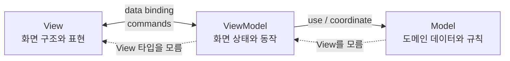
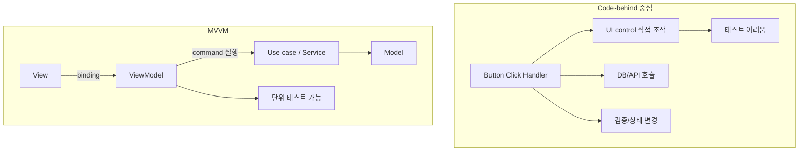
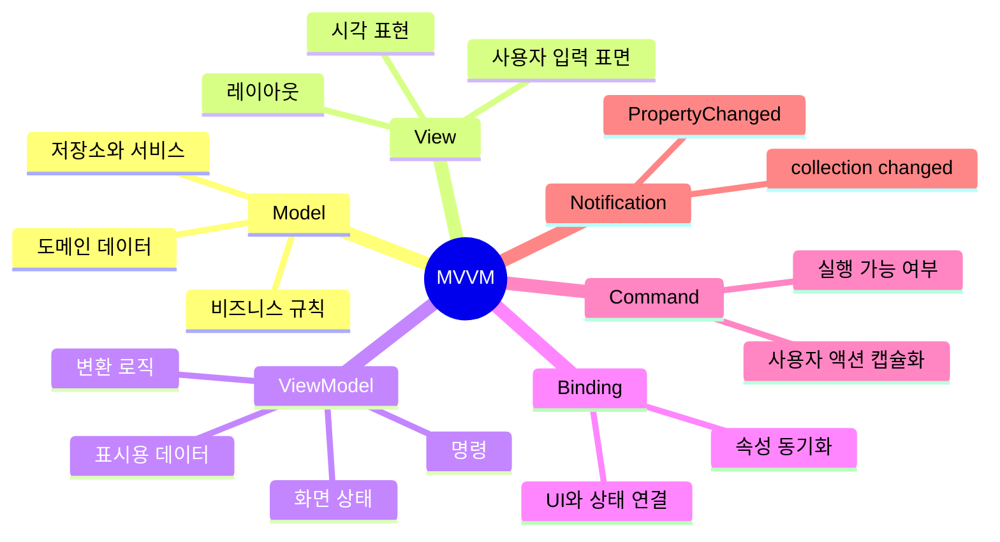
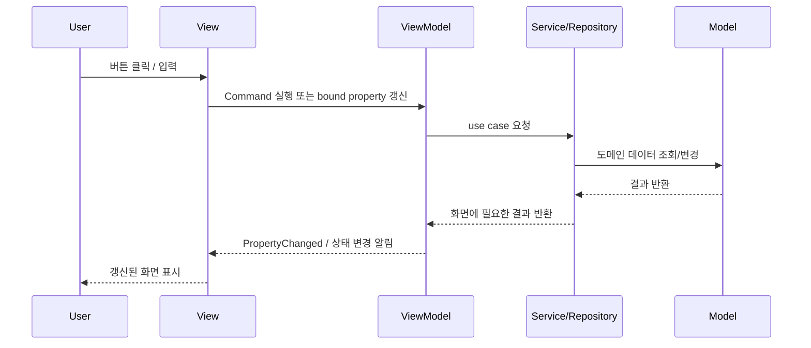
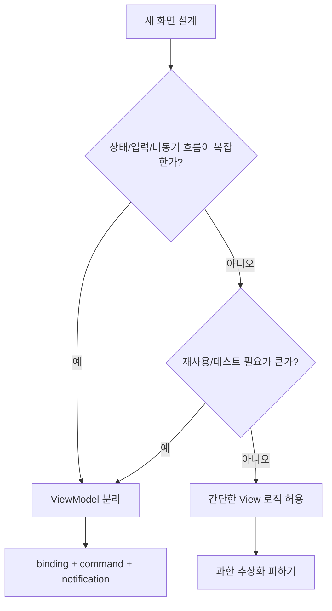
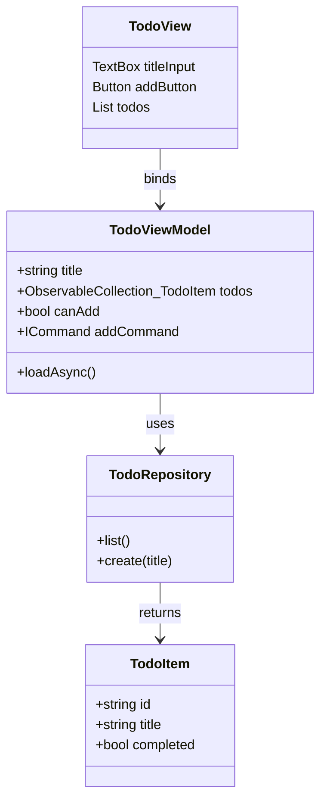
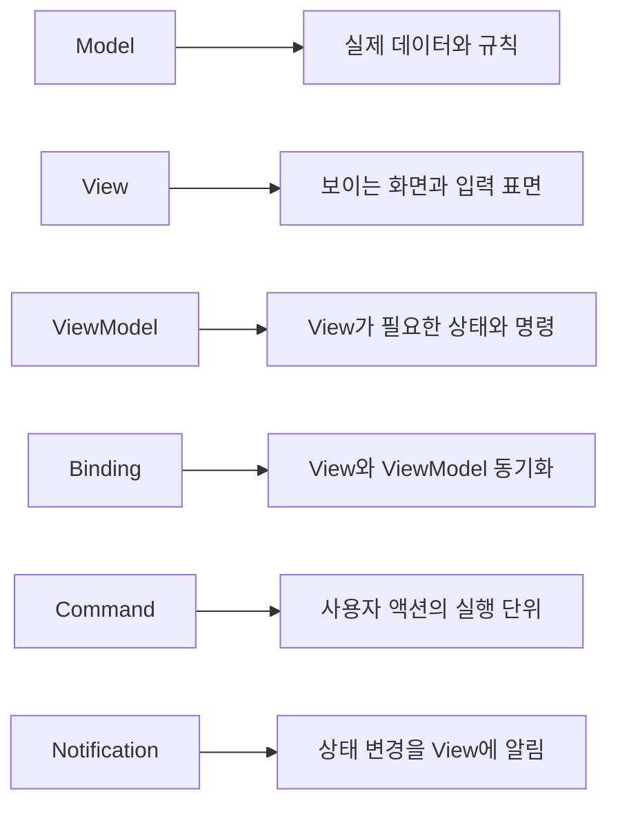

# MVVM

작성 기준일: 2026-07-07  
주요 참고:

- Microsoft Learn, `Model-View-ViewModel (MVVM)`
- Microsoft Learn, `Data binding and MVVM`
- Microsoft Learn, `Commanding Overview`
- Microsoft Learn, `Implement MVVM with the MVVM Toolkit`
- Martin Fowler, `Presentation Model`
- Martin Fowler, `GUI Architectures`

## 1. 한 줄 요약

`MVVM(Model-View-ViewModel)`은 화면(`View`)과 비즈니스/데이터 로직(`Model`)을 직접 엮지 않고, 화면이 바인딩할 상태와 명령을 `ViewModel`에 모아 UI 코드를 테스트 가능하고 교체 가능한 구조로 만드는 UI 아키텍처 패턴이다.



- 핵심은 `View`가 `Model`을 직접 조작하지 않게 하는 것이다.
- `ViewModel`은 화면이 필요로 하는 데이터를 보기 좋은 형태로 노출하고, 버튼 클릭 같은 사용자 동작을 `Command`나 메서드로 받는다.
- `View`는 화면의 모양과 배치를 담당하고, `ViewModel`의 속성과 명령에 바인딩한다.
- `Model`은 도메인 데이터, 비즈니스 규칙, 저장소/서비스와의 연결을 담당한다.

## 2. 왜 중요한가

MVVM은 UI 코드가 커질수록 발생하는 `code-behind` 비대화, 테스트 어려움, 화면 변경 시 로직까지 같이 흔들리는 문제를 줄이기 위해 중요하다.



- 유지보수성:
  - UI 컨트롤 조작 코드와 도메인 로직이 섞이는 것을 줄인다.
  - 화면 레이아웃이 바뀌어도 `ViewModel`과 `Model`을 그대로 둘 수 있다.
- 테스트 가능성:
  - `ViewModel`은 일반 객체처럼 테스트할 수 있다.
  - 버튼을 실제로 클릭하지 않아도 `Command`나 메서드를 호출해 동작을 검증할 수 있다.
- 협업:
  - 디자이너/프론트 UI 작업자는 `View`에 집중하고, 개발자는 `ViewModel`과 `Model`을 병렬로 다룰 수 있다.
- 재사용성:
  - 같은 `Model`이나 `ViewModel`을 다른 화면, 다른 플랫폼, 다른 표현 방식에서 재사용하기 쉬워진다.

## 3. 핵심 개념

MVVM을 이해할 때는 `Model`, `View`, `ViewModel`, `Binding`, `Command`, `Change Notification`을 분리해서 보면 된다.



- `Model`
  - 앱의 실제 데이터와 도메인 규칙을 표현한다.
  - 예: `User`, `Order`, `Invoice`, `Note`, `Product`.
  - 저장소, API client, repository, service와 함께 쓰이는 경우가 많다.
- `View`
  - 사용자가 보는 화면의 구조, 레이아웃, 스타일, 컨트롤을 정의한다.
  - 이상적으로는 비즈니스 로직을 갖지 않는다.
  - 애니메이션이나 포커스 제어처럼 순수 UI 동작은 `View`에 남을 수 있다.
- `ViewModel`
  - `View`가 바로 바인딩할 수 있는 속성과 명령을 제공한다.
  - `Model`의 데이터를 화면에 맞게 가공한다.
  - `View` 타입을 직접 참조하지 않는 것이 기본 원칙이다.
- `Binding`
  - `View`와 `ViewModel` 사이의 값 동기화 장치다.
  - XAML 계열에서는 `BindingContext`, `DataContext`, `{Binding ...}` 같은 방식으로 연결한다.
  - 웹 프레임워크에서는 reactive state, computed property, store binding 등이 비슷한 역할을 한다.
- `Command`
  - 버튼 클릭, 메뉴 선택, 제스처 같은 사용자 액션을 `ViewModel`의 실행 단위로 표현한다.
  - .NET 계열에서는 보통 `ICommand`, `RelayCommand`, `AsyncRelayCommand`가 쓰인다.

## 4. 아키텍처와 동작 흐름

MVVM의 기본 흐름은 `View`가 `ViewModel`에 바인딩하고, `ViewModel`이 `Model`이나 service를 호출한 뒤, 변경 알림을 통해 `View`가 자동 갱신되는 구조다.



- 일반적인 요청 흐름:
  - 사용자가 화면에서 입력하거나 버튼을 누른다.
  - `View`는 이벤트 핸들러에 비즈니스 로직을 쓰지 않고 `Command`나 바인딩된 속성으로 `ViewModel`에 전달한다.
  - `ViewModel`은 필요한 validation, 상태 변경, service 호출을 수행한다.
  - `Model`이나 service가 데이터를 가져오거나 변경한다.
  - `ViewModel`은 결과를 화면 친화적인 속성으로 바꾼다.
  - 변경 알림이 발생하면 `View`가 다시 렌더링되거나 값이 갱신된다.
- 연결 방식:
  - `View-first`: 화면을 먼저 만들고 그 화면의 `BindingContext/DataContext`에 `ViewModel`을 연결한다.
  - `ViewModel-first`: `ViewModel`을 기준으로 화면을 찾거나 생성한다.
  - 단순 앱에서는 `View-first`가 이해하기 쉽고, 복잡한 앱에서는 DI, navigation, routing 전략에 따라 선택한다.
- 의존 방향:
  - `View`는 `ViewModel`을 알 수 있다.
  - `ViewModel`은 `Model`과 service를 알 수 있다.
  - `Model`은 `ViewModel`과 `View`를 몰라야 한다.
  - `ViewModel`도 구체적인 `Button`, `TextBox`, `Page` 같은 `View` 타입을 직접 참조하지 않는 편이 좋다.

## 5. 중요한 디테일, 예외, 트레이드오프

MVVM은 UI가 복잡하고 바인딩이 강한 환경에서는 효과적이지만, 단순 화면까지 무조건 MVVM으로 만들면 보일러플레이트와 추적 비용이 커질 수 있다.



- 변경 알림:
  - `ViewModel`의 속성이 바뀌면 `View`가 알 수 있어야 한다.
  - .NET에서는 `INotifyPropertyChanged`, `ObservableCollection<T>` 같은 메커니즘을 사용한다.
  - 웹에서는 signal, observable, reactive store, state setter 등이 같은 역할을 한다.
- `Command`:
  - 사용자 액션을 UI 이벤트 핸들러가 아니라 `ViewModel`의 명령으로 노출한다.
  - 실행 가능 여부(`CanExecute`)를 제공하면 버튼 활성화/비활성화 같은 표현도 바인딩으로 처리할 수 있다.
  - 비동기 I/O는 UI thread를 막지 않도록 async command나 loading state를 함께 둔다.
- 변환 위치:
  - `Model`의 순수 도메인 값을 화면 표시용 문자열, 색상, enabled 상태 등으로 바꾸는 책임은 대체로 `ViewModel`에 둔다.
  - 포맷팅이 여러 화면에서 반복되면 converter, formatter, presenter helper 같은 별도 계층으로 뺄 수 있다.
- 테스트 경계:
  - `ViewModel`은 `View` 없이 테스트할 수 있어야 한다.
  - service/repository는 interface나 mock으로 대체 가능하게 만들면 테스트가 쉬워진다.
- 단점:
  - 바인딩 오류는 문자열 기반이면 컴파일 타임에 잡기 어렵다.
  - 데이터 흐름이 선언적으로 숨어 있어 디버깅이 직접 이벤트 핸들러보다 어렵게 느껴질 수 있다.
  - 작은 화면에서는 `ViewModel`, command, notification이 과한 구조가 될 수 있다.
- 판단 기준:
  - 상태가 많고, 입력 검증이 있고, 비동기 호출이 있으며, 화면 변경 가능성이 높다면 MVVM이 유리하다.
  - 정적 표시 화면이나 아주 작은 form은 단순한 component state만으로 충분할 수 있다.

## 6. 실전 예시

예를 들어 `할 일 추가` 화면을 MVVM으로 구성하면, `View`는 입력칸과 버튼을 보여주고 `ViewModel`은 입력값, 추가 가능 여부, 저장 명령을 제공한다.



- `View`가 할 일:
  - `titleInput.Text`를 `TodoViewModel.title`에 바인딩한다.
  - `addButton.Command`를 `TodoViewModel.addCommand`에 바인딩한다.
  - `todos` collection을 목록 UI에 바인딩한다.
- `ViewModel`이 할 일:
  - `title` 변경 시 `canAdd`가 다시 계산되도록 알린다.
  - `addCommand` 실행 시 repository를 통해 저장한다.
  - 저장 중에는 `isLoading` 같은 상태를 바꿔 버튼 중복 클릭을 막는다.
  - 저장이 끝나면 `todos`를 갱신한다.
- `Model/Repository`가 할 일:
  - `TodoItem`의 데이터 구조를 표현한다.
  - 실제 저장소, API, DB와 통신한다.
  - 화면 컨트롤이나 UI 프레임워크 타입을 몰라야 한다.

간단한 의사 코드는 다음과 같다.

```ts
class TodoViewModel {
  title = "";
  todos: TodoItem[] = [];
  isSaving = false;

  get canAdd() {
    return this.title.trim().length > 0 && !this.isSaving;
  }

  async addTodo() {
    if (!this.canAdd) return;

    this.isSaving = true;
    try {
      const todo = await this.todoRepository.create(this.title.trim());
      this.todos = [...this.todos, todo];
      this.title = "";
    } finally {
      this.isSaving = false;
    }
  }
}
```

- 위 예시는 TypeScript 형태지만, 구조는 XAML/.NET, Android, Vue, React 상태 관리에도 적용할 수 있다.
- 프레임워크가 제공하는 reactivity나 binding 기능이 있으면 `PropertyChanged` 같은 알림 코드를 직접 쓰지 않아도 된다.
- 중요한 점은 `addTodo()`가 특정 버튼이나 DOM 요소를 직접 조작하지 않는다는 것이다.

## 7. 용어 정리와 빠른 복습

MVVM은 `View`를 얇게 만들고, `ViewModel`을 화면 상태와 사용자 액션의 테스트 가능한 중심으로 두며, `Model`을 UI에서 독립시키는 패턴이다.



- `Model`
  - 도메인 데이터와 비즈니스 규칙.
- `View`
  - 화면의 구조, 배치, 스타일, 입력 요소.
- `ViewModel`
  - 화면에 필요한 상태, 표시용 데이터, command, validation 흐름.
- `Binding`
  - `View`와 `ViewModel`의 속성을 연결하는 동기화 방식.
- `Command`
  - 클릭, 제출, 선택 같은 사용자 행동을 실행 가능한 객체나 함수로 표현한 것.
- `PropertyChanged`
  - 속성 변경을 UI에 알리는 대표적인 변경 알림 개념.
- `Code-behind`
  - XAML 같은 선언적 UI 파일 뒤에 붙는 이벤트 처리 코드.
  - MVVM에서는 code-behind에 비즈니스 로직이 쌓이지 않게 한다.
- `Presentation Model`
  - Martin Fowler가 설명한 패턴으로, 화면의 데이터와 동작을 컨트롤 없이 독립 객체로 분리한다.
  - MVVM은 이 아이디어를 데이터 바인딩이 강한 UI 프레임워크에서 구체화한 형태로 이해할 수 있다.

## 8. 참고 링크

- [Microsoft Learn - Model-View-ViewModel (MVVM)](https://learn.microsoft.com/en-us/dotnet/architecture/maui/mvvm)
- [Microsoft Learn - Data binding and MVVM](https://learn.microsoft.com/en-us/windows/uwp/data-binding/data-binding-and-mvvm)
- [Microsoft Learn - Commanding Overview](https://learn.microsoft.com/en-us/dotnet/desktop/wpf/advanced/commanding-overview)
- [Microsoft Learn - Implement MVVM with the MVVM Toolkit](https://learn.microsoft.com/en-us/windows/apps/tutorials/winui-mvvm-toolkit/mvvm-implementation)
- [Martin Fowler - Presentation Model](https://martinfowler.com/eaaDev/PresentationModel.html)
- [Martin Fowler - GUI Architectures](https://martinfowler.com/eaaDev/uiArchs.html)
