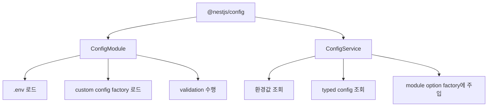
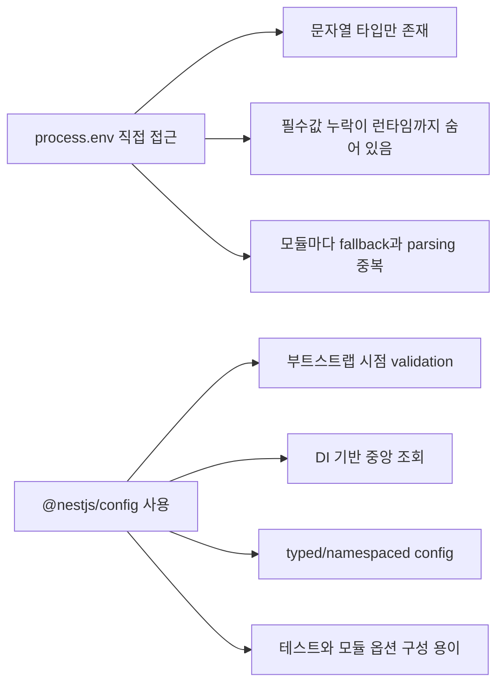
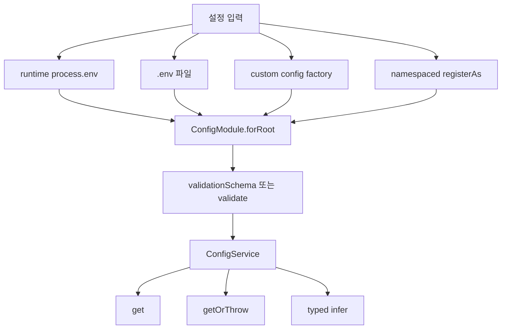
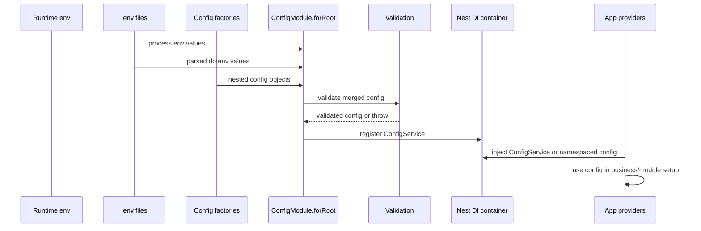
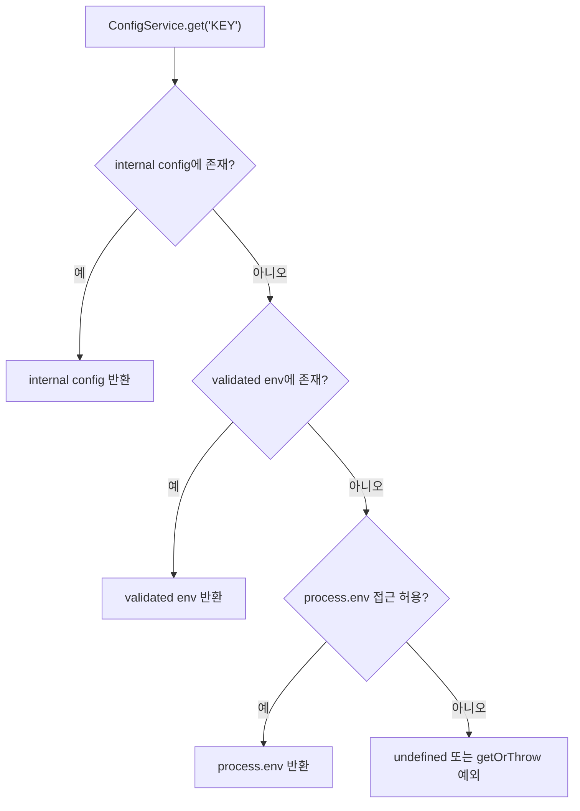
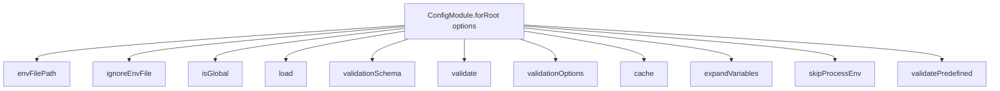
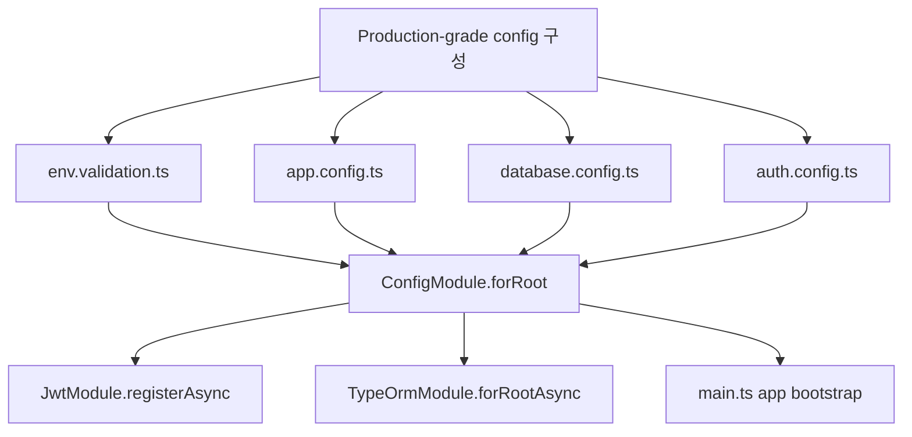
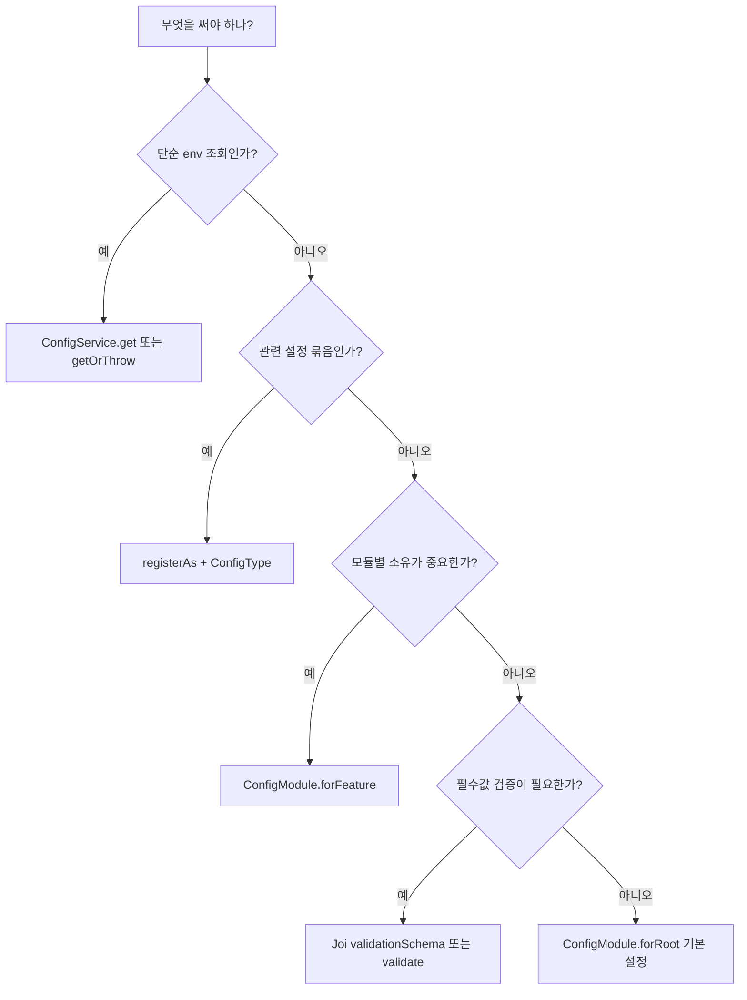

# @nestjs/config

- 검증 기준일: 2026-05-28
- 패키지 버전 기준: `@nestjs/config@4.0.4`
- peer dependencies: `@nestjs/common: ^10.0.0 || ^11.0.0`, `rxjs: ^7.1.0`
- 주요 출처: NestJS 공식 Configuration 문서, NestJS Migration Guide, Context7의 NestJS 공식 문서 인덱스, 사용자가 실행한 `npm view @nestjs/config version peerDependencies` 결과

## 1. 한 줄 요약



- `@nestjs/config`는 NestJS 애플리케이션에서 환경 변수, `.env` 파일, custom configuration object, validation, typed access를 일관되게 다루기 위한 공식 설정 모듈이다.
- 핵심 구성은 `ConfigModule`과 `ConfigService`다.
- `ConfigModule.forRoot()`는 설정 소스를 읽고 Nest dependency injection container에 `ConfigService`를 등록한다.
- `ConfigService`는 `get()`, `getOrThrow()` 등을 통해 설정값을 읽게 해준다.
- 단순 `.env` 로더로만 쓰기보다, production-grade NestJS에서는 다음을 함께 설계해야 한다.
  - 환경별 `.env` 파일 선택
  - 필수 환경 변수 validation
  - 숫자/boolean 타입 변환
  - namespaced config
  - feature module 단위 config 분리
  - secret 관리 방식
  - 테스트 환경 override 전략

## 2. 왜 중요한가



- NestJS 애플리케이션은 보통 환경별로 다른 설정을 가진다.
  - local database URL
  - production database URL
  - Redis host
  - JWT secret
  - OAuth client id/secret
  - CORS origin
  - external API endpoint
  - logging level

- `process.env`를 직접 쓰면 다음 문제가 생긴다.
  - 모든 값이 문자열 또는 `undefined`다.
  - `PORT="3000"`을 숫자로 바꾸는 코드가 여러 곳에 흩어진다.
  - `DATABASE_URL` 누락이 앱 시작 직후가 아니라 DB 연결 시점에 터진다.
  - `JWT_SECRET || 'dev-secret'` 같은 위험한 fallback이 production까지 흘러갈 수 있다.
  - 테스트에서 설정을 바꾸는 방식이 모듈마다 제각각이 된다.

- `@nestjs/config`를 쓰면 설정을 Nest DI graph 안으로 넣을 수 있다.
  - 서비스, 가드, 인터셉터, 모듈 옵션 factory에서 같은 방식으로 설정을 주입받는다.
  - 앱 시작 시 validation으로 잘못된 환경을 빠르게 실패시킬 수 있다.
  - 설정을 namespace별로 나눠 feature module 책임을 분리할 수 있다.

- 특히 NestJS의 dynamic module 패턴과 잘 맞는다.
  - `TypeOrmModule.forRootAsync()`
  - `JwtModule.registerAsync()`
  - `BullModule.forRootAsync()`
  - `ThrottlerModule.forRootAsync()`
  - `CacheModule.registerAsync()`

## 3. 핵심 개념



### 3.1 `ConfigModule`

- `ConfigModule`은 `@nestjs/config`의 Nest module이다.
- 보통 root module에서 한 번 호출한다.

```ts
import { Module } from '@nestjs/common';
import { ConfigModule } from '@nestjs/config';

@Module({
  imports: [ConfigModule.forRoot()],
})
export class AppModule {}
```

- 기본 동작:
  - 프로젝트 루트의 `.env` 파일을 읽는다.
  - `.env` 값과 런타임 환경 변수 값을 merge한다.
  - `ConfigService` provider를 등록한다.
  - 이후 다른 provider에서 `ConfigService`를 주입받을 수 있다.

### 3.2 `ConfigService`

- `ConfigService`는 설정값을 조회하는 provider다.

```ts
import { Injectable } from '@nestjs/common';
import { ConfigService } from '@nestjs/config';

@Injectable()
export class AppService {
  constructor(private readonly configService: ConfigService) {}

  getPort() {
    return this.configService.get<number>('PORT', 3000);
  }
}
```

- 자주 쓰는 메서드:
  - `get<T>(key)`
  - `get<T>(key, defaultValue)`
  - `getOrThrow<T>(key)`

- `get()`은 값이 없으면 `undefined`를 반환할 수 있다.
- 필수값은 `getOrThrow()` 또는 validation schema로 처리하는 편이 낫다.

### 3.3 `.env`와 `process.env`

- `@nestjs/config`는 내부적으로 `dotenv`를 사용한다.
- `.env` 예시:

```env
NODE_ENV=development
PORT=3000
DATABASE_HOST=localhost
DATABASE_PORT=5432
JWT_SECRET=local-secret
```

- 런타임 환경 변수와 `.env`에 같은 key가 있으면 런타임 환경 변수가 우선한다.
- 예:

```bash
PORT=4000 npm run start:dev
```

- 이 경우 `.env`에 `PORT=3000`이 있어도 `process.env.PORT` 계열 조회는 `4000`을 우선한다.

### 3.4 custom configuration factory

- `.env` 문자열을 그대로 쓰지 않고, 타입 변환과 grouping을 수행하는 함수다.

```ts
// src/config/configuration.ts
export default () => ({
  app: {
    nodeEnv: process.env.NODE_ENV ?? 'development',
    port: parseInt(process.env.PORT ?? '3000', 10),
  },
  database: {
    host: process.env.DATABASE_HOST ?? 'localhost',
    port: parseInt(process.env.DATABASE_PORT ?? '5432', 10),
  },
});
```

```ts
ConfigModule.forRoot({
  load: [configuration],
});
```

- `load`에는 여러 config factory를 넣을 수 있다.

### 3.5 namespaced configuration

- `registerAs()`로 설정 namespace를 만든다.

```ts
// src/config/database.config.ts
import { registerAs } from '@nestjs/config';

export default registerAs('database', () => ({
  host: process.env.DATABASE_HOST ?? 'localhost',
  port: parseInt(process.env.DATABASE_PORT ?? '5432', 10),
}));
```

- root module에서 로드:

```ts
ConfigModule.forRoot({
  load: [databaseConfig],
});
```

- provider에서 typed injection:

```ts
import { Inject, Injectable } from '@nestjs/common';
import { ConfigType } from '@nestjs/config';
import databaseConfig from './config/database.config';

@Injectable()
export class DatabaseService {
  constructor(
    @Inject(databaseConfig.KEY)
    private readonly dbConfig: ConfigType<typeof databaseConfig>,
  ) {}
}
```

## 4. 아키텍처 또는 흐름



### 4.1 일반적인 부트스트랩 순서

- 애플리케이션이 시작된다.
- `AppModule`이 `ConfigModule.forRoot()`를 import한다.
- `ConfigModule`이 `.env` 파일을 읽는다.
- `.env` 값과 이미 존재하는 `process.env` 값을 merge한다.
- `load`에 등록된 custom config factory를 실행한다.
- `validationSchema` 또는 `validate`가 있으면 검증한다.
- 검증 실패 시 애플리케이션 bootstrap이 실패한다.
- 성공하면 `ConfigService`가 Nest DI container에 등록된다.

### 4.2 조회 우선순위

- NestJS migration guide 기준으로 `@nestjs/config@4.0.0` 이후 `ConfigService#get`의 조회 우선순위가 변경되었다.
- 현재 중요한 순서는 다음과 같이 이해하면 된다.
  - internal configuration
  - validated environment variables
  - raw `process.env`



- 실무적으로 중요한 의미:
  - custom configuration이 raw environment variable보다 우선한다.
  - `skipProcessEnv`를 쓰면 `ConfigService#get`이 raw `process.env` fallback을 보지 않게 제한할 수 있다.
  - 이전 버전에서 process env 우선순위에 의존했다면 v4 업그레이드 시 동작을 확인해야 한다.

### 4.3 module option factory와의 연결

- NestJS dynamic module들은 설정값을 비동기로 주입받는 패턴을 제공한다.

```ts
JwtModule.registerAsync({
  imports: [ConfigModule],
  inject: [ConfigService],
  useFactory: (config: ConfigService) => ({
    secret: config.getOrThrow<string>('JWT_SECRET'),
    signOptions: {
      expiresIn: config.get<string>('JWT_EXPIRES_IN', '15m'),
    },
  }),
});
```

- 이 방식의 장점:
  - secret을 코드에 하드코딩하지 않는다.
  - module option 생성 시점에 validation된 값을 쓸 수 있다.
  - 테스트에서 `ConfigService`를 override하기 쉽다.

## 5. 중요 디테일, 옵션, 엣지 케이스



### 5.1 설치와 호환성

- 설치:

```bash
npm i --save @nestjs/config
```

- 2026-05-28 기준 사용자 실행 결과:

```text
version = '4.0.4'
peerDependencies = { '@nestjs/common': '^10.0.0 || ^11.0.0', rxjs: '^7.1.0' }
```

- 공식 문서 기준:
  - 내부적으로 `dotenv`를 사용한다.
  - variable expansion 기능에는 `dotenv-expand`를 사용한다.
  - TypeScript 4.1 이상이 필요하다.

### 5.2 `envFilePath`

- 기본 `.env` 위치는 project root다.
- 다른 파일을 쓰려면 `envFilePath`를 지정한다.

```ts
ConfigModule.forRoot({
  envFilePath: '.development.env',
});
```

- 여러 파일도 가능하다.

```ts
ConfigModule.forRoot({
  envFilePath: ['.env.local', '.env'],
});
```

- 같은 변수가 여러 파일에 있으면 먼저 지정한 파일이 우선한다.
- 실무 추천:
  - local override가 앞에 오게 둔다.
  - 예: `['.env.local', '.env']`

### 5.3 `ignoreEnvFile`

- `.env` 파일을 아예 읽지 않고 runtime environment만 사용한다.

```ts
ConfigModule.forRoot({
  ignoreEnvFile: true,
});
```

- 적합한 경우:
  - Docker/Kubernetes/Cloud Run/ECS 등에서 환경 변수를 외부 주입하는 경우
  - production에서 `.env` 파일 배포를 금지하는 경우
  - secret manager가 runtime env를 주입하는 경우

### 5.4 `isGlobal`

- `ConfigModule`을 전역 module로 만든다.

```ts
ConfigModule.forRoot({
  isGlobal: true,
});
```

- 장점:
  - 매 module마다 `ConfigModule`을 import하지 않아도 된다.

- 주의:
  - 전역 module은 편하지만 dependency가 암묵적이 된다.
  - 큰 monorepo나 library module에서는 명시 import가 더 읽기 쉬울 수 있다.

### 5.5 `load`

- custom config factory를 로드한다.

```ts
ConfigModule.forRoot({
  load: [appConfig, databaseConfig, authConfig],
});
```

- 장점:
  - 관련 설정을 namespace별로 묶을 수 있다.
  - parsing, default, transformation을 한 곳에 둘 수 있다.
  - `ConfigType<typeof config>`로 강한 타입을 만들 수 있다.

- 주의:
  - 공식 문서상 custom configuration file 자체는 `validationSchema`로 자동 검증되지 않는다.
  - YAML 등 외부 config 파일을 factory 안에서 읽는다면, factory 안에서 별도 validation을 해야 한다.

### 5.6 `validationSchema`와 Joi

- Joi schema로 환경 변수를 검증한다.

```ts
import * as Joi from 'joi';

ConfigModule.forRoot({
  validationSchema: Joi.object({
    NODE_ENV: Joi.string()
      .valid('development', 'production', 'test', 'provision')
      .default('development'),
    PORT: Joi.number().port().default(3000),
    DATABASE_URL: Joi.string().uri().required(),
    JWT_SECRET: Joi.string().min(32).required(),
  }),
});
```

- 기본적으로 schema key는 optional이다.
- required 값을 강제하려면 `.required()`를 명시한다.
- default를 넣으면 값이 없을 때 default가 validation 결과에 들어간다.

### 5.7 `validationOptions`

- `@nestjs/config`의 Joi validation 기본값:
  - `allowUnknown: true`
  - `abortEarly: false`

- 옵션을 직접 넘기는 경우에는 명시하지 않은 값이 Joi 기본값으로 돌아갈 수 있으므로 둘 다 명시하는 편이 안전하다.

```ts
ConfigModule.forRoot({
  validationSchema: Joi.object({
    NODE_ENV: Joi.string().valid('development', 'production', 'test').required(),
    PORT: Joi.number().port().default(3000),
  }),
  validationOptions: {
    allowUnknown: true,
    abortEarly: false,
  },
});
```

- `allowUnknown: false`
  - schema에 없는 환경 변수를 허용하지 않는다.
  - CI 환경, platform 자동 env가 많은 환경에서는 지나치게 엄격할 수 있다.

- `abortEarly: false`
  - 한 번에 모든 validation error를 보여준다.
  - 설정 오류를 고칠 때 더 유용하다.

### 5.8 custom `validate`

- Joi 대신 class-validator/class-transformer 또는 직접 로직을 쓸 수 있다.

```ts
// src/config/env.validation.ts
import { plainToInstance } from 'class-transformer';
import { IsEnum, IsNumber, IsString, Max, Min, validateSync } from 'class-validator';

enum Environment {
  Development = 'development',
  Production = 'production',
  Test = 'test',
}

class EnvironmentVariables {
  @IsEnum(Environment)
  NODE_ENV!: Environment;

  @IsNumber()
  @Min(0)
  @Max(65535)
  PORT!: number;

  @IsString()
  DATABASE_URL!: string;
}

export function validate(config: Record<string, unknown>) {
  const validated = plainToInstance(EnvironmentVariables, config, {
    enableImplicitConversion: true,
  });

  const errors = validateSync(validated, {
    skipMissingProperties: false,
  });

  if (errors.length > 0) {
    throw new Error(errors.toString());
  }

  return validated;
}
```

```ts
ConfigModule.forRoot({
  validate,
});
```

- 장점:
  - class-validator decorator 스타일을 유지할 수 있다.
  - 변환과 validation을 한 함수에 모을 수 있다.

- 단점:
  - Joi보다 schema를 한눈에 보기 어렵다고 느낄 수 있다.
  - custom validate 함수가 복잡해지면 별도 테스트가 필요하다.

### 5.9 `cache`

- `ConfigService#get`이 `process.env` 값을 읽을 때 성능을 개선하려면 cache를 켠다.

```ts
ConfigModule.forRoot({
  cache: true,
});
```

- 주의:
  - cache를 켜면 런타임 중 `process.env`를 바꿔 읽는 방식과는 잘 맞지 않는다.
  - 일반적인 서버 애플리케이션에서는 환경 변수는 부트 시점에 고정하는 편이 맞다.

### 5.10 `expandVariables`

- `.env` 안에서 다른 변수를 참조할 수 있게 한다.

```env
APP_HOST=example.com
SUPPORT_EMAIL=support@${APP_HOST}
```

```ts
ConfigModule.forRoot({
  expandVariables: true,
});
```

- 내부적으로 `dotenv-expand`를 사용한다.
- secret 문자열 조합에는 편하지만, 과도하게 쓰면 실제 최종값 추적이 어려워질 수 있다.

### 5.11 `skipProcessEnv`

- `ConfigService#get`이 raw `process.env` fallback을 조회하지 않도록 제한한다.

```ts
ConfigModule.forRoot({
  skipProcessEnv: true,
});
```

- 적합한 경우:
  - 설정을 custom config factory와 validation 결과로만 읽게 강제하고 싶은 경우
  - 모듈 내부에서 임의의 환경 변수를 몰래 읽는 패턴을 줄이고 싶은 경우

### 5.12 `validatePredefined`

- 미리 정의된 `process.env` 변수에 대한 validation을 비활성화할 때 사용한다.
- 예를 들어 `PORT=3000 node main.js`처럼 module import 전에 존재하던 env를 predefined variable로 볼 수 있다.
- migration guide에서는 deprecated된 `ignoreEnvVars` 대신 이 옵션을 언급한다.

### 5.13 partial registration: `forFeature()`

- feature module이 자기 config만 등록할 수 있다.

```ts
import { Module } from '@nestjs/common';
import { ConfigModule } from '@nestjs/config';
import databaseConfig from './config/database.config';

@Module({
  imports: [ConfigModule.forFeature(databaseConfig)],
})
export class DatabaseModule {}
```

- 장점:
  - 대형 프로젝트에서 root module에 모든 config를 몰아넣지 않아도 된다.
  - feature별 ownership이 선명해진다.

- 주의:
  - 공식 문서상 `forFeature()`는 module initialization 중 실행되며, module 초기화 순서는 상황에 따라 예측하기 어렵다.
  - 다른 module에서 partial registration으로 로드된 값을 constructor에서 너무 일찍 읽으면 문제가 될 수 있다.
  - 그런 경우 `onModuleInit()`에서 접근하는 방식이 더 안전하다.

## 6. 실전 예시



### 6.1 추천 폴더 구조

```text
src/
  config/
    app.config.ts
    auth.config.ts
    database.config.ts
    env.validation.ts
  app.module.ts
  main.ts
```

### 6.2 app config

```ts
// src/config/app.config.ts
import { registerAs } from '@nestjs/config';

export default registerAs('app', () => ({
  nodeEnv: process.env.NODE_ENV ?? 'development',
  port: parseInt(process.env.PORT ?? '3000', 10),
  corsOrigin: process.env.CORS_ORIGIN ?? 'http://localhost:3000',
}));
```

### 6.3 database config

```ts
// src/config/database.config.ts
import { registerAs } from '@nestjs/config';

export default registerAs('database', () => ({
  url: process.env.DATABASE_URL,
  pool: {
    max: parseInt(process.env.DATABASE_POOL_MAX ?? '10', 10),
    idleTimeoutMs: parseInt(process.env.DATABASE_IDLE_TIMEOUT_MS ?? '30000', 10),
  },
}));
```

### 6.4 auth config

```ts
// src/config/auth.config.ts
import { registerAs } from '@nestjs/config';

export default registerAs('auth', () => ({
  jwtSecret: process.env.JWT_SECRET,
  jwtExpiresIn: process.env.JWT_EXPIRES_IN ?? '15m',
}));
```

### 6.5 env validation

```ts
// src/config/env.validation.ts
import * as Joi from 'joi';

export const envValidationSchema = Joi.object({
  NODE_ENV: Joi.string()
    .valid('development', 'production', 'test')
    .default('development'),
  PORT: Joi.number().port().default(3000),
  CORS_ORIGIN: Joi.string().uri().default('http://localhost:3000'),
  DATABASE_URL: Joi.string().uri().required(),
  DATABASE_POOL_MAX: Joi.number().integer().min(1).max(100).default(10),
  DATABASE_IDLE_TIMEOUT_MS: Joi.number().integer().min(1000).default(30000),
  JWT_SECRET: Joi.string().min(32).required(),
  JWT_EXPIRES_IN: Joi.string().default('15m'),
});
```

### 6.6 AppModule 통합

```ts
// src/app.module.ts
import { Module } from '@nestjs/common';
import { ConfigModule } from '@nestjs/config';
import appConfig from './config/app.config';
import authConfig from './config/auth.config';
import databaseConfig from './config/database.config';
import { envValidationSchema } from './config/env.validation';

@Module({
  imports: [
    ConfigModule.forRoot({
      isGlobal: true,
      envFilePath: ['.env.local', '.env'],
      load: [appConfig, authConfig, databaseConfig],
      validationSchema: envValidationSchema,
      validationOptions: {
        allowUnknown: true,
        abortEarly: false,
      },
      cache: true,
      expandVariables: true,
    }),
  ],
})
export class AppModule {}
```

### 6.7 `main.ts`에서 사용

```ts
// src/main.ts
import { NestFactory } from '@nestjs/core';
import { ConfigService } from '@nestjs/config';
import { AppModule } from './app.module';

async function bootstrap() {
  const app = await NestFactory.create(AppModule);
  const config = app.get(ConfigService);

  const port = config.getOrThrow<number>('app.port');
  const corsOrigin = config.getOrThrow<string>('app.corsOrigin');

  app.enableCors({
    origin: corsOrigin,
  });

  await app.listen(port);
}

bootstrap();
```

### 6.8 `JwtModule.registerAsync()`에서 사용

```ts
import { Module } from '@nestjs/common';
import { ConfigModule, ConfigType } from '@nestjs/config';
import { JwtModule } from '@nestjs/jwt';
import authConfig from '../config/auth.config';

@Module({
  imports: [
    JwtModule.registerAsync({
      imports: [ConfigModule.forFeature(authConfig)],
      inject: [authConfig.KEY],
      useFactory: (auth: ConfigType<typeof authConfig>) => ({
        secret: auth.jwtSecret,
        signOptions: {
          expiresIn: auth.jwtExpiresIn,
        },
      }),
    }),
  ],
})
export class AuthModule {}
```

### 6.9 `ConfigService` typed access

```ts
import { Injectable } from '@nestjs/common';
import { ConfigService } from '@nestjs/config';

type AppRuntimeConfig = {
  app: {
    port: number;
    nodeEnv: string;
  };
  database: {
    url: string;
  };
};

@Injectable()
export class HealthService {
  constructor(
    private readonly config: ConfigService<AppRuntimeConfig, true>,
  ) {}

  getInfo() {
    const port = this.config.get('app.port', { infer: true });
    const databaseUrl = this.config.get('database.url', { infer: true });

    return {
      port,
      hasDatabaseUrl: Boolean(databaseUrl),
    };
  }
}
```

### 6.10 테스트에서 override

```ts
import { Test } from '@nestjs/testing';
import { ConfigService } from '@nestjs/config';

const moduleRef = await Test.createTestingModule({
  providers: [
    TargetService,
    {
      provide: ConfigService,
      useValue: {
        get: jest.fn((key: string, fallback?: unknown) => {
          const values: Record<string, unknown> = {
            'app.port': 3001,
            'auth.jwtSecret': 'test-secret-with-enough-length',
          };

          return values[key] ?? fallback;
        }),
        getOrThrow: jest.fn((key: string) => {
          const values: Record<string, unknown> = {
            'auth.jwtSecret': 'test-secret-with-enough-length',
          };

          if (!(key in values)) {
            throw new Error(`Missing config: ${key}`);
          }

          return values[key];
        }),
      },
    },
  ],
}).compile();
```

### 6.11 실무 체크리스트

- production secret은 `.env` 파일로 Git에 커밋하지 않는다.
- `.env.example`에는 key 이름과 non-secret placeholder만 둔다.
- `DATABASE_URL`, `JWT_SECRET`, OAuth secret 등 필수값은 validation에서 `.required()` 처리한다.
- boolean 값은 문자열 비교를 명시한다.
  - 예: `process.env.FEATURE_X_ENABLED === 'true'`
- 숫자는 config factory에서 `parseInt` 또는 validation 변환으로 처리한다.
- feature module에는 `registerAs()`와 `ConfigType` 조합을 우선 고려한다.
- 필수 설정 조회에는 `getOrThrow()`를 선호한다.
- `isGlobal: true`를 쓰더라도 module option factory에서는 필요한 imports/inject를 명확히 작성한다.
- production에서는 `ignoreEnvFile: true`를 고려하고 platform env/secret manager를 사용한다.
- v4 업그레이드 시 `ConfigService#get` 우선순위 변경 영향을 확인한다.

## 7. 용어 정리와 빠른 복습



- `ConfigModule`
  - NestJS 설정 기능을 DI container에 등록하는 module이다.

- `ConfigModule.forRoot()`
  - root module에서 환경 파일, config factory, validation을 초기화하는 entrypoint다.

- `ConfigService`
  - 설정값을 조회하는 injectable provider다.

- `.env`
  - local 개발과 테스트에서 자주 쓰는 key-value 환경 파일이다.

- `envFilePath`
  - 읽을 `.env` 파일 경로를 지정하는 옵션이다.

- `ignoreEnvFile`
  - `.env` 파일 로딩을 끄는 옵션이다.

- `isGlobal`
  - `ConfigModule`을 전역 module로 등록하는 옵션이다.

- `load`
  - custom config factory 배열을 등록하는 옵션이다.

- `registerAs()`
  - config namespace를 만드는 helper다.

- `ConfigType`
  - `registerAs()`로 만든 config factory의 반환 타입을 추론하는 TypeScript helper다.

- `forFeature()`
  - feature module 단위로 특정 config factory만 등록하는 partial registration API다.

- `validationSchema`
  - Joi schema로 환경 변수를 검증하는 옵션이다.

- `validate`
  - 직접 작성한 validation/transformation 함수를 쓰는 옵션이다.

- `validationOptions`
  - Joi validation 동작을 조정하는 옵션이다.

- `cache`
  - `process.env` 조회 성능 개선을 위한 cache 옵션이다.

- `expandVariables`
  - `.env` 안에서 `${OTHER_VAR}` 형태의 변수 확장을 켜는 옵션이다.

- `skipProcessEnv`
  - `ConfigService#get`이 raw `process.env`를 직접 fallback 조회하지 않도록 하는 옵션이다.

- `validatePredefined`
  - module import 전에 이미 있던 predefined `process.env` 변수 validation 여부를 조정하는 옵션이다.

- 빠른 결론:
  - 작은 앱: `ConfigModule.forRoot({ isGlobal: true, validationSchema })`
  - 중간 규모 앱: `registerAs()`로 `app`, `database`, `auth` namespace 분리
  - 큰 앱: feature module별 `forFeature()`, typed injection, config validation 테스트까지 구성
  - production: `.env` 파일보다 platform env/secret manager를 우선하고, 필수값은 startup validation으로 fail-fast 처리

## 참고 링크

- [NestJS 공식 문서 - Configuration](https://docs.nestjs.com/techniques/configuration)
- [NestJS 공식 문서 - Migration Guide](https://docs.nestjs.com/migration-guide)
- [NestJS 공식 문서 - Dynamic modules](https://docs.nestjs.com/fundamentals/dynamic-modules)
- [NestJS 공식 문서 - Unit testing](https://docs.nestjs.com/fundamentals/unit-testing)
- [NestJS Config GitHub repository](https://github.com/nestjs/config)
- [@nestjs/config npm package](https://www.npmjs.com/package/%40nestjs/config)
- [dotenv GitHub repository](https://github.com/motdotla/dotenv)
- [dotenv-expand GitHub repository](https://github.com/motdotla/dotenv-expand)
- [Joi documentation](https://joi.dev/api/)
- [class-validator GitHub repository](https://github.com/typestack/class-validator)
- [class-transformer GitHub repository](https://github.com/typestack/class-transformer)
