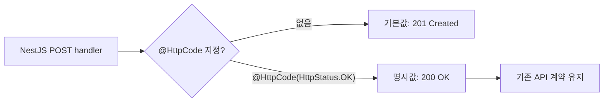
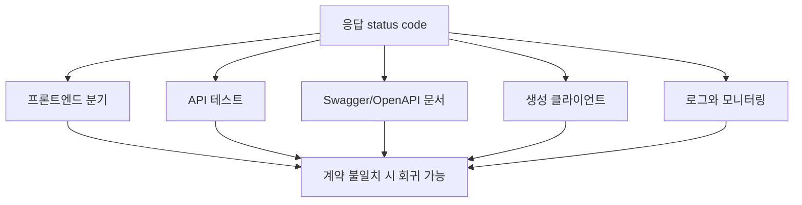
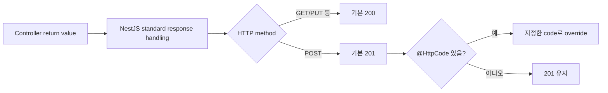
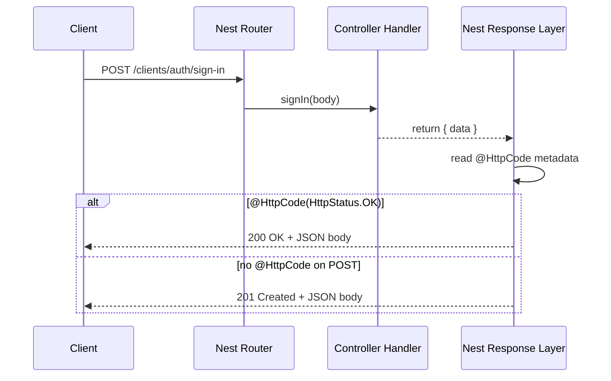
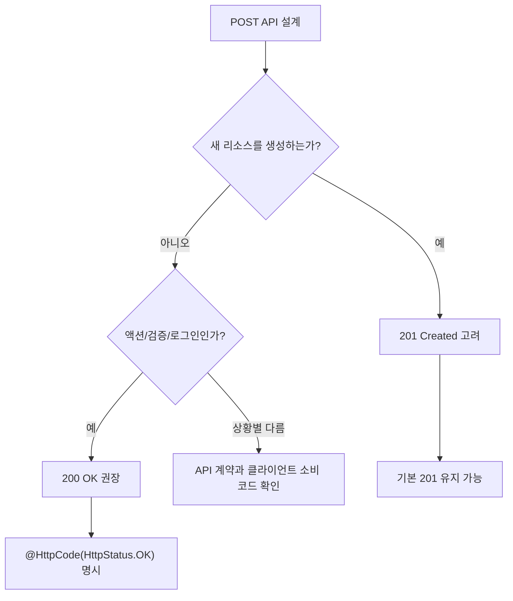
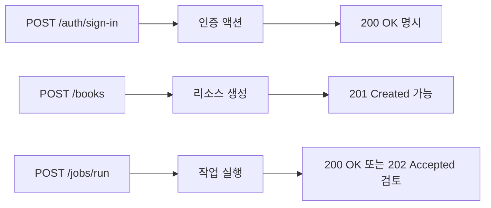
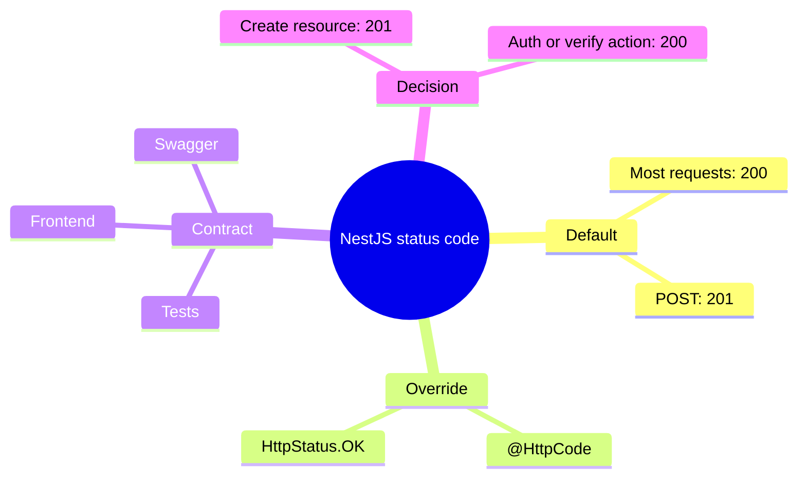

# NestJS @HttpCode(HttpStatus.OK)와 POST 응답 코드

## 1. 한 줄 요약

- NestJS에서 `POST` 핸들러는 기본 응답 status code가 `201 Created`다.
- `@HttpCode(HttpStatus.OK)`를 붙이면 해당 핸들러의 성공 응답 status code를 `200 OK`로 고정한다.
- 따라서 문법상 필수는 아니지만, 로그인·검증·액션 API처럼 `200 OK`가 API 계약이면 반드시 유지해야 한다.



## 2. 왜 중요한가

- HTTP status code는 단순 표시값이 아니라 클라이언트와 서버 사이의 계약이다.
- 프론트엔드가 `2xx` 전체를 성공으로 처리하면 `200`과 `201` 차이가 당장 드러나지 않을 수 있다.
- 하지만 아래 영역에서는 `200`과 `201` 차이가 실제 문제로 이어질 수 있다.
  - API 테스트에서 `expect(status).toBe(200)`처럼 명시 검증하는 경우
  - Swagger/OpenAPI 문서 또는 생성 클라이언트가 응답 코드를 계약으로 사용하는 경우
  - 프론트엔드, SDK, 외부 연동 코드가 특정 status code에 따라 분기하는 경우
  - 운영 로그, 모니터링, 알림 규칙이 status code별 의미를 다르게 해석하는 경우



## 3. 핵심 개념

- NestJS의 표준 응답 처리 방식은 컨트롤러 메서드가 반환한 객체를 자동으로 JSON 직렬화한다.
- 이때 기본 status code는 대체로 `200`이지만, `POST` 요청은 예외적으로 `201`을 기본값으로 사용한다.
- `@HttpCode()`는 라우트 핸들러 단위로 정적 status code를 덮어쓴다.
- `HttpStatus.OK`는 NestJS가 제공하는 enum 값이며, 실제 값은 `200`이다.
- `@Res()`로 Express response 객체를 직접 주입하면 응답을 직접 제어할 수 있지만, NestJS 표준 응답 처리와 일부 데코레이터 동작을 우회하게 된다.



## 4. 아키텍처와 흐름

- 요청이 컨트롤러에 들어오면 NestJS는 라우트 메서드의 데코레이터 메타데이터를 읽는다.
- `@Post()`는 HTTP method와 route path를 결정한다.
- `@HttpCode()`는 성공 응답에 사용할 status code 메타데이터를 결정한다.
- 컨트롤러가 `{ data }`를 반환하면 NestJS가 응답 body를 JSON으로 만들고, 최종 status code를 붙여 응답한다.



## 5. 중요한 세부사항과 트레이드오프

- `POST`라고 해서 항상 `201 Created`가 맞는 것은 아니다.
- `201 Created`는 보통 서버에 새 리소스가 생성되었음을 표현할 때 자연스럽다.
- 로그인, 인증번호 요청, 인증번호 검증, 검색, 계산, 상태 변경 액션처럼 “생성 리소스”가 핵심이 아닌 API는 `200 OK`가 더 자연스러운 경우가 많다.
- `@HttpCode(HttpStatus.OK)`를 붙이면 의도가 코드에 드러난다.
- 단점은 데코레이터가 하나 늘어나는 정도이며, 기존 계약을 명확히 보존한다는 장점이 더 크다.
- 동적 status code가 필요하면 `@HttpCode()` 하나로는 부족하고, 예외를 던지거나 플랫폼 응답 객체를 직접 다루는 방식이 필요하다.



## 6. 실무 예시

- 로그인 API는 새 사용자를 생성하지 않고 인증 결과와 토큰을 돌려주는 액션이다.
- 따라서 `POST /auth/sign-in`은 `201 Created`보다 `200 OK`가 자연스럽다.
- 반대로 `POST /clients`, `POST /books`처럼 실제 리소스를 만드는 API는 기본 `201 Created`가 의미상 맞을 수 있다.
- 응답 body가 없음을 명확히 하고 싶은 성공 액션은 `204 No Content`를 고려할 수 있지만, body를 반환하지 않아야 한다는 계약까지 같이 맞춰야 한다.

```ts
@Post('sign-in')
@HttpCode(HttpStatus.OK)
async signIn(@Body() body: SignInDto) {
    const data = await this.authService.signIn(body);
    return { data };
}

@Post()
async create(@Body() body: CreateBookDto) {
    const data = await this.bookService.create(body);
    return { data };
}
```



## 7. 용어 정리와 빠른 복습

- `@Post()`
  - NestJS 라우트 핸들러를 `POST` 요청에 매핑한다.
- `@HttpCode()`
  - 라우트 핸들러의 성공 응답 status code를 명시적으로 지정한다.
- `HttpStatus.OK`
  - NestJS enum으로 표현한 `200 OK`다.
- `201 Created`
  - 요청 처리 결과로 새 리소스가 생성되었음을 나타내는 status code다.
- API 계약
  - 서버와 클라이언트가 기대하는 method, path, status code, request body, response body의 약속이다.



## 8. 참고 링크

- [NestJS Controllers 공식 문서 - Status code](https://docs.nestjs.com/controllers#status-code)
- [NestJS 공식 문서 소스 - controllers.md](https://github.com/nestjs/docs.nestjs.com/blob/master/content/controllers.md)
- [NestJS API Reference - HttpCode](https://api-references-nestjs.netlify.app/api/common/HttpCode)
- [client-auth.controller.ts](/Users/nes0903/Documents/dobedub/vogopang_back/vogopang_back_main/src/services/auth/controllers/client-auth.controller.ts)
- [admin-auth.controller.ts](/Users/nes0903/Documents/dobedub/vogopang_back/vogopang_back_main/src/services/auth/controllers/admin-auth.controller.ts)
