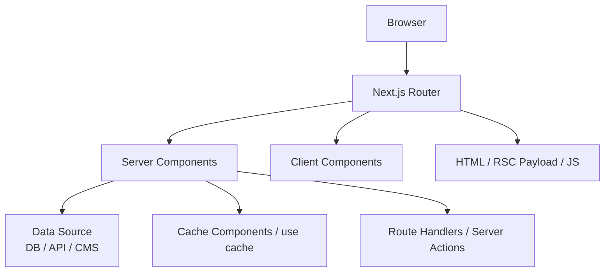

# Next.js 상세 정리

작성 기준일: 2026-04-14  
조사 방식: 웹검색 기반 최신 조사  
주요 참고: `nextjs.org` 공식 Docs / Blog / GitHub Releases / `vercel.com` 공식 문서

## 1. 문서 목적

이 문서는 `Next.js`를 처음 배우는 사람부터 이미 React를 써 본 사람까지, "Next.js가 정확히 무엇이고 2026년 기준으로 어떤 방식으로 이해하고 써야 하는지"를 한 번에 연결해서 이해할 수 있도록 정리한 학습 문서다.

단순히 기능 목록만 나열하지 않고 아래를 하나의 흐름으로 묶어 설명한다.

- Next.js의 정체와 역할
- App Router 중심 구조
- Server Components와 Client Components의 경계
- 데이터 패칭, 렌더링, 캐싱, 재검증 방식
- Server Actions, Route Handlers, `proxy.ts`
- 성능 최적화와 배포 방식
- Next.js 16 계열에서 달라진 점
- 실무 도입 체크리스트와 학습 순서

---

## 2. 2026-04 기준 Next.js의 현재 상태

지금 Next.js를 공부한다면 기준점은 분명하다.

- 공식 메이저 기준선은 `Next.js 16` 계열이다.
- `2025-10-21`에 `Next.js 16`이 공개되었고, 이 시점에 `Turbopack stable`, `Cache Components`, `proxy.ts`, 개선된 빌드/개발 로그가 핵심 변화로 소개되었다.
- `2026-03-18`에는 `Next.js 16.2`가 공개되었고, 개발 서버 시작 속도, 렌더링 성능, 디버깅, Turbopack, Adapter API 등 운영과 DX 측면의 개선이 이어졌다.
- GitHub Releases 기준 `2026-04-08` 시점 최신 안정 태그는 `v16.2.3`으로 확인된다.

즉 지금의 Next.js는 단순한 "React SSR 프레임워크"라고 보면 부족하다.

현재의 Next.js는:

- `React 기반 full-stack framework`
- `App Router` 중심 구조
- `Server Components` 기본 사용
- `캐시/재검증`이 아키텍처 핵심
- `Node 서버`, `Docker`, `정적 export`, `Adapter 기반 타 플랫폼 배포`

까지 포함해서 이해해야 한다.

또 중요한 관점이 있다.

- 새 프로젝트 학습의 중심은 `Pages Router`가 아니라 `App Router`다.
- `Pages Router`는 여전히 지원되지만, 최신 React 기능과 공식 설명의 중심축은 `App Router`다.
- 그래서 지금 공부를 시작한다면 `app/` 디렉터리와 `Server Components` 기준으로 mental model을 잡는 것이 맞다.

---

## 3. Next.js를 한 줄로 정의하면

`Next.js`는 `React로 웹 애플리케이션을 만들 때 필요한 라우팅, 서버 실행, 데이터 패칭, 캐싱, 최적화, 배포 모델을 함께 제공하는 프레임워크`다.

더 풀어 말하면:

- React는 UI를 만드는 라이브러리다.
- Next.js는 그 UI를 실제 서비스로 운영하기 위한 뼈대를 준다.
- 즉 "컴포넌트 렌더링"만이 아니라 "페이지 구조, 서버 실행, 데이터 접근, SEO, 이미지/폰트 최적화, 배포"까지 담당한다.

실무에서는 보통 이렇게 이해하면 된다.

- `React`만 쓰면 직접 결정해야 할 것이 많다.
- `Next.js`를 쓰면 그 결정의 상당 부분을 프레임워크 규약으로 정리할 수 있다.

---

## 4. 왜 Next.js를 쓰는가

React만으로도 앱은 만들 수 있다. 하지만 실제 서비스는 다음 문제를 계속 만난다.

- URL과 화면 구조를 어떻게 연결할 것인가
- 서버에서 데이터를 가져와 미리 렌더링할 것인가
- SEO를 어떻게 챙길 것인가
- 정적 페이지와 동적 페이지를 어떻게 섞을 것인가
- 캐시를 어디에 두고 언제 무효화할 것인가
- 이미지, 폰트, 스크립트 로딩을 어떻게 최적화할 것인가
- Node 서버, CDN, Docker, 클라우드 플랫폼에 어떻게 배포할 것인가

Next.js는 이 문제를 "라이브러리 조합"이 아니라 "프레임워크 규약"으로 푼다.

핵심 장점은 아래처럼 요약할 수 있다.

- `파일 시스템 기반 라우팅`: URL 구조가 코드 구조와 자연스럽게 연결된다.
- `서버 우선 모델`: 서버에서 데이터 접근과 렌더링을 먼저 처리할 수 있다.
- `캐시/재검증 내장`: fetch와 캐시 무효화 전략을 프레임워크 차원에서 제공한다.
- `최적화 기본 내장`: `next/image`, `next/font`, `next/script`, metadata API가 붙어 있다.
- `배포 선택지`: Vercel이 가장 자연스럽지만, Node 서버와 Docker, adapter 기반 배포도 가능하다.

---

## 5. 먼저 큰 그림



이 그림에서 중요한 포인트는 다음이다.

- 브라우저는 단순히 HTML만 받는 것이 아니다.
- Next.js는 `HTML`, `RSC Payload`, 필요한 `Client JS`를 조합해서 화면을 만든다.
- 서버에서 가능한 일은 서버에 두고, 브라우저 상호작용이 필요한 부분만 클라이언트로 내린다.
- 그래서 Next.js를 이해할 때는 "페이지 렌더링"보다 "`서버와 클라이언트의 경계를 어디에 둘 것인가`"가 더 중요하다.

---

## 6. Project Structure와 App Router

### 6.1 핵심 상위 폴더

공식 문서 기준으로 프로젝트를 볼 때 자주 만나는 상위 폴더는 아래다.

- `app`: App Router 기준 라우트와 레이아웃의 중심
- `pages`: 예전 Pages Router 구조
- `public`: 정적 자산
- `src`: 선택 사항이지만 소스 루트를 모아두고 싶을 때 사용

실무적으로는 App Router 기준이라면 `app/`를 가장 먼저 보면 된다.

### 6.2 App Router의 기본 규칙

App Router에서 폴더 하나는 보통 `route segment`다.

예를 들어:

```txt
app/
  dashboard/
    analytics/
      page.tsx
```

이면 `/dashboard/analytics` URL과 연결된다.

하지만 중요한 점이 있다.

- 폴더가 있다고 바로 외부 URL이 열리는 것은 아니다.
- 해당 segment에 `page.tsx` 또는 `route.ts`가 있어야 그 경로가 외부에 공개된다.
- 그리고 실제로 클라이언트로 보내지는 것은 `page.tsx`나 `route.ts`가 반환하는 내용뿐이다.

이 덕분에 같은 segment 폴더 안에 아래 같은 파일을 같이 둬도 안전하다.

- `components.tsx`
- `queries.ts`
- `utils.ts`
- `schema.ts`

즉 `colocation`이 자연스럽다.

### 6.3 자주 쓰는 특수 파일

App Router에서 자주 보는 특수 파일은 아래다.

- `page.tsx`: 실제 페이지 UI
- `layout.tsx`: 공통 레이아웃
- `loading.tsx`: 스트리밍 대기 UI
- `error.tsx`: 세그먼트 단위 에러 UI
- `global-error.tsx`: 앱 전체 에러 UI
- `not-found.tsx`: 404 처리
- `route.ts`: API 스타일 핸들러
- `default.tsx`: parallel routes fallback

이 규약이 있기 때문에 Next.js는 "코드를 어디에 둬야 하는가"를 강하게 가이드한다.

### 6.4 구조화용 기능

Next.js App Router에는 단순 폴더 외에도 구조화용 기능이 있다.

- `Dynamic Segments`: `[id]`
- `Route Groups`: `(marketing)`
- `Private Folders`: `_internal`
- `Parallel Routes`
- `Intercepting Routes`

이 기능들은 URL 구조와 내부 구현 구조를 어느 정도 분리하게 해 준다.

즉:

- URL은 깔끔하게 유지하고
- 내부 코드는 기능 단위로 분리하고
- 필요한 곳에만 공유 레이아웃과 fallback을 붙일 수 있다.

---

## 7. Server Components와 Client Components

### 7.1 기본값은 서버다

App Router에서 `layout`과 `page`는 기본적으로 `Server Components`다.

이게 매우 중요하다.

- 데이터를 서버에서 바로 읽을 수 있다.
- 비밀값이나 서버 전용 로직을 브라우저로 보내지 않아도 된다.
- 클라이언트 번들 크기를 줄일 수 있다.
- 정적 렌더링, 캐시, 스트리밍과 잘 결합된다.

즉 지금 Next.js의 기본 사고방식은 "`가능하면 서버에서 처리하라`"다.

### 7.2 언제 Client Components를 쓰는가

브라우저 전용 상호작용이 필요하면 `Client Components`를 쓴다.

```tsx
'use client'
```

가 붙는 순간 그 파일은 클라이언트 경계가 된다.

Client Components가 필요한 대표 상황:

- `onClick`, `onChange` 같은 이벤트 핸들러
- `useState`, `useReducer`
- `useEffect`
- `window`, `localStorage`, `navigator`
- 브라우저 전용 라이브러리

즉 "상태와 이벤트"가 필요하면 클라이언트, 그렇지 않으면 서버를 우선 생각하면 된다.

### 7.3 경계를 어떻게 생각해야 하나

`'use client'`는 단순 플래그가 아니라 `번들 경계`다.

- 그 파일 자체가 클라이언트에서 실행된다.
- 그 파일이 import하는 의존성도 클라이언트 번들로 끌려 들어간다.

그래서 실무에서는:

- 페이지 전체를 클라이언트 컴포넌트로 만들기보다
- 인터랙션이 필요한 작은 영역만 클라이언트로 분리하는 것이 좋다.

예:

- `page.tsx`는 서버
- `SearchBox.tsx`만 클라이언트
- `Chart.tsx`만 클라이언트

이 구조가 번들 크기와 성능 면에서 더 유리하다.

### 7.4 첫 렌더링은 어떻게 이뤄지나

공식 문서 설명의 핵심은 아래다.

- 서버에서 Server Components 트리를 렌더링한다.
- 이 결과는 `RSC Payload`라는 React 전용 데이터 형식으로 만들어진다.
- 동시에 빠른 초기 표시를 위한 HTML을 만든다.
- 클라이언트는 HTML을 먼저 보여주고, 이후 JS와 RSC Payload를 사용해 hydration과 업데이트를 수행한다.

즉 Next.js를 이해할 때 "HTML만 온다"가 아니라 "`HTML + RSC Payload + 필요한 JS`가 온다"로 봐야 한다.

---

## 8. 데이터 패칭과 렌더링 전략

### 8.1 지금 기준의 기본 패턴

현재 App Router에서 공식 문서가 가장 자연스럽게 설명하는 데이터 패칭 방식은 아래다.

- 서버에서는 `fetch`를 직접 사용
- 또는 ORM / DB 클라이언트를 직접 사용
- 클라이언트에서는 필요 시 `use()` 또는 SWR / React Query 같은 라이브러리 사용

즉 예전처럼 "무조건 `getServerSideProps`나 `getStaticProps`를 먼저 배운다"가 아니다.

지금은:

- `Server Components` 안에서 서버 데이터 접근
- `Suspense`와 스트리밍 활용
- 캐시 여부를 의도적으로 설계

가 더 핵심이다.

### 8.2 정적 렌더링과 동적 렌더링

Next.js는 라우트 단위로 "정적"과 "동적" 성격을 나눈다.

- `정적 렌더링`: 빌드 시점 또는 캐시 가능한 결과를 미리 만들어 둠
- `동적 렌더링`: 요청 시점마다 결과를 계산

그리고 App Router에서는 둘 중 하나만 고르는 게 아니라:

- 어떤 부분은 정적으로
- 어떤 부분은 동적으로
- 일부는 스트리밍

형태로 섞을 수 있다.

### 8.3 무엇이 동적 렌더링을 유발하나

공식 문서 기준으로 아래 같은 요청 시점 API를 읽으면 라우트가 동적으로 전환될 수 있다.

- `cookies()`
- `headers()`
- `searchParams`

즉 사용자의 현재 요청 정보에 직접 의존하면, 그 라우트는 더 이상 완전 정적으로 다루기 어렵다.

### 8.4 Pages Router 관점의 SSR / SSG / ISR

실무에서는 여전히 아래 용어가 계속 쓰인다.

#### SSR

- 요청마다 HTML을 새로 만든다.
- Pages Router에서는 `getServerSideProps`가 대표적이다.
- 항상 최신 데이터가 중요할 때 적합하다.
- 대신 서버 부하와 응답 지연이 더 커질 수 있다.

#### SSG

- 빌드 시 HTML을 미리 생성한다.
- 변경이 거의 없는 문서형 페이지에 적합하다.
- 빠르고 CDN 친화적이다.

#### ISR

- 정적 페이지를 기반으로 하되, 일정 주기 또는 특정 이벤트 후 재생성한다.
- "빠른 정적 페이지 + 주기적 최신화"가 필요할 때 유용하다.

다만 App Router에 들어오면 이 용어를 그대로 외우기보다 "`정적 shell, 캐시, 재검증, 스트리밍을 어떻게 조합하는가`" 관점으로 이해하는 편이 더 정확하다.

### 8.5 스트리밍

Next.js는 `Suspense` 경계를 활용해 UI를 나눠서 먼저 보낼 수 있다.

즉:

- 페이지 전체가 준비될 때까지 기다리지 않고
- 먼저 보여줄 수 있는 부분은 먼저 보여주고
- 느린 데이터 구간은 나중에 채워 넣는다

이게 체감 성능을 크게 바꾼다.

그래서 `loading.tsx`와 `Suspense`는 단순 UX 장식이 아니라 렌더링 전략의 일부다.

---

## 9. 캐싱: Next.js를 제대로 쓰려면 꼭 알아야 하는 축

### 9.1 현재 문서의 핵심은 Cache Components

Next.js 16 계열 공식 문서에서 캐싱 설명의 중심축은 `Cache Components`다.

핵심 아이디어는 이렇다.

- 한 라우트 안에서도
- 정적으로 보여줄 부분
- 캐시 가능한 부분
- 완전히 동적인 부분

을 분리해서 조합한다.

예전 PPR 설명은 개념 이해에 도움이 되지만, 현재 문서 중심은 `Cache Components + use cache`다.

### 9.2 `use cache`

`use cache`는 async 함수, 컴포넌트, 라우트 등을 캐시 가능하게 만드는 지시어다.

이걸 붙이면:

- 결과를 재사용할 수 있고
- 캐시된 결과를 정적 shell 일부처럼 활용할 수 있고
- 이후 재검증과 태그 무효화 전략과 연결할 수 있다.

즉 `use cache`는 단순 성능 옵션이 아니라, "이 계산 결과를 어떤 수명으로 공유할 것인가"를 선언하는 장치다.

### 9.3 fetch와 캐시는 어떻게 봐야 하나

현재 공식 문서 기준으로 서버 `fetch()`는 Next.js 확장을 통해 데이터 캐시와 재검증 semantics를 가진다.

중요한 포인트:

- 같은 요청 트리 안에서는 요청 memoization이 일어난다.
- 하지만 영속 캐시에 넣을지, 언제 다시 갱신할지는 별도로 설계해야 한다.
- 즉 "fetch를 썼다 = 자동으로 잘 캐시된다"는 식으로 생각하면 틀리기 쉽다.

실무에서는 아래 질문을 먼저 해야 한다.

- 이 데이터는 사용자별인가, 공용인가
- 몇 초/몇 분까지 stale 허용 가능한가
- 갱신은 시간 기반인가, 이벤트 기반인가
- 경로 기준으로 무효화할 것인가, 태그 기준으로 무효화할 것인가

### 9.4 `cacheLife`

`cacheLife`는 캐시 수명 정책을 정하는 함수다.

이 문맥에서 자주 보는 값은:

- `stale`: 오래된 값을 얼마나 허용할지
- `revalidate`: 백그라운드 갱신 시점
- `expire`: 완전 만료 시점

즉 "지금 바로 새 데이터를 강제할지", "오래된 값을 먼저 주고 뒤에서 갱신할지"를 세밀하게 설계할 수 있다.

### 9.5 `cacheTag`

`cacheTag`는 캐시 결과에 태그를 붙이는 방식이다.

예:

- 상품 목록 캐시에는 `products`
- 특정 상품 캐시에는 `product:123`

같이 태그를 붙일 수 있다.

그러면 나중에 특정 태그만 골라 무효화할 수 있다.

### 9.6 `revalidateTag`

`revalidateTag`는 태그 기반 재검증을 요청한다.

현재 공식 권장 방향은 `profile="max"` 기반 stale-while-revalidate 방식 이해다.

즉:

- 당장 오래된 값을 먼저 보여주고
- 뒤에서 새 값을 가져와 갱신

하는 전략이다.

이 방식은 UX와 성능의 균형을 잡을 때 유용하다.

### 9.7 `updateTag`

`updateTag`는 `Server Actions` 전용으로 이해하는 것이 좋다.

`revalidateTag`와 차이는 다음과 같다.

- `revalidateTag`: 주로 태그 기반 재검증
- `updateTag`: 쓰기 직후 바로 최신 결과를 읽어야 하는 read-your-own-writes 성격에 더 적합

즉 사용자가 폼 제출 후 바로 바뀐 결과를 보는 시나리오에서는 `updateTag`가 더 직접적일 수 있다.

### 9.8 `revalidatePath`

경로 단위 무효화가 필요하면 `revalidatePath`를 쓴다.

이건 태그 기반이 아니라:

- `/dashboard`
- `/products/[id]`

같은 특정 라우트 결과를 다시 계산하게 만드는 방식이다.

---

## 10. Server Actions

### 10.1 정체

`Server Actions`는 서버에서 실행되는 async 함수다.

보통 아래처럼 선언한다.

```tsx
'use server'
```

핵심은 다음이다.

- 클라이언트 이벤트에서 시작되더라도
- 실제 변경 작업은 서버에서 실행하고
- 그 결과를 Next.js 캐시 무효화와 연결할 수 있다.

### 10.2 왜 중요한가

예전에는 흔히:

- 폼 제출
- 클라이언트에서 fetch
- 별도 API route 작성
- 응답 받고 상태 갱신

흐름을 많이 썼다.

Server Actions를 쓰면:

- 폼 `action`
- 서버 함수 실행
- DB 변경
- `revalidatePath`, `revalidateTag`, `updateTag`

를 더 가까운 문맥 안에 묶을 수 있다.

즉 "쓰기 로직 + UI 갱신"의 거리가 짧아진다.

### 10.3 주의점

공식 production checklist는 Server Actions 보안도 분명하게 강조한다.

- 액션 내부에서 인증/인가를 직접 확인해야 한다.
- 페이지나 레이아웃 수준 체크만 믿으면 안 된다.
- 민감 데이터 접근은 `server-only` 데이터 접근 계층으로 분리하는 것이 좋다.
- 비싼 액션에는 rate limiting도 고려해야 한다.

즉 Server Actions는 편하지만 "서버 함수"라는 사실을 잊으면 안 된다.

---

## 11. Route Handlers와 `proxy.ts`

### 11.1 Route Handlers

`Route Handlers`는 `app/` 디렉터리 안에서 Web `Request` / `Response` API를 이용해 핸들러를 만드는 방식이다.

예:

```txt
app/api/users/route.ts
```

대표 특징:

- `GET`, `POST` 같은 HTTP 메서드별 함수 export
- App Router 내부에 자연스럽게 API 엔드포인트 배치
- 예전 `pages/api/*`의 역할을 App Router 방식으로 수행

즉 지금 App Router 기준으로는 별도 API route가 필요하면 `route.ts`를 먼저 생각하면 된다.

### 11.2 `page.tsx`와 같은 레벨에 둘 수 없는 이유

같은 route segment level에는 `page.tsx`와 `route.ts`를 동시에 둘 수 없다.

이유는 그 segment가:

- 페이지 UI를 반환하는 세그먼트인지
- request handler를 제공하는 세그먼트인지

역할이 충돌하기 때문이다.

### 11.3 `middleware.ts`에서 `proxy.ts`로

Next.js 16에서 중요한 변화 중 하나가 이것이다.

- `middleware.ts`는 deprecated 방향
- 새 이름은 `proxy.ts`
- export 함수명도 `proxy`

이 변화는 단순 rename 이상의 의미가 있다.

공식 메시지는 "이 파일이 애플리케이션 내부 로직이 아니라 네트워크 경계에서 동작하는 layer"라는 점을 더 분명하게 하려는 것이다.

즉 예전 감각대로 모든 공통 로직을 middleware에 몰아넣는 습관은 재검토가 필요하다.

---

## 12. 성능 최적화

### 12.1 `next/image`

`next/image`는 Next.js의 대표 최적화 기능이다.

주요 장점:

- 이미지 크기 자동 최적화
- WebP / AVIF 같은 현대 포맷 지원
- lazy loading
- blur placeholder
- layout shift 감소

실무적으로는 LCP와 CLS 개선에 직접 연결된다.

### 12.2 `next/font`

`next/font`는 폰트를 자체 호스팅하고 외부 네트워크 요청을 줄여 준다.

장점:

- 외부 font CDN 의존성 감소
- 개인정보/프라이버시 측면 유리
- 레이아웃 흔들림 감소
- 성능 안정화

전역 적용은 보통 Root Layout에서 한다.

### 12.3 `<Script />`와 서드파티 로딩

서드파티 스크립트는 메인 스레드를 막기 쉽다.

Next.js는 `<Script />`와 `@next/third-parties` 같은 도구를 통해:

- 로딩 시점 제어
- 성능 저하 최소화
- 공식 래퍼 우선 사용

흐름을 권장한다.

### 12.4 번들 분석

클라이언트 번들이 커지면 결국 성능과 UX가 나빠진다.

대표 도구:

- `@next/bundle-analyzer`
- `optimizePackageImports`

이걸 이용하면:

- 어떤 패키지가 큰지
- 필요 없는 모듈이 같이 묶였는지
- 클라이언트 경계가 지나치게 넓은지

를 더 빨리 찾을 수 있다.

### 12.5 Turbopack

Turbopack은 Rust 기반 증분 번들러다.

Next.js 16에서 중요한 의미는:

- 이미 stable 축으로 들어왔고
- 개발 속도와 빌드 속도에서 큰 투자 대상이며
- App Router와 Pages Router 양쪽에서 빠른 반복 작업을 목표로 한다

는 점이다.

실무 관점에서는 "Webpack을 억지로 의식하기보다, Next의 최신 기본 DX가 Turbopack 쪽으로 기울고 있다" 정도로 이해하면 된다.

---

## 13. 배포와 운영

### 13.1 기본 배포 선택지

공식 배포 문서는 크게 아래 선택지를 준다.

- `Node.js server`
- `Docker container`
- `Static export`
- `Adapters`

중요한 점은 "Next.js는 Vercel 전용 프레임워크가 아니다"라는 것이다.

물론 Vercel이 가장 자연스럽지만, Node 서버로도 충분히 운영 가능하다.

### 13.2 가장 표준적인 self-host 흐름

일반적인 Node 배포 흐름은 단순하다.

```bash
npm run build
npm run start
```

즉:

- 빌드 시점에 최적화 산출물을 만들고
- 운영 서버에서는 `next start`로 실행

하는 구조다.

### 13.3 Vercel의 장점

Vercel은 Next.js와 가장 밀접하게 맞물린 배포 플랫폼이다.

장점:

- zero-config에 가까운 배포
- Git 연동
- PR별 preview URL
- 운영/미리보기 환경 분리
- Speed Insights, Observability 연계

그래서 팀 협업에서는 preview URL을 QA 게이트처럼 쓰기 좋다.

### 13.4 Adapter API

Next.js 16.2에서는 Adapter API가 stable로 강조되었다.

이건 중요한 변화다.

- 특정 플랫폼에만 종속되지 않고
- Next.js 빌드 결과를 플랫폼이 해석할 수 있는 공용 계약을 강화하려는 방향

이기 때문이다.

즉 앞으로는 "Vercel이 아니면 어렵다"보다 "공식 adapter surface를 통해 다양한 플랫폼이 맞춰 가는 흐름"으로 보는 편이 맞다.

### 13.5 모니터링

운영에서는 아래 도구를 같이 보면 좋다.

- `useReportWebVitals`
- OpenTelemetry (`instrumentation.ts`, `@vercel/otel`)
- Vercel Speed Insights / Observability

즉 Next.js는 단순히 빌드만 하는 프레임워크가 아니라, 운영 관측까지 이어지는 경로를 공식 문서에서 같이 안내한다.

---

## 14. 보안과 production checklist

공식 production checklist를 보면 Next.js 팀이 실제 운영에서 무엇을 중요하게 보는지 드러난다.

핵심 포인트:

- 폼과 validation은 Server Actions와 함께 서버 측 검증을 우선할 것
- `global-error.tsx`, `global-not-found.tsx` 등 fallback UI 준비
- `next/font`, `next/image`, `Script`를 이용한 기본 최적화
- 민감 데이터는 tainting / `server-only` 전략 검토
- `.env.*`는 git에 올리지 말 것
- 공개 변수만 `NEXT_PUBLIC_` prefix 사용
- CSP 고려
- metadata, sitemap, robots 설정
- 배포 전 `next build`, `next start`로 production-like 테스트

이 체크리스트는 단순 문서가 아니라 "실무에서 놓치기 쉬운 운영 항목"에 가깝다.

---

## 15. Next.js 15에서 16으로 넘어오며 달라진 점

### 15.1 가장 큰 변화 요약

실무자가 체감할 큰 변화는 대략 아래다.

- `Turbopack`이 더 중심으로 올라왔다.
- 캐싱 설명의 중심이 `Cache Components`로 이동했다.
- `middleware.ts`가 `proxy.ts`로 정리됐다.
- 업그레이드 CLI와 codemod 흐름이 더 정돈됐다.
- 플랫폼 간 배포 surface가 Adapter API 방향으로 개선됐다.

### 15.2 PPR를 어떻게 이해할 것인가

학습하다 보면 `PPR(Partial Prerendering)` 문서를 자주 보게 된다.

이때 주의할 점:

- Next 15 문서에서는 PPR가 더 전면에 보인다.
- Next 16 현재 문서에서는 `Cache Components`가 더 상위 설명 모델이다.

그래서 지금 기준으로는:

- PPR는 개념 이해용으로 참고
- 실제 현행 모델은 `Cache Components`, `use cache`, `cacheLife`, `cacheTag`, `revalidateTag`, `updateTag`

순서로 이해하는 편이 더 정확하다.

### 15.3 업그레이드 기준선

공식 설치/업그레이드 기준에서 먼저 맞춰야 할 환경은 아래다.

- `Node.js 20.9+`
- `TypeScript 5.1+`
- 최신 React / React DOM
- 현대 브라우저 기준 지원 환경

즉 프레임워크 문법만 보는 것이 아니라 런타임과 툴체인 기준선부터 맞춰야 한다.

---

## 16. 언제 Next.js가 잘 맞고, 언제 과할 수 있는가

### 16.1 잘 맞는 경우

- SEO가 중요한 서비스
- 페이지 단위 라우팅이 핵심인 서비스
- 서버 렌더링과 데이터 접근이 필요한 서비스
- 콘텐츠와 대시보드가 섞인 서비스
- React 기반으로 빠르게 운영 가능한 웹 서비스를 만들고 싶은 경우

대표 예:

- SaaS 대시보드
- 커머스
- 블로그 / 문서 사이트
- 마케팅 사이트 + 앱 결합 구조

### 16.2 과할 수 있는 경우

- 완전 클라이언트 전용 내부 도구
- 복잡한 서버 렌더링이나 SEO가 거의 필요 없는 앱
- 아주 단순한 SPA

이 경우는 `Vite + React`가 더 단순하고 적합할 수도 있다.

즉 Next.js가 항상 정답은 아니고, "서버와 렌더링 전략이 중요한 웹앱"에서 특히 강하다.

---

## 17. 실무에서 자주 생기는 오해

### 오해 1: Next.js를 쓰면 자동으로 다 빨라진다

아니다.

- 클라이언트 경계를 너무 넓게 잡으면 번들이 커진다.
- 캐시 전략을 잘못 잡으면 느려질 수 있다.
- 동적 렌더링을 남발하면 서버 부하가 커진다.

즉 프레임워크는 도구를 주지만, 성능은 여전히 설계 문제다.

### 오해 2: App Router면 API route가 필요 없다

반은 맞고 반은 틀리다.

- UI와 가까운 쓰기 작업은 Server Actions가 더 자연스러울 수 있다.
- 외부 시스템 연동, webhook, 명시적 HTTP interface는 여전히 `route.ts`가 적합하다.

즉 둘은 대체 관계라기보다 역할 분담 관계에 가깝다.

### 오해 3: `use client`를 붙여도 별 차이 없다

큰 차이가 있다.

- 브라우저 JS 번들이 늘어난다.
- 서버 전용 최적화 기회를 잃는다.
- 데이터 접근 구조가 바뀐다.

그래서 `use client`는 "필요할 때만"이 원칙이다.

### 오해 4: Pages Router 지식이 전부 쓸모없어졌다

그렇지는 않다.

- SSR, SSG, ISR 용어 이해에는 아직 도움이 된다.
- 레거시 프로젝트는 여전히 pages 기반일 수 있다.

다만 새 학습의 출발점은 `App Router`가 맞다.

---

## 18. 추천 학습 순서

2026년 기준으로는 아래 순서가 가장 효율적이다.

### 1단계: 큰 그림

- Next.js가 React 위에서 무엇을 해결하는지 이해
- App Router와 Pages Router 차이 파악
- Server Components / Client Components 경계 이해

### 2단계: 구조

- `app/`
- `page.tsx`
- `layout.tsx`
- `loading.tsx`
- `error.tsx`
- `route.ts`

이 파일 규약부터 몸에 익히기

### 3단계: 데이터 패칭

- 서버에서 `fetch`
- 동적 렌더링 유발 조건
- `Suspense`
- 스트리밍

### 4단계: 캐싱과 재검증

- `use cache`
- `cacheLife`
- `cacheTag`
- `revalidateTag`
- `updateTag`
- `revalidatePath`

### 5단계: 쓰기 작업

- Server Actions
- `route.ts`
- 인증/인가와 보안 주의점

### 6단계: 운영

- `next/image`
- `next/font`
- 번들 분석
- 배포 방식
- OpenTelemetry / Web Vitals

이 순서로 가면 "문법 암기"가 아니라 "설계 감각"이 먼저 잡힌다.

---

## 19. 빠른 도입 체크리스트

새 프로젝트를 시작한다면 최소한 아래는 확인하는 것이 좋다.

- `create-next-app` 기본값을 사용할지 결정
- `App Router` 사용 여부 명확화
- `Node.js 20.9+` 환경 준비
- 어떤 화면이 서버인지, 어떤 부분만 클라이언트인지 먼저 구분
- 캐시 전략 설계
- 태그 기반 무효화가 필요한지 검토
- `Server Actions`와 `route.ts`의 역할 분리
- `next/image`, `next/font`, metadata API 사용
- `.env` 정책과 `NEXT_PUBLIC_` 구분
- 배포 대상이 Vercel인지 self-host인지 결정

실제로는 코드를 쓰기 전 이 체크리스트가 더 중요할 때가 많다.

---

## 20. 한 문장 결론

`Next.js`는 이제 "React로 페이지를 렌더링하는 도구"가 아니라, `서버 우선 렌더링, 캐시 설계, UI 스트리밍, 운영 최적화, 배포 모델`까지 포함해 생각해야 하는 `React 웹 서비스 프레임워크`다.

그래서 2026년 기준으로 Next.js를 잘 쓴다는 것은:

- App Router 구조를 이해하고
- 서버/클라이언트 경계를 잘 나누고
- 캐시와 재검증을 의도적으로 설계하고
- 필요한 부분만 클라이언트로 보내는 것

이라고 정리할 수 있다.

---

## 21. 공식 출처

- Docs 메인: <https://nextjs.org/docs>
- App Router: <https://nextjs.org/docs/app>
- Installation: <https://nextjs.org/docs/app/getting-started/installation>
- Project Structure: <https://nextjs.org/docs/app/getting-started/project-structure>
- Server and Client Components: <https://nextjs.org/docs/app/getting-started/server-and-client-components>
- Fetching Data: <https://nextjs.org/docs/app/getting-started/fetching-data>
- Updating Data / Server Actions: <https://nextjs.org/docs/app/getting-started/updating-data>
- Route Handlers: <https://nextjs.org/docs/app/getting-started/route-handlers>
- Caching: <https://nextjs.org/docs/app/getting-started/caching>
- Cache Components: <https://nextjs.org/docs/app/getting-started/cache-components>
- `use cache`: <https://nextjs.org/docs/app/api-reference/directives/use-cache>
- `cacheLife`: <https://nextjs.org/docs/app/api-reference/functions/cacheLife>
- `cacheTag`: <https://nextjs.org/docs/app/api-reference/functions/cacheTag>
- `revalidateTag`: <https://nextjs.org/docs/app/api-reference/functions/revalidateTag>
- `updateTag`: <https://nextjs.org/docs/app/api-reference/functions/updateTag>
- `revalidatePath`: <https://nextjs.org/docs/app/api-reference/functions/revalidatePath>
- `proxy.ts`: <https://nextjs.org/docs/app/api-reference/file-conventions/proxy>
- Middleware to Proxy 안내: <https://nextjs.org/docs/messages/middleware-to-proxy>
- `next/image`: <https://nextjs.org/docs/app/building-your-application/optimizing/images>
- `next/font`: <https://nextjs.org/docs/app/building-your-application/optimizing/fonts>
- Bundle Analyzer: <https://nextjs.org/docs/app/building-your-application/optimizing/bundle-analyzer>
- Third Party Libraries: <https://nextjs.org/docs/app/building-your-application/optimizing/third-party-libraries>
- Turbopack: <https://nextjs.org/docs/app/api-reference/turbopack>
- Deploying: <https://nextjs.org/docs/app/getting-started/deploying>
- Production Checklist: <https://nextjs.org/docs/app/guides/production-checklist>
- OpenTelemetry: <https://nextjs.org/docs/app/building-your-application/optimizing/open-telemetry>
- Content Security Policy: <https://nextjs.org/docs/app/building-your-application/configuring/content-security-policy>
- Upgrading: <https://nextjs.org/docs/app/getting-started/upgrading>
- Version 16 Upgrade Guide: <https://nextjs.org/docs/app/guides/upgrading/version-16>
- Next.js 16: <https://nextjs.org/blog/next-16>
- Next.js 16.2: <https://nextjs.org/blog/next-16-2>
- Next.js Across Platforms / Adapter API: <https://nextjs.org/blog/nextjs-across-platforms>
- GitHub Releases: <https://github.com/vercel/next.js/releases>
- Vercel Framework Docs for Next.js: <https://vercel.com/docs/frameworks/nextjs>
- Vercel Speed Insights: <https://vercel.com/docs/speed-insights>
- Vercel Observability: <https://vercel.com/docs/observability>

<!-- study-links:start -->
## 관련 문서

- `webhook`: [[webhook/webhook|Webhook 상세 정리]]
- `react`: [[react/react|React 상세 정리]]
- `vite`: [[vite/vite|Vite]]
<!-- study-links:end -->
