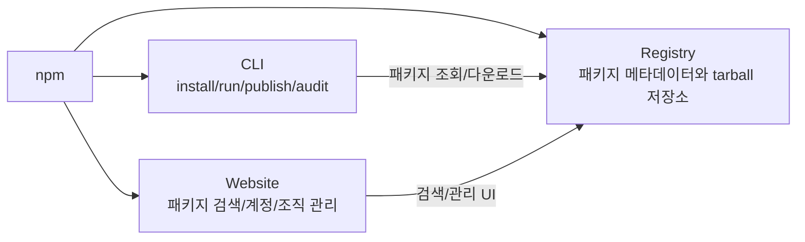
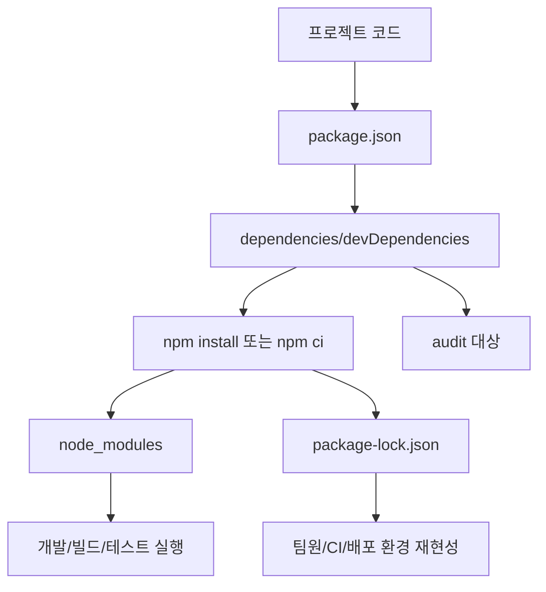
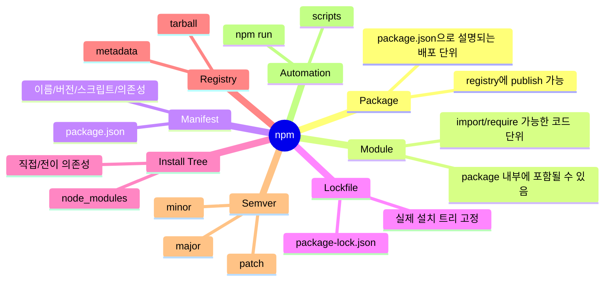
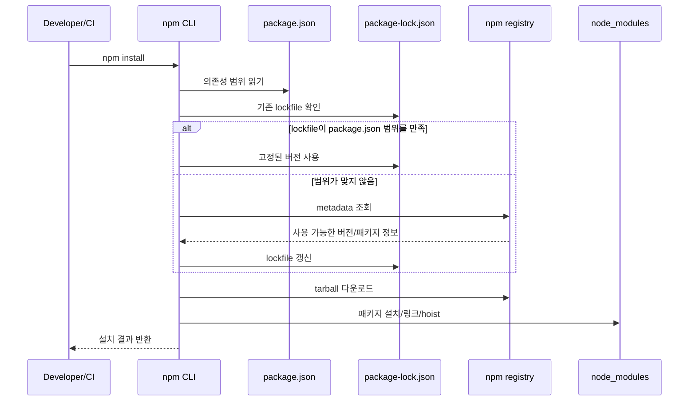
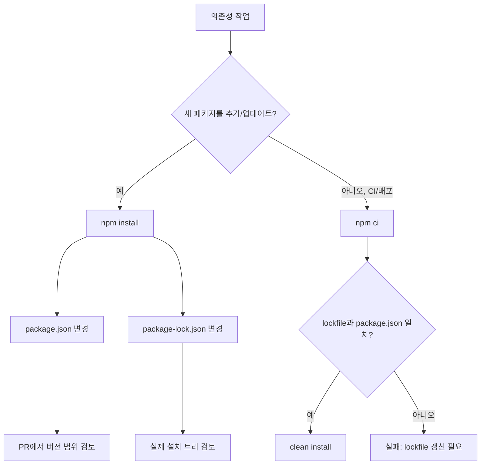
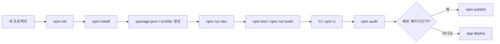
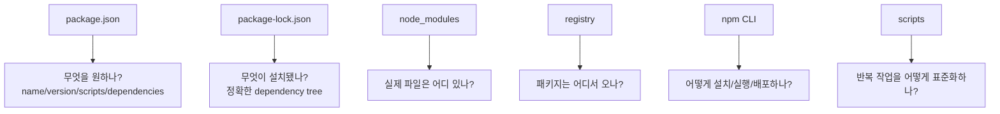

# npm

작성 기준일: 2026-07-09  
주요 참고:

- npm Docs, `About npm`
- npm Docs, `About packages and modules`
- npm CLI v11 Docs, `npm install`
- npm CLI v11 Docs, `npm ci`
- npm CLI v11 Docs, `package.json`
- npm CLI v11 Docs, `package-lock.json`
- npm CLI v11 Docs, `Scripts`
- npm CLI v11 Docs, `Workspaces`
- npm Docs, `About semantic versioning`
- npm Docs, `About audit reports`

## 1. 한 줄 요약

`npm`은 JavaScript/Node.js 생태계에서 패키지를 검색, 설치, 버전 고정, 실행, 배포, 보안 점검까지 처리하는 패키지 관리 도구이며, 크게 `website`, `CLI`, `registry` 세 구성요소로 이루어진다.



- `npm`은 보통 터미널에서 쓰는 `npm` 명령어를 뜻하지만, 정확히는 아래 세 가지를 함께 가리킨다.
  - `npm CLI`: 개발자가 터미널에서 실행하는 명령줄 도구.
  - `npm registry`: 패키지 메타데이터와 배포 파일을 보관하는 저장소.
  - `npm website`: 패키지 검색, 계정, 조직, 접근 권한 등을 관리하는 웹 UI.
- Node.js 프로젝트에서 `npm`은 다음 역할을 한다.
  - 외부 패키지 설치.
  - 의존성 버전 관리.
  - `package.json` 기반 스크립트 실행.
  - 패키지 배포.
  - 취약점 리포트 확인.
  - monorepo/workspaces 관리.

## 2. 왜 중요한가

현대 JavaScript 프로젝트는 직접 작성한 코드보다 외부 패키지와 빌드 도구에 크게 의존한다. `npm`을 이해하지 못하면 설치 재현성, 배포 안정성, 보안, CI 속도 문제가 반복된다.



- 팀 개발에서 중요하다.
  - 같은 `package.json`이라도 버전 범위가 넓으면 서로 다른 버전이 설치될 수 있다.
  - `package-lock.json`을 커밋하면 팀원, CI, 배포 환경이 같은 의존성 트리를 설치할 가능성이 높아진다.
- CI/CD에서 중요하다.
  - `npm ci`는 lockfile을 기준으로 깨끗하게 설치하므로 자동화 환경에 적합하다.
  - lockfile과 `package.json`이 맞지 않으면 실패하므로 의존성 변경 실수를 빨리 발견할 수 있다.
- 보안에서 중요하다.
  - 설치하는 패키지와 그 하위 의존성이 공격 표면이 된다.
  - `npm audit`와 audit report는 알려진 취약점의 위치와 심각도를 파악하는 출발점이다.
- 생산성에서 중요하다.
  - `scripts`를 통해 `dev`, `build`, `test`, `lint` 같은 반복 작업을 표준화할 수 있다.
  - `workspaces`를 사용하면 여러 패키지를 하나의 root 프로젝트에서 관리할 수 있다.

## 3. 핵심 개념

`npm`을 제대로 이해하려면 `package`, `module`, `package.json`, `package-lock.json`, `node_modules`, `registry`, `semver`, `scripts`, `workspace`를 구분해야 한다.



- `package`
  - `package.json`으로 설명되는 파일 또는 디렉터리 단위다.
  - npm registry에 publish할 수 있는 기본 단위다.
  - 이름과 버전이 있으면 registry에서 특정 패키지를 식별할 수 있다.
- `module`
  - `import`나 `require()`로 불러올 수 있는 코드 단위다.
  - 많은 npm package는 Node.js module을 포함하지만, package와 module은 완전히 같은 말은 아니다.
- `package.json`
  - 프로젝트 또는 패키지의 manifest다.
  - `name`, `version`, `scripts`, `dependencies`, `devDependencies`, `peerDependencies`, `engines`, `private`, `workspaces` 같은 설정을 담는다.
- `package-lock.json`
  - npm이 실제로 만든 의존성 트리를 기록하는 lockfile이다.
  - 직접 의존성뿐 아니라 하위 의존성의 정확한 버전과 resolution 정보까지 담는다.
  - 일반 앱/서비스 프로젝트에서는 커밋하는 것이 기본이다.
- `node_modules`
  - 설치된 패키지가 실제 파일로 풀리는 디렉터리다.
  - 용량이 크고 환경별 차이가 날 수 있으므로 보통 git에 커밋하지 않는다.
- `semantic versioning`
  - `MAJOR.MINOR.PATCH` 형태로 변경 범위를 표현한다.
  - `^1.2.3`은 대체로 같은 major 내의 업데이트를 허용하고, `~1.2.3`은 대체로 patch 업데이트를 허용한다.
- `scripts`
  - `package.json`의 `"scripts"`에 등록한 명령이다.
  - `npm run <script>`로 실행한다.
  - `pre<name>`, `<name>`, `post<name>` 형태의 전후 스크립트도 가능하다.
- `workspaces`
  - 하나의 root 프로젝트 안에서 여러 package를 관리하는 npm 기능이다.
  - local package를 자동으로 `node_modules`에 symlink하여 monorepo 개발을 단순화한다.

## 4. 아키텍처와 설치 흐름

`npm install`은 `package.json`과 lockfile을 읽고, registry에서 메타데이터와 tarball을 가져오며, 의존성 트리를 계산해 `node_modules`와 `package-lock.json`을 맞추는 과정이다.



- `npm install`
  - 인자 없이 실행하면 `package.json`에 적힌 의존성을 설치한다.
  - lockfile의 resolved version이 `package.json`의 version range를 만족하면 lockfile의 정확한 버전을 사용한다.
  - 만족하지 않으면 새 버전을 resolve하고 `package-lock.json`을 갱신할 수 있다.
  - 새 패키지를 추가할 때는 `npm install <package>` 형태로 사용한다.
- `npm ci`
  - 자동화 환경, CI, 배포처럼 깨끗하고 재현 가능한 설치가 필요한 상황에 적합하다.
  - 기존 `package-lock.json` 또는 `npm-shrinkwrap.json`이 있어야 한다.
  - lockfile과 `package.json`이 맞지 않으면 lockfile을 갱신하지 않고 실패한다.
  - 기존 `node_modules`가 있으면 제거한 뒤 전체 프로젝트를 설치한다.
  - `package.json`이나 lockfile에 쓰지 않는다.
- registry와 cache
  - npm CLI는 기본적으로 `https://registry.npmjs.org`를 registry로 사용한다.
  - registry는 패키지 이름과 버전을 해석하기 위한 메타데이터를 제공한다.
  - 실제 패키지 파일은 tarball로 다운로드된다.
  - npm cache는 반복 설치 시 네트워크와 메타데이터 조회 비용을 줄이는 데 도움을 준다.
- install strategy
  - npm v11 문서 기준 기본 전략은 `hoisted`다.
  - 중복되지 않는 패키지는 상위 `node_modules`에 올리고, 필요한 경우 하위에 중복 설치한다.
  - `linked`, `nested`, `shallow` 같은 다른 전략도 있다.

## 5. 중요한 디테일, 예외, 트레이드오프

`npm`의 실무 문제 대부분은 "버전 범위는 느슨한데 설치 결과는 고정하고 싶다", "스크립트는 편하지만 보안 위험도 있다", "local 개발과 CI의 설치 방식이 다르다"에서 나온다.



- `dependencies`와 `devDependencies`
  - `dependencies`: 애플리케이션 실행에 필요한 패키지다.
  - `devDependencies`: 개발, 테스트, 빌드, lint 등 로컬/CI 개발 작업에 필요한 패키지다.
  - `npm install <pkg>`는 기본적으로 production dependency로 추가한다.
  - `npm install <pkg> --save-dev` 또는 `-D`는 dev dependency로 추가한다.
- `peerDependencies`
  - 플러그인이나 라이브러리가 "내가 직접 포함하는 의존성"이 아니라 "호스트 프로젝트가 제공해야 하는 의존성"을 선언할 때 쓴다.
  - 예: React 플러그인이 `react`를 peer dependency로 요구하는 경우.
  - 충돌이 있으면 npm은 경고하거나, 설정에 따라 설치 실패로 처리할 수 있다.
- `optionalDependencies`
  - 설치 실패가 전체 설치 실패로 이어지지 않아야 하는 선택 의존성에 사용한다.
  - OS별 native package처럼 특정 환경에서만 동작하는 패키지에 쓰일 수 있다.
- `package-lock.json`
  - lockfile은 "원하는 범위"가 아니라 "실제로 설치된 트리"에 가깝다.
  - 애플리케이션 프로젝트에서는 커밋한다.
  - 라이브러리 package에서도 개발 재현성을 위해 커밋할 수 있지만, 실제 소비자는 자신의 lockfile로 설치 트리를 결정한다.
- `npm install` vs `npm ci`
  - 개발 중 패키지 추가/변경은 `npm install`.
  - CI에서 반복 가능한 설치는 `npm ci`.
  - `npm ci`가 실패하면 CI 명령을 바꾸기보다 `package.json`과 lockfile이 함께 커밋되었는지 먼저 확인한다.
- scripts 보안
  - npm install 과정에서 lifecycle script가 실행될 수 있다.
  - 신뢰하지 않는 패키지를 설치할 때는 script 실행이 공급망 공격 경로가 될 수 있다.
  - 필요하면 `--ignore-scripts`, allow-scripts 관련 설정, lockfile 리뷰, package provenance를 함께 고려한다.
- `global install`
  - `npm install -g <pkg>`는 전역 CLI 도구 설치에 사용한다.
  - 프로젝트별 버전 재현성이 필요하면 전역 설치보다 local dependency와 `npx`/`npm exec`/script 실행이 낫다.
- `private`
  - `package.json`에 `"private": true`를 설정하면 실수로 public registry에 publish되는 것을 막을 수 있다.
  - 내부 registry를 쓰는 경우 `publishConfig.registry`나 `.npmrc`를 함께 다룬다.

## 6. 실전 예시

일반적인 프로젝트에서는 `npm init`, `npm install`, `npm run`, `npm ci`, `npm audit`, `npm publish`를 가장 자주 쓴다.



- 새 프로젝트 초기화

```sh
npm init
npm init -y
```

- 패키지 설치

```sh
npm install express
npm install typescript --save-dev
npm install @scope/package
```

- `package.json` 예시

```json
{
  "name": "example-app",
  "version": "1.0.0",
  "private": true,
  "type": "module",
  "scripts": {
    "dev": "node --watch src/index.js",
    "build": "tsc -p tsconfig.json",
    "test": "node --test",
    "lint": "eslint ."
  },
  "dependencies": {
    "express": "^5.1.0"
  },
  "devDependencies": {
    "eslint": "^9.0.0",
    "typescript": "^5.0.0"
  }
}
```

- 스크립트 실행

```sh
npm run dev
npm run build
npm test
npm run lint
```

- CI 설치

```sh
npm ci
npm test
npm run build
```

- 의존성 점검

```sh
npm outdated
npm audit
npm audit fix
```

- workspace 예시

```json
{
  "name": "my-monorepo",
  "private": true,
  "workspaces": [
    "apps/*",
    "packages/*"
  ]
}
```

```sh
npm install
npm run build --workspaces
npm install lodash --workspace packages/utils
```

- 패키지 배포 흐름

```sh
npm login
npm version patch
npm publish
```

- 실무 기준
  - 앱 프로젝트는 `private: true`를 먼저 넣고 시작한다.
  - lockfile은 의존성 변경 PR에서 함께 리뷰한다.
  - CI에서는 `npm install`보다 `npm ci`를 우선한다.
  - 전역 설치가 필요한 CLI도 가능하면 프로젝트 script로 고정한다.

## 7. 용어 정리와 빠른 복습

`npm`은 "패키지 저장소"이면서 "패키지 설치 CLI"이고, 프로젝트 안에서는 `package.json`과 `package-lock.json`을 중심으로 의존성 그래프를 관리한다.



- `npm`
  - JavaScript 패키지 생태계의 CLI, registry, website를 포함하는 도구/서비스 묶음.
- `npm CLI`
  - `npm install`, `npm run`, `npm ci`, `npm publish`, `npm audit` 같은 명령을 제공하는 터미널 도구.
- `npm registry`
  - 패키지 메타데이터와 배포 파일을 저장하고 제공하는 registry.
- `package`
  - `package.json`으로 설명되는 배포/설치 단위.
- `module`
  - 런타임에서 `import`/`require`로 가져오는 코드 단위.
- `package.json`
  - 프로젝트의 manifest. 의존성 범위, script, 패키지 메타데이터를 담는다.
- `package-lock.json`
  - 실제 설치된 의존성 트리와 정확한 버전을 기록하는 lockfile.
- `node_modules`
  - 설치된 패키지 파일이 놓이는 디렉터리.
- `dependencies`
  - 런타임에 필요한 의존성.
- `devDependencies`
  - 개발, 테스트, 빌드에 필요한 의존성.
- `peerDependencies`
  - 호스트 프로젝트가 제공해야 하는 호환 의존성.
- `semver`
  - `major.minor.patch` 기반 버전 규칙.
- `npm install`
  - 의존성을 추가하거나 갱신하고, 필요하면 lockfile도 갱신하는 일반 설치 명령.
- `npm ci`
  - lockfile을 기준으로 깨끗하게 설치하는 CI 친화 명령.
- `npm scripts`
  - `package.json`에 정의하고 `npm run`으로 실행하는 프로젝트 명령 모음.
- `workspaces`
  - 하나의 root에서 여러 package를 묶어 관리하는 기능.

## 8. 참고 링크

- [npm Docs - About npm](https://docs.npmjs.com/about-npm/)
- [npm Docs - About packages and modules](https://docs.npmjs.com/about-packages-and-modules/)
- [npm CLI v11 - npm install](https://docs.npmjs.com/cli/v11/commands/npm-install)
- [npm CLI v11 - npm ci](https://docs.npmjs.com/cli/v11/commands/npm-ci)
- [npm CLI v11 - package.json](https://docs.npmjs.com/cli/v11/configuring-npm/package-json/)
- [npm CLI v11 - package-lock.json](https://docs.npmjs.com/cli/v11/configuring-npm/package-lock-json/)
- [npm CLI v11 - Scripts](https://docs.npmjs.com/cli/v11/using-npm/scripts)
- [npm CLI v11 - Workspaces](https://docs.npmjs.com/cli/v11/using-npm/workspaces)
- [npm Docs - About semantic versioning](https://docs.npmjs.com/about-semantic-versioning/)
- [npm Docs - About audit reports](https://docs.npmjs.com/about-audit-reports/)
