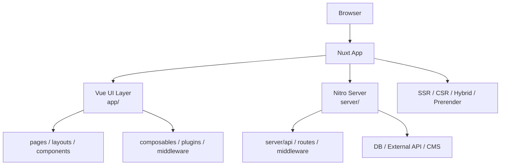

# Nuxt.js 상세 정리

작성 기준일: 2026-04-14  
조사 방식: 웹검색 기반 최신 조사  
주요 참고: `nuxt.com` 공식 Docs / Blog / GitHub Releases

## 1. 문서 목적

이 문서는 `Nuxt.js`를 처음 배우는 사람부터 이미 Vue를 써 본 사람까지, "Nuxt가 정확히 무엇이고 2026년 기준으로 어떤 방식으로 이해하고 써야 하는지"를 한 번에 연결해서 이해할 수 있도록 정리한 학습 문서다.

단순히 기능 이름만 나열하지 않고 아래를 하나의 흐름으로 묶어서 설명한다.

- Nuxt의 정체와 역할
- Nuxt 4 기준 프로젝트 구조
- Vue 앱 계층과 Nitro 서버 계층의 분리
- `useFetch`, `useAsyncData`, `$fetch`, `useState`
- SSR, CSR, 하이브리드 렌더링, prerender, `routeRules`
- 플러그인, 모듈, auto-import, 레이아웃, 미들웨어
- 배포와 운영 방식
- Nuxt 3에서 Nuxt 4로 넘어오며 달라진 점
- Nuxt 5 호환성 준비 방향

---

## 2. 2026-04 기준 Nuxt의 현재 상태

지금 Nuxt를 공부한다면 기준점은 `Nuxt 4`다.

- `2025-07-15`: 공식 블로그에서 `Nuxt 4.0`이 발표됐다.
- `Nuxt 4.0`은 새 `app/` 디렉터리 구조, 더 정리된 데이터 패칭, 더 나은 타입 안정성을 중심으로 소개됐다.
- GitHub Releases 기준 `2026-03-12` 시점 최신 안정 릴리스 표기는 `v4.4.0/v4.4.2`다.
- 릴리스 노트에 따르면 `v4.4.2`는 기능 변경 없는 재배포 성격이고, 실제 핵심 변경은 `4.4.0`에 담겨 있다.

즉 지금의 Nuxt는 단순히 "Vue SSR 프레임워크"로 보면 부족하다.

현재의 Nuxt는:

- `Vue 기반 full-stack framework`
- `Vue 앱 + Nitro 서버`의 단일 코드베이스
- `SSR 기본`
- `하이브리드 렌더링`과 `routeRules`
- `module ecosystem`
- `edge / serverless / static / Node 배포`

까지 한 번에 이해해야 한다.

또 중요한 점이 있다.

- Nuxt 4는 Nuxt 3와 완전히 다른 철학이라기보다 구조를 더 명확히 정리한 안정화 메이저다.
- 즉 Nuxt 3 경험이 있으면 적응은 어렵지 않지만, 새 프로젝트 기준 기본 구조는 `app/` 중심으로 생각하는 것이 맞다.
- 그리고 Nuxt 5는 아직 개발 중이지만, Nuxt 4.2+부터 `future.compatibilityVersion: 5`로 일부 차기 동작을 미리 테스트할 수 있다.

---

## 3. Nuxt를 한 줄로 정의하면

`Nuxt`는 `Vue 애플리케이션에 라우팅, SSR, 데이터 패칭, 서버 엔드포인트, 배포 추상화, 모듈 생태계를 결합한 full-stack 프레임워크`다.

좀 더 풀어서 말하면:

- Vue는 UI를 만드는 라이브러리다.
- Nuxt는 그 Vue 앱을 실제 웹 서비스 형태로 운영하기 위한 규약과 서버 계층을 함께 준다.
- 그래서 화면만 만드는 것이 아니라, 서버 렌더링, SEO, 데이터 전달, API 엔드포인트, 캐시 전략, 배포 방식을 함께 다룬다.

React 진영의 Next.js에 대응되는 Vue 진영의 대표 프레임워크라고 이해해도 크게 틀리지 않는다.

다만 Nuxt는 Vue 문법과 Vue 생태계 특성을 강하게 살린다.

- `.vue` 파일 중심 개발
- auto-import
- composable 패턴
- layout / page / middleware 규약
- module 기반 확장

이 조합이 Nuxt 개발 경험의 핵심이다.

---

## 4. 왜 Nuxt를 쓰는가

Vue만으로 앱을 만들면 자유도는 높지만, 서비스 규모가 커질수록 아래 질문이 반복된다.

- URL과 화면 구조를 어떻게 연결할 것인가
- SSR과 CSR을 어떻게 섞을 것인가
- SEO와 meta 태그를 어디에서 관리할 것인가
- API와 페이지를 같은 저장소에서 어떻게 운영할 것인가
- 서버와 클라이언트에서 데이터를 중복 요청하지 않으려면 어떻게 해야 하는가
- 모듈과 플러그인을 어떤 규약으로 붙일 것인가
- 정적 사이트, Node 서버, edge, serverless에 각각 어떻게 배포할 것인가

Nuxt는 이 문제를 다음 방식으로 푼다.

- `파일 기반 라우팅`
- `SSR 기본값`
- `Nitro` 기반 서버 엔진
- `useFetch`, `useAsyncData`, `useState` 같은 SSR 친화 composable
- `routeRules`를 통한 하이브리드 렌더링
- `Unhead` 기반 SEO/meta 관리
- `Nuxt Modules`를 통한 확장

즉 Nuxt는 Vue를 서비스 프레임워크로 올려 주는 역할을 한다.

---

## 5. 먼저 큰 그림



이 그림에서 중요한 점은 Nuxt가 하나의 레이어가 아니라 두 개의 실행 문맥을 함께 다룬다는 것이다.

- `Vue 앱 문맥`: 화면, 페이지, 레이아웃, 컴포넌트, route middleware
- `Nitro 서버 문맥`: API, 서버 미들웨어, 서버 유틸, 배포 프리셋

Nuxt를 잘 이해하려면 "Vue 앱"과 "서버 엔진"을 분리해서 생각해야 한다.

---

## 6. Nuxt의 핵심 철학

### 6.1 DX 중심

공식 Introduction이 가장 먼저 강조하는 것은 `Developer Experience`다.

즉 Nuxt는:

- 웹 개발을 더 직관적으로 만들고
- 반복 설정을 줄이고
- 타입과 규약을 기본 제공하고
- 프로덕션 품질의 앱을 빠르게 만들게 하는 것

을 목표로 한다.

그래서 Nuxt는 도구를 많이 드러내기보다, 먼저 "그냥 `.vue`를 쓰기 시작하면 동작하는 경험"을 준다.

### 6.2 Convention over Configuration

Nuxt는 강한 규약을 통해 자동화를 제공한다.

대표 예:

- `app/pages/`에 파일을 두면 라우트 생성
- `app/components/`에 두면 auto-import
- `app/plugins/`에 두면 자동 등록
- `server/api/`에 두면 API 생성

즉 import와 registration을 수동으로 반복하기보다, "정해진 위치에 두면 자동으로 연결"하는 방향이다.

### 6.3 SSR 기본

Nuxt는 기본적으로 `universal rendering`을 사용한다.

이 말은:

- 서버에서 HTML을 먼저 렌더링하고
- 브라우저에서 hydration을 이어서 수행한다

는 뜻이다.

즉 순수 SPA를 후처리로 지원하는 것이 아니라, SSR을 기본값으로 두고 필요하면 CSR이나 hybrid로 바꾸는 구조다.

### 6.4 벤더 종속 최소화

공식 문서는 Nuxt가 `no vendor lock-in`을 강조한다.

즉 특정 클라우드에만 묶이지 않고:

- Node
- Deno
- static hosting
- serverless
- edge

등 다양한 환경으로 배포할 수 있게 설계되어 있다.

이 유연성을 실제로 담당하는 축이 `Nitro`다.

---

## 7. Nuxt 4의 프로젝트 구조

### 7.1 Nuxt 4의 가장 큰 구조 변화

Nuxt 4의 대표적인 변화 중 하나가 새 기본 디렉터리 구조다.

핵심은 아래다.

- 기본 `srcDir`가 `app/`로 이동
- `server/`는 루트에 위치
- `public/`, `modules/`, `layers/`, `shared/`도 루트 기준
- `~` alias는 기본적으로 `app/`를 가리킴

즉 Nuxt 4는 "앱 코드"와 "서버 코드"를 물리적으로 분리하는 쪽으로 정리됐다.

### 7.2 기본 예시 구조

공식 업그레이드 가이드가 제시하는 Nuxt 4 기본 구조는 대략 아래와 같다.

```txt
app/
  assets/
  components/
  composables/
  layouts/
  middleware/
  pages/
  plugins/
  utils/
  app.config.ts
  app.vue
public/
server/
  api/
  middleware/
  plugins/
  routes/
  utils/
shared/
modules/
nuxt.config.ts
```

이 구조는 단순히 보기 좋으라고 바뀐 것이 아니다.

공식 문서가 설명하는 이유:

- 파일 감시 범위를 줄여 개발 성능 개선
- 앱 문맥과 서버 문맥의 타입 분리
- IDE 자동완성과 타입 안정성 개선

즉 Nuxt 4에서는 폴더 구조 자체가 아키텍처의 일부다.

### 7.3 `app/` 디렉터리의 의미

`app/`은 Vue 앱 계층의 중심이다.

여기에는 보통 아래가 들어간다.

- `components/`
- `composables/`
- `layouts/`
- `middleware/`
- `pages/`
- `plugins/`
- `utils/`
- `app.vue`

즉 브라우저 UI와 라우팅, 공통 composable, 플러그인 설정 대부분은 `app/` 안에 있다.

### 7.4 `server/` 디렉터리의 의미

`server/`는 Nitro가 읽는 서버 계층이다.

대표 하위 디렉터리:

- `server/api/`
- `server/routes/`
- `server/middleware/`
- `server/utils/`
- `server/plugins/`

이 구조 덕분에:

- Vue 화면 코드와
- 서버 request handler 코드를

한 프로젝트 안에서 관리하면서도 문맥을 분리할 수 있다.

### 7.5 `shared/`

Nuxt 4에서는 `shared/`도 중요하다.

`shared/`는:

- Vue 앱과
- Nitro 서버

양쪽에서 모두 안전하게 쓸 수 있는 코드를 두는 곳이다.

예:

- 타입 정의
- 순수 함수 유틸
- 환경 비의존 로직

단, 이 폴더 안의 코드는 Vue 전용 API나 Nitro 전용 API를 import하면 안 된다.

즉 `shared/`는 truly shared code를 위한 공간이다.

---

## 8. UI 계층: `app.vue`, pages, layouts, components

### 8.1 `app.vue`

Nuxt에서 `app.vue`는 앱의 entrypoint 역할을 한다.

Vue에서 익숙한 `main.ts`가 직접 보이지 않는 이유는, Nuxt가 그 초기화 과정을 내부에서 처리하기 때문이다.

가장 단순한 `app.vue`는 전체 라우트에 공통으로 렌더되는 루트 UI라고 보면 된다.

### 8.2 Pages

`app/pages/` 아래의 `.vue` 파일은 파일 기반 라우팅의 기준이 된다.

예:

```txt
app/pages/index.vue
app/pages/about.vue
app/pages/posts/[id].vue
```

는 각각:

- `/`
- `/about`
- `/posts/:id`

로 연결된다.

라우팅은 Vue Router 기반이며, Nuxt가 파일 구조를 읽어 라우트를 자동 생성한다.

### 8.3 Layouts

`app/layouts/`는 여러 페이지를 감싸는 공통 UI를 담는다.

대표 예:

- 헤더
- 사이드바
- 푸터
- 대시보드 shell

레이아웃을 쓰려면 보통 `app.vue`에서 `<NuxtLayout>`과 `<NuxtPage>`를 같이 쓴다.

```vue
<template>
  <NuxtLayout>
    <NuxtPage />
  </NuxtLayout>
</template>
```

그리고 각 페이지에서는 `definePageMeta()`로 레이아웃을 지정할 수 있다.

### 8.4 Components

`app/components/`의 컴포넌트는 자동 import된다.

즉 매번:

```ts
import MyButton from '~/components/MyButton.vue'
```

를 쓰지 않아도 된다.

이건 Nuxt 개발 경험의 가장 체감되는 특징 중 하나다.

다만 자동 import는 단순 global pollution이 아니다.

- 타입 정보 유지
- IDE 자동완성 유지
- production build에는 사용된 것만 포함

즉 편의성과 tree-shaking을 같이 잡는 구조다.

### 8.5 페이지가 없어도 앱은 동작한다

이건 Next.js와 다른 감각을 주는 부분이다.

Nuxt는 `app.vue`만으로도 앱을 만들 수 있다.

즉:

- 반드시 페이지 라우터부터 시작할 필요는 없고
- 단일 화면 앱이라면 `app.vue` 중심 시작도 가능하다

하지만 여러 URL이 있는 서비스라면 결국 `pages/` 구조를 쓰는 편이 자연스럽다.

---

## 9. Routing과 Route Middleware

### 9.1 Routing 기본

Nuxt 라우팅은 `app/pages/` 기반 file-system router다.

장점:

- 명시적 라우터 설정 코드 감소
- 디렉터리 구조와 URL 구조가 직관적으로 연결
- 각 페이지가 자동으로 code-splitting됨

즉 요청된 route에 필요한 JavaScript만 내보내도록 기본 최적화가 붙어 있다.

### 9.2 `NuxtLink`

Nuxt 내비게이션은 `<NuxtLink>`를 중심으로 이뤄진다.

Hydration 이후에는:

- full page reload 없이
- 브라우저 URL만 갱신하고
- 필요한 페이지 chunk와 payload를 불러오는 방식

으로 동작한다.

또 중요한 점:

- `NuxtLink`가 viewport에 들어오면
- Nuxt는 대상 페이지의 컴포넌트와 payload를 미리 prefetch할 수 있다.

이게 체감 내비게이션 속도에 영향을 준다.

### 9.3 Route Params

동적 라우트에서는 `useRoute()`로 현재 파라미터를 읽는다.

예:

```vue
<script setup lang="ts">
const route = useRoute()
console.log(route.params.id)
</script>
```

이 패턴은 Vue Router에 익숙하면 자연스럽게 이해할 수 있다.

### 9.4 Route Middleware

Nuxt의 route middleware는 `Vue 앱 문맥`에서 실행된다.

이건 서버 미들웨어와 이름이 비슷해서 자주 헷갈린다.

중요한 구분:

- `route middleware`: 페이지 이동 전 실행, 클라이언트/앱 라우팅 계층
- `server middleware`: Nitro 요청 처리 계층

즉 인증 리다이렉션 같은 페이지 이동 제어는 route middleware에서 처리하는 경우가 많다.

### 9.5 Route Middleware 종류

공식 문서는 3종류를 설명한다.

- inline middleware
- named middleware
- global middleware

파일 위치는 `app/middleware/`다.

예:

- `auth.ts`
- `analytics.global.ts`

같이 둘 수 있다.

### 9.6 Route Validation

페이지별 유효성 검사도 가능하다.

`definePageMeta()` 안의 `validate()`를 사용하면:

- 특정 파라미터 형식 검증
- 유효하지 않으면 404 처리

를 구현할 수 있다.

즉 "router guard"만이 아니라 "페이지 메타 수준의 정적 검증"도 가능하다.

---

## 10. Auto-import: Nuxt의 핵심 생산성 기능

### 10.1 무엇이 auto-import되는가

Nuxt는 아래를 자동 import한다.

- Vue APIs 일부
- Nuxt composables
- `app/components/`
- `app/composables/`
- `app/utils/`
- `server/utils/` 일부

즉 코드에서 명시 import 없이도 바로 쓸 수 있는 것이 많다.

예:

```vue
<script setup lang="ts">
const count = ref(1)
const route = useRoute()
</script>
```

### 10.2 왜 중요한가

이 기능은 단순히 코드가 짧아지는 수준을 넘는다.

- 보일러플레이트 감소
- composable 패턴 강화
- 디렉터리 규약과 연결
- 타입과 IDE 지원 유지

즉 Nuxt는 "구조를 정하면 생산성이 올라가게" 설계돼 있다.

### 10.3 주의할 점

편하다고 해서 아무 데나 넣으면 구조가 흐트러질 수 있다.

실무에서는 보통 아래처럼 구분하는 편이 좋다.

- `components/`: UI 조각
- `composables/`: 재사용 가능한 상태/로직
- `utils/`: 순수 함수
- `shared/`: 앱/서버 공용 코드

즉 auto-import는 편의 기능이지, 구조 설계를 대신해 주지는 않는다.

---

## 11. Plugins와 Modules

### 11.1 Plugins

`app/plugins/`는 Vue 앱 생성 시점에 실행되는 플러그인 시스템이다.

자동 등록되므로 별도 `nuxt.config.ts` 등록이 필요 없다.

예:

- third-party Vue plugin 등록
- 앱 초기화 훅 연결
- `NuxtApp` helper 제공

### 11.2 `.client` / `.server` suffix

플러그인은 파일명 suffix로 실행 환경을 나눌 수 있다.

- `analytics.client.ts`
- `some-plugin.server.ts`

이 패턴은 브라우저 전용 라이브러리와 SSR 분리에 매우 중요하다.

### 11.3 Object Syntax Plugin

Nuxt 플러그인은 단순 함수뿐 아니라 object syntax도 지원한다.

이 방식에서는:

- `name`
- `enforce`
- `hooks`
- `parallel`
- `dependsOn`

같은 메타정보를 명시할 수 있다.

즉 복잡한 플러그인 의존성 제어나 로딩 순서 관리가 가능하다.

### 11.4 Modules

Nuxt의 module 시스템은 프레임워크 핵심을 확장하는 공식적인 방식이다.

모듈이 할 수 있는 일:

- 템플릿 추가
- 설정 주입
- 플러그인 등록
- 컴포넌트/서버 핸들러 주입
- 빌드 설정 변경

즉 프로젝트 공통 커스터마이징을 재사용 가능한 패키지로 추상화할 수 있다.

### 11.5 Nuxt 생태계의 강점

Nuxt는 module ecosystem이 강한 편이다.

공식 문서가 설명하는 분류:

- `@nuxt/*`: 공식 모듈
- `@nuxtjs/*`: 커뮤니티 검증 모듈
- `nuxt-*`: 일반 커뮤니티 모듈
- 사내 private module

즉 기능이 모자라면 직접 우회 구현하기 전에 "공식/커뮤니티 모듈이 있는가"를 먼저 보는 것이 좋다.

---

## 12. 데이터 패칭: `$fetch`, `useFetch`, `useAsyncData`

### 12.1 Nuxt 데이터 패칭의 핵심 문제

SSR 프레임워크에서 자주 생기는 문제는 같다.

- 서버에서 한 번 요청
- 클라이언트 hydration 후 또 한 번 요청

즉 같은 데이터를 두 번 가져와서:

- hydration 문제
- TTI 증가
- 네트워크 낭비

가 생긴다.

Nuxt는 이를 해결하려고 데이터 패칭 composable을 제공한다.

### 12.2 `$fetch`

`$fetch`는 가장 단순한 요청 도구다.

특징:

- ofetch 기반
- 서버/클라이언트 어디서나 사용 가능
- 이벤트 기반 요청에 적합

하지만 중요한 점:

- SSR setup에서 그냥 `$fetch`만 쓰면
- 서버와 클라이언트에서 중복 요청될 수 있다.

즉 초기 렌더 데이터는 `$fetch`만으로 처리하는 것이 아니라 `useFetch`나 `useAsyncData`와 같이 설계하는 것이 좋다.

### 12.3 `useFetch`

`useFetch`는 Nuxt에서 가장 자주 쓰는 데이터 패칭 composable이다.

공식 설명의 핵심:

- 내부적으로 `$fetch` 사용
- SSR-safe
- 서버에서 가져온 데이터를 payload로 클라이언트에 전달
- hydration 시 같은 데이터를 다시 요청하지 않도록 도와줌

즉 "페이지 초기 데이터"의 기본 선택지라고 보면 된다.

### 12.4 `useAsyncData`

`useAsyncData`는 `useFetch`보다 더 일반적인 추상화다.

차이:

- `useFetch`는 HTTP 요청에 특화된 편의 래퍼
- `useAsyncData`는 임의의 async 로직을 감쌀 수 있는 범용 도구

예:

- CMS SDK 호출
- DB 래퍼 호출
- 여러 비동기 작업 조합

즉 HTTP URL 하나면 `useFetch`, 더 자유로운 조합이면 `useAsyncData`가 자연스럽다.

### 12.5 payload 전달

Nuxt는 서버에서 가져온 데이터를 `useNuxtApp().payload`에 실어 클라이언트 hydration에 활용한다.

이게 중요한 이유:

- 서버 렌더 결과와
- 클라이언트 상태 시작값이

일치해야 hydration mismatch를 줄일 수 있기 때문이다.

즉 `useFetch`와 `useAsyncData`는 단순 네트워크 헬퍼가 아니라 SSR 일관성 도구다.

### 12.6 기본 Suspense 동작

Nuxt는 내부적으로 Vue `<Suspense>`를 활용한다.

그래서 기본적으로는:

- 페이지 이동 전에 필요한 async data를 기다리고
- 준비되면 렌더링

흐름을 가진다.

즉 데이터가 준비되기 전 navigation blocking이 기본 동작이다.

### 12.7 `lazy`

모든 데이터를 navigation blocking으로 기다리는 것이 좋은 것은 아니다.

`lazy: true`를 쓰면:

- 페이지 이동 자체는 먼저 진행하고
- 데이터는 나중에 채운다

즉 UX와 loading state를 직접 관리하는 대신, 초반 전환을 더 빠르게 만들 수 있다.

### 12.8 `server: false`

`server: false` 옵션은 초기 렌더 때 서버에서 가져오지 않고 클라이언트에서만 가져오게 한다.

적합한 경우:

- SEO 비중이 낮은 데이터
- 로그인 후 사용자별 부가 정보
- 초기 HTML에 꼭 없어도 되는 데이터

즉 모든 데이터가 SSR에 적합한 것은 아니라는 점을 Nuxt가 옵션 수준에서 명확히 드러낸다.

### 12.9 키와 공유 상태

Nuxt 4의 데이터 레이어는 "같은 key를 가진 `useAsyncData` / `useFetch`는 같은 refs를 공유"하는 방향으로 정리됐다.

즉 같은 key를 여러 컴포넌트가 쓰면:

- `data`
- `error`
- `status`

를 공유하게 된다.

이건 효율적이지만 주의점도 있다.

- key가 같으면 옵션 일관성이 필요하다.
- 충돌하는 옵션을 섞으면 의도치 않은 동작이나 경고가 생길 수 있다.

즉 key 설계가 중요하다.

### 12.10 최신 릴리스 기준 개선

Nuxt `v4.4.0/v4.4.2`에서는 `createUseFetch`와 `createUseAsyncData`가 하이라이트로 소개됐다.

이 기능으로:

- 프로젝트 맞춤 기본 옵션을 가진 fetch composable을 만들고
- `baseURL`, interceptor, 공통 헤더 같은 정책을 묶을 수 있다.

즉 단순 util 함수가 아니라 "Nuxt 데이터 레이어를 프로젝트 표준 API로 감싸는 방식"이 공식 지원된 셈이다.

---

## 13. 상태 관리: `useState`와 Pinia

### 13.1 `useState`

Nuxt의 `useState`는 SSR-friendly shared state를 위한 composable이다.

핵심 특징:

- `ref`처럼 보이지만 SSR 안전성 고려
- 고유 key 기준으로 상태 공유
- 서버 렌더 후 hydration에서 값 보존

즉 단순 글로벌 ref보다 Nuxt 문맥에 맞는 상태 저장소라고 볼 수 있다.

### 13.2 왜 일반 `ref`만 쓰면 안 되나

공식 문서는 강하게 경고한다.

예를 들어:

```ts
export const myState = ref({})
```

를 setup 밖에서 만들면 서버 요청 간 상태가 공유될 수 있다.

이건:

- 메모리 누수
- 요청 간 데이터 오염

같은 심각한 문제로 이어질 수 있다.

즉 SSR 환경에서는 "서버 프로세스 메모리에 전역 ref"라는 개념을 조심해야 한다.

### 13.3 `useState` 사용 기준

적합한 경우:

- 여러 컴포넌트에서 공유하는 간단한 상태
- hydration 시 유지돼야 하는 상태
- composable 기반 경량 상태

복잡한 도메인 스토어가 커지면 Pinia가 더 적합할 수 있다.

### 13.4 Pinia

Nuxt는 특정 상태 관리 도구를 강제하지 않는다.

하지만 공식 예시와 Vue 진영 표준 흐름상:

- 복잡한 글로벌 상태는 `Pinia`
- 가벼운 공용 상태는 `useState`

조합이 자연스럽다.

즉 Nuxt는 "작은 상태까지 무조건 스토어로 올려라"보다는, SSR 친화 기본 상태를 먼저 주고 필요하면 Pinia로 확장하는 구조다.

### 13.5 최신 릴리스 변화

`v4.4.0/v4.4.2`에서는 `clearNuxtState()`가 초기값으로 reset되는 개선도 포함됐다.

이건 작은 변화 같지만:

- 상태 초기화 semantics
- async data reset과의 일관성

측면에서 실무 UX가 좋아지는 변화다.

---

## 14. SSR, CSR, Universal Rendering

### 14.1 기본은 Universal Rendering

Nuxt는 기본적으로 `universal rendering`을 사용한다.

이 말은:

- 서버가 완성된 HTML을 먼저 반환
- 브라우저가 이후 JS를 받아 hydration

한다는 의미다.

장점:

- 빠른 첫 표시
- SEO 유리
- 저사양 기기 친화적
- 접근성 개선

### 14.2 CSR도 가능하다

원하면 `ssr: false`로 전역 CSR 앱처럼 운영할 수 있다.

적합한 경우:

- 내부 관리자 툴
- SEO 필요가 거의 없는 앱
- 아주 동적인 브라우저 앱

하지만 Nuxt의 강점은 SSR과 hybrid에 있으므로, 처음부터 CSR-only를 전제로 쓰는 경우는 상대적으로 적다.

### 14.3 Hydration을 이해해야 한다

Nuxt는 SSR 후 hydration을 수행한다.

즉 서버와 클라이언트가 같은 초기 상태와 같은 렌더 결과를 가져야 한다.

여기서 문제가 생기면 hydration mismatch가 발생한다.

공식 Best Practices가 강조하는 대표 원인:

- browser-only API를 서버에서 사용
- `Math.random()`, `new Date()` 같은 비일관 값 사용
- 클라이언트 조건 렌더링과 서버 렌더링 결과 불일치
- DOM 부작용이 큰 라이브러리 사용

즉 Nuxt에서 hydration warning은 단순 경고가 아니라 구조적 문제 신호로 봐야 한다.

---

## 15. 하이브리드 렌더링과 `routeRules`

### 15.1 Nuxt의 강한 차별점

Nuxt는 `routeRules`를 통해 route별로 렌더링 전략을 다르게 가져갈 수 있다.

이게 매우 중요하다.

예를 들어 한 앱 안에서:

- 홈은 정적 prerender
- 상품 페이지는 SWR
- 블로그는 ISR 비슷한 전략
- 관리자 영역은 CSR-only

식으로 섞을 수 있다.

즉 "앱 전체가 SSR이냐 CSR이냐"만 고르는 것이 아니다.

### 15.2 `routeRules` 예시 감각

공식 문서에서 나오는 대표 예시는 아래와 같은 느낌이다.

```ts
export default defineNuxtConfig({
  routeRules: {
    '/': { prerender: true },
    '/products/**': { swr: 3600 },
    '/blog/**': { isr: true },
    '/admin/**': { ssr: false },
  },
})
```

즉 Nuxt는 route 단위로 캐시/렌더링 정책을 선언적으로 붙인다.

### 15.3 `prerender`

`prerender`는 빌드 시 HTML을 미리 생성하는 전략이다.

적합한 경우:

- 변경 빈도가 낮은 페이지
- SEO가 중요한 문서형 콘텐츠
- 정적 호스팅에 올릴 페이지

### 15.4 `swr`

`swr`은 stale-while-revalidate 성격의 캐시 전략이다.

즉:

- 캐시된 결과를 먼저 주고
- 뒤에서 갱신

하는 구조로 이해하면 된다.

이 방식은:

- 응답 속도
- 최신성

사이의 균형을 잡는 데 유용하다.

### 15.5 `isr`

Nuxt 문서도 `isr`라는 route rule을 소개한다.

Next.js의 ISR 용어와 닮았지만, 내부 구현은 Nitro/배포 환경 맥락까지 함께 봐야 한다.

실무적으로는:

- on-demand 또는 일정 정책 기반 재생성
- CDN / edge 캐시 전략과 결합

정도로 이해하는 것이 안전하다.

### 15.6 `ssr: false`

특정 구간만 CSR로 전환하는 것도 가능하다.

예:

- `/admin/**`
- 복잡한 브라우저 전용 앱

이 패턴은 SEO가 필요 없는 사용자별 기능 구간에 유용하다.

### 15.7 왜 중요한가

Nuxt의 routeRules는 "렌더링 모드를 전역에서 하나 선택"하는 시대를 넘어서게 만든다.

즉 Nuxt는 서비스 구조를 더 현실적으로 반영한다.

- 공개 페이지
- 인증된 대시보드
- API
- 캐시 가능한 카탈로그
- 정적 문서

를 한 프레임워크 안에서 분리해 운영하기 좋다.

---

## 16. Prerendering과 Static Hosting

### 16.1 `nuxt generate`

Nuxt는 `nuxt generate`로 prerender 기반 정적 산출물을 만들 수 있다.

공식 설명에 따르면:

- Nitro crawler가 링크를 따라가며 prerender
- 결과는 `.output/public`에 생성

된다.

즉 정적 호스팅이 필요한 사이트에도 맞출 수 있다.

### 16.2 Crawl-based prerender

기본적으로는:

- 루트 `/`
- 그 페이지에서 링크된 페이지
- 그 페이지들이 다시 링크한 페이지

를 따라가며 prerender한다.

즉 사이트맵처럼 링크 구조가 잘 잡혀 있으면 자동 생성 효율이 높다.

### 16.3 언제 적합한가

- 문서 사이트
- 블로그
- 마케팅 페이지
- 변경이 적은 공개 콘텐츠

반대로 로그인 기반 동적 앱은 전체 정적화보다 hybrid가 더 자연스럽다.

---

## 17. Nitro: Nuxt 서버 엔진

### 17.1 Nitro란 무엇인가

Nuxt 서버는 `Nitro`가 담당한다.

공식 문서는 Nitro를 Nuxt의 server engine으로 설명한다.

핵심 역할:

- 서버 엔드포인트 제공
- 서버 미들웨어 실행
- routeRules 기반 하이브리드 렌더링
- 다양한 배포 환경 대응

즉 Nuxt의 full-stack 성격은 대부분 Nitro에서 나온다.

### 17.2 `server/api/`

`server/api/`는 API 엔드포인트를 만든다.

즉 별도 Express 서버 없이도:

- `/api/users`
- `/api/posts`

같은 핸들러를 같은 저장소 안에 둘 수 있다.

### 17.3 `server/routes/`

`server/routes/`는 API prefix에 한정되지 않는 일반 서버 라우트도 만들 수 있다.

즉 "웹 페이지 라우트"와는 별도로:

- webhook endpoint
- RSS
- sitemap
- custom server response

를 구성할 수 있다.

### 17.4 `server/middleware/`

서버 미들웨어는 요청 처리 계층에서 실행된다.

이건 route middleware와 다르다.

즉:

- 인증 리다이렉션 같은 페이지 이동 로직은 route middleware
- request/response 처리 로직은 server middleware

로 구분해서 생각해야 한다.

### 17.5 `.output`

프로덕션 빌드 후 Nitro는 앱과 서버를 `.output` 디렉터리로 만든다.

공식 설명상 이 출력은:

- 경량화되어 있고
- 필요한 런타임 산출물 중심이며
- 다양한 JS 실행 환경에 배포 가능하다

즉 `.output`은 Nuxt 운영 배포의 핵심 artifact다.

---

## 18. SEO와 Meta 관리

### 18.1 기본 축은 Unhead

Nuxt의 head tag 관리는 `Unhead`가 담당한다.

즉 메타 태그 관리는 별도 라이브러리 선택 문제가 아니라 프레임워크 기본 기능이다.

### 18.2 `app.head`

변하지 않는 사이트 전역 기본값은 `nuxt.config.ts`의 `app.head`에 둘 수 있다.

대표 예:

- 기본 title
- html lang
- favicon

즉 정적 기본값은 config에서 관리하면 된다.

### 18.3 `useHead`

반응형 head 관리가 필요하면 `useHead()`를 쓴다.

이건 페이지/레이아웃/컴포넌트 수준에서 동적 메타를 다룰 때 유용하다.

### 18.4 `useSeoMeta`

SEO 중심 메타는 `useSeoMeta()`가 특히 편하다.

장점:

- 타입 안전성
- 오타 방지
- Open Graph, Twitter card 등 선언 쉬움

즉 SEO 메타를 객체 기반으로 안정적으로 다룰 수 있다.

### 18.5 `definePageMeta`

페이지 자체 메타는 `definePageMeta()`로 둘 수 있다.

예:

- 페이지 title
- 레이아웃 지정
- validate
- middleware 연결

즉 페이지 단위 설정의 중심이라고 보면 된다.

---

## 19. 성능 최적화 포인트

### 19.1 Code Splitting

Nuxt는 기본적으로 페이지 단위 code splitting을 수행한다.

즉 라우트별로 필요한 JS만 전달하도록 기본 구조가 짜여 있다.

### 19.2 Lazy Components

자동 import되는 컴포넌트라도 `Lazy` prefix를 붙여 동적 import처럼 사용할 수 있다.

예:

```vue
<LazyMountainsList v-if="show" />
```

이건:

- 항상 필요하지 않은 큰 컴포넌트
- 모달
- 접히는 섹션

같은 곳에서 유용하다.

### 19.3 Lazy Hydration

Nuxt는 lazy hydration도 지원한다.

즉 컴포넌트를 즉시 interactive하게 만들지 않고:

- visible 되었을 때
- idle일 때
- 일정 시간 후

등 원하는 전략으로 hydration을 늦출 수 있다.

대표 전략:

- `hydrate-on-visible`
- `hydrate-on-idle`
- `hydrate-after`
- `hydrate-never`

이건 초반 JS 부담을 줄일 때 매우 유용하다.

### 19.4 Server Components / Islands

Nuxt의 server-only components와 islands는 아직 실험적 축이다.

공식 컴포넌트 디렉터리 문서는:

- `experimental.componentIslands` 활성화
- `.server.vue` suffix

패턴을 설명한다.

즉 현재 Nuxt의 기본 mental model은 여전히 SSR Vue 앱이지만, 더 세밀한 island architecture 쪽 실험도 진행 중이라고 이해하면 된다.

### 19.5 최신 릴리스 성능 변화

`v4.4.0/v4.4.2` 릴리스는 성능 쪽 변화도 강조했다.

대표 예:

- `unrouting` 기반 파일 시스템 라우트 생성 전환
- route generation 더 결정적이고 빠르게 개선
- cached routes의 payload 처리 개선
- `payloadExtraction: 'client'` 옵션
- build profiling 지원

즉 최근 Nuxt는 "단순 기능 추가"보다 대규모 앱 DX와 cold start, dev iteration 속도 개선에 많이 투자하고 있다.

---

## 20. 타입 안정성과 최신 개선 포인트

### 20.1 TypeScript 기본 지원

Nuxt는 TypeScript를 강하게 지원한다.

특징:

- `nuxt.config.ts`
- auto-generated types
- zero-config 성격의 TS 지원

즉 TS 설정을 처음부터 직접 깊게 만지지 않아도 시작이 쉽다.

### 20.2 Nuxt 4의 타입 분리

업그레이드 가이드가 특히 강조하는 변화는 문맥별 tsconfig 분리다.

예:

- `.nuxt/tsconfig.app.json`
- `.nuxt/tsconfig.server.json`
- `.nuxt/tsconfig.shared.json`
- `.nuxt/tsconfig.node.json`

이건 단순 파일 분리가 아니라:

- 앱 코드
- 서버 코드
- 공유 코드
- 빌드/설정 코드

의 타입 문맥을 더 정확히 나누는 의미가 있다.

### 20.3 Typed Layout Props

최신 안정 릴리스 `v4.4.0/v4.4.2`는 `definePageMeta`에서 레이아웃 props를 타입 안전하게 넘길 수 있게 한 점도 하이라이트로 소개했다.

이건 레이아웃 설계에서 꽤 유용하다.

예전에는:

- provide/inject
- 별도 store
- 우회적인 props 전달

을 고민해야 했던 부분이 더 정리됐다.

### 20.4 Vue Router v5

같은 릴리스에서 Vue Router v5로의 업그레이드도 주요 변화다.

실무에서 대부분은 투명하게 넘어가겠지만,

- router 확장
- typed routes 실험 기능
- 외부 라우터 관련 플러그인

을 건드리는 프로젝트라면 확인이 필요하다.

---

## 21. 배포와 운영

### 21.1 Nuxt는 어디에 배포할 수 있나

공식 Deployment 문서 기준 Nuxt는 아래에 배포 가능하다.

- Node.js server
- static hosting
- serverless
- edge / CDN 환경

즉 배포 유연성이 높은 편이다.

### 21.2 Node 서버 배포

기본 Node 프리셋에서는 `nuxt build` 후 아래 entrypoint로 서버를 실행한다.

```bash
node .output/server/index.mjs
```

즉 운영 서버 입장에서는 Nitro가 만든 standalone-ish 산출물을 실행하는 구조다.

### 21.3 환경 변수

공식 Deployment 문서에 나온 대표 런타임 변수:

- `NITRO_PORT` 또는 `PORT`
- `NITRO_HOST` 또는 `HOST`
- `NITRO_SSL_CERT`
- `NITRO_SSL_KEY`

실무에서는 보통 reverse proxy 뒤에서 돌리는 경우가 많다.

### 21.4 PM2 / Cluster

공식 문서는 PM2 예시도 제공한다.

즉 self-host 운영도 충분히 표준 경로로 다뤄지고 있다.

또 `NITRO_PRESET=node_cluster` 같은 프리셋으로 multi-process 활용도 가능하다.

### 21.5 Static Hosting

정적 호스팅이 목표라면:

- `nuxt generate`
- `.output/public`

흐름을 쓰면 된다.

즉 Nuxt는 SSR 프레임워크지만, 필요하면 pure static 쪽도 지원한다.

### 21.6 Universal Deployment

Introduction과 Server 문서가 공통으로 강조하는 것은:

- Nitro output이 범용적이며
- provider zero-config 지원이 많고
- edge / serverless / workers까지 대응한다

는 점이다.

즉 Nuxt 운영 전략은 단순 "Node 서버 올리기"에 갇혀 있지 않다.

---

## 22. Nuxt 3에서 Nuxt 4로 넘어오며 달라진 점

### 22.1 가장 큰 변화 요약

Nuxt 4는 급진적 재설계보다는 안정화와 구조 정리에 가깝다.

핵심 변화:

- 새 `app/` 기본 구조
- `server/`와 앱 문맥 분리
- 데이터 패칭 레이어 정리
- 타입 문맥 세분화
- 일부 naming / scanning / hydration semantics 정돈

### 22.2 디렉터리 구조 마이그레이션

Nuxt 4의 가장 눈에 띄는 변화는 폴더 구조다.

기존 Nuxt 3 프로젝트는 완전 강제 마이그레이션이 아니고 자동 감지도 지원하지만, 새 프로젝트 기준 기본값은 명확히 바뀌었다.

즉 신규 프로젝트는:

- 앱 코드는 `app/`
- 서버는 `server/`
- 정적 자산은 `public/`

으로 나누는 것이 표준이다.

### 22.3 데이터 패칭 레이어 정리

업그레이드 가이드가 `Singleton Data Fetching Layer`를 따로 다룰 정도로, Nuxt 4는 `useFetch` / `useAsyncData`의 동작 일관성을 많이 정리했다.

주요 포인트:

- 같은 key는 같은 refs 공유
- reactive key 지원
- `getCachedData` 동작 정리
- 마지막 consumer unmount 시 cleanup

즉 데이터 레이어가 더 예측 가능해졌다.

### 22.4 codemod 지원

Nuxt 팀은 Nuxt 4 migration을 위해 codemod 레시피도 제공한다.

대표 명령:

```bash
npx codemod@latest nuxt/4/migration-recipe
```

즉 메이저 업그레이드를 수동 diff만으로 하라는 접근이 아니라, 자동화된 migration path도 준비하고 있다.

---

## 23. Nuxt 5 준비

### 23.1 아직 개발 중

공식 Upgrade Guide 기준 Nuxt 5는 아직 개발 중이다.

즉 지금 당장 "Nuxt 5 기준으로 공부"하는 것이 아니라:

- Nuxt 4 최신 버전을 기반으로 쓰되
- 차기 변경을 호환 모드로 미리 검토

하는 것이 맞다.

### 23.2 `future.compatibilityVersion: 5`

Nuxt 4.2+에서는 아래 설정으로 Nuxt 5 동작 일부를 미리 opt-in할 수 있다.

```ts
export default defineNuxtConfig({
  future: {
    compatibilityVersion: 5,
  },
})
```

이건 실무에서 중요하다.

- 갑자기 한 번에 대형 업그레이드하지 않고
- 미래 기본값을 점진적으로 검증할 수 있기 때문이다.

### 23.3 지금 준비해야 할 것

Nuxt 5를 대비한다면:

- Nuxt 4 최신 유지
- deprecated 동작 줄이기
- 새 디렉터리 구조 적응
- `useFetch` / `useAsyncData` key 설계 정리
- payload extraction, routing, typed features 변화 확인

정도가 현실적인 준비다.

---

## 24. 언제 Nuxt가 잘 맞는가

### 24.1 잘 맞는 경우

- Vue 기반 서비스 앱
- SEO가 중요한 사이트
- 마케팅 페이지와 앱이 함께 있는 구조
- CMS / 콘텐츠 / 블로그 + 인터랙션 혼합
- full-stack Vue 단일 저장소를 선호하는 팀

대표 예:

- SaaS 대시보드
- 커머스 프런트
- 콘텐츠 플랫폼
- 문서/커뮤니티 사이트

### 24.2 특히 강한 부분

- Vue 친화적인 DX
- 파일 기반 구조
- routeRules 기반 hybrid rendering
- Nitro 서버 통합
- module ecosystem

즉 "Vue를 서비스 프레임워크로 빠르게 확장"하는 점이 강점이다.

### 24.3 과할 수 있는 경우

- SEO가 전혀 필요 없는 소규모 브라우저 앱
- 아주 단순한 SPA
- 서버 계층이 완전히 분리된 조직 구조

이 경우는 순수 Vite + Vue가 더 단순할 수 있다.

---

## 25. 실무에서 자주 생기는 오해

### 오해 1: Nuxt는 그냥 Vue에 SSR 붙인 것뿐이다

아니다.

Nuxt의 핵심 가치는:

- SSR
- Nitro
- routeRules
- auto-import
- modules
- SEO/meta

가 한 프레임워크로 통합돼 있다는 점이다.

### 오해 2: `useFetch`와 `$fetch`는 아무 차이 없다

아니다.

- `$fetch`는 단순 요청 도구
- `useFetch`는 SSR payload 전달과 hydration 중복 요청 방지를 고려한 composable

즉 초기 렌더 데이터는 구분해서 써야 한다.

### 오해 3: route middleware와 server middleware는 비슷하다

이건 매우 자주 생기는 혼동이다.

- route middleware는 Vue 앱 라우팅 문맥
- server middleware는 Nitro 요청 처리 문맥

즉 실행 위치와 책임이 다르다.

### 오해 4: auto-import는 그냥 global이라 위험하다

Nuxt의 auto-import는 전통적인 무분별 global 등록과 다르다.

- 타입 유지
- IDE 지원 유지
- 사용된 것만 번들 포함

즉 규약 기반 최적화된 자동 import다.

### 오해 5: Nuxt는 특정 플랫폼에 종속된다

공식 문서는 오히려 vendor lock-in이 없다고 강조한다.

물론 호스팅별 경험 차이는 있지만, Nitro가 여러 배포 환경을 지원하는 것이 Nuxt의 강점 중 하나다.

---

## 26. 추천 학습 순서

Nuxt를 처음 공부한다면 아래 순서가 효율적이다.

### 1단계: 큰 그림

- Nuxt가 Vue 위에서 무엇을 해결하는지
- universal rendering 기본 개념
- Nitro가 왜 필요한지

### 2단계: 구조

- `app.vue`
- `pages/`
- `layouts/`
- `components/`
- `plugins/`
- `middleware/`
- `server/`

이 디렉터리 역할부터 익히기

### 3단계: 데이터 패칭

- `$fetch`
- `useFetch`
- `useAsyncData`
- `lazy`
- `server: false`

### 4단계: 상태와 hydration

- `useState`
- hydration mismatch 원인
- client-only 코드 분리

### 5단계: 렌더링 전략

- SSR
- CSR
- hybrid rendering
- `routeRules`
- prerender

### 6단계: 운영

- Nitro output
- Node 배포
- static hosting
- SEO/meta
- performance best practices

이 순서로 가면 문법보다 아키텍처 이해가 먼저 잡힌다.

---

## 27. 빠른 도입 체크리스트

새 Nuxt 프로젝트를 시작한다면 아래는 먼저 확인하는 것이 좋다.

- `Node.js 20.x+` 환경 준비
- `npm create nuxt@latest`로 새 프로젝트 시작
- `app/` 구조를 기본으로 쓸지 확인
- `server/`와 `shared/` 역할 구분
- 초기 데이터는 `$fetch`가 아니라 `useFetch` / `useAsyncData` 기준으로 설계
- 공용 상태는 `useState`와 Pinia 중 어디까지 쓸지 결정
- route middleware와 server middleware를 혼동하지 않도록 구조 설계
- `routeRules`로 prerender / swr / isr / csr-only 구간 분리 검토
- `useSeoMeta`, `useHead`, `definePageMeta` 사용 기준 정리
- 배포 대상이 Node, static, edge, serverless 중 무엇인지 결정
- Nuxt 5 준비가 필요하면 `future.compatibilityVersion: 5` 시험 여부 검토

이 체크리스트를 먼저 잡으면 이후 구조가 훨씬 덜 흔들린다.

---

## 28. 한 문장 결론

`Nuxt`는 단순한 Vue SSR 도구가 아니라, `Vue UI 계층`, `Nitro 서버`, `SSR/CSR/하이브리드 렌더링`, `데이터 전달`, `SEO`, `배포 추상화`, `모듈 생태계`를 함께 묶은 `Vue full-stack 프레임워크`다.

그래서 2026년 기준으로 Nuxt를 잘 쓴다는 것은:

- `app/`와 `server/` 문맥을 분리해서 이해하고
- `useFetch`와 `useAsyncData`를 올바르게 쓰고
- `routeRules`로 렌더링 전략을 설계하고
- SSR과 hydration 제약을 항상 의식하는 것

이라고 정리할 수 있다.

---

## 29. 공식 출처

- Docs 메인: <https://nuxt.com/docs/4.x>
- Introduction: <https://nuxt.com/docs/4.x/getting-started/introduction>
- Installation: <https://nuxt.com/docs/4.x/getting-started/installation>
- Views: <https://nuxt.com/docs/4.x/getting-started/views>
- Routing: <https://nuxt.com/docs/4.x/getting-started/routing>
- Data Fetching: <https://nuxt.com/docs/4.x/getting-started/data-fetching>
- State Management: <https://nuxt.com/docs/4.x/getting-started/state-management>
- SEO and Meta: <https://nuxt.com/docs/4.x/getting-started/seo-meta>
- Server: <https://nuxt.com/docs/4.x/getting-started/server>
- Deployment: <https://nuxt.com/docs/4.x/getting-started/deployment>
- Prerendering: <https://nuxt.com/docs/4.x/getting-started/prerendering>
- Upgrade Guide: <https://nuxt.com/docs/4.x/getting-started/upgrade>
- Rendering Modes: <https://nuxt.com/docs/4.x/guide/concepts/rendering>
- Auto-imports: <https://nuxt.com/docs/4.x/guide/concepts/auto-imports>
- Modules Concept: <https://nuxt.com/docs/4.x/guide/concepts/modules>
- Layouts: <https://nuxt.com/docs/4.x/guide/directory-structure/layouts>
- Plugins: <https://nuxt.com/docs/4.x/guide/directory-structure/plugins>
- Components: <https://nuxt.com/docs/4.x/guide/directory-structure/app/components>
- Shared Directory: <https://nuxt.com/docs/4.x/guide/directory-structure/shared>
- `useState`: <https://nuxt.com/docs/4.x/api/composables/use-state>
- `defineNuxtRouteMiddleware`: <https://nuxt.com/docs/4.x/api/utils/define-nuxt-route-middleware>
- `defineLazyHydrationComponent`: <https://nuxt.com/docs/4.x/api/utils/define-lazy-hydration-component>
- create nuxt command: <https://nuxt.com/docs/4.x/api/commands/init>
- Nuxt hydration best practices: <https://nuxt.com/docs/4.x/guide/best-practices/hydration>
- Nuxt 4.0 announcement: <https://nuxt.com/blog/v4>
- GitHub Releases: <https://github.com/nuxt/nuxt/releases>

<!-- study-links:start -->
## 관련 문서

- `webhook`: [[webhook/webhook|Webhook 상세 정리]]
- `react`: [[react/react|React 상세 정리]]
- `핵심 가치`: [[정보처리기사/1과목 소프트웨어 설계/005 애자일 개발 4가지 핵심 가치/005 애자일 개발 4가지 핵심 가치|005 애자일 개발 4가지 핵심 가치]]
- `vite`: [[vite/vite|Vite]]
- `미들웨어`: [[정보처리기사/1과목 소프트웨어 설계/054 미들웨어(Middleware)/054 미들웨어(Middleware)|054 미들웨어(Middleware)]]
- `물리적`: [[정보처리기사/5과목 정보시스템 구축 관리/320 관리적 물리적 기술적 보안/320 관리적 물리적 기술적 보안|320 관리적/물리적/기술적 보안]]
<!-- study-links:end -->
